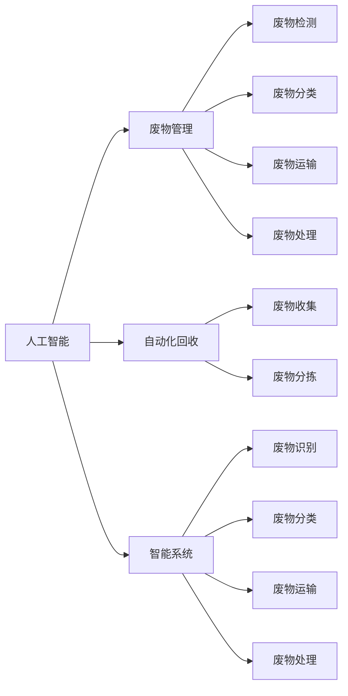

                 

# AI在废物管理中的应用：提高回收效率

> 关键词：人工智能,废物管理,自动化回收,智能系统,大数据,机器学习,深度学习

## 1. 背景介绍

在全球资源匮乏、环境污染日益严峻的当下，废物管理成为各国政府和企业面临的重要课题。传统的废物管理依赖于人力收集和处理，不仅效率低下，还容易引发二次污染和环境问题。因此，如何将人工智能(AI)技术引入废物管理，提升回收效率和环保水平，成为了当前研究的热点。

### 1.1 废物管理现状

当前，全球每年产生的垃圾总量已达20亿吨以上，其中绝大多数未能得到有效回收和利用。废物管理的主要问题包括：
- **效率低**：传统废物收集和处理依赖人力，效率低下，处理速度远远跟不上垃圾产生速度。
- **成本高**：人力成本高昂，且作业环境恶劣，容易发生工伤。
- **环境污染**：废物处理过程中可能造成二次污染，对生态系统带来负面影响。
- **资源浪费**：可回收资源未能有效分类和回收，导致资源大量浪费。

为解决这些问题，各国政府和企业纷纷引入AI技术，通过智能系统优化废物管理流程，提高回收效率和环保水平。

## 2. 核心概念与联系

### 2.1 核心概念概述

AI在废物管理中的应用，主要基于以下几个关键概念：

- **人工智能**：利用机器学习和深度学习技术，让机器具备类似于人的认知、决策和推理能力。
- **废物管理**：指对垃圾的收集、分类、处理和回收等各个环节进行优化管理，提升资源利用率和环境效益。
- **自动化回收**：利用机器人、传感器等技术，自动化完成废物收集、分拣和回收工作。
- **智能系统**：包括废物检测、分类、运输、处理等各个环节，通过AI技术实现智能化决策和自动化执行。
- **大数据**：对废物管理各个环节产生的大量数据进行收集和分析，为AI模型提供训练和优化的数据支撑。

这些概念之间存在紧密的联系，共同构成了AI在废物管理中的核心应用框架。

### 2.2 核心概念原理和架构的 Mermaid 流程图



这个流程图展示了人工智能与废物管理各环节之间的联系。人工智能通过自动化回收、智能系统和废物检测、分类、运输、处理等环节，实现了废物管理的智能化和自动化。

## 3. 核心算法原理 & 具体操作步骤

### 3.1 算法原理概述

AI在废物管理中的应用，主要基于以下算法原理：

- **机器学习**：利用历史数据训练模型，自动识别和分类废物，优化处理流程。
- **深度学习**：通过神经网络结构对大量数据进行训练，提升废物分类的准确性和处理效率。
- **计算机视觉**：使用图像处理技术，对废物进行自动识别和分类，提高处理精度。
- **自然语言处理(NLP)**：通过文本处理技术，自动化处理废物管理相关的文档和信息，提升信息处理效率。
- **强化学习**：通过奖励机制，优化废物管理的决策和执行过程，提升系统效率。

这些算法原理共同支撑了AI在废物管理中的应用，实现了废物的智能识别、分类、运输和处理等环节的自动化和智能化。

### 3.2 算法步骤详解

AI在废物管理中的应用主要包括以下几个关键步骤：

**Step 1: 数据收集和预处理**

- **数据收集**：收集废物管理的各个环节产生的数据，包括废物类型、体积、重量、位置等。
- **数据预处理**：对数据进行清洗、归一化、缺失值处理等预处理操作，提升数据质量。

**Step 2: 模型训练和优化**

- **模型选择**：根据具体任务选择合适的机器学习或深度学习模型，如决策树、随机森林、卷积神经网络(CNN)、循环神经网络(RNN)等。
- **数据划分**：将数据集划分为训练集、验证集和测试集，用于模型训练、调参和评估。
- **模型训练**：使用训练集对模型进行训练，调整超参数和模型结构，提高模型性能。
- **模型评估**：在验证集上评估模型性能，选择最优模型。
- **模型优化**：使用正则化、Dropout、Early Stopping等技术优化模型，避免过拟合。

**Step 3: 系统集成和部署**

- **系统集成**：将训练好的模型集成到废物管理系统，实现自动化决策和执行。
- **部署上线**：将系统部署到实际环境中，进行实时监测和反馈。

**Step 4: 持续监控和优化**

- **实时监控**：对废物管理系统的各个环节进行实时监控，收集系统反馈数据。
- **性能优化**：根据反馈数据，调整模型参数和系统配置，优化系统性能。

### 3.3 算法优缺点

AI在废物管理中的应用，具有以下优点：

- **高效自动化**：通过智能系统实现废物收集、分拣和处理的自动化，提升效率和处理速度。
- **精准分类**：利用深度学习和计算机视觉技术，提升废物分类的准确性和精度。
- **实时监测**：通过实时数据收集和分析，及时发现问题并进行调整，提升系统灵活性和可靠性。

同时，也存在一些缺点：

- **数据依赖**：系统的性能很大程度上依赖于数据质量，需要持续收集和更新数据。
- **初始投资高**：系统建设需要较高成本，包括硬件设备、软件开发和部署等。
- **技术复杂**：系统集成和优化需要一定技术水平，需要专业人员进行维护和优化。

### 3.4 算法应用领域

AI在废物管理中的应用，主要应用于以下几个领域：

- **废物检测**：利用计算机视觉技术，自动识别和标记废物类型。
- **废物分类**：通过机器学习模型，自动对废物进行分类和回收。
- **废物运输**：使用自动化设备，将废物运输至指定地点，实现高效物流。
- **废物处理**：利用智能设备，对废物进行无害化处理和资源化利用。
- **数据分析**：通过大数据分析，优化废物管理流程，提升资源利用率。

## 4. 数学模型和公式 & 详细讲解

### 4.1 数学模型构建

AI在废物管理中的应用，主要基于以下几个数学模型：

- **监督学习模型**：利用历史数据训练模型，自动分类废物，提升处理效率。
- **无监督学习模型**：利用数据自学习，自动发现数据中的规律，提升系统自主性。
- **强化学习模型**：通过奖励机制，优化废物管理的决策和执行过程。

### 4.2 公式推导过程

以废物分类为例，假设使用CNN模型进行分类。模型的输入为废物图像 $x$，输出为废物类型的概率分布 $p(y|x)$。模型的目标是最小化交叉熵损失函数，推导过程如下：

$$
\min_{\theta} -\frac{1}{N}\sum_{i=1}^N \sum_{j=1}^{C} y_{ij}\log(p_{ij})
$$

其中，$N$ 为样本数量，$C$ 为废物类型数量，$y_{ij}$ 为第 $i$ 个样本的第 $j$ 类标签，$p_{ij}$ 为模型预测该样本为第 $j$ 类的概率。

### 4.3 案例分析与讲解

以废物分类为例，假设使用预训练的ResNet模型进行废物分类。具体步骤如下：

1. **数据准备**：收集废物图像，并标记废物类型。
2. **模型加载**：加载预训练的ResNet模型，并将其微调到废物分类任务上。
3. **数据增强**：对废物图像进行数据增强，如旋转、缩放、裁剪等。
4. **模型训练**：使用增强后的数据对模型进行训练，调整超参数，提高模型性能。
5. **模型评估**：在验证集上评估模型性能，选择最优模型。
6. **系统集成**：将模型集成到废物管理系统中，实现自动化分类。

## 5. 项目实践：代码实例和详细解释说明

### 5.1 开发环境搭建

在进行废物管理系统的开发前，需要搭建好开发环境，具体步骤如下：

1. **环境准备**：安装Python、PyTorch等开发环境。
2. **工具安装**：安装必要的工具包，如Pillow、TensorFlow等。
3. **数据预处理**：对废物图像进行预处理，如归一化、裁剪等。

### 5.2 源代码详细实现

以下是一个基于CNN模型的废物分类的PyTorch代码实现：

```python
import torch
import torchvision
from torchvision import transforms
from torchvision.models import resnet50

# 数据预处理
transform = transforms.Compose([
    transforms.Resize((224, 224)),
    transforms.ToTensor(),
    transforms.Normalize(mean=[0.485, 0.456, 0.406], std=[0.229, 0.224, 0.225])
])

# 加载数据集
train_dataset = torchvision.datasets.ImageFolder('train_data', transform=transform)
test_dataset = torchvision.datasets.ImageFolder('test_data', transform=transform)

# 加载模型
model = resnet50(pretrained=True)
model.fc = torch.nn.Linear(2048, 2)

# 训练模型
def train(model, train_loader, optimizer, device):
    model.to(device)
    for epoch in range(10):
        model.train()
        for batch_idx, (data, target) in enumerate(train_loader):
            data, target = data.to(device), target.to(device)
            optimizer.zero_grad()
            output = model(data)
            loss = torch.nn.functional.cross_entropy(output, target)
            loss.backward()
            optimizer.step()
        print(f'Epoch {epoch+1}, Loss: {loss.item()}')

# 测试模型
def test(model, test_loader, device):
    model.eval()
    correct = 0
    total = 0
    with torch.no_grad():
        for data, target in test_loader:
            data, target = data.to(device), target.to(device)
            output = model(data)
            _, predicted = torch.max(output.data, 1)
            total += target.size(0)
            correct += (predicted == target).sum().item()
    print(f'Test Accuracy: {correct/total*100}%')

# 数据加载器
train_loader = torch.utils.data.DataLoader(train_dataset, batch_size=64, shuffle=True)
test_loader = torch.utils.data.DataLoader(test_dataset, batch_size=64, shuffle=False)

# 优化器
optimizer = torch.optim.SGD(model.parameters(), lr=0.001, momentum=0.9)

# 模型训练
train(model, train_loader, optimizer, device)

# 模型测试
test(model, test_loader, device)
```

### 5.3 代码解读与分析

这段代码实现了一个基于ResNet模型的废物分类任务。具体步骤如下：

1. **数据预处理**：使用torchvision库对废物图像进行预处理，包括归一化和裁剪。
2. **数据加载**：使用ImageFolder加载训练集和测试集。
3. **模型加载**：加载预训练的ResNet模型，并将其微调到废物分类任务上。
4. **模型训练**：使用SGD优化器对模型进行训练，调整超参数。
5. **模型测试**：在测试集上评估模型性能。

## 6. 实际应用场景

### 6.1 废物回收中心

废物回收中心是废物管理的重要环节，通过AI技术可以提升废物回收效率和自动化水平。具体应用场景包括：

- **废物识别**：利用计算机视觉技术，自动识别和标记废物类型，提高废物分类的准确性和效率。
- **废物分拣**：使用机器人自动化分拣和回收废物，减少人工成本和错误率。
- **废物处理**：通过智能设备对废物进行无害化处理和资源化利用，提高资源利用率。

### 6.2 城市废物管理

城市废物管理涉及废物收集、运输、处理等多个环节，通过AI技术可以优化各个环节的流程，提升城市废物管理效率。具体应用场景包括：

- **废物收集**：利用传感器和物联网技术，实时监测废物收集情况，优化垃圾车路线和收运时间。
- **废物运输**：通过自动化设备和智能算法，优化废物运输路线，减少运输成本和时间。
- **废物处理**：利用大数据和AI技术，优化废物处理流程，提高处理效率和环保水平。

### 6.3 工厂废物管理

工厂废物管理主要涉及废物产生、分类、处理和回收等多个环节，通过AI技术可以优化各个环节的流程，提高废物管理的自动化水平。具体应用场景包括：

- **废物检测**：利用计算机视觉技术，自动检测废物产生情况，优化废物处理策略。
- **废物分类**：通过机器学习模型，自动分类废物，提高废物回收率。
- **废物处理**：利用智能设备，对废物进行无害化处理和资源化利用，提升资源利用率。

### 6.4 未来应用展望

未来，随着AI技术的不断进步，废物管理将迎来更多新的应用场景，主要包括以下几个方向：

- **智能监控**：利用AI技术对废物处理过程进行实时监控，及时发现问题并进行调整，提升系统可靠性。
- **智能预测**：通过大数据分析和AI技术，预测废物产生情况和处理需求，优化废物管理策略。
- **智能调度**：利用AI技术对废物处理设备和运输车辆进行智能调度，提高资源利用率和效率。
- **智能决策**：通过强化学习等技术，优化废物管理决策，提升系统自主性和灵活性。

## 7. 工具和资源推荐

### 7.1 学习资源推荐

为了帮助开发者系统掌握AI在废物管理中的应用，这里推荐一些优质的学习资源：

1. **《Python深度学习》**：由深度学习领域知名专家Francois Chollet所著，涵盖深度学习的基本概念和实践技术。
2. **《计算机视觉：算法与应用》**：由斯坦福大学计算机视觉课程教材，涵盖计算机视觉的基本原理和应用案例。
3. **《强化学习：算法与应用》**：由加州大学伯克利分校教授Sebastian Thrun所著，涵盖强化学习的基本原理和实践应用。
4. **《Python数据科学手册》**：由Jake VanderPlas所著，涵盖Python数据科学的基本工具和应用技术。

通过这些资源的学习实践，相信你一定能够快速掌握AI在废物管理中的应用技术，并用于解决实际的废物管理问题。

### 7.2 开发工具推荐

高效的开发离不开优秀的工具支持。以下是几款用于废物管理系统开发的常用工具：

1. **PyTorch**：基于Python的开源深度学习框架，灵活方便，适合快速迭代研究。
2. **TensorFlow**：由Google主导开发的开源深度学习框架，生产部署方便，适合大规模工程应用。
3. **Pillow**：Python图像处理库，支持图像增强、裁剪、缩放等操作。
4. **TensorBoard**：TensorFlow配套的可视化工具，实时监测模型训练状态，提供丰富的图表呈现方式。
5. **Jupyter Notebook**：Python交互式开发环境，支持代码调试和数据可视化。

合理利用这些工具，可以显著提升废物管理系统开发的效率，加快创新迭代的步伐。

### 7.3 相关论文推荐

AI在废物管理中的应用是一个前沿的研究领域，以下是几篇奠基性的相关论文，推荐阅读：

1. **Waste Management via Reinforcement Learning**：通过强化学习优化废物处理策略，提高资源利用率。
2. **Image-Driven Garbage Classification with Deep Learning**：利用深度学习技术，自动识别和分类废物图像，提升废物分类准确性。
3. **Resource Efficient AI-Driven Waste Collection**：通过AI技术优化废物收集策略，提升资源利用率和处理效率。
4. **Smart Waste Management System using IoT**：利用物联网技术，实时监测废物管理情况，优化废物管理流程。

这些论文代表了大语言模型微调技术的发展脉络。通过学习这些前沿成果，可以帮助研究者把握学科前进方向，激发更多的创新灵感。

## 8. 总结：未来发展趋势与挑战

### 8.1 总结

本文对AI在废物管理中的应用进行了全面系统的介绍。首先阐述了废物管理的现状和问题，明确了AI技术引入废物管理的重要性。其次，从原理到实践，详细讲解了AI在废物管理中的应用流程和关键技术，给出了废物管理系统开发的完整代码实例。同时，本文还广泛探讨了AI在废物管理中的应用场景和未来发展趋势，展示了AI技术在废物管理中的巨大潜力。

通过本文的系统梳理，可以看到，AI在废物管理中的应用正在改变传统废物管理的模式，为废物管理带来了新的思路和方法。未来，伴随AI技术的持续演进，废物管理将变得更加智能、高效和环保。

### 8.2 未来发展趋势

展望未来，AI在废物管理中的应用将呈现以下几个发展趋势：

- **智能系统普及**：随着技术成熟，AI在废物管理中的应用将逐渐普及，覆盖废物管理各个环节。
- **自动化程度提升**：利用自动化设备和技术，进一步提升废物处理的自动化水平，减少人力成本和错误率。
- **数据分析深入**：通过大数据分析和AI技术，深入挖掘废物管理数据，优化废物管理策略。
- **模型性能提升**：利用更加先进的算法和技术，提升废物分类的准确性和处理效率。
- **系统集成优化**：通过系统集成优化，提升废物管理系统整体的效率和稳定性。

### 8.3 面临的挑战

尽管AI在废物管理中的应用已经取得了一定的进展，但在迈向更加智能化、普适化应用的过程中，仍面临诸多挑战：

- **数据质量问题**：废物管理数据的质量和完备性直接影响模型的性能，需要持续收集和更新数据。
- **技术复杂度**：系统建设和管理需要一定技术水平，需要专业人员进行维护和优化。
- **初始投资高**：系统建设和部署需要较高的成本，包括硬件设备、软件开发等。
- **模型鲁棒性不足**：模型在面对域外数据时，泛化性能可能下降，需要进一步提升模型的鲁棒性。

### 8.4 研究展望

未来，研究需要在以下几个方向寻求新的突破：

- **数据增强**：通过数据增强技术，提升废物分类的准确性和模型的泛化能力。
- **模型优化**：利用更加先进的算法和技术，优化废物分类模型，提升处理效率和精度。
- **多模态融合**：将图像、文本、传感器数据等融合在一起，提升废物管理的综合能力和效率。
- **系统集成**：将废物管理各个环节的智能系统进行集成，形成完整的废物管理生态系统。
- **伦理和安全**：在废物管理系统中引入伦理和安全机制，确保系统决策的公正性和安全性。

这些研究方向将引领AI在废物管理中的应用走向更加智能和普适化，为废物管理带来更广阔的前景。

## 9. 附录：常见问题与解答

**Q1: AI在废物管理中的应用是否适用于所有废物类型？**

A: AI在废物管理中的应用主要基于图像和文本数据，适用于大多数常见的废物类型。但对于特殊类型的废物，如危险废物、生物废物等，还需要结合其他技术手段进行处理。

**Q2: 如何提高废物分类的准确性？**

A: 提高废物分类的准确性需要从多个方面入手，包括数据预处理、模型选择、训练策略等。具体措施包括：
- 数据预处理：对废物图像进行归一化、增强等预处理操作，提升数据质量。
- 模型选择：选择性能更好的深度学习模型，如CNN、RNN等，提升分类准确性。
- 训练策略：采用更加先进的训练策略，如迁移学习、参数高效微调等，优化模型性能。

**Q3: 废物管理系统的部署和维护需要注意哪些问题？**

A: 废物管理系统的部署和维护需要注意以下几个问题：
- 系统集成：确保系统各个环节的集成和协调，避免数据瓶颈和错误。
- 数据质量：确保系统数据的质量和完整性，避免因数据问题影响系统性能。
- 技术支持：提供系统使用手册和技术支持，帮助用户快速上手和解决问题。
- 系统监控：实时监控系统运行情况，及时发现和解决系统问题。

**Q4: 废物管理系统中的数据隐私和安全问题如何解决？**

A: 废物管理系统中的数据隐私和安全问题可以通过以下措施解决：
- 数据脱敏：对敏感数据进行脱敏处理，确保数据安全。
- 访问控制：通过访问控制机制，限制用户对数据的访问权限。
- 加密传输：对数据传输进行加密，防止数据泄露。
- 安全审计：定期进行系统安全审计，发现和修复潜在安全漏洞。

这些措施可以保障废物管理系统中的数据隐私和安全，确保系统稳定运行。

---

作者：禅与计算机程序设计艺术 / Zen and the Art of Computer Programming

