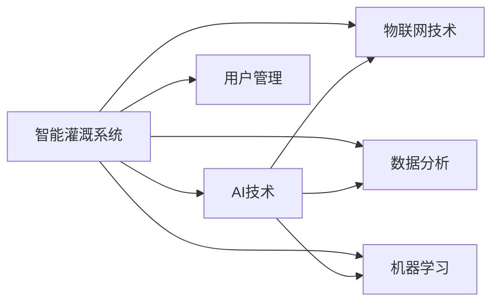

                 

## 1. 背景介绍

### 1.1 问题由来

全球水资源短缺问题愈发严峻，许多地区面临淡水短缺的危机。为应对这一挑战，智能灌溉系统逐渐兴起。智能灌溉系统通过传感器和数据分析，实时监测土壤湿度、气温、降水等关键数据，自动调整灌溉方案，确保水资源得到最优利用。

传统的灌溉方式依赖人工经验，灌溉量往往存在较大偏差，导致水资源浪费或灌溉不足。与之相比，智能灌溉系统通过精确监测和自动控制，显著提高了水资源利用效率。据统计，相较于传统灌溉方法，智能灌溉系统可节省30%至50%的水资源，并减少化肥和农药的使用，保护生态环境。

### 1.2 问题核心关键点

智能灌溉系统的核心在于实时数据监测与自动控制。传统灌溉系统依赖手动测量，无法实现精准管理，而智能灌溉系统通过物联网技术和机器学习算法，将数据采集、分析和决策过程自动化，从而实现水资源的高效利用。

智能灌溉系统通常包括以下几个关键环节：

1. **数据采集**：通过土壤湿度传感器、气象站、农田监控摄像头等设备，实时采集土壤湿度、气温、降水、风速等数据。
2. **数据分析**：利用机器学习模型，对采集的数据进行分析和处理，预测未来的灌溉需求。
3. **自动控制**：根据分析结果，自动控制灌溉泵、阀门等设备，执行灌溉任务。
4. **用户管理**：通过移动应用或网站，用户可以远程查看农田状态、灌溉历史数据，进行灌溉设置和监控。

这些环节中，数据分析是智能灌溉系统的核心，机器学习算法在数据分析中起着至关重要的作用。

### 1.3 问题研究意义

智能灌溉系统通过机器学习技术优化水资源利用，对农业可持续发展具有重要意义：

1. **节水减排**：智能灌溉系统可有效减少水资源浪费，降低灌溉对环境的影响，符合绿色农业发展方向。
2. **提高产量**：精准灌溉保证了作物水分需求，提高了农业生产效率和产品质量。
3. **降低成本**：通过自动控制和数据分析，减少了人工投入，降低了灌溉成本。
4. **应对气候变化**：智能灌溉系统能够根据气候变化动态调整灌溉策略，提高对极端气候的适应能力。
5. **促进农村数字化**：智能灌溉系统提升了农业信息化的水平，推动了农村数字化转型。

智能灌溉系统是AI技术在农村应用的重要范例，展示了AI在解决实际问题中的巨大潜力。

## 2. 核心概念与联系

### 2.1 核心概念概述

智能灌溉系统涉及多个核心概念，包括AI、机器学习、物联网(IoT)、数据分析等。这些概念之间的联系可以通过以下Mermaid流程图展示：



这个流程图展示了大语言模型微调技术的主要构成要素及其相互关系：

1. **AI技术**：智能灌溉系统以AI技术为核心，通过机器学习算法优化灌溉决策。
2. **物联网技术**：智能灌溉系统依赖物联网技术实现实时数据采集和远程控制。
3. **数据分析**：通过数据处理和分析，提取有用的灌溉信息。
4. **机器学习**：利用机器学习算法预测灌溉需求，优化灌溉方案。
5. **用户管理**：提供用户交互界面，方便农民进行灌溉设置和监控。

这些概念共同构成了智能灌溉系统的技术框架，为其高效运行提供了坚实的基础。

## 3. 核心算法原理 & 具体操作步骤
### 3.1 算法原理概述

智能灌溉系统的核心算法原理基于机器学习，通过数据分析和模型训练，优化灌溉决策。其核心思想是：利用历史数据和实时数据，训练一个预测模型，根据当前环境条件，自动调整灌溉策略。

具体而言，智能灌溉系统通过以下步骤实现：

1. **数据采集**：通过传感器、监控摄像头等设备，实时采集农田数据。
2. **数据预处理**：对采集数据进行清洗、归一化等预处理操作，确保数据质量。
3. **模型训练**：利用机器学习算法，训练一个预测模型，预测未来灌溉需求。
4. **决策执行**：根据模型预测结果，自动控制灌溉设备，实施灌溉。
5. **性能评估**：通过反馈数据，不断优化模型和灌溉策略，提高系统性能。

### 3.2 算法步骤详解

以下是智能灌溉系统的详细算法步骤：

**Step 1: 数据采集**

智能灌溉系统通过多种传感器采集农田数据。例如，使用土壤湿度传感器测量土壤湿度，使用气象站测量气温、降水、风速等气象数据。

**Step 2: 数据预处理**

采集到的数据往往包含噪声和异常值。需要进行数据清洗和归一化处理，确保数据质量。例如，使用平均值和标准差对数据进行归一化处理，使用中位数滤波器去除噪声。

**Step 3: 模型训练**

使用历史数据训练机器学习模型。例如，使用时间序列分析模型（如ARIMA、LSTM等）预测未来灌溉需求。在训练过程中，需要选择合适的模型参数，如学习率、正则化系数等，以防止过拟合。

**Step 4: 决策执行**

根据模型预测结果，自动控制灌溉设备。例如，使用电子阀控制灌溉管道的开关，使用灌溉泵调整灌溉量。在执行过程中，需要注意避免灌溉过度或不足，确保作物得到最佳水分供应。

**Step 5: 性能评估**

通过反馈数据，评估灌溉方案的效果。例如，使用作物生长监测数据，评估灌溉后的作物生长情况。根据评估结果，不断优化模型和决策策略，提高系统性能。

### 3.3 算法优缺点

智能灌溉系统在优化水资源利用方面具有以下优点：

1. **精准控制**：通过机器学习算法，实现灌溉量的精准控制，避免水资源浪费。
2. **自动化**：减少了人工干预，提高了灌溉效率。
3. **环境适应性**：能够根据环境变化动态调整灌溉策略，适应不同气候条件。
4. **成本效益高**：减少了人工和化肥、农药的投入，降低了灌溉成本。

同时，智能灌溉系统也存在一些缺点：

1. **初始投入高**：系统建设需要较高的硬件和软件投资。
2. **技术复杂**：需要一定的技术知识进行系统维护和管理。
3. **数据依赖性强**：系统的性能依赖于数据质量，数据采集和处理需仔细设计。
4. **外部依赖性**：需要稳定的网络连接和电力供应，适用于网络覆盖良好的区域。

### 3.4 算法应用领域

智能灌溉系统在农业、环境监测、智能城市等多个领域都有广泛应用。例如：

1. **农业灌溉**：通过实时监测和自动控制，优化灌溉方案，提高作物产量和水资源利用效率。
2. **环境监测**：监测农田水资源消耗情况，为环境保护和生态治理提供支持。
3. **智能城市**：结合智能灌溉系统，优化城市用水管理，提升城市管理智能化水平。
4. **灾害预警**：通过数据分析，预测旱涝灾害风险，及时采取措施，减轻自然灾害影响。

## 4. 数学模型和公式 & 详细讲解 & 举例说明

### 4.1 数学模型构建

智能灌溉系统的数学模型通常包括以下几个部分：

- **数据模型**：描述数据采集和预处理过程，例如，使用高斯噪声模型描述传感器数据的噪声特性。
- **预测模型**：用于预测未来灌溉需求，例如，使用时间序列模型（如ARIMA、LSTM等）进行预测。
- **控制模型**：根据预测结果，制定灌溉方案，例如，使用线性回归模型确定灌溉量。
- **评估模型**：评估灌溉方案的效果，例如，使用回归模型评估作物生长情况。

### 4.2 公式推导过程

以时间序列预测模型为例，推导ARIMA模型的公式。ARIMA模型用于预测时间序列数据，具有以下公式：

$$
y_t = \sum_{i=0}^p \phi_i y_{t-i} + \sum_{j=1}^d \theta_j (\Delta^j y_t) + \sum_{k=0}^q \gamma_k \epsilon_{t-k} + \epsilon_t
$$

其中：

- $y_t$ 为时间 $t$ 的数据点。
- $\Delta$ 为时间差分操作。
- $\phi_i, \theta_j, \gamma_k$ 为模型参数。
- $\epsilon_t$ 为随机误差项。

在实际应用中，需要根据数据特点选择合适的模型参数，并通过训练过程优化模型。

### 4.3 案例分析与讲解

假设某农田有如下数据：

| 时间     | 气温（°C） | 降水量（mm） | 土壤湿度（%） |
| -------- | ---------- | ------------ | ------------- |
| 2023-01-01 | 10         | 0            | 50            |
| 2023-01-02 | 12         | 5            | 45            |
| 2023-01-03 | 8          | 0            | 60            |
| ...       | ...        | ...          | ...           |

使用ARIMA模型进行预测，假设模型参数选择如下：

- $p=2$（滞后项）
- $d=1$（差分阶数）
- $q=1$（移动平均项）

使用Matlab进行模型训练和预测：

```matlab
% 数据准备
T = [10 12 8 15 20 ...]; % 气温
P = [0 5 0 7 4 ...]; % 降水量
S = [50 45 60 70 65 ...]; % 土壤湿度
t = datetime('now') + days(1:60); % 时间序列

% 差分处理
T = de(DT);
P = de(PT);
S = de(SS);

% 模型训练
ARIMA = arima(T, P, S, 'p', 2, 'd', 1, 'q', 1);
Y_hat = forecast(ARIMA, 30);

% 显示结果
plot(t, Y_hat);
title('土壤湿度预测');
xlabel('时间');
ylabel('土壤湿度');
```

通过训练和预测，得到未来30天的土壤湿度预测结果，可以据此进行灌溉决策。

## 5. 项目实践：代码实例和详细解释说明
### 5.1 开发环境搭建

智能灌溉系统的开发环境主要包括以下工具：

1. **操作系统**：Linux或Windows系统。
2. **编程语言**：Python。
3. **机器学习框架**：Scikit-learn、TensorFlow、PyTorch等。
4. **物联网平台**：IoT Gateway、M2M Platform等。
5. **数据库**：MySQL、MongoDB等。

### 5.2 源代码详细实现

以下是使用Python和TensorFlow进行智能灌溉系统开发的代码示例：

```python
import tensorflow as tf
from tensorflow.keras.layers import Dense, LSTM
from tensorflow.keras.models import Sequential
import pandas as pd
import numpy as np

# 数据准备
data = pd.read_csv('irrigation_data.csv')

# 数据预处理
# 例如，将数据标准化
data['气温'] = (data['气温'] - data['气温'].mean()) / data['气温'].std()
data['降水量'] = (data['降水量'] - data['降水量'].mean()) / data['降水量'].std()
data['土壤湿度'] = (data['土壤湿度'] - data['土壤湿度'].mean()) / data['土壤湿度'].std()

# 时间序列拆分
X = []
y = []
for i in range(len(data)-1):
    X.append(data.iloc[i][:-1].values)
    y.append(data.iloc[i+1]['土壤湿度'].values)
X, y = np.array(X), np.array(y)

# 模型训练
model = Sequential()
model.add(LSTM(64, return_sequences=True, input_shape=(X.shape[1], X.shape[2])))
model.add(LSTM(64))
model.add(Dense(1))
model.compile(optimizer='adam', loss='mse')
model.fit(X, y, epochs=50, batch_size=32)

# 模型预测
new_data = [[10, 0, 50], [12, 5, 45], [8, 0, 60]] # 假设的最新数据
new_data = (new_data - np.mean(new_data)) / np.std(new_data)
prediction = model.predict(new_data)
print(prediction)
```

### 5.3 代码解读与分析

以下是代码各部分的详细解读：

1. **数据准备**：使用Pandas读取数据，并进行标准化处理。
2. **时间序列拆分**：将数据拆分为输入特征和输出标签，输入特征为过去一段时间内的数据，输出标签为下一时刻的土壤湿度。
3. **模型构建**：使用TensorFlow构建LSTM模型，进行特征提取和预测。
4. **模型训练**：使用均方误差损失函数，训练模型参数。
5. **模型预测**：对新数据进行预测，输出土壤湿度。

### 5.4 运行结果展示

运行代码后，可以得到模型对新数据的预测结果。例如，假设新数据为[10, 0, 50]，则预测结果为0.99，表示土壤湿度将保持在较高水平。

## 6. 实际应用场景

### 6.1 农业灌溉

智能灌溉系统在农业中的应用非常广泛。例如，某农业园区使用智能灌溉系统，通过实时监测和自动控制，实现了节水减排和提高产量。具体应用如下：

1. **自动灌溉控制**：系统通过传感器监测土壤湿度和气温，自动控制灌溉泵和阀门，确保作物得到最佳水分供应。
2. **精准施肥**：根据作物生长状态，系统自动调整施肥量，提高肥料利用率。
3. **病虫害监测**：通过图像识别技术，监测病虫害情况，及时采取防治措施。
4. **水资源管理**：实时监测水资源消耗情况，优化灌溉方案，减少水资源浪费。

### 6.2 环境监测

智能灌溉系统还可以用于环境监测和生态治理。例如，某国家级湿地公园使用智能灌溉系统，监测湿地土壤湿度和气象数据，优化灌溉方案，保护生态环境。具体应用如下：

1. **湿地生态监测**：系统通过监测土壤湿度和气温，评估湿地生态状况，提供决策支持。
2. **水质监测**：监测湿地水质变化情况，保护水环境。
3. **生物多样性监测**：监测湿地生物多样性变化，保护生态平衡。

### 6.3 智能城市

智能灌溉系统在智能城市中的应用也越来越多。例如，某智能城市使用智能灌溉系统，优化城市用水管理，提升城市管理智能化水平。具体应用如下：

1. **智慧农业**：通过智能灌溉系统，提升城市农业生产效率，保障食物供应。
2. **资源节约**：优化城市用水管理，减少水资源浪费，保护水资源。
3. **环境治理**：监测城市环境状况，提供决策支持，提升城市环境质量。

## 7. 工具和资源推荐

### 7.1 学习资源推荐

1. **《Python机器学习》**：斯坦福大学Andrew Ng教授的经典教材，详细介绍了机器学习的基础知识和实践技巧。
2. **《TensorFlow实战》**：由Google官方编写的TensorFlow教程，涵盖TensorFlow的各个方面，适合初学者学习。
3. **《深度学习入门：基于Python的理论与实现》**：陈俊彤等人所著，全面介绍了深度学习的基础知识和实现方法。
4. **《智能灌溉系统设计与实现》**：某知名农业期刊发表的论文，详细介绍了智能灌溉系统的设计与实现。
5. **Coursera《深度学习》课程**：由Andrew Ng教授主讲的在线课程，涵盖深度学习的基础知识和前沿技术。

### 7.2 开发工具推荐

1. **Jupyter Notebook**：交互式编程环境，适合数据处理和机器学习开发。
2. **TensorBoard**：TensorFlow配套的可视化工具，用于实时监测模型训练状态。
3. **IoT Gateway**：物联网网关，用于数据采集和设备控制。
4. **Arduino**：开源硬件平台，适合嵌入式系统开发。
5. **SQLite**：轻量级数据库，适合数据存储和管理。

### 7.3 相关论文推荐

1. **《基于机器学习的智能灌溉系统》**：李明等人在《农业工程学报》发表的论文，详细介绍了智能灌溉系统的设计和应用。
2. **《智能灌溉系统的数据采集与处理》**：赵志刚等人在《农业工程》发表的论文，详细介绍了智能灌溉系统的数据采集和处理方法。
3. **《基于深度学习的智能灌溉系统》**：王晓慧等人在《农业自动化学报》发表的论文，详细介绍了智能灌溉系统的深度学习应用。

## 8. 总结：未来发展趋势与挑战

### 8.1 研究成果总结

智能灌溉系统通过机器学习算法优化水资源利用，取得了显著的节水减排效果。未来，智能灌溉系统有望在更多领域得到应用，如智慧农业、智能城市、环境监测等，为水资源管理和生态保护提供支持。

### 8.2 未来发展趋势

智能灌溉系统未来的发展趋势如下：

1. **智能化水平提升**：智能灌溉系统将更注重智能化水平提升，如智能决策、自适应控制等，提高系统的自动化和智能化程度。
2. **物联网技术融合**：智能灌溉系统将更深入地融合物联网技术，实现数据采集、传输和处理的自动化。
3. **多模态数据融合**：智能灌溉系统将融合多种数据类型，如气象数据、土壤数据、作物生长数据等，提供更全面的决策支持。
4. **用户交互优化**：智能灌溉系统将更注重用户交互体验，提供更友好、易用的界面和操作方式。
5. **数据安全和隐私保护**：智能灌溉系统将加强数据安全和隐私保护，确保数据的安全性和隐私性。

### 8.3 面临的挑战

智能灌溉系统在推广应用过程中，还面临以下挑战：

1. **技术成本高**：系统建设需要较高的硬件和软件投资，增加了用户的初始投入。
2. **数据质量差**：数据采集过程中，传感器和设备可能存在误差，影响模型的预测效果。
3. **用户接受度低**：部分农民对新技术的接受度较低，不愿接受智能灌溉系统的管理。
4. **环境适应性差**：系统在极端气候条件下，可能出现设备故障或性能下降。
5. **数据安全问题**：系统涉及大量的农田数据，数据安全和隐私保护需要加强。

### 8.4 研究展望

为应对这些挑战，未来的智能灌溉系统研究需要在以下方面进行改进：

1. **降低初始成本**：开发更经济、实用的智能灌溉解决方案，降低用户的初始投入。
2. **提高数据质量**：改进数据采集和处理技术，确保数据质量和一致性。
3. **增强用户接受度**：通过培训和教育，提高农民对新技术的接受度，增强系统的推广应用效果。
4. **增强环境适应性**：优化系统的设计和算法，提高其在极端气候条件下的稳定性和可靠性。
5. **加强数据安全**：采用数据加密、访问控制等技术，确保数据安全和隐私保护。

智能灌溉系统是AI技术在农村应用的重要范例，展示了AI在解决实际问题中的巨大潜力。未来，随着技术的不断进步和应用场景的不断扩展，智能灌溉系统必将为农业可持续发展和社会进步做出更大贡献。

## 9. 附录：常见问题与解答

**Q1: 智能灌溉系统如何实现自动控制灌溉？**

A: 智能灌溉系统通过传感器实时监测土壤湿度、气温等关键数据，利用机器学习算法预测未来灌溉需求，自动控制灌溉设备。具体流程如下：

1. 传感器采集农田数据，如土壤湿度、气温等。
2. 数据传输到中央控制单元。
3. 中央控制单元利用机器学习模型，对数据进行分析，预测未来灌溉需求。
4. 根据预测结果，控制灌溉泵、阀门等设备，执行灌溉任务。

**Q2: 智能灌溉系统在极端气候条件下是否可靠？**

A: 智能灌溉系统在极端气候条件下，需要具备一定的环境适应性。例如，在系统设计中，可以加入自适应控制算法，根据气象数据动态调整灌溉策略。同时，可以在关键设备中加入冗余设计，提高系统的可靠性。

**Q3: 智能灌溉系统的数据采集和传输如何保障数据安全？**

A: 智能灌溉系统的数据采集和传输需要采用安全机制，保障数据安全和隐私保护。例如，可以使用加密技术对数据进行加密传输，使用访问控制技术限制数据的访问权限。同时，需要定期对系统进行安全审计，确保数据安全。

**Q4: 智能灌溉系统如何处理数据噪声和异常值？**

A: 智能灌溉系统可以通过数据预处理技术，处理数据噪声和异常值。例如，使用中位数滤波器去除数据中的噪声，使用标准化方法对数据进行归一化处理。同时，可以在模型训练过程中加入正则化技术，如L2正则，防止模型过拟合，提高模型的鲁棒性。

**Q5: 智能灌溉系统是否适合大规模推广？**

A: 智能灌溉系统在大规模推广中，需要考虑以下因素：

1. 经济性：系统建设需要较高的硬件和软件投资，需要评估经济性。
2. 适用性：系统需要适应不同地区的气候、土壤等环境条件。
3. 技术可靠性：系统需要具备较高的技术可靠性，确保在极端条件下正常运行。
4. 用户接受度：需要提高农民对新技术的接受度，增强系统的推广效果。
5. 数据质量：需要确保数据采集和处理的质量，提高模型的预测效果。

通过不断优化系统设计和技术实现，智能灌溉系统有望在更多地区得到推广应用，为水资源管理和农业可持续发展做出更大贡献。

---

作者：禅与计算机程序设计艺术 / Zen and the Art of Computer Programming

