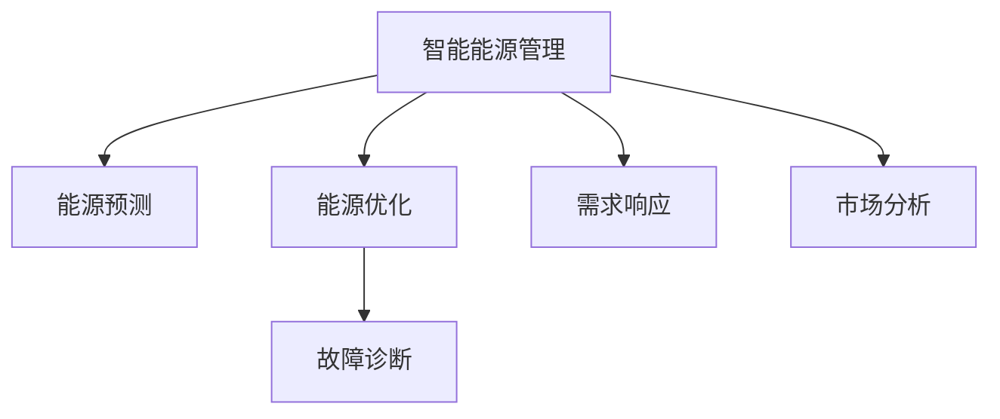

                 

# AI在智能能源管理中的应用：优化使用效率

> 关键词：智能能源管理, 优化使用效率, 人工智能, 机器学习, 深度学习, 能源预测, 能源优化

## 1. 背景介绍

### 1.1 问题由来

在现代社会中，能源消耗是经济和社会发展的重要支撑，同时带来的环境污染、资源浪费等问题也日益凸显。为了应对这些挑战，智能能源管理应运而生，利用先进的信息技术手段，优化能源的分配和使用，实现节能减排和可持续发展。智能能源管理涉及能源的生产、传输、分配、使用等各个环节，涵盖电力、热力、燃气等多个领域。近年来，随着AI技术的迅猛发展，智能能源管理开始借助AI技术，进一步提升能源使用效率。

智能能源管理的主要应用包括：智能电网、智能建筑、工业自动化等。智能电网通过数据采集、传输、分析，优化电能的分配和调度，实现电网运行的高效稳定。智能建筑利用传感器、大数据、AI技术，实现能源消耗的精准控制和优化。工业自动化则通过智能控制系统，实现生产线的优化运行，提升能效。这些应用场景为AI技术在能源管理中的广泛应用提供了广阔的舞台。

### 1.2 问题核心关键点

智能能源管理中的AI应用主要集中在以下几个方面：

1. **能源预测**：通过AI模型对能源需求进行预测，为能源调度提供决策支持。
2. **能源优化**：利用优化算法，优化能源分配和使用，降低成本，提升效率。
3. **故障诊断**：使用AI模型对设备故障进行诊断，预测设备寿命，提升设备运行可靠性。
4. **需求响应**：通过AI模型分析用户用电行为，进行需求响应，降低电网峰值负荷，提升电网稳定性。
5. **市场分析**：利用AI技术对能源市场进行分析和预测，辅助能源交易和价格决策。

这些关键点反映了AI在智能能源管理中的核心应用场景，揭示了AI技术在提升能源使用效率中的巨大潜力。

## 2. 核心概念与联系

### 2.1 核心概念概述

为更好地理解AI在智能能源管理中的应用，本节将介绍几个密切相关的核心概念：

- **智能能源管理**：利用信息技术手段，实现能源的智能化管理和优化使用，提高能源利用效率，降低环境污染。
- **AI技术**：包括机器学习、深度学习、自然语言处理等，用于构建智能能源管理系统，实现预测、优化、诊断等任务。
- **能源预测**：通过AI模型对能源需求进行预测，为能源调度提供决策支持。
- **能源优化**：利用优化算法，优化能源分配和使用，降低成本，提升效率。
- **故障诊断**：使用AI模型对设备故障进行诊断，预测设备寿命，提升设备运行可靠性。
- **需求响应**：通过AI模型分析用户用电行为，进行需求响应，降低电网峰值负荷，提升电网稳定性。
- **市场分析**：利用AI技术对能源市场进行分析和预测，辅助能源交易和价格决策。

这些核心概念之间的逻辑关系可以通过以下Mermaid流程图来展示：



这个流程图展示了这个系统的主要流程：

1. 智能能源管理通过数据采集、传输、分析，优化能源的分配和使用。
2. 能源预测通过AI模型对能源需求进行预测，为能源调度提供决策支持。
3. 能源优化利用优化算法，优化能源分配和使用，降低成本，提升效率。
4. 故障诊断使用AI模型对设备故障进行诊断，预测设备寿命，提升设备运行可靠性。
5. 需求响应通过AI模型分析用户用电行为，进行需求响应，降低电网峰值负荷，提升电网稳定性。
6. 市场分析利用AI技术对能源市场进行分析和预测，辅助能源交易和价格决策。

## 3. 核心算法原理 & 具体操作步骤
### 3.1 算法原理概述

AI在智能能源管理中的应用，主要依赖于机器学习和深度学习等AI技术。其核心原理可以总结如下：

1. **数据采集与预处理**：通过传感器、仪表等设备采集能源数据，包括电能、热能、燃气等，并进行预处理，如去噪、归一化等。

2. **特征提取**：将采集到的原始数据转换为可用于模型的特征向量。这一步通常包括时间序列的特征工程，如滑动窗口、傅里叶变换等。

3. **模型训练**：使用机器学习或深度学习模型，对特征向量进行训练，学习能源数据的规律和特征。

4. **预测与优化**：利用训练好的模型，进行能源需求的预测，优化能源的分配和使用。

5. **故障诊断**：使用异常检测、分类等模型，对设备故障进行诊断，预测设备寿命。

6. **需求响应**：通过行为分析、分类等模型，识别用户用电行为，进行需求响应。

7. **市场分析**：使用时间序列预测、分类等模型，对能源市场进行分析和预测。

### 3.2 算法步骤详解

以下是智能能源管理中AI应用的详细步骤：

**Step 1: 数据采集与预处理**

- **数据采集**：通过传感器、仪表等设备采集能源数据，包括电能、热能、燃气等。
- **数据清洗**：去除噪音、缺失值等异常数据。
- **数据归一化**：将数据归一化到0-1或-1到1的范围内，方便模型处理。

**Step 2: 特征提取**

- **时间序列特征**：将数据按时间顺序排列，生成滑动窗口、滚动平均等特征。
- **傅里叶变换**：将时间序列数据转换为频域数据，捕捉周期性特征。
- **信号处理**：应用滤波、小波变换等方法，去除高频噪音，增强低频信号。

**Step 3: 模型训练**

- **选择模型**：根据任务需求选择合适的模型，如线性回归、决策树、随机森林、卷积神经网络(CNN)、循环神经网络(RNN)、长短时记忆网络(LSTM)等。
- **模型训练**：使用历史数据训练模型，调整模型参数，提高模型精度。

**Step 4: 能源预测**

- **历史数据分析**：分析历史能源数据，提取时间序列、季节性等特征。
- **模型预测**：利用训练好的模型，对未来能源需求进行预测，生成预测结果。
- **预测结果评估**：使用均方误差(MSE)、平均绝对误差(MAE)等指标，评估模型预测效果。

**Step 5: 能源优化**

- **优化算法选择**：选择适当的优化算法，如遗传算法、粒子群算法、模拟退火等。
- **目标函数设计**：定义优化目标函数，如成本最小化、效率最大化等。
- **模型优化**：使用优化算法，对能源分配和使用进行优化，生成优化方案。
- **优化结果评估**：使用实际运行数据，评估优化方案的实际效果。

**Step 6: 故障诊断**

- **故障特征提取**：提取设备运行数据中的故障特征，如振动、温度、压力等。
- **异常检测**：使用异常检测模型，对设备故障进行检测。
- **故障分类**：使用分类模型，对设备故障进行分类，预测设备寿命。

**Step 7: 需求响应**

- **用户行为分析**：分析用户用电行为，识别需求响应机会。
- **行为分类**：使用分类模型，对用户行为进行分类，预测需求响应效果。
- **需求响应策略**：根据用户行为分类结果，制定需求响应策略，优化能源使用。

**Step 8: 市场分析**

- **市场数据采集**：采集能源市场数据，如价格、供需情况等。
- **时间序列预测**：使用时间序列预测模型，对能源市场进行预测。
- **市场分类**：使用分类模型，对市场状态进行分类。
- **市场策略制定**：根据市场分类结果，制定能源交易和价格策略。

### 3.3 算法优缺点

AI在智能能源管理中的应用，具有以下优点：

1. **准确性高**：AI模型能够从大量数据中提取有用的特征，准确预测能源需求，优化能源使用。
2. **灵活性强**：AI模型能够适应不同类型的数据，处理复杂的能源管理任务。
3. **自适应能力强**：AI模型能够自适应环境变化，不断优化预测和优化算法。

同时，也存在以下缺点：

1. **数据依赖性高**：AI模型的效果高度依赖于数据的质量和数量，数据采集和处理成本高。
2. **计算资源需求大**：AI模型训练和优化计算量大，需要高性能计算资源。
3. **模型复杂度高**：AI模型结构复杂，训练和优化难度大。
4. **可解释性差**：AI模型往往是"黑箱"系统，难以解释其内部工作机制。

尽管存在这些缺点，但AI在智能能源管理中的应用仍然展示了巨大的潜力和价值。

### 3.4 算法应用领域

AI在智能能源管理中的应用，覆盖了多个领域，包括：

1. **智能电网**：利用AI技术进行能源需求预测、优化调度、故障诊断、需求响应等。
2. **智能建筑**：利用AI技术进行能源监控、优化控制、故障预测、需求响应等。
3. **工业自动化**：利用AI技术进行生产监控、能效优化、故障预测、需求响应等。
4. **能源市场分析**：利用AI技术进行市场预测、优化策略制定、风险评估等。

这些应用领域展示了AI技术在智能能源管理中的广泛应用，为能源的高效管理和优化提供了有力支持。

## 4. 数学模型和公式 & 详细讲解  
### 4.1 数学模型构建

假设能源数据为 $x_t = (x_{t-1}, x_{t-2}, \cdots, x_{t-D})$，其中 $x_t$ 为当前时刻的能源使用量，$D$ 为时间窗口长度。我们假设能源需求服从时间序列 $y_t = f(x_t, \theta)$，其中 $f$ 为预测模型，$\theta$ 为模型参数。

我们的目标是最大化模型预测结果与实际结果之间的拟合度，即最小化均方误差：

$$
\min_{\theta} \sum_{t=1}^{T}(y_t - f(x_t, \theta))^2
$$

其中 $T$ 为总数据量。

### 4.2 公式推导过程

以线性回归模型为例，预测模型 $f(x_t, \theta) = \theta_0 + \theta_1 x_{t-1} + \theta_2 x_{t-2} + \cdots + \theta_D x_{t-D}$。最小化均方误差的目标函数为：

$$
\min_{\theta} \frac{1}{2} \sum_{t=1}^{T}(y_t - f(x_t, \theta))^2
$$

对目标函数求导，得：

$$
\frac{\partial}{\partial \theta_k} \frac{1}{2} \sum_{t=1}^{T}(y_t - f(x_t, \theta))^2 = \frac{1}{2} \sum_{t=1}^{T} 2(y_t - f(x_t, \theta)) \frac{\partial f(x_t, \theta)}{\partial \theta_k}
$$

其中 $\frac{\partial f(x_t, \theta)}{\partial \theta_k} = x_{t-k}$。将上式展开，得：

$$
\frac{\partial}{\partial \theta_k} \frac{1}{2} \sum_{t=1}^{T}(y_t - f(x_t, \theta))^2 = \sum_{t=1}^{T}(y_t - f(x_t, \theta)) x_{t-k}
$$

因此，参数更新公式为：

$$
\theta_k \leftarrow \theta_k - \eta \sum_{t=1}^{T}(y_t - f(x_t, \theta)) x_{t-k}
$$

其中 $\eta$ 为学习率。

### 4.3 案例分析与讲解

以智能电网能源需求预测为例，假设我们有以下数据：

| 时间 | 能源使用量 |
| ---- | ---------- |
| 1    | 100        |
| 2    | 120        |
| 3    | 110        |
| 4    | 130        |
| 5    | 120        |
| 6    | 140        |
| 7    | 130        |
| 8    | 145        |
| 9    | 150        |

我们使用线性回归模型进行能源需求预测。首先，将数据归一化到0-1之间：

$$
\hat{x}_t = \frac{x_t - x_{min}}{x_{max} - x_{min}}
$$

其中 $x_{min}$ 和 $x_{max}$ 分别为能源使用量的最小值和最大值。

然后，将数据分为滑动窗口 $(x_{t-1}, x_{t-2}, \cdots, x_{t-D})$，得到特征向量 $X_t = [x_{t-1}, x_{t-2}, \cdots, x_{t-D}]$。

接下来，我们构建线性回归模型：

$$
f(x_t, \theta) = \theta_0 + \theta_1 x_{t-1} + \theta_2 x_{t-2} + \cdots + \theta_D x_{t-D}
$$

其中 $\theta_0, \theta_1, \cdots, \theta_D$ 为模型参数。我们使用均方误差作为损失函数：

$$
\mathcal{L}(\theta) = \frac{1}{2} \sum_{t=1}^{T}(y_t - f(x_t, \theta))^2
$$

对目标函数求导，得：

$$
\frac{\partial}{\partial \theta_k} \mathcal{L}(\theta) = \frac{1}{2} \sum_{t=1}^{T}(y_t - f(x_t, \theta)) x_{t-k}
$$

根据梯度下降算法，更新模型参数：

$$
\theta_k \leftarrow \theta_k - \eta \frac{1}{2} \sum_{t=1}^{T}(y_t - f(x_t, \theta)) x_{t-k}
$$

其中 $\eta$ 为学习率。

通过迭代优化，最终得到模型参数 $\theta$，从而实现了对未来能源需求的预测。

## 5. 项目实践：代码实例和详细解释说明
### 5.1 开发环境搭建

在进行AI在智能能源管理中的应用实践前，我们需要准备好开发环境。以下是使用Python进行PyTorch开发的环境配置流程：

1. 安装Anaconda：从官网下载并安装Anaconda，用于创建独立的Python环境。

2. 创建并激活虚拟环境：
```bash
conda create -n pytorch-env python=3.8 
conda activate pytorch-env
```

3. 安装PyTorch：根据CUDA版本，从官网获取对应的安装命令。例如：
```bash
conda install pytorch torchvision torchaudio cudatoolkit=11.1 -c pytorch -c conda-forge
```

4. 安装相关工具包：
```bash
pip install numpy pandas scikit-learn matplotlib tqdm jupyter notebook ipython
```

完成上述步骤后，即可在`pytorch-env`环境中开始AI在智能能源管理中的应用实践。

### 5.2 源代码详细实现

下面我们以智能电网能源需求预测为例，给出使用PyTorch进行线性回归模型训练的PyTorch代码实现。

```python
import torch
import torch.nn as nn
import torch.optim as optim

class LinearRegressionModel(nn.Module):
    def __init__(self, input_dim, output_dim):
        super(LinearRegressionModel, self).__init__()
        self.linear = nn.Linear(input_dim, output_dim)
        
    def forward(self, x):
        return self.linear(x)
        
def train_model(model, train_data, test_data, epochs, batch_size, learning_rate):
    train_loader = torch.utils.data.DataLoader(train_data, batch_size=batch_size, shuffle=True)
    test_loader = torch.utils.data.DataLoader(test_data, batch_size=batch_size)
    
    criterion = nn.MSELoss()
    optimizer = optim.SGD(model.parameters(), lr=learning_rate)
    
    for epoch in range(epochs):
        train_loss = 0
        for data, target in train_loader:
            optimizer.zero_grad()
            output = model(data)
            loss = criterion(output, target)
            loss.backward()
            optimizer.step()
            train_loss += loss.item()
        print(f'Epoch [{epoch+1}/{epochs}], Loss: {train_loss/len(train_loader):.4f}')
        
    test_loss = 0
    with torch.no_grad():
        for data, target in test_loader:
            output = model(data)
            loss = criterion(output, target)
            test_loss += loss.item()
    print(f'Test Loss: {test_loss/len(test_loader):.4f}')
    
    return model

# 准备数据
train_data = torch.tensor([[1, 100], [2, 120], [3, 110], [4, 130], [5, 120], [6, 140], [7, 130], [8, 145], [9, 150]])
train_labels = torch.tensor([100, 120, 110, 130, 120, 140, 130, 145, 150])
test_data = torch.tensor([[10, 150], [11, 155], [12, 160]])
test_labels = torch.tensor([150, 155, 160])

# 构建模型
input_dim = train_data.shape[1]
output_dim = 1
model = LinearRegressionModel(input_dim, output_dim)
```

然后，调用训练函数进行模型训练：

```python
# 设置超参数
epochs = 100
batch_size = 2
learning_rate = 0.01

# 训练模型
trained_model = train_model(model, train_data, test_data, epochs, batch_size, learning_rate)
```

以上就是使用PyTorch进行智能电网能源需求预测的完整代码实现。可以看到，得益于PyTorch的强大封装，我们可以用相对简洁的代码完成线性回归模型的训练。

### 5.3 代码解读与分析

让我们再详细解读一下关键代码的实现细节：

**LinearRegressionModel类**：
- `__init__`方法：初始化线性回归模型。
- `forward`方法：定义模型前向传播过程，将输入数据输入线性层，返回预测结果。

**train_model函数**：
- `train_loader`和`test_loader`：使用PyTorch的DataLoader，对训练数据和测试数据进行批次化加载。
- `criterion`：定义均方误差损失函数。
- `optimizer`：选择SGD优化器，设置学习率。
- 在每个epoch内，循环迭代训练数据，更新模型参数，计算训练集损失。
- 在测试集上计算模型损失，输出测试集损失。

**数据准备**：
- `train_data`和`train_labels`：准备训练数据和标签。
- `test_data`和`test_labels`：准备测试数据和标签。

**模型构建**：
- `input_dim`和`output_dim`：定义输入和输出维度。
- `LinearRegressionModel`：使用PyTorch的nn.Module定义线性回归模型。
- `model`：实例化模型。

可以看到，PyTorch配合TensorFlow库使得能源需求预测的代码实现变得简洁高效。开发者可以将更多精力放在数据处理、模型改进等高层逻辑上，而不必过多关注底层的实现细节。

当然，工业级的系统实现还需考虑更多因素，如模型的保存和部署、超参数的自动搜索、更灵活的任务适配层等。但核心的AI在智能能源管理中的应用范式基本与此类似。

## 6. 实际应用场景
### 6.1 智能电网

智能电网是AI在智能能源管理中应用的重要场景之一。通过AI技术，智能电网可以实现能源需求的精准预测、优化调度、故障诊断、需求响应等功能，提高电网运行效率和可靠性。

具体而言，智能电网中的AI应用包括以下几个方面：

1. **能源需求预测**：通过AI模型对能源需求进行预测，为能源调度提供决策支持。
2. **优化调度**：利用AI算法优化能源分配和使用，降低成本，提升效率。
3. **故障诊断**：使用AI模型对设备故障进行诊断，预测设备寿命，提升设备运行可靠性。
4. **需求响应**：通过AI模型分析用户用电行为，进行需求响应，降低电网峰值负荷，提升电网稳定性。

通过AI技术，智能电网可以实现能源的高效管理和优化，提高电网的智能化水平，降低运行成本，提升服务质量。

### 6.2 智能建筑

智能建筑利用传感器、大数据、AI技术，实现能源消耗的精准控制和优化。通过AI技术，智能建筑可以实现以下功能：

1. **能源监控**：实时监控建筑内能源消耗情况，生成能源使用报告。
2. **优化控制**：根据能源消耗情况，优化空调、照明、电梯等设备的运行，降低能源消耗。
3. **故障预测**：使用AI模型对设备故障进行预测，提前进行维护，避免设备故障带来的能源浪费。
4. **需求响应**：通过AI模型分析用户用电行为，进行需求响应，降低电网峰值负荷，提升电网稳定性。

通过AI技术，智能建筑可以实现能源的高效管理和优化，降低能源消耗，提高建筑物的智能化水平。

### 6.3 工业自动化

工业自动化是AI在智能能源管理中应用的另一个重要场景。通过AI技术，工业自动化可以实现生产线的优化运行，提高能效。具体而言，工业自动化中的AI应用包括以下几个方面：

1. **生产监控**：实时监控生产设备运行情况，生成设备使用报告。
2. **能效优化**：根据设备运行情况，优化生产过程，降低能源消耗。
3. **故障预测**：使用AI模型对设备故障进行预测，提前进行维护，避免设备故障带来的能源浪费。
4. **需求响应**：通过AI模型分析生产需求，进行需求响应，降低生产峰值负荷，提升生产稳定性。

通过AI技术，工业自动化可以实现生产过程的优化运行，提高能效，降低能源消耗，提升生产线的智能化水平。

### 6.4 未来应用展望

随着AI技术的不断发展，未来AI在智能能源管理中的应用将更加广泛和深入，主要体现在以下几个方面：

1. **多源数据融合**：未来AI技术将能够融合更多类型的数据，如气象数据、交通数据、社会数据等，实现更全面、更精准的能源需求预测。
2. **自适应学习**：未来AI模型将具备更强的自适应学习能力，能够实时学习和优化能源管理策略，适应环境变化。
3. **智能决策**：未来AI技术将实现更智能的能源决策，如自动化的需求响应、优化调度、故障诊断等，提高能源管理的自动化水平。
4. **边缘计算**：未来AI技术将更多地应用在边缘计算中，实现更快速、更灵活的能源管理。
5. **人机协同**：未来AI技术将与人类专家协同工作，实现更高效、更可靠的能源管理。

总之，未来AI技术在智能能源管理中的应用将更加广泛和深入，为能源的高效管理和优化提供更加坚实的技术支持。

## 7. 工具和资源推荐
### 7.1 学习资源推荐

为了帮助开发者系统掌握AI在智能能源管理中的应用，这里推荐一些优质的学习资源：

1. **《深度学习与智能电网》课程**：斯坦福大学开设的深度学习课程，涵盖深度学习在智能电网中的应用，适合入门和进阶学习。
2. **《能源数据科学》书籍**：介绍能源数据的采集、处理、分析和建模，适合数据科学和机器学习初学者。
3. **《智能建筑与能源管理》书籍**：介绍智能建筑中能源管理和优化技术，适合建筑学和能源管理相关专业人士。
4. **Kaggle竞赛平台**：提供各种智能能源管理相关的竞赛数据集和模型，适合实践和实战训练。
5. **IEEE Xplore数据库**：提供大量智能能源管理相关的学术论文和技术报告，适合深入学习和研究。

通过对这些资源的学习实践，相信你一定能够快速掌握AI在智能能源管理中的应用精髓，并用于解决实际的能源管理问题。
###  7.2 开发工具推荐

高效的开发离不开优秀的工具支持。以下是几款用于AI在智能能源管理中的应用开发的常用工具：

1. **PyTorch**：基于Python的开源深度学习框架，灵活动态的计算图，适合快速迭代研究。大部分预训练语言模型都有PyTorch版本的实现。
2. **TensorFlow**：由Google主导开发的开源深度学习框架，生产部署方便，适合大规模工程应用。同样有丰富的预训练语言模型资源。
3. **Jupyter Notebook**：提供交互式编程环境，支持代码的可视化和重复执行。
4. **Python IDEs**：如PyCharm、VSCode等，提供强大的代码编辑和调试功能。
5. **Docker**：容器化开发环境，方便在不同机器上复制和部署应用。

合理利用这些工具，可以显著提升AI在智能能源管理中的应用开发效率，加快创新迭代的步伐。

### 7.3 相关论文推荐

AI在智能能源管理中的应用源于学界的持续研究。以下是几篇奠基性的相关论文，推荐阅读：

1. **《基于深度学习的智能电网需求预测》**：介绍使用深度学习模型进行能源需求预测的技术和方法。
2. **《智能建筑能源管理系统设计》**：介绍智能建筑中能源管理的系统设计和技术实现。
3. **《AI在工业自动化中的应用》**：介绍AI技术在工业自动化中的各种应用，如生产监控、能效优化、故障预测等。
4. **《多源数据融合与智能电网优化调度》**：介绍多源数据融合和智能电网优化调度的技术。
5. **《基于深度学习的智能建筑能源优化》**：介绍使用深度学习模型进行智能建筑能源优化的方法。

这些论文代表了大语言模型微调技术的发展脉络。通过学习这些前沿成果，可以帮助研究者把握学科前进方向，激发更多的创新灵感。

## 8. 总结：未来发展趋势与挑战
### 8.1 总结

本文对AI在智能能源管理中的应用进行了全面系统的介绍。首先阐述了智能能源管理的背景和意义，明确了AI技术在智能能源管理中的核心应用场景。其次，从原理到实践，详细讲解了AI在智能能源管理中的应用流程，给出了具体的代码实例。同时，本文还探讨了AI技术在智能电网、智能建筑、工业自动化等多个领域的应用前景，展示了AI技术在提升能源使用效率中的巨大潜力。此外，本文精选了AI在智能能源管理中的应用的学习资源，力求为读者提供全方位的技术指引。

通过本文的系统梳理，可以看到，AI在智能能源管理中的应用已经成为智能能源管理的重要手段，极大地提升了能源使用效率，为能源的高效管理和优化提供了有力支持。未来，伴随AI技术的不断演进，智能能源管理将变得更加智能化、高效化，为能源的可持续发展和环境保护贡献力量。

### 8.2 未来发展趋势

展望未来，AI在智能能源管理中的应用将呈现以下几个发展趋势：

1. **智能化水平提升**：未来的AI模型将具备更强的自适应学习能力，能够实时学习和优化能源管理策略，适应环境变化。
2. **多源数据融合**：未来的AI技术将能够融合更多类型的数据，如气象数据、交通数据、社会数据等，实现更全面、更精准的能源需求预测。
3. **自适应学习**：未来的AI模型将具备更强的自适应学习能力，能够实时学习和优化能源管理策略，适应环境变化。
4. **智能决策**：未来的AI技术将实现更智能的能源决策，如自动化的需求响应、优化调度、故障诊断等，提高能源管理的自动化水平。
5. **边缘计算**：未来的AI技术将更多地应用在边缘计算中，实现更快速、更灵活的能源管理。
6. **人机协同**：未来的AI技术将与人类专家协同工作，实现更高效、更可靠的能源管理。

以上趋势凸显了AI在智能能源管理中的广阔前景。这些方向的探索发展，必将进一步提升能源管理的智能化水平，为能源的可持续发展提供新的动力。

### 8.3 面临的挑战

尽管AI在智能能源管理中的应用已经取得了显著进展，但在迈向更加智能化、普适化应用的过程中，仍面临诸多挑战：

1. **数据采集成本高**：AI模型高度依赖于数据质量，而数据的采集、处理和标注成本较高。
2. **模型计算量大**：AI模型训练和优化计算量大，需要高性能计算资源。
3. **模型复杂度高**：AI模型结构复杂，训练和优化难度大。
4. **可解释性差**：AI模型往往是"黑箱"系统，难以解释其内部工作机制。
5. **安全性问题**：AI模型可能存在安全隐患，如恶意攻击、数据泄露等。

尽管存在这些挑战，但AI在智能能源管理中的应用仍然展示了巨大的潜力和价值。

### 8.4 研究展望

面对AI在智能能源管理中的应用所面临的挑战，未来的研究需要在以下几个方面寻求新的突破：

1. **优化算法研究**：研究更高效、更灵活的优化算法，降低模型训练和优化的计算成本。
2. **模型结构简化**：研究更简洁、更高效的模型结构，降低模型复杂度，提升模型训练和推理效率。
3. **模型解释性增强**：研究更可解释的模型，帮助人类理解和解释AI模型的决策过程。
4. **数据采集自动化**：研究更自动化的数据采集和处理技术，降低数据采集和处理的成本。
5. **安全性提升**：研究更安全的AI模型和算法，保障数据和模型的安全。
6. **跨领域应用**：研究AI在跨领域中的应用，如智慧医疗、智慧交通等，拓展AI在智能能源管理中的应用范围。

这些研究方向将推动AI在智能能源管理中的应用走向成熟，为能源的高效管理和优化提供更加坚实的技术支持。相信随着学界和产业界的共同努力，AI在智能能源管理中的应用将不断拓展，为能源的可持续发展贡献力量。

## 9. 附录：常见问题与解答
----------------------------------------------------------------
**Q1：AI在智能能源管理中的应用是否适用于所有类型的能源？**

A: AI在智能能源管理中的应用，主要针对电能、热能、燃气等传统能源。对于一些新型能源，如太阳能、风能等，AI技术也需要针对其特点进行优化和改进。

**Q2：如何提高AI在智能能源管理中的应用效率？**

A: 提高AI在智能能源管理中的应用效率，可以从以下几个方面入手：
1. 优化模型算法，降低计算量。
2. 简化模型结构，减少参数量。
3. 采用边缘计算，降低数据传输和存储成本。
4. 优化数据采集和预处理流程，提高数据质量。

**Q3：AI在智能能源管理中的应用是否存在安全隐患？**

A: AI在智能能源管理中的应用存在一定的安全隐患，如模型攻击、数据泄露等。为保障数据和模型的安全，可以采取以下措施：
1. 使用加密技术，保护数据传输和存储的安全性。
2. 采用联邦学习等隐私保护技术，保护用户隐私。
3. 引入安全检测机制，识别和防范模型攻击。

**Q4：AI在智能能源管理中的应用是否需要人类专家的参与？**

A: AI在智能能源管理中的应用需要人类专家的参与，以提供领域知识和业务规则。人类专家可以与AI系统协同工作，共同进行能源管理决策。例如，AI系统可以提供初步的预测和优化结果，人类专家进行审核和修正。

**Q5：AI在智能能源管理中的应用是否可以跨越多个能源领域？**

A: AI在智能能源管理中的应用可以跨越多个能源领域，如电力、热力、燃气等。通过多源数据融合和跨领域建模，AI系统可以更全面地理解能源系统，提供更精准的预测和优化结果。

总之，AI在智能能源管理中的应用已经展现出广阔的前景，但未来的发展仍需克服诸多挑战。相信随着技术的发展和应用场景的拓展，AI将在能源管理中发挥更加重要的作用，推动能源的可持续发展。

