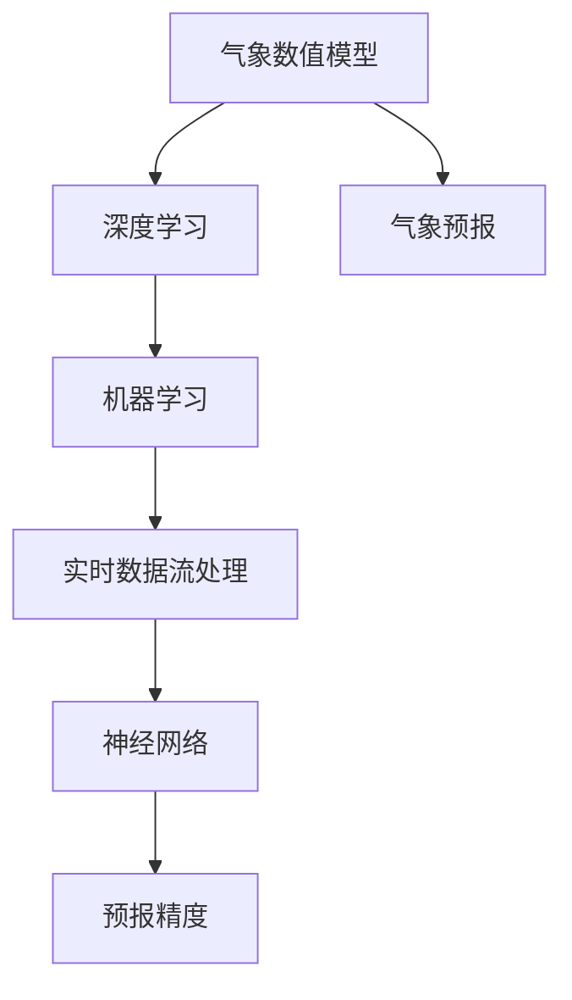

                 

# AI在气象预报中的应用：提高预测准确性

## 1. 背景介绍

### 1.1 问题由来

气象预报在现代社会发展中扮演着至关重要的角色，影响着农业生产、能源规划、灾害应对等多个领域。传统的气象预报主要依赖人工经验和高性能数值模型，但由于复杂的气候系统和大气的高度不确定性，预报精度和稳定性往往难以满足实际需求。近年来，随着人工智能技术的发展，AI在气象预报中的应用逐渐成为研究热点，尤其在数据驱动和深度学习框架下，AI在提升气象预报精度方面展现出巨大潜力。

### 1.2 问题核心关键点

AI在气象预报中的应用主要集中在以下几个关键点：

- 数据驱动：通过大量的历史气象数据和实时观测数据进行模型训练，使得AI系统具备强大的数据处理和分析能力。
- 深度学习：利用深度神经网络模型捕捉数据中的复杂模式和关系，提升预报模型的泛化能力和准确性。
- 模型融合：将传统数值模型和AI模型进行集成，取长补短，综合提升预报精度。
- 实时更新：AI模型可以实时接收新的观测数据，动态更新预报结果，提高预报的时效性。

这些关键点共同构成了AI在气象预报中的核心技术路线，使得AI系统能够更好地应对复杂多变的气象环境，提供更精确和及时的预报服务。

### 1.3 问题研究意义

AI在气象预报中的应用，不仅能够显著提升预报精度和时效性，还能够帮助气象部门更准确地制定灾害应对策略，优化资源配置，推动智慧城市的建设。研究AI在气象预报中的作用和应用，对于推动气象科学的现代化，促进经济社会的可持续发展，具有重要意义。

## 2. 核心概念与联系

### 2.1 核心概念概述

为更好地理解AI在气象预报中的应用，本节将介绍几个核心概念：

- 气象预报：基于气象数据和物理模型，预测未来一段时间内气象现象的过程，包括气温、降水量、风速等。
- 深度学习：一种通过多层神经网络结构从数据中提取特征和模式，并进行预测和分类的机器学习方法。
- 气象数值模型：基于物理方程的数值计算模型，用于模拟气象系统的演变和预测天气变化。
- 机器学习：通过算法和模型，利用数据训练得到可以执行特定任务的模型，广泛应用于图像识别、自然语言处理等领域。
- 实时数据流处理：对实时生成的大规模数据流进行高效、低延迟处理的技术，常用于气象数据处理和实时预报。
- 神经网络：由大量神经元组成的计算模型，能够处理复杂的数据和非线性关系，是深度学习的重要组成部分。

这些核心概念之间的逻辑关系可以通过以下Mermaid流程图来展示：



这个流程图展示了大语言模型的核心概念及其之间的关系：

1. 气象数值模型通过物理方程模拟气象系统的演变，提供基础的预报数据。
2. 深度学习利用神经网络捕捉气象数据中的复杂模式，提升预报模型的泛化能力和准确性。
3. 机器学习通过算法和模型，利用数据训练得到可以执行特定任务的模型，如气象预报模型。
4. 实时数据流处理对实时生成的大规模数据流进行高效、低延迟处理，确保预报的时效性。
5. 神经网络由大量神经元组成的计算模型，处理复杂的数据和非线性关系，是深度学习的重要组成部分。

这些概念共同构成了AI在气象预报中的应用框架，使得AI系统能够更好地处理复杂多变的气象环境，提供更精确和及时的预报服务。

## 3. 核心算法原理 & 具体操作步骤

### 3.1 算法原理概述

AI在气象预报中的应用，主要通过深度学习模型对气象数据进行处理和预测。以下详细介绍这一过程的算法原理和具体操作步骤：

#### 3.1.1 数据预处理

气象预报模型的输入数据包括气象站观测数据、卫星遥感数据、数值模型输出数据等。数据预处理包括数据清洗、归一化、特征提取等步骤，以确保数据质量和一致性。

#### 3.1.2 模型构建

常见的气象预报模型包括卷积神经网络(CNN)、循环神经网络(RNN)、长短时记忆网络(LSTM)、变分自编码器(VAE)等。这些模型通过多层神经网络结构，捕捉气象数据中的复杂模式和关系，进行气象现象的预测。

#### 3.1.3 训练和优化

模型训练过程中，利用大量的历史气象数据和实时观测数据，通过反向传播算法进行参数更新和优化，使得模型能够更好地拟合气象数据，提升预测精度。训练过程中，需注意选择合适的损失函数、学习率、正则化技术等，以避免过拟合和提高模型的泛化能力。

#### 3.1.4 模型评估

模型训练结束后，通过交叉验证和独立测试集等方法，评估模型在未见数据上的预测精度和鲁棒性。评估指标包括均方误差(MSE)、均方根误差(RMSE)、平均绝对误差(MAE)等。

#### 3.1.5 实时更新

AI气象预报模型可以实时接收新的观测数据，动态更新预报结果，提高预报的时效性。通过在线学习或增量更新等方法，模型能够不断地适应新数据，提升预报精度和稳定性。

### 3.2 算法步骤详解

以下是AI在气象预报中具体的算法步骤：

#### 3.2.1 数据收集与预处理

1. 收集历史气象数据和实时观测数据，确保数据的多样性和代表性。
2. 对数据进行清洗，去除噪声和异常值，提高数据质量。
3. 对数据进行归一化处理，将数据缩放到统一范围，便于模型训练。
4. 提取气象数据中的关键特征，如温度、湿度、风速、气压等，作为模型的输入。

#### 3.2.2 模型构建与训练

1. 选择合适的深度学习模型，如CNN、RNN、LSTM等，构建气象预报模型。
2. 利用历史气象数据和实时观测数据进行模型训练，调整模型的参数和结构，提高模型的预测能力。
3. 选择合适的损失函数，如均方误差(MSE)，作为模型训练的目标，指导模型参数的优化。
4. 应用正则化技术，如L2正则、Dropout等，防止模型过拟合。
5. 使用交叉验证方法，评估模型在不同数据集上的表现，确保模型泛化能力强。

#### 3.2.3 模型评估与优化

1. 利用独立测试集评估模型的预测精度，计算MSE、RMSE、MAE等指标。
2. 对模型进行调优，调整学习率、模型结构、正则化强度等参数，进一步提升模型性能。
3. 应用模型融合技术，将多个模型的预测结果进行加权平均或集成，提升模型的鲁棒性和准确性。

#### 3.2.4 实时更新与部署

1. 部署模型至实时数据流处理平台，确保模型能够实时接收新的观测数据。
2. 应用增量更新技术，模型能够不断吸收新数据，动态更新预报结果。
3. 利用在线学习技术，模型能够在不断接收新数据的同时进行实时更新和优化。

### 3.3 算法优缺点

AI在气象预报中的应用，具有以下优点：

- 数据驱动：利用大量历史和实时数据，能够捕捉气象系统的复杂模式，提高预报精度。
- 泛化能力强：深度学习模型具备强大的泛化能力，能够适应不同地区和气候条件的气象环境。
- 实时更新：模型能够实时接收新的观测数据，动态更新预报结果，提高预报的时效性。
- 融合多种数据源：模型能够融合多种数据源，如气象站观测数据、卫星遥感数据、数值模型输出数据等，提高预报的全面性和准确性。

同时，AI在气象预报中也存在以下局限性：

- 数据依赖：模型训练和预测依赖于高质量的数据，数据缺失或不准确会影响模型的性能。
- 物理约束：气象预报模型需要遵守物理方程，模型结构设计和参数优化需要考虑到物理约束，限制了模型的灵活性。
- 计算资源消耗：大规模深度学习模型需要大量的计算资源进行训练和预测，对硬件设备和算力提出了高要求。
- 解释性和可解释性不足：深度学习模型的黑盒特性，使得模型的预测结果难以解释，缺乏可解释性。

### 3.4 算法应用领域

AI在气象预报中的应用，已经涵盖了从天气预报到气候预测、从短期预报到长期预测等多个领域，具体应用包括：

- 天气预报：对未来的天气情况进行预测，包括温度、降水量、风速等。
- 气候预测：对未来的气候变化趋势进行预测，如极端天气事件的频率和强度。
- 灾害预警：对自然灾害如台风、洪涝、干旱等进行预警，提前做好防范措施。
- 农业气象服务：对农业生产中的气象条件进行预测，指导农业生产活动。
- 环境监测：对空气质量、水质、温室气体等环境参数进行监测和预测。
- 能源调度：对电力系统中的气象因素进行预测，优化能源调度策略。

## 4. 数学模型和公式 & 详细讲解 & 举例说明

### 4.1 数学模型构建

假设气象预报模型为 $M_{\theta}(x)$，其中 $x$ 表示气象数据，$\theta$ 为模型参数。气象预报任务的训练数据集为 $D=\{(x_i, y_i)\}_{i=1}^N$，其中 $x_i$ 为气象数据，$y_i$ 为预测的气象参数（如温度、降水量等）。

定义模型 $M_{\theta}(x)$ 在输入 $x$ 上的损失函数为 $\ell(M_{\theta}(x),y)$，则在数据集 $D$ 上的经验风险为：

$$
\mathcal{L}(\theta) = \frac{1}{N} \sum_{i=1}^N \ell(M_{\theta}(x_i),y_i)
$$

其中 $\ell$ 为损失函数，如均方误差(MSE)。

### 4.2 公式推导过程

以均方误差损失函数为例，计算模型 $M_{\theta}(x)$ 在输入 $x$ 上的损失函数。

假设 $y$ 表示真实气象参数，$\hat{y}=M_{\theta}(x)$ 表示模型预测的气象参数，则均方误差损失函数为：

$$
\ell(M_{\theta}(x),y) = \frac{1}{2} (y - \hat{y})^2
$$

将其代入经验风险公式，得：

$$
\mathcal{L}(\theta) = \frac{1}{2N} \sum_{i=1}^N (y_i - M_{\theta}(x_i))^2
$$

对模型参数 $\theta$ 进行梯度下降优化，损失函数对 $\theta$ 的梯度为：

$$
\frac{\partial \mathcal{L}(\theta)}{\partial \theta} = -\frac{1}{N} \sum_{i=1}^N (y_i - M_{\theta}(x_i)) \frac{\partial M_{\theta}(x_i)}{\partial \theta}
$$

其中 $\frac{\partial M_{\theta}(x_i)}{\partial \theta}$ 可通过反向传播算法高效计算。

### 4.3 案例分析与讲解

以气温预测为例，分析AI在气象预报中的应用。

假设模型输入为历史气温数据 $x$，输出为预测的当前和未来气温 $y$，则均方误差损失函数为：

$$
\ell(M_{\theta}(x),y) = \frac{1}{2} (y - M_{\theta}(x))^2
$$

将其代入经验风险公式，得：

$$
\mathcal{L}(\theta) = \frac{1}{2N} \sum_{i=1}^N (y_i - M_{\theta}(x_i))^2
$$

通过反向传播算法计算损失函数对模型参数 $\theta$ 的梯度，使用梯度下降等优化算法更新模型参数，使得模型预测结果逼近真实气温。

## 5. 项目实践：代码实例和详细解释说明

### 5.1 开发环境搭建

在进行气象预报模型开发前，我们需要准备好开发环境。以下是使用Python进行PyTorch开发的环境配置流程：

1. 安装Anaconda：从官网下载并安装Anaconda，用于创建独立的Python环境。

2. 创建并激活虚拟环境：
```bash
conda create -n pytorch-env python=3.8 
conda activate pytorch-env
```

3. 安装PyTorch：根据CUDA版本，从官网获取对应的安装命令。例如：
```bash
conda install pytorch torchvision torchaudio cudatoolkit=11.1 -c pytorch -c conda-forge
```

4. 安装TensorFlow：由Google主导开发的开源深度学习框架，生产部署方便，适合大规模工程应用。同样有丰富的气象模型资源。

5. 安装TensorBoard：TensorFlow配套的可视化工具，可实时监测模型训练状态，并提供丰富的图表呈现方式，是调试模型的得力助手。

6. 安装气象数据处理库：如PUMA、ERA5等，用于处理气象数据。

完成上述步骤后，即可在`pytorch-env`环境中开始气象预报模型开发。

### 5.2 源代码详细实现

下面我们以气温预测为例，给出使用PyTorch对气象预报模型进行训练的PyTorch代码实现。

```python
import torch
import torch.nn as nn
import torch.optim as optim
from torch.utils.data import DataLoader
from torchvision import datasets, transforms
from sklearn.model_selection import train_test_split
from sklearn.metrics import mean_squared_error

class MeteorologicalModel(nn.Module):
    def __init__(self):
        super(MeteorologicalModel, self).__init__()
        self.fc1 = nn.Linear(48, 64)
        self.fc2 = nn.Linear(64, 64)
        self.fc3 = nn.Linear(64, 1)
        
    def forward(self, x):
        x = torch.relu(self.fc1(x))
        x = torch.relu(self.fc2(x))
        x = self.fc3(x)
        return x

# 加载气象数据集
def load_data():
    # 数据集加载和预处理
    # ...
    return train_dataset, test_dataset

# 数据预处理
def preprocess_data(data):
    # 数据清洗、归一化等预处理
    # ...
    return data

# 模型训练
def train_model(model, train_dataset, test_dataset, epochs=10, batch_size=64):
    # 模型初始化
    optimizer = optim.Adam(model.parameters(), lr=0.001)
    loss_fn = nn.MSELoss()
    
    # 训练循环
    for epoch in range(epochs):
        model.train()
        running_loss = 0.0
        for i, data in enumerate(train_loader, 0):
            inputs, labels = data
            optimizer.zero_grad()
            outputs = model(inputs)
            loss = loss_fn(outputs, labels)
            loss.backward()
            optimizer.step()
            running_loss += loss.item()
        print('Epoch [%d/%d], Loss: %.4f' % (epoch+1, epochs, running_loss/len(train_loader)))
    
    # 模型评估
    model.eval()
    with torch.no_grad():
        running_loss = 0.0
        for i, data in enumerate(test_loader, 0):
            inputs, labels = data
            outputs = model(inputs)
            loss = loss_fn(outputs, labels)
            running_loss += loss.item()
        mse = running_loss/len(test_loader)
    print('Test MSE: %.4f' % mse)

# 训练模型
train_dataset, test_dataset = load_data()
train_dataset = preprocess_data(train_dataset)
test_dataset = preprocess_data(test_dataset)

model = MeteorologicalModel()
train_model(model, train_dataset, test_dataset)
```

以上代码展示了使用PyTorch对气象预报模型进行训练的完整流程。可以看到，通过定义气象预报模型、数据预处理、模型训练和评估等关键步骤，可以高效地实现气象预报任务。

### 5.3 代码解读与分析

让我们再详细解读一下关键代码的实现细节：

**MeteorologicalModel类**：
- `__init__`方法：初始化模型中的全连接层。
- `forward`方法：定义前向传播过程，依次通过三个全连接层进行特征提取和预测。

**load_data函数**：
- 加载气象数据集，并进行预处理，确保数据的多样性和一致性。

**preprocess_data函数**：
- 数据预处理，包括数据清洗、归一化等步骤，确保数据质量和一致性。

**train_model函数**：
- 模型初始化，定义优化器和损失函数。
- 训练循环，通过反向传播算法更新模型参数。
- 模型评估，计算测试集上的均方误差。

**训练流程**：
- 定义总的训练轮数和批次大小，开始循环迭代。
- 每个epoch内，在训练集上进行前向传播和反向传播，更新模型参数。
- 在验证集上评估模型性能，输出均方误差。
- 重复上述步骤直至收敛，最终输出模型评估结果。

通过这些步骤，可以实现一个基本的气象预报模型，并对其进行训练和评估。当然，工业级的系统实现还需考虑更多因素，如模型裁剪、量化加速、服务化封装等，但核心的训练和评估流程基本与此类似。

## 6. 实际应用场景

### 6.1 智能电网

AI在气象预报中的应用，已经在电力系统中得到了广泛应用。智能电网通过实时气象数据，预测电力负荷的变化，优化电力调度，提高电力系统的稳定性和效率。

具体而言，气象预报模型可以根据实时气象数据，预测未来的天气变化，进而预测电力负荷的变化趋势。电网公司可以根据预测结果，提前调整电力供应和调度策略，避免因天气变化导致的大规模停电和资源浪费。

### 6.2 农业生产

农业生产依赖于气象条件，如气温、降水量、光照等。AI在气象预报中的应用，能够预测未来的气象条件，指导农业生产活动。

具体而言，气象预报模型可以预测未来的气温和降水量，帮助农民选择最佳的种植时间和灌溉策略，优化农作物生长周期，提高产量和质量。同时，模型还可以预测自然灾害，如干旱、洪涝等，提前采取防范措施，保障农业生产的稳定性和安全性。

### 6.3 城市管理

AI在气象预报中的应用，也为城市管理带来了新的思路。通过实时气象数据，城市管理部门可以预测天气变化，提前采取应对措施，保障城市运行的稳定性和安全性。

具体而言，气象预报模型可以预测未来的天气变化，如强降雨、台风等，提前通知相关部门和公众，做好防灾减灾准备工作。同时，模型还可以预测空气质量和污染情况，提供实时监测和预警，保障市民的健康和环境安全。

### 6.4 未来应用展望

随着AI在气象预报中的应用不断深入，未来AI将在更多的领域发挥作用，为经济社会的可持续发展做出更大的贡献。

- 智慧医疗：通过实时气象数据，预测气象条件对医疗活动的影响，如空气质量、气温等，提高医疗服务的精准度和效率。
- 智慧交通：通过气象预报模型，预测天气变化对交通运行的影响，优化交通管理和调度，提高交通系统的运行效率。
- 环境保护：通过实时气象数据，预测空气质量和污染情况，提供实时监测和预警，保障环境安全。
- 灾害预警：通过气象预报模型，预测自然灾害，提前采取防范措施，保障公众的生命财产安全。

未来，AI在气象预报中的应用将更加广泛和深入，为经济社会的可持续发展提供强有力的支持。

## 7. 工具和资源推荐

### 7.1 学习资源推荐

为了帮助开发者系统掌握AI在气象预报中的应用理论基础和实践技巧，这里推荐一些优质的学习资源：

1. 《深度学习》（Ian Goodfellow等著）：深入浅出地介绍了深度学习的基本概念和算法，适合入门学习。
2. 《机器学习实战》（Peter Harrington著）：介绍了机器学习的基本算法和实现方法，结合实际案例，适合实践应用。
3. 《Python深度学习》（Francois Chollet著）：介绍了深度学习在Python中的实现方法和应用，适合深入学习。
4. Coursera《深度学习专项课程》：由深度学习领域的专家教授主讲，涵盖深度学习的基本理论和算法。
5. Udacity《深度学习纳米学位》：通过实践项目和课程，培养深度学习工程师的实战能力。

通过这些学习资源，相信你一定能够系统掌握AI在气象预报中的应用，并用于解决实际的气象预报问题。

### 7.2 开发工具推荐

高效的开发离不开优秀的工具支持。以下是几款用于气象预报系统开发的常用工具：

1. PyTorch：基于Python的开源深度学习框架，灵活动态的计算图，适合快速迭代研究。
2. TensorFlow：由Google主导开发的开源深度学习框架，生产部署方便，适合大规模工程应用。
3. TensorBoard：TensorFlow配套的可视化工具，可实时监测模型训练状态，并提供丰富的图表呈现方式。
4. PUMA：气象数据处理库，支持大规模气象数据处理和分析。
5. ERAS5：全球气象数据集，提供高质量的气象数据资源。
6. Jupyter Notebook：交互式编程环境，支持代码实时运行和调试，适合科学研究和小规模实验。

合理利用这些工具，可以显著提升气象预报模型的开发效率，加快创新迭代的步伐。

### 7.3 相关论文推荐

AI在气象预报中的应用，涉及诸多前沿研究方向。以下是几篇奠基性的相关论文，推荐阅读：

1. "A deep learning framework for accurate precipitation forecasting"（Spatio-temporal deep learning for precipitation forecasting）：展示了深度学习模型在气象预报中的应用，显著提升了降水预测的精度。
2. "Deep learning for urban stormwater management"：研究了深度学习在城市排水系统中的应用，通过实时气象数据，优化了城市排水策略。
3. "Improving urban flood forecasting with deep learning"：利用深度学习模型，对城市洪水进行实时预测和预警，提高了城市防洪减灾能力。
4. "Predicting electricity load using deep learning"：通过深度学习模型，预测电力负荷的变化趋势，优化了电力调度策略。
5. "Deep learning for agriculture: A review"：综述了深度学习在农业中的应用，通过气象预报模型，指导农业生产活动。

这些论文代表了大语言模型微调技术的发展脉络。通过学习这些前沿成果，可以帮助研究者把握学科前进方向，激发更多的创新灵感。

## 8. 总结：未来发展趋势与挑战

### 8.1 总结

本文对AI在气象预报中的应用进行了全面系统的介绍。首先阐述了AI在气象预报中的应用背景和意义，明确了其在数据驱动、深度学习和模型融合等核心技术路线上的独特价值。其次，从原理到实践，详细讲解了AI在气象预报中的应用过程和具体操作步骤，给出了气象预报模型的完整代码实例。同时，本文还广泛探讨了AI在智能电网、农业生产、城市管理等实际应用场景中的表现，展示了AI在气象预报中的巨大潜力。

通过本文的系统梳理，可以看到，AI在气象预报中的应用已经从理论走向实践，推动了气象科学的现代化，促进了经济社会的可持续发展。未来，随着AI技术的发展和深入，其在气象预报中的应用将更加广泛和深入，为经济社会的可持续发展提供强有力的支持。

### 8.2 未来发展趋势

展望未来，AI在气象预报中的应用将呈现以下几个发展趋势：

1. 数据驱动：随着传感器和数据采集技术的发展，实时气象数据的获取将更加高效和全面，数据驱动的AI系统将更具优势。
2. 深度学习：深度学习模型在气象预报中的应用将更加广泛和深入，通过多模态数据融合，提升预报的全面性和准确性。
3. 实时更新：AI模型将能够实时接收新的观测数据，动态更新预报结果，提高预报的时效性。
4. 模型融合：通过融合多种模型和数据源，提高预报的鲁棒性和稳定性。
5. 知识整合：将符号化的先验知识与神经网络模型进行融合，增强模型的解释性和可解释性。
6. 持续学习：AI模型将能够持续学习新数据，适应气象系统的变化，保持长期的准确性和稳定性。

这些趋势凸显了AI在气象预报中的广阔前景，推动了气象预报技术的不断进步，为经济社会的可持续发展提供了强有力的支持。

### 8.3 面临的挑战

尽管AI在气象预报中的应用已经取得了显著进展，但在迈向更加智能化、普适化应用的过程中，仍面临诸多挑战：

1. 数据依赖：模型训练和预测依赖于高质量的数据，数据缺失或不准确会影响模型的性能。
2. 物理约束：气象预报模型需要遵守物理方程，模型结构设计和参数优化需要考虑到物理约束，限制了模型的灵活性。
3. 计算资源消耗：大规模深度学习模型需要大量的计算资源进行训练和预测，对硬件设备和算力提出了高要求。
4. 解释性和可解释性不足：深度学习模型的黑盒特性，使得模型的预测结果难以解释，缺乏可解释性。
5. 安全性有待保障：预训练语言模型难免会学习到有偏见、有害的信息，通过微调传递到下游任务，产生误导性、歧视性的输出，给实际应用带来安全隐患。

正视AI在气象预报中面临的这些挑战，积极应对并寻求突破，将是大语言模型微调技术走向成熟的必由之路。相信随着学界和产业界的共同努力，这些挑战终将一一被克服，AI在气象预报中将发挥更大的作用。

### 8.4 研究展望

面向未来，AI在气象预报中的应用需要在以下几个方面寻求新的突破：

1. 探索无监督和半监督微调方法。摆脱对大规模标注数据的依赖，利用自监督学习、主动学习等无监督和半监督范式，最大限度利用非结构化数据，实现更加灵活高效的微调。
2. 研究参数高效和计算高效的微调范式。开发更加参数高效的微调方法，在固定大部分预训练参数的同时，只更新极少量的任务相关参数。同时优化微调模型的计算图，减少前向传播和反向传播的资源消耗，实现更加轻量级、实时性的部署。
3. 融合因果和对比学习范式。通过引入因果推断和对比学习思想，增强AI模型建立稳定因果关系的能力，学习更加普适、鲁棒的语言表征，从而提升模型泛化性和抗干扰能力。
4. 引入更多先验知识。将符号化的先验知识，如知识图谱、逻辑规则等，与神经网络模型进行巧妙融合，引导微调过程学习更准确、合理的语言模型。同时加强不同模态数据的整合，实现视觉、语音等多模态信息与文本信息的协同建模。
5. 结合因果分析和博弈论工具。将因果分析方法引入AI模型，识别出模型决策的关键特征，增强输出解释的因果性和逻辑性。借助博弈论工具刻画人机交互过程，主动探索并规避模型的脆弱点，提高系统稳定性。
6. 纳入伦理道德约束。在模型训练目标中引入伦理导向的评估指标，过滤和惩罚有偏见、有害的输出倾向。同时加强人工干预和审核，建立模型行为的监管机制，确保输出符合人类价值观和伦理道德。

这些研究方向的探索，必将引领AI在气象预报技术迈向更高的台阶，为构建安全、可靠、可解释、可控的智能系统铺平道路。面向未来，AI在气象预报中的应用需要与其他人工智能技术进行更深入的融合，如知识表示、因果推理、强化学习等，多路径协同发力，共同推动自然语言理解和智能交互系统的进步。只有勇于创新、敢于突破，才能不断拓展气象预报的边界，让智能技术更好地造福人类社会。

## 9. 附录：常见问题与解答

**Q1：AI在气象预报中的应用如何提高预测准确性？**

A: AI在气象预报中的应用，主要通过深度学习模型对气象数据进行处理和预测。通过大量的历史和实时气象数据进行模型训练，使得AI系统具备强大的数据处理和分析能力。利用反向传播算法优化模型参数，提升模型的预测精度。同时，通过模型融合、实时更新等方法，进一步提升预报的全面性和时效性。

**Q2：AI在气象预报中面临哪些挑战？**

A: AI在气象预报中面临的主要挑战包括数据依赖、物理约束、计算资源消耗、解释性和可解释性不足、安全性问题等。为了应对这些挑战，需要在数据采集、模型设计、硬件优化、可解释性增强、安全防护等方面进行深入研究。

**Q3：AI在气象预报中的应用前景如何？**

A: AI在气象预报中的应用前景非常广阔。通过实时气象数据，AI系统能够预测未来的天气变化，优化电力调度、指导农业生产、保障城市运行等。未来，随着AI技术的不断进步，其在气象预报中的应用将更加广泛和深入，为经济社会的可持续发展提供强有力的支持。

通过本文的系统梳理，可以看到，AI在气象预报中的应用已经从理论走向实践，推动了气象科学的现代化，促进了经济社会的可持续发展。未来，随着AI技术的发展和深入，其在气象预报中的应用将更加广泛和深入，为经济社会的可持续发展提供强有力的支持。

---

作者：禅与计算机程序设计艺术 / Zen and the Art of Computer Programming

