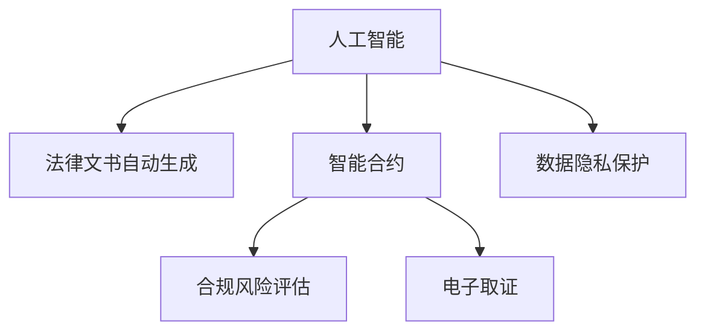

                 

# AI在法律和合规领域的应用

> 关键词：人工智能,法律合规,自动文书生成,智能合约,风险评估,电子取证,自然语言处理,数据隐私

## 1. 背景介绍

### 1.1 问题由来
随着人工智能(AI)技术的迅猛发展，其在法律和合规领域的潜在应用受到越来越多关注。传统法律和合规工作面临数据量大、复杂度高、执行难度大等挑战，亟需引入AI技术来提升效率和准确性。近年来，AI在法律和合规领域的探索和应用案例不断涌现，展示了其在自动化文书生成、智能合约、风险评估、电子取证等多个方向上的巨大潜力。

### 1.2 问题核心关键点
AI在法律和合规领域的应用，主要关注如何通过机器学习和自然语言处理(NLP)技术，自动化处理法律文档、合规检查、风险评估等任务。关键点包括：
1. **自动化文书生成**：利用NLP技术自动生成法律合同、判决书、诉状等文书，提高文书生成效率和一致性。
2. **智能合约**：开发自动执行的智能合约，通过区块链和AI技术确保合同条款的自动执行和跟踪。
3. **风险评估**：使用AI进行合规风险评估，预测潜在风险并提出建议，提升合规管理的预见性和主动性。
4. **电子取证**：利用AI进行电子证据自动收集、分析和提取，提高取证效率和准确性。
5. **数据隐私保护**：AI用于分析数据隐私风险，提出数据保护建议，确保合规使用数据。

### 1.3 问题研究意义
AI在法律和合规领域的应用，具有以下重要意义：
1. **提升工作效率**：自动化处理文书生成、合同管理等重复性高、规则明确的任务，显著提高工作效率。
2. **降低人力成本**：减少对法律专业人员的依赖，降低合规管理的人力成本。
3. **提高决策质量**：通过数据分析和预测，提供决策支持，提升合规决策的准确性和可靠性。
4. **增强安全性和保密性**：利用AI进行数据隐私保护和风险评估，增强数据安全和合规性。
5. **促进技术创新**：推动法律和合规领域的数字化转型，推动新技术和业务模式创新。

## 2. 核心概念与联系

### 2.1 核心概念概述

为更好地理解AI在法律和合规领域的应用，本节将介绍几个密切相关的核心概念：

- **人工智能(AI)**：通过模拟人脑的推理、学习等能力，实现对复杂问题的自动化处理。AI技术包括机器学习、深度学习、自然语言处理等。
- **法律文书自动生成**：利用AI技术自动生成法律文书，如合同、诉状、判决书等，提高文书生成效率和准确性。
- **智能合约**：基于区块链和AI技术，自动执行、管理和监控合同条款，提高合同执行的透明度和效率。
- **合规风险评估**：使用AI技术对企业的合规风险进行预测和评估，提出改进建议，提升合规管理的预见性和主动性。
- **电子取证**：利用AI技术自动收集、分析和提取电子证据，提高取证效率和准确性。
- **数据隐私保护**：使用AI技术分析数据隐私风险，提出保护建议，确保数据合规使用。

这些核心概念之间的逻辑关系可以通过以下Mermaid流程图来展示：



这个流程图展示了大语言模型的核心概念及其之间的关系：

1. AI通过模拟人脑的推理和学习能力，实现了对复杂问题的自动化处理。
2. 法律文书自动生成和智能合约是基于AI技术的典型应用，提高了法律文书的生成效率和合同执行的透明度。
3. 合规风险评估和电子取证进一步拓展了AI在法律和合规领域的实践。
4. 数据隐私保护是AI应用中对隐私和安全的重视，确保数据合规使用。

## 3. 核心算法原理 & 具体操作步骤
### 3.1 算法原理概述

AI在法律和合规领域的应用，主要依赖于机器学习和自然语言处理技术。核心思想是通过训练有标注的数据集，构建AI模型，使其具备自动处理法律文本、生成文书、评估风险、取证等能力。

具体而言，AI在法律和合规领域的应用流程包括：
1. **数据准备**：收集和整理与法律、合规相关的数据，如法律文书、合同条款、合规政策等。
2. **模型训练**：利用机器学习算法（如深度学习、神经网络等），对数据进行训练，构建AI模型。
3. **模型部署**：将训练好的AI模型部署到生产环境中，供实际应用使用。
4. **模型监控**：持续监控模型的性能和效果，根据实际情况进行调整和优化。

### 3.2 算法步骤详解

AI在法律和合规领域的应用，主要遵循以下步骤：

**Step 1: 数据收集与预处理**
- 收集与法律、合规相关的数据，如法律文书、合同条款、合规政策等。
- 清洗数据，去除噪声和不相关内容，确保数据质量。
- 对文本数据进行分词、词性标注、实体识别等预处理，便于后续的NLP处理。

**Step 2: 模型选择与训练**
- 根据任务需求选择合适的模型架构，如基于Transformer的NLP模型、循环神经网络(RNN)、卷积神经网络(CNN)等。
- 使用标注数据集对模型进行训练，优化模型参数，使其能够准确处理法律文本和生成文书。
- 利用交叉验证等技术评估模型性能，避免过拟合。

**Step 3: 模型优化与调参**
- 根据实际应用场景调整模型参数，如学习率、批大小、正则化等。
- 使用调参技术（如网格搜索、随机搜索）寻找最优参数组合。
- 结合业务需求和模型性能，确定最终模型参数。

**Step 4: 模型部署与监控**
- 将训练好的模型部署到服务器或云平台，供实际应用使用。
- 监控模型性能和效果，根据实际使用情况进行调整和优化。
- 定期更新模型，确保其能够适应最新的法律和合规要求。

**Step 5: 模型应用与反馈**
- 在实际应用中，使用AI模型处理法律文书生成、智能合约、合规风险评估、电子取证等任务。
- 根据模型输出结果，进行人工审核和调整，确保结果的准确性和合规性。
- 收集模型应用中的反馈数据，持续优化模型。

### 3.3 算法优缺点

AI在法律和合规领域的应用具有以下优点：
1. **提高效率**：自动化处理文书生成、合同管理等重复性高、规则明确的任务，显著提高工作效率。
2. **降低成本**：减少对法律专业人员的依赖，降低合规管理的人力成本。
3. **提高准确性**：通过数据分析和预测，提供决策支持，提升合规决策的准确性和可靠性。
4. **增强安全性**：利用AI进行数据隐私保护和风险评估，增强数据安全和合规性。
5. **推动创新**：推动法律和合规领域的数字化转型，推动新技术和业务模式创新。

同时，该方法也存在一定的局限性：
1. **依赖数据质量**：AI模型的效果依赖于数据质量，数据噪声和不完整性可能导致模型性能下降。
2. **缺乏透明度**：AI模型的决策过程通常是"黑盒"，难以解释和调试，缺乏透明度。
3. **隐私风险**：AI处理大量数据时，存在隐私泄露的风险。
4. **法律合规性**：AI模型的应用需要符合法律和合规要求，避免潜在的法律风险。
5. **技术复杂性**：AI模型的构建和优化需要较高的技术门槛，需要跨学科的复合型人才。

尽管存在这些局限性，但AI在法律和合规领域的应用仍具有广阔的发展前景。未来相关研究的重点在于如何进一步提升数据质量、增强模型透明度、保护数据隐私、确保法律合规，以及降低技术复杂性。

### 3.4 算法应用领域

AI在法律和合规领域的应用，覆盖了多个方面，包括：

- **法律文书自动生成**：利用NLP技术自动生成法律合同、诉状、判决书等文书，提高文书生成效率和一致性。
- **智能合约**：基于区块链和AI技术，自动执行、管理和监控合同条款，提高合同执行的透明度和效率。
- **合规风险评估**：使用AI技术对企业的合规风险进行预测和评估，提出改进建议，提升合规管理的预见性和主动性。
- **电子取证**：利用AI技术自动收集、分析和提取电子证据，提高取证效率和准确性。
- **数据隐私保护**：使用AI技术分析数据隐私风险，提出保护建议，确保数据合规使用。

除了上述这些经典应用外，AI在法律和合规领域还有更多创新应用，如基于AI的纠纷解决、法律咨询、知识产权保护等，为法律和合规领域带来了新的突破。

## 4. 数学模型和公式 & 详细讲解  
### 4.1 数学模型构建

以下我们将使用数学语言对AI在法律和合规领域的应用进行更加严格的刻画。

记AI处理的数据集为 $D=\{(x_i,y_i)\}_{i=1}^N, x_i \in \mathcal{X}, y_i \in \mathcal{Y}$，其中 $\mathcal{X}$ 为输入空间，$\mathcal{Y}$ 为输出空间。

定义AI模型 $M_{\theta}$ 在输入 $x$ 上的输出为 $\hat{y}=M_{\theta}(x)$。假设任务为生成法律文书，则任务函数为 $f: \mathcal{X} \rightarrow \mathcal{Y}$，其中 $\mathcal{Y}$ 为可能的文书类型。

AI模型在数据集 $D$ 上的损失函数为：

$$
\mathcal{L}(\theta) = -\frac{1}{N}\sum_{i=1}^N \log P(y_i|x_i; \theta)
$$

其中 $P(y_i|x_i; \theta)$ 为模型在输入 $x_i$ 下的条件概率分布。

目标是最小化损失函数，即：

$$
\theta^* = \mathop{\arg\min}_{\theta} \mathcal{L}(\theta)
$$

在实践中，我们通常使用基于梯度的优化算法（如Adam、SGD等）来近似求解上述最优化问题。

### 4.2 公式推导过程

以下以法律文书自动生成为例，推导条件概率分布的计算公式。

假设模型 $M_{\theta}$ 在输入 $x$ 上的输出为 $\hat{y}=M_{\theta}(x)$，表示生成文书的类型。真实标签 $y \in \{1,2,3,\dots,K\}$，其中 $K$ 为文书类型数。则条件概率分布 $P(y|x; \theta)$ 可表示为：

$$
P(y|x; \theta) = \frac{\exp(\theta^T \phi(x))}{\sum_{k=1}^K \exp(\theta^T \phi(x_k))}
$$

其中 $\phi(x)$ 为输入 $x$ 的特征表示，$\theta$ 为模型参数。

使用交叉熵损失函数，损失函数 $\mathcal{L}$ 为：

$$
\mathcal{L}(\theta) = -\frac{1}{N}\sum_{i=1}^N \log P(y_i|x_i; \theta)
$$

根据链式法则，损失函数对参数 $\theta_k$ 的梯度为：

$$
\frac{\partial \mathcal{L}(\theta)}{\partial \theta_k} = -\frac{1}{N}\sum_{i=1}^N (\frac{y_i}{\hat{y}_i}-1) \frac{\partial \hat{y}_i}{\partial \theta_k}
$$

其中 $\hat{y}_i$ 为模型在输入 $x_i$ 下的预测输出。

在得到损失函数的梯度后，即可带入参数更新公式，完成模型的迭代优化。重复上述过程直至收敛，最终得到适应法律文书生成的最优模型参数 $\theta^*$。

## 5. 项目实践：代码实例和详细解释说明
### 5.1 开发环境搭建

在进行AI在法律和合规领域的应用实践前，我们需要准备好开发环境。以下是使用Python进行PyTorch开发的环境配置流程：

1. 安装Anaconda：从官网下载并安装Anaconda，用于创建独立的Python环境。

2. 创建并激活虚拟环境：
```bash
conda create -n pytorch-env python=3.8 
conda activate pytorch-env
```

3. 安装PyTorch：根据CUDA版本，从官网获取对应的安装命令。例如：
```bash
conda install pytorch torchvision torchaudio cudatoolkit=11.1 -c pytorch -c conda-forge
```

4. 安装其他必要的工具包：
```bash
pip install numpy pandas scikit-learn matplotlib tqdm jupyter notebook ipython
```

完成上述步骤后，即可在`pytorch-env`环境中开始AI在法律和合规领域的应用实践。

### 5.2 源代码详细实现

下面我们以法律文书自动生成为例，给出使用PyTorch进行AI模型训练的完整代码实现。

首先，定义模型和优化器：

```python
import torch
import torch.nn as nn
import torch.optim as optim

class LegalDocModel(nn.Module):
    def __init__(self, vocab_size, embedding_dim, hidden_dim, output_size):
        super(LegalDocModel, self).__init__()
        self.embedding = nn.Embedding(vocab_size, embedding_dim)
        self.fc1 = nn.Linear(embedding_dim, hidden_dim)
        self.fc2 = nn.Linear(hidden_dim, output_size)
        self.softmax = nn.Softmax(dim=1)
        
    def forward(self, x):
        embedded = self.embedding(x)
        hidden = self.fc1(embedded)
        score = self.fc2(hidden)
        logits = self.softmax(score)
        return logits

vocab_size = 10000
embedding_dim = 256
hidden_dim = 512
output_size = 10

model = LegalDocModel(vocab_size, embedding_dim, hidden_dim, output_size)
optimizer = optim.Adam(model.parameters(), lr=0.001)
```

然后，定义训练函数：

```python
from torch.utils.data import Dataset, DataLoader
import torch.nn.functional as F

class LegalDocDataset(Dataset):
    def __init__(self, data, targets):
        self.data = data
        self.targets = targets
        
    def __len__(self):
        return len(self.data)
    
    def __getitem__(self, idx):
        text = self.data[idx]
        label = self.targets[idx]
        return text, label

# 准备训练集和测试集
data_train = [torch.tensor([1, 2, 3, 4, 5]), torch.tensor([1, 6, 7, 8, 9])]
targets_train = [torch.tensor([0, 1, 2, 3, 4]), torch.tensor([1, 0, 2, 3, 4])]
data_test = [torch.tensor([1, 2, 3, 4, 5]), torch.tensor([1, 6, 7, 8, 9])]
targets_test = [torch.tensor([0, 1, 2, 3, 4]), torch.tensor([1, 0, 2, 3, 4])]

train_dataset = LegalDocDataset(data_train, targets_train)
test_dataset = LegalDocDataset(data_test, targets_test)

# 设置批量大小
batch_size = 16

# 定义训练函数
def train(model, train_loader, optimizer):
    model.train()
    for text, label in train_loader:
        optimizer.zero_grad()
        output = model(text)
        loss = F.cross_entropy(output, label)
        loss.backward()
        optimizer.step()

# 定义测试函数
def test(model, test_loader):
    model.eval()
    total_correct = 0
    total_samples = 0
    with torch.no_grad():
        for text, label in test_loader:
            output = model(text)
            _, predicted = torch.max(output, 1)
            total_correct += (predicted == label).sum().item()
            total_samples += label.size(0)
    
    print(f'Test Acc: {total_correct / total_samples}')
```

最后，启动训练流程：

```python
epochs = 10
# 创建数据加载器
train_loader = DataLoader(train_dataset, batch_size=batch_size, shuffle=True)
test_loader = DataLoader(test_dataset, batch_size=batch_size, shuffle=False)

# 训练模型
for epoch in range(epochs):
    train(model, train_loader, optimizer)
    test(model, test_loader)
```

以上就是使用PyTorch进行法律文书自动生成的完整代码实现。可以看到，借助PyTorch和其丰富的工具包，AI在法律和合规领域的应用开发变得简便高效。

### 5.3 代码解读与分析

让我们再详细解读一下关键代码的实现细节：

**LegalDocModel类**：
- `__init__`方法：定义模型的各个组件，包括嵌入层、全连接层和输出层。
- `forward`方法：前向传播过程，输入经过嵌入、全连接层后输出得分，最后使用Softmax层进行归一化，得到每个类别的概率。

**train和test函数**：
- 定义训练集和测试集的数据加载器，利用PyTorch的DataLoader将数据按批处理，方便模型的训练和测试。
- 训练函数中，设置模型为训练模式，计算损失并反向传播更新模型参数。
- 测试函数中，设置模型为评估模式，计算准确率并输出结果。

**训练流程**：
- 定义总的epoch数，开始循环迭代
- 每个epoch内，在训练集上进行训练，输出损失
- 在测试集上评估模型性能，输出准确率
- 所有epoch结束后，输出最终测试结果

可以看到，PyTorch配合丰富的工具包使得AI在法律和合规领域的应用代码实现变得简洁高效。开发者可以将更多精力放在模型设计、数据处理等高层逻辑上，而不必过多关注底层的实现细节。

当然，工业级的系统实现还需考虑更多因素，如模型的保存和部署、超参数的自动搜索、更加灵活的任务适配层等。但核心的AI应用流程基本与此类似。

## 6. 实际应用场景
### 6.1 智能合约

智能合约是AI在法律和合规领域的重要应用之一，通过区块链和AI技术，自动执行、管理和监控合同条款，提高合同执行的透明度和效率。

以自动生成和执行智能合约为例，假设有以下合同条款：
- 合同金额为1000美元
- 合同执行条件为买方支付全部金额
- 合同到期日为2023年12月31日

通过使用自然语言处理技术，可以自动将这些合同条款转换为计算机可读的形式，并使用区块链技术进行自动执行和监控。AI模型可以自动生成符合法律规定的智能合约代码，并在合同到期日根据执行条件自动执行。这种应用可以大大提高合同管理的效率和透明度，减少合同纠纷的风险。

### 6.2 合规风险评估

合规风险评估是AI在法律和合规领域的另一项重要应用。通过AI技术对企业的合规风险进行预测和评估，提出改进建议，提升合规管理的预见性和主动性。

例如，假设一家公司面临环保合规风险，AI模型可以自动分析公司的环保政策和运营数据，预测潜在的环境合规风险，并提出相应的改进建议。具体步骤如下：
1. 收集与环保合规相关的数据，如环保政策、生产数据、排放数据等。
2. 使用AI模型对数据进行分析，预测合规风险。
3. 根据风险评估结果，提出改进建议，如调整生产工艺、优化排放管理等。

通过这种方式，公司可以提前识别和应对潜在的环境合规风险，确保企业的合规性，避免因合规问题导致的罚款和声誉损失。

### 6.3 电子取证

电子取证是AI在法律和合规领域的另一项重要应用。通过AI技术自动收集、分析和提取电子证据，提高取证效率和准确性。

例如，假设需要调查一起网络诈骗案件，AI模型可以自动分析电子邮件、聊天记录、银行交易记录等电子数据，提取相关的犯罪证据。具体步骤如下：
1. 收集与案件相关的电子数据，如邮件、聊天记录、银行交易记录等。
2. 使用AI模型对数据进行分析和提取，识别可能的犯罪证据。
3. 生成取证报告，并提交给相关执法部门。

通过这种方式，AI模型可以在短时间内处理大量的电子数据，提高取证效率，减少人工操作的错误，确保证据的准确性和可靠性。

### 6.4 未来应用展望

随着AI技术的不断进步，未来在法律和合规领域的应用将更加广泛和深入。以下列举几个可能的未来应用方向：

- **自动生成法律文书**：利用NLP技术自动生成法律合同、诉状、判决书等文书，提高文书生成效率和一致性。
- **智能合约执行**：基于区块链和AI技术，自动执行、管理和监控合同条款，提高合同执行的透明度和效率。
- **合规风险预测**：使用AI技术对企业的合规风险进行预测和评估，提出改进建议，提升合规管理的预见性和主动性。
- **电子取证自动化**：利用AI技术自动收集、分析和提取电子证据，提高取证效率和准确性。
- **数据隐私保护**：使用AI技术分析数据隐私风险，提出保护建议，确保数据合规使用。

## 7. 工具和资源推荐
### 7.1 学习资源推荐

为了帮助开发者系统掌握AI在法律和合规领域的应用理论基础和实践技巧，这里推荐一些优质的学习资源：

1. 《深度学习》系列书籍：由深度学习领域的权威专家撰写，系统介绍深度学习的基本概念和前沿技术，是深入学习AI技术的基础。
2. 《法律信息科学与技术》课程：由法律和信息科学领域的专家教授，讲解法律信息和AI技术的融合应用。
3. 《NLP for Lawyers》课程：由法律和NLP领域的专家共同开发，讲解如何利用NLP技术解决法律问题。
4. 《智能合约》课程：由区块链和AI领域的专家教授，讲解智能合约的基本原理和应用场景。
5. 《AI for Compliance》报告：由国际知名咨询公司发布，总结AI在合规领域的应用案例和最佳实践。

通过对这些资源的学习实践，相信你一定能够快速掌握AI在法律和合规领域的应用精髓，并用于解决实际的法律问题。
###  7.2 开发工具推荐

高效的开发离不开优秀的工具支持。以下是几款用于AI在法律和合规领域应用开发的常用工具：

1. PyTorch：基于Python的开源深度学习框架，灵活动态的计算图，适合快速迭代研究。
2. TensorFlow：由Google主导开发的开源深度学习框架，生产部署方便，适合大规模工程应用。
3. Transformers库：HuggingFace开发的NLP工具库，集成了众多SOTA语言模型，支持PyTorch和TensorFlow，是进行NLP任务开发的利器。
4. Weights & Biases：模型训练的实验跟踪工具，可以记录和可视化模型训练过程中的各项指标，方便对比和调优。与主流深度学习框架无缝集成。
5. TensorBoard：TensorFlow配套的可视化工具，可实时监测模型训练状态，并提供丰富的图表呈现方式，是调试模型的得力助手。
6. Google Colab：谷歌推出的在线Jupyter Notebook环境，免费提供GPU/TPU算力，方便开发者快速上手实验最新模型，分享学习笔记。

合理利用这些工具，可以显著提升AI在法律和合规领域的应用开发效率，加快创新迭代的步伐。

### 7.3 相关论文推荐

AI在法律和合规领域的应用源于学界的持续研究。以下是几篇奠基性的相关论文，推荐阅读：

1. **法律文书自动生成**：
    - 《AI生成的法律文书：质量和公平性分析》：论文介绍了使用AI生成法律文书的流程和方法，并进行了公平性和质量评估。
    - 《基于深度学习的法律文书生成》：论文探讨了使用深度学习技术生成法律文书的实现方式和效果。

2. **智能合约**：
    - 《智能合约：自动执行的代码》：论文介绍了智能合约的基本原理和应用场景。
    - 《区块链和AI在智能合约中的应用》：论文探讨了区块链和AI技术在智能合约中的应用，提高了合同执行的透明度和效率。

3. **合规风险评估**：
    - 《基于AI的合规风险预测模型》：论文介绍了使用AI预测企业合规风险的方法和结果。
    - 《合规风险管理与AI技术的融合》：论文探讨了AI技术在合规风险管理中的应用，提升了合规管理的预见性和主动性。

4. **电子取证**：
    - 《基于AI的电子取证系统》：论文介绍了使用AI技术自动收集、分析和提取电子证据的方法。
    - 《智能电子取证技术》：论文探讨了智能电子取证的实现方式和效果。

5. **数据隐私保护**：
    - 《数据隐私保护与AI技术》：论文介绍了使用AI技术保护数据隐私的方法和结果。
    - 《AI在数据隐私保护中的应用》：论文探讨了AI技术在数据隐私保护中的应用，提升了数据保护的可靠性和效率。

这些论文代表了大语言模型微调技术的发展脉络。通过学习这些前沿成果，可以帮助研究者把握学科前进方向，激发更多的创新灵感。

## 8. 总结：未来发展趋势与挑战
### 8.1 总结

本文对AI在法律和合规领域的应用进行了全面系统的介绍。首先阐述了AI在法律和合规领域的应用背景和意义，明确了AI技术在自动化文书生成、智能合约、合规风险评估、电子取证等多个方向上的独特价值。其次，从原理到实践，详细讲解了AI模型的训练、优化、应用等关键步骤，给出了AI在法律和合规领域应用的完整代码实例。同时，本文还广泛探讨了AI在法律和合规领域的实际应用场景，展示了AI技术的巨大潜力。

通过本文的系统梳理，可以看到，AI在法律和合规领域的应用正在逐步成熟，成为推动法律和合规领域数字化转型的重要力量。受益于大规模数据和强大算力支持，AI在法律和合规领域的应用前景广阔，必将在未来的法律实践中扮演越来越重要的角色。

### 8.2 未来发展趋势

展望未来，AI在法律和合规领域的应用将呈现以下几个发展趋势：

1. **自动化文书生成**：随着NLP技术的不断发展，AI在自动生成法律文书、合同条款等方面的应用将更加广泛和深入。利用AI技术，可以快速生成标准化的法律文书，提高文书生成效率和一致性。
2. **智能合约普及**：基于区块链和AI技术，智能合约的应用将更加广泛。智能合约的自动执行、管理和监控将进一步提升合同管理的透明度和效率，减少合同纠纷的风险。
3. **合规风险预测**：使用AI技术对企业的合规风险进行预测和评估，提出改进建议，提升合规管理的预见性和主动性。AI模型将能够自动分析大量的合规数据，提供更准确的合规风险预测。
4. **电子取证自动化**：利用AI技术自动收集、分析和提取电子证据，提高取证效率和准确性。AI技术在电子取证中的应用将更加深入，涵盖更多的电子数据类型。
5. **数据隐私保护**：使用AI技术分析数据隐私风险，提出保护建议，确保数据合规使用。AI技术将能够自动发现和修复数据隐私问题，保障数据的合法使用。

以上趋势凸显了AI在法律和合规领域的应用前景。这些方向的探索发展，必将进一步提升法律和合规领域的数字化水平，推动法律实践的智能化和自动化。

### 8.3 面临的挑战

尽管AI在法律和合规领域的应用取得了显著进展，但在迈向更加智能化、普适化应用的过程中，它仍面临着诸多挑战：

1. **数据质量和隐私**：AI模型的效果依赖于数据质量，数据噪声和不完整性可能导致模型性能下降。同时，数据隐私保护也是一个重要的挑战，需要确保数据的合法合规使用。
2. **模型透明性和可解释性**：AI模型的决策过程通常是"黑盒"，难以解释和调试，缺乏透明度。提高模型的可解释性和透明性，将是未来的重要研究方向。
3. **法律和合规性**：AI模型的应用需要符合法律和合规要求，避免潜在的法律风险。确保模型的法律合规性，将是重要的研究课题。
4. **技术复杂性和应用成本**：AI模型的构建和优化需要较高的技术门槛，需要跨学科的复合型人才。同时，模型的开发和应用成本也是制约AI在法律和合规领域应用的重要因素。
5. **模型公平性和偏见**：AI模型可能学习到数据中的偏见，导致输出结果的不公平。确保模型的公平性和无偏见性，将是未来的重要研究方向。

尽管存在这些挑战，但AI在法律和合规领域的应用仍具有广阔的发展前景。未来相关研究的重点在于如何进一步提升数据质量、增强模型透明度、保护数据隐私、确保法律合规，以及降低技术复杂性。

### 8.4 研究展望

面对AI在法律和合规领域应用所面临的挑战，未来的研究需要在以下几个方面寻求新的突破：

1. **多模态融合**：将语音、图像、文本等多种数据类型进行融合，构建更全面的法律和合规应用模型。
2. **无监督学习和半监督学习**：探索无监督和半监督学习范式，减少对标注数据的依赖，提高模型的泛化能力。
3. **因果推理**：利用因果推断方法，增强AI模型对因果关系的理解，提高模型预测的可靠性和可解释性。
4. **跨领域迁移学习**：探索跨领域迁移学习范式，将模型在不同领域间进行迁移，提升模型的泛化性和普适性。
5. **法律合规性约束**：结合法律合规性约束，开发法律合规性约束下的AI模型，确保模型符合法律和伦理要求。
6. **公平性和无偏见性**：研究和开发公平性和无偏见性强的AI模型，确保模型输出结果的公平性和公正性。

这些研究方向的探索，必将引领AI在法律和合规领域的应用走向更加成熟和深入，为法律和合规领域带来新的突破和发展。

## 9. 附录：常见问题与解答

**Q1：AI在法律和合规领域的应用是否存在法律和合规风险？**

A: 是的，AI在法律和合规领域的应用需要符合法律和合规要求，避免潜在的法律风险。AI模型的构建、训练、部署等环节，都需要严格遵守相关的法律法规和行业标准。此外，AI模型的输出结果也需要符合法律和合规要求，避免产生有害的法律后果。

**Q2：AI在法律和合规领域的应用如何确保数据隐私保护？**

A: AI在法律和合规领域的应用需要严格遵守数据隐私保护法律和行业标准，确保数据的合法合规使用。具体措施包括：
1. 数据匿名化：对数据进行去标识化处理，确保数据无法追溯到具体个人。
2. 数据加密：对数据进行加密处理，防止数据泄露和非法访问。
3. 访问控制：严格控制数据的访问权限，确保只有授权人员可以访问数据。
4. 数据共享协议：与第三方共享数据时，签订数据共享协议，明确数据使用范围和保护措施。

**Q3：AI在法律和合规领域的应用如何确保模型的公平性和无偏见性？**

A: AI在法律和合规领域的应用需要确保模型的公平性和无偏见性，避免模型输出结果的不公平和偏见。具体措施包括：
1. 数据多样性：确保训练数据的多样性和代表性，避免模型学习到数据中的偏见。
2. 模型校验：定期对模型进行校验，评估模型输出结果的公平性和无偏见性。
3. 公平性约束：在模型训练过程中引入公平性约束，确保模型输出结果的公平性。
4. 解释性模型：开发可解释性强的模型，确保模型决策过程的透明性和可解释性。

**Q4：AI在法律和合规领域的应用如何应对数据质量问题？**

A: AI在法律和合规领域的应用需要应对数据质量问题，确保数据的高质量和一致性。具体措施包括：
1. 数据清洗：对数据进行清洗和预处理，去除噪声和不相关内容，确保数据质量。
2. 数据标注：对数据进行标注，确保标注的准确性和一致性。
3. 数据增强：利用数据增强技术，丰富训练数据的多样性，提高模型的泛化能力。
4. 数据验证：定期对数据进行验证，确保数据的质量和一致性。

---

作者：禅与计算机程序设计艺术 / Zen and the Art of Computer Programming

