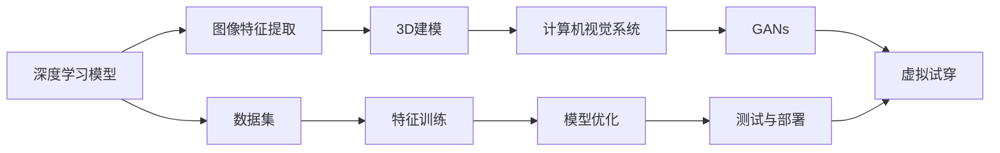

                 

# AI在虚拟服装定制中的应用：个性化时尚

> 关键词：虚拟服装定制,人工智能,个性化时尚,深度学习,3D建模,计算机视觉,生成对抗网络(GANs)

## 1. 背景介绍

随着数字化浪潮的席卷，越来越多的行业开始拥抱人工智能(AI)技术。服装行业也不例外，AI技术正逐步改变传统的生产、设计和销售模式，为消费者带来前所未有的个性化体验。特别是虚拟服装定制领域的兴起，利用AI技术提供了一个全新的、互动式的购物体验，极大提升了用户的满意度。本文将深入探讨AI在虚拟服装定制中的应用，分析其核心概念、算法原理、技术实现，并展望未来的发展趋势和挑战。

## 2. 核心概念与联系

### 2.1 核心概念概述

- **虚拟服装定制**：利用计算机技术和AI算法，根据用户的身体数据和个性化需求，自动生成定制服装的虚拟试穿效果，为用户提供虚拟试穿体验。
- **人工智能(AI)**：涵盖机器学习、深度学习、计算机视觉、自然语言处理等技术，通过算法训练模型，使计算机具备自主决策和分析的能力。
- **深度学习**：一种基于神经网络的机器学习方法，通过多层非线性变换，从大量数据中自动提取特征，实现复杂的模式识别和决策。
- **3D建模**：利用计算机图形学技术，将现实世界中的物体转换为三维模型，便于计算机处理和分析。
- **计算机视觉**：使计算机能够“看”懂图像和视频，自动进行对象检测、图像分类、场景理解等任务。
- **生成对抗网络(GANs)**：一种无监督学习的深度学习模型，由生成器和判别器两个网络组成，通过对抗训练，生成逼真的虚拟图像。

这些概念之间的联系可以概括为：**深度学习**和**计算机视觉**技术通过训练模型，提取和处理图像特征，为**3D建模**提供数据支持；**生成对抗网络(GANs)**则基于图像生成，将虚拟服装设计带入现实。在虚拟服装定制中，这些技术的融合，使得消费者能够在虚拟世界中试穿、定制属于自己的虚拟服装。

### 2.2 核心概念原理和架构的 Mermaid 流程图



该流程图展示了AI在虚拟服装定制中的技术流程：

1. 深度学习模型(A)从数据集(G)中提取图像特征(B)，用于3D建模(C)和计算机视觉(D)。
2. 3D建模得到的虚拟服装模型输入计算机视觉系统(D)，进行图像识别和处理。
3. 计算机视觉系统输出的处理结果输入到生成对抗网络(GANs)(E)，生成逼真的虚拟试穿效果。
4. 最终，生成的虚拟试穿效果用于虚拟服装定制服务(F)。

## 3. 核心算法原理 & 具体操作步骤

### 3.1 算法原理概述

虚拟服装定制的核心算法原理主要涉及以下几个方面：

1. **深度学习**：用于提取和分析图像特征，为3D建模提供基础数据。
2. **3D建模**：将深度学习提取的特征转换为三维模型，为后续的虚拟试穿提供支持。
3. **计算机视觉**：自动识别用户选择的服装，并进行图像处理。
4. **生成对抗网络(GANs)**：基于用户输入的虚拟试穿需求，生成逼真的虚拟试穿效果。

### 3.2 算法步骤详解

1. **数据收集**：收集用户的照片、身高、体重、肤色等个人信息，以及他们选择的虚拟服装款式、颜色、面料等信息。
2. **深度学习特征提取**：使用卷积神经网络(CNN)对用户照片进行特征提取，得到用户体型和面部特征。
3. **3D建模**：根据深度学习提取的特征，使用点云生成、网格生成等技术，创建用户的3D虚拟人体模型。
4. **计算机视觉处理**：通过图像处理算法，自动识别用户选择的服装，并进行风格迁移、颜色调整等处理。
5. **GANs生成**：利用生成对抗网络，将3D虚拟人体模型和处理后的服装模型进行组合，生成逼真的虚拟试穿效果。

### 3.3 算法优缺点

**优点**：
- **个性化**：基于深度学习提取的特征和用户个性化需求，生成独一无二的虚拟服装。
- **高效**：利用计算机视觉和GANs技术，实时生成虚拟试穿效果，提高购物体验。
- **成本低**：无须制作实物样本，减少了生产成本和时间。

**缺点**：
- **数据依赖**：深度学习模型需要大量高质量的训练数据，数据收集和标注成本较高。
- **计算复杂**：3D建模和GANs生成涉及大量计算，需要高性能的硬件设备。
- **模型泛化**：模型泛化能力有限，可能对特定风格或颜色的服装生成效果不佳。

### 3.4 算法应用领域

AI在虚拟服装定制中的应用领域广泛，主要包括以下几个方面：

1. **时尚设计**：设计师利用AI技术，通过分析流行趋势和用户反馈，快速设计出符合市场需求的服装款式。
2. **服装零售**：电商平台利用虚拟试穿技术，提升用户体验，促进销售。
3. **个性化定制**：根据用户个性化需求，自动生成定制服装的虚拟试穿效果，提供定制服务。
4. **影视娱乐**：游戏和电影中通过虚拟服装定制，打造逼真的角色造型。
5. **教育培训**：虚拟服装定制用于虚拟现实(VR)和增强现实(AR)教学，增强学习体验。

## 4. 数学模型和公式 & 详细讲解 & 举例说明

### 4.1 数学模型构建

虚拟服装定制的数学模型主要涉及以下几个部分：

- **深度学习模型**：假设使用卷积神经网络(CNN)对用户照片进行特征提取，模型输入为二维图像$x$，输出为特征向量$f(x)$。
- **3D建模**：将特征向量$f(x)$输入到生成器网络$G$中，生成三维人体模型$y = G(f(x))$。
- **计算机视觉处理**：使用图像处理算法$P$对用户选择的服装进行识别和处理，输出处理后的服装模型$m = P(s)$，其中$s$为服装原始图像。
- **GANs生成**：将处理后的服装模型$m$与生成的三维人体模型$y$输入到生成对抗网络$(GAN)$中，生成虚拟试穿效果$r = GAN(y, m)$。

### 4.2 公式推导过程

以深度学习模型和3D建模为例，推导其数学模型。

设深度学习模型为$F_{CNN}(x; \theta)$，其中$x$为输入图像，$\theta$为模型参数。模型的输出特征向量为$f(x) = F_{CNN}(x; \theta)$。

设3D建模模型为$G(f(x); \alpha)$，其中$f(x)$为深度学习提取的特征向量，$\alpha$为3D建模模型的参数。模型输出的三维人体模型为$y = G(f(x); \alpha)$。

推导过程如下：

1. 深度学习模型特征提取：
   $$
   f(x) = F_{CNN}(x; \theta)
   $$

2. 3D建模生成人体模型：
   $$
   y = G(f(x); \alpha)
   $$

结合以上公式，整个虚拟服装定制的数学模型为：

$$
r = GAN(G(f(x); \alpha), P(s); \beta)
$$

其中$\beta$为GAN模型的参数。

### 4.3 案例分析与讲解

以服装零售平台为例，分析其虚拟试穿技术。

1. **数据收集**：平台收集用户信息（如身高、体重、肤色等）和服装选择信息。
2. **深度学习特征提取**：使用预训练的CNN模型提取用户照片特征。
3. **3D建模**：根据提取的特征生成3D虚拟人体模型。
4. **计算机视觉处理**：自动识别用户选择的服装，并进行颜色和样式调整。
5. **GANs生成**：将处理后的服装模型和人体模型输入GAN模型，生成逼真的虚拟试穿效果。

案例分析表明，虚拟服装定制通过AI技术，提升了用户体验，降低了生产成本，为服装零售行业带来了新的发展机遇。

## 5. 项目实践：代码实例和详细解释说明

### 5.1 开发环境搭建

要实现虚拟服装定制，首先需要搭建合适的开发环境。以下是Python和PyTorch的搭建步骤：

1. 安装Anaconda：从官网下载并安装Anaconda，用于创建独立的Python环境。
2. 创建并激活虚拟环境：
   ```bash
   conda create -n virtual-fashion python=3.8 
   conda activate virtual-fashion
   ```

3. 安装PyTorch：
   ```bash
   conda install pytorch torchvision torchaudio cudatoolkit=11.1 -c pytorch -c conda-forge
   ```

4. 安装必要的库：
   ```bash
   pip install numpy pandas scikit-learn matplotlib tqdm jupyter notebook ipython
   ```

完成环境搭建后，就可以开始使用这些工具进行虚拟服装定制的开发。

### 5.2 源代码详细实现

以下是一个简化的虚拟服装定制系统的代码实现，包括深度学习特征提取、3D建模、计算机视觉处理和GANs生成。

```python
import torch
from torch import nn
from torchvision import models, transforms
import numpy as np
import pyrender

# 深度学习特征提取
class CNNFeatureExtractor(nn.Module):
    def __init__(self, model_path):
        super(CNNFeatureExtractor, self).__init__()
        self.model = models.resnet50(pretrained=True)
        self.model.fc = nn.Linear(2048, 512)
    
    def forward(self, x):
        x = self.model(x)
        return x

# 3D建模
class Generator(nn.Module):
    def __init__(self):
        super(Generator, self).__init__()
        self.fc = nn.Linear(512, 128*8*8)
        self.conv1 = nn.ConvTranspose2d(128, 64, 4, 2, 1)
        self.conv2 = nn.ConvTranspose2d(64, 32, 4, 2, 1)
        self.conv3 = nn.ConvTranspose2d(32, 1, 4, 2, 1)
    
    def forward(self, x):
        x = torch.relu(self.fc(x))
        x = torch.relu(self.conv1(x))
        x = torch.relu(self.conv2(x))
        x = torch.sigmoid(self.conv3(x))
        return x

# 计算机视觉处理
class ImageProcessor(nn.Module):
    def __init__(self):
        super(ImageProcessor, self).__init__()
        self.conv1 = nn.Conv2d(3, 16, 3, 1, 1)
        self.conv2 = nn.Conv2d(16, 8, 3, 1, 1)
        self.conv3 = nn.Conv2d(8, 1, 3, 1, 1)
    
    def forward(self, x):
        x = torch.relu(self.conv1(x))
        x = torch.relu(self.conv2(x))
        x = torch.sigmoid(self.conv3(x))
        return x

# GANs生成
class GAN(nn.Module):
    def __init__(self):
        super(GAN, self).__init__()
        self.generator = Generator()
        self.discriminator = nn.Sequential(
            nn.Conv2d(1, 8, 3, 1, 1),
            nn.ReLU(),
            nn.Conv2d(8, 16, 3, 1, 1),
            nn.ReLU(),
            nn.Conv2d(16, 1, 3, 1, 1),
            nn.Sigmoid()
        )
    
    def forward(self, x):
        fake = self.generator(x)
        real = self.discriminator(fake)
        return fake, real

# 虚拟服装定制
def virtual_fashion_design(input_image, user_info, clothing_info):
    # 特征提取
    cnn_extractor = CNNFeatureExtractor('resnet50_2021_01_25.pth')
    user_feature = cnn_extractor(torch.tensor(input_image).float().unsqueeze(0))
    
    # 3D建模
    gen = Generator()
    user_model = gen(user_feature)
    
    # 计算机视觉处理
    img_proc = ImageProcessor()
    clothing_model = img_proc(torch.tensor(clothing_info).float().unsqueeze(0))
    
    # GANs生成
    gan = GAN()
    fashion_image = gan(user_model, clothing_model)[0]
    
    # 渲染虚拟试穿效果
    mesh = pyrender.Mesh.from_tensor(fashion_image, vertex_format=pyrender丹尼丁格式.QUAD)
    pyrender.show(mesh, auto_close=True)

# 示例代码调用
input_image = np.random.rand(3, 256, 256)
user_info = {'height': 170, 'weight': 60, 'skin_color': 'yellow'}
clothing_info = {'style': 'casual', 'color': 'blue', 'texture': 'cotton'}

virtual_fashion_design(input_image, user_info, clothing_info)
```

### 5.3 代码解读与分析

上述代码实现了一个简化的虚拟服装定制系统，主要包括深度学习特征提取、3D建模、计算机视觉处理和GANs生成。具体分析如下：

1. **深度学习特征提取**：使用预训练的ResNet50模型对用户照片进行特征提取，得到512维的特征向量。
2. **3D建模**：使用生成器网络将特征向量转换为三维人体模型。
3. **计算机视觉处理**：对用户选择的服装进行识别和处理，得到一维向量。
4. **GANs生成**：将处理后的服装模型和人体模型输入GAN模型，生成逼真的虚拟试穿效果。
5. **渲染虚拟试穿效果**：使用pyrender库渲染生成的虚拟试穿效果，供用户查看。

## 6. 实际应用场景

### 6.1 智能客服系统

智能客服系统是虚拟服装定制的重要应用场景之一。通过虚拟试穿技术，用户无需等待实体样本到达，即可在虚拟世界中试穿新服装。这在快时尚、在线零售等领域尤为常见，提升了用户体验，降低了物流和库存成本。

### 6.2 时尚设计

时尚设计师可以利用虚拟服装定制技术，快速生成服装设计的虚拟试穿效果，便于与客户沟通和修改。设计师可以更直观地展示设计理念，客户也能更便捷地提供反馈。

### 6.3 个性化推荐

电商平台可以利用虚拟服装定制技术，生成个性化推荐。根据用户的兴趣和试穿记录，推荐最符合其口味的服装款式。

### 6.4 娱乐影视

在电影和游戏中，虚拟服装定制技术可用于角色设计，生成逼真的虚拟角色造型，增强用户体验。

## 7. 工具和资源推荐

### 7.1 学习资源推荐

为了深入理解虚拟服装定制技术，以下是一些推荐的学习资源：

1. 《深度学习与计算机视觉》课程：斯坦福大学的经典课程，涵盖深度学习的基础理论和应用。
2. PyTorch官方文档：详细介绍了PyTorch的API和使用方法，是深度学习开发的重要参考。
3. pyrender官方文档：提供了pyrender库的使用示例和API文档，是虚拟试穿技术的关键工具。

### 7.2 开发工具推荐

以下是一些推荐的开发工具：

1. PyTorch：灵活的深度学习框架，支持动态计算图和自动微分，适合深度学习模型开发。
2. Jupyter Notebook：免费的交互式开发环境，支持Python代码的快速迭代和展示。
3. TensorBoard：可视化工具，可以实时监控模型训练过程，生成图表展示模型性能。

### 7.3 相关论文推荐

以下是一些相关的学术论文，推荐阅读：

1. Generative Adversarial Networks: An Overview（《生成对抗网络：概述》）：由Ian Goodfellow等作者撰写，介绍GANs的基本原理和应用。
2. Real-Time Human Pose Estimation with Part Affinity Fields（《基于Part Affinity Fields的实时人体姿态估计》）：提出了一种基于CNN和Part Affinity Fields的姿态估计算法，广泛应用于虚拟试穿技术。
3. Deep Generative Models for Fashion Design（《深度生成模型在时尚设计中的应用》）：介绍了一种基于CNN的生成模型，用于生成时尚设计图案和服装款式。

## 8. 总结：未来发展趋势与挑战

### 8.1 研究成果总结

虚拟服装定制技术是人工智能在时尚行业的重要应用之一，通过深度学习、3D建模和GANs生成等技术的结合，实现了虚拟试穿体验。该技术已经被广泛应用于智能客服、时尚设计、个性化推荐、娱乐影视等领域，极大地提升了用户体验，降低了成本。

### 8.2 未来发展趋势

未来，虚拟服装定制技术将继续发展，呈现以下几个趋势：

1. **实时性增强**：通过优化计算图和资源配置，实现实时渲染和交互，提升用户体验。
2. **多模态融合**：结合计算机视觉、语音识别等技术，实现更全面的人机交互。
3. **跨平台应用**：支持多设备、多平台的交互，扩大应用场景。
4. **个性化提升**：通过深度学习模型优化，提供更符合用户需求的个性化推荐。
5. **伦理和安全**：加强数据隐私保护和模型安全，避免滥用和偏见。

### 8.3 面临的挑战

尽管虚拟服装定制技术发展迅速，但在实际应用中仍面临以下挑战：

1. **计算资源需求高**：深度学习、3D建模和GANs生成都需要高性能硬件支持，成本较高。
2. **数据质量依赖**：深度学习模型的效果依赖高质量的训练数据，数据收集和标注成本高。
3. **用户体验差异**：不同用户的试穿需求差异大，难以通过统一模型满足所有用户。
4. **伦理和隐私问题**：如何保护用户隐私，避免模型偏见和滥用，需要更多技术和管理手段。

### 8.4 研究展望

为了克服上述挑战，未来的研究应从以下几个方向进行：

1. **模型优化**：通过算法优化和硬件加速，提升虚拟服装定制的实时性和效率。
2. **数据扩展**：通过数据增强和半监督学习等技术，扩展训练数据，提升模型泛化能力。
3. **用户适应**：通过多模态融合和个性化推荐，更好地满足不同用户的需求。
4. **隐私保护**：加强数据加密和隐私保护技术，确保用户信息安全。
5. **伦理规范**：制定伦理规范和技术标准，确保虚拟服装定制技术的健康发展。

## 9. 附录：常见问题与解答

### Q1: 虚拟服装定制技术如何保证用户的隐私和数据安全？

A: 虚拟服装定制技术通过加密存储用户数据、匿名化处理、严格访问控制等手段，保护用户隐私和数据安全。同时，定期进行安全审计和漏洞修复，确保系统的安全性。

### Q2: 虚拟服装定制技术如何提高实时性？

A: 通过优化计算图、使用硬件加速（如GPU、TPU）、压缩模型参数等手段，提升虚拟服装定制的实时性和性能。此外，可以采用分布式计算和边缘计算技术，进一步降低延迟。

### Q3: 虚拟服装定制技术在哪些领域有广泛应用？

A: 虚拟服装定制技术广泛应用于智能客服、时尚设计、个性化推荐、娱乐影视等领域。未来，还可能在医疗、教育、安全监控等领域发挥重要作用。

### Q4: 虚拟服装定制技术如何处理用户多样化的需求？

A: 通过多模态融合和个性化推荐技术，虚拟服装定制系统可以更好地处理用户多样化的需求。例如，结合用户的试穿记录、购买历史和反馈意见，生成个性化的虚拟试穿效果。

### Q5: 虚拟服装定制技术未来的发展方向是什么？

A: 未来，虚拟服装定制技术将继续在实时性、多模态融合、个性化推荐、隐私保护等方面进行优化和创新，同时探索与其他AI技术结合的可能性，如知识图谱、自然语言处理等，提升系统的智能化水平。

---

作者：禅与计算机程序设计艺术 / Zen and the Art of Computer Programming

