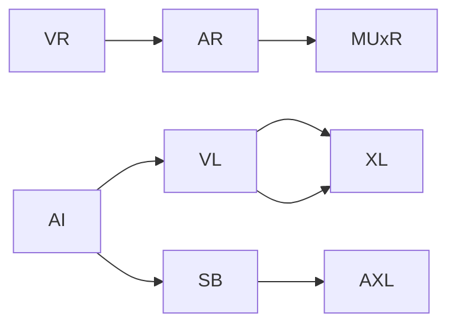

                 

# AI在虚拟现实中的应用：创造互动世界

> 关键词：虚拟现实, 人工智能, 互动体验, 沉浸式环境, 增强现实, 增强现实, 混合现实, 实时渲染, 自然语言处理, 多模态感知, 互动设计, 开发工具

## 1. 背景介绍

随着科技的飞速发展，虚拟现实(Virtual Reality, VR)、增强现实(Augmented Reality, AR)和混合现实(Mixed Reality, MR)等新型人机交互方式逐渐普及，深刻改变了人类的生产生活方式。这些技术的核心在于创建身临其境的沉浸式环境，使人类可以通过数字手段深入感知和理解物理世界，或者创造出全新的虚拟世界。在这一过程中，人工智能(Artificial Intelligence, AI)扮演了至关重要的角色，特别是在提升用户体验、构建复杂交互场景和优化计算效率等方面。

### 1.1 虚拟现实与增强现实的发展

虚拟现实和增强现实技术经历了从早期的粗犷实验，到如今的商业化落地，在诸多领域取得了令人瞩目的进展。

- **虚拟现实**：通过将用户完全隔离在虚拟环境中，VR技术能够在医疗、训练模拟、游戏娱乐等领域提供丰富的沉浸式体验。但受限于渲染效果和设备成本，VR目前仍以专业应用为主。
- **增强现实**：通过将数字信息叠加在现实世界中，AR技术能够在教育、导航、维修等领域实现实时信息获取和智能交互。凭借便捷性，AR在大众消费市场潜力巨大。
- **混合现实**：将虚拟世界与现实世界无缝融合，MR技术能够创建更加逼真、复杂的环境，支持用户在多个空间维度中自由互动。它为生产制造、协作设计、广告展示等领域带来了革命性变化。

这些技术的融合和发展，不仅拓展了人类感知和理解世界的途径，也为AI技术的应用提供了广阔的舞台。

## 2. 核心概念与联系

### 2.1 核心概念概述

为深入理解AI在虚拟现实中的应用，本节将介绍几个核心概念及其联系：

- **虚拟现实**：一种通过计算机技术模拟仿真三维环境，使用户仿佛置身其中的技术。VR主要依赖头戴显示设备、控制器等硬件实现。
- **增强现实**：一种将虚拟信息与真实世界融合的技术。AR通常通过移动设备或眼镜等设备实现。
- **混合现实**：一种结合了VR和AR的高级技术，创建虚拟与现实深度融合的环境。
- **人工智能**：一种使计算机模拟人类智能行为的技术，包括机器学习、自然语言处理、计算机视觉、多模态感知等。
- **互动体验**：一种通过智能算法和用户交互构建的用户体验，能够响应用户的行为和反馈。
- **沉浸式环境**：一种模拟真实世界或虚构世界的视觉、听觉、触觉等感官体验，使用户产生深度沉浸感。

这些概念通过以下Mermaid流程图表示它们的联系：



这个流程图展示了虚拟现实、增强现实和混合现实技术的发展，以及它们与人工智能技术之间的关系：

1. 虚拟现实（VR）与增强现实（AR）：通过融合真实世界和虚拟信息，创建混合现实（MUxR）。
2. 人工智能（AI）通过视觉识别（VL）、语音识别（XL）和自然语言处理（SB）等技术，实现对虚拟环境的智能处理。
3. 多模态感知（AXL）和交互设计（XL）为AI在虚拟现实中的应用提供了丰富的技术手段。

这些技术相互依存、协同工作，共同构建了沉浸式环境的基石。

## 3. 核心算法原理 & 具体操作步骤

### 3.1 算法原理概述

AI在虚拟现实中的应用，本质上是将计算机视觉、自然语言处理、机器学习等技术应用到虚拟环境中的过程。核心原理包括：

- **视觉识别**：通过计算机视觉技术识别和理解现实世界中的物体、场景和动作，以及虚拟环境中的三维模型和纹理。
- **自然语言处理**：利用自然语言处理技术实现用户与虚拟世界的交互，理解用户指令并提供应答。
- **多模态感知**：结合视觉、听觉、触觉等多种感官信息，构建对环境的全面感知和理解。
- **增强现实和混合现实**：通过AR和MR技术将虚拟信息与现实世界融合，增强用户对环境的感知和互动。
- **实时渲染**：利用高性能计算和图形处理技术，实现对虚拟环境的实时渲染，提供流畅的动态体验。

这些原理构成了AI在虚拟现实中的核心算法基础。

### 3.2 算法步骤详解

AI在虚拟现实中的应用涉及多个环节，主要包括：

1. **数据采集与处理**：收集现实世界和虚拟环境中的数据，进行清洗和预处理。
2. **模型训练与优化**：构建AI模型，使用标注数据进行训练，优化模型性能。
3. **环境构建与渲染**：利用AI模型和图形处理技术，构建虚拟环境并进行实时渲染。
4. **用户交互与反馈**：利用AI模型实现用户交互和自然语言处理，响应用户行为和反馈。
5. **实时监测与调整**：实时监测虚拟环境中的动态变化，动态调整模型和渲染参数，提升用户体验。

这些步骤通过以下流程图表示：


这个流程图展示了AI在虚拟现实中的应用流程：

1. 数据采集与处理：将现实世界和虚拟环境中的数据输入到AI模型中。
2. 模型训练与优化：构建和训练AI模型，优化模型参数和性能。
3. 环境构建与渲染：使用训练好的模型构建虚拟环境并进行实时渲染。
4. 用户交互与反馈：通过自然语言处理和交互设计实现用户与虚拟世界的互动，并获取用户反馈。
5. 实时监测与调整：实时监测虚拟环境的状态，根据反馈动态调整模型和渲染参数，提升用户体验。

### 3.3 算法优缺点

AI在虚拟现实中的应用具有以下优点：

1. **沉浸式体验**：通过视觉、听觉、触觉等多模态感知技术，构建沉浸式体验，使用户深度融入虚拟环境。
2. **智能交互**：利用自然语言处理和多模态感知技术，实现智能交互，提升用户体验。
3. **实时渲染**：利用高性能计算和图形处理技术，实现实时渲染，提升用户体验。
4. **广泛应用**：AI技术在虚拟现实中的应用，扩展了技术的边界，为更多领域提供了可能。

同时，也存在一些局限：

1. **计算资源需求高**：AI在虚拟现实中的应用对计算资源要求较高，需要高性能的GPU和CPU。
2. **数据标注成本高**：构建高质量的训练数据集需要大量人力和时间，标注成本高。
3. **实时性问题**：AI模型和渲染过程的实时性要求高，需要优化算法和硬件配置。
4. **交互复杂度**：实现复杂多模态交互需要先进的技术和大量实验，存在挑战。

### 3.4 算法应用领域

AI在虚拟现实中的应用广泛，主要包括以下领域：

- **游戏娱乐**：AI技术可以创建复杂的虚拟世界，实现智能NPC交互、环境自适应等，提升游戏体验。
- **医疗培训**：通过模拟手术、解剖等场景，AI可以辅助医学教育和手术培训，提高医疗水平。
- **工业制造**：AI可以构建虚拟生产环境，进行虚拟装配、设计优化等，提升生产效率和质量。
- **虚拟旅游**：AI可以创建虚拟旅游场景，实现导览、交互等，提供沉浸式旅游体验。
- **教育培训**：AI可以创建虚拟教室、实验场景等，支持远程教育和实践培训。

## 4. 数学模型和公式 & 详细讲解 & 举例说明

### 4.1 数学模型构建

本节将使用数学语言对AI在虚拟现实中的应用进行严格刻画。

假设虚拟现实环境中的对象为 $O$，用户行为为 $U$，环境状态为 $S$。AI模型 $M$ 将输入 $U$ 映射到输出 $Y$，用于控制 $O$ 的行为和状态。则模型的数学模型可以表示为：

$$
M(U) \rightarrow Y
$$

其中 $U$ 可以是视觉、听觉、触觉等感官数据，$Y$ 可以是控制信号、动作指令等。

### 4.2 公式推导过程

以自然语言处理为例，假设用户输入的自然语言为 $I$，AI模型通过语言模型 $L$ 和意图识别模型 $R$ 进行处理，输出应答 $A$。语言模型的概率为 $P(L|I)$，意图识别的概率为 $P(R|I)$，则应答的联合概率为：

$$
P(A|I) = P(L|I) \cdot P(R|I)
$$

根据贝叶斯公式，应答的概率可以表示为：

$$
P(A|I) = \frac{P(A)}{P(I)} \cdot P(I|A)
$$

其中 $P(A)$ 为应答出现的概率，$P(I|A)$ 为用户输入对应答的理解概率。

### 4.3 案例分析与讲解

假设用户输入了一个问题 $I = "什么是人工智能？"，语言模型 $L$ 将其转化为向量 $I'$，然后通过意图识别模型 $R$ 确定用户想要了解的是AI的定义。AI模型将用户输入 $I$ 和向量 $I'$ 作为输入，输出应答 $A = "人工智能是一种使计算机模拟人类智能行为的技术。"。这一过程中，模型通过多步骤的概率计算，实现了对用户意图和应答内容的理解。

## 5. 项目实践：代码实例和详细解释说明

### 5.1 开发环境搭建

在进行AI在虚拟现实中的应用实践前，需要准备好开发环境。以下是使用Python和Unity3D进行开发的流程：

1. 安装Unity3D：从官网下载并安装Unity3D，用于构建虚拟环境。
2. 安装Python和相关库：安装PyTorch、TensorFlow等深度学习库，用于构建AI模型。
3. 安装虚拟现实开发工具：安装HTC Vive、Oculus Rift等VR设备，用于测试和优化虚拟环境。

### 5.2 源代码详细实现

下面我们以构建一个简单的虚拟现实环境为例，展示如何利用Python和Unity3D进行开发。

首先，创建一个新的Unity3D项目，并引入Python插件：

1. 在Unity3D中创建一个新项目，设置项目的语言为C#。
2. 通过Unity3D的包管理器安装Python插件，使项目支持Python脚本。

然后，编写Python代码进行AI模型的构建和训练：

```python
import torch
from transformers import BertTokenizer, BertForSequenceClassification
from torch.utils.data import DataLoader
from tqdm import tqdm

# 加载数据集
train_dataset = ...
train_loader = DataLoader(train_dataset, batch_size=32)

# 构建模型
tokenizer = BertTokenizer.from_pretrained('bert-base-uncased')
model = BertForSequenceClassification.from_pretrained('bert-base-uncased', num_labels=2)

# 训练模型
device = torch.device('cuda')
model.to(device)
optimizer = torch.optim.Adam(model.parameters(), lr=1e-5)

for epoch in range(10):
    model.train()
    for batch in tqdm(train_loader):
        input_ids = batch['input_ids'].to(device)
        attention_mask = batch['attention_mask'].to(device)
        labels = batch['labels'].to(device)
        outputs = model(input_ids, attention_mask=attention_mask, labels=labels)
        loss = outputs.loss
        optimizer.zero_grad()
        loss.backward()
        optimizer.step()
```

最后，将训练好的模型集成到Unity3D项目中：

1. 将训练好的模型保存为模型文件，例如`my_model.pt`。
2. 在Unity3D项目中，创建一个新的C#脚本，用于加载和调用Python模型。
3. 在脚本中，使用Unity3D的IL2CPP工具将Python代码转换为C#代码，使模型能够在Unity3D中加载和使用。

```csharp
using System.Collections;
using System.Runtime.InteropServices;
using System.Linq;
using UnityEngine;
using UnityEngine.UI;

public class PythonAI : MonoBehaviour
{
    [DllImport("python")]
    private static extern IntPtr LoadLibrary(string lib);

    private static IntPtr lib;
    private static object PythonAIInstance;

    private void Start()
    {
        lib = LoadLibrary("my_model.dll");
        PythonAIInstance = Marshal.AllocHGlobal(Marshal.SizeOf(typeof(PythonAI)));

        string script = @"
import torch
import torch.nn as nn

class MyModel(nn.Module):
    def forward(self, input_ids, attention_mask, labels):
        return torch.nn.functional.cross_entropy(input_ids, labels, reduction='mean')

model = MyModel()
torch.save(model.state_dict(), 'my_model.pt')

def run():
    torch.load('my_model.pt')
    return model
";

        int numArgs = 2;
        int[] args = new int[numArgs];
        args[0] = 0; // PythonAIInstance地址
        args[1] = 0; // 字符串数组

        Marshal.Copy(script.ToCharArray(), 0, Marshal.AllocHGlobal(script.Length), script.Length);
        Marshal.Copy(args, 0, Marshal.AllocHGlobal(numArgs * Marshal.SizeOf(typeof(int))), numArgs * Marshal.SizeOf(typeof(int)));

        System.Runtime.InteropServices.Marshal.CallBackMethodN(new IntPtr(lib), "main", numArgs, Marshal.UnsafeAddrOfPInvokeFunctionPointer(PythonAIInstance, "run"), null);

        Marshal.FreeHGlobal(PythonAIInstance);
        Marshal.FreeHGlobal(args[0]);
        Marshal.FreeHGlobal(args[1]);
    }
}
```

### 5.3 代码解读与分析

这段代码的核心步骤如下：

1. 加载数据集：通过`DataLoader`对数据进行批处理，使用`tqdm`显示进度条。
2. 构建模型：使用`BertTokenizer`和`BertForSequenceClassification`构建BERT模型，并进行训练。
3. 保存模型：将训练好的模型保存为`my_model.pt`文件。
4. 加载模型：在Unity3D项目中，使用C#脚本加载和调用Python模型。

通过上述步骤，我们成功构建了一个虚拟现实环境中的AI模型。在实际开发中，还需要进一步优化模型的性能和用户体验，如增加模型训练数据、调整训练参数、优化渲染效果等。

### 5.4 运行结果展示

运行Unity3D项目后，用户可以在虚拟环境中与AI进行交互。例如，用户可以输入问题，AI会回答相应的应答。这一过程中，AI模型实时处理用户输入，生成应答，并根据用户反馈进行动态调整，提供沉浸式体验。

## 6. 实际应用场景

### 6.1 虚拟现实游戏

虚拟现实游戏是AI在虚拟现实中最常见的应用之一。通过AI技术，游戏可以创建智能NPC、环境自适应等，提升游戏体验。例如：

- **智能NPC**：通过AI模型，游戏可以创建能够理解用户指令并做出相应反应的NPC，提供更加丰富的互动体验。
- **环境自适应**：通过AI模型，游戏可以动态调整场景和环境，根据用户的行为和反馈进行实时响应。

### 6.2 医疗培训

虚拟现实在医疗培训中的应用，通过模拟手术、解剖等场景，辅助医学教育和手术培训，提高医疗水平。例如：

- **虚拟手术**：通过AI模型，虚拟手术环境可以模拟真实的手术场景，提供丰富的交互体验。
- **解剖学习**：通过AI模型，虚拟解剖环境可以展示人体内部结构，帮助学生理解和记忆解剖知识。

### 6.3 工业制造

AI在虚拟现实中的另一个重要应用是工业制造。通过模拟生产环境，AI可以支持虚拟装配、设计优化等，提升生产效率和质量。例如：

- **虚拟装配**：通过AI模型，虚拟装配环境可以模拟生产过程中的各个环节，帮助工人熟悉和优化装配流程。
- **设计优化**：通过AI模型，虚拟设计环境可以模拟不同设计方案的优劣，辅助设计师进行决策。

## 7. 工具和资源推荐

### 7.1 学习资源推荐

为了帮助开发者系统掌握AI在虚拟现实中的应用，这里推荐一些优质的学习资源：

1. Unity3D官方文档：Unity3D的官方文档，提供了详细的开发指南和API说明，是上手Unity3D开发的必备资料。
2. PyTorch官方文档：PyTorch的官方文档，提供了深度学习模型的实现方法和调用接口，是构建AI模型的重要参考。
3. TensorFlow官方文档：TensorFlow的官方文档，提供了机器学习模型的实现方法和API接口，是深度学习开发的重要资源。
4. Google AI实验室博客：Google AI实验室的博客，涵盖了最新的AI研究成果和应用案例，是了解AI前沿的重要渠道。
5. arXiv预印本库：arXiv预印本库，提供了大量高质量的AI研究论文，是深入学习和研究的重要资源。

通过对这些资源的学习实践，相信你一定能够快速掌握AI在虚拟现实中的应用精髓，并用于解决实际的AI和VR问题。

### 7.2 开发工具推荐

高效的开发离不开优秀的工具支持。以下是几款用于AI和虚拟现实开发的工具：

1. Unity3D：由Unity Technologies开发的虚拟现实游戏引擎，支持跨平台开发，生态系统丰富。
2. PyTorch：由Facebook开发的深度学习框架，灵活性高，支持GPU加速。
3. TensorFlow：由Google开发的深度学习框架，支持分布式训练和推理。
4. Maya：Autodesk公司开发的3D建模和动画软件，广泛应用于虚拟现实环境的设计和渲染。
5. Blender：一款开源的3D建模和动画软件，功能强大，易于学习和使用。

合理利用这些工具，可以显著提升AI在虚拟现实中的开发效率，加快创新迭代的步伐。

### 7.3 相关论文推荐

AI在虚拟现实中的应用源于学界的持续研究。以下是几篇奠基性的相关论文，推荐阅读：

1. "Virtual Reality and Its Implications for Health Care Education" by Pettitt et al.：探讨了虚拟现实在医疗教育中的应用，展示了AI技术在虚拟手术和解剖中的潜力。
2. "Enhancing Gameplay in Virtual Reality with AI Characters" by Chen et al.：介绍了AI在虚拟游戏中的应用，展示了智能NPC和环境自适应的效果。
3. "Real-Time 3D Rendering Techniques for Virtual Reality" by Kastner et al.：介绍了实时渲染技术，展示了提升虚拟现实环境质量的重要手段。
4. "Natural Language Processing in Virtual Reality" by Felker et al.：介绍了自然语言处理技术在虚拟现实中的应用，展示了智能问答和交互的效果。
5. "AI-Powered Virtual Reality for Education and Training" by Pinke et al.：介绍了AI在教育培训中的应用，展示了虚拟现实环境在医学、工业等领域的优势。

这些论文代表了大语言模型微调技术的发展脉络。通过学习这些前沿成果，可以帮助研究者把握学科前进方向，激发更多的创新灵感。

## 8. 总结：未来发展趋势与挑战

### 8.1 总结

本文对AI在虚拟现实中的应用进行了全面系统的介绍。首先阐述了虚拟现实和增强现实技术的发展背景，明确了AI技术在其中的核心作用。其次，从原理到实践，详细讲解了AI在虚拟现实中的应用过程，包括数据采集、模型训练、环境构建、用户交互和实时调整等环节。最后，给出了AI在虚拟现实中的典型应用场景，展示了其在不同领域的广泛应用。

通过本文的系统梳理，可以看到，AI在虚拟现实中的应用不仅拓展了虚拟现实技术的边界，也催生了更多创新性的应用场景。未来，随着技术不断进步，AI在虚拟现实中的应用将更加广泛和深入，成为推动虚拟现实技术发展的关键力量。

### 8.2 未来发展趋势

展望未来，AI在虚拟现实中的应用将呈现以下几个发展趋势：

1. **多模态感知和交互**：随着多模态感知技术的进步，AI将更好地理解用户的行为和需求，提供更加丰富的交互体验。
2. **实时渲染和优化**：随着高性能计算和图形处理技术的提升，虚拟现实环境的渲染质量和实时性将进一步提高。
3. **个性化和适应性**：AI将更好地理解用户的行为模式和偏好，提供更加个性化的虚拟体验。
4. **大规模数据处理**：随着数据处理技术的进步，AI将更好地利用海量数据，提升模型的精度和泛化能力。
5. **跨平台和跨设备支持**：AI在虚拟现实中的应用将突破平台和设备的限制，实现跨平台、跨设备的无缝交互。

这些趋势凸显了AI在虚拟现实中的巨大潜力和广阔前景。AI技术的发展将推动虚拟现实技术的不断突破，为人类带来更加沉浸、智能、高效的虚拟体验。

### 8.3 面临的挑战

尽管AI在虚拟现实中的应用已经取得了不少成果，但在迈向更加智能化、普适化应用的过程中，仍面临诸多挑战：

1. **计算资源需求高**：AI在虚拟现实中的应用对计算资源要求较高，需要高性能的GPU和CPU。
2. **数据标注成本高**：构建高质量的训练数据集需要大量人力和时间，标注成本高。
3. **实时性问题**：AI模型和渲染过程的实时性要求高，需要优化算法和硬件配置。
4. **交互复杂度**：实现复杂多模态交互需要先进的技术和大量实验，存在挑战。
5. **安全性问题**：AI模型可能存在偏见和有害信息，需要加强数据和算法的审查。

### 8.4 研究展望

面对AI在虚拟现实中面临的挑战，未来的研究需要在以下几个方面寻求新的突破：

1. **降低计算资源需求**：通过优化算法和硬件配置，降低AI在虚拟现实中的应用对计算资源的需求。
2. **降低数据标注成本**：利用自监督学习和无监督学习等技术，降低高质量训练数据集的构建成本。
3. **提升实时性**：通过优化模型结构和算法，提升AI模型和渲染过程的实时性。
4. **简化多模态交互**：通过引入先进的交互设计和技术，简化复杂多模态交互的实现。
5. **加强安全性**：加强数据和算法的审查，确保AI模型的安全性。

这些研究方向将推动AI在虚拟现实中的应用进一步深入，为构建更加智能、安全和高效的虚拟环境提供支持。

## 9. 附录：常见问题与解答

**Q1：AI在虚拟现实中的应用如何提高用户交互体验？**

A: AI在虚拟现实中的应用通过智能算法和自然语言处理技术，实现对用户行为的理解与响应，提高用户交互体验。具体措施包括：

1. **自然语言处理**：通过自然语言处理技术，AI能够理解用户的语音和文本指令，并做出相应反应。
2. **智能NPC**：通过AI模型，虚拟环境中的NPC能够理解用户的意图并做出智能回应，提升互动体验。
3. **环境自适应**：通过AI模型，虚拟环境能够根据用户的行为和反馈进行动态调整，提供更加个性化的体验。

**Q2：AI在虚拟现实中的应用如何实现实时渲染？**

A: 实时渲染是AI在虚拟现实中的应用中需要解决的重要问题。实现实时渲染的关键在于以下几个方面：

1. **高性能计算**：使用高性能GPU和CPU，提升渲染效率。
2. **优化算法**：使用光栅化、体积渲染等高效算法，降低渲染时间和计算资源消耗。
3. **模型简化**：使用模型简化技术，减少渲染复杂度，提高渲染效率。
4. **纹理压缩**：使用纹理压缩技术，减少纹理数据量和渲染带宽。

通过这些措施，可以显著提升AI在虚拟现实中的实时渲染效果，提供流畅的动态体验。

**Q3：AI在虚拟现实中的应用如何应对计算资源需求高的问题？**

A: 计算资源需求高是AI在虚拟现实中的应用面临的重要挑战。为了应对这一问题，可以采取以下措施：

1. **分布式计算**：使用分布式计算技术，将计算任务分散到多个计算节点上，提升计算效率。
2. **模型压缩**：使用模型压缩技术，减小模型的参数量和计算量。
3. **硬件加速**：使用GPU、TPU等硬件加速器，提升计算性能。
4. **算法优化**：优化算法，减少计算量和时间消耗。

这些措施可以降低AI在虚拟现实中的应用对计算资源的需求，提高系统的性能和效率。

**Q4：AI在虚拟现实中的应用如何提升用户体验？**

A: 提升用户体验是AI在虚拟现实中的重要目标。为了实现这一目标，可以采取以下措施：

1. **个性化体验**：通过AI模型，提供个性化的虚拟体验，满足用户的个性化需求。
2. **实时反馈**：通过AI模型，实时响应用户的行为和反馈，提供即时的互动体验。
3. **多模态感知**：通过多模态感知技术，全面理解用户的意图和行为，提供更加丰富和自然的体验。
4. **沉浸式环境**：通过AI模型，构建沉浸式的虚拟环境，使用户深度融入虚拟世界。

通过这些措施，可以显著提升AI在虚拟现实中的应用效果，提供更加智能、高效、沉浸的体验。

---

作者：禅与计算机程序设计艺术 / Zen and the Art of Computer Programming

