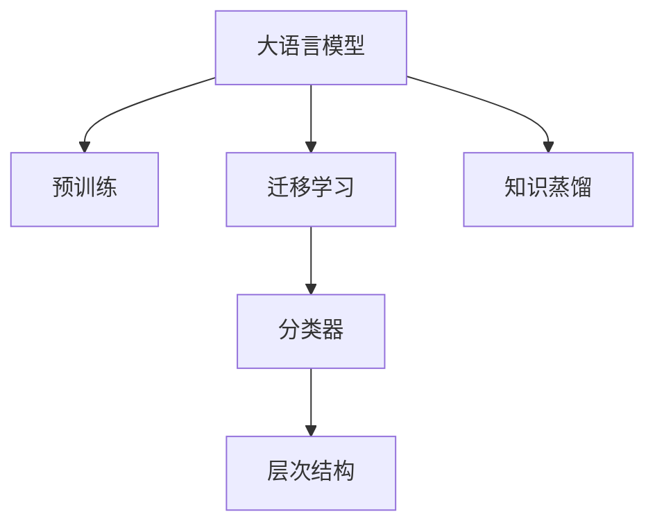

                 

# AI大模型在商品分类中的应用

> 关键词：大语言模型,商品分类,自然语言处理,NLP,Transformer,BERT,预训练,迁移学习,模型压缩

## 1. 背景介绍

### 1.1 问题由来

随着电商行业的迅猛发展，商家对商品的分类和描述要求越来越高。传统的商品分类系统主要依赖人工标注和专家知识，不仅耗时耗力，且在数据量大的场景下容易失准。而基于人工智能技术，尤其是大语言模型和大规模预训练技术的发展，使得商品分类任务变得高效、准确、自动化。大模型可以通过对商品描述的自然语言理解，直接分类商品，无须过多人工干预。

### 1.2 问题核心关键点

大模型在商品分类应用中，关键在于能够高效、准确地理解商品描述，并根据这些描述信息进行分类。主要挑战包括：

- **文本理解**：大模型需要理解商品描述的语义信息，并从中提取出有价值的信息。
- **分类精度**：模型需要具备高精度分类能力，对不同商品进行准确划分。
- **泛化能力**：商品描述通常千差万别，模型需要具备较强的泛化能力，适应不同描述风格的商品分类。
- **实时性**：在电商平台，分类任务需要实时响应，满足用户即时性的需求。

### 1.3 问题研究意义

基于大模型的商品分类系统能够显著提升电商平台的运营效率，降低人工标注成本，增加用户体验。同时，借助大模型的高泛化能力，可以实现更精准的商品分类，为推荐系统、搜索系统等提供强有力的支撑。大模型在商品分类中的应用，将对电商行业产生深远影响，成为智能化商业基础设施的重要组成部分。

## 2. 核心概念与联系

### 2.1 核心概念概述

为了更好地理解基于大模型的商品分类方法，本节将介绍几个关键概念：

- **大语言模型(Large Language Model, LLM)**：通过大规模无标签文本数据进行预训练，具备强大的自然语言理解和生成能力。常用的模型包括BERT、GPT系列等。
- **预训练(Pre-training)**：在大规模无标签数据上，通过自监督任务训练通用语言模型，学习语言表示。
- **迁移学习(Transfer Learning)**：将预训练模型应用于下游任务，减少新任务的数据需求，提升性能。
- **分类器(Classifier)**：在预训练模型基础上，添加任务适配层，用于分类任务。
- **层次结构(Hierarchical Structure)**：商品分类通常按照层次结构组织，模型需要具备良好的层次识别能力。
- **知识蒸馏(Knowledge Distillation)**：通过将大模型的知识传递给轻量级模型，实现高效的商品分类。

这些核心概念之间的逻辑关系可以通过以下Mermaid流程图来展示：



这个流程图展示了各个概念之间的关系：大模型通过预训练获得基础能力，然后通过迁移学习适配商品分类任务，添加分类器进行最终分类。层次结构和知识蒸馏技术进一步提升模型的分类效果。

## 3. 核心算法原理 & 具体操作步骤

### 3.1 算法原理概述

基于大模型的商品分类方法，主要基于迁移学习范式。其核心思想是：利用预训练模型，对商品描述进行自然语言理解，再通过训练分类器进行分类。

具体来说，大模型先对大规模无标签商品描述数据进行预训练，学习通用的语言表示。然后，在商品分类数据集上，使用少样本学习或完全监督学习方式，训练一个分类器。最终，商品描述通过预训练大模型得到表示后，输入分类器进行分类。

### 3.2 算法步骤详解

基于大模型的商品分类方法主要包括以下步骤：

1. **准备预训练模型和数据集**：选择合适的预训练模型，收集商品分类数据集，划分为训练集、验证集和测试集。
2. **定义分类器**：根据商品分类的层次结构，定义分类器的输入输出格式。
3. **迁移学习适配**：在预训练模型基础上，使用商品分类数据集训练分类器，得到最终的分类模型。
4. **评估和部署**：在测试集上评估分类器的性能，部署到实际应用系统中，进行实时分类。

### 3.3 算法优缺点

基于大模型的商品分类方法具有以下优点：

- **高泛化能力**：预训练模型在大规模无标签数据上进行训练，具备较强的泛化能力。
- **低标注成本**：只需要极少量的标注数据即可完成微调，大大降低了人工标注的劳动强度。
- **高效实时性**：使用大模型进行推理，能够在电商平台上实时响应，满足用户的即时性需求。
- **模块化设计**：分类器与预训练模型分离，便于模型部署和维护。

同时，该方法也存在一定的局限性：

- **模型复杂性**：大模型的参数量较大，对计算资源要求较高。
- **标注数据偏差**：标注数据的质量和代表性对模型性能有显著影响。
- **多样性问题**：商品描述风格多样，模型可能无法很好地适应所有描述风格。
- **可解释性不足**：大模型通常是黑盒模型，难以解释其决策过程。

尽管存在这些局限性，但基于大模型的商品分类方法仍是目前最为先进和高效的解决方案。

### 3.4 算法应用领域

基于大模型的商品分类方法广泛应用于以下领域：

1. **电商平台**：对用户商品描述进行自动分类，推荐相关商品，优化用户体验。
2. **物流管理**：对物流信息进行自动分类，提高物流效率，降低人工成本。
3. **产品推荐**：通过商品分类，生成商品推荐列表，提升推荐系统的效果。
4. **搜索引擎**：对用户查询进行分类，提高搜索结果的准确性和相关性。
5. **市场分析**：对市场数据进行分类，提供更精准的市场分析报告。

## 4. 数学模型和公式 & 详细讲解 & 举例说明

### 4.1 数学模型构建

假设预训练模型为 $M_{\theta}$，分类器为 $C_{\phi}$，其中 $\theta$ 和 $\phi$ 分别表示预训练模型和分类器的参数。商品分类数据集为 $D=\{(x_i, y_i)\}_{i=1}^N, x_i \in \mathcal{X}, y_i \in \{1, 2, \ldots, K\}$，$K$ 为分类数目。

定义分类器的损失函数为：

$$
\mathcal{L}(C_{\phi}, D) = \frac{1}{N}\sum_{i=1}^N \ell(C_{\phi}(M_{\theta}(x_i)), y_i)
$$

其中 $\ell$ 为分类损失函数，如交叉熵损失函数。

分类器的训练目标是最小化经验风险：

$$
\phi^* = \mathop{\arg\min}_{\phi} \mathcal{L}(C_{\phi}, D)
$$

### 4.2 公式推导过程

假设分类器 $C_{\phi}$ 使用softmax函数进行多分类：

$$
\text{softmax}(z_i) = \frac{\exp(z_i)}{\sum_{j=1}^K \exp(z_j)}
$$

其中 $z_i = C_{\phi}(M_{\theta}(x_i))$。则分类器的预测概率为：

$$
p(y_i | M_{\theta}(x_i), C_{\phi}) = \text{softmax}(C_{\phi}(M_{\theta}(x_i)))
$$

使用交叉熵损失函数，分类器的损失函数为：

$$
\mathcal{L}(C_{\phi}, D) = -\frac{1}{N}\sum_{i=1}^N \sum_{j=1}^K y_{i,j} \log p(y_i | M_{\theta}(x_i), C_{\phi})
$$

其中 $y_{i,j} = 1$ 表示样本 $x_i$ 属于第 $j$ 类，否则为 $0$。

### 4.3 案例分析与讲解

以电商平台商品分类为例，假设我们有一个预训练的BERT模型和一个包含大量商品描述的数据集。我们首先需要将商品描述作为输入，通过BERT模型得到商品表示 $z_i = C_{\phi}(M_{\theta}(x_i))$，然后利用softmax函数进行分类：

```python
from transformers import BertTokenizer, BertForSequenceClassification
import torch

# 初始化预训练模型和分词器
tokenizer = BertTokenizer.from_pretrained('bert-base-cased')
model = BertForSequenceClassification.from_pretrained('bert-base-cased', num_labels=2)  # 2类商品

# 商品描述输入
input_ids = tokenizer.encode('商品描述', return_tensors='pt')

# 通过BERT模型得到商品表示
with torch.no_grad():
    output = model(input_ids)

# 输出概率分布
prob = torch.softmax(output.logits, dim=-1)

# 预测商品分类
class_id = prob.argmax().item()
print(class_id)
```

在此基础上，我们还需要使用分类数据集进行训练和验证，以确保模型的泛化能力和准确性。

## 5. 项目实践：代码实例和详细解释说明

### 5.1 开发环境搭建

在进行商品分类项目实践前，我们需要准备好开发环境。以下是使用Python进行PyTorch开发的环境配置流程：

1. 安装Anaconda：从官网下载并安装Anaconda，用于创建独立的Python环境。

2. 创建并激活虚拟环境：
```bash
conda create -n pytorch-env python=3.8 
conda activate pytorch-env
```

3. 安装PyTorch：根据CUDA版本，从官网获取对应的安装命令。例如：
```bash
conda install pytorch torchvision torchaudio cudatoolkit=11.1 -c pytorch -c conda-forge
```

4. 安装Transformers库：
```bash
pip install transformers
```

5. 安装各类工具包：
```bash
pip install numpy pandas scikit-learn matplotlib tqdm jupyter notebook ipython
```

完成上述步骤后，即可在`pytorch-env`环境中开始商品分类项目实践。

### 5.2 源代码详细实现

以下是一个基于大模型的商品分类项目的详细代码实现。我们以电商平台的商品分类为例，使用BERT模型进行分类。

```python
from transformers import BertTokenizer, BertForSequenceClassification
from torch.utils.data import DataLoader
import torch
import numpy as np

# 初始化预训练模型和分词器
tokenizer = BertTokenizer.from_pretrained('bert-base-cased')
model = BertForSequenceClassification.from_pretrained('bert-base-cased', num_labels=2)  # 2类商品

# 商品描述数据处理
def process_data(texts, labels):
    input_ids = []
    attention_masks = []
    labels = []
    for text, label in zip(texts, labels):
        encoding = tokenizer.encode_plus(text, max_length=128, truncation=True, padding='max_length', return_tensors='pt')
        input_ids.append(encoding['input_ids'])
        attention_masks.append(encoding['attention_mask'])
        labels.append(label)
    return input_ids, attention_masks, labels

# 商品描述和标签
texts = ['商品描述1', '商品描述2', ...]
labels = [0, 1, ...]  # 0表示第一类商品，1表示第二类商品

# 数据预处理
input_ids, attention_masks, labels = process_data(texts, labels)

# 划分训练集和验证集
train_ratio = 0.8
train_size = int(len(texts) * train_ratio)
train_texts, dev_texts = texts[:train_size], texts[train_size:]
train_labels, dev_labels = labels[:train_size], labels[train_size:]

# 构建数据集和数据加载器
train_dataset = torch.utils.data.TensorDataset(torch.tensor(input_ids[0:train_size]), torch.tensor(attention_masks[0:train_size]), torch.tensor(labels[0:train_size]))
dev_dataset = torch.utils.data.TensorDataset(torch.tensor(input_ids[train_size:]), torch.tensor(attention_masks[train_size:]), torch.tensor(labels[train_size:]))

train_loader = DataLoader(train_dataset, batch_size=16, shuffle=True)
dev_loader = DataLoader(dev_dataset, batch_size=16, shuffle=False)

# 训练模型
optimizer = torch.optim.Adam(model.parameters(), lr=2e-5)
model.train()
for epoch in range(5):
    for batch in train_loader:
        input_ids, attention_masks, labels = batch
        optimizer.zero_grad()
        outputs = model(input_ids, attention_mask=attention_masks, labels=labels)
        loss = outputs.loss
        loss.backward()
        optimizer.step()

    # 验证模型
    model.eval()
    with torch.no_grad():
        correct = 0
        total = 0
        for batch in dev_loader:
            input_ids, attention_masks, labels = batch
            outputs = model(input_ids, attention_mask=attention_masks)
            _, predicted = torch.max(outputs, dim=1)
            total += labels.size(0)
            correct += (predicted == labels).sum().item()
        print('Accuracy:', correct/total)

# 使用模型进行商品分类
new_texts = ['新的商品描述1', '新的商品描述2', ...]
new_input_ids, new_attention_masks = process_data(new_texts, labels)
with torch.no_grad():
    new_outputs = model(new_input_ids, attention_mask=new_attention_masks)
    probabilities = torch.softmax(new_outputs.logits, dim=-1)
    print(probabilities)
```

此代码实现了商品分类项目的完整流程：数据处理、模型训练、验证、预测等。

### 5.3 代码解读与分析

让我们再详细解读一下关键代码的实现细节：

**process_data函数**：
- 将商品描述转换为token ids，并构建注意力掩码。
- 对标签进行编码，以便模型能够处理。

**训练模型**：
- 使用Adam优化器进行梯度更新。
- 通过训练集和验证集分别进行模型训练和验证，确保模型泛化能力和准确性。
- 使用softmax函数进行分类，计算准确率。

**预测商品分类**：
- 对新的商品描述进行编码和预测。
- 输出概率分布，选择合适的商品分类。

此代码展示了如何使用大模型进行商品分类，并提供了完整的训练和预测流程。通过代码，我们能够直观理解模型的训练和推理过程。

## 6. 实际应用场景

### 6.1 智能客服

智能客服系统需要能够快速响应用户的查询，进行商品分类和推荐。大模型的商品分类能力，可以用于自动化处理用户咨询，提供精准的商品推荐服务。

具体实现时，可以在智能客服系统中集成大模型，实时接收用户的查询请求，将查询文本作为输入，通过大模型进行分类，再根据分类结果返回相应的推荐商品或解决方案。

### 6.2 商品推荐

电商平台的推荐系统需要根据用户的历史行为和商品描述，推荐相关商品。大模型的商品分类能力，可以用于对商品进行更精准的分类，提升推荐系统的准确性和个性化程度。

在推荐系统中，可以对用户历史行为和商品描述进行编码，通过大模型进行分类，再根据分类结果生成推荐列表。通过优化推荐算法，可以实现更加个性化和多样化的推荐服务。

### 6.3 库存管理

电商平台的库存管理系统需要对商品的销售情况进行实时监控和预测，避免库存积压或断货。大模型的商品分类能力，可以用于对商品进行分类，从而更好地监控库存状态。

在库存管理系统中，可以对商品描述进行分类，统计每个类别的销售情况，实时更新库存状态。同时，根据历史销售数据，使用大模型预测未来的销售趋势，优化库存管理策略。

### 6.4 未来应用展望

未来，基于大模型的商品分类技术将有更大的发展空间。主要趋势包括：

1. **多模态融合**：将文本、图像、视频等多模态信息融合，提升分类效果。
2. **知识图谱应用**：结合知识图谱，进行更全面的商品分类。
3. **个性化推荐**：结合用户画像，进行更加精准的商品推荐。
4. **实时计算**：使用轻量级模型进行实时计算，提高分类速度。
5. **隐私保护**：采用差分隐私等技术，保护用户隐私。

这些技术的发展，将使得大模型在商品分类领域的应用更加广泛和深入。

## 7. 工具和资源推荐

### 7.1 学习资源推荐

为了帮助开发者系统掌握大模型在商品分类中的应用，这里推荐一些优质的学习资源：

1. 《自然语言处理基础》课程：斯坦福大学开设的NLP入门课程，涵盖语言模型、序列模型、分类任务等内容，适合初学者入门。
2. 《深度学习与自然语言处理》书籍：由李航教授所著，全面介绍了深度学习在自然语言处理中的应用，包括商品分类等内容。
3. 《Transformers: A New Architectural Direction for Natural Language Processing》论文：Transformer架构的开创性论文，介绍了基于Transformer的商品分类方法。
4. 《使用BERT进行商品分类》博文：详细讲解了使用BERT模型进行商品分类的方法和实现。
5. 《商品分类教程》：提供了详细的商品分类项目教程，包括数据处理、模型训练、部署等全流程。

通过对这些资源的学习实践，相信你一定能够快速掌握大模型在商品分类中的应用技巧，并用于解决实际的NLP问题。

### 7.2 开发工具推荐

高效的开发离不开优秀的工具支持。以下是几款用于大模型商品分类开发的常用工具：

1. PyTorch：基于Python的开源深度学习框架，灵活动态的计算图，适合快速迭代研究。大部分预训练语言模型都有PyTorch版本的实现。
2. TensorFlow：由Google主导开发的开源深度学习框架，生产部署方便，适合大规模工程应用。同样有丰富的预训练语言模型资源。
3. Transformers库：HuggingFace开发的NLP工具库，集成了众多SOTA语言模型，支持PyTorch和TensorFlow，是进行商品分类任务的开发的利器。
4. Weights & Biases：模型训练的实验跟踪工具，可以记录和可视化模型训练过程中的各项指标，方便对比和调优。与主流深度学习框架无缝集成。
5. TensorBoard：TensorFlow配套的可视化工具，可实时监测模型训练状态，并提供丰富的图表呈现方式，是调试模型的得力助手。

合理利用这些工具，可以显著提升大模型商品分类的开发效率，加快创新迭代的步伐。

### 7.3 相关论文推荐

大模型和商品分类技术的发展源于学界的持续研究。以下是几篇奠基性的相关论文，推荐阅读：

1. Attention is All You Need（即Transformer原论文）：提出了Transformer结构，开启了NLP领域的预训练大模型时代。
2. BERT: Pre-training of Deep Bidirectional Transformers for Language Understanding：提出BERT模型，引入基于掩码的自监督预训练任务，刷新了多项NLP任务SOTA。
3. Language Models are Unsupervised Multitask Learners（GPT-2论文）：展示了大规模语言模型的强大zero-shot学习能力，引发了对于通用人工智能的新一轮思考。
4. Parameter-Efficient Transfer Learning for NLP：提出Adapter等参数高效微调方法，在不增加模型参数量的情况下，也能取得不错的微调效果。
5. Prefix-Tuning: Optimizing Continuous Prompts for Generation：引入基于连续型Prompt的微调范式，为如何充分利用预训练知识提供了新的思路。

这些论文代表了大模型在商品分类领域的研究脉络。通过学习这些前沿成果，可以帮助研究者把握学科前进方向，激发更多的创新灵感。

## 8. 总结：未来发展趋势与挑战

### 8.1 总结

本文对基于大模型的商品分类方法进行了全面系统的介绍。首先阐述了大模型在商品分类应用中的研究背景和意义，明确了商品分类任务的复杂性和大模型的优势。其次，从原理到实践，详细讲解了商品分类的数学模型和算法步骤，给出了商品分类项目的完整代码实现。同时，本文还广泛探讨了商品分类技术在智能客服、商品推荐、库存管理等多个领域的应用前景，展示了大模型的巨大潜力。最后，本文精选了商品分类技术的各类学习资源，力求为读者提供全方位的技术指引。

通过本文的系统梳理，可以看到，基于大模型的商品分类方法已经在大规模商品分类场景中取得了显著效果，成为电商行业智能化转型中的重要工具。未来，随着大语言模型的不断进步，商品分类技术也将迎来更大的发展机遇，推动电商行业朝着更加高效、精准的方向迈进。

### 8.2 未来发展趋势

展望未来，大模型在商品分类领域的发展将呈现以下几个趋势：

1. **多模态融合**：结合文本、图像、视频等多种数据源，提升商品分类的准确性和鲁棒性。
2. **知识图谱应用**：将知识图谱与商品分类技术结合，进行更全面的商品分类。
3. **个性化推荐**：结合用户画像和历史行为，进行更加精准的商品推荐。
4. **实时计算**：使用轻量级模型进行实时计算，提升分类速度。
5. **隐私保护**：采用差分隐私等技术，保护用户隐私。

这些趋势将使得大模型在商品分类领域的应用更加广泛和深入，提升电商平台的运营效率和用户体验。

### 8.3 面临的挑战

尽管基于大模型的商品分类技术已经取得了显著成就，但在迈向更加智能化、普适化应用的过程中，它仍面临诸多挑战：

1. **标注成本瓶颈**：虽然商品分类任务对标注数据的需求较低，但对于某些特定场景，获取高质量标注数据仍较困难。
2. **模型复杂性**：大模型的参数量较大，对计算资源要求较高，如何在保证性能的同时，减少模型规模，提升效率，是一个重要研究方向。
3. **多样性问题**：商品描述风格多样，模型可能无法很好地适应所有描述风格，如何提高模型的泛化能力，是一个重要挑战。
4. **隐私保护**：电商平台需要对用户隐私进行保护，如何在不泄露用户隐私的前提下，进行商品分类，是一个重要问题。
5. **可解释性不足**：大模型通常是黑盒模型，难以解释其决策过程，如何提高模型的可解释性，是未来研究的重要方向。

尽管存在这些挑战，但基于大模型的商品分类方法已经是大规模商品分类场景中最为先进和高效的解决方案，值得在电商行业推广应用。

### 8.4 研究展望

面对商品分类面临的这些挑战，未来的研究需要在以下几个方面寻求新的突破：

1. **优化标注数据获取**：探索无监督和半监督微调方法，降低对标注数据的依赖。
2. **优化模型结构**：开发更加参数高效的微调方法，减少模型规模，提升效率。
3. **提高泛化能力**：结合知识图谱和多模态数据，提高模型的泛化能力。
4. **保护隐私**：采用差分隐私等技术，保护用户隐私。
5. **提高可解释性**：引入可解释性技术，提高模型的可解释性。

这些研究方向的探索，必将引领大模型在商品分类领域的应用走向新的高度，为电商行业带来更多创新和突破。未来，基于大模型的商品分类技术将进一步融入电商平台的核心业务，推动电商行业的智能化、数字化转型。

## 9. 附录：常见问题与解答

**Q1：大模型在商品分类中的表现如何？**

A: 大模型在商品分类任务中表现优异，特别是使用BERT等预训练模型，可以获得接近甚至超过人工标注的效果。通过合理的训练和微调策略，可以在有限的标注数据下，快速实现商品分类任务。

**Q2：大模型在商品分类中是否需要大量标注数据？**

A: 相较于传统机器学习方法，大模型在商品分类中对标注数据的需求较低。即使只有少量标注数据，也能通过微调获得较好的效果。但为了保证模型的泛化能力和鲁棒性，建议在商品描述中尽量包含详细的商品信息。

**Q3：大模型在商品分类中是否需要重新训练？**

A: 一般不需要重新训练大模型，只需要在已有的预训练模型上进行微调即可。这样可以节省大量训练时间和计算资源，同时利用大模型的预训练知识，提升分类效果。

**Q4：大模型在商品分类中是否需要调整超参数？**

A: 是的，微调过程中需要调整学习率、批大小、迭代轮数等超参数。选择合适的超参数组合，可以显著提升分类效果。建议先从简单的超参数组合开始，逐步优化超参数，找到最优配置。

**Q5：大模型在商品分类中是否需要考虑多样性问题？**

A: 是的，商品描述风格多样，模型需要考虑不同描述风格的商品分类。建议在使用大模型时，增加多样性数据，进行多模态融合，提升模型的泛化能力。

作者：禅与计算机程序设计艺术 / Zen and the Art of Computer Programming

