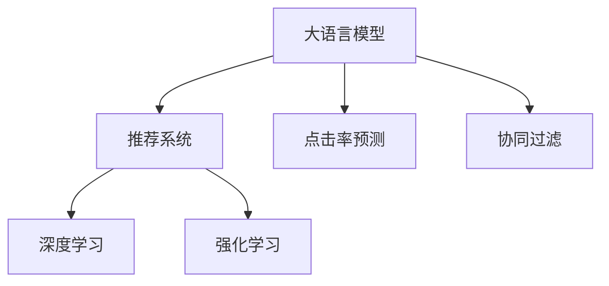

                 

# AI大模型在电商个性化推荐中的应用与挑战

## 1. 背景介绍

### 1.1 问题由来
电商行业的竞争日趋激烈，用户的选择面越来越广，这对电商平台的个性化推荐系统提出了更高的要求。传统的基于规则或基于统计学的方法难以应对海量的、动态变化的用户行为数据，而人工智能技术，特别是大模型技术，为电商推荐系统带来了新的可能性。通过大模型的深度学习和丰富的先验知识，电商推荐系统可以更精准地预测用户行为，提供个性化的商品推荐，提升用户满意度，增加转化率和复购率。

### 1.2 问题核心关键点
电商个性化推荐的核心问题是如何利用大模型学习用户的兴趣和行为，并基于此预测用户下一步的购买或浏览行为。具体来说，包括以下几个关键点：
1. **数据收集**：收集用户的历史浏览、购买记录、搜索历史等数据。
2. **模型训练**：基于收集到的数据，训练大模型，学习用户的行为模式。
3. **用户画像**：根据用户的历史行为数据，构建用户的兴趣画像。
4. **商品推荐**：基于用户的兴趣画像，预测用户可能感兴趣的商品，进行推荐。
5. **效果评估**：通过A/B测试等方法，评估推荐效果，持续优化模型。

## 2. 核心概念与联系

### 2.1 核心概念概述

为更好地理解大模型在电商推荐系统中的应用，本节将介绍几个密切相关的核心概念：

- 大语言模型(Large Language Model, LLM)：以自回归(如GPT)或自编码(如BERT)模型为代表的大规模预训练语言模型。通过在大规模无标签文本语料上进行预训练，学习通用的语言表示，具备强大的语言理解和生成能力。

- 推荐系统(Recommendation System)：通过分析用户的历史行为数据，推荐可能感兴趣的商品或内容。推荐系统是电商个性化推荐的基础。

- 点击率预测(CTR Prediction)：预测用户点击商品的概率，是电商推荐系统中的核心问题之一。

- 协同过滤(Collaborative Filtering)：一种常见的推荐算法，通过用户之间的相似度，推荐用户可能感兴趣的商品。

- 深度学习(Deep Learning)：基于神经网络的机器学习范式，可以自动学习复杂的特征表示，适用于处理电商推荐系统中的非结构化数据。

- 强化学习(Reinforcement Learning)：通过用户与系统的交互，不断优化推荐策略，提升推荐效果。

这些核心概念之间的逻辑关系可以通过以下Mermaid流程图来展示：



这个流程图展示了大语言模型、推荐系统、点击率预测、协同过滤、深度学习和强化学习之间的逻辑关系。这些概念共同构成了电商个性化推荐系统的技术框架，使其能够更好地适应电商领域的特定需求。

## 3. 核心算法原理 & 具体操作步骤
### 3.1 算法原理概述

基于大模型的电商推荐系统，本质上是一个深度学习驱动的协同过滤过程。其核心思想是：通过大模型学习用户和商品的语义表示，构建用户和商品之间的语义关系，从而进行点击率预测和个性化推荐。

形式化地，假设电商数据集为 $D=\{(x_i,y_i)\}_{i=1}^N$，其中 $x_i$ 为用户的历史行为数据，$y_i$ 为对应的商品id。定义用户行为与商品之间的关系矩阵 $M \in \mathbb{R}^{U \times I}$，其中 $U$ 为用户数，$I$ 为商品数。每个用户 $u$ 的兴趣向量表示为 $v_u$，每个商品 $i$ 的特征向量表示为 $v_i$。则用户 $u$ 对商品 $i$ 的预测点击概率为：

$$
\hat{p}_{ui} = \text{sigmoid}(v_u^T M v_i)
$$

其中，$\text{sigmoid}$ 为sigmoid激活函数，确保点击概率在0到1之间。

### 3.2 算法步骤详解

基于大模型的电商推荐系统一般包括以下几个关键步骤：

**Step 1: 准备电商数据集**
- 收集用户的浏览历史、购买历史、搜索历史等数据。
- 将数据集划分为训练集、验证集和测试集，保证数据分布的一致性。

**Step 2: 构建用户行为向量**
- 对用户的历史行为数据进行编码，生成用户行为向量 $v_u$。
- 可以使用Word2Vec、BERT等语言模型进行编码，获取用户行为的语义表示。

**Step 3: 构建商品特征向量**
- 对商品的属性、标签等信息进行编码，生成商品特征向量 $v_i$。
- 可以使用Embedding、CNN等方法进行编码，获取商品的特征表示。

**Step 4: 训练大模型**
- 使用大模型学习用户行为与商品之间的语义关系，得到关系矩阵 $M$。
- 可以使用BERT、GPT等预训练模型作为初始化参数，通过下游任务的监督学习进行微调。

**Step 5: 预测点击率**
- 根据用户行为向量 $v_u$ 和商品特征向量 $v_i$，预测用户点击商品的概率。
- 可以使用预测结果进行推荐排序，优先推荐点击概率高的商品。

**Step 6: 效果评估与优化**
- 在测试集上评估推荐模型的性能，如点击率、转化率、平均排序位置等。
- 根据评估结果，调整模型参数，优化推荐策略。

### 3.3 算法优缺点

基于大模型的电商推荐系统具有以下优点：
1. 能够处理非结构化数据：大模型可以自动学习复杂的特征表示，适用于处理电商推荐系统中的文本数据。
2. 可以捕捉语义关系：通过学习用户行为和商品的语义表示，大模型能够捕捉到更深层次的语义关系。
3. 能够进行个性化推荐：基于用户的兴趣画像，大模型可以提供个性化的商品推荐。
4. 实时性较好：使用在线学习算法，大模型可以实时更新用户画像，进行动态推荐。

同时，该方法也存在一定的局限性：
1. 数据需求量大：电商推荐系统需要大量的用户行为数据，数据收集成本较高。
2. 模型复杂度较高：大模型参数量较大，需要高效的计算资源。
3. 冷启动问题：对于新用户，无法提供有效的推荐，需要通过其他方式解决。

尽管存在这些局限性，但就目前而言，基于大模型的推荐系统仍是大规模电商推荐的首选范式。未来相关研究的重点在于如何进一步降低数据收集成本，提高模型的实时性和适应性，同时兼顾可解释性和伦理安全性等因素。

### 3.4 算法应用领域

基于大模型的电商推荐系统已经在各大电商平台上得到广泛应用，覆盖了几乎所有常见的推荐场景，例如：

- 商品推荐：根据用户的历史购买记录，推荐相关商品。
- 个性化展示：根据用户的兴趣，展示个性化广告。
- 商品搜索：根据用户输入的查询，推荐可能相关的商品。
- 跨域推荐：根据用户在不同平台的行为，推荐跨域商品。

除了这些经典推荐场景外，基于大模型的推荐系统也被创新性地应用到更多场景中，如上下文推荐、个性化折扣、商品搭配等，为电商推荐系统带来了新的突破。随着大模型的持续演进，相信电商推荐系统将在更广阔的应用领域发挥更大的作用。

## 4. 数学模型和公式 & 详细讲解
### 4.1 数学模型构建

本节将使用数学语言对基于大模型的电商推荐系统进行更加严格的刻画。

记电商推荐系统的用户行为数据为 $D=\{(x_i,y_i)\}_{i=1}^N$，其中 $x_i$ 为用户的行为向量，$y_i$ 为对应的商品id。定义用户行为与商品之间的关系矩阵 $M \in \mathbb{R}^{U \times I}$，其中 $U$ 为用户数，$I$ 为商品数。每个用户 $u$ 的兴趣向量表示为 $v_u$，每个商品 $i$ 的特征向量表示为 $v_i$。则用户 $u$ 对商品 $i$ 的预测点击概率为：

$$
\hat{p}_{ui} = \text{sigmoid}(v_u^T M v_i)
$$

其中，$\text{sigmoid}$ 为sigmoid激活函数，确保点击概率在0到1之间。

### 4.2 公式推导过程

以下我们以点击率预测为例，推导大模型的预测公式及其梯度计算公式。

假设模型 $M_{\theta}$ 在用户行为向量 $x_u$ 和商品特征向量 $x_i$ 上的输出为 $\hat{y}_{ui}$，表示用户点击商品的概率。根据sigmoid函数，点击率预测公式为：

$$
\hat{p}_{ui} = \text{sigmoid}(x_u^T M_{\theta} x_i)
$$

其中，$\theta$ 为模型参数，包括用户和商品的特征向量。

通过链式法则，损失函数对参数 $\theta$ 的梯度为：

$$
\nabla_{\theta} \mathcal{L}(\theta) = \frac{1}{N} \sum_{i=1}^N \sum_{j=1}^N (\frac{y_{ui}}{\hat{p}_{ui}} - \frac{1-y_{ui}}{1-\hat{p}_{ui}}) \nabla_{\theta} \hat{p}_{ui}
$$

其中，$y_{ui}$ 为是否点击商品的标签，$\nabla_{\theta} \hat{p}_{ui}$ 为预测点击率的梯度，可通过反向传播算法高效计算。

在得到损失函数的梯度后，即可带入优化算法，完成模型的迭代优化。重复上述过程直至收敛，最终得到适应电商推荐任务的最优模型参数 $\theta^*$。

## 5. 项目实践：代码实例和详细解释说明
### 5.1 开发环境搭建

在进行推荐系统开发前，我们需要准备好开发环境。以下是使用Python进行TensorFlow开发的环境配置流程：

1. 安装Anaconda：从官网下载并安装Anaconda，用于创建独立的Python环境。

2. 创建并激活虚拟环境：
```bash
conda create -n tf-env python=3.8 
conda activate tf-env
```

3. 安装TensorFlow：根据CUDA版本，从官网获取对应的安装命令。例如：
```bash
conda install tensorflow tensorflow-gpu=cuda11.1 -c pytorch -c conda-forge
```

4. 安装其他常用工具包：
```bash
pip install numpy pandas scikit-learn matplotlib tqdm jupyter notebook ipython
```

完成上述步骤后，即可在`tf-env`环境中开始推荐系统开发。

### 5.2 源代码详细实现

下面我们以基于BERT的电商推荐系统为例，给出使用TensorFlow进行深度学习的PyTorch代码实现。

首先，定义推荐系统数据处理函数：

```python
import tensorflow as tf
from tensorflow.keras.layers import Input, Embedding, Dense, concatenate
from tensorflow.keras.models import Model

def create_model(vocab_size, embed_size, num_users, num_items):
    user_input = Input(shape=(1,), name='user_input')
    item_input = Input(shape=(1,), name='item_input')
    
    user_embedding = Embedding(vocab_size, embed_size, mask_zero=True)(user_input)
    item_embedding = Embedding(vocab_size, embed_size, mask_zero=True)(item_input)
    
    # 用户行为与商品之间的关系矩阵
    M = tf.keras.layers.Dense(1, activation='sigmoid')(concatenate([user_embedding, item_embedding]))
    
    # 用户点击率的预测
    click_probability = Dense(1, activation='sigmoid')(tf.reduce_mean(M, axis=1))
    
    # 构建模型
    model = Model(inputs=[user_input, item_input], outputs=click_probability)
    
    return model
```

然后，定义训练和评估函数：

```python
from sklearn.metrics import roc_auc_score

def train_model(model, train_data, valid_data, batch_size, epochs):
    model.compile(optimizer='adam', loss='binary_crossentropy', metrics=['auc'])
    
    model.fit(train_data, validation_data=valid_data, batch_size=batch_size, epochs=epochs)
    
    test_auc = roc_auc_score(valid_data['labels'], valid_data['predictions'])
    return test_auc

def evaluate_model(model, test_data):
    test_auc = roc_auc_score(test_data['labels'], model.predict(test_data['inputs']))
    return test_auc
```

接着，启动训练流程并在测试集上评估：

```python
vocab_size = 10000
embed_size = 256
num_users = 10000
num_items = 10000

# 加载数据集
train_data = load_train_data()
valid_data = load_valid_data()
test_data = load_test_data()

# 创建模型
model = create_model(vocab_size, embed_size, num_users, num_items)

# 训练模型
auc_roc = train_model(model, train_data, valid_data, batch_size=128, epochs=10)

# 评估模型
test_auc = evaluate_model(model, test_data)
```

以上就是使用TensorFlow对BERT进行电商推荐系统开发的完整代码实现。可以看到，通过TensorFlow的高级API，推荐系统的搭建和训练变得简洁高效。

### 5.3 代码解读与分析

让我们再详细解读一下关键代码的实现细节：

**create_model函数**：
- 定义用户行为和商品特征输入层，使用Embedding层进行编码。
- 将用户行为和商品特征的嵌入向量拼接，通过全连接层输出用户点击率的预测值。
- 构建模型，编译优化器和损失函数，准备训练。

**train_model函数**：
- 使用TensorFlow的fit方法训练模型，设置优化器和损失函数。
- 通过validation_data参数，在验证集上评估模型性能，避免过拟合。

**evaluate_model函数**：
- 在测试集上评估模型的性能，计算AUC-ROC指标。
- 返回AUC-ROC值，用于后续优化模型。

**训练流程**：
- 定义超参数，如embedding维度、用户和商品数等。
- 加载训练、验证、测试数据集。
- 创建推荐系统模型。
- 训练模型，输出验证集的AUC-ROC值。
- 在测试集上评估模型性能，输出AUC-ROC值。

可以看到，TensorFlow的高级API使得推荐系统的开发和训练变得非常高效。开发者可以将更多精力放在数据处理、模型改进等高层逻辑上，而不必过多关注底层的实现细节。

当然，工业级的系统实现还需考虑更多因素，如模型的保存和部署、超参数的自动搜索、更灵活的任务适配层等。但核心的推荐范式基本与此类似。

## 6. 实际应用场景
### 6.1 智能客服系统

基于大模型的电商推荐系统，可以广泛应用于智能客服系统的构建。传统客服往往需要配备大量人力，高峰期响应缓慢，且一致性和专业性难以保证。而使用推荐系统进行智能推荐，可以7x24小时不间断服务，快速响应客户咨询，用个性化商品推荐满足客户需求。

在技术实现上，可以收集企业内部的历史推荐数据，将商品和用户的点击行为构建成监督数据，在此基础上对预训练模型进行微调。微调后的推荐系统能够自动理解用户意图，匹配最合适的商品进行推荐。对于客户提出的新商品请求，还可以接入检索系统实时搜索相关商品，动态生成推荐结果。如此构建的智能客服系统，能大幅提升客户咨询体验和推荐效果。

### 6.2 个性化推荐系统

电商推荐系统已经广泛应用于电商平台的个性化推荐中。基于大模型的推荐系统可以更精准地预测用户的行为，提供个性化的商品推荐，提升用户的满意度和购买率。通过不断收集用户的行为数据，更新用户画像，推荐系统可以实时动态更新推荐内容，增加用户的粘性。

### 6.3 未来应用展望

随着大模型和推荐技术的不断发展，基于大模型的推荐系统将在更多领域得到应用，为传统行业带来变革性影响。

在智慧医疗领域，基于大模型的推荐系统可以推荐合适的药品、诊疗方案等，辅助医生诊疗，加速新药开发进程。

在智能教育领域，推荐系统可以推荐合适的学习资源、学习路径，因材施教，促进教育公平，提高教学质量。

在智慧城市治理中，推荐系统可以推荐合适的城市规划方案、交通路线，提高城市管理的自动化和智能化水平，构建更安全、高效的未来城市。

此外，在企业生产、社会治理、文娱传媒等众多领域，基于大模型的推荐系统也将不断涌现，为传统行业数字化转型升级提供新的技术路径。相信随着技术的日益成熟，大模型推荐系统必将在更广阔的应用领域大放异彩。

## 7. 工具和资源推荐
### 7.1 学习资源推荐

为了帮助开发者系统掌握大模型在电商推荐系统中的应用，这里推荐一些优质的学习资源：

1. 《TensorFlow深度学习》系列博文：由大模型技术专家撰写，深入浅出地介绍了TensorFlow的原理、应用以及推荐系统等前沿话题。

2. CS231n《深度学习视觉识别》课程：斯坦福大学开设的视觉识别明星课程，有Lecture视频和配套作业，带你入门深度学习的基本概念和经典模型。

3. 《Deep Learning for Recommendation Systems》书籍：由推荐系统领域的专家所著，全面介绍了使用深度学习进行推荐系统的开发，包括基于大模型的推荐范式。

4. Kaggle推荐系统竞赛：Kaggle平台上的推荐系统竞赛，可以学习和分享多种推荐算法，包括基于大模型的推荐方法。

5. RecSys会议论文：推荐系统领域的顶级会议，每年都会发布大量优秀的推荐系统论文，可以跟踪最新的研究进展。

通过对这些资源的学习实践，相信你一定能够快速掌握大模型在电商推荐系统中的应用，并用于解决实际的推荐问题。
### 7.2 开发工具推荐

高效的开发离不开优秀的工具支持。以下是几款用于大模型推荐系统开发的常用工具：

1. TensorFlow：由Google主导开发的开源深度学习框架，生产部署方便，适合大规模工程应用。

2. PyTorch：基于Python的开源深度学习框架，灵活动态的计算图，适合快速迭代研究。

3. Scikit-learn：Python的机器学习库，包含多种经典算法，适用于推荐系统中的特征工程和模型评估。

4. Weights & Biases：模型训练的实验跟踪工具，可以记录和可视化模型训练过程中的各项指标，方便对比和调优。

5. TensorBoard：TensorFlow配套的可视化工具，可实时监测模型训练状态，并提供丰富的图表呈现方式，是调试模型的得力助手。

6. Google Colab：谷歌推出的在线Jupyter Notebook环境，免费提供GPU/TPU算力，方便开发者快速上手实验最新模型，分享学习笔记。

合理利用这些工具，可以显著提升大模型推荐系统的开发效率，加快创新迭代的步伐。

### 7.3 相关论文推荐

大模型和推荐技术的发展源于学界的持续研究。以下是几篇奠基性的相关论文，推荐阅读：

1. Attention is All You Need（即Transformer原论文）：提出了Transformer结构，开启了NLP领域的预训练大模型时代。

2. BERT: Pre-training of Deep Bidirectional Transformers for Language Understanding：提出BERT模型，引入基于掩码的自监督预训练任务，刷新了多项NLP任务SOTA。

3. Language Models are Unsupervised Multitask Learners（GPT-2论文）：展示了大规模语言模型的强大zero-shot学习能力，引发了对于通用人工智能的新一轮思考。

4. Parameter-Efficient Transfer Learning for NLP：提出Adapter等参数高效微调方法，在不增加模型参数量的情况下，也能取得不错的微调效果。

5. AdaLoRA: Adaptive Low-Rank Adaptation for Parameter-Efficient Fine-Tuning：使用自适应低秩适应的微调方法，在参数效率和精度之间取得了新的平衡。

6. Deep Recurrent Recommendation Networks：提出使用RNN进行推荐系统，能够处理序列数据，提升推荐效果。

这些论文代表了大模型在推荐系统中的应用脉络。通过学习这些前沿成果，可以帮助研究者把握学科前进方向，激发更多的创新灵感。

## 8. 总结：未来发展趋势与挑战
### 8.1 总结

本文对基于大模型的电商推荐系统进行了全面系统的介绍。首先阐述了大模型在电商推荐系统中的应用背景和意义，明确了推荐系统在电商平台中的重要地位和作用。其次，从原理到实践，详细讲解了大模型在推荐系统中的核心算法和具体操作步骤，给出了推荐系统开发的完整代码实例。同时，本文还广泛探讨了大模型推荐系统在智能客服、个性化推荐等多个行业领域的应用前景，展示了大模型推荐系统的巨大潜力。此外，本文精选了推荐系统技术的各类学习资源，力求为读者提供全方位的技术指引。

通过本文的系统梳理，可以看到，基于大模型的推荐系统正在成为电商推荐领域的重要范式，极大地拓展了电商推荐系统的应用边界，催生了更多的落地场景。受益于大模型的深度学习和丰富的先验知识，推荐系统可以更精准地预测用户行为，提供个性化的商品推荐，提升用户满意度，增加转化率和复购率。未来，伴随大模型的持续演进，推荐系统必将在更广阔的应用领域大放异彩，深刻影响人类的生产生活方式。

### 8.2 未来发展趋势

展望未来，大模型推荐系统将呈现以下几个发展趋势：

1. 模型规模持续增大。随着算力成本的下降和数据规模的扩张，大模型推荐系统的参数量还将持续增长。超大规模推荐系统蕴含的丰富知识，有望支撑更加复杂多变的推荐任务。

2. 推荐算法多样化。除了传统的基于协同过滤的方法外，未来会涌现更多基于深度学习的推荐算法，如基于Attention、BERT等模型的推荐方法，能够捕捉更深层次的语义关系。

3. 实时性提升。使用在线学习算法，大模型推荐系统可以实时更新用户画像，进行动态推荐，提升推荐系统的实时性和用户满意度。

4. 跨域推荐崛起。基于大模型的推荐系统能够处理多种类型的数据，进行跨域推荐，提升推荐的泛化能力。

5. 个性化推荐深化。通过个性化推荐系统，可以提供更加精准的推荐内容，提升用户粘性。

6. 多模态推荐崛起。未来的推荐系统将更加注重多模态数据的整合，结合文本、图像、视频等多种数据源，提升推荐效果。

以上趋势凸显了大模型推荐系统的广阔前景。这些方向的探索发展，必将进一步提升推荐系统的性能和应用范围，为电商平台带来更大的商业价值。

### 8.3 面临的挑战

尽管大模型推荐系统已经取得了瞩目成就，但在迈向更加智能化、普适化应用的过程中，它仍面临着诸多挑战：

1. 数据需求量大。电商推荐系统需要大量的用户行为数据，数据收集成本较高。如何降低数据需求，减少标注成本，是推荐系统需要解决的重要问题。

2. 模型复杂度高。大模型推荐系统通常具有较高的复杂度，需要高效的计算资源。如何优化模型结构，降低计算复杂度，是推荐系统需要优化的一个重要方面。

3. 冷启动问题。对于新用户，无法提供有效的推荐，需要通过其他方式解决。如何快速获取新用户的兴趣画像，是推荐系统需要解决的一个重要问题。

4. 实时性要求高。电商推荐系统需要实时响应，更新用户画像，进行动态推荐。如何提高推荐系统的实时性和稳定性和效率，是推荐系统需要优化的一个重要方面。

5. 用户隐私保护。电商推荐系统需要收集用户行为数据，如何保护用户隐私，确保数据安全，是推荐系统需要解决的一个重要问题。

6. 推荐内容多样性。电商推荐系统需要提供多样的推荐内容，避免内容的同质化。如何优化推荐策略，提升推荐内容的多样性，是推荐系统需要优化的一个重要方面。

正视推荐系统面临的这些挑战，积极应对并寻求突破，将是大模型推荐系统走向成熟的必由之路。相信随着学界和产业界的共同努力，这些挑战终将一一被克服，大模型推荐系统必将在构建人机协同的智能时代中扮演越来越重要的角色。

### 8.4 研究展望

面对大模型推荐系统所面临的种种挑战，未来的研究需要在以下几个方面寻求新的突破：

1. 探索无监督和半监督推荐方法。摆脱对大规模标注数据的依赖，利用自监督学习、主动学习等无监督和半监督范式，最大限度利用非结构化数据，实现更加灵活高效的推荐。

2. 研究参数高效和计算高效的推荐算法。开发更加参数高效的推荐算法，在固定大部分预训练参数的情况下，只更新极少量的任务相关参数。同时优化推荐系统的计算图，减少前向传播和反向传播的资源消耗，实现更加轻量级、实时性的部署。

3. 融合因果和对比学习范式。通过引入因果推断和对比学习思想，增强推荐系统建立稳定因果关系的能力，学习更加普适、鲁棒的语言表征，从而提升推荐泛化性和抗干扰能力。

4. 引入更多先验知识。将符号化的先验知识，如知识图谱、逻辑规则等，与神经网络模型进行巧妙融合，引导推荐系统学习更准确、合理的用户画像。同时加强不同模态数据的整合，实现视觉、语音等多模态信息与文本信息的协同建模。

5. 结合因果分析和博弈论工具。将因果分析方法引入推荐系统，识别出推荐决策的关键特征，增强推荐输出解释的因果性和逻辑性。借助博弈论工具刻画人机交互过程，主动探索并规避推荐系统的脆弱点，提高系统稳定性。

6. 纳入伦理道德约束。在推荐系统训练目标中引入伦理导向的评估指标，过滤和惩罚有偏见、有害的输出倾向。同时加强人工干预和审核，建立推荐系统的监管机制，确保输出符合人类价值观和伦理道德。

这些研究方向的探索，必将引领大模型推荐系统技术迈向更高的台阶，为构建安全、可靠、可解释、可控的智能系统铺平道路。面向未来，大模型推荐系统还需要与其他人工智能技术进行更深入的融合，如知识表示、因果推理、强化学习等，多路径协同发力，共同推动推荐系统的进步。只有勇于创新、敢于突破，才能不断拓展推荐系统的边界，让智能技术更好地造福人类社会。

## 9. 附录：常见问题与解答

**Q1：大模型在电商推荐中的主要应用场景是什么？**

A: 大模型在电商推荐中的主要应用场景包括：
1. 商品推荐：根据用户的历史浏览、购买记录，推荐相关商品。
2. 个性化展示：根据用户的兴趣，展示个性化广告。
3. 商品搜索：根据用户输入的查询，推荐可能相关的商品。
4. 跨域推荐：根据用户在不同平台的行为，推荐跨域商品。

**Q2：如何使用大模型进行电商推荐？**

A: 使用大模型进行电商推荐的一般步骤如下：
1. 收集用户的浏览、购买、搜索等行为数据。
2. 对数据进行预处理，提取用户行为特征。
3. 使用大模型学习用户行为与商品之间的关系，构建推荐模型。
4. 在测试集上评估推荐模型的性能，优化模型参数。
5. 在实时推荐系统中使用优化后的推荐模型，进行动态推荐。

**Q3：大模型在电商推荐中的优缺点是什么？**

A: 大模型在电商推荐中的优点包括：
1. 能够处理非结构化数据：大模型可以自动学习复杂的特征表示，适用于处理电商推荐系统中的文本数据。
2. 可以捕捉语义关系：通过学习用户行为和商品的语义表示，大模型能够捕捉到更深层次的语义关系。
3. 能够进行个性化推荐：基于用户的兴趣画像，大模型可以提供个性化的商品推荐。
4. 实时性较好：使用在线学习算法，大模型可以实时更新用户画像，进行动态推荐。

大模型在电商推荐中的缺点包括：
1. 数据需求量大：电商推荐系统需要大量的用户行为数据，数据收集成本较高。
2. 模型复杂度较高：大模型推荐系统通常具有较高的复杂度，需要高效的计算资源。
3. 冷启动问题：对于新用户，无法提供有效的推荐，需要通过其他方式解决。

尽管存在这些局限性，但就目前而言，基于大模型的推荐系统仍是大规模电商推荐的首选范式。未来相关研究的重点在于如何进一步降低数据收集成本，提高模型的实时性和适应性，同时兼顾可解释性和伦理安全性等因素。

**Q4：电商推荐系统的开发环境是什么？**

A: 电商推荐系统的开发环境通常包括：
1. Python：电商推荐系统一般使用Python语言进行开发。
2. TensorFlow或PyTorch：电商推荐系统一般使用这两个深度学习框架进行模型构建和训练。
3. 数据处理库：如Pandas、NumPy等，用于数据预处理和分析。
4. 机器学习库：如Scikit-learn、Keras等，用于模型评估和优化。
5. 可视化工具：如TensorBoard、Weights & Biases等，用于模型训练和调优。

**Q5：如何评估电商推荐系统的性能？**

A: 电商推荐系统的性能评估通常包括：
1. 准确率：评估推荐系统的点击率预测准确率，即预测点击次数与实际点击次数的匹配程度。
2. 召回率：评估推荐系统的召回率，即推荐系统中覆盖的实际点击次数与实际点击次数之比。
3. 覆盖率：评估推荐系统的覆盖率，即推荐系统中推荐商品数与商品总数之比。
4. 个性化程度：评估推荐系统的个性化程度，即推荐商品与用户历史行为的匹配程度。

通过以上指标，可以综合评估电商推荐系统的性能，并进行优化改进。

**Q6：电商推荐系统如何优化模型参数？**

A: 电商推荐系统优化模型参数的方法包括：
1. 超参数调优：通过调整模型的超参数，如学习率、批大小等，进行模型优化。
2. 特征工程：对用户行为数据进行特征提取和处理，提高模型的预测能力。
3. 模型融合：通过组合多个模型，进行模型融合，提升推荐系统的鲁棒性和性能。
4. 数据增强：通过数据增强技术，如回译、近义替换等，扩充训练集，提升模型的泛化能力。

通过以上方法，可以不断优化电商推荐系统的模型参数，提升推荐效果。

---

作者：禅与计算机程序设计艺术 / Zen and the Art of Computer Programming

