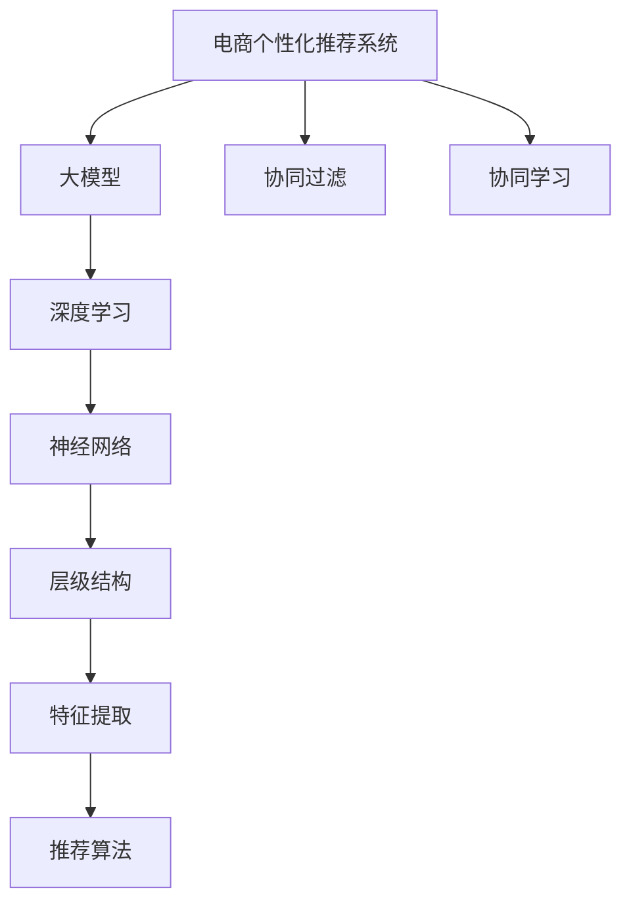

                 

# AI大模型在电商个性化推荐中的深度应用

> 关键词：电商个性化推荐, 大模型, 深度学习, 神经网络, 协同过滤, 协同学习, 推荐算法, 推荐系统

## 1. 背景介绍

### 1.1 问题由来
随着电子商务的迅猛发展，各大电商平台对个性化推荐系统的需求日益增加。传统的推荐方法如基于协同过滤、内容推荐等，虽然取得了一定成功，但面对海量用户数据和快速变化的市场环境，仍然显得力不从心。

为了解决这些问题，电商平台开始探索利用人工智能技术，特别是深度学习和大模型技术，来构建更加精准、高效的个性化推荐系统。大模型如BERT、GPT等，由于其强大的表示能力和泛化能力，成为推荐系统中重要的技术手段。

### 1.2 问题核心关键点
大模型在电商个性化推荐中的应用，主要基于以下几点：

- **泛化能力**：大模型可以从大规模无标注数据中学习到丰富的知识表示，使得其在各种推荐场景下都能表现出色。
- **表示能力**：大模型具有强大的语义理解能力，能够捕捉用户和商品之间的潜在关联，提升推荐效果。
- **高效性**：大模型能够快速适应新的数据和任务，缩短开发周期。
- **自适应**：大模型能够实时更新，反映最新的市场动态和用户需求。

## 2. 核心概念与联系

### 2.1 核心概念概述

本节将介绍几个与电商个性化推荐密切相关的核心概念：

- **电商个性化推荐系统**：利用用户行为数据、商品属性信息等，为每个用户推荐最相关的商品。
- **大模型**：如BERT、GPT等，通过在大规模无标注数据上进行预训练，学习到丰富的语言和知识表示，适用于多种推荐任务。
- **深度学习**：一种基于神经网络的机器学习方法，通过多层网络结构，提取数据中的高级特征。
- **协同过滤**：推荐系统中常用的方法，利用用户之间的相似性或商品之间的关联性，进行推荐。
- **协同学习**：利用多用户或多商品之间的协作信息，提高推荐模型的准确性和泛化能力。

这些概念之间存在紧密的联系，大模型与深度学习是技术基础，协同过滤和协同学习则是实际应用中的重要手段。

### 2.2 核心概念原理和架构的 Mermaid 流程图



这个流程图展示了大模型在电商个性化推荐系统中的作用：

1. 电商个性化推荐系统以大模型为基础，通过深度学习提取特征。
2. 协同过滤和协同学习利用用户和商品之间的关联信息，进行推荐。
3. 神经网络结构通过多层次的特征提取，提升模型表示能力。
4. 推荐算法将特征与推荐目标相结合，输出最终推荐结果。

## 3. 核心算法原理 & 具体操作步骤
### 3.1 算法原理概述

基于大模型的电商个性化推荐系统，主要利用深度学习和大模型在用户-商品交互数据上的表示能力，实现商品推荐。其核心思想是：

1. 通过大模型在无标注数据上进行预训练，学习到丰富的知识表示。
2. 在大模型的基础上，利用深度学习提取用户和商品的特征表示。
3. 结合协同过滤和协同学习，综合考虑用户和商品之间的关联性，进行推荐。

### 3.2 算法步骤详解

#### Step 1: 数据预处理

1. 收集用户行为数据：如浏览、点击、购买记录等。
2. 收集商品属性数据：如价格、类别、描述等。
3. 对数据进行清洗和格式化，消除噪声和缺失值。

#### Step 2: 数据标注

1. 对用户行为数据进行标注，标记用户的购买意向。
2. 对商品属性数据进行标注，提取商品的标签信息。
3. 构建用户-商品交互矩阵，用于协同过滤。

#### Step 3: 模型预训练

1. 使用大模型如BERT、GPT等，在电商语料上进行预训练。
2. 在大模型的基础上，构建神经网络结构。
3. 在预训练的模型上，利用深度学习进行特征提取。

#### Step 4: 推荐算法设计

1. 结合协同过滤和协同学习，设计推荐算法。
2. 引入用户和商品的特征表示，提高推荐模型的泛化能力。
3. 优化推荐算法，平衡精度和效率。

#### Step 5: 模型训练与优化

1. 使用标注数据，训练推荐模型。
2. 利用正则化技术，防止过拟合。
3. 使用梯度下降等优化算法，不断优化模型参数。

#### Step 6: 模型评估与部署

1. 在测试集上评估推荐模型的效果，如准确率、召回率、F1值等。
2. 部署推荐模型到实际应用中，进行实时推荐。
3. 定期更新模型，反映最新的用户和商品信息。

### 3.3 算法优缺点

#### 优点：

1. **泛化能力**：大模型能够捕捉用户和商品之间的潜在关联，提高推荐精度。
2. **高效性**：深度学习和大模型能够快速适应新的数据和任务，缩短开发周期。
3. **自适应**：实时更新推荐模型，反映最新的市场动态和用户需求。
4. **可解释性**：大模型能够提供详细的特征表示，便于理解推荐结果。

#### 缺点：

1. **数据需求高**：需要大量的用户行为数据和商品属性数据，数据质量对模型效果影响较大。
2. **计算成本高**：大模型和深度学习模型的计算复杂度高，需要高性能硬件支持。
3. **模型复杂**：神经网络结构复杂，模型的训练和优化难度较大。
4. **公平性问题**：大模型可能存在偏见，导致推荐结果不公平。

## 4. 数学模型和公式 & 详细讲解 & 举例说明

### 4.1 数学模型构建

设推荐系统中有$N$个用户，$M$个商品，每个用户与$K$个商品有交互。用$\text{user} \times \text{item}$的矩阵$\textbf{I} \in \mathbb{R}^{N \times M}$表示用户-商品交互矩阵，其中$\textbf{I}_{ij} = 1$表示用户$i$对商品$j$有交互，否则为$0$。

### 4.2 公式推导过程

1. **用户特征表示**：

   设用户$i$的特征向量为$\textbf{u}_i \in \mathbb{R}^d$，其中$d$为特征维度。将用户$i$与商品$j$的交互表示为用户$i$对商品$j$的评分$x_{ij} \in [0,1]$，则用户$i$的特征表示为：
   
   $$
   \textbf{u}_i = \sum_{j=1}^M \textbf{I}_{ij} \textbf{v}_j
   $$

   其中$\textbf{v}_j$为商品$j$的特征向量，通常通过预训练模型如BERT等得到。

2. **商品特征表示**：

   设商品$j$的特征向量为$\textbf{v}_j \in \mathbb{R}^d$，商品$j$与商品$j'$的关联度为$r_{jj'}$，通常为$0$或$1$。则商品$j$的特征表示为：
   
   $$
   \textbf{v}_j = \sum_{j'=1}^M r_{jj'} \textbf{v}_{j'}
   $$

3. **推荐算法**：

   常见的推荐算法包括基于协同过滤的算法，如基于用户的协同过滤、基于商品的协同过滤等。假设推荐系统采用基于用户的协同过滤算法，则推荐模型为：
   
   $$
   \hat{x}_{ij} = \textbf{u}_i \cdot \textbf{v}_j
   $$

   其中$\cdot$表示向量点积。

### 4.3 案例分析与讲解

以一个简单的电商推荐系统为例，分析基于大模型的推荐过程：

1. **数据预处理**：收集用户和商品的交互数据，如用户的浏览、点击、购买记录，商品的类别、价格、描述等。对数据进行清洗和格式化，去除噪声和缺失值。

2. **模型预训练**：使用预训练模型如BERT，在大规模电商语料上进行预训练，学习用户和商品的特征表示。

3. **推荐算法设计**：采用基于用户的协同过滤算法，将用户特征表示和商品特征表示进行点积运算，得到推荐分数$\hat{x}_{ij}$。

4. **模型训练与优化**：使用标注数据训练推荐模型，使用正则化技术如L2正则、Dropout等，防止过拟合。使用梯度下降等优化算法，不断优化模型参数。

5. **模型评估与部署**：在测试集上评估推荐模型的效果，如准确率、召回率、F1值等。部署推荐模型到实际应用中，进行实时推荐。定期更新模型，反映最新的用户和商品信息。

## 5. 项目实践：代码实例和详细解释说明

### 5.1 开发环境搭建

本节将介绍使用Python和PyTorch搭建电商推荐系统的开发环境。

1. 安装Anaconda，创建虚拟环境：
```bash
conda create -n recommendation python=3.8
conda activate recommendation
```

2. 安装PyTorch和相关库：
```bash
pip install torch torchvision torchaudio transformers scipy pandas scikit-learn numpy
```

3. 安装相关依赖：
```bash
pip install pytorch-lightning fire tensorboard
```

4. 安装HuggingFace Transformers库：
```bash
pip install transformers
```

### 5.2 源代码详细实现

以下是使用PyTorch和Transformers库实现电商推荐系统的代码：

```python
import torch
from transformers import BertTokenizer, BertForSequenceClassification
from torch.utils.data import Dataset, DataLoader
from torch.nn import CrossEntropyLoss
from sklearn.metrics import precision_recall_fscore_support

class Item(Dataset):
    def __init__(self, texts, labels):
        self.texts = texts
        self.labels = labels
        self.tokenizer = BertTokenizer.from_pretrained('bert-base-uncased')
        
    def __len__(self):
        return len(self.texts)
    
    def __getitem__(self, item):
        text = self.texts[item]
        label = self.labels[item]
        
        encoding = self.tokenizer(text, return_tensors='pt', padding='max_length', max_length=128, truncation=True)
        input_ids = encoding['input_ids'][0]
        attention_mask = encoding['attention_mask'][0]
        
        label = torch.tensor([label], dtype=torch.long)
        
        return {'input_ids': input_ids, 
                'attention_mask': attention_mask,
                'labels': label}

class BERTRecommender:
    def __init__(self, model, device):
        self.model = model
        self.device = device
        
    def forward(self, input_ids, attention_mask, labels):
        output = self.model(input_ids, attention_mask=attention_mask, labels=labels)
        logits = output[0]
        loss = output[1]
        return logits, loss
    
    def train(self, dataset, batch_size, num_epochs, optimizer, learning_rate, loss_fn):
        self.model.train()
        for epoch in range(num_epochs):
            total_loss = 0
            for batch in DataLoader(dataset, batch_size=batch_size, shuffle=True):
                input_ids = batch['input_ids'].to(self.device)
                attention_mask = batch['attention_mask'].to(self.device)
                labels = batch['labels'].to(self.device)
                logits, loss = self.forward(input_ids, attention_mask, labels)
                optimizer.zero_grad()
                loss.backward()
                optimizer.step()
                total_loss += loss.item()
            print(f"Epoch {epoch+1}, train loss: {total_loss/len(dataset)}")
    
    def evaluate(self, dataset, batch_size, loss_fn):
        self.model.eval()
        total_loss = 0
        total_pred = []
        total_true = []
        for batch in DataLoader(dataset, batch_size=batch_size, shuffle=False):
            input_ids = batch['input_ids'].to(self.device)
            attention_mask = batch['attention_mask'].to(self.device)
            labels = batch['labels'].to(self.device)
            with torch.no_grad():
                logits, loss = self.forward(input_ids, attention_mask, labels)
                total_loss += loss.item()
                total_pred.extend(logits.argmax(dim=1).cpu().tolist())
                total_true.extend(labels.cpu().tolist())
        precision, recall, f1, _ = precision_recall_fscore_support(total_true, total_pred, average='micro')
        print(f"Evaluate loss: {total_loss/len(dataset)}, precision: {precision:.4f}, recall: {recall:.4f}, f1: {f1:.4f}")
        
# 数据准备
dataset = Item([...], [...])

# 模型加载
model = BertForSequenceClassification.from_pretrained('bert-base-uncased', num_labels=2)
optimizer = torch.optim.Adam(model.parameters(), lr=2e-5)

# 训练
recommender = BERTRecommender(model, device=torch.device('cuda'))
recommender.train(dataset, batch_size=16, num_epochs=5, optimizer=optimizer, learning_rate=2e-5, loss_fn=CrossEntropyLoss())

# 评估
recommender.evaluate(dataset, batch_size=16, loss_fn=CrossEntropyLoss())
```

### 5.3 代码解读与分析

1. **数据准备**：定义`Item`类，用于处理训练集和测试集数据。将用户-商品交互数据转换为BERT模型可接受的格式。

2. **模型加载**：使用`BertForSequenceClassification`加载预训练的BERT模型，指定分类数和输出标签。

3. **训练过程**：在`train`方法中，模型进行前向传播和反向传播，更新模型参数。使用`CrossEntropyLoss`作为损失函数，优化器为Adam。

4. **评估过程**：在`evaluate`方法中，模型进行前向传播，计算损失函数，输出预测结果。使用`precision_recall_fscore_support`计算评价指标。

5. **训练和评估**：在主程序中，分别调用`train`和`evaluate`方法，进行模型训练和评估。

### 5.4 运行结果展示

在运行上述代码后，可以得到训练过程中的损失函数变化和评估结果的精度、召回率和F1值。这些指标可以帮助评估模型的性能，并进行进一步的优化。

## 6. 实际应用场景

### 6.1 智能推荐系统

智能推荐系统在电商中得到了广泛应用。大模型在电商推荐中的深度应用，可以显著提升推荐效果和用户体验。例如：

1. **用户画像**：利用大模型进行用户画像建模，捕捉用户的兴趣和偏好，提高推荐的相关性和多样性。

2. **商品推荐**：结合用户画像和商品特征，进行多维度推荐，如基于用户的历史行为、商品的属性和用户的社交关系等。

3. **实时推荐**：通过实时数据分析和模型更新，动态调整推荐策略，提升推荐的时效性和准确性。

### 6.2 电商营销

大模型在电商营销中也具有重要应用，如：

1. **广告投放**：利用大模型进行广告文本生成和优化，提高广告的点击率和转化率。

2. **商品排名**：结合用户行为数据和广告投放结果，动态调整商品排名策略，提升用户体验和平台收益。

3. **客户服务**：利用大模型进行智能客服，提高客户服务效率和满意度。

### 6.3 用户行为分析

利用大模型进行用户行为分析，可以帮助电商平台更好地理解用户需求和行为，进行针对性的优化。例如：

1. **用户行为预测**：利用大模型进行用户行为预测，帮助电商平台提前准备库存和促销活动。

2. **用户满意度分析**：结合用户行为数据和反馈信息，进行用户满意度评估，提升用户粘性和忠诚度。

### 6.4 未来应用展望

随着大模型和深度学习技术的进一步发展，其在电商个性化推荐中的应用将更加深入和广泛。未来可能出现以下趋势：

1. **多模态推荐**：结合图像、视频等多模态数据，提升推荐的丰富性和个性化程度。

2. **跨领域推荐**：将电商推荐系统与其他领域如金融、医疗等结合，进行跨领域推荐，提升推荐的多样性和创新性。

3. **实时推荐引擎**：通过实时数据分析和模型更新，构建实时推荐引擎，提升推荐的时效性和精准度。

4. **个性化推荐引擎**：利用大模型和深度学习技术，构建个性化推荐引擎，提升推荐的相关性和多样性。

5. **推荐系统的可解释性**：提升推荐系统的可解释性，帮助用户理解和信任推荐结果。

## 7. 工具和资源推荐

### 7.1 学习资源推荐

1. **《深度学习入门》**：经典的深度学习入门书籍，帮助读者全面了解深度学习的基本概念和算法。

2. **《动手学深度学习》**：由深度学习专家编写，提供丰富的实践案例和代码实现。

3. **Kaggle竞赛**：通过参与Kaggle竞赛，学习前沿的推荐系统和数据科学应用。

4. **PyTorch官方文档**：提供详细的PyTorch使用指南和代码示例。

### 7.2 开发工具推荐

1. **PyTorch**：强大的深度学习框架，支持动态图和静态图两种计算图模型。

2. **TensorFlow**：Google开源的深度学习框架，支持分布式计算和模型优化。

3. **HuggingFace Transformers库**：提供丰富的预训练模型和工具，支持多语言和任务。

4. **TensorBoard**：用于可视化深度学习模型的训练过程和结果。

5. **PyTorch Lightning**：提供更简单的模型实现和训练框架。

### 7.3 相关论文推荐

1. **《深度学习个性化推荐系统》**：介绍深度学习在个性化推荐中的应用。

2. **《大模型的迁移学习和微调》**：研究大模型的迁移学习和微调方法。

3. **《电商推荐系统》**：介绍电商推荐系统的发展历程和最新技术。

## 8. 总结：未来发展趋势与挑战

### 8.1 研究成果总结

大模型在电商个性化推荐中的应用，已经取得了显著的成效，提升了推荐系统的精度和效率。未来，随着大模型和深度学习技术的进一步发展，其在电商推荐中的应用将更加深入和广泛。

### 8.2 未来发展趋势

1. **多模态推荐**：结合图像、视频等多模态数据，提升推荐的丰富性和个性化程度。

2. **跨领域推荐**：将电商推荐系统与其他领域如金融、医疗等结合，进行跨领域推荐，提升推荐的多样性和创新性。

3. **实时推荐引擎**：通过实时数据分析和模型更新，构建实时推荐引擎，提升推荐的时效性和精准度。

4. **个性化推荐引擎**：利用大模型和深度学习技术，构建个性化推荐引擎，提升推荐的相关性和多样性。

5. **推荐系统的可解释性**：提升推荐系统的可解释性，帮助用户理解和信任推荐结果。

### 8.3 面临的挑战

尽管大模型在电商推荐中的应用已经取得了显著成效，但仍面临以下挑战：

1. **数据隐私和安全**：电商推荐系统需要处理大量的用户数据，数据隐私和安全问题亟需解决。

2. **计算资源和成本**：大模型和深度学习模型的计算复杂度高，需要高性能硬件和大量计算资源。

3. **模型可解释性**：大模型和深度学习模型的决策过程缺乏可解释性，难以理解模型的内部工作机制。

4. **模型公平性和偏见**：大模型可能存在偏见，导致推荐结果不公平。

5. **实时性和效率**：电商推荐系统需要实时响应用户请求，对模型计算效率和响应速度要求高。

### 8.4 研究展望

面对上述挑战，未来需要在以下几个方面进行研究和探索：

1. **数据隐私和安全**：研究数据隐私保护技术和安全措施，确保用户数据的隐私和安全。

2. **计算资源和成本**：研究高效的计算框架和算法，降低模型计算成本，提升计算效率。

3. **模型可解释性**：研究模型的可解释性技术和方法，提升模型的可理解性和可解释性。

4. **模型公平性和偏见**：研究模型公平性和偏见识别技术，提升模型的公平性和透明性。

5. **实时性和效率**：研究实时推荐算法和优化技术，提升推荐系统的实时性和效率。

通过不断突破这些挑战，大模型在电商推荐中的应用将更加深入和广泛，推动电商行业的数字化转型和智能化升级。

## 9. 附录：常见问题与解答

### Q1: 大模型在电商推荐中有哪些应用？

**A**: 大模型在电商推荐中有以下应用：

1. **用户画像**：利用大模型进行用户画像建模，捕捉用户的兴趣和偏好。

2. **商品推荐**：结合用户画像和商品特征，进行多维度推荐。

3. **实时推荐**：通过实时数据分析和模型更新，动态调整推荐策略。

4. **广告投放**：利用大模型进行广告文本生成和优化。

5. **用户行为分析**：结合用户行为数据和反馈信息，进行用户满意度评估。

### Q2: 大模型在电商推荐中的训练和优化方法有哪些？

**A**: 大模型在电商推荐中的训练和优化方法包括：

1. **数据预处理**：收集用户行为数据和商品属性数据，进行清洗和格式化。

2. **模型预训练**：使用大模型如BERT，在大规模电商语料上进行预训练，学习用户和商品的特征表示。

3. **推荐算法设计**：采用基于协同过滤的算法，结合用户特征表示和商品特征表示进行推荐。

4. **模型训练与优化**：使用标注数据训练推荐模型，使用正则化技术防止过拟合，使用梯度下降等优化算法不断优化模型参数。

5. **模型评估与部署**：在测试集上评估推荐模型的效果，部署推荐模型到实际应用中，进行实时推荐。

### Q3: 大模型在电商推荐中如何提高推荐效果？

**A**: 大模型在电商推荐中提高推荐效果的方法包括：

1. **用户画像**：利用大模型进行用户画像建模，捕捉用户的兴趣和偏好。

2. **商品推荐**：结合用户画像和商品特征，进行多维度推荐。

3. **实时推荐**：通过实时数据分析和模型更新，动态调整推荐策略。

4. **广告投放**：利用大模型进行广告文本生成和优化。

5. **用户行为分析**：结合用户行为数据和反馈信息，进行用户满意度评估。

### Q4: 大模型在电商推荐中如何提高推荐系统的效率？

**A**: 大模型在电商推荐中提高推荐系统效率的方法包括：

1. **多模态推荐**：结合图像、视频等多模态数据，提升推荐的丰富性和个性化程度。

2. **跨领域推荐**：将电商推荐系统与其他领域如金融、医疗等结合，进行跨领域推荐，提升推荐的多样性和创新性。

3. **实时推荐引擎**：通过实时数据分析和模型更新，构建实时推荐引擎，提升推荐的时效性和精准度。

4. **个性化推荐引擎**：利用大模型和深度学习技术，构建个性化推荐引擎，提升推荐的相关性和多样性。

### Q5: 大模型在电商推荐中的常见问题有哪些？

**A**: 大模型在电商推荐中的常见问题包括：

1. **数据隐私和安全**：电商推荐系统需要处理大量的用户数据，数据隐私和安全问题亟需解决。

2. **计算资源和成本**：大模型和深度学习模型的计算复杂度高，需要高性能硬件和大量计算资源。

3. **模型可解释性**：大模型和深度学习模型的决策过程缺乏可解释性，难以理解模型的内部工作机制。

4. **模型公平性和偏见**：大模型可能存在偏见，导致推荐结果不公平。

5. **实时性和效率**：电商推荐系统需要实时响应用户请求，对模型计算效率和响应速度要求高。

---

作者：禅与计算机程序设计艺术 / Zen and the Art of Computer Programming

