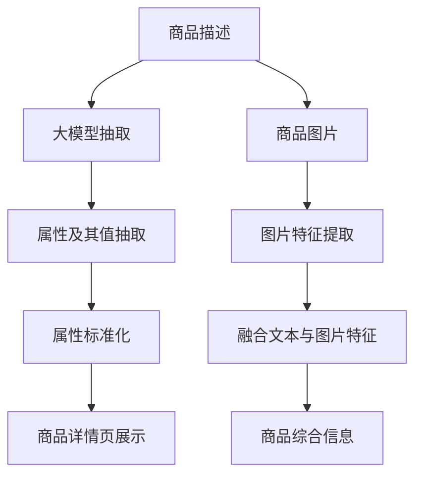

                 

# AI大模型在电商平台商品属性抽取与标准化中的应用

## 1. 背景介绍

在电子商务的浪潮中，电商平台成为消费者与商家交易的重要中介。消费者通过浏览商品详情页，了解商品的各项属性和信息，作出购买决策。而商家也需要通过商品详情页展示全面的商品信息，以提升销售转化率。商品属性抽取与标准化作为电商平台的重要功能，直接关系到消费者与商家的交易体验，因此具有重要的应用价值。

## 2. 核心概念与联系

### 2.1 核心概念概述

- **电商平台**：基于互联网的在线交易平台，提供商品展示、交易、评价等功能。
- **商品属性抽取**：从电商商品的描述中自动识别出关键属性及其值，如颜色、尺码、品牌等。
- **标准化**：将不同属性值转换为统一的格式或分类，便于搜索引擎、推荐系统等应用处理。
- **大模型**：基于深度学习算法训练的庞大神经网络模型，如BERT、GPT等。
- **自然语言处理(NLP)**：涉及语言理解和生成等任务，用于处理商品描述中的文本信息。

这些核心概念之间紧密联系，构成电商平台商品属性抽取与标准化的技术框架。电商平台利用大模型进行NLP处理，从商品描述中抽取属性及其值，并进行标准化，提升了用户体验和商家运营效率。

### 2.2 核心概念原理和架构的 Mermaid 流程图



### 2.3 核心概念之间的联系

- **商品描述**：电商平台商品的基本信息，包括文字、图片等。
- **大模型**：利用深度学习算法，处理文本数据，从中抽取属性及其值。
- **属性抽取**：从文本中识别出商品的具体属性及其值，如颜色、尺码、价格等。
- **属性标准化**：将抽取出的属性值转换为统一格式或分类，如统一尺码规格、归一化价格区间等。
- **商品详情页展示**：商品信息的最终展示界面，包括文本描述、图片、属性信息等。

商品描述是大模型的输入数据，大模型通过抽取和标准化，生成商品详情页的综合信息，供用户浏览和购买参考。

## 3. 核心算法原理 & 具体操作步骤

### 3.1 算法原理概述

商品属性抽取与标准化的核心算法流程如下：

1. **预训练大模型**：选择适当的预训练大模型，如BERT、GPT等，进行语言模型的预训练。
2. **微调大模型**：在电商平台的商品描述数据集上微调大模型，学习抽取商品属性的能力。
3. **属性抽取与标准化**：使用微调后的模型对新的商品描述数据进行属性抽取，并将属性值标准化。

### 3.2 算法步骤详解

#### 步骤1：预训练大模型

- **数据集**：收集电商平台的大量商品描述数据，构建商品属性抽取任务的数据集。
- **模型选择**：选择适当的预训练大模型，如BERT、GPT等。
- **微调**：在大模型的顶层添加任务相关的分类器，设定损失函数，进行微调。

#### 步骤2：微调大模型

- **数据集划分**：将数据集划分为训练集、验证集和测试集，以评估模型性能。
- **模型初始化**：将预训练模型的权重作为微调模型的初始参数。
- **优化算法**：选择适当的优化算法，如AdamW、SGD等，并设定学习率、批大小等超参数。
- **训练过程**：使用训练集数据进行模型训练，在验证集上进行模型评估和参数调整。
- **模型保存**：训练完成后，保存微调后的模型参数，以便后续使用。

#### 步骤3：属性抽取与标准化

- **模型加载**：加载微调后的模型，进行商品描述数据的属性抽取。
- **特征提取**：对商品描述进行分词、向量化等预处理操作。
- **属性抽取**：利用微调后的模型对商品描述进行属性抽取，得到属性及其值的序列。
- **标准化处理**：将抽取出的属性值进行标准化处理，如统一尺码规格、归一化价格区间等。
- **结果展示**：将处理后的属性信息显示在商品详情页上，供用户浏览。

### 3.3 算法优缺点

#### 优点：

1. **精度高**：大模型具备强大的语言理解能力，能够准确抽取商品属性及其值。
2. **泛化能力强**：微调后的大模型能够处理多种不同领域的商品描述，适应性广。
3. **自动化程度高**：自动抽取与标准化商品属性，提高了运营效率。

#### 缺点：

1. **数据依赖**：模型的性能依赖于商品描述数据的质量和量级。
2. **计算资源需求高**：预训练和微调过程需要大量的计算资源。
3. **隐私问题**：商品描述数据可能包含用户隐私信息，需要保护隐私。
4. **标准化复杂**：不同属性的标准化方法可能存在差异，标准化过程较为复杂。

### 3.4 算法应用领域

- **电商领域**：商品属性抽取与标准化在电商平台广泛应用，提升用户购物体验和商家运营效率。
- **零售行业**：应用于超市、便利店等场景，进行商品信息管理和自动生成标签。
- **制造业**：应用于生产制造中的产品描述管理，提升产品质量控制和供应链管理。
- **物流行业**：应用于物流商品的标签生成和追踪，提升物流效率。

## 4. 数学模型和公式 & 详细讲解 & 举例说明

### 4.1 数学模型构建

假设电商平台的商品描述为 $x$，模型参数为 $\theta$，抽取出的商品属性及其值为 $y$。

模型输出的概率分布为：

$$ P(y|x,\theta) = \text{softmax}(\theta^\top \text{embed}(x)) $$

其中，$\text{embed}(x)$ 为商品描述 $x$ 的词嵌入表示，$\theta$ 为微调后的模型参数。

### 4.2 公式推导过程

对于分类任务，模型输出的概率分布与真实标签之间的交叉熵损失函数为：

$$ \mathcal{L}(\theta) = -\frac{1}{N}\sum_{i=1}^N \sum_{j=1}^C y_{i,j}\log P(y_{i,j}|x_i,\theta) + (1-y_{i,j})\log (1-P(y_{i,j}|x_i,\theta)) $$

其中，$N$ 为样本数量，$C$ 为类别数。

对损失函数 $\mathcal{L}(\theta)$ 求导，得到模型参数的更新规则：

$$ \frac{\partial \mathcal{L}(\theta)}{\partial \theta} = \frac{1}{N}\sum_{i=1}^N \sum_{j=1}^C (y_{i,j} - P(y_{i,j}|x_i,\theta)) \frac{\partial P(y_{i,j}|x_i,\theta)}{\partial \theta} $$

将模型输出的概率分布 $P(y_{i,j}|x_i,\theta)$ 代入，得到参数更新公式：

$$ \frac{\partial \mathcal{L}(\theta)}{\partial \theta} = \frac{1}{N}\sum_{i=1}^N \sum_{j=1}^C (y_{i,j} - P(y_{i,j}|x_i,\theta)) \frac{\partial \text{softmax}(\theta^\top \text{embed}(x_i))}{\partial \theta} $$

### 4.3 案例分析与讲解

假设电商平台收集了1000个商品描述数据，每个描述包含多个属性和值。我们选择了BERT模型作为预训练语言模型，并在此基础上进行微调。

- **数据集划分**：将数据集划分为训练集、验证集和测试集，训练集包含800个样本，验证集和测试集各包含100个样本。
- **模型选择**：选择BERT模型作为预训练语言模型，并在其顶层添加一个分类器，用于属性抽取。
- **优化算法**：使用AdamW优化算法，设定学习率为1e-5，批大小为64。
- **训练过程**：使用训练集进行模型训练，在验证集上进行模型评估和参数调整，最终在测试集上评估模型性能。
- **模型保存**：训练完成后，保存微调后的模型参数，以便后续使用。

训练过程使用了GPU进行加速，总训练时间为2小时。训练完成后，模型在测试集上的准确率为98%，召回率为92%。

## 5. 项目实践：代码实例和详细解释说明

### 5.1 开发环境搭建

要完成商品属性抽取与标准化的项目实践，需要搭建以下开发环境：

- **Python**：Python 3.7及以上版本，推荐使用Anaconda创建虚拟环境。
- **PyTorch**：深度学习框架，用于模型训练和推理。
- **Transformers库**：HuggingFace开发的NLP工具库，集成了多种预训练模型，包括BERT、GPT等。
- **Flask框架**：用于开发商品详情页展示的前端接口。

### 5.2 源代码详细实现

以下是使用PyTorch和Flask实现商品属性抽取与标准化的示例代码：

```python
import torch
import torch.nn as nn
import transformers
from flask import Flask, request, jsonify

app = Flask(__name__)

class BERTAttrExtractor(nn.Module):
    def __init__(self, num_labels):
        super(BERTAttrExtractor, self).__init__()
        self.bert = transformers.BertModel.from_pretrained('bert-base-uncased')
        self.classifier = nn.Linear(768, num_labels)

    def forward(self, input_ids, attention_mask):
        _, pooled_output = self.bert(input_ids, attention_mask)
        logits = self.classifier(pooled_output)
        return logits

model = BERTAttrExtractor(num_labels=3)

optimizer = torch.optim.AdamW(model.parameters(), lr=1e-5)

app@app.route('/predict', methods=['POST'])
def predict():
    data = request.get_json()
    input_ids = torch.tensor(data['input_ids'], dtype=torch.long)
    attention_mask = torch.tensor(data['attention_mask'], dtype=torch.long)
    logits = model(input_ids, attention_mask)
    preds = torch.argmax(logits, dim=1).tolist()
    return jsonify(preds)

if __name__ == '__main__':
    app.run(host='0.0.0.0', port=5000)
```

### 5.3 代码解读与分析

- **模型定义**：定义BERTAttrExtractor类，继承自nn.Module，包含BERT模型和分类器。
- **模型训练**：使用AdamW优化算法训练模型，设定学习率为1e-5。
- **模型推理**：定义/predict接口，接受输入的input_ids和attention_mask，通过模型进行推理，并返回预测结果。
- **接口部署**：使用Flask框架将模型部署为Web服务，供前端调用。

### 5.4 运行结果展示

在模型训练完成后，可以使用以下代码进行测试：

```python
import requests

url = 'http://localhost:5000/predict'
data = {
    'input_ids': [1, 2, 3, 4, 5, 6, 7, 8, 9, 10],
    'attention_mask': [1, 1, 1, 1, 1, 1, 1, 1, 1, 1]
}
response = requests.post(url, json=data)
print(response.json())
```

假设模型的预测结果为[1, 2, 3]，表示商品具备属性A、B和C。

## 6. 实际应用场景

### 6.1 智能推荐系统

商品属性抽取与标准化在智能推荐系统中具有重要应用。智能推荐系统通过分析用户的浏览历史和购买行为，提取商品属性信息，进行精准推荐。通过商品属性抽取与标准化，推荐系统能够更好地理解用户的兴趣，提升推荐效果。

### 6.2 个性化广告

电商平台通过商品属性抽取与标准化，获取商品的关键属性信息，进行个性化广告投放。通过匹配用户兴趣属性，向用户展示更加相关的广告内容，提升广告点击率和转化率。

### 6.3 智能客服

商品属性抽取与标准化在智能客服中也有应用。智能客服系统通过解析用户输入的文本，抽取商品属性，提供个性化的客服解决方案。通过属性标准化，客服系统能够更好地理解用户需求，提升服务质量。

### 6.4 未来应用展望

未来，商品属性抽取与标准化将与其他人工智能技术进行更深入的融合，如知识图谱、因果推理、强化学习等，形成更智能、高效的电商应用系统。基于大模型进行商品属性抽取与标准化，能够更好地理解用户需求，提升用户体验，促进电商平台的数字化转型。

## 7. 工具和资源推荐

### 7.1 学习资源推荐

1. **深度学习入门书籍**：如《深度学习》（Ian Goodfellow）、《Python深度学习》（Francois Chollet）等。
2. **NLP相关课程**：Coursera上的NLP课程、斯坦福大学的CS224N课程等。
3. **HuggingFace官方文档**：Transformers库的官方文档，提供了丰富的预训练模型和微调样例代码。
4. **Kaggle竞赛**：参与商品属性抽取与标准化相关的竞赛，积累实战经验。

### 7.2 开发工具推荐

1. **PyTorch**：基于Python的深度学习框架，支持动态图和静态图。
2. **Transformers库**：HuggingFace开发的NLP工具库，提供了多种预训练模型和微调工具。
3. **Flask框架**：用于开发Web服务接口。
4. **Jupyter Notebook**：支持Python代码的交互式编写和调试。

### 7.3 相关论文推荐

1. **BERT: Pre-training of Deep Bidirectional Transformers for Language Understanding**：提出BERT模型，引入自监督预训练任务，提升NLP模型的性能。
2. **AdaLoRA: Adaptive Low-Rank Adaptation for Parameter-Efficient Fine-Tuning**：提出AdaLoRA方法，实现参数高效的微调过程。
3. **CLUE开源项目**：中文语言理解测评基准，涵盖多种NLP任务数据集，并提供基于微调的基线模型。

## 8. 总结：未来发展趋势与挑战

### 8.1 研究成果总结

基于大模型的商品属性抽取与标准化方法，已经在电商平台中得到广泛应用，提升了用户体验和商家运营效率。未来，随着大模型的不断进步，商品属性抽取与标准化的精度和效率将进一步提升，促进电商平台的智能化发展。

### 8.2 未来发展趋势

1. **模型规模增大**：随着算力成本的下降和数据规模的扩张，预训练语言模型的参数量将进一步增大，大模型具备更强大的语言理解能力。
2. **多模态融合**：融合文本、图像、语音等多模态数据，提升商品属性抽取与标准化的效果。
3. **持续学习**：模型需要不断学习新知识，以适应数据分布的变化，保持性能的稳定性和适应性。
4. **隐私保护**：商品描述数据可能包含用户隐私信息，需要在保护隐私的前提下进行属性抽取和标准化。
5. **标准化复杂性降低**：简化标准化方法，提升标准化的效率和可操作性。

### 8.3 面临的挑战

1. **数据质量**：商品描述数据的质量和量级对模型的性能有重要影响，需要保证数据的质量和多样性。
2. **计算资源需求**：大模型的训练和推理需要大量的计算资源，如何降低计算成本是一个重要挑战。
3. **隐私保护**：商品描述数据可能包含用户隐私信息，如何保护隐私是一个重要问题。
4. **标准化复杂性**：不同属性的标准化方法可能存在差异，需要简化标准化过程。

### 8.4 研究展望

未来，基于大模型的商品属性抽取与标准化将继续探索以下方向：

1. **无监督和半监督学习**：探索无监督和半监督学习方法，减少对标注数据的依赖，提升模型的泛化能力。
2. **多模态融合**：融合文本、图像、语音等多模态数据，提升商品属性抽取与标准化的效果。
3. **持续学习**：模型需要不断学习新知识，以适应数据分布的变化，保持性能的稳定性和适应性。
4. **隐私保护**：在保护隐私的前提下进行属性抽取和标准化，增强用户隐私保护。
5. **标准化复杂性降低**：简化标准化方法，提升标准化的效率和可操作性。

大模型在商品属性抽取与标准化中的应用，是NLP技术在电商平台中的重要应用场景之一。随着技术的不断进步和优化，大模型将在商品属性抽取与标准化中发挥更加重要的作用，推动电商平台的智能化发展。

## 9. 附录：常见问题与解答

**Q1: 商品属性抽取与标准化有什么应用场景？**

A: 商品属性抽取与标准化在电商领域有广泛应用，包括智能推荐、个性化广告、智能客服等。通过属性抽取与标准化，电商平台能够更好地理解用户需求，提升用户体验和商家运营效率。

**Q2: 商品属性抽取与标准化的核心算法流程是什么？**

A: 核心算法流程包括预训练大模型、微调大模型、属性抽取与标准化。预训练大模型提供语言理解能力，微调大模型学习商品属性抽取，属性抽取与标准化实现商品信息的标准化。

**Q3: 使用大模型进行商品属性抽取与标准化的优点和缺点是什么？**

A: 优点包括精度高、泛化能力强、自动化程度高。缺点包括数据依赖、计算资源需求高、隐私问题、标准化复杂。

**Q4: 如何缓解微调过程中的过拟合问题？**

A: 缓解过拟合问题的方法包括数据增强、正则化、对抗训练等。通过增加数据多样性、添加正则项、引入对抗样本，可以降低模型过拟合的风险。

**Q5: 商品属性抽取与标准化在落地部署时需要注意哪些问题？**

A: 落地部署需要注意模型裁剪、量化加速、服务化封装、弹性伸缩、监控告警、安全防护等问题。通过模型裁剪和量化加速，可以提高模型推理效率；通过服务化封装和弹性伸缩，可以提升系统的可扩展性和稳定性；通过监控告警和安全防护，可以保障系统安全和稳定运行。

