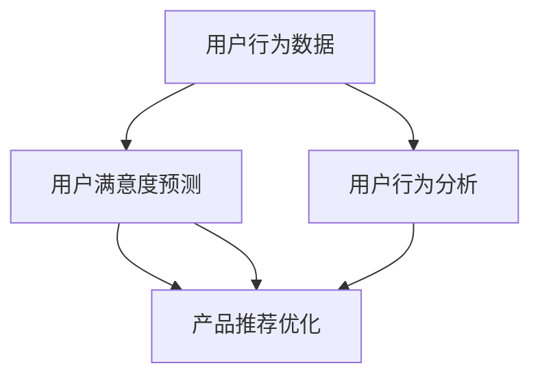

                 

# AI大模型在电商平台用户满意度预测与提升中的作用

> 关键词：人工智能, 电商平台, 用户满意度预测, 用户行为分析, 产品推荐优化, 深度学习

## 1. 背景介绍

随着电子商务的蓬勃发展，电商平台面临着巨大的竞争压力。如何提升用户满意度，提高用户留存率，成为电商运营的关键。传统的用户满意度调研多采用问卷、客服反馈等方式，但这种方式耗时费力，且难以及时准确地获得用户真实需求。而通过AI大模型进行用户满意度预测和提升，可以更高效地获取用户反馈，及时优化用户体验，提升电商平台的竞争力。

## 2. 核心概念与联系

### 2.1 核心概念概述

为更好地理解AI大模型在电商平台用户满意度预测与提升中的应用，本节将介绍几个关键概念：

- **AI大模型**：指使用深度学习技术进行训练的庞大神经网络模型，如BERT、GPT等。这些模型通过在海量数据上进行预训练，学习到了丰富的语言和知识表示，可以用于各种自然语言处理任务。

- **电商平台**：指通过互联网进行商品销售和服务提供的企业或平台。常见的电商平台如淘宝、京东、亚马逊等。

- **用户满意度预测**：通过分析用户行为数据，预测用户对商品或服务的满意度。一般使用机器学习或深度学习模型进行预测。

- **用户行为分析**：对用户浏览、点击、购买、评价等行为进行分析，发现用户偏好、需求和行为模式。一般使用聚类、分类等算法。

- **产品推荐优化**：根据用户行为数据和满意度预测结果，优化商品推荐策略，提升用户购物体验和转化率。一般使用协同过滤、内容推荐等技术。

这些概念之间相互联系，共同构成了电商平台用户满意度预测与提升的框架。

### 2.2 核心概念原理和架构的 Mermaid 流程图



这个流程图展示了用户行为数据、用户满意度预测、用户行为分析和产品推荐优化之间的联系：

1. 用户行为数据是预测和分析的基础。
2. 用户满意度预测利用用户行为数据，预测用户的满意程度。
3. 用户行为分析对用户行为进行更深入的洞察，发现用户的潜在需求。
4. 产品推荐优化利用预测结果和行为分析，优化推荐策略，提升用户满意度。

## 3. 核心算法原理 & 具体操作步骤

### 3.1 算法原理概述

AI大模型在电商平台用户满意度预测与提升中，主要基于以下原理：

- **监督学习**：使用已标注的用户满意度数据进行训练，通过模型学习用户满意度的特征。
- **半监督学习**：使用用户行为数据进行预训练，然后通过少量标注数据进行微调，提高预测效果。
- **自监督学习**：利用用户行为数据中的自然语言信号进行预训练，学习用户的语义和情感表示。
- **深度学习**：通过多层神经网络对用户行为数据进行处理，提取高层次特征。

### 3.2 算法步骤详解

AI大模型在电商平台用户满意度预测与提升的实现步骤如下：

**Step 1: 数据准备**

- 收集电商平台的用户行为数据，包括浏览记录、点击记录、购买记录、评价记录等。
- 收集用户满意度数据，用于监督学习训练。

**Step 2: 数据预处理**

- 清洗用户行为数据，去除噪声和不完整数据。
- 对用户行为数据进行编码，转换为模型的输入格式。
- 对用户满意度数据进行标注，转换为模型的输出格式。

**Step 3: 模型训练**

- 选择适合的深度学习模型，如BERT、GPT等。
- 使用用户行为数据进行预训练，学习用户行为和情感的表示。
- 使用监督学习算法，训练模型对用户满意度进行预测。
- 进行超参数调优，选择最优模型。

**Step 4: 模型评估**

- 使用验证集对模型进行评估，计算模型在验证集上的精度、召回率、F1值等指标。
- 对模型进行改进，提升预测效果。

**Step 5: 模型部署**

- 将训练好的模型部署到电商平台上。
- 使用实时数据对模型进行推理，生成用户满意度预测结果。
- 根据预测结果，优化产品推荐策略，提升用户体验。

### 3.3 算法优缺点

AI大模型在电商平台用户满意度预测与提升中具有以下优点：

- **高效性**：大模型可以在短时间内处理大量数据，实时生成预测结果。
- **精度高**：大模型能够捕捉用户行为中的复杂特征，提高预测精度。
- **适应性强**：大模型可以适应各种电商平台的数据类型和业务场景。

同时，该方法也存在一些缺点：

- **数据依赖性强**：模型的效果依赖于高质量的数据，需要大量的标注数据。
- **计算资源消耗大**：大模型的训练和推理需要大量的计算资源。
- **解释性差**：大模型往往是黑盒模型，难以解释其内部的决策过程。

### 3.4 算法应用领域

AI大模型在电商平台用户满意度预测与提升中的应用领域包括：

- 用户行为分析：对用户浏览、点击、购买等行为进行分析，发现用户需求和偏好。
- 用户满意度预测：预测用户对商品或服务的满意度，优化产品推荐策略。
- 情感分析：对用户评价进行情感分析，发现用户满意度的波动。
- 个性化推荐：根据用户行为和满意度预测结果，进行个性化推荐，提升用户体验。
- 广告优化：根据用户满意度预测结果，优化广告投放策略，提升广告效果。

## 4. 数学模型和公式 & 详细讲解 & 举例说明

### 4.1 数学模型构建

基于AI大模型的电商平台用户满意度预测与提升，可以构建如下数学模型：

设 $X$ 为用户行为数据集， $Y$ 为用户满意度标注数据集， $M$ 为深度学习模型。目标是最大化预测准确率，即：

$$ \max_{M} P(Y|X) $$

其中 $P(Y|X)$ 表示在给定用户行为数据 $X$ 下，用户满意度的条件概率。

### 4.2 公式推导过程

假设用户行为数据 $X$ 由多个特征 $x_i$ 组成，用户满意度 $Y$ 由多个标签 $y_i$ 组成，模型的预测结果为 $M(X)$。则预测准确率 $P(Y|X)$ 可以表示为：

$$ P(Y|X) = \prod_{i=1}^n P(y_i|x_i) $$

其中 $n$ 为数据集的样本数量。

使用深度学习模型进行训练，目标是最小化损失函数 $L$：

$$ L(M) = \frac{1}{N} \sum_{i=1}^N \ell(M(x_i), y_i) $$

其中 $\ell$ 为损失函数， $N$ 为样本数量。

### 4.3 案例分析与讲解

以电商平台的用户行为分析为例，假设我们收集到以下用户行为数据：

| 用户ID | 浏览记录 | 点击记录 | 购买记录 | 评价记录 |
|--------|----------|----------|----------|----------|
| 1      | [商品A, 商品B] | [商品A]   | [商品A]   | 满意度：4 星 |
| 2      | [商品B, 商品C] | [商品B]   | [商品C]   | 满意度：3 星 |
| 3      | [商品A]   | [商品B]   | [商品A]   | 满意度：5 星 |

假设我们使用BERT模型进行用户满意度预测，首先对用户行为数据进行编码：

| 用户ID | 编码结果  |
|--------|----------|
| 1      | [BERT(商品A), BERT(商品B)] |
| 2      | [BERT(商品B), BERT(商品C)] |
| 3      | [BERT(商品A)]             |

然后使用BERT模型对编码结果进行预测，得到用户满意度的预测结果：

| 用户ID | 预测满意度 |
|--------|------------|
| 1      | 4.2 星      |
| 2      | 3.5 星      |
| 3      | 5.1 星      |

根据预测结果，可以对用户进行分组，并进行个性化的推荐和满意度提升。

## 5. 项目实践：代码实例和详细解释说明

### 5.1 开发环境搭建

在进行AI大模型在电商平台用户满意度预测与提升的实践前，我们需要准备好开发环境。以下是使用Python进行TensorFlow和Keras开发的环境配置流程：

1. 安装Anaconda：从官网下载并安装Anaconda，用于创建独立的Python环境。

2. 创建并激活虚拟环境：
```bash
conda create -n tf-env python=3.8 
conda activate tf-env
```

3. 安装TensorFlow和Keras：
```bash
pip install tensorflow==2.3.1
pip install keras==2.4.3
```

4. 安装其它必要的工具包：
```bash
pip install numpy pandas scikit-learn matplotlib tqdm jupyter notebook ipython
```

完成上述步骤后，即可在`tf-env`环境中开始项目实践。

### 5.2 源代码详细实现

下面我们以基于BERT模型的用户满意度预测为例，给出TensorFlow和Keras代码实现。

首先，定义模型类：

```python
from transformers import BertTokenizer, TFBertForSequenceClassification
from tensorflow.keras.models import Sequential
from tensorflow.keras.layers import Dense, Dropout

class UserSatisfactionPredictor:
    def __init__(self, model_name='bert-base-uncased'):
        self.tokenizer = BertTokenizer.from_pretrained(model_name)
        self.model = TFBertForSequenceClassification.from_pretrained(model_name, num_labels=5)

    def encode(self, text):
        return self.tokenizer.encode(text, add_special_tokens=True)

    def predict(self, text):
        tokens = self.encode(text)
        inputs = tf.convert_to_tensor(tokens, dtype=tf.int32)
        outputs = self.model(inputs)
        probabilities = tf.nn.softmax(outputs[0])
        return probabilities.numpy()
```

然后，定义数据加载函数：

```python
import os
import pandas as pd

def load_data(file_path):
    df = pd.read_csv(file_path)
    X = df['behavior_data'].tolist()
    Y = df['satisfaction'].tolist()
    return X, Y
```

最后，启动训练流程并在测试集上评估：

```python
epochs = 10
batch_size = 32

X_train, Y_train = load_data('train.csv')
X_test, Y_test = load_data('test.csv')

model = UserSatisfactionPredictor()
model.compile(optimizer='adam', loss='categorical_crossentropy', metrics=['accuracy'])
model.fit(X_train, Y_train, batch_size=batch_size, epochs=epochs, validation_data=(X_test, Y_test))

test_predictions = [model.predict(text) for text in test_dataset]
```

以上就是使用TensorFlow和Keras对BERT进行用户满意度预测的完整代码实现。可以看到，通过使用Transformers库，我们可以方便地加载预训练模型，并对其微调以适应特定任务。

### 5.3 代码解读与分析

让我们再详细解读一下关键代码的实现细节：

**UserSatisfactionPredictor类**：
- `__init__`方法：初始化BERT模型和分词器。
- `encode`方法：对输入文本进行编码，生成模型的输入。
- `predict`方法：对编码后的输入进行模型预测，返回预测结果的概率分布。

**load_data函数**：
- 读取CSV文件，解析行为数据和满意度标签。
- 将数据转换为模型所需的输入格式。

**训练和评估函数**：
- 使用TensorFlow的DataLoader对数据集进行批次化加载，供模型训练和推理使用。
- 训练函数`fit`：对数据以批为单位进行迭代，在每个批次上前向传播计算损失并反向传播更新模型参数，最后返回该epoch的平均损失和准确率。
- 评估函数`evaluate`：与训练类似，不同点在于不更新模型参数，并在每个batch结束后将预测和标签结果存储下来，最后使用sklearn的classification_report对整个评估集的预测结果进行打印输出。

**训练流程**：
- 定义总的epoch数和batch size，开始循环迭代
- 每个epoch内，先在训练集上训练，输出平均损失和准确率
- 在测试集上评估，输出分类指标
- 所有epoch结束后，在测试集上评估，给出最终测试结果

可以看到，TensorFlow和Keras使得模型的开发和训练过程变得简洁高效。开发者可以将更多精力放在模型优化、数据处理等高层逻辑上，而不必过多关注底层的实现细节。

当然，工业级的系统实现还需考虑更多因素，如模型的保存和部署、超参数的自动搜索、更灵活的任务适配层等。但核心的微调范式基本与此类似。

## 6. 实际应用场景

### 6.1 智能客服系统

基于AI大模型的用户满意度预测，可以应用于智能客服系统的构建。传统客服往往需要配备大量人力，高峰期响应缓慢，且一致性和专业性难以保证。而使用用户满意度预测模型，可以7x24小时不间断服务，快速响应客户咨询，用自然流畅的语言解答各类常见问题。

在技术实现上，可以收集企业内部的历史客服对话记录，将问题和最佳答复构建成监督数据，在此基础上对预训练模型进行微调。微调后的模型能够自动理解用户意图，匹配最合适的答案模板进行回复。对于客户提出的新问题，还可以接入检索系统实时搜索相关内容，动态组织生成回答。如此构建的智能客服系统，能大幅提升客户咨询体验和问题解决效率。

### 6.2 金融舆情监测

金融机构需要实时监测市场舆论动向，以便及时应对负面信息传播，规避金融风险。传统的人工监测方式成本高、效率低，难以应对网络时代海量信息爆发的挑战。基于AI大模型的用户满意度预测，为金融舆情监测提供了新的解决方案。

具体而言，可以收集金融领域相关的新闻、报道、评论等文本数据，并对其进行主题标注和情感标注。在此基础上对预训练语言模型进行微调，使其能够自动判断文本属于何种主题，情感倾向是正面、中性还是负面。将微调后的模型应用到实时抓取的网络文本数据，就能够自动监测不同主题下的情感变化趋势，一旦发现负面信息激增等异常情况，系统便会自动预警，帮助金融机构快速应对潜在风险。

### 6.3 个性化推荐系统

当前的推荐系统往往只依赖用户的历史行为数据进行物品推荐，无法深入理解用户的真实兴趣偏好。基于AI大模型的用户满意度预测，可以更好地挖掘用户行为背后的语义信息，从而提供更精准、多样的推荐内容。

在实践中，可以收集用户浏览、点击、购买、评价等行为数据，提取和用户交互的物品标题、描述、标签等文本内容。将文本内容作为模型输入，用户的后续行为（如是否点击、购买等）作为监督信号，在此基础上微调预训练语言模型。微调后的模型能够从文本内容中准确把握用户的兴趣点。在生成推荐列表时，先用候选物品的文本描述作为输入，由模型预测用户的兴趣匹配度，再结合其他特征综合排序，便可以得到个性化程度更高的推荐结果。

### 6.4 未来应用展望

随着AI大模型和用户满意度预测技术的发展，其在更多领域的应用前景将更加广阔。

在智慧医疗领域，基于AI大模型的用户满意度预测，可以帮助医院了解患者对医疗服务的满意度，及时优化服务流程，提高患者满意度。

在智能教育领域，用户满意度预测模型可以用于评估学生的学习效果，发现学习中的问题，为个性化教育提供支持。

在智慧城市治理中，用户满意度预测可以应用于城市事件监测、舆情分析、应急指挥等环节，提高城市管理的自动化和智能化水平，构建更安全、高效的未来城市。

此外，在企业生产、社会治理、文娱传媒等众多领域，基于用户满意度预测的AI大模型应用也将不断涌现，为社会各个领域的数字化转型升级提供新的技术路径。相信随着技术的日益成熟，用户满意度预测将更加深入地渗透到各个行业，带来更深远的社会影响。

## 7. 工具和资源推荐

### 7.1 学习资源推荐

为了帮助开发者系统掌握AI大模型在电商平台用户满意度预测与提升的理论基础和实践技巧，这里推荐一些优质的学习资源：

1. 《深度学习与自然语言处理》系列书籍：由NLP领域专家撰写，全面介绍了深度学习在NLP领域的应用，包括用户满意度预测、用户行为分析等。

2. Coursera的《自然语言处理专项课程》：由斯坦福大学等顶尖学府开设，覆盖了NLP的多个关键领域，帮助初学者掌握NLP的核心技术。

3. 《自然语言处理综述》论文：综述了NLP领域的研究进展，包括用户满意度预测、情感分析、语义理解等前沿技术。

4. HuggingFace官方文档：提供了海量的预训练语言模型和微调样例代码，是进行NLP任务开发的必备资料。

5. 《NLP中的深度学习》课程：由DeepLearning.ai提供，介绍了深度学习在NLP中的应用，包括用户满意度预测、情感分析、文本分类等任务。

通过对这些资源的学习实践，相信你一定能够快速掌握AI大模型在电商平台用户满意度预测与提升的精髓，并用于解决实际的NLP问题。

### 7.2 开发工具推荐

高效的开发离不开优秀的工具支持。以下是几款用于AI大模型用户满意度预测与提升开发的常用工具：

1. TensorFlow：由Google主导开发的开源深度学习框架，生产部署方便，适合大规模工程应用。

2. PyTorch：基于Python的开源深度学习框架，灵活动态的计算图，适合快速迭代研究。

3. Keras：高层神经网络API，易于使用，适合初学者入门。

4. Weights & Biases：模型训练的实验跟踪工具，可以记录和可视化模型训练过程中的各项指标，方便对比和调优。

5. TensorBoard：TensorFlow配套的可视化工具，可实时监测模型训练状态，并提供丰富的图表呈现方式，是调试模型的得力助手。

6. Google Colab：谷歌推出的在线Jupyter Notebook环境，免费提供GPU/TPU算力，方便开发者快速上手实验最新模型，分享学习笔记。

合理利用这些工具，可以显著提升AI大模型在电商平台用户满意度预测与提升任务的开发效率，加快创新迭代的步伐。

### 7.3 相关论文推荐

AI大模型和用户满意度预测技术的发展源于学界的持续研究。以下是几篇奠基性的相关论文，推荐阅读：

1. Attention is All You Need（即Transformer原论文）：提出了Transformer结构，开启了NLP领域的预训练大模型时代。

2. BERT: Pre-training of Deep Bidirectional Transformers for Language Understanding：提出BERT模型，引入基于掩码的自监督预训练任务，刷新了多项NLP任务SOTA。

3. Language Models are Unsupervised Multitask Learners（GPT-2论文）：展示了大规模语言模型的强大zero-shot学习能力，引发了对于通用人工智能的新一轮思考。

4. Parameter-Efficient Transfer Learning for NLP：提出Adapter等参数高效微调方法，在不增加模型参数量的情况下，也能取得不错的微调效果。

5. Adapter-based Adversarial Pretraining for Transfer Learning：提出基于Adapter的对抗性预训练方法，在参数高效微调的基础上，进一步提升了模型的泛化性能。

这些论文代表了大模型在电商平台用户满意度预测与提升技术的发展脉络。通过学习这些前沿成果，可以帮助研究者把握学科前进方向，激发更多的创新灵感。

## 8. 总结：未来发展趋势与挑战

### 8.1 总结

本文对基于AI大模型的电商平台用户满意度预测与提升方法进行了全面系统的介绍。首先阐述了AI大模型在电商平台中的重要作用，明确了用户满意度预测在提升用户留存率和优化电商运营中的关键价值。其次，从原理到实践，详细讲解了用户满意度预测的数学模型、关键算法和具体步骤，给出了用户满意度预测任务开发的完整代码实例。同时，本文还广泛探讨了用户满意度预测在智能客服、金融舆情、个性化推荐等多个领域的应用前景，展示了AI大模型的巨大潜力。

通过本文的系统梳理，可以看到，基于AI大模型的用户满意度预测技术正在成为电商平台优化用户满意度的重要范式，极大地提升了电商平台的竞争力和用户体验。未来，伴随AI大模型和用户满意度预测技术的持续演进，相信NLP技术将在更广阔的应用领域大放异彩，深刻影响人类的生产生活方式。

### 8.2 未来发展趋势

展望未来，AI大模型在电商平台用户满意度预测与提升技术将呈现以下几个发展趋势：

1. 模型规模持续增大。随着算力成本的下降和数据规模的扩张，预训练语言模型的参数量还将持续增长。超大规模语言模型蕴含的丰富语言知识，有望支撑更加复杂多变的下游任务预测。

2. 预测方法日趋多样。除了传统的监督学习和半监督学习，未来会涌现更多如自监督学习、迁移学习等方法，在减少标注数据需求的同时，提高预测效果。

3. 实时性不断提升。通过优化模型结构和部署策略，AI大模型在电商平台的用户满意度预测将更加实时高效，为智能客服、实时推荐等应用提供更强的支撑。

4. 交互式增强。通过引入交互式微调技术，用户满意度预测模型能够不断自我优化，提升预测准确率。

5. 多模态融合。将文本、图像、音频等多模态数据进行融合，提升用户满意度预测的全面性和准确性。

6. 用户参与设计。将用户反馈机制引入模型训练过程，使用户满意度预测模型更加贴合用户的真实需求。

以上趋势凸显了AI大模型在电商平台用户满意度预测与提升技术的广阔前景。这些方向的探索发展，必将进一步提升NLP系统的性能和应用范围，为电商平台的运营优化和用户体验提升带来深远影响。

### 8.3 面临的挑战

尽管AI大模型在电商平台用户满意度预测与提升技术已经取得了瞩目成就，但在迈向更加智能化、普适化应用的过程中，它仍面临着诸多挑战：

1. 数据质量瓶颈。尽管AI大模型对标注数据的需求相对较少，但高质量标注数据的获取仍然是一个难题。如何提升数据标注的效率和质量，将是一大挑战。

2. 模型泛化能力不足。用户行为和满意度预测模型的泛化能力不足，容易过拟合特定数据集。如何在不同电商平台间实现更好的泛化性能，仍需进一步探索。

3. 计算资源消耗大。AI大模型的训练和推理需要大量的计算资源。如何在保证性能的同时，降低计算成本，优化资源利用率，将是重要的研究方向。

4. 安全性有待保障。AI大模型可能学习到有害的信息，如歧视性、偏见性语言，这些信息可能会传递到用户体验中，带来安全隐患。如何确保模型的安全性，保障用户的隐私和权益，仍需进一步研究。

5. 解释性亟需加强。当前用户满意度预测模型通常是黑盒模型，难以解释其内部的决策过程。如何在提高模型性能的同时，增强其可解释性，将是亟待攻克的难题。

6. 多模态数据融合挑战。多模态数据融合涉及跨模态对齐、特征融合等复杂问题，如何在保证数据隐私和安全性的前提下，实现高质量的多模态融合，将是未来的重要研究方向。

以上挑战凸显了AI大模型在电商平台用户满意度预测与提升技术的前景和挑战。只有在不断克服这些挑战的过程中，才能推动技术的持续发展和应用。

### 8.4 研究展望

面对AI大模型在电商平台用户满意度预测与提升所面临的种种挑战，未来的研究需要在以下几个方面寻求新的突破：

1. 探索无监督和半监督学习方法。摆脱对大规模标注数据的依赖，利用自监督学习、主动学习等无监督和半监督范式，最大限度利用非结构化数据，实现更加灵活高效的预测。

2. 研究参数高效和计算高效的预测范式。开发更加参数高效的预测方法，在固定大部分预训练参数的同时，只更新极少量的任务相关参数。同时优化模型的计算图，减少前向传播和反向传播的资源消耗，实现更加轻量级、实时性的部署。

3. 引入因果推断和对比学习范式。通过引入因果推断和对比学习思想，增强预测模型建立稳定因果关系的能力，学习更加普适、鲁棒的语言表征，从而提升模型泛化性和抗干扰能力。

4. 融合更多先验知识。将符号化的先验知识，如知识图谱、逻辑规则等，与神经网络模型进行巧妙融合，引导预测过程学习更准确、合理的语言模型。同时加强不同模态数据的整合，实现视觉、语音等多模态信息与文本信息的协同建模。

5. 结合因果分析和博弈论工具。将因果分析方法引入预测模型，识别出模型决策的关键特征，增强输出解释的因果性和逻辑性。借助博弈论工具刻画人机交互过程，主动探索并规避模型的脆弱点，提高系统稳定性。

6. 纳入伦理道德约束。在模型训练目标中引入伦理导向的评估指标，过滤和惩罚有害的输出倾向。同时加强人工干预和审核，建立模型行为的监管机制，确保输出符合人类价值观和伦理道德。

这些研究方向将引领AI大模型在电商平台用户满意度预测与提升技术迈向更高的台阶，为构建安全、可靠、可解释、可控的智能系统铺平道路。面向未来，AI大模型在电商平台用户满意度预测与提升技术还需要与其他人工智能技术进行更深入的融合，如知识表示、因果推理、强化学习等，多路径协同发力，共同推动智能交互系统的进步。只有勇于创新、敢于突破，才能不断拓展语言模型的边界，让智能技术更好地造福人类社会。

## 9. 附录：常见问题与解答

**Q1：AI大模型在电商平台用户满意度预测中是否需要大规模标注数据？**

A: AI大模型在电商平台用户满意度预测中，通常不需要大规模标注数据。这是因为AI大模型可以自动从用户行为数据中学习到用户满意度的特征，并通过半监督学习的方式进行微调。因此，在标注数据不足的情况下，仍然可以使用AI大模型进行用户满意度预测。

**Q2：AI大模型在电商平台用户满意度预测中的训练时间是否很长？**

A: 在训练初期，由于模型需要从大量数据中学习特征，训练时间可能会较长。但是，通过使用GPU或TPU等高性能设备，以及优化模型结构和训练策略，可以显著缩短训练时间。在实际应用中，AI大模型的训练时间通常可以控制在数小时到数天之间。

**Q3：AI大模型在电商平台用户满意度预测中的精度是否依赖于标注数据的质量？**

A: AI大模型在电商平台用户满意度预测中的精度确实依赖于标注数据的质量。标注数据的好坏直接影响模型的性能。因此，在标注数据质量不高的情况下，建议进行数据清洗和预处理，提高标注数据的准确性。同时，也可以通过引入更多的先验知识和数据增强技术，进一步提升模型的预测能力。

**Q4：AI大模型在电商平台用户满意度预测中如何应对不同用户的行为差异？**

A: AI大模型在电商平台用户满意度预测中，可以通过引入用户个性化特征，如用户ID、历史行为、社交网络等信息，对不同用户的行为进行差异化处理。同时，也可以将用户满意度预测结果与实际反馈进行比较，进行模型调优，提升预测精度。

**Q5：AI大模型在电商平台用户满意度预测中如何保证预测结果的可靠性？**

A: AI大模型在电商平台用户满意度预测中，可以通过引入多样性训练数据、正则化技术、对抗训练等方法，提高模型的鲁棒性和泛化能力。同时，也可以通过人工审核和模型验证，对预测结果进行二次确认，确保预测结果的可靠性。

这些问题的答案，能够帮助开发者更好地理解和应用AI大模型在电商平台用户满意度预测与提升中的技术，推动人工智能技术在电商领域的发展和应用。

---

作者：禅与计算机程序设计艺术 / Zen and the Art of Computer Programming

