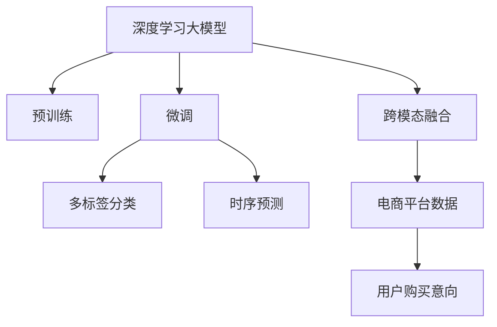

                 

## 1. 背景介绍

### 1.1 问题由来

电商平台作为数字化时代的“新零售”典型代表，其用户行为预测、个性化推荐、库存管理等核心功能依赖于大量用户数据。然而，如何高效、准确地从海量的用户数据中提取用户购买意向，是电商平台面临的巨大挑战。传统的机器学习模型在用户行为预测上表现有限，而近年来兴起的深度学习大模型，特别是预训练语言模型，为电商平台用户购买意向识别提供了新的解决方案。

### 1.2 问题核心关键点

电商平台用户购买意向识别的大模型应用，主要涉及以下几个关键点：

1. **数据源**：电商平台的原始数据包括用户浏览记录、点击行为、搜索查询、购物车添加、评论、支付记录等。这些数据对大模型的预训练和微调至关重要。

2. **预训练模型**：通常采用大规模自监督学习任务预训练语言模型，如BERT、GPT等。预训练模型学习通用语言表示，提升模型对自然语言的理解和生成能力。

3. **微调策略**：根据电商平台用户行为的特殊性，进行有针对性的微调，如多标签分类、时序预测等。

4. **模型评估与部署**：通过验证集和测试集的评估，优化模型参数，最终部署到电商平台的实时系统中。

5. **隐私与合规**：在利用用户数据进行模型训练和预测时，需遵循数据隐私保护法规，确保用户数据安全。

### 1.3 问题研究意义

电商平台用户购买意向识别的成功，不仅能显著提升用户购物体验，还能帮助电商平台实现个性化推荐、库存管理和营销决策，从而提升销售效率和用户满意度。通过深度学习大模型的应用，可以使得电商平台的运营更加智能化、精准化，为实现新零售目标提供技术支撑。

## 2. 核心概念与联系

### 2.1 核心概念概述

为更好地理解AI大模型在电商平台用户购买意向识别中的应用，本节将介绍几个密切相关的核心概念：

- **深度学习大模型**：指通过大规模数据集进行预训练的神经网络模型，如BERT、GPT等。这些模型在自然语言理解、生成等方面具有强大的能力。
- **预训练**：指在大规模无标签数据上训练模型，学习通用的语言表示。常用的预训练任务包括掩码语言模型、下一句预测等。
- **微调**：指在大模型基础上，利用电商平台用户行为数据进行有监督学习，优化模型特定任务的表现。
- **多标签分类**：电商平台用户购买意向识别通常涉及多个意图，如浏览、购买、收藏等，因此需要多标签分类模型来处理。
- **时序预测**：电商平台用户的购买行为通常具有时序特性，因此需要使用时序预测模型来捕捉这种动态变化。
- **跨模态融合**：电商平台用户数据不仅包含文本信息，还包含图片、视频等模态信息，因此需要跨模态融合模型，综合多模态信息进行购买意向预测。

这些核心概念之间的逻辑关系可以通过以下Mermaid流程图来展示：



这个流程图展示了深度学习大模型在电商平台用户购买意向识别中的关键步骤和组件：

1. 深度学习大模型通过预训练学习通用语言表示。
2. 利用电商平台用户行为数据进行微调，优化特定任务表现。
3. 多标签分类模型用于处理多个用户意图。
4. 时序预测模型用于捕捉用户行为的时序特性。
5. 跨模态融合模型用于综合多模态信息，提升预测准确性。

## 3. 核心算法原理 & 具体操作步骤
### 3.1 算法原理概述

AI大模型在电商平台用户购买意向识别的过程中，主要涉及以下核心算法原理：

1. **预训练模型选择**：选择适合电商领域的大模型，如BERT、GPT等，并对其进行微调。
2. **数据预处理**：将电商平台的用户行为数据进行清洗、编码、标准化等预处理操作，以便模型能够处理。
3. **多标签分类模型构建**：构建多标签分类模型，用于预测用户的多种购买意向。
4. **时序预测模型构建**：构建时序预测模型，用于预测用户的未来购买行为。
5. **跨模态融合模型构建**：构建跨模态融合模型，综合文本、图片、视频等多模态数据进行购买意向预测。
6. **模型微调与优化**：利用电商平台用户行为数据进行模型微调，通过梯度下降等优化算法不断调整模型参数，提高模型性能。

### 3.2 算法步骤详解

以下是基于AI大模型在电商平台用户购买意向识别中的具体算法步骤：

**Step 1: 准备预训练模型和数据集**

1. **预训练模型选择**：根据电商平台的需求，选择合适的预训练模型，如BERT、GPT等。
2. **数据集划分**：将电商平台的用户行为数据划分为训练集、验证集和测试集，一般训练集占80%，验证集和测试集各占10%。
3. **数据预处理**：对用户行为数据进行清洗、编码、标准化等预处理操作，以便模型能够处理。

**Step 2: 构建多标签分类模型**

1. **模型定义**：定义多标签分类模型，如BERT+CRF模型、Transformer模型等。
2. **特征提取**：将预处理后的用户行为数据输入模型，提取特征。
3. **损失函数**：定义多标签分类的损失函数，如Focal Loss、IoU Loss等。
4. **模型训练**：在训练集上训练模型，使用验证集进行参数调优。

**Step 3: 构建时序预测模型**

1. **模型定义**：定义时序预测模型，如LSTM、GRU、RNN等。
2. **特征提取**：将预处理后的用户行为数据按时间顺序排列，提取时序特征。
3. **损失函数**：定义时序预测的损失函数，如MAE、RMSE等。
4. **模型训练**：在训练集上训练模型，使用验证集进行参数调优。

**Step 4: 构建跨模态融合模型**

1. **模型定义**：定义跨模态融合模型，如CNN、ResNet、FusionNet等。
2. **特征提取**：将文本、图片、视频等多模态数据提取特征。
3. **融合算法**：定义多模态特征的融合算法，如注意力机制、深度融合等。
4. **模型训练**：在训练集上训练模型，使用验证集进行参数调优。

**Step 5: 模型微调与优化**

1. **微调策略**：选择合适的微调策略，如固定部分预训练参数、使用小学习率等。
2. **模型评估**：在验证集上评估模型性能，调整模型参数。
3. **测试集测试**：在测试集上测试模型性能，评估模型泛化能力。
4. **模型部署**：将训练好的模型部署到电商平台实时系统中，进行购买意向预测。

### 3.3 算法优缺点

AI大模型在电商平台用户购买意向识别中的算法具有以下优点：

1. **高效性**：利用大规模预训练模型，能够快速提高模型性能，适用于电商平台的实时系统。
2. **准确性**：深度学习大模型在自然语言理解方面具有天然优势，能够准确预测用户购买意向。
3. **可扩展性**：模型结构灵活，支持多标签分类、时序预测、跨模态融合等多种预测方式。

同时，这些算法也存在一些局限性：

1. **数据依赖**：需要大量的电商平台用户行为数据进行模型微调，数据收集和处理成本较高。
2. **过拟合风险**：电商用户行为数据通常规模较小，容易过拟合，需要合理设置正则化参数。
3. **模型复杂性**：大规模模型的训练和推理需要高性能硬件支持，模型复杂度较高。
4. **隐私问题**：在利用用户数据进行模型训练时，需注意数据隐私保护，确保用户数据安全。

### 3.4 算法应用领域

AI大模型在电商平台用户购买意向识别中的应用领域非常广泛，包括但不限于以下场景：

1. **个性化推荐**：根据用户浏览、点击、收藏、支付等行为，预测用户购买意向，进行个性化推荐。
2. **库存管理**：预测热门商品的需求量，帮助电商平台进行库存调整，避免缺货或过剩。
3. **用户流失预测**：识别可能流失的用户，提前进行挽留策略，提高用户留存率。
4. **营销决策**：基于用户购买意向，进行精准营销，提高广告投放效果。
5. **异常检测**：识别异常购买行为，防范欺诈和风险。

## 4. 数学模型和公式 & 详细讲解 & 举例说明

### 4.1 数学模型构建

假设电商平台的用户行为数据为 $D=\{(x_i,y_i)\}_{i=1}^N$，其中 $x_i$ 为输入特征，$y_i$ 为多标签购买意向。构建多标签分类模型的目标是最小化交叉熵损失函数：

$$
\mathcal{L}(\theta) = -\frac{1}{N}\sum_{i=1}^N \sum_{j=1}^M y_{ij}\log p_{ij} + (1-y_{ij})\log (1-p_{ij})
$$

其中 $M$ 为标签数量，$p_{ij}$ 为模型对样本 $x_i$ 的标签 $j$ 预测概率。

时序预测模型的目标是最小化均方误差损失函数：

$$
\mathcal{L}(\theta) = \frac{1}{N}\sum_{i=1}^N (y_i - \hat{y}_i)^2
$$

其中 $y_i$ 为真实标签，$\hat{y}_i$ 为模型预测值。

跨模态融合模型通常使用注意力机制将不同模态的特征融合在一起，然后送入多标签分类模型或时序预测模型进行预测。例如，使用Transformer模型进行跨模态融合时，注意力机制的定义为：

$$
a_{ij} = \text{softmax}(\frac{\mathbf{Q}_i\mathbf{K}_j^T}{\sqrt{d_k}})
$$

其中 $\mathbf{Q}$、$\mathbf{K}$ 为Transformer模型中的查询和关键向量，$d_k$ 为注意力机制的缩放因子。

### 4.2 公式推导过程

以多标签分类模型为例，使用交叉熵损失函数进行模型训练，损失函数对模型参数 $\theta$ 的梯度为：

$$
\frac{\partial \mathcal{L}(\theta)}{\partial \theta} = -\frac{1}{N}\sum_{i=1}^N \sum_{j=1}^M y_{ij}\frac{\partial \log p_{ij}}{\partial \theta}
$$

通过反向传播算法，可以计算模型参数的更新规则，具体为：

$$
\theta \leftarrow \theta - \eta \nabla_{\theta} \mathcal{L}(\theta)
$$

其中 $\eta$ 为学习率。

### 4.3 案例分析与讲解

以电商平台用户购买意向识别为例，说明多标签分类模型的具体实现过程。假设电商平台的用户行为数据为 $D=\{(x_i,y_i)\}_{i=1}^N$，其中 $x_i$ 为输入特征，$y_i$ 为多标签购买意向。构建多标签分类模型的具体步骤如下：

1. **数据预处理**：对用户行为数据进行清洗、编码、标准化等预处理操作。
2. **模型定义**：选择BERT作为预训练模型，并添加CRF层进行多标签分类。
3. **特征提取**：将预处理后的用户行为数据输入BERT模型，提取特征。
4. **损失函数**：定义多标签分类的损失函数为交叉熵损失函数。
5. **模型训练**：在训练集上训练模型，使用验证集进行参数调优。
6. **模型评估**：在验证集和测试集上评估模型性能，调整模型参数。

## 5. 项目实践：代码实例和详细解释说明

### 5.1 开发环境搭建

在进行电商平台用户购买意向识别的项目实践前，我们需要准备好开发环境。以下是使用Python进行PyTorch开发的环境配置流程：

1. 安装Anaconda：从官网下载并安装Anaconda，用于创建独立的Python环境。

2. 创建并激活虚拟环境：
```bash
conda create -n pytorch-env python=3.8 
conda activate pytorch-env
```

3. 安装PyTorch：根据CUDA版本，从官网获取对应的安装命令。例如：
```bash
conda install pytorch torchvision torchaudio cudatoolkit=11.1 -c pytorch -c conda-forge
```

4. 安装Transformer库：
```bash
pip install transformers
```

5. 安装各类工具包：
```bash
pip install numpy pandas scikit-learn matplotlib tqdm jupyter notebook ipython
```

完成上述步骤后，即可在`pytorch-env`环境中开始项目实践。

### 5.2 源代码详细实现

下面我们以电商平台用户购买意向识别为例，给出使用Transformers库进行多标签分类模型的PyTorch代码实现。

```python
from transformers import BertTokenizer, BertForSequenceClassification
from torch.utils.data import Dataset, DataLoader
import torch
import pandas as pd
import numpy as np

# 数据加载
train_df = pd.read_csv('train.csv')
val_df = pd.read_csv('val.csv')
test_df = pd.read_csv('test.csv')

# 数据预处理
tokenizer = BertTokenizer.from_pretrained('bert-base-cased')
def process_data(data):
    labels = data['label'].tolist()
    texts = data['text'].tolist()
    encoded_input = tokenizer(texts, truncation=True, padding='max_length', max_length=512, return_tensors='pt')
    input_ids = encoded_input['input_ids']
    attention_mask = encoded_input['attention_mask']
    return input_ids, attention_mask, labels

# 构建数据集
train_dataset = Dataset.from_tensor_slices((process_data(train_df), process_data(val_df), process_data(test_df)))
train_loader = DataLoader(train_dataset, batch_size=16, shuffle=True)
val_loader = DataLoader(train_dataset, batch_size=16, shuffle=False)
test_loader = DataLoader(train_dataset, batch_size=16, shuffle=False)

# 构建模型
model = BertForSequenceClassification.from_pretrained('bert-base-cased', num_labels=len(set(train_df['label'])))

# 模型训练
optimizer = AdamW(model.parameters(), lr=2e-5)
for epoch in range(5):
    model.train()
    loss = 0
    for batch in train_loader:
        input_ids, attention_mask, labels = batch
        optimizer.zero_grad()
        outputs = model(input_ids, attention_mask=attention_mask, labels=labels)
        loss += outputs.loss.item()
        loss.backward()
        optimizer.step()
    print(f'Epoch {epoch+1}, Loss: {loss/len(train_loader)}')

# 模型评估
model.eval()
with torch.no_grad():
    acc = 0
    for batch in val_loader:
        input_ids, attention_mask, labels = batch
        outputs = model(input_ids, attention_mask=attention_mask)
        preds = torch.argmax(outputs.logits, dim=1)
        acc += (preds == labels).sum().item() / len(labels)
    print(f'Validation Accuracy: {acc/len(val_loader)}')

# 模型测试
model.eval()
with torch.no_grad():
    acc = 0
    for batch in test_loader:
        input_ids, attention_mask, labels = batch
        outputs = model(input_ids, attention_mask=attention_mask)
        preds = torch.argmax(outputs.logits, dim=1)
        acc += (preds == labels).sum().item() / len(labels)
    print(f'Test Accuracy: {acc/len(test_loader)}')
```

### 5.3 代码解读与分析

让我们再详细解读一下关键代码的实现细节：

**数据处理函数**：
- `process_data`方法：将电商平台的用户行为数据进行清洗、编码、标准化等预处理操作，并返回模型所需的输入。

**数据集构建**：
- `Dataset.from_tensor_slices`：将处理后的数据转化为模型可以处理的张量形式。
- `DataLoader`：构建数据加载器，用于批量化加载数据。

**模型定义**：
- `BertForSequenceClassification`：定义多标签分类模型，支持多标签预测。
- `from_pretrained`：从预训练模型中加载模型权重。

**模型训练**：
- `AdamW`：定义优化器，使用AdamW算法优化模型参数。
- `for`循环：在每个epoch上进行模型训练。
- `optimizer.zero_grad()`：梯度清零。
- `outputs = model(input_ids, attention_mask=attention_mask, labels=labels)`：前向传播计算模型输出。
- `loss += outputs.loss.item()`：计算损失函数。
- `loss.backward()`：反向传播计算梯度。
- `optimizer.step()`：更新模型参数。

**模型评估**：
- `model.eval()`：模型评估模式。
- `with torch.no_grad()`：关闭梯度计算。
- `preds = torch.argmax(outputs.logits, dim=1)`：预测结果为多标签概率分布的最大值。
- `acc += (preds == labels).sum().item() / len(labels)`：计算准确率。

**模型测试**：
- `model.eval()`：模型测试模式。
- `with torch.no_grad()`：关闭梯度计算。
- `preds = torch.argmax(outputs.logits, dim=1)`：预测结果为多标签概率分布的最大值。
- `acc += (preds == labels).sum().item() / len(labels)`：计算准确率。

可以看出，使用PyTorch和Transformers库进行多标签分类模型的开发，代码实现相对简洁高效。开发者可以将更多精力放在数据处理、模型改进等高层逻辑上，而不必过多关注底层的实现细节。

## 6. 实际应用场景

### 6.1 智能客服系统

基于AI大模型的电商平台用户购买意向识别技术，可以广泛应用于智能客服系统的构建。智能客服系统通过分析用户的购买历史和行为数据，预测用户的购买意向，实时提供个性化的购物建议和推荐。例如，在用户浏览某商品时，智能客服系统可以自动推荐相关商品，提高用户购买转化率。

### 6.2 个性化推荐系统

电商平台利用用户购买意向识别技术，可以构建精准的个性化推荐系统。系统根据用户的历史购买记录、浏览行为等数据，预测用户的购买意向，推荐相应的商品，提升用户体验和满意度。例如，在用户浏览商品页面时，智能推荐系统可以动态展示相关商品，提高用户点击率和购买率。

### 6.3 营销决策系统

电商平台可以通过用户购买意向识别技术，进行精准的营销决策。系统根据用户的购买意向，设计相应的营销策略，提高广告投放效果。例如，系统可以根据用户的购买意向，推荐适合的广告内容，提升广告点击率和转化率。

### 6.4 未来应用展望

随着深度学习大模型和用户购买意向识别技术的发展，未来的应用场景将更加丰富：

1. **实时个性化推荐**：基于用户的实时行为数据，动态生成个性化推荐，提升用户体验。
2. **用户流失预测**：识别可能流失的用户，提前进行挽留策略，提高用户留存率。
3. **供应链优化**：预测热门商品的需求量，帮助电商平台进行库存调整，避免缺货或过剩。
4. **欺诈检测**：识别异常购买行为，防范欺诈和风险。

## 7. 工具和资源推荐

### 7.1 学习资源推荐

为了帮助开发者系统掌握电商平台用户购买意向识别的理论基础和实践技巧，这里推荐一些优质的学习资源：

1. 《深度学习大模型应用指南》系列博文：由深度学习领域专家撰写，系统介绍了大模型在电商领域的应用，涵盖多标签分类、时序预测、跨模态融合等多个主题。

2. CS224N《深度学习自然语言处理》课程：斯坦福大学开设的NLP明星课程，有Lecture视频和配套作业，帮助你深入理解深度学习大模型的原理和应用。

3. 《电商智能营销实战》书籍：介绍如何利用大模型进行电商智能营销，涵盖推荐系统、营销决策等多个领域，适合实战开发。

4. Weights & Biases：模型训练的实验跟踪工具，可以记录和可视化模型训练过程中的各项指标，方便对比和调优。

5. Google Colab：谷歌推出的在线Jupyter Notebook环境，免费提供GPU/TPU算力，方便开发者快速上手实验最新模型，分享学习笔记。

通过对这些资源的学习实践，相信你一定能够快速掌握电商平台用户购买意向识别的精髓，并用于解决实际的电商问题。

### 7.2 开发工具推荐

高效的开发离不开优秀的工具支持。以下是几款用于电商平台用户购买意向识别开发的常用工具：

1. PyTorch：基于Python的开源深度学习框架，灵活动态的计算图，适合快速迭代研究。

2. TensorFlow：由Google主导开发的开源深度学习框架，生产部署方便，适合大规模工程应用。

3. Transformers库：HuggingFace开发的NLP工具库，集成了众多SOTA语言模型，支持PyTorch和TensorFlow，是进行用户购买意向预测开发的利器。

4. Weights & Biases：模型训练的实验跟踪工具，可以记录和可视化模型训练过程中的各项指标，方便对比和调优。

5. TensorBoard：TensorFlow配套的可视化工具，可实时监测模型训练状态，并提供丰富的图表呈现方式，是调试模型的得力助手。

合理利用这些工具，可以显著提升电商平台用户购买意向识别任务的开发效率，加快创新迭代的步伐。

### 7.3 相关论文推荐

电商平台用户购买意向识别技术的发展，得益于学界的持续研究。以下是几篇奠基性的相关论文，推荐阅读：

1. Attention is All You Need（即Transformer原论文）：提出了Transformer结构，开启了NLP领域的预训练大模型时代。

2. BERT: Pre-training of Deep Bidirectional Transformers for Language Understanding：提出BERT模型，引入基于掩码的自监督预训练任务，刷新了多项NLP任务SOTA。

3. Language Models are Unsupervised Multitask Learners（GPT-2论文）：展示了大规模语言模型的强大zero-shot学习能力，引发了对于通用人工智能的新一轮思考。

4. Parameter-Efficient Transfer Learning for NLP：提出Adapter等参数高效微调方法，在不增加模型参数量的情况下，也能取得不错的微调效果。

5. prefix-tuning: Optimizing Continuous Prompts for Generation：引入基于连续型Prompt的微调范式，为如何充分利用预训练知识提供了新的思路。

这些论文代表了大模型在电商领域的发展脉络。通过学习这些前沿成果，可以帮助研究者把握学科前进方向，激发更多的创新灵感。

## 8. 总结：未来发展趋势与挑战

### 8.1 总结

本文对基于深度学习大模型在电商平台用户购买意向识别中的应用进行了全面系统的介绍。首先阐述了电商平台的原始数据特点和预训练模型的重要性，明确了用户购买意向识别在电商平台的广泛应用场景。其次，从原理到实践，详细讲解了多标签分类、时序预测、跨模态融合等核心算法的实现过程，给出了完整的代码实例。同时，本文还广泛探讨了用户购买意向识别技术在智能客服、个性化推荐、营销决策等实际场景中的应用，展示了该技术带来的显著效果。

通过本文的系统梳理，可以看到，基于深度学习大模型的电商平台用户购买意向识别技术，正在成为电商平台运营的重要手段，显著提升了电商平台的智能化水平。未来，伴随深度学习大模型的不断发展，该技术必将在更多电商场景中发挥重要作用，推动电商行业的数字化转型升级。

### 8.2 未来发展趋势

展望未来，深度学习大模型在电商平台用户购买意向识别领域的发展趋势如下：

1. **模型规模增大**：随着算力成本的下降和数据规模的扩张，深度学习大模型的参数量还将继续增加，提升模型对复杂电商场景的理解和预测能力。

2. **数据质量提升**：电商平台的原始数据质量将持续提升，数据标注和清洗技术也将不断进步，为模型训练提供更丰富、更精准的数据资源。

3. **跨模态融合深入**：电商平台的商品展示和推荐方式将更加多样化，跨模态融合技术将进一步深化，综合多模态数据提升用户购买意向预测的准确性。

4. **个性化推荐智能化**：基于用户购买意向的个性化推荐将更加智能，能够动态调整推荐策略，提供更加贴合用户需求的个性化购物建议。

5. **实时预测优化**：电商平台对实时预测的需求将更加强烈，深度学习大模型将优化推理速度，提升实时响应能力，满足电商平台的实时需求。

6. **隐私保护强化**：在利用用户数据进行模型训练和预测时，将更加重视用户隐私保护，采取数据脱敏、匿名化等技术手段，确保用户数据安全。

以上趋势凸显了深度学习大模型在电商平台用户购买意向识别领域的应用前景。这些方向的探索发展，必将进一步提升电商平台的运营效率和用户满意度，推动电商行业的智能化发展。

### 8.3 面临的挑战

尽管深度学习大模型在电商平台用户购买意向识别方面取得了显著进展，但在迈向更加智能化、普适化应用的过程中，仍然面临诸多挑战：

1. **数据隐私问题**：在利用用户数据进行模型训练和预测时，需注意数据隐私保护，确保用户数据安全。

2. **过拟合风险**：电商用户行为数据规模较小，容易过拟合，需要合理设置正则化参数，避免模型过拟合。

3. **实时性要求**：电商平台对实时预测的需求较高，深度学习大模型的推理速度需要进一步提升，以满足实时响应要求。

4. **模型复杂性**：大规模模型的训练和推理需要高性能硬件支持，模型复杂度较高，需要优化硬件资源配置。

5. **模型泛化能力**：电商用户行为数据分布具有多样性，模型泛化能力需要进一步提升，确保模型在新场景下的适应性。

6. **跨模态融合难度**：多模态数据的融合和表示仍具挑战，跨模态融合技术需要进一步发展。

正视这些挑战，积极应对并寻求突破，将是大模型在电商平台用户购买意向识别领域走向成熟的必由之路。相信随着学界和产业界的共同努力，这些挑战终将一一被克服，深度学习大模型必将在电商领域发挥更大作用，推动电商行业的数字化转型升级。

### 8.4 研究展望

面向未来，深度学习大模型在电商平台用户购买意向识别领域的研究展望如下：

1. **无监督与半监督学习**：探索无监督和半监督学习方法，降低对大规模标注数据的依赖，提高模型的泛化能力。

2. **参数高效微调**：开发更加参数高效的微调方法，在固定大部分预训练参数的情况下，只更新极少量的任务相关参数，提高模型训练效率。

3. **跨模态融合改进**：进一步提升跨模态融合技术，综合文本、图片、视频等多模态数据，提升用户购买意向预测的准确性。

4. **实时预测优化**：优化深度学习大模型的推理速度，提升实时响应能力，满足电商平台对实时预测的需求。

5. **隐私保护机制**：研究隐私保护技术，确保用户数据的安全，避免数据泄露和滥用。

这些研究方向的研究突破，将进一步推动深度学习大模型在电商平台用户购买意向识别领域的应用，带来更高效、更精准、更安全的电商智能服务。

## 9. 附录：常见问题与解答

**Q1：电商平台的原始数据包含哪些特征？**

A: 电商平台的原始数据通常包含以下特征：
1. 用户ID：记录用户的唯一标识。
2. 商品ID：记录商品的唯一标识。
3. 浏览时间：记录用户浏览商品的时间。
4. 浏览时长：记录用户浏览商品的时长。
5. 点击次数：记录用户点击商品的次数。
6. 收藏数量：记录用户收藏商品的数量。
7. 购买记录：记录用户的购买商品记录。

这些特征可以帮助电商平台构建深度学习大模型的输入，进行用户购买意向预测。

**Q2：电商平台的预训练模型有哪些？**

A: 电商平台的预训练模型通常包括以下几种：
1. BERT：使用大规模文本数据进行预训练，能够学习到丰富的语言表示。
2. GPT：使用大规模文本数据进行预训练，具有强大的语言生成能力。
3. Transformer：基于自注意力机制，能够捕捉长距离依赖关系。
4. LSTM：适用于时间序列数据的建模，能够处理时间依赖关系。

这些预训练模型在电商平台用户购买意向识别中都有广泛应用，可以根据具体需求进行选择。

**Q3：电商平台的微调策略有哪些？**

A: 电商平台的微调策略通常包括以下几种：
1. 多标签分类：用于预测用户的多重购买意向。
2. 时序预测：用于预测用户的未来购买行为。
3. 跨模态融合：用于综合文本、图片、视频等多模态数据进行购买意向预测。

这些微调策略可以根据电商平台的实际需求进行选择，以达到最佳效果。

**Q4：电商平台的模型评估方法有哪些？**

A: 电商平台的模型评估方法通常包括以下几种：
1. 交叉熵损失：用于多标签分类的模型评估。
2. 均方误差：用于时序预测的模型评估。
3. F1-score：用于多标签分类的模型评估。
4. AUC-ROC：用于时序预测的模型评估。

这些评估方法可以根据具体需求进行选择，以达到最佳评估效果。

**Q5：电商平台的推荐系统有哪些类型？**

A: 电商平台的推荐系统通常包括以下几种：
1. 基于内容的推荐系统：根据商品属性进行推荐。
2. 基于协同过滤的推荐系统：根据用户的历史行为进行推荐。
3. 基于深度学习的推荐系统：使用深度学习模型进行推荐，如用户购买意向识别技术。

这些推荐系统可以根据具体需求进行选择，以达到最佳推荐效果。

通过本文的系统梳理，可以看到，基于深度学习大模型在电商平台用户购买意向识别中的应用，正在成为电商平台运营的重要手段，显著提升了电商平台的智能化水平。未来，伴随深度学习大模型的不断发展，该技术必将在更多电商场景中发挥重要作用，推动电商行业的数字化转型升级。相信随着学界和产业界的共同努力，这些挑战终将一一被克服，深度学习大模型必将在电商领域发挥更大作用，推动电商行业的数字化转型升级。

