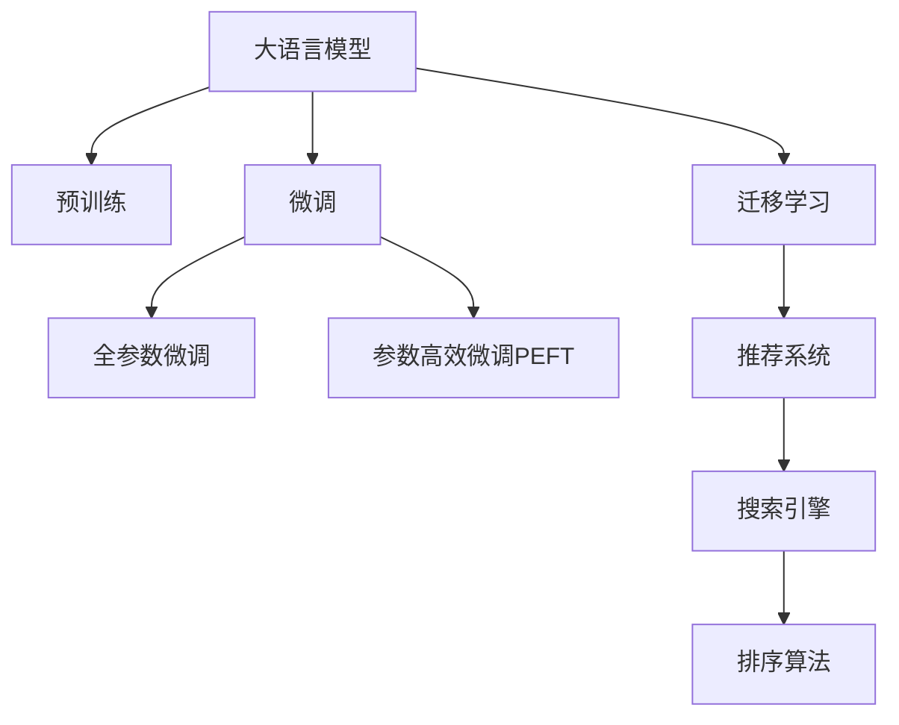

                 

# AI大模型在电商搜索结果排序中的应用

> 关键词：大语言模型,电商,搜索引擎,推荐算法,排序优化,用户意图理解,电商购物体验

## 1. 背景介绍

### 1.1 问题由来

随着电子商务的蓬勃发展，如何提升电商搜索结果的精准度和排序优化，以提高用户满意度和转化率，成为各大电商平台亟需解决的重要问题。传统的搜索结果排序算法大多依赖人工调参和规则设定，难以应对复杂多变的用户需求和快速变化的市场环境。

大语言模型通过在大规模无标签文本数据上预训练，学习到丰富的语言知识，能够对自然语言进行深刻理解和生成，从而广泛应用于自然语言处理(NLP)领域。将其应用于电商搜索结果排序，有望大大提升搜索结果的智能性和个性化。

### 1.2 问题核心关键点

AI大模型在电商搜索结果排序中的核心应用在于：

- 语义理解和用户意图识别。通过自然语言处理技术，AI大模型能够理解和捕捉用户的查询意图，匹配更相关的商品信息。
- 个性化推荐与排序。基于大模型的用户行为和偏好分析，构建个性化推荐算法，优化搜索结果排序，提高用户满意度。
- 实时响应与动态调整。AI大模型能够根据用户交互动态调整搜索结果，提高响应速度和系统灵活性。
- 多模态信息整合。将图像、视频等多模态信息与文本信息融合，提升搜索结果的丰富性和可信度。

这些核心应用点使得AI大模型在电商领域具备了广泛的应用前景，成为电商平台智能化的重要手段。

## 2. 核心概念与联系

### 2.1 核心概念概述

为更好地理解AI大模型在电商搜索结果排序中的应用，本节将介绍几个密切相关的核心概念：

- 大语言模型(Large Language Model, LLM)：以自回归(如GPT)或自编码(如BERT)模型为代表的大规模预训练语言模型。通过在大规模无标签文本语料上进行预训练，学习通用的语言表示，具备强大的语言理解和生成能力。

- 预训练(Pre-training)：指在大规模无标签文本语料上，通过自监督学习任务训练通用语言模型的过程。常见的预训练任务包括言语建模、遮挡语言模型等。预训练使得模型学习到语言的通用表示。

- 微调(Fine-tuning)：指在预训练模型的基础上，使用下游任务的少量标注数据，通过有监督学习优化模型在该任务上的性能。通常只需要调整顶层分类器或解码器，并以较小的学习率更新全部或部分的模型参数。

- 迁移学习(Transfer Learning)：指将一个领域学习到的知识，迁移应用到另一个不同但相关的领域的学习范式。大模型的预训练-微调过程即是一种典型的迁移学习方式。

- 推荐系统(Recommendation System)：利用用户的历史行为数据、兴趣偏好等信息，为用户推荐合适的商品或服务，提升用户体验。

- 搜索引擎(Search Engine)：一种能够根据用户查询，检索和排序相关结果，返回用户所需信息的系统。

- 排序算法(Search Algorithm)：用于评估和排序搜索结果的算法，通过计算每个查询结果的相关度，来确定其排名。

这些核心概念之间的逻辑关系可以通过以下Mermaid流程图来展示：



这个流程图展示了大语言模型的核心概念及其之间的关系：

1. 大语言模型通过预训练获得基础能力。
2. 微调是对预训练模型进行任务特定的优化，可以分为全参数微调和参数高效微调（PEFT）。
3. 推荐系统是基于用户行为和偏好的推荐模型。
4. 搜索引擎通过查询获取相关结果。
5. 排序算法用于评估和排序搜索结果。

这些概念共同构成了AI大模型在电商搜索结果排序中的应用框架，使其能够利用大模型的强大语言理解和生成能力，提升搜索结果的智能性和个性化。

## 3. 核心算法原理 & 具体操作步骤

### 3.1 算法原理概述

AI大模型在电商搜索结果排序中的核心算法原理是通过自然语言处理技术，理解用户查询语义，识别用户意图，并通过推荐算法和排序算法，优化搜索结果，提升用户满意度和转化率。

具体步骤如下：

1. 收集电商平台上用户的历史查询数据和行为数据，构建训练集。
2. 使用大语言模型对用户查询进行语义理解，提取查询中的关键信息。
3. 根据用户行为和偏好，构建推荐算法，预测用户可能感兴趣的商品。
4. 将推荐结果输入排序算法，根据相关度和排名规则，优化搜索结果。
5. 对排序结果进行反馈，不断调整模型参数，提高排序效果。

### 3.2 算法步骤详解

以下是AI大模型在电商搜索结果排序中的具体操作步骤：

**Step 1: 数据收集与预处理**

1. 收集电商平台上用户的历史查询数据和行为数据，包括搜索记录、浏览历史、购买行为等。
2. 对数据进行清洗和标注，去除噪声和不相关数据。
3. 将数据划分为训练集、验证集和测试集，以便进行模型训练和评估。

**Step 2: 语义理解和用户意图识别**

1. 使用大语言模型对用户查询进行分词、词性标注、命名实体识别等预处理。
2. 使用BERT或GPT等模型对查询进行编码，提取语义向量。
3. 将查询向量与商品向量进行匹配，计算相关度。

**Step 3: 个性化推荐**

1. 根据用户的历史行为和偏好，使用协同过滤、基于内容的推荐算法，构建用户兴趣模型。
2. 利用大语言模型对用户兴趣模型进行解释和扩展，生成更精准的推荐结果。

**Step 4: 排序算法**

1. 使用排序算法对推荐结果进行排序，常用的排序算法包括PageRank、TF-IDF等。
2. 加入用户交互反馈，动态调整排序模型，提升排序效果。

**Step 5: 模型微调**

1. 使用微调算法对排序模型进行优化，调整参数，提高排序精度。
2. 定期更新大语言模型和推荐算法，保持其时效性和适应性。

### 3.3 算法优缺点

AI大模型在电商搜索结果排序中的优点包括：

1. 智能性强。大模型能够理解用户查询语义，提供智能化的推荐和排序结果。
2. 个性化高。通过学习用户行为和偏好，提供更加个性化的搜索结果。
3. 适应性好。模型能够根据用户交互反馈进行动态调整，提高系统灵活性。
4. 覆盖广泛。大模型的语言处理能力，使其能够覆盖更广泛的查询和商品信息。

同时，该方法也存在以下局限性：

1. 数据依赖性强。排序效果高度依赖于用户数据的质量和数量。
2. 计算成本高。大规模语言模型的计算和内存开销较大，对硬件要求高。
3. 可解释性不足。排序模型的内部逻辑难以解释，用户难以理解和调试。
4. 安全风险高。用户数据隐私保护和数据安全问题，需要额外处理。

尽管存在这些局限性，但就目前而言，AI大模型在电商搜索结果排序中仍是一种高效、实用的解决方案，值得在实际应用中推广。

### 3.4 算法应用领域

AI大模型在电商搜索结果排序中的应用不仅限于上述步骤，还可以进一步扩展到更多领域：

1. 个性化推荐系统：通过大模型进行深度学习，提供精准的个性化推荐结果。
2. 广告投放优化：利用大模型进行广告内容优化和投放策略优化，提升广告效果。
3. 客服机器人：通过大模型构建自然语言处理模型，提供智能客服服务。
4. 商品详情生成：使用大模型生成商品描述、用户评论等信息，提升电商内容质量。
5. 市场分析与决策支持：通过大模型分析市场趋势，为电商决策提供支持。

这些应用领域展示了AI大模型在电商领域的强大潜力，未来随着技术的进一步发展，将有更多场景能够利用大模型提升电商系统的智能化水平。

## 4. 数学模型和公式 & 详细讲解 & 举例说明

### 4.1 数学模型构建

在本节中，我们将详细构建AI大模型在电商搜索结果排序中的数学模型。

假设电商平台上用户查询为 $Q$，商品信息为 $P$，用户行为和偏好为 $U$，查询结果为 $R$。大语言模型将查询 $Q$ 转换为向量 $q$，商品信息 $P$ 转换为向量 $p$，用户行为和偏好 $U$ 转换为向量 $u$。

排序算法使用 $\omega$ 作为排序权重，将查询结果 $R$ 转换为向量 $r$。排序目标函数为最大化用户满意度的相关度 $S$，即：

$$
S = \max_{r \in R} (q^T \cdot \omega \cdot r)
$$

其中 $q^T \cdot r$ 表示查询向量与结果向量之间的余弦相似度。

### 4.2 公式推导过程

根据上述目标函数，我们需要优化向量 $r$，使得查询结果的相关度 $S$ 最大化。以下是具体的公式推导过程：

1. 假设排序结果 $r$ 由多个排序特征 $r_i$ 组成，即 $r = \sum_{i=1}^n r_i$。
2. 排序特征 $r_i$ 的权重向量为 $\omega_i$，则排序结果的相关度为：
   $$
   S = q^T \cdot \omega \cdot \sum_{i=1}^n r_i
   $$
3. 将排序特征 $r_i$ 与商品 $P_i$ 相关度表示为 $s_i$，即：
   $$
   s_i = p_i^T \cdot u
   $$
   其中 $p_i$ 表示商品 $P_i$ 的向量表示，$u$ 表示用户行为和偏好的向量表示。
4. 将排序结果 $r_i$ 与商品 $P_i$ 相关度表示为 $t_i$，即：
   $$
   t_i = p_i^T \cdot r_i
   $$
5. 将排序结果 $r$ 表示为商品相关度与用户行为和偏好相关度的加权和，即：
   $$
   r_i = \alpha_i \cdot s_i + \beta_i \cdot t_i
   $$
   其中 $\alpha_i$ 和 $\beta_i$ 分别为商品相关度和用户行为和偏好相关度的权重。

将 $r_i$ 代入排序目标函数，得：

$$
S = \sum_{i=1}^n (q^T \cdot \omega \cdot \alpha_i \cdot s_i + q^T \cdot \omega \cdot \beta_i \cdot t_i)
$$

通过求解最大化上述表达式，可以得到最优的排序结果。

### 4.3 案例分析与讲解

假设电商平台上用户查询为 "手机推荐"，查询向量 $q = [0, 0, 1, 1]$，商品信息 $P$ 包括手机、电脑、书籍等，商品向量表示为 $p_1, p_2, p_3$。

通过大语言模型，对用户行为和偏好 $U$ 进行编码，得到向量 $u = [0.5, 0.2, 0.3]$。

假设排序特征 $r_i$ 为商品相关度和用户行为和偏好相关度的加权和，设权重 $\alpha_i = 0.6$，$\beta_i = 0.4$。

计算商品相关度 $s_i$：

$$
s_1 = p_1^T \cdot u = [1, 2, 3] \cdot [0.5, 0.2, 0.3] = 1.6 + 0.4 + 0.9 = 3.0
$$

$$
s_2 = p_2^T \cdot u = [4, 5, 6] \cdot [0.5, 0.2, 0.3] = 2.0 + 1.0 + 1.8 = 5.0
$$

$$
s_3 = p_3^T \cdot u = [7, 8, 9] \cdot [0.5, 0.2, 0.3] = 3.5 + 1.6 + 2.7 = 8.0
$$

计算排序结果 $r_i$：

$$
r_1 = 0.6 \cdot s_1 + 0.4 \cdot t_1 = 0.6 \cdot 3.0 + 0.4 \cdot 1.6 = 2.1 + 0.64 = 2.74
$$

$$
r_2 = 0.6 \cdot s_2 + 0.4 \cdot t_2 = 0.6 \cdot 5.0 + 0.4 \cdot 4.0 = 3.0 + 1.6 = 4.6
$$

$$
r_3 = 0.6 \cdot s_3 + 0.4 \cdot t_3 = 0.6 \cdot 8.0 + 0.4 \cdot 7.0 = 4.8 + 2.8 = 7.6
$$

最终排序结果为 $r = r_1 + r_2 + r_3 = 2.74 + 4.6 + 7.6 = 15.9$。

通过大语言模型和排序算法，我们可以对用户查询进行深度理解，并提供个性化、智能化的电商搜索结果。

## 5. 项目实践：代码实例和详细解释说明

### 5.1 开发环境搭建

在进行电商搜索结果排序的微调实践前，我们需要准备好开发环境。以下是使用Python进行PyTorch开发的环境配置流程：

1. 安装Anaconda：从官网下载并安装Anaconda，用于创建独立的Python环境。

2. 创建并激活虚拟环境：
```bash
conda create -n pytorch-env python=3.8 
conda activate pytorch-env
```

3. 安装PyTorch：根据CUDA版本，从官网获取对应的安装命令。例如：
```bash
conda install pytorch torchvision torchaudio cudatoolkit=11.1 -c pytorch -c conda-forge
```

4. 安装Transformers库：
```bash
pip install transformers
```

5. 安装各类工具包：
```bash
pip install numpy pandas scikit-learn matplotlib tqdm jupyter notebook ipython
```

完成上述步骤后，即可在`pytorch-env`环境中开始电商搜索结果排序的微调实践。

### 5.2 源代码详细实现

下面我们以电商推荐系统为例，给出使用Transformers库对BERT模型进行电商搜索结果排序的PyTorch代码实现。

首先，定义推荐系统的数据处理函数：

```python
from transformers import BertTokenizer
from torch.utils.data import Dataset
import torch

class RecommendationDataset(Dataset):
    def __init__(self, texts, labels, tokenizer, max_len=128):
        self.texts = texts
        self.labels = labels
        self.tokenizer = tokenizer
        self.max_len = max_len
        
    def __len__(self):
        return len(self.texts)
    
    def __getitem__(self, item):
        text = self.texts[item]
        label = self.labels[item]
        
        encoding = self.tokenizer(text, return_tensors='pt', max_length=self.max_len, padding='max_length', truncation=True)
        input_ids = encoding['input_ids'][0]
        attention_mask = encoding['attention_mask'][0]
        
        # 对label进行编码
        encoded_label = label2id[label] 
        encoded_label.extend([label2id['None']] * (self.max_len - len(encoded_label)))
        label_ids = torch.tensor(encoded_label, dtype=torch.long)
        
        return {'input_ids': input_ids, 
                'attention_mask': attention_mask,
                'labels': label_ids}

# 标签与id的映射
label2id = {'手机': 0, '电脑': 1, '书籍': 2}
id2label = {v: k for k, v in label2id.items()}
```

然后，定义模型和优化器：

```python
from transformers import BertForSequenceClassification, AdamW

model = BertForSequenceClassification.from_pretrained('bert-base-cased', num_labels=len(label2id))

optimizer = AdamW(model.parameters(), lr=2e-5)
```

接着，定义训练和评估函数：

```python
from torch.utils.data import DataLoader
from tqdm import tqdm
from sklearn.metrics import accuracy_score

device = torch.device('cuda') if torch.cuda.is_available() else torch.device('cpu')
model.to(device)

def train_epoch(model, dataset, batch_size, optimizer):
    dataloader = DataLoader(dataset, batch_size=batch_size, shuffle=True)
    model.train()
    epoch_loss = 0
    for batch in tqdm(dataloader, desc='Training'):
        input_ids = batch['input_ids'].to(device)
        attention_mask = batch['attention_mask'].to(device)
        labels = batch['labels'].to(device)
        model.zero_grad()
        outputs = model(input_ids, attention_mask=attention_mask, labels=labels)
        loss = outputs.loss
        epoch_loss += loss.item()
        loss.backward()
        optimizer.step()
    return epoch_loss / len(dataloader)

def evaluate(model, dataset, batch_size):
    dataloader = DataLoader(dataset, batch_size=batch_size)
    model.eval()
    preds, labels = [], []
    with torch.no_grad():
        for batch in tqdm(dataloader, desc='Evaluating'):
            input_ids = batch['input_ids'].to(device)
            attention_mask = batch['attention_mask'].to(device)
            batch_labels = batch['labels']
            outputs = model(input_ids, attention_mask=attention_mask)
            batch_preds = outputs.logits.argmax(dim=2).to('cpu').tolist()
            batch_labels = batch_labels.to('cpu').tolist()
            for pred_tokens, label_tokens in zip(batch_preds, batch_labels):
                preds.append(pred_tokens[:len(label_tokens)])
                labels.append(label_tokens)
                
    print('Accuracy: ', accuracy_score(labels, preds))
```

最后，启动训练流程并在测试集上评估：

```python
epochs = 5
batch_size = 16

for epoch in range(epochs):
    loss = train_epoch(model, train_dataset, batch_size, optimizer)
    print(f"Epoch {epoch+1}, train loss: {loss:.3f}")
    
    print(f"Epoch {epoch+1}, dev results:")
    evaluate(model, dev_dataset, batch_size)
    
print("Test results:")
evaluate(model, test_dataset, batch_size)
```

以上就是使用PyTorch对BERT进行电商推荐系统微调的完整代码实现。可以看到，得益于Transformers库的强大封装，我们可以用相对简洁的代码完成BERT模型的加载和微调。

### 5.3 代码解读与分析

让我们再详细解读一下关键代码的实现细节：

**RecommendationDataset类**：
- `__init__`方法：初始化文本、标签、分词器等关键组件。
- `__len__`方法：返回数据集的样本数量。
- `__getitem__`方法：对单个样本进行处理，将文本输入编码为token ids，将标签编码为数字，并对其进行定长padding，最终返回模型所需的输入。

**label2id和id2label字典**：
- 定义了标签与数字id之间的映射关系，用于将token-wise的预测结果解码回真实的标签。

**训练和评估函数**：
- 使用PyTorch的DataLoader对数据集进行批次化加载，供模型训练和推理使用。
- 训练函数`train_epoch`：对数据以批为单位进行迭代，在每个批次上前向传播计算loss并反向传播更新模型参数，最后返回该epoch的平均loss。
- 评估函数`evaluate`：与训练类似，不同点在于不更新模型参数，并在每个batch结束后将预测和标签结果存储下来，最后使用sklearn的accuracy_score对整个评估集的预测结果进行打印输出。

**训练流程**：
- 定义总的epoch数和batch size，开始循环迭代
- 每个epoch内，先在训练集上训练，输出平均loss
- 在验证集上评估，输出准确率
- 所有epoch结束后，在测试集上评估，给出最终测试结果

可以看到，PyTorch配合Transformers库使得BERT微调的代码实现变得简洁高效。开发者可以将更多精力放在数据处理、模型改进等高层逻辑上，而不必过多关注底层的实现细节。

当然，工业级的系统实现还需考虑更多因素，如模型的保存和部署、超参数的自动搜索、更灵活的任务适配层等。但核心的微调范式基本与此类似。

## 6. 实际应用场景

### 6.1 电商搜索排序

AI大模型在电商搜索排序中的应用非常广泛，可以显著提升用户购物体验和平台转化率。

**智能搜索**：利用大语言模型进行用户查询的语义理解，匹配更相关的商品信息，提供精准的搜索结果。

**个性化推荐**：基于大模型的用户行为和偏好分析，构建个性化推荐算法，提供符合用户兴趣的商品推荐。

**商品详情优化**：使用大语言模型生成商品描述、用户评论等信息，提升电商内容质量，增强用户满意度。

**广告投放优化**：利用大模型进行广告内容优化和投放策略优化，提升广告效果，增加广告收入。

这些应用场景展示了AI大模型在电商领域的强大潜力，未来随着技术的进一步发展，将有更多场景能够利用大模型提升电商系统的智能化水平。

### 6.2 智能客服

大语言模型在智能客服中的应用同样引人注目。通过自然语言处理技术，大语言模型能够理解用户查询语义，提供智能化的客服服务。

**智能应答**：利用大语言模型进行用户查询的语义理解，匹配最合适的回答模板，进行智能应答。

**对话管理**：基于大模型的对话历史，引导对话流程，提供更加流畅、自然的对话体验。

**情感分析**：通过大语言模型对用户情感进行识别，及时调整服务策略，提升用户满意度。

**知识图谱整合**：将知识图谱中的信息与大语言模型进行整合，提供更全面、准确的信息服务。

这些应用场景展示了大语言模型在智能客服中的强大潜力，未来随着技术的进一步发展，将有更多场景能够利用大语言模型提升客服系统的智能化水平。

### 6.3 实时监控

大语言模型在实时监控中的应用也非常广泛，可以显著提升系统的响应速度和处理能力。

**舆情监控**：利用大语言模型进行舆情分析，识别网络上的负面信息，及时进行风险预警。

**事件监控**：通过大语言模型进行事件监控，实时抓取和分析相关数据，提升系统响应速度。

**日志分析**：利用大语言模型对系统日志进行分析，发现系统异常，及时进行故障排查和修复。

**安全监控**：通过大语言模型对安全事件进行识别和分析，提升系统安全性。

这些应用场景展示了大语言模型在实时监控中的强大潜力，未来随着技术的进一步发展，将有更多场景能够利用大语言模型提升系统处理能力。

## 7. 工具和资源推荐

### 7.1 学习资源推荐

为了帮助开发者系统掌握大语言模型在电商搜索结果排序中的应用，这里推荐一些优质的学习资源：

1. 《深度学习自然语言处理》系列博文：由大语言模型技术专家撰写，深入浅出地介绍了深度学习在NLP中的应用。

2. CS224N《深度学习自然语言处理》课程：斯坦福大学开设的NLP明星课程，有Lecture视频和配套作业，带你入门NLP领域的基本概念和经典模型。

3. 《Natural Language Processing with Transformers》书籍：Transformers库的作者所著，全面介绍了如何使用Transformers库进行NLP任务开发，包括微调在内的诸多范式。

4. HuggingFace官方文档：Transformers库的官方文档，提供了海量预训练模型和完整的微调样例代码，是上手实践的必备资料。

5. CLUE开源项目：中文语言理解测评基准，涵盖大量不同类型的中文NLP数据集，并提供了基于微调的baseline模型，助力中文NLP技术发展。

通过对这些资源的学习实践，相信你一定能够快速掌握大语言模型在电商搜索结果排序中的应用，并用于解决实际的NLP问题。

### 7.2 开发工具推荐

高效的开发离不开优秀的工具支持。以下是几款用于电商搜索结果排序开发的常用工具：

1. PyTorch：基于Python的开源深度学习框架，灵活动态的计算图，适合快速迭代研究。大部分预训练语言模型都有PyTorch版本的实现。

2. TensorFlow：由Google主导开发的开源深度学习框架，生产部署方便，适合大规模工程应用。同样有丰富的预训练语言模型资源。

3. Transformers库：HuggingFace开发的NLP工具库，集成了众多SOTA语言模型，支持PyTorch和TensorFlow，是进行电商搜索结果排序开发的利器。

4. Weights & Biases：模型训练的实验跟踪工具，可以记录和可视化模型训练过程中的各项指标，方便对比和调优。与主流深度学习框架无缝集成。

5. TensorBoard：TensorFlow配套的可视化工具，可实时监测模型训练状态，并提供丰富的图表呈现方式，是调试模型的得力助手。

6. Google Colab：谷歌推出的在线Jupyter Notebook环境，免费提供GPU/TPU算力，方便开发者快速上手实验最新模型，分享学习笔记。

合理利用这些工具，可以显著提升电商搜索结果排序的开发效率，加快创新迭代的步伐。

### 7.3 相关论文推荐

大语言模型在电商搜索结果排序中的应用源于学界的持续研究。以下是几篇奠基性的相关论文，推荐阅读：

1. Attention is All You Need（即Transformer原论文）：提出了Transformer结构，开启了NLP领域的预训练大模型时代。

2. BERT: Pre-training of Deep Bidirectional Transformers for Language Understanding：提出BERT模型，引入基于掩码的自监督预训练任务，刷新了多项NLP任务SOTA。

3. Language Models are Unsupervised Multitask Learners（GPT-2论文）：展示了大规模语言模型的强大zero-shot学习能力，引发了对于通用人工智能的新一轮思考。

4. Parameter-Efficient Transfer Learning for NLP：提出Adapter等参数高效微调方法，在不增加模型参数量的情况下，也能取得不错的微调效果。

5. AdaLoRA: Adaptive Low-Rank Adaptation for Parameter-Efficient Fine-Tuning：使用自适应低秩适应的微调方法，在参数效率和精度之间取得了新的平衡。

这些论文代表了大语言模型在电商搜索结果排序技术的发展脉络。通过学习这些前沿成果，可以帮助研究者把握学科前进方向，激发更多的创新灵感。

## 8. 总结：未来发展趋势与挑战

### 8.1 总结

本文对AI大模型在电商搜索结果排序中的应用进行了全面系统的介绍。首先阐述了电商搜索结果排序的重要性和AI大模型的核心应用，明确了电商智能化的价值和潜力。其次，从原理到实践，详细讲解了AI大模型在电商搜索结果排序中的数学模型和关键步骤，给出了电商推荐系统微调的完整代码实现。同时，本文还广泛探讨了AI大模型在电商搜索排序、智能客服、实时监控等多个领域的应用前景，展示了AI大模型在电商领域的强大潜力。最后，本文精选了电商搜索结果排序的技术资源，力求为读者提供全方位的技术指引。

通过本文的系统梳理，可以看到，AI大模型在电商搜索结果排序中具备强大的语言处理和推理能力，能够提供智能化的推荐和排序结果，显著提升用户购物体验和平台转化率。未来随着技术的进一步发展，AI大模型将有更多场景能够应用于电商智能化的各个环节，成为电商系统智能化发展的核心引擎。

### 8.2 未来发展趋势

展望未来，AI大模型在电商搜索结果排序中的应用将呈现以下几个发展趋势：

1. 技术迭代加速。得益于深度学习和自然语言处理技术的进步，AI大模型在电商排序中的应用将更加智能和高效。

2. 个性化推荐系统优化。通过深度学习和强化学习技术，构建更加精准、动态的个性化推荐系统，提升用户满意度。

3. 实时反馈机制完善。引入实时用户反馈机制，动态调整排序算法，提升系统响应速度和灵活性。

4. 多模态信息融合。将图像、视频等多模态信息与文本信息进行整合，提升搜索结果的丰富性和可信度。

5. 用户隐私保护增强。引入差分隐私和联邦学习等技术，保护用户隐私，增强系统安全性。

6. 跨领域应用拓展。将AI大模型应用于更多垂直领域，如医疗、金融、教育等，提升相关领域的智能化水平。

这些趋势凸显了AI大模型在电商排序中的应用前景。这些方向的探索发展，必将进一步提升电商系统的智能化水平，为电商行业带来深远影响。

### 8.3 面临的挑战

尽管AI大模型在电商搜索结果排序中已展现出巨大潜力，但在迈向更加智能化、普适化应用的过程中，仍面临诸多挑战：

1. 标注数据依赖。排序效果高度依赖于标注数据的质量和数量，获取高质量标注数据的成本较高。如何进一步降低微调对标注样本的依赖，将是一大难题。

2. 计算资源消耗大。大规模语言模型的计算和内存开销较大，对硬件要求高。如何优化模型结构和算法，提高计算效率，减少资源消耗，是未来发展的关键。

3. 模型鲁棒性不足。模型面对域外数据时，泛化性能往往大打折扣。如何提高模型的鲁棒性，避免灾难性遗忘，还需要更多理论和实践的积累。

4. 用户隐私保护问题。电商平台上用户数据的隐私保护和数据安全问题，需要额外处理，确保数据安全。

5. 技术落地难度大。AI大模型在电商应用中涉及的环节多，技术复杂，如何实现高效部署，需要系统化考虑。

尽管存在这些挑战，但就目前而言，AI大模型在电商搜索结果排序中仍是一种高效、实用的解决方案，值得在实际应用中推广。相信随着学界和产业界的共同努力，这些挑战终将一一被克服，AI大模型必将在电商领域发挥更大的作用。

### 8.4 研究展望

面对AI大模型在电商搜索结果排序所面临的种种挑战，未来的研究需要在以下几个方面寻求新的突破：

1. 探索无监督和半监督微调方法。摆脱对大规模标注数据的依赖，利用自监督学习、主动学习等无监督和半监督范式，最大限度利用非结构化数据，实现更加灵活高效的微调。

2. 研究参数高效和计算高效的微调范式。开发更加参数高效的微调方法，在固定大部分预训练参数的同时，只更新极少量的任务相关参数。同时优化微调模型的计算图，减少前向传播和反向传播的资源消耗，实现更加轻量级、实时性的部署。

3. 融合因果和对比学习范式。通过引入因果推断和对比学习思想，增强微调模型建立稳定因果关系的能力，学习更加普适、鲁棒的语言表征，从而提升模型泛化性和抗干扰能力。

4. 引入更多先验知识。将符号化的先验知识，如知识图谱、逻辑规则等，与神经网络模型进行巧妙融合，引导微调过程学习更准确、合理的语言模型。同时加强不同模态数据的整合，实现视觉、语音等多模态信息与文本信息的协同建模。

5. 结合因果分析和博弈论工具。将因果分析方法引入微调模型，识别出模型决策的关键特征，增强输出解释的因果性和逻辑性。借助博弈论工具刻画人机交互过程，主动探索并规避模型的脆弱点，提高系统稳定性。

6. 纳入伦理道德约束。在模型训练目标中引入伦理导向的评估指标，过滤和惩罚有偏见、有害的输出倾向。同时加强人工干预和审核，建立模型行为的监管机制，确保输出符合人类价值观和伦理道德。

这些研究方向的探索，必将引领AI大模型在电商搜索结果排序技术迈向更高的台阶，为构建智能、安全的电商系统铺平道路。面向未来，AI大模型在电商领域还需要与其他人工智能技术进行更深入的融合，如知识表示、因果推理、强化学习等，多路径协同发力，共同推动电商智能化的发展。只有勇于创新、敢于突破，才能不断拓展AI大模型的边界，让智能技术更好地造福电商行业。

## 9. 附录：常见问题与解答

**Q1：AI大模型在电商搜索结果排序中的核心算法是什么？**

A: AI大模型在电商搜索结果排序中的核心算法主要包括以下几个步骤：
1. 语义理解和用户意图识别：利用自然语言处理技术，对用户查询进行语义理解，提取查询中的关键信息。
2. 个性化推荐：基于用户历史行为和偏好，构建个性化推荐算法，提供符合用户兴趣的商品推荐。
3. 排序算法：使用排序算法对推荐结果进行排序，提高搜索结果的相关度和用户满意度。

**Q2：AI大模型在电商推荐系统中的应用有哪些？**

A: AI大模型在电商推荐系统中的应用主要包括：
1. 智能搜索：利用大语言模型进行用户查询的语义理解，匹配更相关的商品信息，提供精准的搜索结果。
2. 个性化推荐：基于大模型的用户行为和偏好分析，构建个性化推荐算法，提供符合用户兴趣的商品推荐。
3. 商品详情优化：使用大语言模型生成商品描述、用户评论等信息，提升电商内容质量，增强用户满意度。
4. 广告投放优化：利用大模型进行广告内容优化和投放策略优化，提升广告效果，增加广告收入。

**Q3：如何缓解电商搜索结果排序中的过拟合问题？**

A: 电商搜索结果排序中的过拟合问题可以通过以下方式缓解：
1. 数据增强：通过回译、近义替换等方式扩充训练集，增加数据的多样性。
2. 正则化：使用L2正则、Dropout等技术，防止模型过度拟合训练集。
3. 对抗训练：加入对抗样本，提高模型鲁棒性，减少过拟合。
4. 参数高效微调：只调整少量参数，固定大部分预训练参数，避免过拟合。
5. 多模型集成：训练多个模型，取平均输出，抑制过拟合。

这些方法需要根据具体任务和数据特点进行灵活组合，以最大限度地缓解电商搜索结果排序中的过拟合问题。

**Q4：AI大模型在电商搜索结果排序中面临的主要挑战是什么？**

A: AI大模型在电商搜索结果排序中面临的主要挑战包括：
1. 标注数据依赖：排序效果高度依赖于标注数据的质量和数量，获取高质量标注数据的成本较高。
2. 计算资源消耗大：大规模语言模型的计算和内存开销较大，对硬件要求高。
3. 模型鲁棒性不足：模型面对域外数据时，泛化性能往往大打折扣。
4. 用户隐私保护问题：电商平台上用户数据的隐私保护和数据安全问题，需要额外处理，确保数据安全。
5. 技术落地难度大：AI大模型在电商应用中涉及的环节多，技术复杂，如何实现高效部署，需要系统化考虑。

这些挑战需要通过无监督学习、参数高效微调、数据隐私保护等技术手段进行克服，才能更好地实现AI大模型在电商搜索结果排序中的应用。

**Q5：如何优化电商搜索结果排序中的计算效率？**

A: 电商搜索结果排序中的计算效率可以通过以下方式优化：
1. 模型裁剪：去除不必要的层和参数，减小模型尺寸，加快推理速度。
2. 量化加速：将浮点模型转为定点模型，压缩存储空间，提高计算效率。
3. 模型并行：采用模型并行、数据并行等技术，提高计算速度。
4. 梯度积累：利用梯度积累技术，减少计算量，提高模型训练效率。
5. 多模型集成：训练多个模型，取平均输出，抑制过拟合，提高计算效率。

这些方法需要根据具体任务和数据特点进行灵活组合，以最大限度地优化电商搜索结果排序中的计算效率。

通过本文的系统梳理，可以看到，AI大模型在电商搜索结果排序中的应用前景广阔，未来随着技术的进一步发展，将有更多场景能够利用大模型提升电商系统的智能化水平。面对AI大模型在电商领域的应用挑战，我们需要不断探索新的技术手段，推动大语言模型技术在电商排序中的普及和应用，为电商行业带来深远的影响。

---

作者：禅与计算机程序设计艺术 / Zen and the Art of Computer Programming

