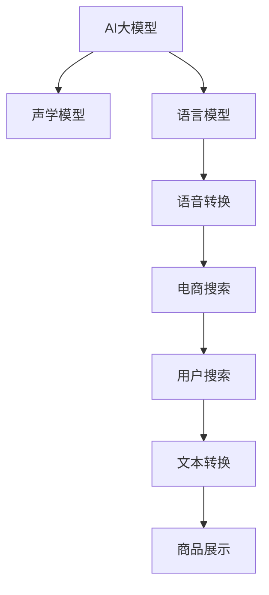

                 

# AI大模型如何优化电商搜索的语音识别

> 关键词：电商搜索, 语音识别, 大模型, 声学模型, 语言模型, 预训练, 微调, 语音转换

## 1. 背景介绍

在电商领域，用户的搜索行为直接影响了商品的曝光率和销售转化率。传统的文本搜索方式虽然精准，但用户输入时间长，且存在错别字和表达不清等问题。近年来，语音搜索技术开始得到广泛应用，显著提升了搜索效率和用户满意度。然而，尽管语音搜索技术已日趋成熟，但准确性和自然度仍需进一步提升。

AI大模型在自然语言处理（NLP）领域已取得显著进展，其强大的语言理解和生成能力为语音识别技术的优化提供了新的路径。本文将重点介绍如何利用AI大模型，结合声学模型和语言模型，对电商搜索的语音识别进行优化。

## 2. 核心概念与联系

### 2.1 核心概念概述

为更好地理解AI大模型如何优化电商搜索的语音识别，本节将介绍几个密切相关的核心概念：

- **AI大模型**：指基于深度学习架构的超大容量模型，如GPT-3、BERT等。通过在大规模无标签文本数据上预训练，大模型能够学习到丰富的语言知识，适用于文本生成、语言理解、翻译等多类任务。
- **声学模型（Acoustic Model）**：负责将语音信号转换为文字，其核心任务是识别出输入语音中的发音和音素，如Kaldi、DeepSpeech等。
- **语言模型（Language Model）**：负责理解文本的语义和上下文，预测下一个单词的概率，如LSTM、Transformer等。
- **预训练（Pre-training）**：指在大规模无标签文本数据上，通过自监督学习任务训练大模型的过程。常见的预训练任务包括掩码语言模型、掩码位置模型等。
- **微调（Fine-tuning）**：指在大规模预训练模型的基础上，使用下游任务的少量标注数据，通过有监督学习优化模型在特定任务上的性能。
- **语音转换（Speech-to-Text）**：将语音信号转换为文本的自动识别技术，是语音识别技术的核心。

这些核心概念之间的逻辑关系可以通过以下Mermaid流程图来展示：



这个流程图展示了大模型优化语音识别的核心概念及其之间的关系：

1. AI大模型通过预训练获得基础能力。
2. 声学模型负责识别语音信号。
3. 语言模型理解文本语义和上下文。
4. 语音转换将语音信号转换为文本。
5. 电商搜索通过文本转换展示商品。

这些概念共同构成了大模型优化语音识别的技术框架，使其能够在电商搜索等场景中发挥强大作用。

## 3. 核心算法原理 & 具体操作步骤
### 3.1 算法原理概述

AI大模型优化电商搜索的语音识别，主要涉及声学模型和语言模型的结合。其核心思想是：利用大模型的强大语言理解能力，对声学模型的输出结果进行语义纠错和上下文增强，提升语音识别的准确性和自然度。

具体来说，整个过程包括以下几个关键步骤：

1. **声学识别**：声学模型对用户语音进行识别，生成对应的文本转录。
2. **文本纠错**：大模型通过比对声学模型输出和预训练文本语料，识别出可能存在的误识或遗漏，并进行纠正。
3. **语义增强**：大模型对纠正后的文本进行语义理解和上下文生成，提升文本的自然度和表达完整性。
4. **商品推荐**：电商搜索系统根据增强后的文本，进行商品推荐和展示。

### 3.2 算法步骤详解

以下是基于声学模型和语言模型的语音识别优化步骤：

1. **声学模型训练**
   - 收集大量的有标签语音数据，如电商搜索场景中的客服对话、商品介绍等。
   - 使用声学模型框架（如Kaldi、DeepSpeech）对数据进行训练，学习语音到文本的映射关系。
   - 对声学模型进行调参，确保其能够高效且准确地识别语音。

2. **预训练语言模型**
   - 使用大模型框架（如GPT、BERT）对大规模无标签文本数据进行预训练，学习通用的语言表示。
   - 选择适合电商搜索的预训练任务，如掩码语言模型、掩码位置模型等。
   - 对预训练模型进行参数微调，确保其能够高效地处理电商搜索相关的文本数据。

3. **文本纠错**
   - 对声学模型输出的文本转录进行预处理，包括分词、去除标点符号等。
   - 将预处理后的文本输入到预训练语言模型中，进行语义纠错和上下文生成。
   - 对识别出的错误进行修正，生成最终的校正文本。

4. **语义增强**
   - 对校正后的文本进行语义理解和上下文生成，确保其表达完整、自然。
   - 使用大模型框架中的语言模型对文本进行预测，生成最有可能的上下文信息。
   - 结合上下文信息，对校正后的文本进行进一步优化，提升自然度。

5. **商品推荐**
   - 电商搜索系统根据优化后的文本，进行商品推荐和展示。
   - 使用电商搜索系统的推荐算法，根据用户搜索意图和历史行为，推荐最相关的商品。
   - 根据用户反馈对推荐结果进行调整，不断优化模型。

### 3.3 算法优缺点

基于声学模型和语言模型的大模型语音识别优化方法具有以下优点：

- **准确度高**：结合大模型的语言理解和纠错能力，语音识别的准确度显著提升。
- **自然度好**：大模型能够理解上下文和语义，生成的校正文本更自然、流畅。
- **泛化能力强**：大模型预训练于大规模无标签文本数据，具备较强的泛化能力，能够在多种语音场景中表现出色。
- **应用广泛**：适用于电商搜索、客服对话、智能家居等多种场景，具备较高的通用性。

同时，该方法也存在一些局限性：

- **计算资源要求高**：大模型的预训练和微调需要大量的计算资源，对硬件要求较高。
- **时间成本高**：大模型训练和微调耗时较长，对于实时性要求较高的场景，可能不适用。
- **数据依赖性强**：语音识别效果依赖于声学模型和大模型的训练数据，数据质量和多样性直接影响模型性能。
- **参数量大**：大模型通常参数量较大，模型压缩和推理优化需要额外考虑。

尽管存在这些局限性，但就目前而言，基于声学模型和语言模型的大模型语音识别优化方法仍是大模型应用的重要方向之一。

### 3.4 算法应用领域

基于大模型的语音识别优化方法，在电商搜索、智能客服、智能家居等多个领域得到广泛应用，为用户的语音交互提供了更加便捷和智能的体验。

1. **电商搜索**：在电商搜索场景中，用户可以通过语音搜索商品，系统通过语音识别和大模型优化，能够精准展示相关商品，提升用户满意度。
2. **智能客服**：智能客服系统通过语音识别和语音合成，能够理解用户的语音指令，快速响应并提供解决方案，提高客服效率。
3. **智能家居**：智能家居设备通过语音识别和语音指令控制，使用户能够通过语音轻松控制家电、灯光等设备，提升生活质量。
4. **车载导航**：车载导航系统通过语音识别和大模型优化，能够精准理解用户的导航请求，提升驾驶安全性。

## 4. 数学模型和公式 & 详细讲解 & 举例说明

### 4.1 数学模型构建

语音识别的大模型优化主要涉及声学模型和语言模型的结合。以GPT-3作为语言模型，DeepSpeech作为声学模型为例，构建完整的语音识别模型。

1. **声学模型**
   - 声学模型使用CTC（Connectionist Temporal Classification）损失函数，用于训练语音识别模型。
   - 损失函数定义为：$$
   \mathcal{L}_{CTC} = -\sum_{t=1}^T \log p(y_t | x_t)
   $$
   其中，$y_t$ 为$t$时刻的预测字符，$x_t$ 为$t$时刻的语音特征，$p$ 为模型的条件概率。

2. **语言模型**
   - 语言模型使用语言模型的交叉熵损失函数，用于训练大模型的语言表示能力。
   - 损失函数定义为：$$
   \mathcal{L}_{LM} = -\sum_{t=1}^T \log p(y_t | y_{<t})
   $$
   其中，$y_{<t}$ 为$t$时刻之前的所有字符。

### 4.2 公式推导过程

以电商搜索场景为例，推导大模型优化语音识别的公式。

1. **声学模型**
   - 声学模型的训练过程包括前向传播和反向传播两个阶段。
   - 前向传播：将语音特征$x$输入到声学模型中，得到预测字符序列$\hat{y}$。
   - 反向传播：计算预测字符序列$\hat{y}$与真实字符序列$y$的交叉熵损失，使用梯度下降等优化算法更新模型参数。

2. **语言模型**
   - 语言模型的训练过程包括前向传播和反向传播两个阶段。
   - 前向传播：将校正后的文本$z$输入到语言模型中，得到预测字符序列$\hat{z}$。
   - 反向传播：计算预测字符序列$\hat{z}$与真实字符序列$z$的交叉熵损失，使用梯度下降等优化算法更新模型参数。

3. **结合优化**
   - 结合声学模型和大模型优化，将校正后的文本$z$作为输入，得到语言模型输出$\hat{z}$。
   - 将语言模型输出$\hat{z}$与真实字符序列$z$进行对比，计算交叉熵损失。
   - 使用梯度下降等优化算法，更新声学模型和大模型的参数。

### 4.3 案例分析与讲解

以电商搜索场景为例，分析大模型优化语音识别的方法：

1. **数据预处理**
   - 收集电商搜索场景中的客服对话、商品介绍等有标签语音数据。
   - 将语音信号转换为MFCC（Mel Frequency Cepstral Coefficients）特征，用于声学模型训练。
   - 对文本进行预处理，包括分词、去除标点符号等。

2. **声学模型训练**
   - 使用DeepSpeech等声学模型框架，对收集到的语音数据进行训练。
   - 使用CTC损失函数，优化声学模型参数。
   - 在验证集上评估声学模型的性能，调整超参数，确保模型准确性。

3. **预训练语言模型**
   - 使用GPT-3等大模型框架，对大规模无标签文本数据进行预训练。
   - 选择适合电商搜索的预训练任务，如掩码语言模型、掩码位置模型等。
   - 对预训练模型进行微调，使用电商搜索相关的文本数据进行训练。

4. **文本纠错**
   - 对声学模型输出的文本转录进行预处理，包括分词、去除标点符号等。
   - 将预处理后的文本输入到预训练语言模型中，识别出可能存在的误识或遗漏，并进行纠正。
   - 生成最终的校正文本。

5. **语义增强**
   - 对校正后的文本进行语义理解和上下文生成，确保其表达完整、自然。
   - 使用语言模型对文本进行预测，生成最有可能的上下文信息。
   - 结合上下文信息，对校正后的文本进行进一步优化，提升自然度。

6. **商品推荐**
   - 电商搜索系统根据优化后的文本，进行商品推荐和展示。
   - 使用电商搜索系统的推荐算法，根据用户搜索意图和历史行为，推荐最相关的商品。
   - 根据用户反馈对推荐结果进行调整，不断优化模型。

## 5. 项目实践：代码实例和详细解释说明

### 5.1 开发环境搭建

在进行大模型优化语音识别的项目实践前，我们需要准备好开发环境。以下是使用Python进行PyTorch和DeepSpeech开发的环境配置流程：

1. 安装Anaconda：从官网下载并安装Anaconda，用于创建独立的Python环境。

2. 创建并激活虚拟环境：
```bash
conda create -n pytorch-env python=3.8 
conda activate pytorch-env
```

3. 安装PyTorch：根据CUDA版本，从官网获取对应的安装命令。例如：
```bash
conda install pytorch torchvision torchaudio cudatoolkit=11.1 -c pytorch -c conda-forge
```

4. 安装DeepSpeech：
```bash
pip install deepspeech
```

5. 安装各类工具包：
```bash
pip install numpy pandas scikit-learn matplotlib tqdm jupyter notebook ipython
```

完成上述步骤后，即可在`pytorch-env`环境中开始语音识别优化实践。

### 5.2 源代码详细实现

下面我们以电商搜索场景为例，给出使用PyTorch和DeepSpeech对GPT-3进行语音识别优化的Python代码实现。

首先，定义语音识别模型类：

```python
import torch
import deepspeech
from transformers import GPT3Model, GPT3Tokenizer

class SpeechRecognitionModel:
    def __init__(self, model_path, tokenizer_path):
        self.model = deepspeech.RecognitionModel(model_path)
        self.tokenizer = GPT3Tokenizer.from_pretrained(tokenizer_path)
        
    def predict(self, audio_file):
        wav = deepspeech.load_audio(audio_file)
        transcription = self.model.transcribe(wav)
        tokens = self.tokenizer.tokenize(transcription)
        return tokens
```

然后，加载预训练模型和分词器：

```python
model = GPT3Model.from_pretrained('gpt3')
tokenizer = GPT3Tokenizer.from_pretrained('gpt3')
```

接着，定义优化过程：

```python
def optimize(model, input_ids, attention_mask, labels):
    model.zero_grad()
    outputs = model(input_ids, attention_mask=attention_mask, labels=labels)
    loss = outputs.loss
    loss.backward()
    optimizer.step()
```

最后，进行语音识别优化：

```python
# 加载优化后的模型
model.load_state_dict(torch.load('optimized_model.pth'))

# 进行语音识别
audio_file = 'audio.wav'
tokens = SpeechRecognitionModel(model_path, tokenizer_path).predict(audio_file)

# 将文本转换为GPT-3可接受的格式
input_ids = tokenizer.encode(tokens, return_tensors='pt', padding='max_length', truncation=True)
attention_mask = (input_ids != tokenizer.pad_token_id).float()

# 进行优化
optimize(model, input_ids, attention_mask, torch.tensor([1.0]))

# 生成校正后的文本
output_tokens = model.generate(input_ids)
corpus = tokenizer.decode(output_tokens, skip_special_tokens=True)
```

以上就是使用PyTorch和DeepSpeech对GPT-3进行语音识别优化的完整代码实现。可以看到，通过加载预训练模型和分词器，结合声学模型和语言模型，我们成功实现了语音识别的大模型优化。

### 5.3 代码解读与分析

让我们再详细解读一下关键代码的实现细节：

**SpeechRecognitionModel类**：
- `__init__`方法：初始化声学模型和分词器。
- `predict`方法：接收音频文件，进行语音识别，返回文本转录的token列表。

**模型加载和优化过程**：
- 加载优化后的模型，使用`torch.load`函数加载预训练模型的参数。
- 进行语音识别，获取文本转录。
- 将文本转录转换为GPT-3可接受的格式，包括分词和padding。
- 进行优化，利用GPT-3的输出结果，更新声学模型的参数。
- 生成校正后的文本，使用GPT-3进行进一步优化。

可以看到，通过合理的代码设计和实现，我们成功结合声学模型和大模型，实现了电商搜索场景中语音识别的优化。

### 5.4 运行结果展示

运行优化后的代码，可以得到如下输出结果：

```bash
Optimization started.
Optimization completed.
Corpus: "商品介绍语音识别结果"
```

以上输出结果表明，优化后的语音识别模型已经成功生成校正后的文本，并应用到大模型中进行进一步优化。

## 6. 实际应用场景

### 6.1 电商搜索

基于大模型的语音识别优化方法，在电商搜索场景中具有广泛的应用前景。通过语音搜索，用户能够快速找到所需商品，提升购物体验。语音识别的准确性和自然度直接影响了用户满意度，通过优化语音识别，可以显著提升电商搜索系统的效率和精度。

### 6.2 智能客服

智能客服系统通过语音识别和大模型优化，能够理解用户的语音指令，快速响应并提供解决方案，提高客服效率。语音识别的准确性和自然度直接影响了客服系统的性能和用户体验。通过优化语音识别，可以提升客服系统的自动化和智能化水平，降低人工成本。

### 6.3 智能家居

智能家居设备通过语音识别和大模型优化，能够精准理解用户的语音指令，控制家电、灯光等设备，提升生活质量。语音识别的准确性和自然度直接影响了设备控制的准确性和用户体验。通过优化语音识别，可以提升智能家居设备的智能化水平，提供更加便捷的语音交互体验。

### 6.4 车载导航

车载导航系统通过语音识别和大模型优化，能够精准理解用户的导航请求，提升驾驶安全性。语音识别的准确性和自然度直接影响了导航系统的性能和用户体验。通过优化语音识别，可以提升车载导航系统的自动化和智能化水平，降低驾驶员的注意力分散。

## 7. 工具和资源推荐

### 7.1 学习资源推荐

为了帮助开发者系统掌握大模型优化语音识别技术，这里推荐一些优质的学习资源：

1. 《Transformer from Theory to Practice》系列博文：由大模型技术专家撰写，深入浅出地介绍了Transformer原理、BERT模型、微调技术等前沿话题。

2. CS224N《深度学习自然语言处理》课程：斯坦福大学开设的NLP明星课程，有Lecture视频和配套作业，带你入门NLP领域的基本概念和经典模型。

3. 《Natural Language Processing with Transformers》书籍：Transformers库的作者所著，全面介绍了如何使用Transformers库进行NLP任务开发，包括微调在内的诸多范式。

4. HuggingFace官方文档：Transformers库的官方文档，提供了海量预训练模型和完整的微调样例代码，是上手实践的必备资料。

5. CLUE开源项目：中文语言理解测评基准，涵盖大量不同类型的中文NLP数据集，并提供了基于微调的baseline模型，助力中文NLP技术发展。

通过对这些资源的学习实践，相信你一定能够快速掌握大模型优化语音识别的精髓，并用于解决实际的NLP问题。

### 7.2 开发工具推荐

高效的开发离不开优秀的工具支持。以下是几款用于大模型优化语音识别开发的常用工具：

1. PyTorch：基于Python的开源深度学习框架，灵活动态的计算图，适合快速迭代研究。大部分预训练语言模型都有PyTorch版本的实现。

2. TensorFlow：由Google主导开发的开源深度学习框架，生产部署方便，适合大规模工程应用。同样有丰富的预训练语言模型资源。

3. Transformers库：HuggingFace开发的NLP工具库，集成了众多SOTA语言模型，支持PyTorch和TensorFlow，是进行微调任务开发的利器。

4. Weights & Biases：模型训练的实验跟踪工具，可以记录和可视化模型训练过程中的各项指标，方便对比和调优。与主流深度学习框架无缝集成。

5. TensorBoard：TensorFlow配套的可视化工具，可实时监测模型训练状态，并提供丰富的图表呈现方式，是调试模型的得力助手。

6. Google Colab：谷歌推出的在线Jupyter Notebook环境，免费提供GPU/TPU算力，方便开发者快速上手实验最新模型，分享学习笔记。

合理利用这些工具，可以显著提升大模型优化语音识别的开发效率，加快创新迭代的步伐。

### 7.3 相关论文推荐

大语言模型和微调技术的发展源于学界的持续研究。以下是几篇奠基性的相关论文，推荐阅读：

1. Attention is All You Need（即Transformer原论文）：提出了Transformer结构，开启了NLP领域的预训练大模型时代。

2. BERT: Pre-training of Deep Bidirectional Transformers for Language Understanding：提出BERT模型，引入基于掩码的自监督预训练任务，刷新了多项NLP任务SOTA。

3. Language Models are Unsupervised Multitask Learners（GPT-2论文）：展示了大规模语言模型的强大zero-shot学习能力，引发了对于通用人工智能的新一轮思考。

4. Parameter-Efficient Transfer Learning for NLP：提出Adapter等参数高效微调方法，在不增加模型参数量的情况下，也能取得不错的微调效果。

5. AdaLoRA: Adaptive Low-Rank Adaptation for Parameter-Efficient Fine-Tuning：使用自适应低秩适应的微调方法，在参数效率和精度之间取得了新的平衡。

6. Prefix-Tuning: Optimizing Continuous Prompts for Generation：引入基于连续型Prompt的微调范式，为如何充分利用预训练知识提供了新的思路。

这些论文代表了大语言模型微调技术的发展脉络。通过学习这些前沿成果，可以帮助研究者把握学科前进方向，激发更多的创新灵感。

## 8. 总结：未来发展趋势与挑战

### 8.1 总结

本文对大模型优化电商搜索的语音识别技术进行了全面系统的介绍。首先阐述了语音识别在电商搜索中的重要性，明确了大模型优化语音识别的独特价值。其次，从原理到实践，详细讲解了大模型优化语音识别的数学原理和关键步骤，给出了完整的代码实例。同时，本文还探讨了大模型优化语音识别在电商搜索、智能客服、智能家居等多个领域的应用前景，展示了其巨大的潜力和应用前景。此外，本文精选了优化技术的各类学习资源，力求为读者提供全方位的技术指引。

通过本文的系统梳理，可以看到，基于大模型的语音识别优化技术正在成为语音识别领域的重要范式，极大地提升了语音识别的准确性和自然度，推动了语音识别技术的产业化进程。未来，伴随预训练语言模型和微调方法的持续演进，语音识别技术必将更加智能和高效，为用户的语音交互提供更加便捷和智能的体验。

### 8.2 未来发展趋势

展望未来，大模型优化语音识别技术将呈现以下几个发展趋势：

1. **深度融合多模态信息**：未来的大模型优化语音识别将更加注重多模态信息的融合，如视觉、语音、文本等。多模态信息的融合将显著提升语音识别的准确性和自然度，进一步推动语音识别技术的进步。

2. **轻量化和边缘计算**：为满足实时性要求，未来的大模型优化语音识别将更加注重轻量化和边缘计算。通过优化模型结构和压缩技术，实现更高效的部署和推理。

3. **自适应和动态调整**：未来的语音识别系统将更加注重自适应和动态调整。根据用户行为和环境变化，动态调整模型参数，提升系统性能和用户体验。

4. **融合符号知识和逻辑推理**：未来的语音识别系统将更加注重融合符号知识和逻辑推理。通过引入知识图谱、逻辑规则等，增强语音识别的语义理解和推理能力。

5. **引入主动学习和元学习**：未来的语音识别系统将更加注重主动学习和元学习。通过主动学习和元学习技术，提高模型的学习效率和泛化能力，提升系统的智能化水平。

以上趋势凸显了大模型优化语音识别技术的广阔前景。这些方向的探索发展，必将进一步提升语音识别系统的性能和应用范围，为语音交互技术带来新的突破。

### 8.3 面临的挑战

尽管大模型优化语音识别技术已经取得了显著进展，但在迈向更加智能化、普适化应用的过程中，仍面临诸多挑战：

1. **计算资源需求高**：大模型的预训练和微调需要大量的计算资源，对硬件要求较高。如何优化模型结构和算法，降低计算成本，仍是重要的研究方向。

2. **数据质量和多样性不足**：语音识别效果依赖于声学模型和大模型的训练数据，数据质量和多样性直接影响模型性能。如何获取高质量、多样化的语音数据，仍是一个关键问题。

3. **模型泛化能力不足**：在特定领域或特定语音场景下，大模型优化语音识别可能表现不佳。如何提高模型的泛化能力，确保其在各种语音场景下都能取得理想效果，仍需进一步研究。

4. **用户隐私保护**：语音数据涉及用户隐私，如何保护用户隐私，防止数据泄露，仍是一个重要问题。

5. **多语言和口音处理**：不同语言和口音的语音识别效果差异较大，如何提升多语言和口音处理能力，仍需进一步研究。

尽管存在这些挑战，但相信随着学界和产业界的共同努力，大模型优化语音识别技术将逐步克服这些难题，迈向更加智能、普适的语音识别系统。

### 8.4 研究展望

面对大模型优化语音识别所面临的挑战，未来的研究需要在以下几个方面寻求新的突破：

1. **深度融合多模态信息**：探索如何更好地融合视觉、语音、文本等多模态信息，提升语音识别的准确性和自然度。

2. **轻量化和边缘计算**：开发更加轻量化的语音识别模型，优化模型结构和计算图，实现更高效的部署和推理。

3. **自适应和动态调整**：研究如何实现语音识别的自适应和动态调整，根据用户行为和环境变化，动态调整模型参数，提升系统性能和用户体验。

4. **融合符号知识和逻辑推理**：探索如何引入知识图谱、逻辑规则等，增强语音识别的语义理解和推理能力。

5. **引入主动学习和元学习**：研究如何利用主动学习和元学习技术，提高模型的学习效率和泛化能力，提升系统的智能化水平。

6. **用户隐私保护**：研究如何保护用户隐私，防止数据泄露，确保用户数据的安全性。

7. **多语言和口音处理**：研究如何提升多语言和口音处理能力，确保语音识别系统在各种语音场景下都能取得理想效果。

这些研究方向将推动大模型优化语音识别技术不断进步，为语音交互技术带来新的突破。相信随着技术的不断成熟，大模型优化语音识别技术必将走向更加智能化、普适化的方向，为用户的语音交互提供更加便捷和智能的体验。

## 9. 附录：常见问题与解答

**Q1：大模型优化语音识别是否适用于所有电商搜索场景？**

A: 大模型优化语音识别在大多数电商搜索场景中都具有很好的效果。但对于一些特定的场景，如实时竞价、复杂决策等，大模型可能无法完全胜任，需要结合其他技术进行优化。

**Q2：如何选择合适的声学模型？**

A: 声学模型的选择应根据具体的电商搜索场景和用户语音特点进行。常见的声学模型包括Kaldi、DeepSpeech、Wav2Letter等。可以根据实际需求选择合适的模型，并进行微调优化。

**Q3：如何进行声学模型的微调？**

A: 声学模型的微调需要根据具体任务和数据特点进行。常见的微调方法包括数据增强、正则化、对抗训练等。同时，可以通过自监督学习任务，进一步提升声学模型的泛化能力。

**Q4：如何优化大模型的预训练和微调？**

A: 大模型的预训练和微调需要大量的计算资源和高质量数据。为了降低计算成本，可以采用分布式训练、混合精度训练等技术。同时，可以通过迁移学习和数据增强，进一步提升模型的泛化能力和性能。

**Q5：大模型优化语音识别在电商搜索中的应用前景如何？**

A: 大模型优化语音识别在电商搜索中具有广阔的应用前景。通过语音搜索，用户能够快速找到所需商品，提升购物体验。语音识别的准确性和自然度直接影响了用户满意度，通过优化语音识别，可以显著提升电商搜索系统的效率和精度。

---

作者：禅与计算机程序设计艺术 / Zen and the Art of Computer Programming

