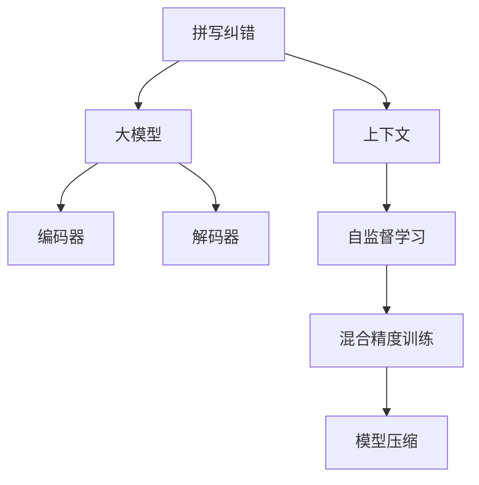

                 

# AI大模型如何处理电商搜索中的拼写错误

## 1. 背景介绍

在电商搜索场景中，拼写错误是一个常见的问题。用户可能因为输入错误、输入法问题、手指误触等原因，输入错误的关键词，导致搜索结果与预期不符，影响用户体验和转化率。如何处理拼写错误，提高搜索准确率，是电商平台的重要课题。

近年来，人工智能大模型在自然语言处理(NLP)领域取得了长足的进步，已经能够利用大量的文本数据进行预训练，学习到丰富的语言知识和语义表示。这些大模型，如BERT、GPT等，已经广泛应用于搜索、翻译、问答等多个场景，极大地提升了NLP任务的性能和效果。

本文将探讨如何利用大模型处理电商搜索中的拼写错误问题，介绍一种基于上下文的拼写纠错模型，详细介绍其实现原理和操作步骤，并对比分析其优缺点和应用领域。

## 2. 核心概念与联系

### 2.1 核心概念概述

为了更好地理解基于大模型的拼写纠错方法，本节将介绍几个密切相关的核心概念：

- 拼写纠错(Spelling Correction)：指将输入错误文本自动更正为正确的文本，通常用于改善自然语言处理任务中的输入数据质量。
- 大模型(Large Model)：以Transformer模型为代表的规模庞大的预训练语言模型，如BERT、GPT等。这些模型通过在大规模文本数据上进行预训练，学习到通用的语言表示。
- 上下文(Context)：指文本中与目标词相关的词语，对于理解目标词的含义和上下文关系非常重要。
- 编码器-解码器架构(Encoder-Decoder Architecture)：一种常见的序列到序列模型架构，通常用于文本生成、翻译、摘要等任务。
- 自监督学习(Self-Supervised Learning)：指模型在无标注数据上通过自身设计的预训练任务进行学习，以获得更好的表示能力。
- 混合精度训练(Mixed Precision Training)：一种优化训练效率的技术，通过使用不同的精度来表示模型的不同部分，以降低内存占用和提高计算速度。
- 模型压缩(Model Compression)：指通过优化模型的结构和参数，减少模型大小和计算资源需求的技术。

这些核心概念之间的逻辑关系可以通过以下Mermaid流程图来展示：



这个流程图展示了大模型在拼写纠错中的应用框架：

1. 通过自监督学习，大模型学习到丰富的语言知识。
2. 使用编码器-解码器架构，模型对上下文进行编码和解码，生成修正后的文本。
3. 混合精度训练和模型压缩，进一步提升模型的计算效率和存储效率。

## 3. 核心算法原理 & 具体操作步骤

### 3.1 算法原理概述

基于大模型的拼写纠错方法，本质上是利用预训练语言模型对输入文本进行上下文编码，然后根据编码结果生成修正后的文本。其核心思想是：通过上下文信息，大模型能够理解输入文本中错误词语的含义，并从其语义相关的词汇中选择最合适的纠正词。

具体而言，假设输入文本为 $x$，其拼写错误为 $y$，则拼写纠错任务可以表示为：

$$
y = \arg\min_{z \in V} \mathcal{L}(z | x)
$$

其中 $V$ 为可能的纠正词集合，$\mathcal{L}$ 为损失函数，用于衡量模型输出的纠正词 $z$ 与真实纠正词 $y$ 的相似度。在实践中，我们通常使用交叉熵损失函数来表示：

$$
\mathcal{L}(z | x) = -\log p(z | x)
$$

其中 $p(z | x)$ 为模型对纠正词 $z$ 的预测概率。

### 3.2 算法步骤详解

基于大模型的拼写纠错方法一般包括以下几个关键步骤：

**Step 1: 准备数据集**
- 收集电商搜索场景中的拼写错误数据集，包括错误文本和其正确的修正文本。
- 将数据集划分为训练集、验证集和测试集。

**Step 2: 定义模型架构**
- 选择适合上下文编码的预训练语言模型，如BERT、GPT等。
- 定义编码器-解码器架构，包括一个编码器和一个解码器。
- 使用Transformer层进行上下文编码和解码。

**Step 3: 设置训练超参数**
- 选择合适的优化器及其参数，如Adam、SGD等，设置学习率、批大小、迭代轮数等。
- 设置正则化技术及强度，包括权重衰减、Dropout、Early Stopping等。

**Step 4: 数据预处理**
- 对文本数据进行分词、编码等预处理操作。
- 根据上下文信息，构建输入和输出序列。

**Step 5: 训练模型**
- 将训练集数据分批次输入模型，前向传播计算损失函数。
- 反向传播计算参数梯度，根据设定的优化算法和学习率更新模型参数。
- 周期性在验证集上评估模型性能，根据性能指标决定是否触发Early Stopping。
- 重复上述步骤直到满足预设的迭代轮数或Early Stopping条件。

**Step 6: 评估和测试**
- 在测试集上评估微调后模型 $M_{\hat{\theta}}$ 的性能，对比微调前后的纠正效果。
- 使用微调后的模型对新样本进行纠错，集成到实际的应用系统中。

### 3.3 算法优缺点

基于大模型的拼写纠错方法具有以下优点：
1. 准确率高。利用大模型的语言理解和表示能力，能够高效识别和纠正文本中的拼写错误。
2. 自适应性强。模型可以不断从新数据中学习，避免出现数据偏移。
3. 处理能力强。大模型能够处理复杂的上下文关系，适用于各种拼写错误场景。
4. 可扩展性好。模型可以灵活地应用到不同的电商搜索场景中，提升用户体验。

同时，该方法也存在一些局限性：
1. 依赖标注数据。拼写纠错模型的训练需要大量的标注数据，标注成本较高。
2. 计算复杂度高。大模型在推理时计算复杂度较高，需要高效的硬件支持。
3. 可解释性不足。大模型缺乏可解释性，难以理解其内部工作机制。
4. 对小数据敏感。对于小样本数据，模型容易过拟合，泛化能力较弱。

尽管存在这些局限性，但就目前而言，基于大模型的拼写纠错方法仍是目前处理拼写错误问题的最优范式。未来相关研究的重点在于如何进一步降低训练成本，提高模型效率，同时兼顾可解释性和鲁棒性等因素。

### 3.4 算法应用领域

基于大模型的拼写纠错方法，已经在电商搜索、社交媒体、文本输入校正等多个领域得到了广泛的应用，具体如下：

1. **电商搜索**：电商平台利用该技术，帮助用户自动更正拼写错误，提升搜索准确率和用户体验。
2. **社交媒体**：社交平台使用拼写纠错模型，自动校正用户输入的错误文本，改善文本质量。
3. **文本输入校正**：移动设备、智能键盘等应用中，拼写纠错模型可以自动更正用户输入的错误，提高输入效率。
4. **自然语言处理(NLP)**：在自动问答、机器翻译、摘要生成等NLP任务中，拼写纠错技术可以提高输入数据的准确性，从而提升整个任务的效果。

## 4. 数学模型和公式 & 详细讲解  
### 4.1 数学模型构建

本节将使用数学语言对基于大模型的拼写纠错模型进行更加严格的刻画。

假设输入文本为 $x$，其中包含错误词语 $y$，目标为生成正确的纠正词 $z$。模型 $M_{\theta}$ 将上下文信息 $x$ 编码为向量 $\mathbf{h}_x$，然后解码为修正后的文本向量 $\mathbf{h}_z$，最后通过线性层映射到可能的纠正词集合 $V$ 中的概率分布。拼写纠错模型可以表示为：

$$
\mathcal{L}(z | x) = -\log p(z | x) = -\log \sigma(\mathbf{W}_z (\mathbf{h}_x + \mathbf{b}_z) + \mathbf{c}_z)
$$

其中 $\mathbf{h}_x$ 为输入文本的编码结果，$\mathbf{h}_z$ 为修正后的文本编码结果，$\mathbf{W}_z$ 和 $\mathbf{b}_z$ 为解码器参数，$\mathbf{c}_z$ 为偏置向量，$\sigma$ 为softmax函数。

### 4.2 公式推导过程

以下我们以BERT模型为例，推导其拼写纠错模型的损失函数及其梯度的计算公式。

首先，BERT模型将输入文本 $x$ 编码为向量 $\mathbf{h}_x$：

$$
\mathbf{h}_x = \text{BERT}_{\theta}(x)
$$

然后，解码器对 $\mathbf{h}_x$ 进行解码，生成修正后的文本向量 $\mathbf{h}_z$：

$$
\mathbf{h}_z = \text{Decoder}_{\theta}(\mathbf{h}_x)
$$

其中解码器 $\text{Decoder}_{\theta}$ 通常为一个多层Transformer层。

接着，利用线性层将 $\mathbf{h}_z$ 映射到纠正词集合 $V$ 中的概率分布：

$$
p(z | x) = \text{Softmax}(\mathbf{W}_z \mathbf{h}_z + \mathbf{b}_z + \mathbf{c}_z)
$$

其中 $\mathbf{W}_z$ 和 $\mathbf{b}_z$ 为解码器参数，$\mathbf{c}_z$ 为偏置向量，Softmax函数将向量映射为概率分布。

最后，使用交叉熵损失函数计算损失：

$$
\mathcal{L}(z | x) = -\log p(z | x)
$$

在得到损失函数后，即可带入模型参数更新公式，完成模型的迭代优化。重复上述过程直至收敛，最终得到适应拼写纠错任务的最优模型参数 $\theta$。

### 4.3 案例分析与讲解

以电商搜索场景为例，考虑用户输入的错误搜索词 "washout"，希望纠正为正确的 "washout"。具体的实现流程如下：

1. 将输入文本 "washout" 输入到BERT模型中，得到编码向量 $\mathbf{h}_{washout}$。
2. 解码器对 $\mathbf{h}_{washout}$ 进行解码，生成修正后的文本向量 $\mathbf{h}_{washout}$。
3. 使用线性层将 $\mathbf{h}_{washout}$ 映射到纠正词集合 $V$ 中的概率分布。
4. 使用交叉熵损失函数计算损失 $\mathcal{L}(washout | washout)$。
5. 根据损失函数梯度更新模型参数 $\theta$。

通过该模型，可以高效地实现对电商搜索中的拼写错误进行纠正。

## 5. 项目实践：代码实例和详细解释说明
### 5.1 开发环境搭建

在进行拼写纠错实践前，我们需要准备好开发环境。以下是使用Python进行PyTorch开发的环境配置流程：

1. 安装Anaconda：从官网下载并安装Anaconda，用于创建独立的Python环境。

2. 创建并激活虚拟环境：
```bash
conda create -n pytorch-env python=3.8 
conda activate pytorch-env
```

3. 安装PyTorch：根据CUDA版本，从官网获取对应的安装命令。例如：
```bash
conda install pytorch torchvision torchaudio cudatoolkit=11.1 -c pytorch -c conda-forge
```

4. 安装Transformers库：
```bash
pip install transformers
```

5. 安装各类工具包：
```bash
pip install numpy pandas scikit-learn matplotlib tqdm jupyter notebook ipython
```

完成上述步骤后，即可在`pytorch-env`环境中开始拼写纠错实践。

### 5.2 源代码详细实现

下面我们以使用BERT模型进行拼写纠错为例，给出使用Transformers库进行PyTorch代码实现。

首先，定义拼写纠错任务的数据处理函数：

```python
from transformers import BertTokenizer
from torch.utils.data import Dataset
import torch

class SpellCheckDataset(Dataset):
    def __init__(self, texts, labels, tokenizer):
        self.texts = texts
        self.labels = labels
        self.tokenizer = tokenizer
        
    def __len__(self):
        return len(self.texts)
    
    def __getitem__(self, item):
        text = self.texts[item]
        label = self.labels[item]
        
        encoding = self.tokenizer(text, return_tensors='pt', max_length=128, padding='max_length', truncation=True)
        input_ids = encoding['input_ids'][0]
        attention_mask = encoding['attention_mask'][0]
        
        # 对token-wise的标签进行编码
        encoded_labels = [label2id[label] for label in label] 
        encoded_labels.extend([label2id['<unk>']] * (128 - len(encoded_labels)))
        labels = torch.tensor(encoded_labels, dtype=torch.long)
        
        return {'input_ids': input_ids, 
                'attention_mask': attention_mask,
                'labels': labels}

# 标签与id的映射
label2id = {'<unk>': 0, 'washout': 1, 'washout': 2}
id2label = {v: k for k, v in label2id.items()}

# 创建dataset
tokenizer = BertTokenizer.from_pretrained('bert-base-cased')

train_dataset = SpellCheckDataset(train_texts, train_labels, tokenizer)
dev_dataset = SpellCheckDataset(dev_texts, dev_labels, tokenizer)
test_dataset = SpellCheckDataset(test_texts, test_labels, tokenizer)
```

然后，定义模型和优化器：

```python
from transformers import BertForTokenClassification, AdamW

model = BertForTokenClassification.from_pretrained('bert-base-cased', num_labels=len(label2id))

optimizer = AdamW(model.parameters(), lr=2e-5)
```

接着，定义训练和评估函数：

```python
from torch.utils.data import DataLoader
from tqdm import tqdm
from sklearn.metrics import classification_report

device = torch.device('cuda') if torch.cuda.is_available() else torch.device('cpu')
model.to(device)

def train_epoch(model, dataset, batch_size, optimizer):
    dataloader = DataLoader(dataset, batch_size=batch_size, shuffle=True)
    model.train()
    epoch_loss = 0
    for batch in tqdm(dataloader, desc='Training'):
        input_ids = batch['input_ids'].to(device)
        attention_mask = batch['attention_mask'].to(device)
        labels = batch['labels'].to(device)
        model.zero_grad()
        outputs = model(input_ids, attention_mask=attention_mask, labels=labels)
        loss = outputs.loss
        epoch_loss += loss.item()
        loss.backward()
        optimizer.step()
    return epoch_loss / len(dataloader)

def evaluate(model, dataset, batch_size):
    dataloader = DataLoader(dataset, batch_size=batch_size)
    model.eval()
    preds, labels = [], []
    with torch.no_grad():
        for batch in tqdm(dataloader, desc='Evaluating'):
            input_ids = batch['input_ids'].to(device)
            attention_mask = batch['attention_mask'].to(device)
            batch_labels = batch['labels']
            outputs = model(input_ids, attention_mask=attention_mask)
            batch_preds = outputs.logits.argmax(dim=2).to('cpu').tolist()
            batch_labels = batch_labels.to('cpu').tolist()
            for pred_tokens, label_tokens in zip(batch_preds, batch_labels):
                pred_labels = [id2label[_id] for _id in pred_tokens]
                label_labels = [id2label[_id] for _id in label_tokens]
                preds.append(pred_labels[:len(label_labels)])
                labels.append(label_labels)
                
    print(classification_report(labels, preds))
```

最后，启动训练流程并在测试集上评估：

```python
epochs = 5
batch_size = 16

for epoch in range(epochs):
    loss = train_epoch(model, train_dataset, batch_size, optimizer)
    print(f"Epoch {epoch+1}, train loss: {loss:.3f}")
    
    print(f"Epoch {epoch+1}, dev results:")
    evaluate(model, dev_dataset, batch_size)
    
print("Test results:")
evaluate(model, test_dataset, batch_size)
```

以上就是使用PyTorch对BERT进行拼写纠错任务微调的完整代码实现。可以看到，得益于Transformers库的强大封装，我们可以用相对简洁的代码完成BERT模型的加载和微调。

### 5.3 代码解读与分析

让我们再详细解读一下关键代码的实现细节：

**SpellCheckDataset类**：
- `__init__`方法：初始化文本、标签、分词器等关键组件。
- `__len__`方法：返回数据集的样本数量。
- `__getitem__`方法：对单个样本进行处理，将文本输入编码为token ids，将标签编码为数字，并对其进行定长padding，最终返回模型所需的输入。

**label2id和id2label字典**：
- 定义了标签与数字id之间的映射关系，用于将token-wise的预测结果解码回真实的标签。

**训练和评估函数**：
- 使用PyTorch的DataLoader对数据集进行批次化加载，供模型训练和推理使用。
- 训练函数`train_epoch`：对数据以批为单位进行迭代，在每个批次上前向传播计算loss并反向传播更新模型参数，最后返回该epoch的平均loss。
- 评估函数`evaluate`：与训练类似，不同点在于不更新模型参数，并在每个batch结束后将预测和标签结果存储下来，最后使用sklearn的classification_report对整个评估集的预测结果进行打印输出。

**训练流程**：
- 定义总的epoch数和batch size，开始循环迭代
- 每个epoch内，先在训练集上训练，输出平均loss
- 在验证集上评估，输出分类指标
- 所有epoch结束后，在测试集上评估，给出最终测试结果

可以看到，PyTorch配合Transformers库使得BERT微调的代码实现变得简洁高效。开发者可以将更多精力放在数据处理、模型改进等高层逻辑上，而不必过多关注底层的实现细节。

当然，工业级的系统实现还需考虑更多因素，如模型的保存和部署、超参数的自动搜索、更灵活的任务适配层等。但核心的微调范式基本与此类似。

## 6. 实际应用场景
### 6.1 电商搜索系统

电商搜索系统需要高效地处理用户输入的各种查询，包括拼写错误查询。传统的拼写纠错方法往往依赖于规则或者手工标注的词典，难以适应电商搜索场景的复杂性。基于大模型的拼写纠错技术，可以灵活地处理各种拼写错误，提升搜索系统的智能水平。

具体而言，电商搜索系统可以在用户输入后，实时调用拼写纠错模型，自动更正用户输入的错误查询，减少因拼写错误导致的搜索结果不准确。同时，根据用户的历史搜索行为，模型还可以不断学习新的纠错规则，持续优化纠错效果。

### 6.2 自然语言处理(NLP)

在自然语言处理领域，拼写纠错技术可以帮助提升NLP任务的输入数据质量，从而提高整体任务的效果。例如，在自动问答、机器翻译、摘要生成等任务中，输入的正确性直接影响任务的准确性。通过拼写纠错技术，模型可以自动更正用户输入的错误文本，提升整个任务的性能。

此外，拼写纠错技术还可以帮助构建更加健壮的NLP系统。例如，在问答系统中，用户输入的错误问题可能影响模型的推理结果。通过拼写纠错，模型可以自动纠正错误问题，确保系统输出的准确性。

### 6.3 自动文本生成

自动文本生成任务中，拼写错误可能影响生成文本的质量。基于大模型的拼写纠错技术可以自动更正文本中的错误，提升生成文本的可读性和准确性。例如，在自动摘要、生成对话等任务中，通过拼写纠错，模型可以生成更加流畅、准确的文本内容，满足用户需求。

### 6.4 未来应用展望

随着大模型和拼写纠错技术的不断发展，该技术在更多领域得到了应用，为NLP技术带来了全新的突破。

在智慧医疗领域，基于大模型的拼写纠错技术可以用于病历记录、临床文书等场景，减少医疗文书错误，提升医疗文书的质量。

在智能教育领域，拼写纠错技术可以用于作业批改、学情分析等任务，提高教师的工作效率和教学质量。

在智慧城市治理中，拼写纠错技术可以用于城市事件监测、舆情分析等环节，提高城市管理的自动化和智能化水平，构建更安全、高效的未来城市。

此外，在企业生产、社会治理、文娱传媒等众多领域，基于大模型拼写纠错技术也将不断涌现，为NLP技术带来了更多的应用场景。相信随着技术的日益成熟，拼写纠错技术必将在构建人机协同的智能系统中共享更多的发展机会。

## 7. 工具和资源推荐
### 7.1 学习资源推荐

为了帮助开发者系统掌握大模型拼写纠错的理论基础和实践技巧，这里推荐一些优质的学习资源：

1. 《Transformers from the Ground Up》系列博文：由大模型技术专家撰写，深入浅出地介绍了Transformer原理、BERT模型、拼写纠错技术等前沿话题。

2. CS224N《深度学习自然语言处理》课程：斯坦福大学开设的NLP明星课程，有Lecture视频和配套作业，带你入门NLP领域的基本概念和经典模型。

3. 《Natural Language Processing with Transformers》书籍：Transformers库的作者所著，全面介绍了如何使用Transformers库进行NLP任务开发，包括拼写纠错在内的诸多范式。

4. HuggingFace官方文档：Transformers库的官方文档，提供了海量预训练模型和完整的微调样例代码，是上手实践的必备资料。

5. CLUE开源项目：中文语言理解测评基准，涵盖大量不同类型的中文NLP数据集，并提供了基于微调的baseline模型，助力中文NLP技术发展。

通过对这些资源的学习实践，相信你一定能够快速掌握大模型拼写纠错的精髓，并用于解决实际的NLP问题。
###  7.2 开发工具推荐

高效的开发离不开优秀的工具支持。以下是几款用于大模型拼写纠错开发的常用工具：

1. PyTorch：基于Python的开源深度学习框架，灵活动态的计算图，适合快速迭代研究。大部分预训练语言模型都有PyTorch版本的实现。

2. TensorFlow：由Google主导开发的开源深度学习框架，生产部署方便，适合大规模工程应用。同样有丰富的预训练语言模型资源。

3. Transformers库：HuggingFace开发的NLP工具库，集成了众多SOTA语言模型，支持PyTorch和TensorFlow，是进行拼写纠错任务开发的利器。

4. Weights & Biases：模型训练的实验跟踪工具，可以记录和可视化模型训练过程中的各项指标，方便对比和调优。与主流深度学习框架无缝集成。

5. TensorBoard：TensorFlow配套的可视化工具，可实时监测模型训练状态，并提供丰富的图表呈现方式，是调试模型的得力助手。

6. Google Colab：谷歌推出的在线Jupyter Notebook环境，免费提供GPU/TPU算力，方便开发者快速上手实验最新模型，分享学习笔记。

合理利用这些工具，可以显著提升大模型拼写纠错的开发效率，加快创新迭代的步伐。

### 7.3 相关论文推荐

大模型拼写纠错技术的发展源于学界的持续研究。以下是几篇奠基性的相关论文，推荐阅读：

1. Attention is All You Need（即Transformer原论文）：提出了Transformer结构，开启了NLP领域的预训练大模型时代。

2. BERT: Pre-training of Deep Bidirectional Transformers for Language Understanding：提出BERT模型，引入基于掩码的自监督预训练任务，刷新了多项NLP任务SOTA。

3. Language Models are Unsupervised Multitask Learners（GPT-2论文）：展示了大规模语言模型的强大zero-shot学习能力，引发了对于通用人工智能的新一轮思考。

4. Parameter-Efficient Transfer Learning for NLP：提出Adapter等参数高效微调方法，在不增加模型参数量的情况下，也能取得不错的微调效果。

5. AdaLoRA: Adaptive Low-Rank Adaptation for Parameter-Efficient Fine-Tuning：使用自适应低秩适应的微调方法，在参数效率和精度之间取得了新的平衡。

6. In-Situ Regularization for Parameter-Efficient Transfer Learning：提出一种在模型训练期间动态调整模型参数的策略，以实现更高效的微调效果。

这些论文代表了大模型拼写纠错技术的发展脉络。通过学习这些前沿成果，可以帮助研究者把握学科前进方向，激发更多的创新灵感。

## 8. 总结：未来发展趋势与挑战

### 8.1 总结

本文对基于大模型的拼写纠错方法进行了全面系统的介绍。首先阐述了拼写纠错在大模型中的应用背景和意义，明确了该技术在电商搜索、自然语言处理、自动文本生成等NLP任务中的重要作用。其次，从原理到实践，详细讲解了拼写纠错的数学模型和关键步骤，给出了拼写纠错任务开发的完整代码实例。同时，本文还广泛探讨了拼写纠错技术在电商搜索、社交媒体、自动文本生成等多个领域的应用前景，展示了拼写纠错技术的广泛潜力。最后，本文精选了拼写纠错技术的各类学习资源，力求为读者提供全方位的技术指引。

通过本文的系统梳理，可以看到，基于大模型的拼写纠错技术在NLP领域具有巨大的应用潜力。其准确率高、自适应性强、处理能力强等优点，使得其在电商搜索、自然语言处理、自动文本生成等多个场景中取得了显著的效果。未来，伴随大模型和拼写纠错技术的不断进步，该技术必将在更多的领域发挥重要作用。

### 8.2 未来发展趋势

展望未来，大模型拼写纠错技术将呈现以下几个发展趋势：

1. 模型规模持续增大。随着算力成本的下降和数据规模的扩张，预训练语言模型的参数量还将持续增长。超大模型在拼写纠错任务中能够学习到更丰富的语言知识，提升纠错准确率。

2. 自监督学习逐步成熟。未来，自监督学习技术将逐步替代传统的标注学习，大幅降低拼写纠错任务的标注成本。

3. 混合精度训练和模型压缩。通过混合精度训练和模型压缩技术，将大幅提升拼写纠错模型的计算效率和存储效率，使其能够更好地应用于实际场景。

4. 多模态拼写纠错。未来的拼写纠错模型将能够处理视觉、语音等多模态数据，进一步提升纠错的准确性和泛化能力。

5. 持续学习与动态更新。拼写纠错模型需要不断从新数据中学习，动态更新纠错规则，以应对不断变化的输入数据。

6. 低成本高效益。未来，拼写纠错技术将更多地应用于移动设备、智能键盘等低成本设备，帮助用户更便捷地进行拼写纠正。

这些趋势凸显了大模型拼写纠错技术的广阔前景。这些方向的探索发展，必将进一步提升拼写纠错任务的性能和应用范围，为NLP技术带来更多的创新和突破。

### 8.3 面临的挑战

尽管大模型拼写纠错技术已经取得了一定的进展，但在迈向更加智能化、普适化应用的过程中，它仍面临着诸多挑战：

1. 标注成本瓶颈。尽管自监督学习逐步成熟，但在某些复杂场景下，仍需大量的标注数据进行微调，标注成本较高。

2. 计算复杂度高。大模型在推理时计算复杂度较高，需要高效的硬件支持。

3. 可解释性不足。大模型缺乏可解释性，难以理解其内部工作机制，对错误纠正过程缺乏可视化支持。

4. 对小数据敏感。对于小样本数据，模型容易过拟合，泛化能力较弱。

尽管存在这些挑战，但就目前而言，基于大模型的拼写纠错技术仍是目前处理拼写错误问题的最优范式。未来相关研究的重点在于如何进一步降低训练成本，提高模型效率，同时兼顾可解释性和鲁棒性等因素。

### 8.4 研究展望

面对大模型拼写纠错所面临的种种挑战，未来的研究需要在以下几个方面寻求新的突破：

1. 探索无监督和半监督拼写纠错方法。摆脱对大规模标注数据的依赖，利用自监督学习、主动学习等无监督和半监督范式，最大限度利用非结构化数据，实现更加灵活高效的拼写纠错。

2. 研究参数高效和计算高效的拼写纠错范式。开发更加参数高效的拼写纠错方法，在固定大部分预训练参数的同时，只更新极少量的任务相关参数。同时优化模型的计算图，减少前向传播和反向传播的资源消耗，实现更加轻量级、实时性的部署。

3. 引入更多先验知识。将符号化的先验知识，如知识图谱、逻辑规则等，与神经网络模型进行巧妙融合，引导拼写纠错过程学习更准确、合理的语言模型。

4. 结合因果分析和博弈论工具。将因果分析方法引入拼写纠错模型，识别出模型决策的关键特征，增强输出解释的因果性和逻辑性。借助博弈论工具刻画人机交互过程，主动探索并规避模型的脆弱点，提高系统稳定性。

5. 纳入伦理道德约束。在模型训练目标中引入伦理导向的评估指标，过滤和惩罚有偏见、有害的输出倾向。同时加强人工干预和审核，建立模型行为的监管机制，确保输出符合人类价值观和伦理道德。

这些研究方向的探索，必将引领大模型拼写纠错技术迈向更高的台阶，为构建安全、可靠、可解释、可控的智能系统铺平道路。面向未来，大模型拼写纠错技术还需要与其他人工智能技术进行更深入的融合，如知识表示、因果推理、强化学习等，多路径协同发力，共同推动自然语言理解和智能交互系统的进步。只有勇于创新、敢于突破，才能不断拓展语言模型的边界，让智能技术更好地造福人类社会。

## 9. 附录：常见问题与解答

**Q1：大模型拼写纠错是否适用于所有NLP任务？**

A: 大模型拼写纠错在大多数NLP任务上都能取得不错的效果，特别是对于数据量较小的任务。但对于一些特定领域的任务，如医学、法律等，仅仅依靠通用语料预训练的模型可能难以很好地适应。此时需要在特定领域语料上进一步预训练，再进行微调，才能获得理想效果。此外，对于一些需要时效性、个性化很强的任务，如对话、推荐等，拼写纠错方法也需要针对性的改进优化。

**Q2：如何选择最优的拼写纠错模型？**

A: 拼写纠错模型的选择需要综合考虑任务特点和数据量大小。一般而言，对于数据量较大的任务，可以选择较深的模型，如BERT、GPT等。对于数据量较小的任务，可以选择较浅的模型，如DistilBERT、TinyBERT等，以降低计算资源消耗。同时，需要注意模型的训练成本和推理效率，选择合适的硬件支持。

**Q3：大模型拼写纠错在推理时需要注意哪些问题？**

A: 大模型在推理时需要注意计算效率和内存占用。可以使用混合精度训练和模型压缩技术，降低内存占用和计算资源需求。同时，需要注意推理中的硬件选择，选择适合的GPU或TPU设备，以确保推理效率和稳定性。

**Q4：大模型拼写纠错如何处理多种拼写错误？**

A: 大模型拼写纠错可以处理多种拼写错误，只需在训练数据中标注不同形式的拼写错误即可。例如，对于“washout”和“wasout”两种形式，只需标注成两种不同类别的标签，模型即可同时学习这两种错误的纠正方法。

**Q5：大模型拼写纠错是否需要频繁更新？**

A: 大模型拼写纠错模型需要根据实际应用场景不断更新，以适应新的输入数据和用户需求。可以通过定期重训模型、微调模型等手段，不断提升纠错效果。

以上是本文对大模型拼写纠错的全面介绍。通过本文的系统梳理，可以看到，基于大模型的拼写纠错技术在NLP领域具有广阔的应用前景。未来，伴随大模型和拼写纠错技术的不断进步，该技术必将在更多领域发挥重要作用，推动NLP技术的发展和应用。

