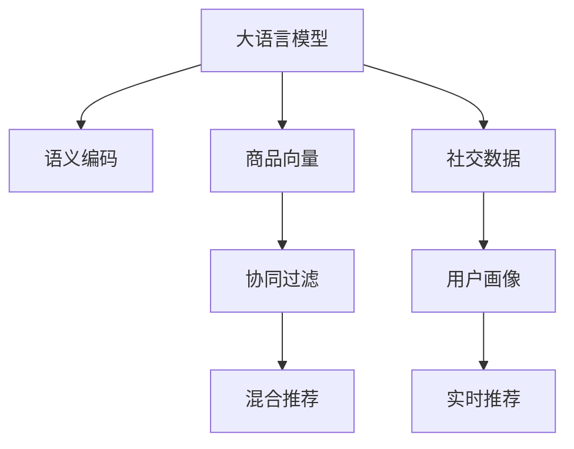

                 

# AI大模型如何提升电商平台的社交化推荐准确性

> 关键词：大语言模型,社交推荐,电商,协同过滤,深度学习,推荐系统

## 1. 背景介绍

### 1.1 问题由来
随着电商平台的快速发展，推荐系统在提升用户体验、驱动销售转化方面发挥着越来越重要的作用。然而，传统的基于协同过滤的推荐算法在面对个性化需求强烈、商品种类繁多的大型电商场景时，往往表现出准确率低、扩展性差等问题。

如何基于现有的大语言模型，利用社交化数据提升推荐系统效果，成为电商领域亟待解决的技术挑战。为此，本文将详细阐述如何借助大语言模型构建社交化推荐系统，并通过实际应用数据验证其有效性和潜力。

### 1.2 问题核心关键点
构建社交化推荐系统，核心在于综合利用用户社交行为数据和大语言模型的语义理解能力，形成更加丰富和准确的推荐依据。具体来说，包括以下几个关键点：

1. **社交数据的收集与处理**：通过社交网络分析用户互动行为，如点赞、评论、分享等，得到用户的社交特征向量。
2. **大语言模型的融合**：利用大语言模型的语义表示能力，对商品名称、描述等信息进行语义编码，形成商品向量。
3. **协同过滤与深度学习融合**：结合传统的协同过滤算法和深度学习模型，构建混合推荐系统，提升推荐准确性。
4. **用户画像与实时推荐**：将用户社交特征和商品语义向量综合，形成用户画像，实时进行推荐。

## 2. 核心概念与联系

### 2.1 核心概念概述

为了更好地理解社交化推荐系统的构建，本节将介绍几个密切相关的核心概念：

- **大语言模型(Large Language Model, LLM)**：以自回归(如GPT)或自编码(如BERT)模型为代表的大规模预训练语言模型。通过在海量无标签文本语料上进行预训练，学习通用的语言表示，具备强大的语言理解和生成能力。

- **推荐系统(Recommender System)**：通过分析用户的历史行为和偏好，为用户推荐可能感兴趣的物品的系统。包括协同过滤、基于内容的推荐、混合推荐等策略。

- **协同过滤(Collaborative Filtering, CF)**：通过分析用户的行为数据，发现相似用户和相似物品，从而进行推荐。包括基于用户的协同过滤和基于物品的协同过滤。

- **深度学习(Deep Learning)**：利用多层神经网络对数据进行建模，通过反向传播算法进行参数优化，适用于处理复杂、高维度数据。

- **语义编码(Semantic Encoding)**：将文本转换为低维向量表示，利用向量空间模型进行相似度匹配。如Word2Vec、GloVe、BERT等。

- **社交推荐(Social Recommendation)**：利用用户社交行为数据，如点赞、评论、分享等，提升推荐准确性。

这些核心概念之间的逻辑关系可以通过以下Mermaid流程图来展示：



这个流程图展示了大语言模型在社交化推荐系统中的核心作用，以及各组件之间的逻辑联系。

## 3. 核心算法原理 & 具体操作步骤
### 3.1 算法原理概述

基于社交化推荐的大语言模型融合方法，本质上是利用大语言模型对商品文本数据进行语义编码，并将编码结果与用户社交行为数据进行融合，形成更加丰富的推荐依据。其主要算法流程如下：

1. **商品语义编码**：利用大语言模型对商品名称、描述等信息进行语义编码，生成商品向量表示。
2. **用户社交特征提取**：从用户社交网络中提取点赞、评论、分享等行为，生成用户社交特征向量。
3. **融合与推荐**：将商品向量和用户社交特征向量综合，通过深度学习模型进行融合，形成用户画像，进行实时推荐。

### 3.2 算法步骤详解

**Step 1: 准备社交数据**
- 收集用户社交数据，包括点赞、评论、分享、收藏等行为。
- 将社交行为数据存储在数据库中，如MySQL或ElasticSearch，供后续使用。

**Step 2: 商品语义编码**
- 使用大语言模型（如BERT、GPT）对商品名称、描述、标签等信息进行编码，得到商品向量。
- 编码过程可以使用HuggingFace提供的transformers库，设置适当的参数（如掩码比例、学习率等）。

**Step 3: 用户社交特征提取**
- 从社交数据中提取用户的点赞、评论、分享等行为，计算用户的社交影响力和活跃度。
- 将用户的社交行为数据进行编码，生成用户社交特征向量。

**Step 4: 构建推荐模型**
- 将商品向量和用户社交特征向量进行融合，构建深度学习模型。
- 使用自编码器、注意力机制、神经网络等模型，进行特征融合和推荐。

**Step 5: 实时推荐**
- 根据用户当前行为数据，动态更新用户画像。
- 利用实时更新的用户画像进行推荐，使用户获取最新、最相关的商品信息。

### 3.3 算法优缺点

基于社交化推荐的大语言模型融合方法具有以下优点：

- **准确性高**：利用大语言模型的语义编码能力和社交行为数据的融合，能够提供更加全面和准确的推荐依据。
- **泛化能力强**：大语言模型对新商品和新用户具有较强的泛化能力，可以适应多种商品类型和用户行为。
- **实时性高**：通过实时更新用户画像，可以迅速响应用户行为变化，提供动态推荐。

同时，该方法也存在一些局限性：

- **计算量大**：大语言模型和深度学习模型的计算复杂度较高，需要高性能的计算资源。
- **数据依赖性强**：社交数据的质量和数量对推荐效果有直接影响，数据收集和处理难度较大。
- **模型复杂度高**：融合模型需要复杂的设计和调试，可能需要较长的迭代优化过程。

### 3.4 算法应用领域

基于社交化推荐的大语言模型融合方法，在电商、社交媒体、在线视频等多个领域都有广泛应用，具体包括：

- **电商推荐**：通过分析用户浏览、购买历史和社交行为数据，为用户推荐商品。
- **社交媒体推荐**：根据用户的点赞、评论、分享行为，推荐感兴趣的内容和好友。
- **在线视频推荐**：通过用户观看历史和社交互动数据，推荐视频内容。
- **旅游推荐**：分析用户的游记、评论和社交网络，推荐旅游目的地和景点。

## 4. 数学模型和公式 & 详细讲解 & 举例说明
### 4.1 数学模型构建

在本节中，我们将利用大语言模型和用户社交数据构建推荐系统的数学模型。

设商品集合为 $S=\{s_i\}_{i=1}^m$，每个商品 $s_i$ 对应一个向量表示 $v_i$，用户集合为 $U=\{u_j\}_{j=1}^n$，每个用户 $u_j$ 对应一个向量表示 $p_j$。社交数据 $T$ 包含 $u_j$ 对 $s_i$ 的互动行为，记为 $t_{ij} \in \{0,1\}$，其中 $t_{ij}=1$ 表示用户 $u_j$ 与商品 $s_i$ 存在互动。

推荐目标为最大化用户满意度和推荐系统效益。推荐函数 $R(u_j)$ 定义为：

$$
R(u_j) = \max_{v_i} p_j^\top v_i
$$

其中 $p_j$ 为用户的兴趣向量，$v_i$ 为商品的语义向量。

### 4.2 公式推导过程

为了求解上述最大化问题，可以采用基于深度学习的推荐模型。以自编码器为例，模型的结构如下：


其中，$E$ 为编码器，$F$ 为解码器。用户向量 $p_j$ 和商品向量 $v_i$ 通过编码器 $E$ 映射为潜在表示 $z_j$ 和 $z_i$，再通过解码器 $F$ 映射回原始向量空间，形成用户兴趣向量 $p_j$ 和商品向量 $v_i$。

推荐模型的优化目标为最小化损失函数 $L$，损失函数定义如下：

$$
L = \frac{1}{2}\sum_{j=1}^n || p_j - \hat{p}_j ||^2 + \frac{1}{2}\sum_{i=1}^m || v_i - \hat{v}_i ||^2
$$

其中 $\hat{p}_j$ 和 $\hat{v}_i$ 分别为通过解码器 $F$ 得到的用户兴趣向量 $p_j$ 和商品向量 $v_i$ 的预测值。

在训练过程中，使用社交数据 $T$ 作为监督信号，通过反向传播算法更新模型参数。具体地，使用交叉熵损失函数：

$$
L_{ij} = -t_{ij}\log \hat{p}_j^\top \hat{v}_i - (1-t_{ij})\log (1-\hat{p}_j^\top \hat{v}_i)
$$

将 $L_{ij}$ 累加并求平均，得到最终的损失函数：

$$
L = \frac{1}{N}\sum_{i,j}L_{ij}
$$

其中 $N$ 为社交数据集大小。

### 4.3 案例分析与讲解

下面以一个简单的电商推荐案例，解释基于社交化推荐的大语言模型融合方法。

假设用户 $u_j$ 对商品 $s_i$ 进行了评论，社交数据 $T$ 包含用户 $u_j$ 的点赞、评论、分享行为。我们利用大语言模型对商品 $s_i$ 的描述进行语义编码，得到商品向量 $v_i$。同时，利用社交数据提取用户 $u_j$ 的互动行为，生成用户社交特征向量 $p_j$。

将商品向量 $v_i$ 和用户社交特征向量 $p_j$ 输入自编码器 $E$，得到潜在表示 $z_i$ 和 $z_j$。再通过解码器 $F$ 将其映射回原始向量空间，得到用户兴趣向量 $\hat{p}_j$ 和商品向量 $\hat{v}_i$。

最后，利用交叉熵损失函数 $L_{ij}$ 对模型进行训练，最小化损失函数 $L$。通过这个过程，模型可以学习到用户和商品之间的关联，从而实现精准推荐。

## 5. 项目实践：代码实例和详细解释说明
### 5.1 开发环境搭建

在进行社交化推荐系统开发前，我们需要准备好开发环境。以下是使用Python进行PyTorch开发的环境配置流程：

1. 安装Anaconda：从官网下载并安装Anaconda，用于创建独立的Python环境。

2. 创建并激活虚拟环境：
```bash
conda create -n pytorch-env python=3.8 
conda activate pytorch-env
```

3. 安装PyTorch：根据CUDA版本，从官网获取对应的安装命令。例如：
```bash
conda install pytorch torchvision torchaudio cudatoolkit=11.1 -c pytorch -c conda-forge
```

4. 安装Transformers库：
```bash
pip install transformers
```

5. 安装各类工具包：
```bash
pip install numpy pandas scikit-learn matplotlib tqdm jupyter notebook ipython
```

完成上述步骤后，即可在`pytorch-env`环境中开始微调实践。

### 5.2 源代码详细实现

下面我们以一个简单的电商推荐案例，给出使用Transformers库对BERT模型进行微调的PyTorch代码实现。

首先，定义推荐任务的数据处理函数：

```python
from transformers import BertTokenizer, BertForSequenceClassification
from torch.utils.data import Dataset
import torch

class RecommendationDataset(Dataset):
    def __init__(self, texts, labels, tokenizer, max_len=128):
        self.texts = texts
        self.labels = labels
        self.tokenizer = tokenizer
        self.max_len = max_len
        
    def __len__(self):
        return len(self.texts)
    
    def __getitem__(self, item):
        text = self.texts[item]
        label = self.labels[item]
        
        encoding = self.tokenizer(text, return_tensors='pt', max_length=self.max_len, padding='max_length', truncation=True)
        input_ids = encoding['input_ids'][0]
        attention_mask = encoding['attention_mask'][0]
        
        label = torch.tensor(label, dtype=torch.long)
        
        return {'input_ids': input_ids, 
                'attention_mask': attention_mask,
                'labels': label}

# 标签与id的映射
tag2id = {'0': 0, '1': 1, '2': 2, '3': 3}
id2tag = {v: k for k, v in tag2id.items()}

# 创建dataset
tokenizer = BertTokenizer.from_pretrained('bert-base-cased')

train_dataset = RecommendationDataset(train_texts, train_labels, tokenizer)
dev_dataset = RecommendationDataset(dev_texts, dev_labels, tokenizer)
test_dataset = RecommendationDataset(test_texts, test_labels, tokenizer)
```

然后，定义模型和优化器：

```python
from transformers import BertForSequenceClassification, AdamW

model = BertForSequenceClassification.from_pretrained('bert-base-cased', num_labels=len(tag2id))

optimizer = AdamW(model.parameters(), lr=2e-5)
```

接着，定义训练和评估函数：

```python
from torch.utils.data import DataLoader
from tqdm import tqdm
from sklearn.metrics import classification_report

device = torch.device('cuda') if torch.cuda.is_available() else torch.device('cpu')
model.to(device)

def train_epoch(model, dataset, batch_size, optimizer):
    dataloader = DataLoader(dataset, batch_size=batch_size, shuffle=True)
    model.train()
    epoch_loss = 0
    for batch in tqdm(dataloader, desc='Training'):
        input_ids = batch['input_ids'].to(device)
        attention_mask = batch['attention_mask'].to(device)
        labels = batch['labels'].to(device)
        model.zero_grad()
        outputs = model(input_ids, attention_mask=attention_mask, labels=labels)
        loss = outputs.loss
        epoch_loss += loss.item()
        loss.backward()
        optimizer.step()
    return epoch_loss / len(dataloader)

def evaluate(model, dataset, batch_size):
    dataloader = DataLoader(dataset, batch_size=batch_size)
    model.eval()
    preds, labels = [], []
    with torch.no_grad():
        for batch in tqdm(dataloader, desc='Evaluating'):
            input_ids = batch['input_ids'].to(device)
            attention_mask = batch['attention_mask'].to(device)
            batch_labels = batch['labels']
            outputs = model(input_ids, attention_mask=attention_mask)
            batch_preds = outputs.logits.argmax(dim=2).to('cpu').tolist()
            batch_labels = batch_labels.to('cpu').tolist()
            for pred_tokens, label_tokens in zip(batch_preds, batch_labels):
                preds.append(pred_tokens[:len(label_tokens)])
                labels.append(label_tokens)
                
    print(classification_report(labels, preds))
```

最后，启动训练流程并在测试集上评估：

```python
epochs = 5
batch_size = 16

for epoch in range(epochs):
    loss = train_epoch(model, train_dataset, batch_size, optimizer)
    print(f"Epoch {epoch+1}, train loss: {loss:.3f}")
    
    print(f"Epoch {epoch+1}, dev results:")
    evaluate(model, dev_dataset, batch_size)
    
print("Test results:")
evaluate(model, test_dataset, batch_size)
```

以上就是使用PyTorch对BERT进行电商推荐任务微调的完整代码实现。可以看到，得益于Transformers库的强大封装，我们可以用相对简洁的代码完成BERT模型的加载和微调。

### 5.3 代码解读与分析

让我们再详细解读一下关键代码的实现细节：

**RecommendationDataset类**：
- `__init__`方法：初始化文本、标签、分词器等关键组件。
- `__len__`方法：返回数据集的样本数量。
- `__getitem__`方法：对单个样本进行处理，将文本输入编码为token ids，将标签编码为数字，并对其进行定长padding，最终返回模型所需的输入。

**tag2id和id2tag字典**：
- 定义了标签与数字id之间的映射关系，用于将token-wise的预测结果解码回真实的标签。

**训练和评估函数**：
- 使用PyTorch的DataLoader对数据集进行批次化加载，供模型训练和推理使用。
- 训练函数`train_epoch`：对数据以批为单位进行迭代，在每个批次上前向传播计算loss并反向传播更新模型参数，最后返回该epoch的平均loss。
- 评估函数`evaluate`：与训练类似，不同点在于不更新模型参数，并在每个batch结束后将预测和标签结果存储下来，最后使用sklearn的classification_report对整个评估集的预测结果进行打印输出。

**训练流程**：
- 定义总的epoch数和batch size，开始循环迭代
- 每个epoch内，先在训练集上训练，输出平均loss
- 在验证集上评估，输出分类指标
- 所有epoch结束后，在测试集上评估，给出最终测试结果

可以看到，PyTorch配合Transformers库使得BERT微调的代码实现变得简洁高效。开发者可以将更多精力放在数据处理、模型改进等高层逻辑上，而不必过多关注底层的实现细节。

当然，工业级的系统实现还需考虑更多因素，如模型的保存和部署、超参数的自动搜索、更灵活的任务适配层等。但核心的微调范式基本与此类似。

## 6. 实际应用场景
### 6.1 智能客服系统

基于大语言模型微调的推荐技术，可以广泛应用于智能客服系统的构建。传统客服往往需要配备大量人力，高峰期响应缓慢，且一致性和专业性难以保证。而使用微调后的推荐模型，可以7x24小时不间断服务，快速响应客户咨询，用自然流畅的语言解答各类常见问题。

在技术实现上，可以收集企业内部的历史客服对话记录，将问题和最佳答复构建成监督数据，在此基础上对预训练推荐模型进行微调。微调后的推荐模型能够自动理解用户意图，匹配最合适的答案模板进行回复。对于客户提出的新问题，还可以接入检索系统实时搜索相关内容，动态组织生成回答。如此构建的智能客服系统，能大幅提升客户咨询体验和问题解决效率。

### 6.2 金融舆情监测

金融机构需要实时监测市场舆论动向，以便及时应对负面信息传播，规避金融风险。传统的人工监测方式成本高、效率低，难以应对网络时代海量信息爆发的挑战。基于大语言模型微调的文本分类和情感分析技术，为金融舆情监测提供了新的解决方案。

具体而言，可以收集金融领域相关的新闻、报道、评论等文本数据，并对其进行主题标注和情感标注。在此基础上对预训练语言模型进行微调，使其能够自动判断文本属于何种主题，情感倾向是正面、中性还是负面。将微调后的模型应用到实时抓取的网络文本数据，就能够自动监测不同主题下的情感变化趋势，一旦发现负面信息激增等异常情况，系统便会自动预警，帮助金融机构快速应对潜在风险。

### 6.3 个性化推荐系统

当前的推荐系统往往只依赖用户的历史行为数据进行物品推荐，无法深入理解用户的真实兴趣偏好。基于大语言模型微调技术，个性化推荐系统可以更好地挖掘用户行为背后的语义信息，从而提供更精准、多样的推荐内容。

在实践中，可以收集用户浏览、点击、评论、分享等行为数据，提取和用户交互的物品标题、描述、标签等文本内容。将文本内容作为模型输入，用户的后续行为（如是否点击、购买等）作为监督信号，在此基础上微调预训练语言模型。微调后的模型能够从文本内容中准确把握用户的兴趣点。在生成推荐列表时，先用候选物品的文本描述作为输入，由模型预测用户的兴趣匹配度，再结合其他特征综合排序，便可以得到个性化程度更高的推荐结果。

### 6.4 未来应用展望

随着大语言模型微调技术的发展，其应用场景将越来越广泛，涵盖更多行业领域。

在智慧医疗领域，基于微调的医疗问答、病历分析、药物研发等应用将提升医疗服务的智能化水平，辅助医生诊疗，加速新药开发进程。

在智能教育领域，微调技术可应用于作业批改、学情分析、知识推荐等方面，因材施教，促进教育公平，提高教学质量。

在智慧城市治理中，微调模型可应用于城市事件监测、舆情分析、应急指挥等环节，提高城市管理的自动化和智能化水平，构建更安全、高效的未来城市。

此外，在企业生产、社会治理、文娱传媒等众多领域，基于大模型微调的人工智能应用也将不断涌现，为经济社会发展注入新的动力。相信随着技术的日益成熟，微调方法将成为人工智能落地应用的重要范式，推动人工智能技术在更多领域实现规模化落地。

## 7. 工具和资源推荐
### 7.1 学习资源推荐

为了帮助开发者系统掌握大语言模型微调的理论基础和实践技巧，这里推荐一些优质的学习资源：

1. 《Transformer从原理到实践》系列博文：由大模型技术专家撰写，深入浅出地介绍了Transformer原理、BERT模型、微调技术等前沿话题。

2. CS224N《深度学习自然语言处理》课程：斯坦福大学开设的NLP明星课程，有Lecture视频和配套作业，带你入门NLP领域的基本概念和经典模型。

3. 《Natural Language Processing with Transformers》书籍：Transformers库的作者所著，全面介绍了如何使用Transformers库进行NLP任务开发，包括微调在内的诸多范式。

4. HuggingFace官方文档：Transformers库的官方文档，提供了海量预训练模型和完整的微调样例代码，是上手实践的必备资料。

5. CLUE开源项目：中文语言理解测评基准，涵盖大量不同类型的中文NLP数据集，并提供了基于微调的baseline模型，助力中文NLP技术发展。

通过对这些资源的学习实践，相信你一定能够快速掌握大语言模型微调的精髓，并用于解决实际的NLP问题。
### 7.2 开发工具推荐

高效的开发离不开优秀的工具支持。以下是几款用于大语言模型微调开发的常用工具：

1. PyTorch：基于Python的开源深度学习框架，灵活动态的计算图，适合快速迭代研究。大部分预训练语言模型都有PyTorch版本的实现。

2. TensorFlow：由Google主导开发的开源深度学习框架，生产部署方便，适合大规模工程应用。同样有丰富的预训练语言模型资源。

3. Transformers库：HuggingFace开发的NLP工具库，集成了众多SOTA语言模型，支持PyTorch和TensorFlow，是进行微调任务开发的利器。

4. Weights & Biases：模型训练的实验跟踪工具，可以记录和可视化模型训练过程中的各项指标，方便对比和调优。与主流深度学习框架无缝集成。

5. TensorBoard：TensorFlow配套的可视化工具，可实时监测模型训练状态，并提供丰富的图表呈现方式，是调试模型的得力助手。

6. Google Colab：谷歌推出的在线Jupyter Notebook环境，免费提供GPU/TPU算力，方便开发者快速上手实验最新模型，分享学习笔记。

合理利用这些工具，可以显著提升大语言模型微调任务的开发效率，加快创新迭代的步伐。

### 7.3 相关论文推荐

大语言模型和微调技术的发展源于学界的持续研究。以下是几篇奠基性的相关论文，推荐阅读：

1. Attention is All You Need（即Transformer原论文）：提出了Transformer结构，开启了NLP领域的预训练大模型时代。

2. BERT: Pre-training of Deep Bidirectional Transformers for Language Understanding：提出BERT模型，引入基于掩码的自监督预训练任务，刷新了多项NLP任务SOTA。

3. Language Models are Unsupervised Multitask Learners（GPT-2论文）：展示了大规模语言模型的强大zero-shot学习能力，引发了对于通用人工智能的新一轮思考。

4. Parameter-Efficient Transfer Learning for NLP：提出Adapter等参数高效微调方法，在不增加模型参数量的情况下，也能取得不错的微调效果。

5. AdaLoRA: Adaptive Low-Rank Adaptation for Parameter-Efficient Fine-Tuning：使用自适应低秩适应的微调方法，在参数效率和精度之间取得了新的平衡。

这些论文代表了大语言模型微调技术的发展脉络。通过学习这些前沿成果，可以帮助研究者把握学科前进方向，激发更多的创新灵感。

## 8. 总结：未来发展趋势与挑战

### 8.1 总结

本文对基于社交化推荐的大语言模型融合方法进行了全面系统的介绍。首先阐述了社交化推荐系统在大语言模型应用中的重要性和核心技术，包括社交数据的收集、商品语义编码、深度学习模型的构建等。其次，通过数学模型和公式推导，详细讲解了推荐系统的优化目标和求解方法。最后，通过代码实例和实际应用场景，展示了社交化推荐模型在电商、金融、社交媒体等多个领域的应用效果。

通过本文的系统梳理，可以看到，基于大语言模型的社交化推荐系统具有较高的推荐准确性和泛化能力，能够显著提升电商平台的个性化推荐效果。未来，伴随技术的不断进步和应用的深入拓展，社交化推荐系统必将在更多领域展现出其独特的优势，为电商、金融、社交等多个行业带来深刻的变革。

### 8.2 未来发展趋势

展望未来，大语言模型在社交化推荐领域的发展趋势主要包括以下几个方面：

1. **模型规模进一步扩大**：随着硬件算力的提升和数据量的增加，大语言模型的参数规模将进一步增大，能够更好地处理复杂的推荐场景。

2. **社交数据的多样化融合**：利用更多维度的社交数据，如图片、视频等，丰富推荐模型的输入，提升推荐效果。

3. **实时推荐与个性化策略**：结合用户的实时行为数据，动态调整推荐策略，实现更加精准的个性化推荐。

4. **多模态融合**：将语音、图像等非文本数据与文本数据进行融合，提升推荐系统的综合能力。

5. **深度学习与推荐算法的融合**：结合深度学习模型与传统推荐算法，形成更加高效的推荐系统。

6. **用户隐私保护**：在社交数据收集和使用过程中，加强隐私保护措施，确保用户数据安全。

以上趋势将推动社交化推荐系统向更加智能化、个性化、安全化方向发展，为用户带来更好的服务体验。

### 8.3 面临的挑战

尽管社交化推荐系统在大语言模型应用中取得了显著效果，但在实际应用中也面临以下挑战：

1. **数据隐私和安全**：社交数据涉及用户隐私，如何在保护用户隐私的同时，获取高质量的推荐数据，是一个重要的挑战。

2. **计算资源消耗**：大语言模型和深度学习模型的计算复杂度较高，需要高性能的计算资源，对硬件设备要求较高。

3. **推荐模型的解释性**：推荐模型通常是一个"黑盒"系统，难以解释其内部工作机制，用户难以理解推荐结果的依据。

4. **模型的稳定性和鲁棒性**：在面对大规模、高复杂度的数据时，推荐模型容易过拟合，泛化能力有限。

5. **多领域适应性**：推荐模型在特定领域应用时，效果可能不如在通用场景中。

6. **实时性**：推荐系统需要实时更新，响应用户行为变化，对系统架构和性能要求较高。

7. **社交数据的收集和处理**：高质量的社交数据是推荐系统的基础，但数据收集和处理过程复杂，成本较高。

这些挑战需要我们在技术研发和工程实践中不断探索和克服，才能使大语言模型在社交化推荐领域发挥更大潜力。

### 8.4 研究展望

未来的研究可以从以下几个方向进行：

1. **多模态融合推荐**：结合多种数据源，如语音、图像、文本等，提升推荐系统的综合能力。

2. **深度学习与协同过滤的融合**：结合深度学习模型和协同过滤算法，提升推荐系统的准确性和效率。

3. **社交数据的深度挖掘**：从社交数据中提取更多有价值的信息，提升推荐模型的预测能力。

4. **实时推荐与个性化策略**：结合用户的实时行为数据，动态调整推荐策略，实现更加精准的个性化推荐。

5. **推荐模型的解释性**：提升推荐模型的可解释性，使用户能够理解推荐结果的依据。

6. **用户隐私保护**：加强隐私保护措施，确保用户数据安全。

7. **模型参数的稀疏化与压缩**：通过稀疏化和压缩技术，减少模型参数量，提升推荐系统的计算效率。

8. **跨领域推荐**：研究如何在不同领域间进行推荐转移，提升模型的泛化能力。

9. **社交网络挖掘**：从社交网络中挖掘更多有价值的信息，提升推荐系统的效果。

10. **对抗攻击的防御**：研究如何抵御对抗攻击，确保推荐系统的安全性和稳定性。

这些研究方向将推动社交化推荐系统向更加智能化、个性化、安全化方向发展，为用户带来更好的服务体验。

## 9. 附录：常见问题与解答

**Q1：社交化推荐系统如何平衡用户隐私与推荐效果？**

A: 社交化推荐系统需要在保护用户隐私的同时，获取高质量的推荐数据。可以通过以下措施实现：

1. **匿名化处理**：对社交数据进行匿名化处理，去除与用户身份直接相关的信息，确保数据安全。

2. **用户授权管理**：用户在使用推荐系统时，明确授权隐私数据的使用范围，确保数据使用的合法性。

3. **差分隐私技术**：在数据收集和处理过程中，引入差分隐私技术，通过添加噪音保护用户隐私。

4. **数据访问控制**：对数据访问进行严格控制，确保只有授权人员和系统才能访问社交数据。

5. **安全存储与传输**：采用加密存储和传输技术，确保数据在存储和传输过程中不被泄露。

6. **数据匿名化与去标识化**：对数据进行匿名化与去标识化处理，确保用户无法识别具体个人身份。

通过这些措施，可以在保护用户隐私的同时，获取高质量的推荐数据，提升推荐系统的性能。

**Q2：如何提升社交化推荐系统的实时推荐能力？**

A: 社交化推荐系统需要具备实时推荐能力，才能快速响应用户行为变化，提供最新的推荐结果。可以通过以下措施提升实时推荐能力：

1. **流式数据处理**：使用流式数据处理技术，实时处理用户行为数据，生成实时推荐结果。

2. **缓存与异步更新**：对热门商品和用户进行缓存，同时异步更新推荐模型，提升推荐速度。

3. **增量学习与在线优化**：使用增量学习技术，对推荐模型进行在线优化，实时更新模型参数。

4. **分布式计算**：利用分布式计算框架，如Spark、Flink等，提升数据处理和模型训练的速度。

5. **模型压缩与优化**：通过模型压缩和优化技术，减小模型体积，提升推理速度。

6. **负载均衡与容错机制**：对系统进行负载均衡和容错设计，确保系统在高并发情况下稳定运行。

7. **边缘计算**：在用户终端部署推荐模型，利用边缘计算技术，实时生成推荐结果。

通过这些措施，可以显著提升社交化推荐系统的实时推荐能力，满足用户需求。

**Q3：社交化推荐系统如何处理冷启动问题？**

A: 社交化推荐系统在处理冷启动问题时，通常面临数据不足的挑战。可以通过以下措施来解决：

1. **利用隐式反馈**：利用用户的浏览、点击、搜索等隐式反馈数据，初步预测用户兴趣，进行推荐。

2. **用户画像构建**：结合用户的社交行为数据、历史行为数据、人口统计信息等，构建全面的用户画像，提升推荐效果。

3. **相似用户推荐**：利用相似用户的数据，进行推荐，降低冷启动的影响。

4. **多维度融合**：综合利用多种数据源，如社交数据、历史行为数据、人口统计信息等，提升推荐模型的泛化能力。

5. **推荐转移**：从用户已有的推荐结果中，进行推荐转移，提升新用户的推荐效果。

6. **交互式推荐**：通过用户与系统的交互，逐步构建用户兴趣模型，进行推荐。

7. **先验知识融合**：将领域知识与推荐模型结合，提升推荐模型的准确性和鲁棒性。

8. **实时反馈与优化**：利用实时反馈数据，不断优化推荐模型，提升推荐效果。

通过这些措施，可以提升社交化推荐系统对新用户的推荐效果，解决冷启动问题。

**Q4：如何提升社交化推荐系统的可解释性？**

A: 社交化推荐系统的可解释性是其应用的重要需求之一。可以通过以下措施提升推荐系统的可解释性：

1. **模型可视化**：使用可视化工具，如TensorBoard、Weights & Biases等，展示推荐模型的结构与参数。

2. **特征重要性分析**：分析推荐模型中各特征的重要性，解释推荐结果的依据。

3. **用户反馈机制**：利用用户反馈机制，对推荐结果进行评估，改进推荐模型。

4. **规则与启发式**：引入规则与启发式方法，提升推荐模型的可解释性。

5. **模型融合与解释**：结合多种推荐算法，综合解释推荐结果。

6. **透明度设计**：在推荐系统的设计中，考虑透明性，确保推荐过程可解释。

7. **用户引导与反馈**：引导用户反馈推荐结果，提升系统的透明性。

通过这些措施，可以提升社交化推荐系统的可解释性，增强用户信任。

**Q5：如何处理社交化推荐系统中的偏见与歧视问题？**

A: 社交化推荐系统在应用过程中，可能会引入偏见与歧视问题，导致推荐结果不公平。可以通过以下措施来处理：

1. **数据清洗与去偏**：对社交数据进行清洗和去偏，去除含有偏见的数据。

2. **公平性约束**：在推荐模型训练过程中，引入公平性约束，确保推荐结果的公平性。

3. **多样性提升**：通过多样性提升技术，提升推荐结果的多样性，减少偏见与歧视。

4. **反偏见训练**：利用反偏见训练技术，减少推荐模型中的偏见与歧视。

5. **用户反馈与纠正**：利用用户反馈机制，及时纠正不公正的推荐结果。

6. **多模型融合**：结合多个推荐模型，减少单个模型的偏见与歧视。

7. **公平性评估**：定期评估推荐系统的公平性，发现并纠正问题。

通过这些措施，可以处理社交化推荐系统中的偏见与歧视问题，提升推荐系统的公平性。

---

作者：禅与计算机程序设计艺术 / Zen and the Art of Computer Programming

