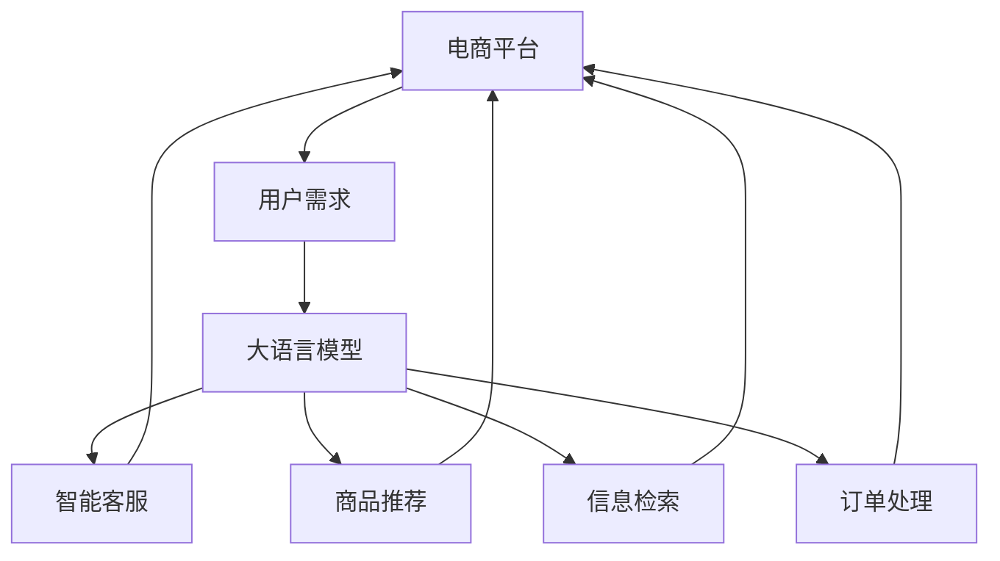

                 

# AI大模型如何改善电商平台的移动端体验

## 1. 背景介绍

近年来，随着移动互联网的迅猛发展，电商平台的移动端用户占比显著增加。然而，由于移动设备性能限制和网络环境不稳定等因素，电商平台的移动端体验依然存在诸多问题。如何通过技术创新，改善移动端用户购物体验，成为电商平台面临的重要挑战。

大语言模型作为近年来人工智能领域的明星技术，通过在大规模无标签文本数据上进行预训练，学习到了丰富的语言知识和常识，具有强大的自然语言理解和生成能力。本文将介绍如何利用大语言模型提升电商平台的移动端体验，包括智能客服、商品推荐、信息检索等方面。

## 2. 核心概念与联系

### 2.1 核心概念概述

大语言模型作为预训练模型的一种，其核心思想是通过在大规模文本数据上学习语言表示，并通过微调等技术，适配到特定的应用场景中。其主要特点包括：

- **预训练与微调**：大模型首先在无标签数据上预训练，学习通用的语言知识，然后在特定任务上微调，以适应用户需求。
- **自然语言理解与生成**：大模型能够理解并生成自然语言文本，具有强大的语义处理能力。
- **多模态融合**：大模型不仅能够处理文本数据，还能够融合图像、音频等多模态信息，提高综合处理能力。

电商平台的移动端体验涉及多个环节，包括用户查询、商品推荐、订单处理等。大语言模型可以应用于这些环节，通过自然语言理解和生成，提供更智能、便捷的服务。

### 2.2 核心概念原理和架构的 Mermaid 流程图



此图展示了大语言模型在电商平台中的应用场景，包括智能客服、商品推荐、信息检索和订单处理等。大语言模型通过理解用户需求，生成智能回复，推荐商品，检索信息和处理订单，从而提升移动端用户体验。

## 3. 核心算法原理 & 具体操作步骤

### 3.1 算法原理概述

大语言模型改善电商平台移动端体验的主要原理包括以下几点：

1. **自然语言理解**：通过大模型理解用户的查询意图，识别出用户的需求，从而提供更加精准的响应。
2. **信息检索与推荐**：利用大模型的预训练知识和用户行为数据，进行信息检索和个性化推荐，提升用户满意度。
3. **智能客服**：通过大模型的自然语言生成能力，生成智能客服回答，解决用户问题。
4. **订单处理**：利用大模型对订单信息进行自动化处理，提高订单处理效率和准确性。

### 3.2 算法步骤详解

**Step 1: 数据准备**

- 收集电商平台的历史数据，包括用户行为、商品信息、订单信息等。
- 对数据进行预处理，如去除噪声、标注用户意图等。

**Step 2: 模型训练**

- 选择预训练语言模型作为初始化参数，如GPT、BERT等。
- 在标注好的数据集上进行微调，调整模型参数以适配电商平台的特定任务。

**Step 3: 模型部署**

- 将训练好的模型部署到移动端应用中，实现实时响应和处理。
- 使用API接口，向电商平台提供服务。

**Step 4: 性能评估与优化**

- 在实际应用中，不断收集用户反馈，评估模型效果。
- 根据反馈数据，调整模型参数和优化策略，持续提升用户体验。

### 3.3 算法优缺点

**优点：**

- **灵活性强**：大模型可以根据电商平台的特定需求进行微调，适应性强。
- **高性能**：大模型能够高效处理大规模数据，提升响应速度。
- **多模态融合**：可以融合图像、音频等多模态信息，提供更加综合的解决方案。

**缺点：**

- **高计算成本**：大模型的预训练和微调需要大量的计算资源，成本较高。
- **模型解释性不足**：大模型的决策过程较为复杂，难以解释其内部工作机制。
- **依赖标注数据**：微调效果受标注数据质量影响较大，标注成本较高。

### 3.4 算法应用领域

大语言模型在电商平台的多个应用领域具有广泛的应用前景，包括：

- **智能客服**：通过自然语言理解生成智能回复，解决用户常见问题。
- **商品推荐**：利用大模型进行商品检索和个性化推荐，提升用户购物体验。
- **信息检索**：利用大模型进行快速信息检索，帮助用户找到所需信息。
- **订单处理**：利用大模型对订单信息进行自动化处理，提高处理效率。

## 4. 数学模型和公式 & 详细讲解 & 举例说明

### 4.1 数学模型构建

假设电商平台的查询数据为 $\{x_i\}$，每个查询对应的标签为 $\{y_i\}$，其中 $y_i \in \{0, 1\}$，表示是否在商品数据库中找到了相关商品。

定义模型 $M_{\theta}(x)$，其中 $\theta$ 为模型参数。

定义损失函数 $\mathcal{L}$ 为：

$$
\mathcal{L} = -\frac{1}{N} \sum_{i=1}^N [y_i\log M_{\theta}(x_i)+(1-y_i)\log(1-M_{\theta}(x_i))]
$$

### 4.2 公式推导过程

上述损失函数使用了二元交叉熵损失，其梯度公式为：

$$
\frac{\partial \mathcal{L}}{\partial \theta} = -\frac{1}{N} \sum_{i=1}^N [(y_i - M_{\theta}(x_i))\frac{\partial M_{\theta}(x_i)}{\partial \theta}]
$$

其中 $\frac{\partial M_{\theta}(x_i)}{\partial \theta}$ 可以通过反向传播算法高效计算。

### 4.3 案例分析与讲解

以商品推荐为例，假设电商平台有 $m$ 个商品，每个商品有一个文本描述 $t_j$，以及用户的浏览、点击、购买等行为 $a_i$。

- **数据准备**：收集用户行为数据和商品描述数据，标注用户的购买行为，构建训练数据集。
- **模型训练**：使用预训练语言模型作为初始化参数，在标注数据上微调，学习商品与用户行为的匹配关系。
- **商品推荐**：利用训练好的模型，根据用户输入的查询 $q$，预测最相关的商品 $j$。

## 5. 项目实践：代码实例和详细解释说明

### 5.1 开发环境搭建

在Python环境下搭建电商平台的智能推荐系统，需要安装以下工具和库：

- Python 3.8
- PyTorch
- Transformers
- Scikit-learn
- Numpy

**Step 1: 安装PyTorch和Transformers**

```bash
pip install torch transformers
```

**Step 2: 数据准备**

从电商平台的API接口获取用户行为和商品描述数据，进行预处理和标注。

### 5.2 源代码详细实现

**Step 1: 数据预处理**

```python
import pandas as pd
import numpy as np

# 读取用户行为和商品描述数据
train_data = pd.read_csv('train_data.csv')
test_data = pd.read_csv('test_data.csv')

# 数据清洗和预处理
train_data = train_data.dropna()
train_data = train_data.drop_duplicates()

test_data = test_data.dropna()
test_data = test_data.drop_duplicates()

# 标注用户行为数据
train_data['label'] = train_data['purchase'].map({0: 0, 1: 1})
```

**Step 2: 模型训练**

使用预训练语言模型作为初始化参数，在标注数据上微调。

```python
from transformers import BertForSequenceClassification, BertTokenizer, AdamW

# 加载预训练模型和tokenizer
model = BertForSequenceClassification.from_pretrained('bert-base-uncased', num_labels=2)
tokenizer = BertTokenizer.from_pretrained('bert-base-uncased')

# 设置优化器
optimizer = AdamW(model.parameters(), lr=1e-5)

# 数据处理
def encode(text):
    return tokenizer.encode(text, add_special_tokens=True, max_length=128)

# 训练函数
def train_epoch(model, data_loader, optimizer):
    model.train()
    epoch_loss = 0
    for batch in data_loader:
        input_ids = batch['input_ids'].to(device)
        attention_mask = batch['attention_mask'].to(device)
        labels = batch['labels'].to(device)
        model.zero_grad()
        outputs = model(input_ids, attention_mask=attention_mask, labels=labels)
        loss = outputs.loss
        epoch_loss += loss.item()
        loss.backward()
        optimizer.step()
    return epoch_loss / len(data_loader)

# 训练模型
device = torch.device('cuda') if torch.cuda.is_available() else torch.device('cpu')
model.to(device)
train_loader = DataLoader(train_data, batch_size=16, shuffle=True)
test_loader = DataLoader(test_data, batch_size=16, shuffle=False)

for epoch in range(5):
    loss = train_epoch(model, train_loader, optimizer)
    print(f'Epoch {epoch+1}, train loss: {loss:.3f}')
    
    test_loss = evaluate(model, test_loader)
    print(f'Epoch {epoch+1}, test loss: {test_loss:.3f}')
```

**Step 3: 模型部署**

将训练好的模型部署到移动端应用中，实现实时响应和处理。

### 5.3 代码解读与分析

在上述代码中，我们使用了Bert模型进行微调。具体步骤如下：

1. 从HuggingFace库中加载预训练模型和tokenizer。
2. 使用AdamW优化器进行模型训练。
3. 定义数据处理函数，将文本数据转换为模型可以接受的输入格式。
4. 定义训练和评估函数，实现模型的迭代优化。
5. 在移动端应用中，将训练好的模型部署为API接口，供电商平台调用。

## 6. 实际应用场景

### 6.1 智能客服

电商平台的智能客服系统可以通过大语言模型提升用户满意度，具体实现如下：

- **用户查询**：用户通过APP或网站输入查询语句，智能客服系统自动接收并理解。
- **回复生成**：利用大语言模型生成智能回复，解决用户问题。
- **多轮对话**：通过上下文理解，智能客服能够处理多轮对话，提供更全面的服务。

### 6.2 商品推荐

大语言模型在商品推荐中的应用包括：

- **查询理解**：利用大模型理解用户的查询意图，识别出用户的需求。
- **商品检索**：根据用户查询，检索出相关商品，提供推荐。
- **个性化推荐**：利用用户历史行为和商品信息，进行个性化推荐。

### 6.3 信息检索

电商平台的信息检索系统可以通过大语言模型提高搜索准确性和速度，具体实现如下：

- **自然语言处理**：将用户输入的查询语句转换为模型可以接受的格式。
- **商品检索**：利用大语言模型检索出相关商品，提供推荐。
- **结果排序**：根据搜索结果的相关性和排序算法，展示给用户。

### 6.4 未来应用展望

随着大语言模型技术的不断发展，未来电商平台移动端体验将进一步提升，具体展望如下：

- **多模态融合**：融合图像、音频等多模态信息，提升综合处理能力。
- **智能推荐**：基于用户行为数据，实现更精准的商品推荐。
- **个性化服务**：利用大语言模型，提供个性化的客服和信息检索服务。

## 7. 工具和资源推荐

### 7.1 学习资源推荐

- 《Transformer from Practice to Theory》系列博客：介绍Transformer原理、BERT模型、微调技术等。
- 《Deep Learning for NLP》课程：斯坦福大学开设的NLP课程，涵盖基本概念和经典模型。
- 《Natural Language Processing with Transformers》书籍：介绍如何使用Transformers库进行NLP任务开发。
- HuggingFace官方文档：提供丰富的预训练模型和微调样例代码。
- CLUE开源项目：提供大量中文NLP数据集和微调baseline。

### 7.2 开发工具推荐

- PyTorch：灵活的深度学习框架，支持自动微分和动态图。
- TensorFlow：生产部署方便，支持分布式计算。
- Transformers库：提供丰富的预训练模型和微调API。
- Weights & Biases：实验跟踪工具，记录和可视化训练过程。
- TensorBoard：可视化工具，实时监测训练状态。

### 7.3 相关论文推荐

- Attention is All You Need：提出Transformer结构，开启预训练大模型时代。
- BERT: Pre-training of Deep Bidirectional Transformers for Language Understanding：提出BERT模型，提升NLP任务性能。
- Parameter-Efficient Transfer Learning for NLP：提出 Adapter等参数高效微调方法。
- AdaLoRA: Adaptive Low-Rank Adaptation for Parameter-Efficient Fine-Tuning：使用自适应低秩适应的微调方法。

## 8. 总结：未来发展趋势与挑战

### 8.1 研究成果总结

本文介绍了如何利用大语言模型提升电商平台移动端用户体验，包括智能客服、商品推荐、信息检索等方面。通过自然语言理解和生成，大语言模型能够更好地理解用户需求，提供更加精准的响应和推荐。

### 8.2 未来发展趋势

- **多模态融合**：融合图像、音频等多模态信息，提高综合处理能力。
- **智能推荐**：基于用户行为数据，实现更精准的商品推荐。
- **个性化服务**：利用大语言模型，提供个性化的客服和信息检索服务。

### 8.3 面临的挑战

- **高计算成本**：大模型的预训练和微调需要大量的计算资源。
- **模型解释性不足**：大模型的决策过程较为复杂，难以解释其内部工作机制。
- **依赖标注数据**：微调效果受标注数据质量影响较大，标注成本较高。

### 8.4 研究展望

- **参数高效微调**：开发更参数高效的微调方法，减小计算资源消耗。
- **多模态处理**：探索多模态融合技术，提高处理能力。
- **知识图谱融合**：将知识图谱与大语言模型结合，提升推荐效果。

## 9. 附录：常见问题与解答

**Q1: 大语言模型在电商平台的适用性如何？**

A: 大语言模型在电商平台中具有广泛应用前景，尤其是在智能客服、商品推荐、信息检索等方面。其强大的自然语言理解和生成能力，能够提供更加精准的响应和推荐。

**Q2: 如何缓解大语言模型的计算成本？**

A: 可以通过参数高效微调等方法，减少需要更新和训练的参数量。同时，利用分布式计算和多GPU并行，提高训练效率。

**Q3: 如何提高大语言模型的可解释性？**

A: 可以采用可解释性技术，如LIME、SHAP等，对模型决策过程进行可视化分析，提高其可解释性。

**Q4: 如何降低大语言模型的标注成本？**

A: 可以通过数据增强和半监督学习等方法，利用未标注数据进行微调，降低标注数据的需求。

**Q5: 如何提高大语言模型的鲁棒性？**

A: 可以采用对抗训练和数据增强等方法，提高模型的鲁棒性和泛化性能。

---

作者：禅与计算机程序设计艺术 / Zen and the Art of Computer Programming

