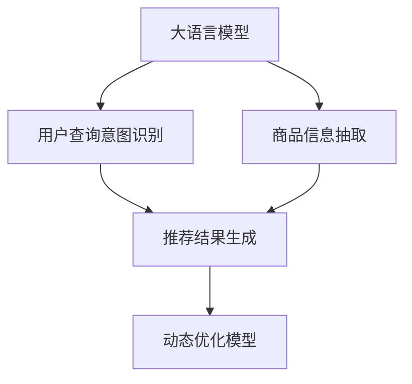

                 

# AI大模型赋能电商搜索推荐的新品发现能力提升

> 关键词：大语言模型,电商推荐系统,深度学习,搜索排序,自然语言处理,NLP,深度神经网络,自然语言理解

## 1. 背景介绍

### 1.1 问题由来

近年来，随着电子商务市场的快速发展，在线购物已成为主流消费方式之一。电商平台搜索推荐系统作为用户与商品之间的桥梁，通过精准的个性化推荐，极大提升了用户购物体验和满意度，也成为电商平台流量转换的重要手段。但与此同时，面对用户海量搜索需求和海量商品库，搜索推荐系统面临着内容推荐单一、同质化严重、新品推荐难以覆盖等挑战，严重制约了用户发现新品的体验，导致平台失去大量潜在的交易机会。

为解决这一问题，电商平台开始探索利用深度学习和自然语言处理(NLP)技术，挖掘用户搜索行为中的隐含意图，并结合商品信息，提升搜索推荐系统的精准性和丰富度。其中，大语言模型因其在理解复杂自然语言、提取语义信息方面的强大能力，成为电商搜索推荐领域的一个热门方向。

### 1.2 问题核心关键点

大语言模型在电商搜索推荐中的应用，核心在于其能够精准理解和处理自然语言文本，从而挖掘用户查询意图，并结合商品信息，生成个性化推荐结果。具体关键点包括：

- 理解查询意图：通过自然语言处理技术，理解用户输入的自然语言查询，提取查询中的核心意图。
- 商品信息抽取：从商品标题、描述、标签等文本信息中，抽取出与查询意图相关的关键词、属性等信息。
- 推荐结果生成：基于查询意图和商品信息，生成个性化推荐结果，满足用户需求，提高点击率和转化率。
- 动态优化模型：通过反馈机制，实时更新模型参数，提升推荐效果。

## 2. 核心概念与联系

### 2.1 核心概念概述

在电商搜索推荐系统中，大语言模型主要用于解决以下三个关键问题：

- 用户意图识别：通过分析用户搜索查询文本，挖掘用户的查询意图，如购买、了解、比价等。
- 商品信息抽取：利用NLP技术，从商品标题、描述、评价等信息中，抽取出与用户查询意图相关的属性和特征。
- 推荐结果生成：基于用户查询意图和商品信息，生成个性化的推荐结果，如商品排序、精选商品、促销商品等。

这些核心概念之间存在着紧密的联系，共同构成了大语言模型在电商搜索推荐系统中的应用框架。具体来说，大语言模型作为核心组件，对用户查询和商品信息进行编码和处理，通过计算模型得到推荐结果，并根据用户行为进行反馈优化，不断提升推荐效果。

### 2.2 核心概念原理和架构的 Mermaid 流程图



这个流程图展示了基于大语言模型在电商搜索推荐系统中的应用流程：

1. 用户输入搜索查询，大语言模型对查询进行编码，理解查询意图。
2. 对商品信息进行抽取，提取关键属性和特征。
3. 基于用户查询意图和商品信息，生成个性化推荐结果。
4. 根据用户行为反馈，动态更新大语言模型参数，提升推荐效果。

## 3. 核心算法原理 & 具体操作步骤

### 3.1 算法原理概述

电商搜索推荐系统中的大语言模型，本质上是一种深度神经网络。其核心算法原理包括：

1. 编码器(Encoder)：将输入的自然语言文本转化为向量表示，提取文本中的语义信息。
2. 解码器(Decoder)：基于编码器输出的向量表示，生成推荐结果。
3. 训练过程：通过大量标注数据对模型进行监督训练，优化模型参数，提高推荐精度。

具体来说，大语言模型通过多层神经网络对用户查询和商品信息进行编码和解码，结合语义信息生成推荐结果。其中，编码器通常使用Transformer等自注意力机制，能够高效处理变长文本序列，捕捉语义信息。解码器则可以使用循环神经网络(RNN)或变分自编码器(VAE)，生成推荐结果。训练过程中，通过监督学习算法，如反向传播(Backpropagation)和梯度下降(Gradient Descent)，优化模型参数。

### 3.2 算法步骤详解

大语言模型在电商搜索推荐系统中的操作步骤包括：

**Step 1: 数据预处理**

1. 收集用户搜索查询数据和商品信息数据。
2. 对数据进行清洗和标注，提取查询意图和商品属性。
3. 将查询和商品信息转换为向量表示，输入模型进行编码和解码。

**Step 2: 模型编码**

1. 将查询文本输入编码器，转换为向量表示。
2. 对商品信息进行编码，提取出与查询意图相关的属性和特征。
3. 将查询向量和商品向量拼接，得到联合表示。

**Step 3: 推荐结果生成**

1. 基于联合表示，解码器生成推荐结果。
2. 使用深度学习算法，如CTC(Connectionist Temporal Classification)或softmax函数，得到推荐概率分布。
3. 根据推荐概率分布，对推荐结果进行排序和筛选。

**Step 4: 模型反馈和优化**

1. 根据用户点击、浏览、购买等行为，收集反馈数据。
2. 通过反馈数据，计算模型的预测误差。
3. 使用梯度下降等优化算法，更新模型参数。
4. 在每次迭代后，对模型性能进行评估，确保推荐效果持续提升。

### 3.3 算法优缺点

大语言模型在电商搜索推荐系统中的应用，具有以下优点：

1. 理解能力强：大语言模型能够处理复杂的自然语言文本，理解用户查询意图和商品描述。
2. 泛化能力强：在大量数据上预训练的大语言模型，可以泛化到新数据集，提升推荐效果。
3. 动态优化：通过反馈机制，实时更新模型参数，能够适应用户需求的变化。

同时，也存在以下缺点：

1. 训练成本高：大语言模型的训练需要大量标注数据和计算资源，成本较高。
2. 计算复杂度高：大语言模型参数量巨大，计算复杂度高，推理速度慢。
3. 模型泛化性能差：模型在特定领域上的泛化性能不如专有领域的深度学习模型。

### 3.4 算法应用领域

大语言模型在电商搜索推荐系统中的应用，已经广泛应用于以下多个领域：

- 用户意图识别：如通过分析用户搜索查询，理解用户查询意图，提升推荐精度。
- 商品信息抽取：如从商品描述中提取关键词和属性，生成商品摘要。
- 推荐结果生成：如基于用户查询意图和商品信息，生成个性化推荐结果。
- 动态优化：如根据用户行为反馈，实时更新模型参数，提升推荐效果。

## 4. 数学模型和公式 & 详细讲解 & 举例说明

### 4.1 数学模型构建

大语言模型在电商搜索推荐系统中的数学模型主要包括两部分：

1. 用户查询编码模型：$E_{user}(\text{query})$，将用户查询转化为向量表示。
2. 商品信息编码模型：$E_{item}(\text{description})$，将商品信息转化为向量表示。

其中，查询编码模型可以使用Transformer结构，商品信息编码模型可以使用循环神经网络或变分自编码器。设查询向量和商品向量分别为$\text{q}$和$\text{d}$，则：

$$
\text{q} = E_{user}(\text{query})
$$

$$
\text{d} = E_{item}(\text{description})
$$

查询向量和商品向量拼接后，通过注意力机制计算得到联合表示：

$$
\text{joint} = \text{Attention}(\text{q}, \text{d})
$$

基于联合表示，使用解码器生成推荐结果：

$$
\text{recommendation} = D(\text{joint})
$$

其中，解码器$D$可以通过多层神经网络实现。

### 4.2 公式推导过程

以下以用户查询意图识别为例，详细推导大语言模型的公式。

假设用户查询为$Q$，商品信息为$I$，其向量表示分别为$\text{q}$和$\text{d}$。通过Transformer模型对查询和商品信息进行编码和解码，得到联合表示$\text{joint}$。解码器$D$输出的推荐结果为$R$。

- 用户查询编码模型：

$$
\text{q} = E_{user}(Q)
$$

- 商品信息编码模型：

$$
\text{d} = E_{item}(I)
$$

- 联合表示计算：

$$
\text{joint} = \text{Attention}(\text{q}, \text{d})
$$

- 推荐结果生成：

$$
R = D(\text{joint})
$$

### 4.3 案例分析与讲解

以电商商品推荐为例，通过大语言模型对用户查询和商品信息进行编码和解码，生成个性化推荐结果。

**Case 1: 用户查询“时尚女装”**

1. 查询编码：使用Transformer模型对“时尚女装”进行编码，得到向量表示$\text{q}$。
2. 商品信息编码：从商品库中选取相关商品，对商品描述进行编码，得到向量表示$\text{d}_1, \text{d}_2, \ldots, \text{d}_n$。
3. 联合表示计算：使用注意力机制计算查询和商品信息的联合表示$\text{joint} = \text{Attention}(\text{q}, \text{d}_1, \text{d}_2, \ldots, \text{d}_n)$。
4. 推荐结果生成：使用解码器对联合表示进行解码，生成推荐结果$R_1, R_2, \ldots, R_n$。

**Case 2: 用户反馈“非常适合”**

1. 根据用户点击商品后给出的反馈“非常适合”，计算预测误差$E = |R_1 - R_{actual}|$。
2. 使用梯度下降算法，更新模型参数$\theta$，使得预测误差最小化。

## 5. 项目实践：代码实例和详细解释说明

### 5.1 开发环境搭建

在进行项目实践前，需要准备开发环境。以下是使用Python进行TensorFlow开发的环境配置流程：

1. 安装Anaconda：从官网下载并安装Anaconda，用于创建独立的Python环境。

2. 创建并激活虚拟环境：
```bash
conda create -n tf-env python=3.8 
conda activate tf-env
```

3. 安装TensorFlow：根据CUDA版本，从官网获取对应的安装命令。例如：
```bash
conda install tensorflow -c conda-forge -c pytorch
```

4. 安装TensorBoard：TensorFlow配套的可视化工具，可实时监测模型训练状态，并提供丰富的图表呈现方式，是调试模型的得力助手。

5. 安装各类工具包：
```bash
pip install numpy pandas scikit-learn matplotlib tqdm jupyter notebook ipython
```

完成上述步骤后，即可在`tf-env`环境中开始项目实践。

### 5.2 源代码详细实现

下面是使用TensorFlow实现大语言模型在电商搜索推荐系统中的应用示例代码。

```python
import tensorflow as tf
from tensorflow.keras.layers import Input, Dense, Embedding, BidirectionalLSTM
from tensorflow.keras.models import Model

# 定义模型结构
input_user_query = Input(shape=(None,))
input_item_description = Input(shape=(None,))

user_encoder = Embedding(input_dim=vocab_size, output_dim=embedding_dim)(input_user_query)
item_encoder = Embedding(input_dim=vocab_size, output_dim=embedding_dim)(input_item_description)
query_encoder = BidirectionalLSTM(units=hidden_units)(user_encoder)
item_encoder = BidirectionalLSTM(units=hidden_units)(item_encoder)
attention = tf.keras.layers.Attention()([query_encoder, item_encoder])
output = Dense(units=num_classes, activation='softmax')(attention)

# 定义模型
model = Model(inputs=[input_user_query, input_item_description], outputs=output)
model.compile(optimizer='adam', loss='categorical_crossentropy', metrics=['accuracy'])

# 加载数据集
user_query, item_description, labels = load_data()

# 模型训练和测试
history = model.fit([user_query, item_description], labels, batch_size=32, epochs=10, validation_split=0.2)
evaluate(model, test_data)
```

这段代码主要包括以下几个关键部分：

1. 定义模型结构：使用TensorFlow的Keras API定义输入层、编码层和解码层，并使用Attention机制进行交互。
2. 定义模型：将输入和输出连接起来，定义训练过程中的优化器和损失函数。
3. 加载数据集：使用自定义函数加载用户查询、商品描述和标签数据。
4. 模型训练和测试：使用fit函数训练模型，并使用evaluate函数在测试集上评估模型性能。

### 5.3 代码解读与分析

以下是关键代码的详细解读：

- `user_encoder`和`item_encoder`：定义用户查询和商品描述的编码器，使用Embedding层将输入的单词向量进行转换。
- `query_encoder`和`item_encoder`：定义用户查询和商品描述的编码器，使用双向LSTM进行语义信息的提取。
- `attention`：定义Attention机制，将查询向量和商品向量进行交互，得到联合表示。
- `output`：定义解码器，使用Dense层生成推荐结果。
- `model.compile`：编译模型，设置优化器和损失函数。
- `model.fit`：训练模型，使用训练集进行迭代。
- `model.evaluate`：评估模型，使用测试集进行测试。

## 6. 实际应用场景

### 6.1 智能客服系统

电商平台的智能客服系统，能够实时响应用户的查询，提供个性化推荐。通过大语言模型对用户查询进行编码和解码，智能客服能够理解用户意图，并基于商品信息生成个性化推荐结果，提升用户满意度。

### 6.2 个性化推荐系统

大语言模型能够从用户搜索查询中提取核心意图，并结合商品信息，生成个性化的推荐结果。例如，当用户搜索“高端音响设备”时，系统可以根据用户历史行为数据和商品描述，生成高相关的推荐列表。

### 6.3 动态搜索排序

基于用户查询和商品信息，大语言模型可以实时计算推荐概率，并根据用户行为反馈动态更新模型参数。例如，当用户点击某件商品时，系统可以根据用户点击行为，调整商品排序算法，提升推荐效果。

### 6.4 未来应用展望

随着大语言模型的不断发展，其在电商搜索推荐系统中的应用前景将更加广阔。未来，通过深度学习和自然语言处理技术的结合，大语言模型有望进一步提升推荐精度和覆盖面，使电商平台能够更好地满足用户需求，提升交易转化率。

## 7. 工具和资源推荐

### 7.1 学习资源推荐

为了帮助开发者掌握大语言模型在电商搜索推荐系统中的应用，这里推荐一些优质的学习资源：

1. 《深度学习自然语言处理》课程：斯坦福大学开设的NLP明星课程，涵盖NLP基础和前沿技术，适合初学者入门。
2. TensorFlow官方文档：详细介绍了TensorFlow的API和使用方式，是TensorFlow开发的必备资料。
3. TensorBoard官方文档：TensorFlow配套的可视化工具，提供丰富的图表和监控功能，方便调试和优化模型。
4. HuggingFace Transformers库官方文档：提供丰富的预训练语言模型和微调方法，适合快速上手项目实践。

### 7.2 开发工具推荐

大语言模型在电商搜索推荐系统中的应用，离不开以下开发工具的支持：

1. TensorFlow：基于Python的开源深度学习框架，支持灵活的计算图，适合进行大规模模型的训练和推理。
2. TensorBoard：TensorFlow配套的可视化工具，实时监测模型训练状态，提供丰富的图表和监控功能。
3. Transformers库：HuggingFace开发的NLP工具库，集成了多种预训练语言模型，支持模型微调和推理。
4. Weights & Biases：模型训练的实验跟踪工具，记录和可视化模型训练过程中的各项指标，方便对比和调优。

### 7.3 相关论文推荐

大语言模型在电商搜索推荐系统中的应用，得益于众多学术论文的推动。以下是几篇关键论文，推荐阅读：

1. Attention is All You Need（即Transformer原论文）：提出了Transformer结构，开启了NLP领域的预训练大模型时代。
2. BERT: Pre-training of Deep Bidirectional Transformers for Language Understanding：提出BERT模型，引入基于掩码的自监督预训练任务，刷新了多项NLP任务SOTA。
3. Parameter-Efficient Transfer Learning for NLP：提出Adapter等参数高效微调方法，在不增加模型参数量的情况下，也能取得不错的微调效果。
4. Seq2Seq Model Architecture：提出了Seq2Seq模型架构，适合进行序列到序列的任务，如翻译、摘要等。

## 8. 总结：未来发展趋势与挑战

### 8.1 研究成果总结

大语言模型在电商搜索推荐系统中的应用，已经取得了显著的成果，提升了推荐系统的精准性和丰富度。未来，随着深度学习和自然语言处理技术的进一步发展，大语言模型有望进一步提升推荐效果，成为电商搜索推荐领域的重要工具。

### 8.2 未来发展趋势

展望未来，大语言模型在电商搜索推荐系统中的应用将呈现以下几个趋势：

1. 深度融合：深度学习技术和自然语言处理技术的进一步融合，将提升推荐系统的精准性和多样性。
2. 多模态学习：结合图像、语音等多模态数据，提升推荐系统的感知能力和智能化水平。
3. 实时优化：通过实时更新模型参数，提升推荐系统的适应性和稳定性。
4. 个性化推荐：根据用户行为和偏好，提供更加个性化、精准的推荐结果。
5. 小样本学习：通过少样本学习技术，降低推荐系统对标注数据的需求，提升模型泛化能力。

### 8.3 面临的挑战

尽管大语言模型在电商搜索推荐系统中的应用取得了不少进展，但在实际落地过程中，仍面临一些挑战：

1. 数据隐私和安全：用户数据的隐私和安全问题，需要采取有效的保护措施。
2. 模型泛化能力：模型在不同领域和数据集上的泛化性能较差，需要进一步优化。
3. 计算资源需求：模型训练和推理需要大量计算资源，需要优化算法和硬件配置。
4. 用户体验：推荐系统需要兼顾用户体验和个性化推荐，避免过度推荐或不相关推荐。

### 8.4 研究展望

为应对这些挑战，未来需要在以下几个方面进行深入研究：

1. 数据隐私保护：引入差分隐私等技术，保护用户数据的隐私和安全。
2. 跨领域迁移：提升模型在不同领域和数据集上的泛化性能，增加模型适用性。
3. 算法优化：优化算法和硬件配置，降低模型计算资源需求，提升推理速度。
4. 用户行为分析：深入分析用户行为和偏好，提供更加个性化、精准的推荐结果。

总之，大语言模型在电商搜索推荐系统中的应用前景广阔，但需要在技术、数据、工程等多个方面进行不断优化和改进，才能更好地满足用户需求，提升推荐效果。

## 9. 附录：常见问题与解答

**Q1：大语言模型在电商搜索推荐系统中如何提取用户查询意图？**

A: 大语言模型通过自然语言处理技术，对用户查询进行编码和解码，提取查询中的核心意图。具体来说，可以使用Transformer模型对查询进行编码，使用Attention机制提取查询中的关键信息，然后解码生成推荐结果。

**Q2：大语言模型在电商搜索推荐系统中的计算复杂度如何？**

A: 大语言模型在电商搜索推荐系统中的计算复杂度较高，主要是因为模型参数量巨大，需要进行大量的矩阵乘法和梯度计算。可以使用GPU或TPU等高性能设备进行加速，同时进行模型压缩和优化，降低计算资源需求。

**Q3：电商搜索推荐系统如何应对长尾需求？**

A: 电商搜索推荐系统可以通过动态优化模型，实时更新推荐算法，根据用户行为和反馈，动态调整推荐策略。同时，可以通过数据增强和用户行为建模，提升模型的泛化能力和覆盖面，应对长尾需求。

**Q4：电商搜索推荐系统中的大语言模型如何应对多模态数据？**

A: 电商搜索推荐系统中的大语言模型可以通过结合图像、语音等多模态数据，提升推荐系统的感知能力和智能化水平。具体来说，可以使用多模态学习技术，将视觉、文本、语音等数据进行融合，生成更加全面、准确的推荐结果。

总之，大语言模型在电商搜索推荐系统中的应用，需要结合深度学习和自然语言处理技术，不断优化和改进模型，提升推荐效果，满足用户需求。未来，随着技术的不断进步，大语言模型将为电商搜索推荐系统带来更多创新和突破。

