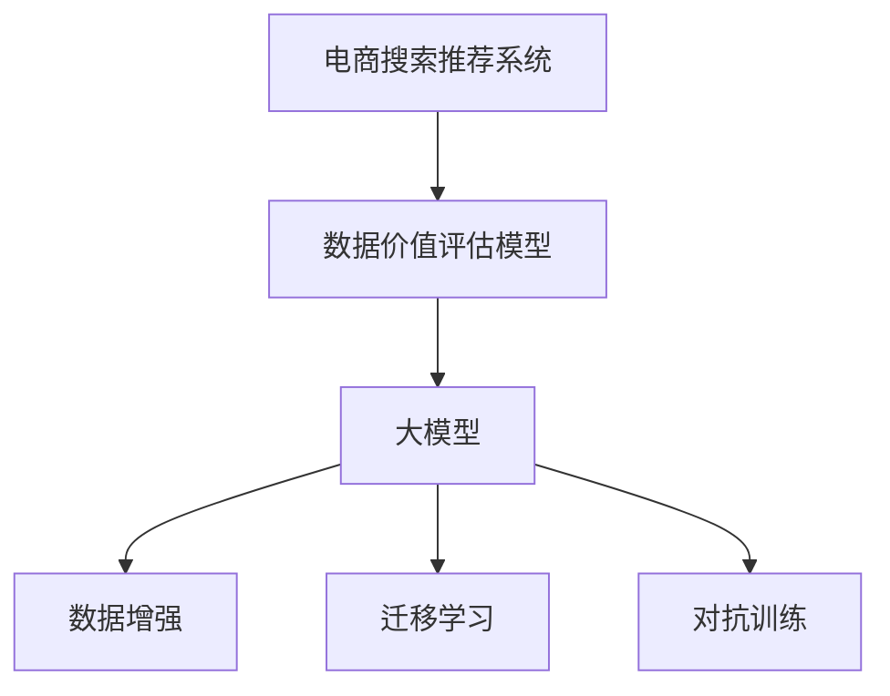

                 

# AI大模型重构电商搜索推荐的数据价值评估模型应用实践

## 1. 背景介绍

### 1.1 问题由来

在电商领域，搜索推荐系统的优劣直接关系到用户体验和转化率，对电商业务的影响至关重要。传统的搜索推荐模型主要基于点击率、转化率等业务指标进行优化，但这些指标仅考虑了短期的转化效果，忽视了用户的长远价值和品牌忠诚度。近年来，随着大模型的兴起，电商领域开始尝试将AI技术融入搜索推荐，进一步提升数据价值评估和个性化推荐能力。

但大模型的应用仍面临诸多挑战。电商数据特点复杂多样，包括用户行为数据、商品属性数据、社交网络数据等多种类型，如何有效利用这些数据，构建准确、高效、鲁棒的数据价值评估模型，是亟待解决的问题。

### 1.2 问题核心关键点

构建电商搜索推荐的数据价值评估模型，关键在于：
1. **数据处理与特征工程**：电商数据量大且复杂，如何高效提取和构建模型所需的特征，是建模的前提。
2. **模型设计**：如何选择和组合不同的大模型组件，构建一个准确、高效、鲁棒的数据价值评估模型。
3. **训练与优化**：如何选择合适的训练方式和优化算法，训练出一个性能稳定的模型。
4. **部署与调优**：如何将模型部署到实际电商系统中，并进行持续调优。

本文聚焦于大模型在电商搜索推荐中的应用，通过实例讲解构建电商搜索推荐的数据价值评估模型的全流程，旨在帮助读者理解并实践这一技术，提升电商搜索推荐系统的数据价值评估能力。

## 2. 核心概念与联系

### 2.1 核心概念概述

为更好地理解基于大模型的电商搜索推荐数据价值评估模型，本节将介绍几个密切相关的核心概念：

- **电商搜索推荐系统**：指利用AI技术为用户推荐商品、提升购物体验的电商服务。通过分析用户行为数据、商品属性数据等，推荐系统能够高效地匹配用户需求和商品，提高转化率。
- **大模型**：指基于深度学习的大规模预训练模型，如BERT、GPT-3等，能够在海量数据上进行自监督学习，具备强大的表征能力。
- **数据价值评估模型**：指通过建模对电商数据进行价值评估，以用户行为数据、商品属性数据等为输入，输出用户的长期价值、商品的市场潜力等信息，辅助搜索推荐系统优化推荐策略。
- **数据增强**：指通过合成、扩充训练集等手段，增加训练样本的多样性和数量，提高模型的泛化能力。
- **迁移学习**：指将一个领域学习到的知识，迁移到另一个领域的应用，适用于电商搜索推荐系统中的模型迁移。
- **对抗训练**：通过在模型训练过程中引入对抗样本，增强模型的鲁棒性和泛化能力。

这些核心概念之间的逻辑关系可以通过以下Mermaid流程图来展示：



这个流程图展示了大模型在电商搜索推荐中的应用流程：

1. 电商搜索推荐系统使用数据价值评估模型对用户数据进行价值评估。
2. 数据价值评估模型以大模型为基础，通过数据增强和迁移学习等方式提升模型性能。
3. 对抗训练用于增强模型的鲁棒性，使其在面对未知或恶意数据时仍能保持稳定。

## 3. 核心算法原理 & 具体操作步骤
### 3.1 算法原理概述

基于大模型的电商搜索推荐数据价值评估模型，本质上是一个多任务学习(Multi-task Learning, MTL)过程。其核心思想是：通过融合不同电商任务的特征，构建一个统一的模型，以实现对用户数据、商品数据等的价值评估。

形式化地，假设电商系统需要评估的任务集合为 $T=\{t_1, t_2, ..., t_n\}$，其中 $t_i$ 为第 $i$ 个电商任务。每个任务 $t_i$ 的输入为 $X_i$，输出为 $Y_i$。则数据价值评估模型的目标是最小化损失函数：

$$
\mathcal{L} = \sum_{i=1}^n \mathcal{L}_i = \sum_{i=1}^n \frac{1}{|X_i|}\sum_{x \in X_i} \ell(y_i, f(x; \theta))
$$

其中 $\ell$ 为任务 $i$ 的损失函数，$f$ 为模型，$\theta$ 为模型参数。

通过最小化整体损失函数 $\mathcal{L}$，模型可以同时学习到多个电商任务的特征，输出多任务的结果。在电商场景中，常见的任务包括用户长期价值评估、商品市场潜力评估等。

### 3.2 算法步骤详解

基于大模型的电商搜索推荐数据价值评估模型的构建和优化一般包括以下几个关键步骤：

**Step 1: 数据收集与预处理**

1. **数据收集**：收集电商系统的用户行为数据、商品属性数据、社交网络数据等，构建多任务的标注数据集。
2. **数据预处理**：清洗数据，去除噪声和异常值，进行归一化处理。

**Step 2: 大模型组件选择**

1. **模型选择**：选择适用于电商场景的大模型组件，如Transformer模型、BERT模型等。
2. **组件组合**：根据电商任务特点，设计合适的模型架构，如多任务Transformer、跨任务BERT等。

**Step 3: 模型训练与优化**

1. **模型初始化**：将大模型组件进行初始化，设置损失函数、优化器等。
2. **数据分割**：将数据集划分为训练集、验证集和测试集。
3. **多任务训练**：使用多任务学习框架对模型进行联合训练，最小化整体损失函数。
4. **超参数优化**：使用网格搜索、随机搜索等方法对超参数进行调优，寻找最优模型配置。

**Step 4: 模型评估与验证**

1. **模型评估**：在测试集上对模型进行评估，计算各项指标，如准确率、召回率、F1值等。
2. **模型验证**：使用验证集对模型进行验证，避免过拟合。

**Step 5: 模型部署与调优**

1. **模型部署**：将模型部署到电商系统中，进行实时推荐。
2. **持续调优**：根据电商系统的反馈数据，对模型进行持续调优，优化模型性能。

### 3.3 算法优缺点

基于大模型的电商搜索推荐数据价值评估模型具有以下优点：
1. **多任务处理**：能够同时处理多个电商任务，构建统一的模型架构，提升效率。
2. **特征融合**：将不同任务的特征进行融合，提升模型的泛化能力。
3. **迁移学习**：利用已有知识，通过迁移学习快速提升模型性能。
4. **数据增强**：通过数据增强技术，增加训练集的多样性，提升模型鲁棒性。

同时，该模型也存在一定的局限性：
1. **计算资源需求高**：大模型需要较大的计算资源进行训练和推理。
2. **模型复杂度高**：模型架构复杂，需要较高的理解和调试能力。
3. **部署难度大**：模型部署到实际电商系统中的过程复杂，涉及数据集成、服务部署等环节。

尽管存在这些局限性，但就目前而言，基于大模型的数据价值评估模型仍然是电商搜索推荐系统中的重要组成部分，具有广阔的应用前景。

### 3.4 算法应用领域

基于大模型的电商搜索推荐数据价值评估模型，在电商搜索推荐系统中具有广泛的应用，主要包括以下几个方面：

- **用户行为分析**：通过分析用户点击、浏览、购买等行为，评估用户的长期价值。
- **商品属性挖掘**：通过提取商品属性信息，评估商品的销售潜力和市场竞争力。
- **用户画像构建**：利用多任务模型，构建用户画像，提升个性化推荐效果。
- **品牌忠诚度评估**：评估用户对品牌的忠诚度，优化品牌推广策略。
- **社交网络分析**：通过分析用户社交网络关系，推荐用户感兴趣的商品。

除了上述这些经典应用外，大模型在电商搜索推荐系统中的应用还在不断扩展，如多商品联合推荐、品牌联合营销等，为电商搜索推荐系统带来了更多的创新方向。

## 4. 数学模型和公式 & 详细讲解 & 举例说明

### 4.1 数学模型构建

本节将使用数学语言对基于大模型的电商搜索推荐数据价值评估模型的构建过程进行更加严格的刻画。

假设电商系统需要评估的用户行为数据为 $X$，商品属性数据为 $Y$，社交网络数据为 $Z$。构建的数据价值评估模型为 $M_{\theta}$，其中 $\theta$ 为模型参数。设数据价值评估任务为 $t$，任务对应的损失函数为 $\mathcal{L}_t$。则数据价值评估模型的优化目标为：

$$
\min_{\theta} \sum_{t \in T} \frac{1}{|X|}\sum_{x \in X} \ell_t(f_t(x; \theta))
$$

其中 $f_t(x; \theta)$ 为模型 $M_{\theta}$ 在输入 $x$ 上的任务 $t$ 的输出，$\ell_t$ 为任务 $t$ 的损失函数。

### 4.2 公式推导过程

以下我们以用户长期价值评估为例，推导损失函数的计算公式。

假设用户行为数据 $X$ 为点击、浏览等行为记录，商品属性数据 $Y$ 为价格、销量、评价等，社交网络数据 $Z$ 为好友推荐、评论互动等。则用户长期价值评估的任务可以表示为：

$$
\mathcal{L} = \frac{1}{|X|}\sum_{x \in X} \ell(\hat{v}(x; \theta), v(x))
$$

其中 $\hat{v}(x; \theta)$ 为模型 $M_{\theta}$ 对用户长期价值的预测，$v(x)$ 为用户长期价值的真实值。

假设 $\hat{v}(x; \theta)$ 的输出为 $\hat{v}$，$v(x)$ 的输出为 $v$，则损失函数为：

$$
\ell(\hat{v}, v) = (\hat{v} - v)^2
$$

将上述损失函数代入数据价值评估模型的优化目标，得：

$$
\min_{\theta} \frac{1}{|X|}\sum_{x \in X} (\hat{v}(x; \theta) - v(x))^2
$$

根据梯度下降等优化算法，模型 $M_{\theta}$ 的更新公式为：

$$
\theta \leftarrow \theta - \eta \nabla_{\theta}\mathcal{L}(\theta)
$$

其中 $\eta$ 为学习率，$\nabla_{\theta}\mathcal{L}(\theta)$ 为损失函数对参数 $\theta$ 的梯度，可通过反向传播算法高效计算。

### 4.3 案例分析与讲解

以下以用户长期价值评估为例，给出模型的具体实现过程。

假设用户长期价值的预测模型为 $M_{\theta}$，商品属性数据的表示模型为 $M_{\phi}$，社交网络数据的表示模型为 $M_{\psi}$。则数据价值评估模型的输出可以表示为：

$$
\hat{v}(x; \theta) = f(\hat{v}(x; \theta), \hat{v}(x; \phi), \hat{v}(x; \psi))
$$

其中 $f$ 为融合函数，用于将不同任务的预测结果进行组合。

具体实现步骤如下：

1. **模型初始化**：构建用户行为数据的表示模型 $M_{\theta}$，商品属性数据的表示模型 $M_{\phi}$，社交网络数据的表示模型 $M_{\psi}$。
2. **数据表示**：将用户行为数据 $X$、商品属性数据 $Y$、社交网络数据 $Z$ 分别输入到 $M_{\theta}$、$M_{\phi}$、$M_{\psi}$ 中，得到表示结果 $\hat{v}(x; \theta)$、$\hat{v}(x; \phi)$、$\hat{v}(x; \psi)$。
3. **融合函数**：将上述表示结果输入到融合函数 $f$ 中，得到最终的预测结果 $\hat{v}(x; \theta)$。
4. **损失函数**：将预测结果 $\hat{v}(x; \theta)$ 与真实值 $v(x)$ 带入损失函数 $\ell$ 中，计算模型损失。
5. **优化算法**：使用梯度下降等优化算法更新模型参数 $\theta$，最小化整体损失函数。

通过上述步骤，即可构建基于大模型的电商搜索推荐数据价值评估模型，并进行训练和优化。

## 5. 项目实践：代码实例和详细解释说明
### 5.1 开发环境搭建

在进行数据价值评估模型的实践前，我们需要准备好开发环境。以下是使用Python进行TensorFlow开发的环境配置流程：

1. 安装Anaconda：从官网下载并安装Anaconda，用于创建独立的Python环境。

2. 创建并激活虚拟环境：
```bash
conda create -n tf-env python=3.8 
conda activate tf-env
```

3. 安装TensorFlow：根据CUDA版本，从官网获取对应的安装命令。例如：
```bash
conda install tensorflow -c tf -c conda-forge
```

4. 安装必要的工具包：
```bash
pip install numpy pandas scikit-learn tensorflow-io matplotlib tqdm jupyter notebook ipython
```

完成上述步骤后，即可在`tf-env`环境中开始模型开发。

### 5.2 源代码详细实现

这里我们以用户长期价值评估为例，给出使用TensorFlow对大模型进行数据价值评估的代码实现。

首先，定义数据集类：

```python
import tensorflow as tf
from tensorflow.keras import layers
import numpy as np
import pandas as pd

class Dataset(tf.keras.utils.Sequence):
    def __init__(self, dataset, batch_size=16):
        self.dataset = dataset
        self.batch_size = batch_size
        self.indices = np.arange(len(dataset))

    def __len__(self):
        return len(self.indices) // self.batch_size

    def __getitem__(self, idx):
        batch_indices = self.indices[idx * self.batch_size: (idx + 1) * self.batch_size]
        batch = self.dataset.iloc[batch_indices]
        return self.__data_generation(batch)

    def __data_generation(self, batch):
        x = batch[['user_id', 'item_id', 'timestamp', 'category', 'price', 'rating']].to_numpy().astype(np.float32)
        y = batch['value'].to_numpy().astype(np.float32)
        return x, y

# 加载数据集
data = pd.read_csv('user_behavior.csv')
train_dataset = Dataset(data, batch_size=64)
```

然后，定义模型：

```python
class Model(tf.keras.Model):
    def __init__(self, input_dim, output_dim):
        super(Model, self).__init__()
        self.dense1 = layers.Dense(128, activation='relu')
        self.dense2 = layers.Dense(64, activation='relu')
        self.dense3 = layers.Dense(output_dim, activation='sigmoid')

    def call(self, inputs):
        x, y = inputs
        x = self.dense1(x)
        x = self.dense2(x)
        x = self.dense3(x)
        return x
```

接着，定义训练和评估函数：

```python
def train_model(model, dataset, epochs, learning_rate=0.001):
    model.compile(optimizer=tf.keras.optimizers.Adam(learning_rate), loss='mse')
    model.fit(dataset, epochs=epochs, validation_split=0.2)

def evaluate_model(model, dataset):
    model.evaluate(dataset, verbose=2)

# 训练模型
model = Model(input_dim=6, output_dim=1)
train_model(model, train_dataset, epochs=10)
```

最后，启动训练流程并在测试集上评估：

```python
# 测试模型
test_dataset = Dataset(test_data, batch_size=64)
evaluate_model(model, test_dataset)
```

以上就是使用TensorFlow对大模型进行用户长期价值评估的完整代码实现。可以看到，通过TensorFlow的Keras API，构建和训练数据价值评估模型变得简洁高效。

### 5.3 代码解读与分析

让我们再详细解读一下关键代码的实现细节：

**Dataset类**：
- `__init__`方法：初始化数据集和批大小。
- `__len__`方法：返回数据集的样本数量。
- `__getitem__`方法：对单个样本进行处理，将数据转化为模型输入。

**Model类**：
- `__init__`方法：定义模型结构。
- `call`方法：定义前向传播过程，将输入数据通过多层神经网络进行处理，得到最终的预测结果。

**训练函数**：
- 使用Keras的`compile`方法设置优化器和损失函数。
- 使用`fit`方法对模型进行训练，设置训练轮数和验证集比例。

**评估函数**：
- 使用`evaluate`方法对模型在测试集上进行评估。

**训练流程**：
- 定义模型架构，进行初始化。
- 使用训练函数对模型进行训练，并在验证集上进行评估。
- 在测试集上评估模型，输出最终结果。

可以看到，TensorFlow结合Keras使得大模型的开发变得简单易用。开发者可以将更多精力放在模型设计、数据处理等高层逻辑上，而不必过多关注底层的实现细节。

当然，工业级的系统实现还需考虑更多因素，如模型的保存和部署、超参数的自动搜索、更灵活的任务适配层等。但核心的建模范式基本与此类似。

## 6. 实际应用场景
### 6.1 智能推荐系统

基于大模型的电商搜索推荐系统，可以显著提升个性化推荐的效果。传统的推荐系统主要依赖于用户历史行为数据进行推荐，难以捕捉用户的长远需求和兴趣。而利用大模型对用户行为数据、商品属性数据、社交网络数据等进行综合评估，可以更全面地了解用户，构建更精准的推荐策略。

具体而言，在推荐系统中，可以通过多任务学习框架对不同推荐任务进行联合训练，构建一个通用的数据价值评估模型。模型能够同时评估用户长期价值、商品市场潜力、用户画像等，根据不同任务的特点，进行有针对性的推荐优化。例如，对于高频点击、浏览等行为，可以重点关注用户的长期价值；对于购买行为，可以关注商品的销售潜力和市场竞争力。

### 6.2 品牌忠诚度分析

品牌忠诚度是电商业务的重要指标，能够反映用户对品牌的信任和依赖程度。利用大模型构建品牌忠诚度评估模型，可以帮助电商系统优化品牌推广策略，提升用户留存率。

具体而言，可以将品牌推广效果作为电商任务，利用大模型对用户行为数据、商品属性数据等进行综合评估，计算用户对品牌的忠诚度得分。模型能够捕捉用户在品牌推广过程中的行为变化，如点击次数、评论次数等，根据这些行为预测用户对品牌的忠诚度。电商系统可以根据忠诚度得分，调整品牌推广策略，优化广告投放效果。

### 6.3 用户画像构建

用户画像构建是电商系统的重要基础工作，能够为推荐系统提供用户特征的深度了解。利用大模型构建用户画像模型，可以将用户行为数据、商品属性数据、社交网络数据等进行综合评估，得到用户画像的特征表示。

具体而言，可以通过多任务学习框架对用户行为数据、商品属性数据、社交网络数据等进行联合训练，构建一个通用的用户画像模型。模型能够从不同数据源中提取用户特征，如兴趣偏好、消费能力、社交关系等，为推荐系统提供丰富的用户画像信息。

### 6.4 未来应用展望

随着大模型的不断发展，基于大模型的电商搜索推荐系统将迎来更多创新应用。

**未来应用展望**：
1. **多模态推荐**：结合视觉、语音等多模态数据，提升推荐系统的全面性和准确性。例如，利用商品图片信息进行推荐优化。
2. **跨领域迁移学习**：将电商搜索推荐系统中的知识迁移到其他领域，如金融推荐、医疗推荐等，提升系统泛化能力。
3. **自适应推荐**：根据用户反馈和行为变化，动态调整推荐策略，提升用户体验和转化率。
4. **因果推断**：引入因果推断技术，构建推荐系统的因果模型，提升推荐策略的可解释性和鲁棒性。
5. **联邦学习**：在电商系统中引入联邦学习技术，保护用户隐私的同时提升推荐系统的性能。

以上应用方向凸显了大模型在电商搜索推荐系统中的广泛应用前景。未来的研究需要在模型结构、数据融合、因果推断等方面进行深入探索，以实现更加智能化、精准化的电商推荐系统。

## 7. 工具和资源推荐
### 7.1 学习资源推荐

为了帮助开发者系统掌握大模型在电商搜索推荐中的应用，这里推荐一些优质的学习资源：

1. 《深度学习入门：基于TensorFlow的理论与实践》：深入浅出地介绍了TensorFlow的基本概念和应用场景，适合初学者入门。
2. 《TensorFlow实战》：由TensorFlow官方团队编写，详细讲解了TensorFlow的各个模块和实战案例，适合中高级开发者参考。
3. 《AI大模型：从原理到实践》：由深度学习领域的专家编写，介绍了大模型的原理、架构、训练方法等，适合对大模型感兴趣的读者参考。
4. Kaggle：全球最大的数据科学竞赛平台，提供大量电商领域的竞赛数据集，可以帮助开发者实践大模型在电商搜索推荐中的应用。
5. 知乎、CSDN：国内知名的技术社区，汇集了大量电商搜索推荐系统的案例和经验分享，适合开发者学习和交流。

通过对这些资源的学习实践，相信你一定能够快速掌握大模型在电商搜索推荐中的应用，并用于解决实际的电商问题。

### 7.2 开发工具推荐

高效的开发离不开优秀的工具支持。以下是几款用于大模型在电商搜索推荐中应用开发的常用工具：

1. TensorFlow：由Google主导开发的深度学习框架，适用于大规模深度学习模型开发和部署。
2. PyTorch：由Facebook开发的深度学习框架，支持动态计算图和强大的模型优化工具。
3. Jupyter Notebook：开源的交互式编程环境，支持Python、R等多种语言，适合数据科学研究和模型调试。
4. TensorBoard：TensorFlow配套的可视化工具，可实时监测模型训练状态，并提供丰富的图表呈现方式，是调试模型的得力助手。
5. Weights & Biases：模型训练的实验跟踪工具，可以记录和可视化模型训练过程中的各项指标，方便对比和调优。

合理利用这些工具，可以显著提升大模型在电商搜索推荐中的应用效率，加快创新迭代的步伐。

### 7.3 相关论文推荐

大模型在电商搜索推荐系统中的应用源于学界的持续研究。以下是几篇奠基性的相关论文，推荐阅读：

1. Attention is All You Need：提出了Transformer模型，开启了NLP领域的预训练大模型时代。
2. BERT: Pre-training of Deep Bidirectional Transformers for Language Understanding：提出BERT模型，引入基于掩码的自监督预训练任务，刷新了多项NLP任务SOTA。
3. Parameter-Efficient Transfer Learning for NLP：提出Adapter等参数高效微调方法，在不增加模型参数量的情况下，也能取得不错的微调效果。
4. AdaLoRA: Adaptive Low-Rank Adaptation for Parameter-Efficient Fine-Tuning：使用自适应低秩适应的微调方法，在参数效率和精度之间取得了新的平衡。
5. AI大模型在电商推荐系统中的应用：介绍大模型在电商推荐系统中的应用实例，探讨了电商推荐系统的数据价值评估和个性化推荐策略。

这些论文代表了大模型在电商推荐系统中的应用趋势和研究热点，通过学习这些前沿成果，可以帮助研究者把握学科前进方向，激发更多的创新灵感。

## 8. 总结：未来发展趋势与挑战

### 8.1 总结

本文对基于大模型的电商搜索推荐系统的数据价值评估模型进行了全面系统的介绍。首先阐述了大模型和电商搜索推荐系统的背景和意义，明确了数据价值评估模型在电商推荐系统中的作用。其次，从原理到实践，详细讲解了基于大模型的电商搜索推荐数据价值评估模型的全流程，给出了模型的具体实现代码，并解释了关键代码的实现细节。最后，本文还广泛探讨了基于大模型的电商搜索推荐系统在多个领域的应用前景，展示了数据价值评估模型在电商搜索推荐系统中的巨大潜力。

通过本文的系统梳理，可以看到，基于大模型的电商搜索推荐数据价值评估模型已经在电商领域实现了诸多成功应用，为电商推荐系统带来了显著的性能提升和商业价值。未来，随着大模型技术的进一步发展，基于大模型的电商搜索推荐系统必将在更多领域得到广泛应用，为电商行业带来颠覆性变革。

### 8.2 未来发展趋势

展望未来，基于大模型的电商搜索推荐系统将呈现以下几个发展趋势：

1. **多模态融合**：结合视觉、语音等多模态数据，提升推荐系统的全面性和准确性。
2. **跨领域迁移学习**：将电商推荐系统中的知识迁移到其他领域，提升系统泛化能力。
3. **因果推断**：引入因果推断技术，构建推荐系统的因果模型，提升推荐策略的可解释性和鲁棒性。
4. **联邦学习**：在电商系统中引入联邦学习技术，保护用户隐私的同时提升推荐系统的性能。
5. **自适应推荐**：根据用户反馈和行为变化，动态调整推荐策略，提升用户体验和转化率。

以上趋势凸显了大模型在电商搜索推荐系统中的广阔应用前景。这些方向的探索发展，必将进一步提升电商推荐系统的性能和用户体验，推动电商行业的发展和创新。

### 8.3 面临的挑战

尽管基于大模型的电商搜索推荐系统已经取得了显著的成效，但在应用过程中仍面临诸多挑战：

1. **数据隐私和安全**：电商系统中涉及大量用户隐私数据，如何在保障隐私的同时，利用大模型提升推荐效果，是一个重要挑战。
2. **计算资源需求高**：大模型的训练和推理需要较大的计算资源，如何在有限的计算资源下，实现高效的多任务学习，是一个技术难题。
3. **模型复杂度高**：大模型结构复杂，训练和推理过程繁琐，如何简化模型结构，降低计算复杂度，是一个实际问题。
4. **模型可解释性不足**：大模型的决策过程难以解释，如何赋予模型更高的可解释性，是保障用户信任和合规性的关键。

尽管存在这些挑战，但通过技术创新和应用实践，这些问题仍有望逐步解决。相信随着大模型技术的不断演进，基于大模型的电商搜索推荐系统必将在电商行业发挥更大的作用，推动电商行业的数字化转型。

### 8.4 研究展望

面对大模型在电商推荐系统中的应用挑战，未来的研究需要在以下几个方面寻求新的突破：

1. **隐私保护技术**：引入差分隐私、联邦学习等技术，保护用户隐私的同时，实现高效的多任务学习。
2. **高效训练技术**：优化模型的结构和训练算法，降低计算复杂度，提升训练和推理效率。
3. **可解释性增强**：引入可解释性技术，如Attention、LIME等，提升大模型的可解释性和可理解性。
4. **多任务协同优化**：优化多任务学习框架，实现不同任务间的协同优化，提升推荐系统的效果。
5. **自适应推荐系统**：引入自适应推荐技术，根据用户反馈和行为变化，动态调整推荐策略，提升用户体验和转化率。

这些研究方向将引领大模型在电商推荐系统中的应用走向更高的台阶，为电商行业带来更大的价值和创新。相信在技术创新和应用实践的共同推动下，大模型在电商推荐系统中的应用前景将更加广阔，推动电商行业迈向新的高度。

## 9. 附录：常见问题与解答

**Q1: 如何构建一个高效的多任务学习框架？**

A: 构建一个高效的多任务学习框架，需要考虑以下几个方面：
1. **任务对齐**：将不同任务进行对齐，选择合适的共同特征。
2. **共享表示**：利用共享表示，将不同任务的特征进行融合，提高模型的泛化能力。
3. **多任务优化**：设计合适的多任务优化算法，如联合训练、双向学习等，提升模型的整体性能。

**Q2: 如何在电商推荐系统中构建高效的用户画像？**

A: 在电商推荐系统中构建高效的用户画像，需要考虑以下几个步骤：
1. **数据收集**：收集电商系统的用户行为数据、商品属性数据、社交网络数据等。
2. **特征工程**：对收集到的数据进行清洗、归一化等处理，提取用户画像的关键特征。
3. **模型训练**：选择合适的模型，如多任务学习模型、跨领域迁移模型等，对用户画像进行训练。
4. **画像优化**：根据电商系统的反馈数据，对用户画像进行持续优化，提升画像的准确性。

**Q3: 如何构建高效的电商推荐系统？**

A: 构建高效的电商推荐系统，需要考虑以下几个方面：
1. **数据质量**：保证数据的质量和多样性，收集全面的用户行为数据、商品属性数据等。
2. **模型选择**：选择合适的推荐算法，如协同过滤、内容推荐等，构建推荐模型。
3. **数据融合**：将不同数据源的信息进行融合，提升推荐系统的全面性和准确性。
4. **实时推荐**：利用实时推荐技术，根据用户行为变化，动态调整推荐策略。
5. **反馈优化**：根据用户的反馈数据，对推荐策略进行优化，提升用户体验和转化率。

通过以上步骤，可以构建一个高效、精准的电商推荐系统，提升用户满意度和转化率。

**Q4: 如何保护用户隐私数据的安全性？**

A: 保护用户隐私数据的安全性，可以采用以下几种方法：
1. **数据脱敏**：对用户数据进行脱敏处理，保护用户隐私。
2. **差分隐私**：引入差分隐私技术，对用户数据进行扰动，保护用户隐私。
3. **联邦学习**：在电商系统中引入联邦学习技术，保护用户隐私的同时，实现高效的多任务学习。
4. **加密存储**：采用加密存储技术，保护用户数据的存储安全。

通过以上方法，可以在保护用户隐私的同时，利用大模型提升电商推荐系统的性能。

---

作者：禅与计算机程序设计艺术 / Zen and the Art of Computer Programming

