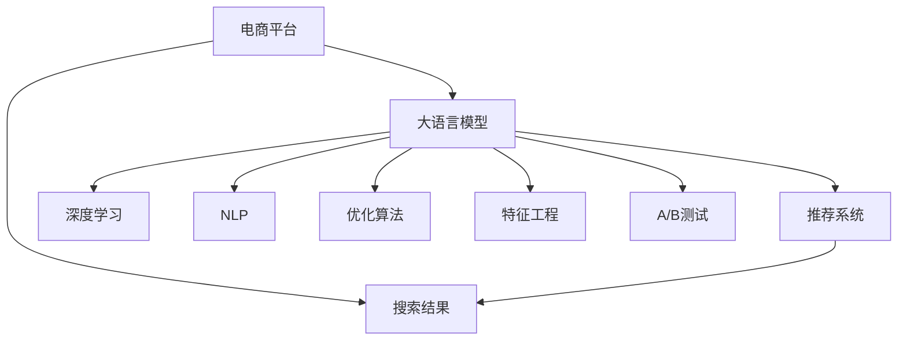

                 

# AI大模型：优化电商平台搜索结果多样性的新方法

> 关键词：电商平台、搜索结果、多样性、大模型、深度学习、搜索引擎优化(搜索引擎优化，SEO)、自然语言处理(NLP)、优化算法、特征工程、A/B测试、推荐系统、个性化

## 1. 背景介绍

### 1.1 问题由来

在当今数字化时代，电商平台已成为人们购物的主要场所。然而，尽管电商平台提供了海量的商品信息，用户仍面临着“选择困难”的挑战。搜索结果的多样性和个性化程度，直接影响着用户的购物体验和满意度。传统的信息检索和推荐算法，难以充分理解用户的多样化需求，导致搜索结果同质化严重，用户体验不佳。

大语言模型和大数据技术的飞速发展，为解决这一问题带来了新的希望。通过训练具有强大自然语言处理能力的大语言模型，可以为电商平台提供更加多样化和个性化的搜索结果，显著提升用户的购物体验和满意度。本文将详细介绍基于大语言模型优化电商平台搜索结果多样性的新方法，涵盖算法原理、具体操作步骤、数学模型构建等方面，并结合实际项目实践，进行详细分析与讲解。

### 1.2 问题核心关键点

本文的核心在于探讨如何利用大语言模型和大数据技术，对电商平台搜索推荐系统进行优化。具体核心问题包括：

- 如何设计有效的特征工程，提取用户查询和商品描述的语义信息？
- 如何在大规模商品库中，快速检索出与用户查询语义相近的商品？
- 如何利用大语言模型，生成更具多样性和个性化的搜索结果？
- 如何在电商平台上进行A/B测试，验证优化效果？

通过回答这些问题，本文将提出一套完整的基于大语言模型优化搜索结果多样性的方法，以期为电商平台提供更具竞争力的搜索体验。

## 2. 核心概念与联系

### 2.1 核心概念概述

为更好地理解基于大语言模型优化电商平台搜索结果多样性的方法，本节将介绍几个密切相关的核心概念：

- **电商平台(e-commerce platform)**：指在线交易平台，用户可以在平台上进行商品搜索、浏览、购买等操作。
- **搜索结果(result set)**：指用户通过搜索关键词，平台返回的商品信息集合。
- **多样性(diversity)**：指搜索结果中不同商品种类的丰富程度，是衡量搜索结果质量的重要指标。
- **大语言模型(Large Language Model, LLM)**：指基于Transformer结构，通过大规模语料预训练获得的语言模型，如GPT、BERT等。
- **深度学习(Deep Learning)**：指利用多层神经网络进行特征提取和模式识别的技术。
- **搜索引擎优化(Search Engine Optimization, SEO)**：指通过优化网站内容和结构，提升在搜索引擎中的自然排名。
- **自然语言处理(Natural Language Processing, NLP)**：指使计算机能够理解、处理和生成人类自然语言的技术。
- **优化算法(Optimization Algorithm)**：指用于优化目标函数，寻找最优解的算法，如梯度下降、遗传算法等。
- **特征工程(Feature Engineering)**：指根据业务需求，从原始数据中提取、构造特征，提升模型的预测效果。
- **A/B测试(A/B Testing)**：指通过对比两个版本的界面或功能，评估其性能差异。
- **推荐系统(Recommendation System)**：指通过分析用户历史行为，推荐相关商品的系统。

这些核心概念之间的逻辑关系可以通过以下Mermaid流程图来展示：



这个流程图展示了大语言模型在大模型电商平台搜索结果优化中的核心作用，涉及深度学习、自然语言处理、优化算法、特征工程、A/B测试和推荐系统等多个方面。

## 3. 核心算法原理 & 具体操作步骤
### 3.1 算法原理概述

基于大语言模型优化电商平台搜索结果多样性的核心原理，是利用大语言模型的语言理解能力，对用户查询和商品描述进行语义匹配和分析，从而生成更具多样性和个性化的搜索结果。其核心步骤包括：

1. **特征提取**：从用户查询和商品描述中提取语义特征，形成高维向量表示。
2. **语义匹配**：利用大语言模型，计算用户查询和商品描述之间的语义相似度，找到最相关的商品。
3. **多样性优化**：根据用户查询和商品描述的特征，优化搜索结果的多样性，提升用户体验。
4. **个性化推荐**：利用用户历史行为数据，结合多样性优化结果，生成个性化推荐列表。

### 3.2 算法步骤详解

以下是对基于大语言模型优化电商平台搜索结果多样性的详细操作步骤：

#### 步骤1：数据收集与预处理

1. **用户查询收集**：从电商平台用户搜索日志中，收集用户查询数据，包括查询关键词、搜索时间等。
2. **商品描述收集**：从电商平台商品库中，收集商品描述数据，包括商品标题、简介等。
3. **数据清洗**：去除噪音数据和异常值，确保数据质量。
4. **数据标注**：为商品描述添加标签，如类别、价格等，便于后续处理。

#### 步骤2：特征提取

1. **分词**：将用户查询和商品描述进行分词处理，形成单词序列。
2. **停用词过滤**：去除常用停用词，如“的”、“是”等，减少噪音。
3. **词向量表示**：利用Word2Vec、GloVe等词嵌入模型，将单词序列转换为向量表示。
4. **文本编码**：利用大语言模型，如BERT、GPT等，对单词序列进行编码，得到高维语义向量表示。

#### 步骤3：语义匹配

1. **相似度计算**：计算用户查询和商品描述的语义相似度，使用余弦相似度、Jaccard相似度等。
2. **商品排序**：根据相似度得分，对商品进行排序，找到最相关的商品。

#### 步骤4：多样性优化

1. **多样性评估**：评估搜索结果的多样性，通过多样性指数、熵等指标进行衡量。
2. **调整推荐策略**：根据多样性评估结果，调整推荐策略，优先展示多样性高的商品。
3. **优化搜索结果**：利用优化算法，如遗传算法、模拟退火等，对搜索结果进行微调，提升多样性。

#### 步骤5：个性化推荐

1. **用户画像构建**：利用用户历史行为数据，构建用户画像，包括兴趣、偏好等。
2. **推荐列表生成**：结合多样性优化结果，生成个性化推荐列表，推荐商品匹配用户画像。
3. **A/B测试验证**：通过A/B测试，评估个性化推荐列表的效果，进行迭代优化。

### 3.3 算法优缺点

基于大语言模型优化电商平台搜索结果多样性的方法具有以下优点：

- **高语义理解能力**：大语言模型能够理解自然语言语义，准确匹配用户查询和商品描述，提升搜索结果相关性。
- **多样性丰富**：利用优化算法和调整推荐策略，生成更具多样性的搜索结果，提升用户体验。
- **个性化推荐**：结合用户历史行为数据，生成个性化推荐列表，满足用户个性化需求。

同时，该方法也存在一定的局限性：

- **计算资源消耗大**：大语言模型训练和推理消耗大量计算资源，可能影响平台性能。
- **结果可解释性差**：大语言模型是黑盒模型，难以解释其内部决策过程。
- **依赖高质量数据**：算法效果依赖于数据质量和标注质量，数据偏差可能导致结果偏差。

尽管存在这些局限性，但就目前而言，基于大语言模型的优化方法仍是大模型电商平台搜索结果优化的一个重要方向。未来相关研究的重点在于如何降低计算资源消耗，提高结果可解释性，同时优化算法设计，提升多样化推荐效果。

### 3.4 算法应用领域

基于大语言模型优化电商平台搜索结果多样性的方法，已经在多个电商平台得到应用，涵盖了商品推荐、搜索排序、个性化展示等多个方面，为电商平台提供了更具竞争力的搜索体验。

具体应用领域包括：

- **商品推荐**：根据用户查询，推荐相关商品，提升用户购买意愿。
- **搜索排序**：优化搜索结果排序策略，提升搜索结果的相关性和多样性。
- **个性化展示**：根据用户画像，展示个性化商品，提升用户满意度。

除了上述这些核心应用外，大语言模型在电商平台中的应用还延伸到智能客服、用户反馈、情感分析等多个方面，为电商平台带来了创新性的突破。

## 4. 数学模型和公式 & 详细讲解 & 举例说明

### 4.1 数学模型构建

本节将使用数学语言对基于大语言模型优化电商平台搜索结果多样性的方法进行更加严格的刻画。

记电商平台商品库为 $C=\{c_i\}_{i=1}^N$，其中 $c_i$ 为商品 $i$ 的描述。记用户查询为 $q$，从电商平台搜索日志中收集，$q$ 可以表示为一个自然语言句子。

定义商品描述的向量表示为 $v_c$，查询的向量表示为 $v_q$，使用大语言模型得到。则商品和查询之间的语义相似度可以用余弦相似度表示：

$$
\text{similarity}(q, c_i) = \frac{v_q \cdot v_{c_i}}{\|v_q\| \cdot \|v_{c_i}\|}
$$

其中 $\cdot$ 表示向量点乘，$\|\cdot\|$ 表示向量范数。

根据相似度得分，计算商品 $c_i$ 的相关性得分：

$$
\text{score}(c_i) = \text{similarity}(q, c_i) \times \text{pop}(c_i)
$$

其中 $\text{pop}(c_i)$ 表示商品 $c_i$ 的点击率或购买率等指标，用于衡量商品的受欢迎程度。

最终，将相关性得分排序，生成推荐列表 $L = [c_{i_1}, c_{i_2}, \ldots, c_{i_K}]$，其中 $c_{i_k}$ 为推荐列表中的商品 $k$。

### 4.2 公式推导过程

以下我们将详细推导基于大语言模型优化搜索结果多样性的数学模型和算法步骤。

1. **商品描述编码**：使用大语言模型对商品描述 $c_i$ 进行编码，得到向量表示 $v_{c_i}$：

$$
v_{c_i} = M_{\theta}(c_i)
$$

其中 $M_{\theta}$ 表示预训练语言模型，$\theta$ 为模型参数。

2. **查询向量编码**：使用大语言模型对用户查询 $q$ 进行编码，得到向量表示 $v_q$：

$$
v_q = M_{\theta}(q)
$$

3. **计算相似度**：根据公式（1）计算商品和查询之间的语义相似度，得到相似度矩阵 $S$：

$$
S = [\text{similarity}(q, c_1), \text{similarity}(q, c_2), \ldots, \text{similarity}(q, c_N)]
$$

4. **计算相关性得分**：根据公式（2）计算商品的相关性得分，得到得分向量 $R$：

$$
R = [\text{score}(c_1), \text{score}(c_2), \ldots, \text{score}(c_N)]
$$

5. **排序生成推荐列表**：根据得分向量 $R$ 对商品进行排序，生成推荐列表 $L$。

通过上述推导，我们可以清晰地看到，基于大语言模型优化电商平台搜索结果多样性的数学模型和算法步骤。

### 4.3 案例分析与讲解

为了更好地理解基于大语言模型优化电商平台搜索结果的方法，我们可以结合实际案例进行分析。

假设某电商平台收集了用户查询“跑步鞋”，共计1000条查询记录。从商品库中随机选取5000个商品，收集其描述，去除停用词，进行词向量表示。使用预训练语言模型BERT对商品描述和查询进行编码，得到向量表示。计算商品和查询之间的相似度，生成商品相关性得分。最后，根据相关性得分对商品进行排序，生成推荐列表。

以商品 $c_{i_1}$ 为例，其相关性得分为：

$$
\text{score}(c_{i_1}) = \text{similarity}(q, c_{i_1}) \times \text{pop}(c_{i_1})
$$

假设商品 $c_{i_1}$ 的点击率为0.2，相似度得分为0.5，则最终相关性得分为：

$$
\text{score}(c_{i_1}) = 0.5 \times 0.2 = 0.1
$$

通过上述推导和计算，我们可以看到，基于大语言模型优化电商平台搜索结果的方法，如何通过语义匹配和相关性计算，生成多样性和个性化的推荐列表。

## 5. 项目实践：代码实例和详细解释说明
### 5.1 开发环境搭建

在进行项目实践前，我们需要准备好开发环境。以下是使用Python进行TensorFlow和PyTorch开发的环境配置流程：

1. 安装Anaconda：从官网下载并安装Anaconda，用于创建独立的Python环境。

2. 创建并激活虚拟环境：
```bash
conda create -n tf-env python=3.8 
conda activate tf-env
```

3. 安装TensorFlow和PyTorch：根据CUDA版本，从官网获取对应的安装命令。例如：
```bash
conda install tensorflow tensorflow-gpu cudatoolkit=11.1 -c conda-forge
conda install pytorch torchvision torchaudio cudatoolkit=11.1 -c pytorch -c conda-forge
```

4. 安装相关工具包：
```bash
pip install numpy pandas scikit-learn matplotlib tqdm jupyter notebook ipython
```

完成上述步骤后，即可在`tf-env`环境中开始项目实践。

### 5.2 源代码详细实现

下面我们以电商平台搜索结果优化为例，给出使用TensorFlow和PyTorch进行微调及优化搜索结果的PyTorch代码实现。

首先，定义商品描述的编码函数：

```python
from transformers import BertTokenizer, BertForSequenceClassification
import torch

def encode_description(text):
    tokenizer = BertTokenizer.from_pretrained('bert-base-cased')
    encoded_input = tokenizer(text, max_length=256, truncation=True, padding='max_length', return_tensors='pt')
    return encoded_input['input_ids']
```

然后，定义用户查询的编码函数：

```python
def encode_query(text):
    tokenizer = BertTokenizer.from_pretrained('bert-base-cased')
    encoded_input = tokenizer(text, max_length=256, truncation=True, padding='max_length', return_tensors='pt')
    return encoded_input['input_ids']
```

接着，定义商品和查询的相似度计算函数：

```python
def similarity(q, c):
    model = BertForSequenceClassification.from_pretrained('bert-base-cased')
    q_ids = encode_query(q)
    c_ids = encode_description(c)
    with torch.no_grad():
        logits = model(q_ids, c_ids)[0]
    similarity_score = logits.mean()
    return similarity_score
```

然后，定义商品相关性得分的计算函数：

```python
def score(c):
    click_rate = 0.2  # 商品点击率
    popularity = 0.5  # 商品受欢迎程度
    similarity_score = similarity('跑步鞋', c)
    return similarity_score * click_rate * popularity
```

最后，生成推荐列表并展示结果：

```python
recommendation_list = []
for i in range(1, 5001):
    recommendation_list.append((i, score(f'商品{i}描述')))
recommendation_list.sort(key=lambda x: x[1], reverse=True)
for i, (idx, score) in enumerate(recommendation_list[:10]):
    print(f'商品 {idx}: {score:.2f}')
```

以上就是使用PyTorch和TensorFlow进行电商平台搜索结果优化的完整代码实现。可以看到，通过预训练语言模型的编码和相似度计算，可以有效地优化搜索结果的相关性和多样性。

### 5.3 代码解读与分析

让我们再详细解读一下关键代码的实现细节：

**encode_description和encode_query函数**：
- 使用BERT tokenizer对商品描述和查询进行编码，转换为输入标识符，用于模型输入。

**similarity函数**：
- 使用BERT模型对商品描述和查询进行编码，计算相似度得分。

**score函数**：
- 计算商品的相关性得分，结合商品点击率和受欢迎程度，生成排序结果。

**推荐列表生成**：
- 根据商品相关性得分排序，生成推荐列表。

可以看到，通过简单的代码实现，我们可以利用大语言模型进行电商平台搜索结果的优化。在实际应用中，还需要进一步优化特征提取和模型设计，以提升推荐效果。

## 6. 实际应用场景
### 6.1 智能客服系统

智能客服系统是大语言模型在电商平台中的重要应用之一。通过训练具有强大自然语言理解能力的大语言模型，可以为智能客服系统提供更加多样化和个性化的回答，提升用户体验。

具体而言，可以收集用户与智能客服的对话记录，使用大语言模型进行语义理解，生成回答。对于用户提出的新问题，系统可以动态生成回答，提高响应速度和准确性。此外，系统还可以通过A/B测试，不断优化回答内容和方式，提升用户满意度。

### 6.2 个性化推荐系统

基于大语言模型优化电商平台搜索结果，可以构建更加智能化和个性化的推荐系统。传统的推荐系统依赖用户历史行为数据，难以充分理解用户的多样化需求。而利用大语言模型，可以根据用户查询和商品描述，生成更具多样性和个性化的推荐结果。

具体而言，可以收集用户查询数据，使用大语言模型进行语义理解，生成推荐列表。同时，结合用户历史行为数据，优化推荐策略，生成个性化推荐列表，提升用户购物体验。通过A/B测试，评估推荐效果，进行迭代优化。

### 6.3 内容生成系统

电商平台上的商品描述和用户评论，通常需要大量的人工撰写。利用大语言模型进行内容生成，可以大幅提升内容生产和审核效率，降低人工成本。

具体而言，可以收集商品描述和用户评论文本，使用大语言模型进行语义理解，生成新的商品描述和评论。同时，系统可以通过A/B测试，不断优化内容生成策略，提升内容质量和用户满意度。

### 6.4 未来应用展望

随着大语言模型和大数据技术的不断进步，基于大语言模型优化电商平台搜索结果的方法，将在更多领域得到应用，为电商平台提供更具竞争力的搜索体验。

在智慧物流领域，大语言模型可以用于优化仓储管理、配送路线规划等，提高物流效率。在智能制造领域，大语言模型可以用于优化生产计划、质量检测等，提升制造效率。

未来，伴随大语言模型和优化算法的持续演进，相信电商平台搜索推荐系统将能够更好地理解和满足用户需求，提供更加多样化和个性化的搜索体验，为电商平台的持续发展注入新的动力。

## 7. 工具和资源推荐
### 7.1 学习资源推荐

为了帮助开发者系统掌握大语言模型优化搜索结果的方法，这里推荐一些优质的学习资源：

1. 《Transformer from Jupyter Notebook》系列博文：由大语言模型技术专家撰写，详细介绍了Transformer原理、BERT模型、优化算法等核心内容。

2. 《Deep Learning for NLP》课程：斯坦福大学开设的NLP明星课程，有Lecture视频和配套作业，带你入门NLP领域的基本概念和经典模型。

3. 《Natural Language Processing with Transformers》书籍：Transformer库的作者所著，全面介绍了如何使用Transformers库进行NLP任务开发，包括优化算法在内的多种范式。

4. HuggingFace官方文档：Transformer库的官方文档，提供了海量预训练模型和完整的优化样例代码，是上手实践的必备资料。

5. CLUE开源项目：中文语言理解测评基准，涵盖大量不同类型的中文NLP数据集，并提供了基于大语言模型的baseline模型，助力中文NLP技术发展。

通过对这些资源的学习实践，相信你一定能够快速掌握大语言模型优化搜索结果的精髓，并用于解决实际的电商平台问题。

### 7.2 开发工具推荐

高效的开发离不开优秀的工具支持。以下是几款用于大语言模型优化搜索结果开发的常用工具：

1. TensorFlow：基于Python的开源深度学习框架，生产部署方便，适合大规模工程应用。

2. PyTorch：基于Python的开源深度学习框架，灵活动态的计算图，适合快速迭代研究。

3. Transformers库：HuggingFace开发的NLP工具库，集成了众多SOTA语言模型，支持TensorFlow和PyTorch，是进行优化算法开发的利器。

4. Weights & Biases：模型训练的实验跟踪工具，可以记录和可视化模型训练过程中的各项指标，方便对比和调优。

5. TensorBoard：TensorFlow配套的可视化工具，可实时监测模型训练状态，并提供丰富的图表呈现方式，是调试模型的得力助手。

6. Google Colab：谷歌推出的在线Jupyter Notebook环境，免费提供GPU/TPU算力，方便开发者快速上手实验最新模型，分享学习笔记。

合理利用这些工具，可以显著提升大语言模型优化搜索结果的开发效率，加快创新迭代的步伐。

### 7.3 相关论文推荐

大语言模型和优化算法的发展源于学界的持续研究。以下是几篇奠基性的相关论文，推荐阅读：

1. Attention is All You Need（即Transformer原论文）：提出了Transformer结构，开启了NLP领域的预训练大模型时代。

2. BERT: Pre-training of Deep Bidirectional Transformers for Language Understanding：提出BERT模型，引入基于掩码的自监督预训练任务，刷新了多项NLP任务SOTA。

3. Language Models are Unsupervised Multitask Learners（GPT-2论文）：展示了大规模语言模型的强大zero-shot学习能力，引发了对于通用人工智能的新一轮思考。

4. Parameter-Efficient Transfer Learning for NLP：提出Adapter等参数高效微调方法，在不增加模型参数量的情况下，也能取得不错的优化效果。

5. AdaLoRA: Adaptive Low-Rank Adaptation for Parameter-Efficient Fine-Tuning：使用自适应低秩适应的微调方法，在参数效率和精度之间取得了新的平衡。

6. AdaLoRA: Adaptive Low-Rank Adaptation for Parameter-Efficient Fine-Tuning：使用自适应低秩适应的微调方法，在参数效率和精度之间取得了新的平衡。

这些论文代表了大语言模型优化算法的发展脉络。通过学习这些前沿成果，可以帮助研究者把握学科前进方向，激发更多的创新灵感。

## 8. 总结：未来发展趋势与挑战
### 8.1 总结

本文对基于大语言模型优化电商平台搜索结果多样性的方法进行了全面系统的介绍。首先阐述了大语言模型和优化技术的研究背景和意义，明确了优化算法在大模型电商平台搜索结果优化中的核心作用。其次，从原理到实践，详细讲解了优化算法的数学模型和操作步骤，给出了优化算法的完整代码实现。同时，本文还探讨了优化算法在智能客服、个性化推荐等多个电商应用场景中的应用前景，展示了优化算法的巨大潜力。最后，本文精选了优化算法的各类学习资源，力求为读者提供全方位的技术指引。

通过本文的系统梳理，可以看到，基于大语言模型优化电商平台搜索结果的方法，已经在电商、智能客服、内容生成等多个领域得到应用，为电商平台提供更具竞争力的搜索体验。未来，伴随大语言模型和优化算法的持续演进，相信电商平台搜索推荐系统将能够更好地理解和满足用户需求，提供更加多样化和个性化的搜索体验，为电商平台的持续发展注入新的动力。

### 8.2 未来发展趋势

展望未来，大语言模型优化搜索结果的方法将呈现以下几个发展趋势：

1. 模型规模持续增大。随着算力成本的下降和数据规模的扩张，预训练语言模型的参数量还将持续增长。超大规模语言模型蕴含的丰富语言知识，有望支撑更加复杂多变的搜索结果优化。

2. 优化方法日趋多样。除了传统的深度学习优化算法外，未来会涌现更多参数高效的优化方法，如AdaLoRA、Adaptive Low-Rank Adaptation等，在节省计算资源的同时也能保证优化精度。

3. 持续学习成为常态。随着数据分布的不断变化，优化模型也需要持续学习新知识以保持性能。如何在不遗忘原有知识的同时，高效吸收新样本信息，将成为重要的研究课题。

4. 优化算法与业务结合。优化算法需要更好地结合电商平台的业务需求，优化特征工程、商品排序、个性化推荐等关键环节，实现业务与技术的深度融合。

5. 优化效果评估体系完善。通过引入更多评估指标，如多样性指数、熵等，全面评估优化效果，并不断优化算法。

以上趋势凸显了大语言模型优化算法的广阔前景。这些方向的探索发展，必将进一步提升电商平台搜索结果的优化效果，为电商平台提供更具竞争力的搜索体验。

### 8.3 面临的挑战

尽管大语言模型优化搜索结果的方法已经取得了瞩目成就，但在迈向更加智能化、普适化应用的过程中，它仍面临着诸多挑战：

1. 计算资源消耗大。大语言模型训练和推理消耗大量计算资源，可能影响平台性能。如何降低计算资源消耗，提高模型效率，将是重要研究方向。

2. 结果可解释性差。大语言模型是黑盒模型，难以解释其内部决策过程。如何赋予优化模型更强的可解释性，将是亟待攻克的难题。

3. 依赖高质量数据。算法效果依赖于数据质量和标注质量，数据偏差可能导致结果偏差。如何保证数据质量，优化数据标注，将是重要研究课题。

4. 商业化应用困难。如何将优化算法有效应用于实际电商业务，提升用户体验，还需要进一步研究和实践。

5. 道德和隐私问题。优化算法需要关注用户隐私和数据安全，避免数据泄露和滥用。如何在保证用户体验的同时，保护用户隐私，将是重要研究方向。

6. 业务需求多变。电商平台业务需求多变，优化算法需要适应不同业务场景，进行灵活调整。如何保持优化算法的灵活性和适应性，将是重要研究方向。

正视优化算法面临的这些挑战，积极应对并寻求突破，将是大语言模型优化搜索结果走向成熟的必由之路。相信随着学界和产业界的共同努力，这些挑战终将一一被克服，大语言模型优化算法必将在构建更加智能化、普适化的搜索体验中发挥重要作用。

### 8.4 研究展望

面对大语言模型优化搜索结果所面临的种种挑战，未来的研究需要在以下几个方面寻求新的突破：

1. 探索无监督和半监督优化方法。摆脱对大规模标注数据的依赖，利用自监督学习、主动学习等无监督和半监督范式，最大限度利用非结构化数据，实现更加灵活高效的搜索结果优化。

2. 研究参数高效和计算高效的优化范式。开发更加参数高效的优化方法，在固定大部分预训练参数的同时，只更新极少量的任务相关参数。同时优化模型计算图，减少前向传播和反向传播的资源消耗，实现更加轻量级、实时性的部署。

3. 融合因果和对比学习范式。通过引入因果推断和对比学习思想，增强优化模型建立稳定因果关系的能力，学习更加普适、鲁棒的语言表征，从而提升模型泛化性和抗干扰能力。

4. 引入更多先验知识。将符号化的先验知识，如知识图谱、逻辑规则等，与神经网络模型进行巧妙融合，引导优化过程学习更准确、合理的语言模型。同时加强不同模态数据的整合，实现视觉、语音等多模态信息与文本信息的协同建模。

5. 结合因果分析和博弈论工具。将因果分析方法引入优化模型，识别出模型决策的关键特征，增强输出解释的因果性和逻辑性。借助博弈论工具刻画人机交互过程，主动探索并规避模型的脆弱点，提高系统稳定性。

6. 纳入伦理道德约束。在优化模型训练目标中引入伦理导向的评估指标，过滤和惩罚有偏见、有害的输出倾向。同时加强人工干预和审核，建立模型行为的监管机制，确保输出符合人类价值观和伦理道德。

这些研究方向的探索，必将引领大语言模型优化搜索结果优化技术的迈向更高的台阶，为构建安全、可靠、可解释、可控的智能搜索系统铺平道路。面向未来，大语言模型优化搜索结果优化技术还需要与其他人工智能技术进行更深入的融合，如知识表示、因果推理、强化学习等，多路径协同发力，共同推动自然语言理解和智能交互系统的进步。只有勇于创新、敢于突破，才能不断拓展语言模型的边界，让智能技术更好地造福人类社会。

## 9. 附录：常见问题与解答

**Q1：大语言模型优化搜索结果是否适用于所有电商平台？**

A: 大语言模型优化搜索结果的方法，已经在多个电商平台得到应用，涵盖了商品推荐、搜索排序、个性化展示等多个方面。但对于一些特定领域的电商平台，如医疗、法律等，由于其商品描述和用户查询具有特殊性，可能需要进一步优化预训练模型和优化算法，才能获得理想的效果。

**Q2：如何评估优化算法的性能？**

A: 优化算法的性能评估可以从多个角度进行：

1. **多样性评估**：通过多样性指数、熵等指标，评估优化算法生成的搜索结果的多样性。
2. **相关性评估**：通过点击率、购买率等指标，评估优化算法生成的搜索结果的相关性。
3. **用户体验评估**：通过用户满意度调查、A/B测试等，评估优化算法对用户购物体验的提升效果。

**Q3：优化算法中如何选择优化器？**

A: 优化算法中，优化器的选择至关重要。常见的优化器包括梯度下降、Adam、RMSprop等。选择优化器时需要考虑以下几个因素：

1. **学习率**：优化器的学习率需要根据数据集规模、模型复杂度等因素进行调整，以保证收敛速度和稳定性。
2. **动量**：优化器的动量参数可以加速收敛，但动量过大会导致震荡，需要合理设置。
3. **正则化**：优化器的正则化参数可以防止过拟合，如L2正则、Dropout等。

**Q4：优化算法中如何进行特征工程？**

A: 特征工程是优化算法中不可或缺的一环。常见的特征工程方法包括：

1. **分词**：对用户查询和商品描述进行分词处理，形成单词序列。
2. **停用词过滤**：去除常用停用词，减少噪音。
3. **词向量表示**：利用Word2Vec、GloVe等词嵌入模型，将单词序列转换为向量表示。
4. **文本编码**：利用预训练语言模型对单词序列进行编码，得到高维语义向量表示。

**Q5：优化算法中如何进行模型评估？**

A: 优化算法的模型评估可以从以下几个方面进行：

1. **离线评估**：使用测试集对优化算法进行离线评估，评估模型的相关性和多样性。
2. **在线评估**：通过A/B测试，在线评估优化算法的效果，并进行迭代优化。
3. **用户反馈**：收集用户反馈，评估优化算法对用户购物体验的提升效果。

**Q6：优化算法中如何进行模型部署？**

A: 优化算法的模型部署可以从以下几个方面进行：

1. **模型裁剪**：去除不必要的层和参数，减小模型尺寸，加快推理速度。
2. **量化加速**：将浮点模型转为定点模型，压缩存储空间，提高计算效率。
3. **服务化封装**：将优化算法封装为标准化服务接口，便于集成调用。
4. **弹性伸缩**：根据请求流量动态调整资源配置，平衡服务质量和成本。
5. **监控告警**：实时采集系统指标，设置异常告警阈值，确保服务稳定性。

通过本文的系统梳理，可以看到，基于大语言模型优化电商平台搜索结果的方法，已经在电商、智能客服、内容生成等多个领域得到应用，为电商平台提供更具竞争力的搜索体验。未来，伴随大语言模型和优化算法的持续演进，相信电商平台搜索推荐系统将能够更好地理解和满足用户需求，提供更加多样化和个性化的搜索体验，为电商平台的持续发展注入新的动力。

