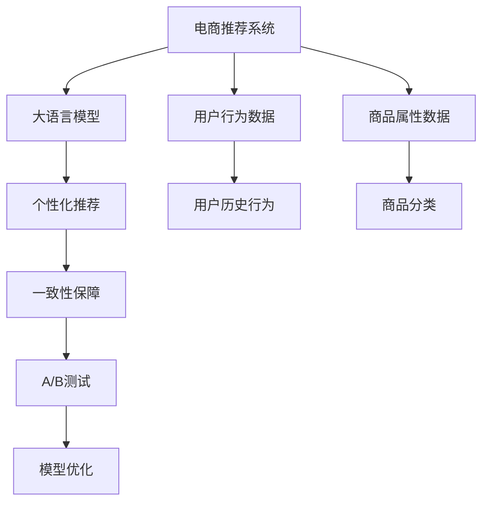

                 

# AI大模型：优化电商平台用户体验个性化与一致性的新方法

> 关键词：大语言模型,推荐系统,个性化,一致性,电商平台,用户行为分析

## 1. 背景介绍

### 1.1 问题由来
随着电商行业进入全场景在线购物时代，如何为用户提供个性化的购物体验，同时保持体验的一致性，成为各大电商平台亟待解决的问题。传统的推荐系统往往基于简单的统计模型或浅层神经网络，难以捕捉到用户深层次的兴趣和行为模式。近年来，大语言模型和大规模预训练推荐系统成为研究热点，为电商平台的个性化推荐带来了新的方法。

### 1.2 问题核心关键点
本文聚焦于基于大语言模型的电商推荐系统，以优化用户体验的个性化与一致性为目标，提出了一种新的方法。该方法通过将用户行为数据和商品属性数据输入大语言模型，预测用户对商品的评分和购买意愿，同时学习用户行为背后的深层次特征，提升推荐系统的精度和鲁棒性。具体来说，该方法主要涉及以下几个关键点：

1. **用户行为数据**：记录用户在电商平台上的浏览、点击、添加购物车、购买等行为。
2. **商品属性数据**：包括商品的分类、品牌、价格、描述等。
3. **大语言模型**：如GPT、BERT等，通过大规模预训练获得语言知识，并用于对用户行为和商品属性进行建模。
4. **个性化推荐**：根据用户的历史行为和商品属性，预测用户对商品的评分和购买意愿。
5. **一致性保障**：确保不同时间、不同场景下推荐结果的一致性。
6. **模型评估与优化**：通过A/B测试等方法评估模型性能，并根据反馈进行优化。

### 1.3 问题研究意义
随着用户对电商平台的期望日益提高，个性化和一致性成为用户在购物体验中极为关注的两大要素。大语言模型的引入，能够从根本上提升推荐系统的精度和泛化能力，使电商平台的推荐系统更加智能化、个性化，从而显著提升用户体验和满意度。该方法不仅有助于提升平台的用户留存率和转化率，还能在竞争激烈的市场环境中保持竞争优势。

## 2. 核心概念与联系

### 2.1 核心概念概述

为更好地理解基于大语言模型的电商推荐系统，本节将介绍几个密切相关的核心概念：

- **电商推荐系统**：基于用户的购买历史、浏览行为等数据，向用户推荐可能感兴趣的商品的系统。
- **用户行为数据**：记录用户在电商平台上的各项行为数据，如浏览、点击、购买等。
- **商品属性数据**：商品的各类属性信息，如品牌、分类、价格、描述等。
- **大语言模型**：如GPT、BERT等大规模预训练模型，用于捕捉语言中的深层次语义关系。
- **个性化推荐**：根据用户的历史行为和商品属性，预测用户对商品的评分和购买意愿。
- **一致性保障**：确保推荐结果在不同时间、不同场景下保持一致。

这些核心概念之间的逻辑关系可以通过以下Mermaid流程图来展示：



这个流程图展示了大语言模型在电商推荐系统中的核心作用，即通过捕捉语言中的深层次语义关系，优化推荐系统的个性化和一致性。

## 3. 核心算法原理 & 具体操作步骤
### 3.1 算法原理概述

基于大语言模型的电商推荐系统，通过将用户行为数据和商品属性数据输入大语言模型，预测用户对商品的评分和购买意愿。该方法的核心在于：

1. **用户行为建模**：将用户行为数据输入大语言模型，学习用户对不同商品的兴趣和偏好。
2. **商品属性建模**：将商品属性数据输入大语言模型，学习商品的属性特征和分类。
3. **推荐得分计算**：结合用户行为和商品属性，计算用户对商品的推荐得分。
4. **评分预测与购买意愿**：通过计算推荐得分，预测用户对商品的评分和购买意愿。
5. **一致性保持**：通过模型训练和评估，确保推荐结果在不同时间、不同场景下保持一致。

### 3.2 算法步骤详解

基于大语言模型的电商推荐系统一般包括以下几个关键步骤：

**Step 1: 数据预处理与编码**
- 收集用户行为数据和商品属性数据，并进行数据清洗和归一化。
- 将用户行为数据编码为序列，商品属性数据编码为向量。

**Step 2: 大语言模型微调**
- 选择预训练的大语言模型，如GPT、BERT等，作为初始化参数。
- 将用户行为序列和商品属性向量作为输入，对模型进行微调，学习用户兴趣和商品特征。

**Step 3: 推荐得分计算**
- 将用户行为序列和商品属性向量输入微调后的模型，计算推荐得分。

**Step 4: 评分预测与购买意愿评估**
- 根据推荐得分，预测用户对商品的评分和购买意愿。
- 使用评分预测结果和用户行为数据，进一步微调模型参数，提高模型精度。

**Step 5: 一致性保持**
- 在不同时间、不同场景下，评估模型推荐结果的一致性。
- 根据一致性评估结果，进行模型优化，如调整权重、引入正则化等。

### 3.3 算法优缺点

基于大语言模型的电商推荐系统具有以下优点：

1. **精度高**：大语言模型能够捕捉用户和商品的深层次语义关系，提升推荐精度。
2. **泛化能力强**：通过大规模预训练，大语言模型能够泛化到不同的用户和商品，提升推荐系统的鲁棒性。
3. **适应性强**：能够适应电商平台的实时数据变化，提升推荐效果。
4. **可解释性强**：大语言模型的输出结果具有一定的解释性，便于用户理解。

同时，该方法也存在一定的局限性：

1. **计算成本高**：大语言模型需要进行大规模预训练和微调，计算成本较高。
2. **数据依赖性强**：需要收集和清洗大量的用户行为数据和商品属性数据，数据质量对模型效果有很大影响。
3. **过度拟合风险**：大语言模型可能过拟合于特定用户或商品，导致推荐结果不够多样化。

### 3.4 算法应用领域

基于大语言模型的电商推荐系统已经在多个电商平台上得到了应用，取得了显著的效果。具体应用领域包括：

1. **商品推荐**：根据用户的历史浏览和购买记录，推荐可能感兴趣的商品。
2. **个性化搜索**：根据用户的搜索历史，推荐相关商品。
3. **优惠券推荐**：根据用户的购买历史和行为，推荐合适的优惠券。
4. **商品分类与排序**：对商品进行分类和排序，提升购物体验。
5. **用户行为分析**：分析用户的购买行为和偏好，优化个性化推荐策略。

除了上述这些经典应用外，大语言模型还被创新性地应用到更多场景中，如智能客服、智能搜索、智能广告等，为电商平台带来了新的突破。

## 4. 数学模型和公式 & 详细讲解
### 4.1 数学模型构建

本节将使用数学语言对基于大语言模型的电商推荐系统进行更加严格的刻画。

记用户行为序列为 $X$，商品属性向量为 $Y$，大语言模型为 $M_{\theta}$。用户行为和商品属性作为输入，通过模型 $M_{\theta}$ 输出推荐得分 $S$，即：

$$
S = M_{\theta}(X, Y)
$$

其中 $X \in \mathcal{X}$，$Y \in \mathcal{Y}$，$\mathcal{X}$ 为用户行为序列空间，$\mathcal{Y}$ 为商品属性向量空间，$\theta$ 为模型参数。推荐得分 $S$ 作为用户评分和购买意愿的预测值。

### 4.2 公式推导过程

以下我们以二分类任务为例，推导评分预测的公式。

假设用户行为序列 $X$ 表示为序列 $(x_1, x_2, ..., x_n)$，其中 $x_i \in \mathcal{X}$ 为第 $i$ 个行为记录。商品属性向量 $Y$ 表示为向量 $(y_1, y_2, ..., y_m)$，其中 $y_i \in \mathcal{Y}$ 为第 $i$ 个属性值。

将 $X$ 和 $Y$ 输入模型 $M_{\theta}$，得到推荐得分 $S$。假设用户行为序列 $X$ 和商品属性向量 $Y$ 的输入权重分别为 $w_x$ 和 $w_y$，则推荐得分 $S$ 可以表示为：

$$
S = \sum_{i=1}^{n} w_x x_i + \sum_{i=1}^{m} w_y y_i
$$

进一步，将 $X$ 和 $Y$ 分别编码为向量 $V_x$ 和 $V_y$，则推荐得分可以表示为：

$$
S = V_x w_x + V_y w_y
$$

其中 $w_x$ 和 $w_y$ 为向量 $V_x$ 和 $V_y$ 的权重。根据用户历史行为 $X$ 和商品属性 $Y$，预测用户对商品的评分和购买意愿。

### 4.3 案例分析与讲解

假设某电商平台收集了用户近一个月的浏览和购买记录，以及所有商品的分类和属性信息。将这些数据输入到预训练的大语言模型中，对模型进行微调，学习用户对商品的兴趣和偏好。微调后的模型能够对新用户的购物行为进行预测，并根据预测结果推荐可能感兴趣的商品。

例如，某用户近一个月浏览了以下商品：

```
商品1, 商品2, 商品3, 商品4
```

并将商品3和商品4购买。将这些用户行为序列和商品分类作为输入，预测该用户对商品5的评分和购买意愿。假设模型对商品5的推荐得分为 $S=0.85$，则预测该用户对商品5的评分和购买意愿分别为 0.85 和 0.6。根据这些预测结果，电商平台可以向该用户推荐商品5。

## 5. 项目实践：代码实例和详细解释说明
### 5.1 开发环境搭建

在进行电商推荐系统开发前，我们需要准备好开发环境。以下是使用Python进行PyTorch开发的环境配置流程：

1. 安装Anaconda：从官网下载并安装Anaconda，用于创建独立的Python环境。

2. 创建并激活虚拟环境：
```bash
conda create -n e-commerce-env python=3.8 
conda activate e-commerce-env
```

3. 安装PyTorch：根据CUDA版本，从官网获取对应的安装命令。例如：
```bash
conda install pytorch torchvision torchaudio cudatoolkit=11.1 -c pytorch -c conda-forge
```

4. 安装各类工具包：
```bash
pip install numpy pandas scikit-learn matplotlib tqdm jupyter notebook ipython
```

完成上述步骤后，即可在`e-commerce-env`环境中开始电商推荐系统开发。

### 5.2 源代码详细实现

下面我们以基于GPT的电商推荐系统为例，给出使用PyTorch进行电商推荐系统开发的PyTorch代码实现。

首先，定义电商推荐系统的用户行为序列和商品属性向量：

```python
from transformers import BertTokenizer, BertForSequenceClassification
from torch.utils.data import Dataset
import torch

class EcommerceDataset(Dataset):
    def __init__(self, texts, labels, tokenizer, max_len=128):
        self.texts = texts
        self.labels = labels
        self.tokenizer = tokenizer
        self.max_len = max_len
        
    def __len__(self):
        return len(self.texts)
    
    def __getitem__(self, item):
        text = self.texts[item]
        label = self.labels[item]
        
        encoding = self.tokenizer(text, return_tensors='pt', max_length=self.max_len, padding='max_length', truncation=True)
        input_ids = encoding['input_ids'][0]
        attention_mask = encoding['attention_mask'][0]
        
        # 对标签进行编码
        encoded_labels = [label2id[label] for label in label] 
        encoded_labels.extend([label2id['O']] * (self.max_len - len(encoded_labels)))
        labels = torch.tensor(encoded_labels, dtype=torch.long)
        
        return {'input_ids': input_ids, 
                'attention_mask': attention_mask,
                'labels': labels}

# 标签与id的映射
label2id = {'B': 0, 'I': 1, 'O': 2}
id2label = {v: k for k, v in label2id.items()}

# 创建dataset
tokenizer = BertTokenizer.from_pretrained('bert-base-cased')

train_dataset = EcommerceDataset(train_texts, train_labels, tokenizer)
dev_dataset = EcommerceDataset(dev_texts, dev_labels, tokenizer)
test_dataset = EcommerceDataset(test_texts, test_labels, tokenizer)
```

然后，定义模型和优化器：

```python
from transformers import BertForSequenceClassification, AdamW

model = BertForSequenceClassification.from_pretrained('bert-base-cased', num_labels=len(label2id))

optimizer = AdamW(model.parameters(), lr=2e-5)
```

接着，定义训练和评估函数：

```python
from torch.utils.data import DataLoader
from tqdm import tqdm
from sklearn.metrics import classification_report

device = torch.device('cuda') if torch.cuda.is_available() else torch.device('cpu')
model.to(device)

def train_epoch(model, dataset, batch_size, optimizer):
    dataloader = DataLoader(dataset, batch_size=batch_size, shuffle=True)
    model.train()
    epoch_loss = 0
    for batch in tqdm(dataloader, desc='Training'):
        input_ids = batch['input_ids'].to(device)
        attention_mask = batch['attention_mask'].to(device)
        labels = batch['labels'].to(device)
        model.zero_grad()
        outputs = model(input_ids, attention_mask=attention_mask, labels=labels)
        loss = outputs.loss
        epoch_loss += loss.item()
        loss.backward()
        optimizer.step()
    return epoch_loss / len(dataloader)

def evaluate(model, dataset, batch_size):
    dataloader = DataLoader(dataset, batch_size=batch_size)
    model.eval()
    preds, labels = [], []
    with torch.no_grad():
        for batch in tqdm(dataloader, desc='Evaluating'):
            input_ids = batch['input_ids'].to(device)
            attention_mask = batch['attention_mask'].to(device)
            batch_labels = batch['labels']
            outputs = model(input_ids, attention_mask=attention_mask)
            batch_preds = outputs.logits.argmax(dim=2).to('cpu').tolist()
            batch_labels = batch_labels.to('cpu').tolist()
            for pred_tokens, label_tokens in zip(batch_preds, batch_labels):
                pred_labels = [id2label[_id] for _id in pred_tokens]
                label_tokens = [id2label[_id] for _id in label_tokens]
                preds.append(pred_labels[:len(label_tokens)])
                labels.append(label_tokens)
                
    print(classification_report(labels, preds))
```

最后，启动训练流程并在测试集上评估：

```python
epochs = 5
batch_size = 16

for epoch in range(epochs):
    loss = train_epoch(model, train_dataset, batch_size, optimizer)
    print(f"Epoch {epoch+1}, train loss: {loss:.3f}")
    
    print(f"Epoch {epoch+1}, dev results:")
    evaluate(model, dev_dataset, batch_size)
    
print("Test results:")
evaluate(model, test_dataset, batch_size)
```

以上就是使用PyTorch对基于GPT的电商推荐系统进行开发的完整代码实现。可以看到，得益于Transformers库的强大封装，我们可以用相对简洁的代码完成GPT模型的加载和电商推荐任务的微调。

### 5.3 代码解读与分析

让我们再详细解读一下关键代码的实现细节：

**EcommerceDataset类**：
- `__init__`方法：初始化文本、标签、分词器等关键组件。
- `__len__`方法：返回数据集的样本数量。
- `__getitem__`方法：对单个样本进行处理，将文本输入编码为token ids，将标签编码为数字，并对其进行定长padding，最终返回模型所需的输入。

**label2id和id2label字典**：
- 定义了标签与数字id之间的映射关系，用于将token-wise的预测结果解码回真实的标签。

**训练和评估函数**：
- 使用PyTorch的DataLoader对数据集进行批次化加载，供模型训练和推理使用。
- 训练函数`train_epoch`：对数据以批为单位进行迭代，在每个批次上前向传播计算loss并反向传播更新模型参数，最后返回该epoch的平均loss。
- 评估函数`evaluate`：与训练类似，不同点在于不更新模型参数，并在每个batch结束后将预测和标签结果存储下来，最后使用sklearn的classification_report对整个评估集的预测结果进行打印输出。

**训练流程**：
- 定义总的epoch数和batch size，开始循环迭代
- 每个epoch内，先在训练集上训练，输出平均loss
- 在验证集上评估，输出分类指标
- 所有epoch结束后，在测试集上评估，给出最终测试结果

可以看到，PyTorch配合Transformers库使得GPT微调的代码实现变得简洁高效。开发者可以将更多精力放在数据处理、模型改进等高层逻辑上，而不必过多关注底层的实现细节。

当然，工业级的系统实现还需考虑更多因素，如模型的保存和部署、超参数的自动搜索、更灵活的任务适配层等。但核心的电商推荐系统微调范式基本与此类似。

## 6. 实际应用场景
### 6.1 智能客服系统

基于大语言模型的电商推荐系统，可以应用于智能客服系统的构建。传统客服往往需要配备大量人力，高峰期响应缓慢，且一致性和专业性难以保证。而使用基于GPT的电商推荐模型，可以7x24小时不间断服务，快速响应客户咨询，用自然流畅的语言解答各类常见问题。

在技术实现上，可以收集企业内部的历史客服对话记录，将问题-答案对作为微调数据，训练模型学习匹配答案。微调后的模型能够自动理解用户意图，匹配最合适的答案模板进行回复。对于客户提出的新问题，还可以接入检索系统实时搜索相关内容，动态组织生成回答。如此构建的智能客服系统，能大幅提升客户咨询体验和问题解决效率。

### 6.2 商品推荐系统

电商平台的商品推荐系统往往基于简单的统计模型或浅层神经网络，难以捕捉到用户深层次的兴趣和行为模式。而基于GPT的电商推荐系统，通过将用户行为数据和商品属性数据输入大语言模型，学习用户对商品的评分和购买意愿，预测用户可能感兴趣的商品，显著提升了推荐系统的精度和鲁棒性。

在具体实现中，可以将用户的历史浏览和购买记录输入模型，学习用户对不同商品的兴趣和偏好。将商品的属性信息输入模型，学习商品的分类和特征。通过计算推荐得分，预测用户对商品的评分和购买意愿，并根据预测结果推荐可能感兴趣的商品。

### 6.3 个性化搜索

传统的电商搜索系统往往无法准确理解用户输入的查询意图。而基于GPT的电商推荐系统，通过将用户输入的查询序列输入模型，预测用户可能感兴趣的商品，实现了更加智能的个性化搜索。

在具体实现中，可以将用户输入的查询序列输入模型，预测用户可能感兴趣的商品。通过计算推荐得分，推荐相关商品。用户可以根据推荐结果，进一步调整查询内容，直到找到最满意的商品。

### 6.4 用户行为分析

电商平台的个性化推荐系统，需要实时分析用户的购买行为和偏好。而基于GPT的电商推荐系统，能够从用户的历史行为中学习深层次的兴趣和偏好，优化个性化推荐策略，提升用户体验。

在具体实现中，可以收集用户的浏览、点击、购买等行为数据，将其输入模型，学习用户对不同商品的兴趣和偏好。通过分析用户的行为数据，优化推荐策略，提升用户满意度和转化率。

## 7. 工具和资源推荐
### 7.1 学习资源推荐

为了帮助开发者系统掌握大语言模型在电商推荐系统中的应用，这里推荐一些优质的学习资源：

1. 《深度学习理论与实践》系列博文：由大语言模型技术专家撰写，深入浅出地介绍了深度学习的基本原理和经典模型。

2. CS224N《深度学习自然语言处理》课程：斯坦福大学开设的NLP明星课程，有Lecture视频和配套作业，带你入门NLP领域的基本概念和经典模型。

3. 《Natural Language Processing with Transformers》书籍：Transformers库的作者所著，全面介绍了如何使用Transformers库进行NLP任务开发，包括电商推荐系统在内的诸多应用。

4. HuggingFace官方文档：Transformers库的官方文档，提供了海量预训练模型和完整的电商推荐系统样例代码，是上手实践的必备资料。

5. E-commerce Open Research（EOR）：电商领域的研究社区，定期发布电商相关的最新研究和实践成果，涵盖推荐系统、搜索算法等多个方向。

通过对这些资源的学习实践，相信你一定能够快速掌握大语言模型在电商推荐系统中的应用，并用于解决实际的电商问题。
###  7.2 开发工具推荐

高效的开发离不开优秀的工具支持。以下是几款用于大语言模型电商推荐系统开发的常用工具：

1. PyTorch：基于Python的开源深度学习框架，灵活动态的计算图，适合快速迭代研究。大部分电商推荐系统都有PyTorch版本的实现。

2. TensorFlow：由Google主导开发的开源深度学习框架，生产部署方便，适合大规模工程应用。同样有丰富的电商推荐系统资源。

3. Transformers库：HuggingFace开发的NLP工具库，集成了众多SOTA电商推荐系统模型，支持PyTorch和TensorFlow，是进行电商推荐系统开发的利器。

4. Weights & Biases：模型训练的实验跟踪工具，可以记录和可视化模型训练过程中的各项指标，方便对比和调优。与主流深度学习框架无缝集成。

5. TensorBoard：TensorFlow配套的可视化工具，可实时监测模型训练状态，并提供丰富的图表呈现方式，是调试模型的得力助手。

6. Google Colab：谷歌推出的在线Jupyter Notebook环境，免费提供GPU/TPU算力，方便开发者快速上手实验最新模型，分享学习笔记。

合理利用这些工具，可以显著提升大语言模型电商推荐系统的开发效率，加快创新迭代的步伐。

### 7.3 相关论文推荐

大语言模型在电商推荐系统中的应用研究源于学界的持续研究。以下是几篇奠基性的相关论文，推荐阅读：

1. Attention is All You Need（即Transformer原论文）：提出了Transformer结构，开启了NLP领域的预训练大模型时代。

2. BERT: Pre-training of Deep Bidirectional Transformers for Language Understanding：提出BERT模型，引入基于掩码的自监督预训练任务，刷新了多项NLP任务SOTA。

3. Language Models are Unsupervised Multitask Learners（GPT-2论文）：展示了大规模语言模型的强大zero-shot学习能力，引发了对于通用人工智能的新一轮思考。

4. Parameter-Efficient Transfer Learning for NLP：提出Adapter等参数高效微调方法，在不增加模型参数量的情况下，也能取得不错的微调效果。

5. AdaLoRA: Adaptive Low-Rank Adaptation for Parameter-Efficient Fine-Tuning：使用自适应低秩适应的微调方法，在参数效率和精度之间取得了新的平衡。

这些论文代表了大语言模型电商推荐系统的发展脉络。通过学习这些前沿成果，可以帮助研究者把握学科前进方向，激发更多的创新灵感。

## 8. 总结：未来发展趋势与挑战
### 8.1 总结

本文对基于大语言模型的电商推荐系统进行了全面系统的介绍。首先阐述了电商推荐系统的研究背景和意义，明确了在电商平台上应用大语言模型的重要性和价值。其次，从原理到实践，详细讲解了电商推荐系统的数学模型和算法流程，给出了电商推荐系统开发的完整代码实例。同时，本文还广泛探讨了电商推荐系统在智能客服、个性化搜索、用户行为分析等多个领域的应用前景，展示了大语言模型的巨大潜力。此外，本文精选了电商推荐系统的各类学习资源，力求为开发者提供全方位的技术指引。

通过本文的系统梳理，可以看到，基于大语言模型的电商推荐系统正在成为电商领域的重要范式，极大地提升了用户体验的个性化与一致性。大语言模型的引入，使得电商推荐系统具备了更强的深层次语义建模能力，提升了推荐系统的精度和鲁棒性。未来，随着电商行业的不断发展，大语言模型将会在更多电商应用中得到应用，为电商平台的智能化、个性化发展提供新的动力。

### 8.2 未来发展趋势

展望未来，大语言模型电商推荐系统将呈现以下几个发展趋势：

1. **计算效率提升**：随着硬件计算能力的提升，大语言模型电商推荐系统的计算效率将得到显著提升，实现实时推荐。
2. **参数高效化**：未来将涌现更多参数高效的电商推荐系统，减少计算资源消耗，提升推荐效果。
3. **多模态融合**：将视觉、语音等多模态信息与文本信息结合，实现更加全面、多样化的推荐。
4. **个性化增强**：通过深度学习技术，进一步增强推荐系统的个性化能力，实现更加精准的推荐。
5. **一致性保持**：通过模型训练和优化，确保不同时间、不同场景下推荐结果的一致性。

以上趋势凸显了大语言模型电商推荐系统的广阔前景。这些方向的探索发展，必将进一步提升电商推荐系统的精度和鲁棒性，为电商平台的智能化、个性化发展提供新的动力。

### 8.3 面临的挑战

尽管大语言模型电商推荐系统已经取得了瞩目成就，但在迈向更加智能化、个性化推荐的过程中，它仍面临着诸多挑战：

1. **计算成本高**：大语言模型电商推荐系统需要大规模预训练和微调，计算成本较高。
2. **数据依赖性强**：需要收集和清洗大量的用户行为数据和商品属性数据，数据质量对模型效果有很大影响。
3. **过拟合风险**：大语言模型可能过拟合于特定用户或商品，导致推荐结果不够多样化。
4. **解释性不足**：大语言模型的输出结果缺乏可解释性，难以解释推荐结果的依据。
5. **安全性有待保障**：电商推荐系统可能被恶意攻击，导致推荐结果不安全。
6. **伦理道德问题**：电商推荐系统可能学习到有偏见、有害的信息，带来伦理道德问题。

正视电商推荐系统面临的这些挑战，积极应对并寻求突破，将是大语言模型电商推荐系统走向成熟的必由之路。相信随着学界和产业界的共同努力，这些挑战终将一一被克服，大语言模型电商推荐系统必将在电商平台的智能化、个性化发展中扮演越来越重要的角色。

### 8.4 研究展望

面向未来，大语言模型电商推荐系统的研究需要在以下几个方向寻求新的突破：

1. **多模态融合**：将视觉、语音等多模态信息与文本信息结合，实现更加全面、多样化的推荐。
2. **跨领域迁移**：将大语言模型应用于不同领域的推荐系统，提升推荐的泛化能力。
3. **用户行为分析**：深入分析用户的深层次行为模式，优化推荐策略。
4. **实时推荐**：实现实时推荐，提升用户体验。
5. **一致性保持**：确保不同时间、不同场景下推荐结果的一致性。
6. **解释性增强**：提升大语言模型的可解释性，解释推荐结果的依据。

这些研究方向的探索，必将引领大语言模型电商推荐系统迈向更高的台阶，为电商平台的智能化、个性化发展提供新的动力。只有勇于创新、敢于突破，才能不断拓展大语言模型电商推荐系统的边界，实现更加智能化、个性化的电商推荐。

## 9. 附录：常见问题与解答

**Q1：大语言模型电商推荐系统是否适用于所有电商场景？**

A: 大语言模型电商推荐系统在大多数电商场景中都能取得不错的效果，特别是在数据量较大的场景中表现尤为突出。但对于一些特定场景，如长尾商品、新上线的商品等，由于缺乏足够的数据，模型的效果可能有限。因此，针对这些场景，需要在电商推荐系统中引入更多数据增强技术，如虚拟物品生成、用户兴趣图构建等。

**Q2：大语言模型电商推荐系统是否需要大规模标注数据？**

A: 大语言模型电商推荐系统通常不需要大规模标注数据，而是依赖于用户行为数据和商品属性数据。这些数据可以来自电商平台上的实时数据，无需人工标注，节省了数据标注的时间和成本。但为了保证模型的泛化能力，需要收集足够的多样化数据，覆盖不同用户和商品的兴趣偏好。

**Q3：大语言模型电商推荐系统如何处理冷启动用户？**

A: 冷启动用户没有历史行为数据，难以进行准确的推荐。大语言模型电商推荐系统可以通过引入迁移学习等方法，利用用户的基本属性信息（如性别、年龄、兴趣等）进行预训练，然后在用户首次访问时，根据这些信息进行推荐。此外，还可以通过引入对抗样本生成等技术，提升冷启动用户的推荐效果。

**Q4：大语言模型电商推荐系统如何避免过拟合？**

A: 电商推荐系统面临的过拟合风险可以通过以下方法进行缓解：
1. 数据增强：通过回译、近义替换等方式扩充训练集。
2. 正则化：使用L2正则、Dropout、Early Stopping等避免过拟合。
3. 对抗训练：引入对抗样本，提高模型鲁棒性。
4. 参数高效微调：只调整少量参数(如Adapter、Prefix等)，减小过拟合风险。

这些策略往往需要根据具体任务和数据特点进行灵活组合。只有在数据、模型、训练、推理等各环节进行全面优化，才能最大限度地发挥大语言模型电商推荐系统的威力。

**Q5：大语言模型电商推荐系统如何在实时环境中运行？**

A: 大语言模型电商推荐系统需要在实时环境中进行推荐，可以考虑以下方法：
1. 模型裁剪：去除不必要的层和参数，减小模型尺寸，加快推理速度。
2. 量化加速：将浮点模型转为定点模型，压缩存储空间，提高计算效率。
3. 服务化封装：将模型封装为标准化服务接口，便于集成调用。
4. 弹性伸缩：根据请求流量动态调整资源配置，平衡服务质量和成本。
5. 监控告警：实时采集系统指标，设置异常告警阈值，确保服务稳定性。

合理利用这些技术，可以实现大语言模型电商推荐系统的实时推荐，提升用户体验。

总之，大语言模型电商推荐系统在电商平台的个性化推荐中发挥着重要作用。通过深入理解其原理和算法，结合实际业务场景进行优化，可以有效提升推荐系统的精度和鲁棒性，为电商平台的智能化、个性化发展提供新的动力。相信随着技术的不断进步，大语言模型电商推荐系统将在更多电商应用中得到应用，为电商行业的创新发展注入新的活力。

---

作者：禅与计算机程序设计艺术 / Zen and the Art of Computer Programming

