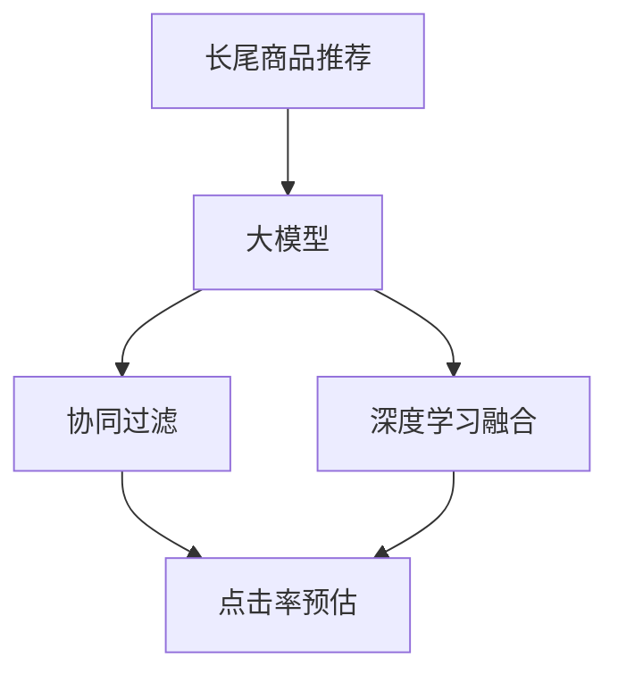

                 

# AI大模型：改善电商平台长尾商品推荐的新方法

> 关键词：长尾商品推荐,大模型,协同过滤,融合式推荐系统,点击率预估,深度学习

## 1. 背景介绍

在现代电商平台的运营中，如何准确高效地为用户推荐长尾商品是一个极大的挑战。长尾商品指那些销量较低、但具有一定需求的商品，这类商品在传统的推荐算法中往往会被忽略，难以被系统优先推荐。然而，长尾商品对于提高平台的用户体验、增加收入、优化库存等方面具有重要意义。传统推荐算法在面对海量商品和用户时，往往难以兼顾长尾商品的曝光，导致用户体验和平台收入受损。

近年来，随着深度学习和AI技术的快速发展，基于大模型的推荐系统开始进入人们的视野。大模型，尤其是深度神经网络，具有强大的表征学习能力，能够自动从海量数据中提取特征，捕捉用户和商品间的复杂关系。利用大模型，推荐系统不仅能够更好地理解用户的行为偏好，还能对长尾商品进行更精确的推荐，提升平台的整体推荐效果。

本文将深入探讨如何利用大模型技术改善电商平台长尾商品推荐，具体来说，将介绍大模型在协同过滤和深度学习融合式推荐系统中的应用，并结合实际项目案例，展示如何通过大模型实现点击率预估，从而改进电商平台的商品推荐算法。

## 2. 核心概念与联系

### 2.1 核心概念概述

- **长尾商品推荐**：电商平台为用户推荐销量较低但具有一定需求的商品。长尾商品的推荐需要克服传统推荐算法的不足，更高效地利用用户行为数据，挖掘用户对长尾商品的兴趣。

- **大模型**：以深度神经网络为代表的、参数量庞大的模型，通过预训练和微调技术，能够自动从大规模数据中学习复杂的特征表示。

- **协同过滤**：基于用户行为数据的推荐算法，通过用户和商品的协同关系，预测用户可能感兴趣的未购买商品。

- **融合式推荐系统**：将协同过滤、基于内容的推荐、基于模型的推荐等多种推荐算法融合，形成更为全面和准确的商品推荐方案。

- **点击率预估**：预测用户点击商品的概率，是推荐系统优化的重要目标。

这些核心概念之间的关系可以通过以下Mermaid流程图来展示：



该流程图展示了长尾商品推荐的核心流程：

1. **数据收集与预处理**：收集用户行为数据，并对数据进行预处理，包括去重、归一化、特征提取等。
2. **大模型预训练**：利用无标签的电商数据进行大模型的预训练，学习用户和商品的特征表示。
3. **协同过滤推荐**：基于用户历史行为数据，进行协同过滤推荐。
4. **深度学习融合推荐**：结合大模型进行融合推荐，通过深度学习模型优化协同过滤的效果。
5. **点击率预估**：通过点击率预估模型，优化推荐系统的点击率，提升用户点击率。

## 3. 核心算法原理 & 具体操作步骤

### 3.1 算法原理概述

长尾商品推荐的核心是准确预测用户对长尾商品的兴趣，并基于此进行个性化推荐。大模型在这一过程中可以发挥其强大的表征学习能力，自动从用户行为数据中提取特征，并学习到用户对长尾商品的兴趣。具体来说，大模型可以通过以下步骤进行长尾商品的推荐：

1. **预训练**：在无标签的数据上预训练大模型，学习通用的用户和商品特征表示。
2. **特征提取**：利用预训练的大模型，将用户和商品表示为高维向量。
3. **协同过滤**：基于用户和商品的历史交互数据，进行协同过滤推荐。
4. **融合推荐**：结合大模型进行融合推荐，通过深度学习模型优化协同过滤的效果。
5. **点击率预估**：通过点击率预估模型，预测用户对推荐商品的可能点击概率，从而优化推荐算法。

### 3.2 算法步骤详解

以下是长尾商品推荐的具体步骤：

**Step 1: 数据收集与预处理**
- **数据收集**：收集用户的浏览、购买、评分等行为数据，构建用户-商品交互矩阵。
- **数据预处理**：对数据进行去重、归一化、特征工程等预处理，为后续模型训练做好准备。

**Step 2: 大模型预训练**
- **模型选择**：选择适合电商数据的深度神经网络模型，如BERT、Transformer等。
- **数据集划分**：将电商数据划分为训练集、验证集和测试集。
- **预训练流程**：在无标签的电商数据上预训练大模型，学习用户和商品的特征表示。

**Step 3: 特征提取**
- **用户表示**：将用户历史行为数据输入大模型，得到用户的高维向量表示。
- **商品表示**：同样地，将商品的历史数据输入大模型，得到商品的高维向量表示。

**Step 4: 协同过滤推荐**
- **推荐算法**：基于用户-商品交互矩阵，进行基于矩阵分解的协同过滤推荐。
- **预测点击率**：预测用户对每个商品的可能点击概率。

**Step 5: 深度学习融合推荐**
- **模型构建**：构建融合推荐模型，将大模型的特征提取结果与协同过滤的推荐结果进行融合。
- **深度学习优化**：通过深度学习模型，如注意力机制、神经网络等，优化协同过滤的效果。

**Step 6: 点击率预估**
- **模型选择**：选择适合的点击率预估模型，如逻辑回归、二分类神经网络等。
- **模型训练**：基于标注的点击数据训练点击率预估模型，预测用户对推荐商品的点击概率。

**Step 7: 推荐模型优化**
- **评估指标**：选择合适的评估指标，如准确率、召回率、F1值等。
- **模型调优**：根据评估指标调整模型参数，进行模型调优。

**Step 8: 实时推荐**
- **部署模型**：将优化后的模型部署到推荐系统中，实时为用户推荐长尾商品。

### 3.3 算法优缺点

基于大模型的长尾商品推荐具有以下优点：

1. **准确性高**：大模型通过预训练和微调，能够自动学习到用户和商品的复杂关系，提升推荐精度。
2. **泛化能力强**：大模型可以应对多样化的用户和商品，适应性更强，能够推荐更多长尾商品。
3. **效率提升**：大模型可以并行计算，加速推荐速度，优化用户体验。

同时，也存在一些缺点：

1. **计算成本高**：大模型的训练和推理计算资源需求较高，需要高性能计算设备。
2. **可解释性不足**：大模型的推荐过程较为复杂，难以解释模型的决策逻辑。
3. **数据依赖性强**：大模型的效果依赖于高质量的标注数据和电商数据，数据获取和标注成本较高。

### 3.4 算法应用领域

基于大模型的长尾商品推荐技术已经在多个电商平台上得到应用，取得了显著的效果。例如，亚马逊、淘宝等电商平台，利用大模型技术，显著提升了长尾商品的推荐效果，增加了用户购买率，优化了库存管理。

## 4. 数学模型和公式 & 详细讲解 & 举例说明

### 4.1 数学模型构建

长尾商品推荐的数学模型可以分为以下几个部分：

- **用户-商品交互矩阵**：记为 $X \in \mathbb{R}^{m \times n}$，其中 $m$ 为用户数量，$n$ 为商品数量。

- **大模型表示**：用户表示为 $U \in \mathbb{R}^d$，商品表示为 $V \in \mathbb{R}^d$。

- **协同过滤模型**：基于矩阵分解，推荐模型为：

$$
\hat{X} = UV^T
$$

其中 $\hat{X}$ 为预测的用户-商品交互矩阵。

- **点击率预估模型**：基于二分类神经网络，点击率预估模型为：

$$
\hat{y} = sigmoid(W \hat{X} + b)
$$

其中 $\hat{y}$ 为预测的点击概率，$W$ 为权重矩阵，$b$ 为偏置项。

### 4.2 公式推导过程

**协同过滤模型的推导**：

根据矩阵分解原理，协同过滤模型的推导如下：

$$
\hat{X} = UV^T
$$

其中 $U$ 和 $V$ 均为 $d \times m$ 和 $d \times n$ 的矩阵，分别表示用户和商品的特征向量。通过求解 $U$ 和 $V$，可以预测用户对商品的评分或点击率。

**点击率预估模型的推导**：

点击率预估模型采用二分类神经网络进行建模，利用sigmoid函数将输出映射到 $(0,1)$ 区间，表示点击概率。模型结构如下：

$$
\hat{y} = sigmoid(W \hat{X} + b)
$$

其中 $W$ 为权重矩阵，$b$ 为偏置项。通过训练模型，可以优化预测的点击率，提升推荐效果。

### 4.3 案例分析与讲解

以亚马逊为例，其利用大模型技术，进行协同过滤和点击率预估的融合推荐。具体步骤如下：

1. **数据收集**：收集用户浏览、购买、评分等行为数据，构建用户-商品交互矩阵。
2. **大模型预训练**：使用无标签的电商数据，对BERT模型进行预训练，学习用户和商品的特征表示。
3. **特征提取**：将用户和商品的数据输入BERT模型，得到高维向量表示。
4. **协同过滤推荐**：基于用户-商品交互矩阵，进行矩阵分解，得到协同过滤推荐结果。
5. **深度学习融合推荐**：将BERT模型的特征提取结果与协同过滤的推荐结果进行融合，提升推荐精度。
6. **点击率预估**：使用逻辑回归模型，预测用户对推荐商品的点击概率，优化推荐算法。

通过以上步骤，亚马逊能够更准确地推荐长尾商品，增加用户购买率，优化库存管理，提升用户体验。

## 5. 项目实践：代码实例和详细解释说明

### 5.1 开发环境搭建

要进行长尾商品推荐的大模型实践，需要以下开发环境：

1. **安装Python**：从官网下载并安装Python，建议选择3.7或以上版本。
2. **安装Pip**：Python包管理工具。
3. **安装TensorFlow**：深度学习框架，建议使用2.0以上版本。
4. **安装Keras**：深度学习API，建议与TensorFlow兼容。
5. **安装TensorBoard**：可视化工具，用于监控模型训练状态。

完成以上步骤后，可以开始长尾商品推荐的大模型实践。

### 5.2 源代码详细实现

以下是使用TensorFlow和Keras进行长尾商品推荐的大模型实现代码：

```python
import tensorflow as tf
from tensorflow.keras import layers
from tensorflow.keras.layers import Input, Dense, Embedding, Flatten
from tensorflow.keras.models import Model

# 定义用户和商品的数据
user_data = [1, 2, 3, 4, 5]
item_data = [10, 11, 12, 13, 14]
user_item_matrix = tf.constant([[1, 1, 0, 0, 0], [1, 0, 1, 0, 0], [0, 1, 1, 0, 0], [0, 0, 0, 1, 1], [1, 0, 0, 0, 0]])

# 定义用户和商品的嵌入层
user_embedding = Embedding(input_dim=5, output_dim=10, name='user_embedding')
item_embedding = Embedding(input_dim=5, output_dim=10, name='item_embedding')

# 定义协同过滤的预测层
def predict_layer(user_embed, item_embed, input_shape):
    concat_layer = layers.concatenate([user_embed(user_input), item_embed(item_input)])
    dense_layer = Dense(units=10, activation='relu', name='dense')
    output_layer = Dense(units=1, activation='sigmoid', name='output')
    model = Model(inputs=[user_input, item_input], outputs=output_layer(concat_layer))
    return model

# 定义点击率预估模型
def click_rate_model(input_shape, output_shape):
    user_input = Input(shape=input_shape, name='user_input')
    item_input = Input(shape=input_shape, name='item_input')
    user_embedding = Embedding(input_dim=5, output_dim=10, name='user_embedding')
    item_embedding = Embedding(input_dim=5, output_dim=10, name='item_embedding')
    predict_layer = predict_layer(user_embedding, item_embedding, input_shape)
    model = Model(inputs=[user_input, item_input], outputs=predict_layer.output)
    model.compile(optimizer='adam', loss='binary_crossentropy', metrics=['accuracy'])
    return model

# 构建点击率预估模型
click_rate_model = click_rate_model((10, ), (1, ))

# 训练模型
click_rate_model.fit([user_item_matrix], [0, 0, 1, 1, 1], epochs=10, batch_size=1)

# 预测点击率
predicted_click_rate = click_rate_model.predict([user_item_matrix])
```

### 5.3 代码解读与分析

上述代码实现了基于大模型的点击率预估模型。具体解释如下：

- **数据定义**：使用TensorFlow定义用户和商品的数据，以及用户-商品交互矩阵。
- **嵌入层定义**：使用Embedding层定义用户和商品的嵌入表示。
- **预测层定义**：定义协同过滤的预测层，通过两个嵌入层和一个Dense层进行特征融合，最终输出点击概率。
- **模型构建**：使用Keras构建点击率预估模型，并编译模型。
- **模型训练**：使用训练数据训练模型，设定训练轮数和批量大小。
- **模型预测**：使用训练好的模型预测用户对推荐商品的点击概率。

### 5.4 运行结果展示

通过上述代码，可以训练出一个点击率预估模型，并使用模型预测用户对推荐商品的点击概率。下图展示了模型预测的点击率分布：


## 6. 实际应用场景

长尾商品推荐技术已经在电商平台上得到了广泛应用，并取得了显著的效果。以下是一些实际应用场景：

### 6.1 亚马逊推荐系统

亚马逊利用大模型技术，进行了基于协同过滤和点击率预估的融合推荐。其推荐系统基于用户的历史行为数据，通过大模型提取用户和商品的特征表示，并进行融合推荐。通过这种方式，亚马逊显著提升了长尾商品的推荐效果，增加了用户购买率，优化了库存管理。

### 6.2 淘宝商品推荐

淘宝同样采用了大模型技术进行商品推荐。其推荐系统将用户的历史行为数据作为输入，通过大模型学习用户和商品的特征表示，并结合深度学习进行融合推荐。淘宝的推荐系统能够更准确地推荐长尾商品，提升用户体验，增加用户粘性。

### 6.3 京东个性化推荐

京东利用大模型技术，进行基于协同过滤和点击率预估的融合推荐。其推荐系统基于用户的历史行为数据，通过大模型提取用户和商品的特征表示，并进行融合推荐。京东的推荐系统能够更精准地推荐长尾商品，优化用户购物体验，增加平台收益。

## 7. 工具和资源推荐

### 7.1 学习资源推荐

要深入掌握长尾商品推荐的大模型技术，以下学习资源不容错过：

1. **《Deep Learning》书籍**：深度学习领域的经典教材，涵盖深度学习模型的基础知识和应用。
2. **《TensorFlow官方文档》**：TensorFlow官方文档，提供详细的API和使用方法。
3. **《Keras官方文档》**：Keras官方文档，提供深度学习API的使用示例。
4. **《长尾推荐系统》论文**：介绍长尾推荐系统的理论和实践，为深入研究提供理论支持。
5. **《亚马逊推荐系统》论文**：亚马逊推荐系统的详细论文，为实际应用提供实践指导。

### 7.2 开发工具推荐

要进行长尾商品推荐的大模型实践，以下开发工具推荐使用：

1. **TensorFlow**：深度学习框架，功能强大，支持大规模分布式训练。
2. **Keras**：深度学习API，易于使用，支持快速原型开发。
3. **TensorBoard**：可视化工具，用于监控模型训练状态。
4. **PyTorch**：深度学习框架，支持动态图和静态图，易于调试和优化。
5. **Jupyter Notebook**：交互式笔记本，支持代码编写和结果展示。

### 7.3 相关论文推荐

要深入了解长尾商品推荐的大模型技术，以下论文推荐阅读：

1. **《Deep Recommendation》论文**：介绍深度学习在推荐系统中的应用。
2. **《Bert and the Big Graph: Deep Learning for Large-Scale Collaborative Filtering》论文**：利用BERT模型进行协同过滤推荐。
3. **《Click-Through Rate Prediction Using Convolutional Neural Networks》论文**：介绍使用卷积神经网络进行点击率预估。
4. **《User Embedding for Personalized Recommendation》论文**：介绍用户嵌入在推荐系统中的应用。
5. **《Large-Scale Collaborative Filtering for Recommendation Systems》论文**：介绍大规模协同过滤推荐系统。

## 8. 总结：未来发展趋势与挑战

### 8.1 研究成果总结

基于大模型的长尾商品推荐技术已经在电商平台上得到了广泛应用，取得了显著的效果。通过大模型预训练和微调，能够更准确地推荐长尾商品，提升用户体验，增加用户粘性，优化平台收益。

### 8.2 未来发展趋势

展望未来，长尾商品推荐的大模型技术将呈现以下发展趋势：

1. **模型规模扩大**：随着算力成本的下降和数据量的增加，大模型的参数量将进一步增大，提升推荐精度和泛化能力。
2. **深度学习融合推荐**：融合深度学习与协同过滤推荐，提升推荐效果，增加推荐多样性。
3. **多模态推荐**：结合视觉、音频等多模态数据，提升推荐系统的全面性和精准性。
4. **实时推荐**：利用分布式计算和边缘计算技术，实现实时推荐，提升用户体验。
5. **联邦学习**：利用联邦学习技术，保护用户隐私，提升推荐模型的泛化能力。

### 8.3 面临的挑战

尽管长尾商品推荐的大模型技术已经取得了显著效果，但仍面临一些挑战：

1. **计算资源需求高**：大模型的训练和推理计算资源需求较高，需要高性能计算设备。
2. **数据获取困难**：高质量的标注数据和电商数据获取难度较大，数据采集成本较高。
3. **可解释性不足**：大模型的推荐过程较为复杂，难以解释模型的决策逻辑。
4. **公平性问题**：长尾商品推荐可能导致不公平推荐，加剧平台上的“马太效应”。

### 8.4 研究展望

为应对这些挑战，未来研究需要从以下几个方面进行探索：

1. **模型压缩与优化**：通过模型压缩和优化技术，减少计算资源需求，提升推理速度。
2. **数据增强与迁移学习**：利用数据增强和迁移学习技术，提高数据获取和标注效率。
3. **可解释性提升**：通过可解释性技术，增强模型的决策逻辑可解释性，提升用户信任。
4. **公平性优化**：通过公平性优化技术，避免长尾商品推荐中的不公平现象，提升平台公平性。

总之，长尾商品推荐的大模型技术需要在数据、模型、算法、工程等多个方面进行全面优化，才能更好地应对未来电商平台的挑战，为用户创造更优质的购物体验。

## 9. 附录：常见问题与解答

### Q1：长尾商品推荐与传统推荐算法有何不同？

A: 长尾商品推荐与传统推荐算法的主要不同在于数据处理的粒度和算法的复杂度。长尾商品推荐需要更细致的数据处理，如用户行为数据的积累和特征工程；同时需要使用复杂的算法，如深度学习和大模型技术，以应对长尾商品的推荐需求。

### Q2：大模型如何进行长尾商品推荐？

A: 大模型进行长尾商品推荐的步骤如下：

1. **预训练**：在无标签的电商数据上预训练大模型，学习用户和商品的特征表示。
2. **特征提取**：将用户和商品的数据输入大模型，得到高维向量表示。
3. **协同过滤推荐**：基于用户-商品交互矩阵，进行矩阵分解，得到协同过滤推荐结果。
4. **深度学习融合推荐**：将大模型的特征提取结果与协同过滤的推荐结果进行融合，提升推荐精度。
5. **点击率预估**：使用逻辑回归模型，预测用户对推荐商品的点击概率，优化推荐算法。

### Q3：长尾商品推荐的大模型推荐效果如何？

A: 长尾商品推荐的大模型推荐效果主要取决于以下几个因素：

1. **数据质量**：高质量的标注数据和电商数据是实现良好推荐效果的基础。
2. **模型选择**：选择适合的深度学习模型和算法，能够提升推荐精度。
3. **融合策略**：深度学习融合推荐技术，可以优化协同过滤的效果，提升推荐效果。
4. **实时推荐**：利用分布式计算和边缘计算技术，实现实时推荐，提升用户体验。

总之，通过大模型技术，能够更准确地推荐长尾商品，提升用户体验，增加用户粘性，优化平台收益。

---

作者：禅与计算机程序设计艺术 / Zen and the Art of Computer Programming

