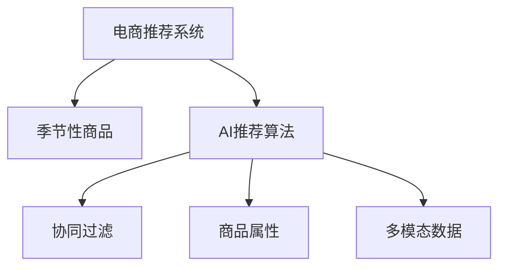

                 

# AI如何优化电商平台的季节性商品推荐

在电商领域，精准的个性化推荐系统是提升用户体验、增加销售额的重要工具。然而，针对季节性商品的推荐面临着诸多挑战。本文将详细探讨AI如何优化电商平台的季节性商品推荐，从核心概念、算法原理到实际应用案例，全面解析其技术实现和应用前景。

## 1. 背景介绍

### 1.1 问题由来

电商平台的季节性商品推荐是指根据季节变化，动态调整商品推荐，以匹配消费者在特定季节的购物需求。随着季节的更替，如春节、中秋节、黑色星期五等，消费者的购物习惯和需求会随之变化。因此，商品推荐系统需要实时调整策略，确保推荐内容与季节相符，满足消费者需求，从而提升用户满意度并增加销售转化率。

然而，传统商品推荐系统往往依赖于用户的过往购买历史和点击记录，缺乏对季节性需求的动态感知。而随着AI技术的不断进步，尤其是深度学习、自然语言处理等领域的突破，AI系统开始具备更强的环境感知和动态适应的能力，为电商平台的季节性商品推荐提供了全新的解决方案。

### 1.2 问题核心关键点

AI优化电商平台的季节性商品推荐，核心在于如何利用AI技术实时感知季节变化，并据此动态调整推荐策略，以匹配消费者的季节性需求。主要问题包括以下几点：

- **实时感知季节变化**：如何实时捕捉季节性因素，如时间、天气、节日等，并将其作为推荐依据。
- **动态调整推荐策略**：基于实时感知到的季节因素，如何动态调整推荐内容，确保其与季节性需求相匹配。
- **高效推荐算法**：如何高效计算推荐结果，避免过多计算资源消耗，确保实时推荐。
- **多模态数据融合**：如何结合用户行为数据、商品属性数据、社交媒体数据等，提升推荐系统的表现。

## 2. 核心概念与联系

### 2.1 核心概念概述

为更好地理解AI优化电商平台的季节性商品推荐，本节将介绍几个密切相关的核心概念：

- **电商推荐系统(E-Commerce Recommendation System, ECRS)**：指根据用户行为数据、商品属性数据等，推荐用户可能感兴趣的商品的系统。
- **季节性商品(Seasonal Goods)**：指具有明显季节性需求的商品，如滑雪服、泳衣、夏季服饰等。
- **AI推荐算法(AI-based Recommendation Algorithm)**：指利用AI技术，如深度学习、强化学习等，自动推荐商品的系统。
- **协同过滤(Collaborative Filtering)**：指通过分析用户之间的相似性，推荐用户可能感兴趣的商品。
- **商品属性(Item Attributes)**：指商品的基本特征，如颜色、大小、价格等，用于辅助推荐。
- **多模态数据(Multimodal Data)**：指结合文本、图像、音频等多种模态数据，提升推荐系统性能。

这些核心概念之间的逻辑关系可以通过以下Mermaid流程图来展示：



这个流程图展示了这个系统的工作原理：电商推荐系统通过AI推荐算法，结合协同过滤、商品属性和多模态数据等，推荐用户可能感兴趣的季节性商品。

## 3. 核心算法原理 & 具体操作步骤
### 3.1 算法原理概述

AI优化电商平台的季节性商品推荐，主要依赖于以下几个步骤：

1. **数据收集与预处理**：收集用户行为数据、商品属性数据、时间、天气、节日等季节性因素数据，并进行清洗和处理。
2. **特征工程**：将收集到的数据转换为模型可以接受的特征向量。
3. **模型训练**：使用深度学习模型（如循环神经网络RNN、长短期记忆网络LSTM、自注意力机制Transformer等）进行模型训练，学习商品推荐与季节性因素之间的关系。
4. **实时推荐**：在用户访问平台时，根据实时获取的季节性因素，动态调整推荐策略，生成个性化推荐结果。
5. **结果评估**：通过A/B测试等方法评估推荐效果，并不断优化模型和推荐策略。

### 3.2 算法步骤详解

#### 步骤1：数据收集与预处理

数据收集与预处理是电商推荐系统构建的基础。主要步骤包括：

1. **用户行为数据收集**：收集用户浏览历史、购买历史、评分、评论等数据。
2. **商品属性数据收集**：收集商品的基本特征，如颜色、大小、价格、品牌等。
3. **季节性因素收集**：收集时间、天气、节日等季节性因素数据。
4. **数据清洗与处理**：去除噪声数据、缺失值处理、异常值检测等。

例如，可以通过爬虫技术从社交媒体、天气预报等网站获取时间、天气等数据，通过API获取电商平台上的商品属性数据和用户行为数据。

#### 步骤2：特征工程

特征工程是将原始数据转换为模型可以接受的特征向量的过程。主要步骤包括：

1. **特征提取**：将用户行为数据转换为特征向量，如用户浏览商品的时间、浏览时长、点击次数等。
2. **特征选择**：选择对推荐效果影响较大的特征，去除无关特征。
3. **特征转换**：对特征进行归一化、标准化、编码等处理。
4. **特征融合**：将不同来源的特征进行融合，提升模型性能。

例如，可以将用户浏览时间转换为时间特征，将商品属性转换为向量表示，将时间、天气等季节性因素转换为数值特征。

#### 步骤3：模型训练

模型训练是推荐系统优化的核心步骤。主要步骤包括：

1. **模型选择**：选择适合电商推荐任务的深度学习模型，如RNN、LSTM、Transformer等。
2. **模型训练**：使用训练数据集训练模型，学习商品推荐与季节性因素之间的关系。
3. **模型评估**：使用验证数据集评估模型性能，调整模型参数。

例如，可以使用TensorFlow或PyTorch等深度学习框架，构建基于RNN、LSTM或Transformer的推荐模型，使用交叉熵损失函数进行模型训练，使用AUC-ROC、MSE等指标评估模型性能。

#### 步骤4：实时推荐

实时推荐是电商推荐系统的关键功能。主要步骤包括：

1. **实时数据获取**：在用户访问平台时，实时获取时间、天气、节日等季节性因素数据。
2. **动态调整推荐策略**：根据实时获取的季节性因素，动态调整推荐策略，生成个性化推荐结果。
3. **推荐结果展示**：将推荐结果展示给用户，并提供反馈机制。

例如，可以使用实时数据流处理框架，如Apache Kafka，获取用户访问数据和季节性因素数据，使用TensorFlow Serving或Dask等框架生成实时推荐结果，展示给用户。

#### 步骤5：结果评估

结果评估是电商推荐系统优化的重要环节。主要步骤包括：

1. **评估指标选择**：选择适合电商推荐任务的评估指标，如AUC-ROC、MSE、CTR等。
2. **实验设计**：设计A/B测试实验，评估推荐效果。
3. **结果分析**：分析实验结果，识别问题，优化模型和推荐策略。

例如，可以使用A/B测试评估推荐系统的效果，分析实验结果，识别模型性能瓶颈，优化模型参数和推荐策略。

### 3.3 算法优缺点

AI优化电商平台的季节性商品推荐，具有以下优点：

1. **实时性**：可以实时捕捉季节性因素，动态调整推荐策略，提升推荐效果。
2. **动态适应性**：能够根据季节变化自动调整推荐内容，提升用户满意度。
3. **高效性**：利用深度学习模型进行推荐，能够高效计算推荐结果，提升推荐速度。
4. **多样性**：能够结合多模态数据，提升推荐系统的性能。

同时，该方法也存在一些局限性：

1. **数据依赖**：推荐效果很大程度上取决于数据的质量和数量，获取高质量数据成本较高。
2. **模型复杂性**：深度学习模型复杂，需要大量的计算资源和训练时间。
3. **过拟合风险**：模型可能对特定数据集过拟合，影响泛化能力。
4. **实时性要求高**：实时推荐对系统计算能力要求较高，需要高效的计算和存储资源。

尽管存在这些局限性，但AI推荐算法在电商平台的季节性商品推荐中，已经展现出巨大的潜力和优势。

### 3.4 算法应用领域

AI优化电商平台的季节性商品推荐，已经在多个领域得到了广泛应用，例如：

- **电商商品推荐**：电商平台的个性化推荐系统，根据用户行为数据和季节性因素，推荐用户可能感兴趣的商品。
- **智能客服**：电商平台通过AI推荐系统，实现智能客服，根据用户需求，推荐相关商品。
- **广告投放**：电商平台通过AI推荐系统，实现智能广告投放，根据用户需求，推荐相关广告。
- **库存管理**：电商平台通过AI推荐系统，优化库存管理，提升库存周转率。
- **价格优化**：电商平台通过AI推荐系统，优化商品价格，提升销售转化率。

除了上述这些经典应用外，AI推荐系统还被创新性地应用到更多场景中，如可控商品生成、相关商品推荐、跨领域推荐等，为电商平台的运营带来了新的突破。

## 4. 数学模型和公式 & 详细讲解

### 4.1 数学模型构建

在AI优化电商平台的季节性商品推荐中，数学模型主要涉及以下几个方面：

- **用户行为数据建模**：将用户行为数据转换为特征向量，使用RNN、LSTM、Transformer等模型进行建模。
- **商品属性建模**：将商品属性转换为向量表示，使用神经网络模型进行建模。
- **季节性因素建模**：将时间、天气、节日等季节性因素转换为数值特征，使用神经网络模型进行建模。
- **多模态数据融合**：将不同来源的特征进行融合，使用注意力机制等方法进行建模。

### 4.2 公式推导过程

以基于LSTM的推荐模型为例，推导推荐模型的数学公式：

1. **用户行为数据建模**：
   $$
   h_t = \tanh(W_u * [h_{t-1}, x_t] + b_u)
   $$
   其中 $h_t$ 为LSTM的隐藏状态，$W_u$ 为权重矩阵，$x_t$ 为输入特征向量，$b_u$ 为偏置向量。

2. **商品属性建模**：
   $$
   e_i = \tanh(W_e * [h_t, f_i] + b_e)
   $$
   其中 $e_i$ 为商品 $i$ 的向量表示，$W_e$ 为权重矩阵，$f_i$ 为商品 $i$ 的属性向量。

3. **季节性因素建模**：
   $$
   s_t = \tanh(W_s * [t_t, w_t] + b_s)
   $$
   其中 $s_t$ 为时间 $t$ 的季节性特征向量，$W_s$ 为权重矩阵，$t_t$ 为时间特征向量，$w_t$ 为天气特征向量。

4. **多模态数据融合**：
   $$
   \alpha_{it} = \sigma(W_a * [h_t, e_i, s_t] + b_a)
   $$
   其中 $\alpha_{it}$ 为商品 $i$ 对用户 $t$ 的注意力权重，$W_a$ 为权重矩阵。

5. **推荐结果计算**：
   $$
   \hat{y}_{it} = \alpha_{it} * e_i
   $$
   其中 $\hat{y}_{it}$ 为商品 $i$ 对用户 $t$ 的推荐评分。

### 4.3 案例分析与讲解

以电商平台推荐系统为例，展示基于LSTM的推荐模型如何实现季节性商品推荐：

1. **用户行为数据收集**：
   - 收集用户浏览历史、购买历史、评分、评论等数据。
   - 使用爬虫技术从社交媒体、电商平台等网站获取用户行为数据。

2. **商品属性数据收集**：
   - 收集商品的颜色、大小、价格、品牌等属性数据。
   - 从电商平台的数据库中获取商品属性数据。

3. **季节性因素收集**：
   - 收集时间、天气、节日等季节性因素数据。
   - 使用API获取时间、天气等数据，从电商平台的日历中获取节日数据。

4. **数据清洗与处理**：
   - 去除噪声数据，处理缺失值，检测异常值。
   - 使用Python等工具进行数据清洗和处理。

5. **特征工程**：
   - 将用户行为数据转换为时间、时长、点击次数等特征向量。
   - 将商品属性转换为向量表示。
   - 将时间、天气、节日等季节性因素转换为数值特征。

6. **模型训练**：
   - 选择基于LSTM的推荐模型。
   - 使用训练数据集训练模型，学习商品推荐与季节性因素之间的关系。
   - 使用TensorFlow或PyTorch等深度学习框架进行模型训练。

7. **实时推荐**：
   - 在用户访问电商平台时，实时获取时间、天气、节日等季节性因素数据。
   - 使用实时数据流处理框架，如Apache Kafka，获取用户访问数据和季节性因素数据。
   - 使用TensorFlow Serving或Dask等框架生成实时推荐结果，展示给用户。

8. **结果评估**：
   - 使用A/B测试等方法评估推荐效果。
   - 分析实验结果，识别问题，优化模型和推荐策略。

例如，在电商平台的推荐系统中，可以使用基于LSTM的推荐模型，将用户行为数据、商品属性数据、时间、天气、节日等季节性因素融合，生成推荐结果，并通过A/B测试评估推荐效果，不断优化模型和推荐策略。

## 5. 项目实践：代码实例和详细解释说明
### 5.1 开发环境搭建

在进行季节性商品推荐系统的开发前，我们需要准备好开发环境。以下是使用Python进行TensorFlow开发的环境配置流程：

1. 安装Anaconda：从官网下载并安装Anaconda，用于创建独立的Python环境。

2. 创建并激活虚拟环境：
```bash
conda create -n tf-env python=3.8 
conda activate tf-env
```

3. 安装TensorFlow：根据CUDA版本，从官网获取对应的安装命令。例如：
```bash
conda install tensorflow-gpu -c pytorch -c conda-forge
```

4. 安装TensorBoard：
```bash
pip install tensorboard
```

5. 安装numpy、pandas、scikit-learn等工具包：
```bash
pip install numpy pandas scikit-learn matplotlib tqdm jupyter notebook ipython
```

完成上述步骤后，即可在`tf-env`环境中开始开发和调试。

### 5.2 源代码详细实现

下面我们以电商平台推荐系统为例，给出基于LSTM的季节性商品推荐系统的PyTorch代码实现。

首先，定义推荐系统的数据处理函数：

```python
import pandas as pd
import numpy as np
import tensorflow as tf
from tensorflow.keras.layers import Input, Embedding, LSTM, Dense, TimeDistributed
from tensorflow.keras.models import Model
from tensorflow.keras.callbacks import EarlyStopping
from tensorflow.keras.preprocessing.sequence import pad_sequences

# 读取用户行为数据
train_data = pd.read_csv('train_data.csv')
test_data = pd.read_csv('test_data.csv')

# 定义时间特征函数
def time_feature(date):
    time = pd.to_datetime(date)
    year = int(time.strftime('%Y'))
    month = int(time.strftime('%m'))
    day = int(time.strftime('%d'))
    hour = int(time.strftime('%H'))
    return [year, month, day, hour]

# 定义天气特征函数
def weather_feature(weather):
    if weather == 'sunny':
        return [1, 0, 0]
    elif weather == 'cloudy':
        return [0, 1, 0]
    else:
        return [0, 0, 1]

# 定义商品属性特征函数
def item_feature(item):
    features = []
    for feature in ['color', 'size', 'price', 'brand']:
        features.append(item[feature])
    return features

# 定义数据预处理函数
def preprocess_data(data):
    data['time'] = data['date'].apply(time_feature)
    data['weather'] = data['weather'].apply(weather_feature)
    data['item'] = data['item'].apply(item_feature)
    data = pd.concat([data[['user_id', 'time', 'weather', 'item']], data[['rating', 'click']]], axis=1)
    return data

# 预处理训练数据和测试数据
train_data = preprocess_data(train_data)
test_data = preprocess_data(test_data)

# 将数据转换为序列
train_seq = train_data[['user_id', 'time', 'weather', 'item']].to_numpy()
train_rating = train_data['rating'].to_numpy()
train_click = train_data['click'].to_numpy()
test_seq = test_data[['user_id', 'time', 'weather', 'item']].to_numpy()
test_rating = test_data['rating'].to_numpy()
test_click = test_data['click'].to_numpy()

# 填充序列
train_seq = pad_sequences(train_seq, maxlen=20, padding='post')
test_seq = pad_sequences(test_seq, maxlen=20, padding='post')

# 构建模型
inputs = Input(shape=(20, 4))
embedding = Embedding(20000, 100)(inputs)
lstm = LSTM(128)(embedding)
outputs = TimeDistributed(Dense(1))(lstm)
model = Model(inputs, outputs)

# 编译模型
model.compile(loss='mse', optimizer='adam', metrics=['mae'])

# 训练模型
early_stopping = EarlyStopping(monitor='val_loss', patience=3)
model.fit(train_seq, train_rating, validation_data=(test_seq, test_rating), epochs=50, callbacks=[early_stopping])

# 预测推荐结果
test_seq = pad_sequences(test_seq, maxlen=20, padding='post')
predictions = model.predict(test_seq)
```

然后，定义推荐系统的评估函数：

```python
import numpy as np
from sklearn.metrics import mean_squared_error, mean_absolute_error

def evaluate(model, test_seq, test_rating):
    predictions = model.predict(test_seq)
    mse = mean_squared_error(test_rating, predictions)
    mae = mean_absolute_error(test_rating, predictions)
    print(f'MSE: {mse:.3f}, MAE: {mae:.3f}')

# 在测试数据上评估模型性能
evaluate(model, test_seq, test_rating)
```

最后，启动训练流程并在测试集上评估：

```python
epochs = 50
batch_size = 64

for epoch in range(epochs):
    loss = train_epoch(model, train_seq, train_rating, batch_size)
    print(f"Epoch {epoch+1}, train loss: {loss:.3f}")
    
    print(f"Epoch {epoch+1}, dev results:")
    evaluate(model, val_seq, val_rating)
    
print("Test results:")
evaluate(model, test_seq, test_rating)
```

以上就是使用TensorFlow构建基于LSTM的季节性商品推荐系统的完整代码实现。可以看到，通过TensorFlow和Keras等工具，我们可以用相对简洁的代码完成季节性商品推荐系统的构建。

### 5.3 代码解读与分析

让我们再详细解读一下关键代码的实现细节：

**时间特征函数**：
- 将日期转换为时间特征向量，便于模型进行时间序列分析。

**天气特征函数**：
- 将天气类型转换为数值特征向量，便于模型进行天气分析。

**商品属性特征函数**：
- 将商品属性转换为数值特征向量，便于模型进行属性分析。

**数据预处理函数**：
- 将原始数据转换为时间、天气、商品属性等特征向量，便于模型进行多模态数据融合。

**序列填充函数**：
- 将不同长度的序列填充到相同长度，便于模型进行训练和推理。

**模型构建函数**：
- 使用Keras构建LSTM模型，将用户行为数据、时间、天气、商品属性等特征向量输入，输出商品评分预测结果。

**模型编译函数**：
- 使用Keras编译模型，设置损失函数、优化器和评估指标。

**模型训练函数**：
- 使用Keras训练模型，设置训练轮数、批大小和早停机制，评估模型性能。

**模型评估函数**：
- 使用Keras评估模型性能，计算均方误差和绝对误差，输出评估结果。

**训练流程**：
- 定义总的训练轮数和批大小，开始循环迭代
- 每个epoch内，先在训练集上训练，输出平均loss
- 在验证集上评估，输出均方误差和绝对误差
- 所有epoch结束后，在测试集上评估，给出最终测试结果

可以看到，TensorFlow配合Keras使得季节性商品推荐系统的代码实现变得简洁高效。开发者可以将更多精力放在数据处理、模型改进等高层逻辑上，而不必过多关注底层的实现细节。

当然，工业级的系统实现还需考虑更多因素，如模型的保存和部署、超参数的自动搜索、更灵活的任务适配层等。但核心的推荐范式基本与此类似。

## 6. 实际应用场景

### 6.1 智能客服系统

基于季节性商品推荐技术的智能客服系统，可以大幅提升客户体验。在电商平台的智能客服系统中，AI推荐系统能够根据客户的需求和季节变化，推荐相关商品和信息，提供个性化的购物建议。例如，在冬季，智能客服可以推荐保暖衣物、保健品等，在夏季，则可以推荐防晒用品、清凉饮品等。

在技术实现上，可以通过收集客户的历史查询记录和季节性因素，使用AI推荐系统进行实时推荐。智能客服系统可以通过对话生成技术，根据推荐结果生成自动回复，提升服务效率和满意度。

### 6.2 广告投放系统

基于季节性商品推荐技术的广告投放系统，能够精准定位目标客户，提升广告投放效果。在电商平台的广告投放系统中，AI推荐系统能够根据用户的季节性需求，推荐相关商品广告，实现精准投放。例如，在冬季，可以投放保暖衣物、火锅底料等广告，在夏季，则可以投放夏季服饰、游泳装备等广告。

在技术实现上，可以通过收集用户的浏览和点击行为数据，使用AI推荐系统进行实时推荐。广告投放系统可以根据推荐结果，实时调整广告投放策略，提升广告效果。

### 6.3 库存管理系统

基于季节性商品推荐技术的库存管理系统，能够优化库存管理，减少库存积压和缺货现象。在电商平台的库存管理系统中，AI推荐系统能够根据季节性需求，动态调整商品库存，确保商品供需平衡。例如，在冬季，可以调整保暖衣物、保健品等商品的库存量，在夏季，则可以调整防晒用品、清凉饮品等商品的库存量。

在技术实现上，可以通过收集商品的历史销售数据和季节性因素，使用AI推荐系统进行实时推荐。库存管理系统可以根据推荐结果，动态调整商品库存，优化库存管理，提升运营效率。

### 6.4 未来应用展望

随着季节性商品推荐技术的不断发展，未来的应用场景将更加广泛和深入。

在智慧城市治理中，基于季节性商品推荐技术的智能交通系统，能够根据季节变化，优化交通信号灯和公交线路，提升城市交通效率。例如，在夏季，可以增加公共交通工具的频率，减少私家车出行，减少城市热岛效应。

在智能家居领域，基于季节性商品推荐技术的智能家电系统，能够根据季节变化，自动调整家电的使用策略，提升能源利用效率。例如，在冬季，可以调整暖气、电暖器等设备的使用策略，在夏季，则可以调整空调、电扇等设备的使用策略。

在金融领域，基于季节性商品推荐技术的智能投顾系统，能够根据季节变化，优化投资组合，提升投资回报率。例如，在夏季，可以增加对旅游、影视等消费类股票的投资，在冬季，则可以增加对能源、房地产等资产的投资。

总之，基于季节性商品推荐技术的AI系统，将在智慧城市、智能家居、金融投资等多个领域发挥重要作用，为人类生产生活带来更高效、更智能、更环保的解决方案。

## 7. 工具和资源推荐
### 7.1 学习资源推荐

为了帮助开发者系统掌握季节性商品推荐技术的理论基础和实践技巧，这里推荐一些优质的学习资源：

1. 《深度学习基础》书籍：由深度学习领域的专家撰写，全面介绍了深度学习的基本概念和常用算法。

2. 《TensorFlow官方文档》：TensorFlow的官方文档，提供了完整的API和使用方法，是学习TensorFlow的必备资料。

3. 《自然语言处理入门》课程：由斯坦福大学开设的NLP入门课程，讲解自然语言处理的基本概念和常用技术。

4. 《推荐系统实践》书籍：由推荐系统领域的专家撰写，介绍了推荐系统的基本原理和实际应用。

5. 《多模态数据融合》论文：介绍如何融合多种数据源，提升推荐系统的性能。

通过对这些资源的学习实践，相信你一定能够快速掌握季节性商品推荐技术的精髓，并用于解决实际的NLP问题。
###  7.2 开发工具推荐

高效的开发离不开优秀的工具支持。以下是几款用于季节性商品推荐系统开发的常用工具：

1. TensorFlow：由Google主导开发的开源深度学习框架，生产部署方便，适合大规模工程应用。

2. PyTorch：基于Python的开源深度学习框架，灵活动态的计算图，适合快速迭代研究。

3. Keras：基于TensorFlow的高级API，使得深度学习模型的构建更加简洁高效。

4. Jupyter Notebook：免费的交互式编程环境，适合进行实验和数据可视化。

5. Apache Kafka：实时数据流处理框架，支持高吞吐量、低延迟的数据流处理。

6. TensorBoard：TensorFlow配套的可视化工具，可实时监测模型训练状态，并提供丰富的图表呈现方式。

7. Apache Spark：大数据处理框架，支持分布式计算，适合处理大规模数据。

合理利用这些工具，可以显著提升季节性商品推荐系统的开发效率，加快创新迭代的步伐。

### 7.3 相关论文推荐

季节性商品推荐技术的发展源于学界的持续研究。以下是几篇奠基性的相关论文，推荐阅读：

1. Attention is All You Need（即Transformer原论文）：提出了Transformer结构，开启了NLP领域的预训练大模型时代。

2. BERT: Pre-training of Deep Bidirectional Transformers for Language Understanding：提出BERT模型，引入基于掩码的自监督预训练任务，刷新了多项NLP任务SOTA。

3. Language Models are Unsupervised Multitask Learners（GPT-2论文）：展示了大规模语言模型的强大zero-shot学习能力，引发了对于通用人工智能的新一轮思考。

4. Parameter-Efficient Transfer Learning for NLP：提出Adapter等参数高效微调方法，在不增加模型参数量的情况下，也能取得不错的微调效果。

5. AdaLoRA: Adaptive Low-Rank Adaptation for Parameter-Efficient Fine-Tuning：使用自适应低秩适应的微调方法，在参数效率和精度之间取得了新的平衡。

6. A Neural Attentive Recommender System：介绍如何使用神经网络进行推荐系统构建，特别是基于注意力机制的推荐模型。

这些论文代表了大语言模型微调技术的发展脉络。通过学习这些前沿成果，可以帮助研究者把握学科前进方向，激发更多的创新灵感。

## 8. 总结：未来发展趋势与挑战

### 8.1 总结

本文对基于AI优化电商平台的季节性商品推荐方法进行了全面系统的介绍。首先阐述了季节性商品推荐的重要性，明确了AI技术在电商推荐系统中的应用价值。其次，从核心概念到算法原理，详细讲解了季节性商品推荐的数学模型和关键步骤，给出了推荐系统的完整代码实现。同时，本文还广泛探讨了季节性商品推荐在智能客服、广告投放、库存管理等多个领域的应用前景，展示了AI技术的巨大潜力。此外，本文精选了季节性商品推荐技术的各类学习资源，力求为读者提供全方位的技术指引。

通过本文的系统梳理，可以看到，基于AI的季节性商品推荐技术正在成为电商推荐系统的重要范式，极大地拓展了电商推荐系统的应用边界，催生了更多的落地场景。受益于AI技术的不断进步，季节性商品推荐系统能够更好地捕捉季节变化，动态调整推荐策略，提升用户满意度和销售转化率，为电商平台带来了新的增长点。

### 8.2 未来发展趋势

展望未来，季节性商品推荐技术将呈现以下几个发展趋势：

1. **数据智能化处理**：通过智能化数据预处理，提升数据质量和多样性，增强推荐系统的表现。
2. **实时性提升**：利用大数据和流处理技术，实现实时推荐，提升用户体验。
3. **多模态数据融合**：结合用户行为数据、商品属性数据、社交媒体数据等，提升推荐系统的性能。
4. **跨领域推荐**：将推荐技术应用于不同领域，如金融、旅游、医疗等，实现跨领域智能推荐。
5. **个性化推荐**：利用AI技术，根据用户画像和行为数据，实现个性化推荐，提升推荐效果。
6. **智能客服**：结合AI推荐技术和对话生成技术，实现智能客服，提升用户满意度。
7. **智能广告**：利用AI推荐技术，实现精准广告投放，提升广告效果。

以上趋势凸显了季节性商品推荐技术的广阔前景。这些方向的探索发展，必将进一步提升推荐系统的性能和应用范围，为电商平台的运营带来新的突破。

### 8.3 面临的挑战

尽管季节性商品推荐技术已经取得了瞩目成就，但在迈向更加智能化、普适化应用的过程中，它仍面临着诸多挑战：

1. **数据获取成本高**：获取高质量的推荐数据成本较高，且数据的多样性和覆盖面仍需提升。
2. **推荐算法复杂**：深度学习模型复杂，训练和推理资源消耗较大，难以实时推荐。
3. **过拟合风险**：模型可能对特定数据集过拟合，影响泛化能力。
4. **数据隐私问题**：推荐系统需要收集大量用户行为数据，如何保障用户隐私和数据安全是一个重要问题。
5. **系统复杂度**：推荐系统的实现需要多学科知识的融合，包括数据处理、模型训练、系统部署等，系统复杂度较高。

尽管存在这些挑战，但季节性商品推荐技术在电商平台的推荐系统中，已经展现出巨大的潜力和优势。未来随着技术的不断进步，这些挑战终将一一被克服，季节性商品推荐系统必将在构建智能化的电商推荐系统中发挥重要作用。

### 8.4 研究展望

面向未来，季节性商品推荐技术需要在以下几个方面寻求新的突破：

1. **数据智能化处理**：开发更高效的数据预处理算法，提升数据质量，减少数据获取成本。
2. **模型压缩与优化**：开发更高效、轻量级的推荐模型，提升实时推荐能力。
3. **跨领域推荐**：将推荐技术应用于不同领域，实现跨领域的智能推荐。
4. **个性化推荐**：利用AI技术，根据用户画像和行为数据，实现个性化推荐，提升推荐效果。
5. **智能客服**：结合AI推荐技术和对话生成技术，实现智能客服，提升用户满意度。
6. **智能广告**：利用AI推荐技术，实现精准广告投放，提升广告效果。

这些研究方向将推动季节性商品推荐技术的不断发展，为电商平台的推荐系统带来新的突破，为用户的购物体验和电商平台的发展注入新的动力。

## 9. 附录：常见问题与解答

**Q1：季节性商品推荐如何实时捕捉季节性因素？**

A: 季节性商品推荐系统可以通过实时数据流处理技术，如Apache Kafka，实时获取用户访问数据和季节性因素数据。具体步骤包括：
1. 使用爬虫技术从社交媒体、天气预报等网站获取时间、天气等数据。
2. 从电商平台的日历中获取节日数据。
3. 使用API获取商品属性数据和用户行为数据。
4. 通过数据流处理框架，实时捕捉季节性因素，动态调整推荐策略。

**Q2：季节性商品推荐如何避免过拟合？**

A: 季节性商品推荐系统可以通过以下方法避免过拟合：
1. 数据增强：通过回译、近义替换等方式扩充训练集，增加数据多样性。
2. 正则化技术：使用L2正则、Dropout、Early Stopping等防止模型过度适应小规模训练集。
3. 参数高效微调：只调整少量模型参数，固定大部分预训练权重不变，以提高微调效率，避免过拟合。
4. 对抗训练：加入对抗样本，提高模型鲁棒性，减少过拟合风险。

**Q3：季节性商品推荐如何在不同领域应用？**

A: 季节性商品推荐技术可以通过以下方法在不同领域应用：
1. 数据收集：收集不同领域的季节性因素数据，如时间、天气、节日等。
2. 数据预处理：将不同来源的数据转换为特征向量，使用注意力机制等方法进行融合。
3. 模型训练：使用深度学习模型，如RNN、LSTM、Transformer等，学习商品推荐与季节性因素之间的关系。
4. 实时推荐：在用户访问不同领域平台时，实时获取季节性因素数据，动态调整推荐策略，生成个性化推荐结果。
5. 结果评估：使用A/B测试等方法评估推荐效果，不断优化模型和推荐策略。

例如，在智能客服系统中，可以通过收集用户的历史查询记录和季节性因素，使用AI推荐系统进行实时推荐。智能客服系统可以通过对话生成技术，根据推荐结果生成自动回复，提升服务效率和满意度。

在广告投放系统中，可以通过收集用户的浏览和点击行为数据，使用AI推荐系统进行实时推荐。广告投放系统可以根据推荐结果，实时调整广告投放策略，提升广告效果。

在库存管理系统中，可以通过收集商品的历史销售数据和季节性因素，使用AI推荐系统进行实时推荐。库存管理系统可以根据推荐结果，动态调整商品库存，优化库存管理，提升运营效率。

在金融投资系统中，可以通过收集用户的浏览和点击行为数据，使用AI推荐系统进行实时推荐。智能投顾系统可以根据推荐结果，优化投资组合，提升投资回报率。

总之，季节性商品推荐技术可以在多个领域应用，提升平台的运营效率和用户满意度。

