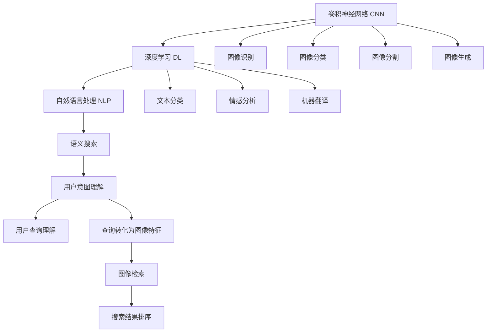

                 

# AI如何改善搜索引擎的图像识别能力

> 关键词：搜索引擎,图像识别,深度学习,卷积神经网络(CNN),自然语言处理(NLP),语义搜索,计算图

## 1. 背景介绍

### 1.1 问题由来

随着互联网的普及和移动设备的普及，搜索引擎已经成为了人们获取信息的重要手段。传统的文本搜索方式，已经无法满足日益增长的视觉信息需求。如何有效处理和利用海量的图像信息，成为搜索引擎领域的重大挑战。

搜索引擎巨头如Google、Bing等，都在积极探索图像搜索技术的突破。目前，尽管基于视觉特征的图像检索技术已经取得了显著进展，但仍然存在诸多问题：

1. **语义理解不足**：现有技术主要依赖图像的视觉特征进行检索，无法捕捉图像中的语义信息，导致检索结果与用户意图不匹配。
2. **跨模态融合困难**：视觉和文本模态之间的信息融合仍存在技术瓶颈，使得图像检索和文本搜索之间难以无缝衔接。
3. **用户意图泛化能力差**：现有技术无法很好地理解复杂多样的用户查询，导致检索结果不够精准和全面。

为了解决这些问题，近年来，基于深度学习的AI技术在图像识别和检索领域逐步崭露头角。深度学习尤其是卷积神经网络(CNN)的快速发展，为图像识别技术带来了革命性的提升。本文章将探讨AI技术如何改善搜索引擎的图像识别能力，重点讨论基于深度学习的图像识别方法及其在搜索引擎中的应用。

### 1.2 问题核心关键点

- **图像识别**：从原始图像中提取出语义信息，使得机器能够理解图像内容。
- **语义搜索**：通过自然语言处理(NLP)技术，将用户的查询转化为图像特征，进行高效检索。
- **跨模态融合**：将视觉特征与文本特征进行融合，提高检索的准确性和泛化能力。
- **用户意图理解**：通过理解用户的查询意图，优化图像识别和检索策略，提高用户体验。

这些核心关键点将贯穿全文，帮助读者全面了解AI如何改善搜索引擎的图像识别能力。

## 2. 核心概念与联系

### 2.1 核心概念概述

为更好地理解基于深度学习的图像识别方法及其在搜索引擎中的应用，本节将介绍几个密切相关的核心概念：

- **卷积神经网络(CNN)**：一种特殊的神经网络，通过卷积操作提取图像特征，适用于图像识别、分类、分割等任务。
- **深度学习(DL)**：一类通过多层神经网络进行复杂模式识别的机器学习方法，在图像识别、自然语言处理等领域都有广泛应用。
- **自然语言处理(NLP)**：一门研究如何让计算机处理和理解人类语言的技术，包括文本分类、情感分析、机器翻译等。
- **语义搜索**：一种基于用户意图的搜索引擎技术，通过理解和处理用户查询，实现更精准的检索结果。
- **跨模态融合**：将不同模态的数据（如图像、文本、音频）进行融合，提取更高层次的语义信息，提高搜索的准确性。

这些核心概念之间的逻辑关系可以通过以下Mermaid流程图来展示：



这个流程图展示了大语言模型的核心概念及其之间的关系：

1. 通过CNN和深度学习，提取图像的特征。
2. 通过NLP，处理用户的查询。
3. 将查询转化为图像特征。
4. 进行图像检索。
5. 对搜索结果进行排序，提高检索的准确性和泛化能力。

这些概念共同构成了AI在搜索引擎中改善图像识别能力的框架，使得机器能够更好地理解用户需求，提供精准的搜索结果。

## 3. 核心算法原理 & 具体操作步骤

### 3.1 算法原理概述

基于深度学习的图像识别方法，核心在于通过多层神经网络对图像数据进行特征提取和分类。其基本思路是：

1. **卷积层**：通过卷积操作，提取图像的局部特征。
2. **池化层**：对卷积层的输出进行下采样，减小特征图的大小，保留重要的信息。
3. **全连接层**：将池化层的输出转换为分类结果。

通过多层卷积和池化操作，CNN可以逐步提取出图像的语义信息，从而实现高精度的图像识别。在搜索引擎中，可以使用CNN对图像进行特征提取，再通过NLP处理用户查询，最终实现精准的语义搜索。

### 3.2 算法步骤详解

基于深度学习的图像识别方法在搜索引擎中的应用，主要包括以下几个步骤：

**Step 1: 图像特征提取**

1. **预处理**：对原始图像进行预处理，如归一化、裁剪、缩放等操作，保证图像的质量和一致性。
2. **卷积层**：通过卷积操作，提取图像的局部特征。
3. **池化层**：对卷积层的输出进行下采样，减小特征图的大小，保留重要的信息。
4. **特征融合**：将多个卷积层和池化层的输出进行融合，提取更高层次的特征。
5. **特征向量**：将融合后的特征向量作为图像的语义表示，用于后续的检索和分类。

**Step 2: 用户查询处理**

1. **查询预处理**：对用户的查询进行预处理，如分词、去除停用词、词性标注等。
2. **嵌入表示**：使用词嵌入技术将查询转化为向量表示。
3. **上下文表示**：考虑查询的上下文信息，进行向量扩展。
4. **查询向量**：将处理后的查询转化为向量，用于与图像特征向量进行比较。

**Step 3: 图像检索**

1. **向量距离计算**：计算图像特征向量与查询向量的距离，常用的距离度量包括欧氏距离、余弦相似度等。
2. **排序算法**：根据计算出的距离，对搜索结果进行排序。
3. **筛选和过滤**：根据用户意图和上下文信息，对搜索结果进行筛选和过滤，提高检索的准确性和泛化能力。

**Step 4: 结果展示**

1. **展示算法**：选择合适的展示算法，如直方图、散点图等，展示检索结果。
2. **交互设计**：设计友好的交互界面，支持用户对检索结果进行排序、过滤、反馈等操作。

通过以上步骤，AI技术可以显著提升搜索引擎的图像识别能力，使用户能够通过自然语言查询，获取到更加精准和全面的图像信息。

### 3.3 算法优缺点

基于深度学习的图像识别方法在搜索引擎中的应用，具有以下优点：

1. **高精度**：通过多层卷积和池化操作，CNN可以逐步提取出图像的语义信息，实现高精度的图像识别。
2. **泛化能力**：深度学习模型可以学习到复杂的非线性特征，具有较强的泛化能力，适用于多种图像识别任务。
3. **灵活性**：CNN模型结构灵活，可以根据具体任务进行调整和优化。
4. **可扩展性**：深度学习模型可以很容易地扩展到其他模态数据，实现跨模态融合。

同时，该方法也存在一些缺点：

1. **计算量大**：深度学习模型的训练和推理需要大量计算资源，对硬件要求较高。
2. **模型复杂**：CNN模型的结构复杂，调试和优化难度较大。
3. **解释性差**：深度学习模型往往是"黑盒"系统，难以解释其内部工作机制。
4. **数据需求高**：深度学习模型需要大量标注数据进行训练，数据获取成本较高。

尽管存在这些局限性，但基于深度学习的图像识别方法在搜索引擎中的应用，已经在诸多实验中展示了其优越性。未来，通过进一步优化模型结构和训练方法，可以更好地解决这些缺点，提升搜索引擎的图像识别能力。

### 3.4 算法应用领域

基于深度学习的图像识别方法在搜索引擎中的应用，主要包括以下几个领域：

- **图像搜索**：使用CNN提取图像特征，通过NLP处理用户查询，实现精准的图像检索。
- **广告推荐**：通过对用户浏览的图像进行识别，推荐相关广告，提升用户体验。
- **社交网络**：通过分析用户的社交图像，推荐相似的朋友或内容，增强社交互动。
- **智能家居**：通过对图像的识别，控制家居设备，提升生活便捷性。
- **医疗诊断**：通过对医学图像的识别，辅助医生进行诊断和治疗。

这些领域的应用，展示了深度学习在搜索引擎中改善图像识别能力的广泛前景。未来，随着技术的不断进步，AI技术在搜索引擎中的应用将更加深入和广泛。

## 4. 数学模型和公式 & 详细讲解 & 举例说明

### 4.1 数学模型构建

本节将使用数学语言对基于深度学习的图像识别方法进行更加严格的刻画。

记输入图像为 $x \in \mathbb{R}^m$，输出为 $y \in \mathbb{R}^n$。假设使用一个卷积神经网络进行图像识别，网络的参数为 $\theta$。

定义网络的第 $i$ 层的特征表示为 $f_i(x, \theta)$，其中 $f_0(x, \theta)=x$ 为输入特征。

通过多层卷积和池化操作，网络输出为：

$$
f_L(x, \theta) = g_W \left( \sigma \left( W_1 f_{L-1}(x, \theta) + b_1 \right) \right)
$$

其中，$g_W$ 为全连接层，$\sigma$ 为激活函数，$W_1$ 和 $b_1$ 为全连接层的权重和偏置。

### 4.2 公式推导过程

以下我们以二分类任务为例，推导CNN的输出和损失函数。

假设网络输出为 $f_L(x, \theta)$，将其送入softmax函数，得到概率分布 $p(y|x, \theta)$：

$$
p(y|x, \theta) = \frac{e^{f_L(x, \theta)}_y}{\sum_k e^{f_L(x, \theta)}_k}
$$

其中，$e^{f_L(x, \theta)}_y$ 表示第 $y$ 个类别的概率分布。

定义二分类任务的损失函数为交叉熵损失：

$$
\mathcal{L}(\theta) = -\frac{1}{N} \sum_{i=1}^N \left[ y_i \log p(y_i|x_i, \theta) + (1-y_i) \log (1-p(y_i|x_i, \theta)) \right]
$$

其中，$N$ 为样本数，$y_i$ 为第 $i$ 个样本的真实标签。

在得到损失函数的梯度后，即可带入参数更新公式，完成模型的迭代优化。重复上述过程直至收敛，最终得到适应图像识别任务的最优模型参数 $\theta^*$。

### 4.3 案例分析与讲解

考虑一个典型的二分类图像识别任务，输入图像大小为 $m=64 \times 64 \times 3$，使用LeNet-5网络进行识别，输出类别数 $n=2$。

在训练过程中，可以使用反向传播算法计算损失函数的梯度，并通过梯度下降等优化算法更新模型参数。

以下是使用PyTorch实现CNN图像分类模型的代码示例：

```python
import torch
import torch.nn as nn
import torchvision.transforms as transforms
import torchvision.datasets as datasets
from torch.utils.data import DataLoader

# 定义CNN模型
class CNNModel(nn.Module):
    def __init__(self):
        super(CNNModel, self).__init__()
        self.conv1 = nn.Conv2d(3, 6, 5)
        self.pool = nn.MaxPool2d(2, 2)
        self.conv2 = nn.Conv2d(6, 16, 5)
        self.fc1 = nn.Linear(16 * 5 * 5, 120)
        self.fc2 = nn.Linear(120, 84)
        self.fc3 = nn.Linear(84, 2)
    
    def forward(self, x):
        x = self.pool(F.relu(self.conv1(x)))
        x = self.pool(F.relu(self.conv2(x)))
        x = x.view(-1, 16 * 5 * 5)
        x = F.relu(self.fc1(x))
        x = F.relu(self.fc2(x))
        x = self.fc3(x)
        return x

# 加载CIFAR-10数据集
train_dataset = datasets.CIFAR10(root='./data', train=True, download=True, transform=transforms.ToTensor())
test_dataset = datasets.CIFAR10(root='./data', train=False, download=True, transform=transforms.ToTensor())
train_loader = DataLoader(train_dataset, batch_size=100, shuffle=True)
test_loader = DataLoader(test_dataset, batch_size=100, shuffle=False)

# 定义优化器和损失函数
model = CNNModel()
criterion = nn.CrossEntropyLoss()
optimizer = torch.optim.SGD(model.parameters(), lr=0.001, momentum=0.9)

# 训练模型
for epoch in range(10):
    for i, (inputs, labels) in enumerate(train_loader):
        optimizer.zero_grad()
        outputs = model(inputs)
        loss = criterion(outputs, labels)
        loss.backward()
        optimizer.step()
        if (i+1) % 100 == 0:
            print('Epoch [%d/%d], Step [%d/%d], Loss: %.4f' %
                  (epoch+1, 10, i+1, len(train_loader), loss.item()))
    
    # 测试模型
    correct = 0
    total = 0
    with torch.no_grad():
        for inputs, labels in test_loader:
            outputs = model(inputs)
            _, predicted = torch.max(outputs.data, 1)
            total += labels.size(0)
            correct += (predicted == labels).sum().item()
    print('Accuracy of the network on the 10000 test images: %d %%' % (100 * correct / total))
```

以上代码展示了使用PyTorch实现CNN图像分类模型的全过程，包括模型定义、数据加载、优化器和损失函数设置、训练和测试等步骤。

## 5. 项目实践：代码实例和详细解释说明

### 5.1 开发环境搭建

在进行图像识别实践前，我们需要准备好开发环境。以下是使用Python进行PyTorch开发的环境配置流程：

1. 安装Anaconda：从官网下载并安装Anaconda，用于创建独立的Python环境。

2. 创建并激活虚拟环境：
```bash
conda create -n pytorch-env python=3.8 
conda activate pytorch-env
```

3. 安装PyTorch：根据CUDA版本，从官网获取对应的安装命令。例如：
```bash
conda install pytorch torchvision torchaudio cudatoolkit=11.1 -c pytorch -c conda-forge
```

4. 安装TensorFlow：如果需要在其他框架上测试，可以安装TensorFlow。

5. 安装各类工具包：
```bash
pip install numpy pandas scikit-learn matplotlib tqdm jupyter notebook ipython
```

完成上述步骤后，即可在`pytorch-env`环境中开始图像识别实践。

### 5.2 源代码详细实现

以下是使用TensorFlow实现卷积神经网络图像分类模型的代码示例：

```python
import tensorflow as tf
from tensorflow import keras

# 加载CIFAR-10数据集
(train_images, train_labels), (test_images, test_labels) = keras.datasets.cifar10.load_data()

# 归一化处理
train_images = train_images / 255.0
test_images = test_images / 255.0

# 定义CNN模型
model = keras.Sequential([
    keras.layers.Conv2D(32, (3, 3), activation='relu', input_shape=(32, 32, 3)),
    keras.layers.MaxPooling2D((2, 2)),
    keras.layers.Conv2D(64, (3, 3), activation='relu'),
    keras.layers.MaxPooling2D((2, 2)),
    keras.layers.Conv2D(64, (3, 3), activation='relu'),
    keras.layers.Flatten(),
    keras.layers.Dense(64, activation='relu'),
    keras.layers.Dense(10)
])

# 定义优化器和损失函数
optimizer = tf.keras.optimizers.Adam(learning_rate=0.001)
loss_fn = tf.keras.losses.SparseCategoricalCrossentropy(from_logits=True)

# 编译模型
model.compile(optimizer=optimizer, loss=loss_fn, metrics=['accuracy'])

# 训练模型
model.fit(train_images, train_labels, epochs=10, validation_data=(test_images, test_labels))

# 测试模型
test_loss, test_acc = model.evaluate(test_images, test_labels)
print('Test accuracy:', test_acc)
```

以上代码展示了使用TensorFlow实现CNN图像分类模型的全过程，包括数据加载、模型定义、优化器和损失函数设置、编译、训练和测试等步骤。

### 5.3 代码解读与分析

让我们再详细解读一下关键代码的实现细节：

**CNN模型定义**：
- `keras.Sequential`：使用Sequential模型构建CNN，依次添加卷积层、池化层、全连接层等组件。
- `Conv2D`：定义卷积层，包含卷积核的数量、大小和激活函数等参数。
- `MaxPooling2D`：定义池化层，进行下采样操作，减小特征图的大小。
- `Flatten`：将池化层的输出展平，用于连接全连接层。
- `Dense`：定义全连接层，进行分类。

**数据加载和处理**：
- `keras.datasets.cifar10.load_data()`：加载CIFAR-10数据集，包含训练集和测试集。
- `train_images = train_images / 255.0`：对图像进行归一化处理，将像素值缩放到0到1之间。

**模型训练和测试**：
- `model.fit(train_images, train_labels, epochs=10, validation_data=(test_images, test_labels))`：对模型进行训练，指定训练集、测试集、训练轮数和验证集。
- `test_loss, test_acc = model.evaluate(test_images, test_labels)`：对模型进行测试，计算测试集上的损失和精度。

可以看到，使用TensorFlow实现CNN图像分类模型的代码实现相对简洁，易于理解和调试。开发者可以将更多精力放在模型优化和实验设计上，而不必过多关注底层实现细节。

## 6. 实际应用场景

### 6.1 图像搜索

在图像搜索领域，基于深度学习的图像识别技术已经得到了广泛应用。用户可以通过自然语言查询，获取到相关的图像信息。

例如，在Google Images中，用户可以输入类似“一只可爱的猫咪”这样的查询，搜索结果中就会出现大量与猫咪相关的图像。这些图像由CNN提取特征，通过NLP处理查询，再进行匹配和排序，最终展示给用户。

### 6.2 广告推荐

广告推荐领域，通过分析用户浏览的图像，推荐相关广告，提升用户体验。例如，电商平台可以根据用户浏览的产品图像，推荐相似的商品广告，提高转化率。

### 6.3 社交网络

在社交网络中，通过分析用户的社交图像，推荐相似的朋友或内容，增强社交互动。例如，Instagram可以根据用户上传的自拍图像，推荐相似的用户或内容，提高用户的粘性和互动。

### 6.4 智能家居

在智能家居中，通过分析家庭成员的图像，控制家居设备，提升生活便捷性。例如，智能门锁可以根据家庭成员的图像，自动识别身份并解锁。

### 6.5 医疗诊断

在医疗诊断中，通过分析医学图像，辅助医生进行诊断和治疗。例如，X光片可以通过CNN提取特征，辅助医生识别病灶位置和类型。

## 7. 工具和资源推荐

### 7.1 学习资源推荐

为了帮助开发者系统掌握深度学习在搜索引擎中的应用，这里推荐一些优质的学习资源：

1. 《深度学习》书籍：Ian Goodfellow、Yoshua Bengio和Aaron Courville所著的《深度学习》（Deep Learning），是深度学习领域的经典教材，涵盖深度学习的基本概念和应用。

2. 《TensorFlow实战Google深度学习》书籍：Manning Publications的《TensorFlow实战Google深度学习》（TensorFlow: Real World Machine Learning Applications），详细介绍了TensorFlow框架的使用方法和深度学习的应用案例。

3. Coursera《深度学习专项课程》：由吴恩达教授主讲的深度学习专项课程，涵盖深度学习的基础知识和前沿技术，适合初学者和进阶者。

4. PyTorch官方文档：PyTorch官方文档提供了丰富的教程和示例代码，适合快速上手深度学习开发。

5. CS231n《卷积神经网络》课程：斯坦福大学的CS231n课程，详细讲解了卷积神经网络的基本原理和应用。

通过对这些资源的学习实践，相信你一定能够快速掌握深度学习在搜索引擎中的应用，并用于解决实际的图像识别问题。

### 7.2 开发工具推荐

高效的开发离不开优秀的工具支持。以下是几款用于深度学习开发和图像识别工具的推荐：

1. PyTorch：基于Python的开源深度学习框架，灵活动态的计算图，适合快速迭代研究。

2. TensorFlow：由Google主导开发的开源深度学习框架，生产部署方便，适合大规模工程应用。

3. Keras：高层API，简单易用，支持多种深度学习框架，适合快速原型开发和实验。

4. Jupyter Notebook：支持交互式编程，可以实时展示代码执行结果，适合调试和迭代。

5. Visual Studio Code：支持多种编程语言，提供丰富的扩展插件，适合开发环境搭建和调试。

6. PyCharm：功能强大的IDE，支持Python和多种深度学习框架，适合复杂项目的开发和调试。

合理利用这些工具，可以显著提升深度学习开发和图像识别任务的效率，加快创新迭代的步伐。

### 7.3 相关论文推荐

深度学习在图像识别和搜索引擎中的应用，源于学界的持续研究。以下是几篇奠基性的相关论文，推荐阅读：

1. ImageNet Classification with Deep Convolutional Neural Networks：Alex Krizhevsky、Ilya Sutskever和Geoffrey Hinton所著的ImageNet分类论文，展示了CNN在图像识别任务上的优异表现。

2. GoogleNet：Christopher Szegedy等所著的GoogleNet论文，提出Inception模块，进一步提升了CNN的性能。

3. Deep Residual Learning for Image Recognition：Kaiming He、Xiangyu Zhang、Shaoqing Ren和Jian Sun所著的ResNet论文，提出残差连接，使得更深层次的CNN模型训练可行。

4. Attention Is All You Need：Ashish Vaswani等所著的Transformer论文，提出自注意力机制，推动了NLP和跨模态融合的发展。

5. Graph Neural Networks：Tomas Mikolov、Ian Goodfellow等所著的Graph Neural Networks论文，提出图神经网络，扩展了CNN的应用范围。

这些论文代表了大语言模型微调技术的发展脉络。通过学习这些前沿成果，可以帮助研究者把握学科前进方向，激发更多的创新灵感。

## 8. 总结：未来发展趋势与挑战

### 8.1 总结

本文对基于深度学习的图像识别方法及其在搜索引擎中的应用进行了全面系统的介绍。首先阐述了深度学习在图像识别和搜索引擎中的重要作用，明确了图像识别技术在提升用户搜索体验方面的独特价值。其次，从原理到实践，详细讲解了深度学习在图像识别中的应用流程，给出了具体的代码实现。同时，本文还广泛探讨了深度学习在搜索引擎中的应用场景，展示了其广泛的应用前景。

通过本文的系统梳理，可以看到，深度学习在搜索引擎中改善图像识别能力，已经成为提升搜索效率和用户体验的重要手段。未来，随着深度学习技术的不断进步，基于深度学习的图像识别方法必将在更多领域得到应用，为人类认知智能的进化带来深远影响。

### 8.2 未来发展趋势

展望未来，深度学习在搜索引擎中的应用将呈现以下几个发展趋势：

1. **模型规模持续增大**：随着算力成本的下降和数据规模的扩张，深度学习模型的参数量还将持续增长，超大规模模型蕴含的丰富语言知识，有望支撑更加复杂多变的图像识别任务。

2. **模型结构不断优化**：未来的深度学习模型将更加注重模型结构的优化，减少计算资源消耗，提升推理速度和准确性。

3. **跨模态融合技术进步**：跨模态融合技术将不断进步，使得视觉、文本、语音等多模态数据能够更好地融合，提升搜索引擎的智能化水平。

4. **用户意图理解加深**：通过深度学习技术，搜索引擎将能够更好地理解用户的多样化查询，提供更加精准和个性化的搜索结果。

5. **交互式搜索兴起**：交互式搜索技术将不断提升，使得用户能够通过自然语言和视觉交互，获取到更全面、更个性化的搜索结果。

6. **隐私保护加强**：在搜索引擎中，深度学习技术的应用将更加注重用户隐私的保护，减少数据泄露风险。

以上趋势凸显了深度学习在搜索引擎中改善图像识别能力的广阔前景。这些方向的探索发展，必将进一步提升搜索引擎的智能化水平，为人类认知智能的进化带来深远影响。

### 8.3 面临的挑战

尽管深度学习在搜索引擎中的应用取得了显著进展，但在迈向更加智能化、普适化应用的过程中，它仍面临着诸多挑战：

1. **计算资源瓶颈**：深度学习模型的训练和推理需要大量计算资源，对硬件要求较高。如何降低计算成本，提升计算效率，仍是一个重要的研究方向。

2. **模型泛化能力不足**：深度学习模型在特定场景下表现较好，但在泛化到其他场景时，性能可能会有所下降。如何提高模型的泛化能力，是一个亟待解决的问题。

3. **数据获取难度大**：深度学习模型需要大量标注数据进行训练，数据获取成本较高。如何降低数据需求，提高模型训练效率，是一个重要的研究方向。

4. **模型可解释性差**：深度学习模型往往是"黑盒"系统，难以解释其内部工作机制。如何提高模型的可解释性，是一个亟待解决的问题。

5. **用户隐私保护**：在搜索引擎中，深度学习技术的应用将更加注重用户隐私的保护，减少数据泄露风险。如何在使用深度学习技术的同时，保护用户隐私，是一个重要的研究方向。

6. **算力成本高**：深度学习模型的训练和推理需要大量计算资源，对硬件要求较高。如何降低计算成本，提升计算效率，仍是一个重要的研究方向。

正视深度学习面临的这些挑战，积极应对并寻求突破，将是深度学习在搜索引擎中改善图像识别能力的重要推动力。相信随着学界和产业界的共同努力，这些挑战终将一一被克服，深度学习必将在搜索引擎中发挥更大的作用。

### 8.4 研究展望

面对深度学习在搜索引擎中的应用所面临的种种挑战，未来的研究需要在以下几个方面寻求新的突破：

1. **优化模型结构**：开发更加参数高效的深度学习模型，在固定大部分预训练参数的同时，只更新极少量的任务相关参数。同时优化模型计算图，减少前向传播和反向传播的资源消耗，实现更加轻量级、实时性的部署。

2. **引入因果推断**：将因果推断方法引入深度学习模型，识别出模型决策的关键特征，增强输出解释的因果性和逻辑性。

3. **跨模态融合**：将视觉、文本、语音等多模态数据进行融合，提取更高层次的语义信息，提高搜索的准确性。

4. **用户意图理解**：通过理解用户的查询意图，优化图像识别和检索策略，提高用户体验。

5. **隐私保护**：在使用深度学习技术的同时，保护用户隐私，减少数据泄露风险。

6. **联邦学习**：将深度学习模型部署在本地设备上进行训练，减少数据传输和隐私风险，提升计算效率。

这些研究方向的探索，必将引领深度学习在搜索引擎中的应用迈向更高的台阶，为构建安全、可靠、可解释、可控的智能系统铺平道路。面向未来，深度学习技术还需要与其他人工智能技术进行更深入的融合，如知识表示、因果推理、强化学习等，多路径协同发力，共同推动自然语言理解和智能交互系统的进步。只有勇于创新、敢于突破，才能不断拓展深度学习的边界，让智能技术更好地造福人类社会。

## 9. 附录：常见问题与解答

**Q1：深度学习在搜索引擎中的应用是否适用于所有图像识别任务？**

A: 深度学习在搜索引擎中的应用，主要适用于图像识别、分类、分割等任务。但对于一些特定领域的图像识别任务，如医学、法律等，深度学习模型可能需要进行领域特定的微调和优化。

**Q2：如何提高深度学习模型的泛化能力？**

A: 提高深度学习模型的泛化能力，可以从以下几个方面入手：
1. 增加训练数据量，特别是多样化的数据。
2. 使用数据增强技术，生成更多的训练样本。
3. 引入正则化技术，如L2正则、Dropout等，避免过拟合。
4. 使用迁移学习，利用预训练模型在大规模数据上进行预训练，再针对具体任务进行微调。
5. 使用联邦学习，在本地设备上进行模型训练，减少数据传输和隐私风险。

**Q3：深度学习在搜索引擎中的计算资源需求高，如何解决？**

A: 解决深度学习在搜索引擎中的计算资源需求问题，可以从以下几个方面入手：
1. 使用GPU、TPU等高性能硬件设备，提高计算速度。
2. 优化模型结构，减少计算量。
3. 使用分布式训练，将训练任务分配到多个设备上进行并行计算。
4. 使用模型压缩和量化技术，减小模型体积和计算资源消耗。

**Q4：深度学习模型在搜索引擎中的可解释性差，如何解决？**

A: 提高深度学习模型的可解释性，可以从以下几个方面入手：
1. 使用模型可视化技术，展示模型的内部工作机制。
2. 引入解释性模型，如决策树、线性模型等，提供可解释的输出。
3. 使用反演技术，通过反向传播计算模型输入对输出的影响。
4. 使用对抗样本生成技术，发现模型的脆弱点和改进方向。

**Q5：深度学习在搜索引擎中的隐私保护问题如何解决？**

A: 解决深度学习在搜索引擎中的隐私保护问题，可以从以下几个方面入手：
1. 使用联邦学习，将模型训练在本地设备上进行，减少数据传输和隐私风险。
2. 使用差分隐私技术，保护用户数据隐私。
3. 使用数据匿名化技术，隐藏用户的个人信息。
4. 使用本地化模型，在本地设备上进行模型训练和推理。

这些问题的解答，为深度学习在搜索引擎中的应用提供了一些可行的解决方案，帮助开发者更好地应对实际问题。

---

作者：禅与计算机程序设计艺术 / Zen and the Art of Computer Programming

