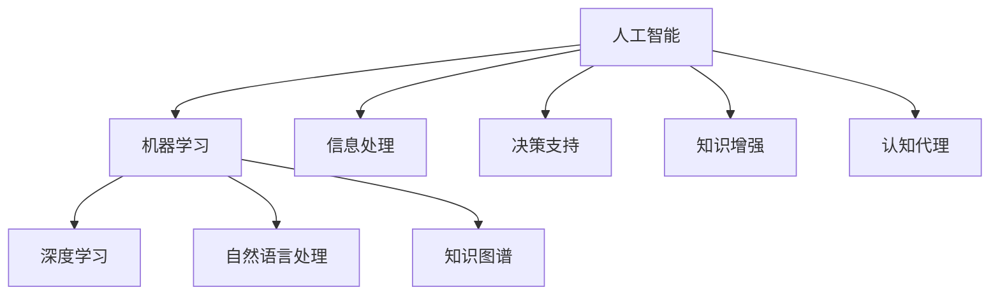

                 

# AI对人类认知能力的补充和增强

## 1. 背景介绍

在当今信息爆炸的时代，人类认知能力面临着前所未有的挑战。一方面，社会信息的丰富多样使得人类需要处理的信息量呈指数级增长；另一方面，人类认知能力受限于生物学机制，在短时间内处理信息的能力有限。人工智能（AI）作为一项颠覆性技术，通过模拟人类的感知、推理、学习等认知过程，大大扩展了人类认知能力的边界，实现了对人类认知能力的补充和增强。

### 1.1 问题的由来

随着科技的发展，信息处理和认知决策成为了人们面临的主要问题。在传统方式下，信息处理依赖于人力和时间成本高昂的手工操作。而认知决策则往往受到个人经验、知识和情感的影响，难以量化和优化。AI技术的出现，通过算法和计算资源，以机器学习和深度学习等方法，自动高效地处理和分析海量数据，并在决策过程中引入科学、客观的算法，显著提升了信息处理和认知决策的效率和准确性。

### 1.2 问题核心关键点

AI对人类认知能力的补充和增强主要体现在以下几个方面：

- 信息处理：通过自动化的数据分析和处理，AI能够高效地从大数据中提取有价值的信息，为人类决策提供科学依据。
- 决策支持：通过机器学习算法，AI能够模拟人类认知过程，进行数据分析和预测，支持人类在复杂决策环境中做出更优选择。
- 知识增强：通过深度学习模型，AI能够从文本、图像、语音等多种数据源中学习知识，并生成新的知识，拓展人类认知的广度和深度。
- 认知代理：通过智能代理和辅助系统，AI能够模拟人类的感知、记忆、推理等认知能力，辅助人类完成任务。

这些关键点揭示了AI技术在信息处理、决策支持、知识增强和认知代理方面的重要作用，为人类认知能力的提升提供了新的方向和工具。

## 2. 核心概念与联系

### 2.1 核心概念概述

为更好地理解AI对人类认知能力的补充和增强，本节将介绍几个密切相关的核心概念：

- 人工智能（AI）：通过算法和计算资源模拟人类智能的技术，涵盖感知、学习、推理、决策等多个方面。
- 机器学习（ML）：使用算法和数据训练模型，使其能够从经验中学习和预测，是实现AI的关键技术之一。
- 深度学习（DL）：一种特殊类型的机器学习，通过多层神经网络模拟人类大脑的结构和功能，实现对复杂数据的深度学习和处理。
- 自然语言处理（NLP）：研究计算机如何理解和生成人类语言，是AI领域中应用最广泛的子领域之一。
- 知识图谱：一种表示知识及其关系的结构化数据库，有助于机器更好地理解世界，提取和生成知识。
- 认知代理（Cognitive Agent）：模拟人类认知过程的智能系统，能够进行感知、学习、推理和决策。

这些核心概念之间通过信息处理、决策支持、知识增强和认知代理等机制相互联系，共同构建了AI技术对人类认知能力的补充和增强框架。

### 2.2 核心概念原理和架构的 Mermaid 流程图



这个流程图展示了AI技术在信息处理、决策支持、知识增强和认知代理中的作用：

1. 人工智能通过机器学习和深度学习技术，从大量数据中提取和处理信息，支持信息处理和决策支持。
2. 自然语言处理使机器能够理解和生成人类语言，增强信息处理和认知代理的能力。
3. 知识图谱提供了结构化知识，帮助机器更好地理解世界，进行知识增强和决策支持。
4. 认知代理通过模拟人类认知过程，实现了高级的感知、学习和决策能力，拓展了AI技术的应用场景。

## 3. 核心算法原理 & 具体操作步骤

### 3.1 算法原理概述

AI对人类认知能力的补充和增强，主要通过以下核心算法原理实现：

- 信息提取与处理：使用机器学习和深度学习算法，从大数据中自动提取有价值的信息，进行分类、聚类、异常检测等操作，为决策提供科学依据。
- 决策优化：通过强化学习、贝叶斯网络等算法，模拟人类决策过程，进行策略学习、风险评估、优化决策。
- 知识生成与增强：利用深度学习模型，从文本、图像、语音等多种数据源中学习知识，生成新的知识，扩展认知能力的广度和深度。
- 认知代理系统：基于认知神经科学和心理学研究，开发智能代理系统，模拟人类的感知、记忆、推理和决策过程，辅助完成任务。

这些算法原理共同构成了AI技术对人类认知能力的补充和增强框架，使得AI能够在信息处理、决策支持、知识增强和认知代理等多个方面发挥重要作用。

### 3.2 算法步骤详解

AI对人类认知能力的补充和增强主要包括以下几个关键步骤：

**Step 1: 数据收集与预处理**
- 收集与任务相关的数据，包括文本、图像、语音等。
- 对数据进行清洗、标注和预处理，确保数据质量和可用性。

**Step 2: 模型选择与训练**
- 根据任务类型，选择合适的机器学习或深度学习模型。
- 在准备好的数据集上进行模型训练，调整超参数，优化模型性能。

**Step 3: 知识提取与增强**
- 利用自然语言处理技术，从文本中提取关键信息和知识。
- 使用知识图谱技术，将提取的知识结构化，形成结构化数据库。
- 通过深度学习模型，生成新的知识，扩展认知能力。

**Step 4: 决策支持与优化**
- 应用强化学习、贝叶斯网络等算法，对决策进行优化和支持。
- 结合人类的经验和直觉，进行决策融合，提高决策的准确性和鲁棒性。

**Step 5: 认知代理系统构建**
- 基于认知神经科学和心理学研究，开发智能代理系统。
- 训练代理系统进行感知、记忆、推理和决策，辅助完成任务。

**Step 6: 模型评估与优化**
- 使用评估指标（如准确率、召回率、F1值等）对模型性能进行评估。
- 根据评估结果，优化模型和算法，提升AI的认知能力。

### 3.3 算法优缺点

AI对人类认知能力的补充和增强具有以下优点：

- 高效处理大数据：AI能够自动处理大量数据，快速提取关键信息，支持信息处理和决策支持。
- 提升决策质量：通过算法优化和数据驱动决策，AI能够提供科学、客观的决策支持，提高决策质量。
- 扩展知识边界：AI能够从多种数据源中学习知识，生成新的知识，扩展人类认知的广度和深度。
- 辅助人类认知：通过认知代理系统，AI能够模拟人类认知过程，辅助人类完成任务，提高效率和准确性。

同时，这些算法也存在一些局限性：

- 依赖高质量数据：AI模型的性能很大程度上依赖于训练数据的质量，数据的噪音和偏差会影响模型效果。
- 知识获取不足：尽管AI能够学习知识，但缺乏人类先验知识和经验，可能难以解决复杂的认知问题。
- 可解释性不足：AI模型往往是“黑盒”系统，难以解释其内部工作机制和决策逻辑，影响人类对其的理解和信任。
- 对抗性攻击风险：AI模型可能受到对抗性攻击，导致错误决策，影响系统安全性。

### 3.4 算法应用领域

AI对人类认知能力的补充和增强在多个领域得到广泛应用，具体包括：

- 医疗诊断：通过医学影像分析、病历推理等技术，辅助医生进行诊断和治疗决策。
- 金融分析：利用大数据分析和机器学习算法，进行风险评估、投资策略优化等。
- 智能制造：通过工业数据处理和预测建模，实现生产优化、质量控制等。
- 教育辅导：通过自然语言处理和认知代理技术，提供个性化学习资源和辅导服务。
- 自动驾驶：通过感知、决策和控制技术，实现自动驾驶和智能交通。
- 聊天机器人：通过自然语言理解和生成技术，提供智能客服和智能助手服务。

这些应用领域展示了AI在信息处理、决策支持、知识增强和认知代理方面的强大能力，为人类认知能力的提升提供了有力支持。

## 4. 数学模型和公式 & 详细讲解 & 举例说明

### 4.1 数学模型构建

本节将使用数学语言对AI对人类认知能力的补充和增强过程进行更加严格的刻画。

设任务为 $T$，输入数据为 $x$，模型参数为 $\theta$。假设计算模型 $M_{\theta}$ 在输入 $x$ 上的输出为 $y$，损失函数为 $\ell(y, \hat{y})$，其中 $\hat{y}$ 为模型预测值。

定义模型的损失函数为：

$$
\mathcal{L}(\theta) = \frac{1}{N} \sum_{i=1}^N \ell(M_{\theta}(x_i), y_i)
$$

其中 $N$ 为样本数量。目标是最小化损失函数 $\mathcal{L}(\theta)$，使得模型输出逼近真实标签 $y_i$。

### 4.2 公式推导过程

以深度学习模型为例，推导模型损失函数和梯度更新公式。

假设模型 $M_{\theta}$ 为多层神经网络，其中 $\theta$ 为模型参数。定义模型的输出为 $y = M_{\theta}(x)$，真实标签为 $y_i$。则模型在样本 $i$ 上的损失函数为：

$$
\ell(M_{\theta}(x_i), y_i) = \frac{1}{N} \sum_{j=1}^N \ell_i(y_j)
$$

其中 $\ell_i$ 为第 $i$ 个样本的损失函数，通常为交叉熵损失函数：

$$
\ell_i(y_j) = -[y_j \log M_{\theta}(x_j) + (1 - y_j) \log (1 - M_{\theta}(x_j))]
$$

因此，模型在所有样本上的损失函数为：

$$
\mathcal{L}(\theta) = \frac{1}{N} \sum_{i=1}^N \frac{1}{N} \sum_{j=1}^N \ell_i(y_j)
$$

对损失函数求导，得到模型参数 $\theta$ 的梯度：

$$
\nabla_{\theta} \mathcal{L}(\theta) = \frac{1}{N} \sum_{i=1}^N \frac{1}{N} \sum_{j=1}^N \nabla_{\theta} \ell_i(y_j)
$$

其中 $\nabla_{\theta} \ell_i(y_j)$ 为交叉熵损失函数对模型参数 $\theta$ 的梯度，可通过反向传播算法计算得到。

使用梯度下降算法更新模型参数：

$$
\theta \leftarrow \theta - \eta \nabla_{\theta} \mathcal{L}(\theta)
$$

其中 $\eta$ 为学习率，为调整模型参数更新速度的超参数。

### 4.3 案例分析与讲解

以自然语言处理中的情感分析为例，分析AI在信息处理和决策支持方面的应用。

假设有一份文本数据集，包含大量电影评论和其情感标签（正面或负面）。任务是通过这些评论数据训练情感分析模型，预测新的评论情感。

**Step 1: 数据收集与预处理**
- 收集电影评论文本数据，进行清洗和标注。
- 将文本转换为向量表示，使用词袋模型或词嵌入模型进行预处理。

**Step 2: 模型选择与训练**
- 选择适当的深度学习模型，如卷积神经网络（CNN）或循环神经网络（RNN）。
- 在标注数据集上进行模型训练，调整超参数，优化模型性能。

**Step 3: 决策支持与优化**
- 利用模型对新评论进行情感分析，得到情感预测结果。
- 结合人工经验，对预测结果进行修正和优化，提高决策准确性。

通过上述步骤，AI能够高效处理和分析海量文本数据，辅助人类进行情感分析决策，提高了决策的科学性和可靠性。

## 5. 项目实践：代码实例和详细解释说明

### 5.1 开发环境搭建

在进行项目实践前，我们需要准备好开发环境。以下是使用Python进行TensorFlow开发的环境配置流程：

1. 安装Anaconda：从官网下载并安装Anaconda，用于创建独立的Python环境。

2. 创建并激活虚拟环境：
```bash
conda create -n tf-env python=3.8 
conda activate tf-env
```

3. 安装TensorFlow：根据CUDA版本，从官网获取对应的安装命令。例如：
```bash
pip install tensorflow==2.7
```

4. 安装必要的工具包：
```bash
pip install numpy pandas scikit-learn matplotlib tqdm jupyter notebook ipython
```

完成上述步骤后，即可在`tf-env`环境中开始项目实践。

### 5.2 源代码详细实现

下面我们以情感分析任务为例，给出使用TensorFlow对深度学习模型进行情感分析的Python代码实现。

首先，定义情感分析任务的数据处理函数：

```python
import tensorflow as tf
from tensorflow.keras.preprocessing.text import Tokenizer
from tensorflow.keras.preprocessing.sequence import pad_sequences
from tensorflow.keras.layers import Embedding, LSTM, Dense, Dropout
from tensorflow.keras.models import Sequential
from sklearn.model_selection import train_test_split

# 定义情感分析任务的数据处理函数
def preprocess_data(texts, labels):
    tokenizer = Tokenizer(oov_token='<OOV>') # 设置未见词汇标记
    tokenizer.fit_on_texts(texts)
    sequences = tokenizer.texts_to_sequences(texts)
    max_len = max([len(seq) for seq in sequences])
    padded_sequences = pad_sequences(sequences, maxlen=max_len, padding='post')
    return padded_sequences, labels
```

然后，定义情感分析模型的架构：

```python
# 定义情感分析模型的架构
def build_model(input_shape, num_classes):
    model = Sequential([
        Embedding(input_dim=10000, output_dim=128, input_length=input_shape),
        LSTM(128, dropout=0.2, recurrent_dropout=0.2),
        Dense(num_classes, activation='softmax')
    ])
    return model

# 构建模型
input_shape = 100
num_classes = 2
model = build_model(input_shape, num_classes)
```

接着，定义训练和评估函数：

```python
# 定义训练函数
def train_model(model, x_train, y_train, x_val, y_val, epochs, batch_size, learning_rate):
    model.compile(optimizer=tf.keras.optimizers.Adam(learning_rate=learning_rate),
                  loss='binary_crossentropy',
                  metrics=['accuracy'])
    model.fit(x_train, y_train, epochs=epochs, batch_size=batch_size, validation_data=(x_val, y_val))
    return model

# 定义评估函数
def evaluate_model(model, x_test, y_test):
    loss, accuracy = model.evaluate(x_test, y_test, verbose=0)
    return loss, accuracy
```

最后，启动训练流程并在测试集上评估：

```python
# 加载数据集
from tensorflow.keras.datasets import imdb
(x_train, y_train), (x_test, y_test) = imdb.load_data(num_words=10000)

# 数据预处理
x_train, x_val, y_train, y_val = train_test_split(x_train, y_train, test_size=0.2)
x_train, x_val, y_train, y_val = preprocess_data(x_train, y_train), preprocess_data(x_val, y_val)

# 训练模型
epochs = 10
batch_size = 64
learning_rate = 0.001

model = train_model(model, x_train, y_train, x_val, y_val, epochs, batch_size, learning_rate)

# 评估模型
loss, accuracy = evaluate_model(model, x_test, y_test)
print('Test loss:', loss)
print('Test accuracy:', accuracy)
```

以上就是使用TensorFlow进行情感分析任务开发的完整代码实现。可以看到，得益于TensorFlow的强大封装，我们能够相对简洁地实现深度学习模型的训练和评估。

### 5.3 代码解读与分析

让我们再详细解读一下关键代码的实现细节：

**preprocess_data函数**：
- 将文本转换为序列表示，并对序列进行填充，保证所有样本长度一致。
- 设置未见词汇标记，处理文本中的未知词汇。

**build_model函数**：
- 定义模型架构，包括嵌入层、LSTM层和输出层，并设置dropout和recurrent_dropout参数，防止过拟合。
- 指定模型的输入形状和输出类别数。

**train_model函数**：
- 定义模型的优化器、损失函数和评估指标。
- 使用fit函数进行模型训练，设置训练轮数、批次大小和验证集。
- 返回训练后的模型。

**evaluate_model函数**：
- 使用evaluate函数对模型进行测试，获取损失和准确率。
- 输出测试结果。

**训练流程**：
- 定义总的epoch数和批次大小，开始循环迭代
- 每个epoch内，先在训练集上训练，输出平均损失和准确率
- 在验证集上评估，调整学习率，防止过拟合
- 重复上述步骤直至收敛，最终得到训练好的模型

可以看到，TensorFlow提供了强大的工具库和丰富的API，使得深度学习模型的实现变得更加便捷和高效。开发者可以利用这些工具，快速迭代实验，优化模型性能。

当然，实际应用中还需要考虑更多因素，如模型的保存和部署、超参数的自动搜索、模型的可解释性等。但核心的模型训练和评估流程基本与此类似。

## 6. 实际应用场景

### 6.1 医疗诊断

在医疗诊断领域，AI技术通过深度学习模型，可以从医学影像中提取关键特征，辅助医生进行疾病诊断和治疗决策。

以医学影像分类为例，通过训练深度学习模型，识别并分类不同类型的医学影像，如X光片、CT、MRI等，可以大大提高诊断的准确性和效率。例如，谷歌的DeepMind公司开发的AI系统DeepMind Health，能够自动分析X光片，辅助医生进行肺癌、骨折等疾病的诊断。

### 6.2 金融分析

在金融分析领域，AI技术通过大数据分析和机器学习算法，进行风险评估、投资策略优化等。

以股票预测为例，通过训练深度学习模型，预测股票价格走势，可以提供决策支持。例如，美国Powell公司开发的AI系统AlphaGo，利用深度学习和强化学习算法，进行股票价格预测和投资策略优化，帮助投资者做出更好的决策。

### 6.3 智能制造

在智能制造领域，AI技术通过工业数据处理和预测建模，实现生产优化、质量控制等。

以工业缺陷检测为例，通过训练深度学习模型，识别并分类不同类型的工业缺陷，可以大大提高检测的准确性和效率。例如，美国Qualcomm公司开发的AI系统Qualcomm Spectral，能够自动检测芯片制造中的缺陷，提高生产质量和效率。

### 6.4 未来应用展望

随着AI技术的不断进步，其在信息处理、决策支持、知识增强和认知代理方面的应用将更加广泛和深入。未来，AI有望在更多领域实现人类认知能力的补充和增强，具体包括：

- 自动驾驶：通过感知、决策和控制技术，实现自动驾驶和智能交通。
- 智能客服：通过自然语言处理和认知代理技术，提供智能客服和智能助手服务。
- 教育辅导：通过自然语言处理和认知代理技术，提供个性化学习资源和辅导服务。
- 智能家居：通过感知和决策技术，实现智能家居和物联网。
- 智能安防：通过感知和决策技术，实现智能安防和监控。
- 智能医疗：通过医学影像分析、病历推理等技术，辅助医生进行诊断和治疗决策。

## 7. 工具和资源推荐

### 7.1 学习资源推荐

为了帮助开发者系统掌握AI对人类认知能力的补充和增强的理论基础和实践技巧，这里推荐一些优质的学习资源：

1. 《Deep Learning》（Goodfellow等著）：深度学习领域的经典教材，涵盖深度学习的基本概念、算法和应用。
2. 《Hands-On Machine Learning with Scikit-Learn, Keras, and TensorFlow》（Géron著）：基于Scikit-Learn、Keras和TensorFlow的机器学习实战指南，适合初学者快速上手。
3. 《AI Superpowers: China, Silicon Valley, and the New World Order》（Kai-Fu Lee著）：探讨AI技术的发展和未来趋势，分析AI技术对全球政治、经济和科技的影响。
4. 《Grokking Deep Learning》（Schwartz著）：深度学习领域的入门教材，通过通俗易懂的语言介绍深度学习的基本概念和实践技巧。
5. 《The Elements of Cognitive Computing》（Werbos著）：认知计算领域的经典教材，涵盖认知神经科学、心理学和计算机科学的知识。

通过对这些资源的学习实践，相信你一定能够系统掌握AI对人类认知能力的补充和增强的理论基础和实践技巧，并用于解决实际的AI问题。

### 7.2 开发工具推荐

高效的开发离不开优秀的工具支持。以下是几款用于AI开发和实践的常用工具：

1. TensorFlow：由Google主导开发的开源深度学习框架，提供丰富的API和工具库，支持大规模分布式计算。
2. PyTorch：由Facebook主导开发的开源深度学习框架，提供动态计算图和丰富的API，适合快速迭代研究。
3. Keras：基于TensorFlow和Theano的高级API，提供简单易用的接口，适合初学者和快速原型开发。
4. Jupyter Notebook：基于Python的交互式笔记本，提供可视化编程和数据探索环境，适合数据科学和机器学习研究。
5. Visual Studio Code：开源的代码编辑器，支持多种编程语言和扩展插件，提供丰富的开发工具和插件。
6. GitHub：全球最大的代码托管平台，提供版本控制、协作开发和代码共享功能，适合团队合作和开源项目。

合理利用这些工具，可以显著提升AI开发和实践的效率，加速技术迭代和创新。

### 7.3 相关论文推荐

AI对人类认知能力的补充和增强的研究源于学界的持续研究。以下是几篇奠基性的相关论文，推荐阅读：

1. "ImageNet Classification with Deep Convolutional Neural Networks"（Hinton等著）：提出卷积神经网络（CNN），实现图像分类任务，奠定深度学习的基础。
2. "Deep Learning for Natural Language Processing"（Goodfellow等著）：深入探讨深度学习在自然语言处理中的应用，涵盖文本分类、情感分析、机器翻译等任务。
3. "Knowledge-Graph Embeddings"（Bordes等著）：提出知识图谱嵌入模型，用于知识推理和推荐系统，扩展AI技术的应用边界。
4. "Recurrent Neural Network Based Language Model"（Hinton等著）：提出循环神经网络（RNN），用于自然语言处理任务，实现序列数据的建模和处理。
5. "Learning to Execute"（Russell等著）：探讨机器执行任务的机制，提出认知代理系统的设计框架，为智能系统提供理论基础。

这些论文代表了大语言模型微调技术的发展脉络。通过学习这些前沿成果，可以帮助研究者把握学科前进方向，激发更多的创新灵感。

## 8. 总结：未来发展趋势与挑战

### 8.1 总结

本文对AI对人类认知能力的补充和增强进行了全面系统的介绍。首先阐述了AI技术在信息处理、决策支持、知识增强和认知代理方面的重要作用，明确了AI技术在提升人类认知能力方面的巨大潜力。其次，从原理到实践，详细讲解了AI对人类认知能力的补充和增强的数学原理和关键步骤，给出了AI模型训练和评估的完整代码实例。同时，本文还广泛探讨了AI技术在医疗诊断、金融分析、智能制造等领域的实际应用，展示了AI技术的广泛适用性和实际价值。此外，本文精选了AI技术的各类学习资源，力求为读者提供全方位的技术指引。

通过本文的系统梳理，可以看到，AI技术在信息处理、决策支持、知识增强和认知代理等方面的巨大潜力，为人类认知能力的提升提供了新的方向和工具。未来，伴随AI技术的不断发展，AI技术必将在更多领域发挥重要作用，推动人类认知智能的进步。

### 8.2 未来发展趋势

展望未来，AI对人类认知能力的补充和增强将呈现以下几个发展趋势：

1. 多模态融合：AI技术将突破单一模态的局限，实现视觉、听觉、触觉等多模态数据的融合，提升智能系统的感知和决策能力。
2. 认知推理：AI技术将结合认知神经科学和心理学研究，模拟人类认知过程，实现更加复杂的推理和决策。
3. 认知代理：基于认知神经科学和心理学研究，开发更加智能的认知代理系统，实现更加高级的感知、学习和决策。
4. 无监督学习：AI技术将更多地应用无监督学习范式，利用自监督学习、半监督学习等方法，提升模型的泛化能力和鲁棒性。
5. 对抗性攻击防御：AI技术将研究对抗性攻击防御方法，提升系统的安全性和鲁棒性，防止恶意攻击。
6. 知识图谱的应用：AI技术将结合知识图谱，实现更加全面的知识推理和信息整合，提升系统的认知能力。

以上趋势凸显了AI技术在信息处理、决策支持、知识增强和认知代理方面的广阔前景。这些方向的探索发展，必将进一步提升AI技术的认知能力，为构建智能系统提供新的方向和思路。

### 8.3 面临的挑战

尽管AI对人类认知能力的补充和增强技术已经取得了显著进展，但在迈向更加智能化、普适化应用的过程中，它仍面临着诸多挑战：

1. 数据隐私和安全：AI技术需要大量的数据进行训练，数据隐私和安全问题亟需解决。
2. 模型的可解释性：AI模型往往是“黑盒”系统，难以解释其内部工作机制和决策逻辑，影响人类对其的理解和信任。
3. 对抗性攻击风险：AI模型可能受到对抗性攻击，导致错误决策，影响系统安全性。
4. 知识获取不足：尽管AI能够学习知识，但缺乏人类先验知识和经验，可能难以解决复杂的认知问题。
5. 资源消耗高：大规模AI模型的训练和推理消耗大量计算资源，资源瓶颈难以突破。

这些挑战需要我们在未来不断探索和突破，通过技术创新和伦理约束，推动AI技术的持续进步。

### 8.4 研究展望

面对AI对人类认知能力的补充和增强技术所面临的挑战，未来的研究需要在以下几个方面寻求新的突破：

1. 探索高效、低成本的训练方法，减少对标注数据的依赖，降低训练成本。
2. 研究知识图谱的深度融合，提升系统的认知能力和泛化能力。
3. 结合认知神经科学和心理学研究，开发更加智能的认知代理系统，实现更加高级的感知、学习和决策。
4. 研究对抗性攻击防御方法，提升系统的安全性和鲁棒性。
5. 引入多模态数据融合技术，实现视觉、听觉、触觉等多模态数据的联合感知和决策。
6. 探索无监督学习和半监督学习范式，利用自监督学习、半监督学习等方法，提升模型的泛化能力和鲁棒性。

这些研究方向的探索，必将引领AI技术迈向更高的台阶，为构建安全、可靠、可解释、可控的智能系统铺平道路。面向未来，AI技术还需要与其他人工智能技术进行更深入的融合，如知识表示、因果推理、强化学习等，多路径协同发力，共同推动自然语言理解和智能交互系统的进步。只有勇于创新、敢于突破，才能不断拓展AI技术的边界，让智能技术更好地造福人类社会。

## 9. 附录：常见问题与解答

**Q1：AI对人类认知能力的补充和增强是否会取代人类？**

A: 目前来看，AI技术在认知能力上还远远无法取代人类。虽然AI在某些特定领域已经表现出色，但人类的智慧、情感和创造力等方面的复杂性，AI目前还难以理解和模拟。AI技术的补充和增强，更多的是辅助人类完成任务，提升工作效率和决策质量，而不是取代人类。

**Q2：AI技术在医疗诊断中是否会代替医生？**

A: AI技术在医疗诊断中起到辅助作用，可以大大提高诊断的效率和准确性，但无法完全代替医生。医生的经验和直觉，以及对患者情感和心理的理解，是AI难以替代的。AI技术更多地用于辅助诊断、风险评估和决策支持，帮助医生做出更好的诊断和治疗决策。

**Q3：AI技术在金融分析中是否会带来更大的风险？**

A: 尽管AI技术在金融分析中表现出色，但存在一定的风险。AI模型可能受到对抗性攻击，导致错误决策，影响系统安全性。此外，AI模型可能过于依赖数据，无法全面考虑所有因素，导致决策偏差。因此，在使用AI技术进行金融分析时，需要谨慎评估风险，结合人类经验和直觉，综合决策。

**Q4：AI技术在教育辅导中是否会削弱学生的学习动力？**

A: AI技术在教育辅导中起到辅助作用，可以提供个性化的学习资源和辅导服务，提升学习效果。但学生的学习动力和主动性，仍然需要教师和家长的引导和鼓励。AI技术更多地用于辅助教学，提供个性化和多样化的学习资源，而不是削弱学生的学习动力。

**Q5：AI技术在智能制造中是否会减少人工岗位？**

A: AI技术在智能制造中起到提升效率和质量的作用，可以大幅减少人工岗位。但AI技术也可以创造新的岗位和机会，如数据科学家、AI工程师等。AI技术的应用，需要多方面协同配合，包括技术研发、生产管理、售后服务等，需要大量专业人才的支持。

总之，AI技术在信息处理、决策支持、知识增强和认知代理等方面的应用，为人类认知能力的提升提供了新的方向和工具。未来，伴随AI技术的不断进步，AI技术必将在更多领域发挥重要作用，推动人类认知智能的进步。但AI技术也存在数据隐私、安全、可解释性等方面的挑战，需要我们不断探索和突破，推动AI技术的持续进步。

