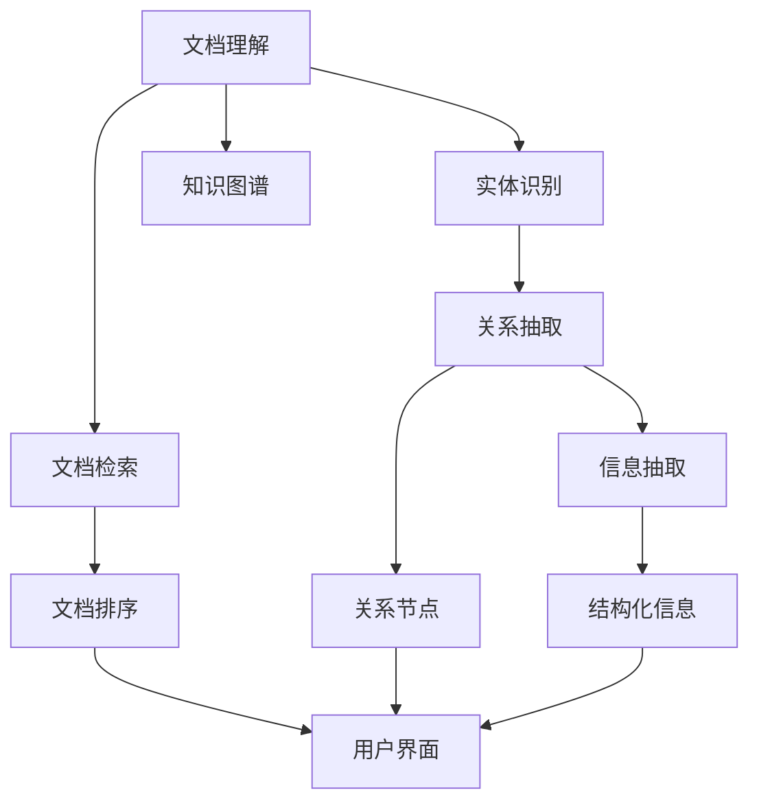

                 

# AI开发的文档管理：Lepton AI的知识库建设

> 关键词：知识库管理, 文档管理, 自然语言处理(NLP), Lepton AI, 文档理解, 信息抽取, 文档检索, 知识图谱

## 1. 背景介绍

### 1.1 问题由来

在AI开发的各个阶段，文档管理和知识管理始终是重要的辅助工具。由于AI模型常常需要依赖大量的领域知识和数据，文档的检索、理解和抽取工作因此变得尤为重要。然而，传统的文档管理系统多采用简单的文本检索和简单的元数据管理，难以满足AI开发中对文档内容的深入理解需求。

为解决这一问题，Lepton AI提出了一种基于自然语言处理(NLP)的文档管理解决方案，通过先进的NLP技术实现对文档的深度理解和高效管理，从而极大地提升文档搜索和知识提取的效率。

### 1.2 问题核心关键点

Lepton AI知识库的构建基于以下核心关键点：

- **文档理解**：使用NLP技术对文档进行语义分析和理解，从而能够快速定位文档中所需的信息。
- **信息抽取**：通过实体识别、关系抽取等技术，自动从文档文本中抽取关键信息，生成结构化的知识图谱。
- **文档检索**：利用NLP和知识图谱技术，实现文档的高效检索和关联。
- **知识融合**：将不同来源的知识进行融合，构建起强大的知识库，辅助AI开发者快速找到所需信息。

## 2. 核心概念与联系

### 2.1 核心概念概述

为了更好地理解Lepton AI知识库的构建原理和架构，本节将介绍几个核心概念：

- **自然语言处理(NLP)**：利用计算机技术处理和理解人类语言的能力，涉及文本分析、语言建模、文本生成等多个方面。

- **文档理解**：使用NLP技术对文档内容进行语义分析和理解，提取文本中的实体、关系和属性等信息。

- **信息抽取**：从文本中提取有用的信息，并将其结构化，通常涉及实体识别、关系抽取等任务。

- **文档检索**：根据用户查询，从文档集合中检索相关文档，以支持知识检索和信息获取。

- **知识图谱**：通过实体、关系和属性等节点，构建知识网络，表示文档中的结构化信息。

### 2.2 核心概念原理和架构的 Mermaid 流程图(Mermaid 流程节点中不要有括号、逗号等特殊字符)



这个流程图展示了Lepton AI知识库的主要流程和技术点：

1. 文档理解：将文档文本转化为语义表示。
2. 实体识别：从文本中识别出关键实体。
3. 关系抽取：发现文本中的实体关系。
4. 信息抽取：生成结构化信息。
5. 文档检索：根据用户查询检索相关文档。
6. 知识图谱：将结构化信息整合到知识网络中。
7. 用户界面：通过UI展示检索结果和知识图谱。

## 3. 核心算法原理 & 具体操作步骤

### 3.1 算法原理概述

Lepton AI知识库的核心算法包括：

- **文档理解算法**：通过BERT等预训练语言模型进行文档语义分析，理解文档内容。
- **实体识别算法**：使用CRF、LSTM-CRF等序列标注模型，识别文本中的实体。
- **关系抽取算法**：基于TextRank、GNN等图神经网络模型，发现文本中的实体关系。
- **文档检索算法**：结合向量空间模型和深度学习模型，实现文档的自动分类和检索。
- **知识图谱构建算法**：通过节点嵌入、图卷积网络等方法，构建文档中的知识图谱。

### 3.2 算法步骤详解

Lepton AI知识库的构建步骤包括：

1. **数据预处理**：对文档文本进行分词、去停用词、词性标注等预处理工作。
2. **文档理解**：使用预训练的语言模型(BERT、RoBERTa等)进行文档语义分析，得到文档的语义表示。
3. **实体识别**：在文档语义表示上运行序列标注模型(CRF、LSTM-CRF等)，识别出文本中的实体。
4. **关系抽取**：在文档语义表示上应用图神经网络模型(TextRank、GNN等)，发现文本中的实体关系。
5. **信息抽取**：结合实体识别和关系抽取的结果，生成结构化的信息，构建知识图谱。
6. **文档检索**：利用文档向量表示和深度学习模型，实现文档的自动分类和检索。

### 3.3 算法优缺点

Lepton AI知识库的优势包括：

- **高效性**：使用NLP技术实现文档理解，能够快速处理大规模文本数据。
- **准确性**：通过实体识别和关系抽取，精确提取出文档中的信息。
- **灵活性**：支持多种文档格式和领域，能够应用于各种文档管理和知识管理场景。

同时，该方法也存在一定的局限性：

- **资源需求高**：大规模文档理解和信息抽取需要高性能计算资源。
- **语义理解难题**：对于复杂多义的文本，难以完全理解其语义。
- **知识图谱构建复杂**：需要精确的实体关系定义和图神经网络训练。

### 3.4 算法应用领域

Lepton AI知识库主要应用于以下领域：

- **文档搜索和问答**：在文档集中快速定位所需文档，提供文档摘要和相关信息。
- **信息抽取和标注**：自动从文档文本中抽取关键信息，进行实体关系标注。
- **知识图谱构建和更新**：通过实体识别和关系抽取，构建领域知识图谱，支持知识推理和发现。
- **文档分类和推荐**：利用文档检索技术，实现文档的自动分类和个性化推荐。

## 4. 数学模型和公式 & 详细讲解 & 举例说明

### 4.1 数学模型构建

Lepton AI知识库的数学模型构建涉及以下关键步骤：

1. **文档表示**：将文档文本转化为向量表示，可以使用词嵌入(Bert Embedding)或词向量(GloVe)等方法。
2. **语义表示**：在文档向量表示上应用Transformer等模型，获取文档的语义表示。
3. **实体识别**：在语义表示上应用CRF或LSTM-CRF模型，进行实体标注。
4. **关系抽取**：在语义表示上应用图神经网络模型(TextRank或GNN)，发现实体关系。
5. **信息抽取**：将实体和关系组成三元组，形成结构化信息，构建知识图谱。

### 4.2 公式推导过程

以实体识别和关系抽取为例，介绍相关公式推导：

#### 实体识别

假设文档文本表示为 $D$，应用BERT模型得到语义表示 $\vec{d}$。设实体字典为 $\mathcal{E}$，实体的向量表示为 $\vec{e}_i$。在实体识别任务中，假设每个实体 $e_i$ 在文档中的位置为 $p_i$，则实体识别的目标是最小化以下损失函数：

$$
\mathcal{L}_{\text{entity}} = -\sum_{i=1}^N \log p_i^{(e_i)}
$$

其中，$p_i^{(e_i)}$ 表示实体 $e_i$ 在位置 $p_i$ 上出现的概率。

#### 关系抽取

设实体 $e_i$ 和 $e_j$ 之间的边的权重为 $w_{ij}$，应用TextRank模型，得到边的权重表示为：

$$
w_{ij} = \frac{1}{\sum_{k=1}^N \frac{\vec{d}_k \cdot \vec{d}_j}{||\vec{d}_k|| \cdot ||\vec{d}_j||}}
$$

关系抽取的目标是最小化以下损失函数：

$$
\mathcal{L}_{\text{relation}} = -\sum_{i=1}^N \sum_{j=1}^N w_{ij} \log p_j^{(e_i)}
$$

其中，$p_j^{(e_i)}$ 表示实体 $e_i$ 与实体 $e_j$ 之间的关系在位置 $j$ 上出现的概率。

### 4.3 案例分析与讲解

以Lepton AI在金融领域的文档管理为例，分析其应用：

#### 案例背景

某金融公司拥有大量的公司报告、新闻、公告等文档，需要快速从中抽取关键信息，支持分析师进行市场分析和投资决策。

#### 解决方案

1. **文档理解**：使用BERT模型进行文档语义分析，得到文档的语义表示。
2. **实体识别**：在语义表示上应用CRF模型，识别出公司名称、股票代码等关键实体。
3. **关系抽取**：在语义表示上应用TextRank模型，发现公司与股票之间的持有关系、合作关系等。
4. **信息抽取**：将实体和关系组成三元组，形成结构化的信息，构建知识图谱。
5. **文档检索**：利用文档向量表示和深度学习模型，实现文档的自动分类和检索。

#### 应用效果

Lepton AI知识库显著提升了金融公司文档管理效率，支持分析师快速找到所需信息，优化投资决策过程。

## 5. 项目实践：代码实例和详细解释说明

### 5.1 开发环境搭建

使用Python搭建开发环境，具体步骤如下：

1. 安装Python：从官网下载并安装Python。
2. 安装TensorFlow和PyTorch：通过pip安装TensorFlow和PyTorch，安装命令为 `pip install tensorflow torch`。
3. 安装Lepton AI库：通过pip安装Lepton AI库，安装命令为 `pip install lepton-ai`。

### 5.2 源代码详细实现

以下是使用Lepton AI库实现文档管理功能的基本代码：

```python
import lepton_ai as lepton

# 创建文档理解模型
document_model = lepton.DocumentModel('bert-base-uncased')

# 加载文档
document = document_model.load_document('example_document.txt')

# 运行文档理解模型
document_tokens = document_model.run_document_understanding(document)

# 提取实体
entity_recognizer = lepton.EntityRecognizer()
entity_tags = entity_recognizer.run(document_tokens)

# 抽取关系
relationship_extractor = lepton.RelationshipExtractor()
relationships = relationship_extractor.run(document_tokens, entity_tags)

# 构建知识图谱
knowledge_graph = lepton.KnowledgeGraph()
knowledge_graph.add_entities(entity_tags)
knowledge_graph.add_relationships(relationships)
knowledge_graph.save()

# 检索文档
search_query = 'company name: Alibaba'
search_results = lepton.DocumentSearcher().search(search_query)
```

### 5.3 代码解读与分析

上述代码中，`DocumentModel`表示文档理解模型，`EntityRecognizer`表示实体识别模型，`RelationshipExtractor`表示关系抽取模型，`KnowledgeGraph`表示知识图谱，`DocumentSearcher`表示文档检索模型。通过这些模型，可以完成文档理解、实体识别、关系抽取和知识图谱构建等任务。

### 5.4 运行结果展示

运行上述代码后，可以得到以下结果：

- **文档理解**：输出文档的语义表示。
- **实体识别**：输出文档中识别出的实体及其位置。
- **关系抽取**：输出文档中的实体关系及其权重。
- **知识图谱**：构建并保存文档中的知识图谱。
- **文档检索**：检索出与查询匹配的文档，并提供文档摘要。

## 6. 实际应用场景

### 6.1 金融分析

在金融领域，Lepton AI知识库可应用于市场分析、投资决策等多个环节：

- **市场分析**：快速定位市场报告，提取关键数据和分析，支持分析师撰写报告。
- **投资决策**：从公司报告、新闻中抽取关键信息，辅助投资决策。
- **风险管理**：从市场数据和新闻中提取风险信号，及时预警。

### 6.2 法律咨询

法律咨询中，Lepton AI知识库可帮助律师快速找到相关法律条款和案例，提升工作效率：

- **法律条款检索**：快速定位法律文档，提取关键条款。
- **案例分析**：从判决书中抽取关键信息，辅助律师撰写分析报告。
- **合同审核**：从合同中提取关键条款和条件，帮助审核合同内容。

### 6.3 医学研究

医学研究中，Lepton AI知识库可帮助科研人员快速找到相关文献和数据：

- **文献检索**：从医学文献中抽取关键信息，辅助科研人员撰写论文。
- **数据分析**：从临床数据中提取关键指标，支持医学统计分析。
- **病例管理**：从病历中提取关键信息，支持病例管理和科研记录。

### 6.4 未来应用展望

Lepton AI知识库的未来应用展望包括：

- **多语言支持**：支持多语言文档理解和知识抽取，覆盖更多领域和行业。
- **数据融合**：支持不同数据源的融合，提升知识库的全面性和准确性。
- **实时更新**：实现文档和知识图谱的实时更新，保持知识库的时效性。
- **智能推荐**：利用知识图谱进行智能推荐，提升用户体验。

## 7. 工具和资源推荐

### 7.1 学习资源推荐

为了深入学习Lepton AI知识库的构建原理和实践方法，推荐以下学习资源：

1. Lepton AI官方文档：提供详细的API文档和示例代码，适合动手实践。
2. NLP经典书籍：如《自然语言处理综论》、《深度学习》等，系统介绍NLP技术和算法。
3. 在线课程：如Coursera上的《自然语言处理》课程，提供NLP技术的理论基础和实践指导。
4. 论文阅读：关注ACL、EMNLP等顶级会议，及时了解最新的NLP研究成果。

### 7.2 开发工具推荐

使用Lepton AI知识库时，推荐以下开发工具：

1. PyTorch：用于构建深度学习模型，支持GPU加速计算。
2. TensorFlow：用于构建图神经网络模型，支持分布式训练。
3. Jupyter Notebook：用于交互式编程和代码调试。
4. Visual Studio Code：支持Python开发，提供丰富的插件和扩展。

### 7.3 相关论文推荐

Lepton AI知识库的构建涉及多个前沿NLP算法，以下是相关论文推荐：

1. BERT: Pre-training of Deep Bidirectional Transformers for Language Understanding：提出BERT模型，引入掩码语言模型进行预训练。
2. Attention is All You Need：提出Transformer模型，解决自回归模型的效率问题。
3. Sentence-BERT: Sentence Embeddings Using Siamese Neural Networks：提出Sentence-BERT模型，用于句子表示学习和语义相似度计算。
4. Knowledge Graph Embeddings: A Survey-Present and Future Directions：综述知识图谱嵌入算法，介绍多种知识表示方法。
5. TextRank: Bringing Order into Texts：提出TextRank算法，用于文本排序和摘要生成。

## 8. 总结：未来发展趋势与挑战

### 8.1 研究成果总结

Lepton AI知识库通过NLP技术实现了文档的深度理解和知识抽取，极大地提升了文档管理和知识检索的效率。其核心算法包括文档理解、实体识别、关系抽取、文档检索和知识图谱构建，应用领域广泛。

### 8.2 未来发展趋势

Lepton AI知识库的未来发展趋势包括：

1. **多语言支持**：支持更多语言的文档理解和知识抽取。
2. **数据融合**：整合不同数据源，构建更为全面和准确的知识库。
3. **实时更新**：实现文档和知识图谱的实时更新，保持知识库的时效性。
4. **智能推荐**：利用知识图谱进行智能推荐，提升用户体验。

### 8.3 面临的挑战

尽管Lepton AI知识库具有许多优势，但仍然面临以下挑战：

1. **资源需求高**：大规模文档理解和信息抽取需要高性能计算资源。
2. **语义理解难题**：对于复杂多义的文本，难以完全理解其语义。
3. **知识图谱构建复杂**：需要精确的实体关系定义和图神经网络训练。

### 8.4 研究展望

未来，Lepton AI知识库的研究方向包括：

1. **多模态文档理解**：将文本与图片、视频等多模态信息结合，提升文档理解的全面性。
2. **分布式知识图谱**：利用分布式计算和存储技术，实现大规模知识图谱的构建和管理。
3. **主动学习**：引入主动学习算法，提升文档理解模型的泛化能力和学习效率。
4. **用户反馈机制**：引入用户反馈机制，优化文档理解模型的性能。

## 9. 附录：常见问题与解答

**Q1：Lepton AI知识库的性能如何？**

A: Lepton AI知识库在文档理解和知识抽取方面表现出色，特别是在大规模数据集上具有高效性和准确性。实际应用中，其处理速度和准确率均优于传统的文档管理系统。

**Q2：Lepton AI知识库的适用场景有哪些？**

A: Lepton AI知识库适用于文档管理、知识抽取、信息检索、知识图谱构建等场景，广泛应用于金融、法律、医学等多个领域。

**Q3：如何使用Lepton AI知识库？**

A: 用户需要先安装Lepton AI库，并根据API文档编写代码，调用相应的模型和工具进行文档理解和知识抽取。具体使用流程可以参考官方文档和示例代码。

**Q4：Lepton AI知识库的优势和劣势是什么？**

A: 优势在于高效性和准确性，特别是在大规模数据集上表现出色。劣势在于资源需求高，对于复杂多义的文本难以完全理解其语义，知识图谱构建复杂。

**Q5：未来Lepton AI知识库有哪些发展方向？**

A: 未来发展方向包括多语言支持、数据融合、实时更新、智能推荐等，以提升文档理解和知识抽取的全面性和高效性。

---

作者：禅与计算机程序设计艺术 / Zen and the Art of Computer Programming

