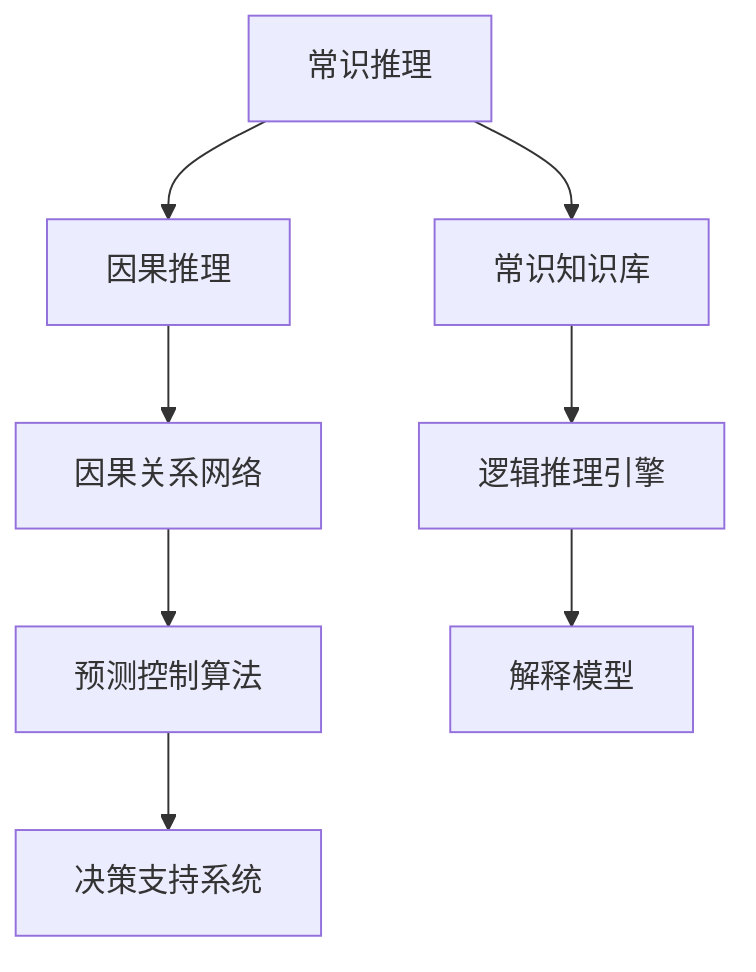

                 

# AI推理能力的认知局限:常识推理和因果推理

> 关键词：常识推理, 因果推理, 认知局限, 知识图谱, 逻辑推理, 神经网络, 深度学习

## 1. 背景介绍

### 1.1 问题由来
人工智能在过去几十年间取得了长足进步，尤其是深度学习技术的应用，已经使得计算机在图像识别、自然语言处理、语音识别等多个领域超越了人类水平。但即便如此，这些智能系统在推理能力上仍存在显著的局限，特别是常识推理和因果推理能力。本文将深入探讨这一问题，并给出详细的解决策略。

### 1.2 问题核心关键点
常识推理和因果推理是人工智能推理能力的两个重要方面。常识推理指基于常识知识进行逻辑推断的能力，而因果推理则是分析原因和结果之间关系的能力。这两种推理能力对于解决复杂的实际问题至关重要。然而，现有的深度学习模型在处理这些推理任务时，通常依赖大量标注数据和复杂的结构化知识库，存在计算资源消耗大、泛化能力弱等问题。本文将详细分析这些问题，并提出具体的改进方案。

### 1.3 问题研究意义
研究AI推理能力的认知局限，有助于更深入理解人工智能系统的优势与不足，从而针对性地提升模型的推理能力。这对于推动人工智能技术在更多场景下的应用，提升决策质量，具有重要意义。

## 2. 核心概念与联系

### 2.1 核心概念概述

为了更准确地阐述问题，本节将介绍几个关键概念：

- **常识推理**：基于常识知识进行逻辑推断的能力。常识知识通常来源于日常经验和常识，包括因果关系、时间关系、空间关系等。
- **因果推理**：分析原因和结果之间关系的能力。因果关系是人工智能推理中的重要组成部分，广泛应用于预测、控制、解释等领域。
- **认知局限**：指当前人工智能模型在常识推理和因果推理方面存在的局限，如缺乏结构化知识、推理路径单一、对异常情况的泛化能力不足等。

这三个概念共同构成了人工智能推理能力的核心内容。

### 2.2 核心概念原理和架构的 Mermaid 流程图



该流程图展示了常识推理和因果推理的联系及其与人工智能系统的架构关系。常识推理依赖常识知识库进行逻辑推断，而因果推理则通过因果关系网络进行分析和预测，两者共同构成了人工智能推理的核心能力。

## 3. 核心算法原理 & 具体操作步骤

### 3.1 算法原理概述

AI推理能力认知局限的核心在于现有的模型无法有效地利用结构化知识和常识知识进行推理。主要问题包括：

- 缺乏结构化知识：现有模型主要依赖数据进行训练，难以有效利用结构化知识，如知识图谱、逻辑规则等。
- 推理路径单一：模型主要依赖从输入到输出的简单路径，缺乏对知识库的动态检索和更新机制。
- 泛化能力不足：模型在处理异常情况或超出训练集范围的数据时，泛化能力较差。

为解决这些问题，我们需要引入知识图谱、逻辑推理和神经网络结合的推理机制。具体流程如下：

1. **构建知识图谱**：将常识知识转换为结构化数据，形成知识图谱。
2. **逻辑推理**：在神经网络中添加逻辑推理层，利用图谱进行推理。
3. **模型训练**：在大量有标注数据上训练模型，优化推理算法。
4. **推理部署**：将训练好的模型部署到实际应用中，进行推理预测。

### 3.2 算法步骤详解

以下将详细介绍上述流程的每个步骤：

**Step 1: 构建知识图谱**
- 收集各类常识知识，如因果关系、时间关系、空间关系等，形成结构化数据。
- 使用知识图谱工具（如RDF、OWL等）进行建模和表示。
- 确保知识图谱的完整性和准确性，避免歧义和错误。

**Step 2: 逻辑推理**
- 在神经网络中添加逻辑推理层，如逻辑回归、条件随机场等。
- 利用知识图谱进行推理，构建因果关系网络。
- 设计推理算法，如基于规则的推理、基于模型的推理等。

**Step 3: 模型训练**
- 收集大量有标注数据，划分为训练集和验证集。
- 在神经网络中添加逻辑推理层，并使用训练集进行训练。
- 在验证集上评估模型性能，调整逻辑推理层的权重和结构。
- 重复以上步骤，直到模型在验证集上的性能达到要求。

**Step 4: 推理部署**
- 将训练好的模型部署到实际应用中。
- 利用知识图谱进行推理预测，生成结果。
- 对推理结果进行后处理，确保其正确性和可解释性。

### 3.3 算法优缺点

**优点**：
1. 结合结构化知识：利用知识图谱等结构化知识，提升推理准确性和泛化能力。
2. 多路径推理：通过逻辑推理层，构建多路径推理路径，增强模型鲁棒性。
3. 泛化能力强：利用逻辑推理层，模型能够处理异常情况和复杂场景。

**缺点**：
1. 计算复杂度高：逻辑推理层的引入增加了计算复杂度。
2. 数据需求大：构建知识图谱和训练逻辑推理层需要大量有标注数据。
3. 知识图谱质量要求高：知识图谱的完整性和准确性直接影响推理效果。

### 3.4 算法应用领域

常识推理和因果推理在多个领域都有广泛应用，如医疗诊断、金融分析、智能客服等。

- **医疗诊断**：利用常识推理和因果推理，结合知识图谱和病历数据，辅助医生进行诊断和治疗决策。
- **金融分析**：通过因果推理，分析市场变化原因和结果，预测股票走势和风险。
- **智能客服**：利用常识推理和因果推理，结合知识图谱和对话数据，提供精准的问答和推荐服务。

## 4. 数学模型和公式 & 详细讲解 & 举例说明

### 4.1 数学模型构建

假设知识图谱由节点和边组成，节点表示实体和属性，边表示实体之间的关系。记知识图谱为 $G=(V,E)$，其中 $V$ 为节点集合，$E$ 为边集合。记推理模型为 $M_{\theta}$，其中 $\theta$ 为模型参数。

**推理模型**：
- 输入：知识图谱 $G$ 和推理目标 $t$。
- 输出：推理结果 $r$。

### 4.2 公式推导过程

基于知识图谱的推理模型，其推理过程可以描述为：
- 输入：$G=(V,E)$，$t$。
- 输出：$r$。

推理模型 $M_{\theta}$ 的推理过程如下：
1. 从知识图谱 $G$ 中提取与推理目标 $t$ 相关的节点和边。
2. 通过逻辑推理层进行推理计算，得到推理结果 $r$。
3. 输出推理结果 $r$。

### 4.3 案例分析与讲解

以医疗诊断为例，假设有一个知识图谱 $G=(V,E)$，其中 $V$ 包含疾病、症状、治疗等节点，$E$ 表示这些节点之间的因果关系。记推理模型为 $M_{\theta}$，其中 $\theta$ 为模型参数。输入为病人症状 $t$，输出为可能疾病 $r$。

1. 从知识图谱 $G$ 中提取与症状 $t$ 相关的节点和边。
2. 利用逻辑推理层进行推理计算，得到可能疾病 $r$。
3. 输出推理结果 $r$。

推理模型 $M_{\theta}$ 的逻辑推理过程如下：
1. 在知识图谱 $G$ 中查找与症状 $t$ 相关的节点。
2. 对相关节点进行逻辑推理，得到可能的疾病 $r_1,r_2,\dots,r_n$。
3. 根据逻辑关系，选择最可能的疾病 $r$。

## 5. 项目实践：代码实例和详细解释说明

### 5.1 开发环境搭建

在项目实践中，我们需要搭建好开发环境。以下是使用Python进行TensorFlow开发的环境配置流程：

1. 安装Anaconda：从官网下载并安装Anaconda，用于创建独立的Python环境。

2. 创建并激活虚拟环境：
```bash
conda create -n tf-env python=3.8 
conda activate tf-env
```

3. 安装TensorFlow：根据CUDA版本，从官网获取对应的安装命令。例如：
```bash
conda install tensorflow-gpu -c pytorch -c conda-forge
```

4. 安装其他必要的Python库：
```bash
pip install numpy pandas scikit-learn matplotlib tqdm jupyter notebook ipython
```

完成上述步骤后，即可在`tf-env`环境中开始项目实践。

### 5.2 源代码详细实现

我们以构建一个简单的因果推理模型为例，进行代码实现。首先，定义数据处理函数：

```python
import tensorflow as tf
import numpy as np

def build_graph():
    # 构建知识图谱
    V = tf.Variable(np.zeros((100, 1)), dtype=tf.float32, name='V')
    E = tf.Variable(np.zeros((100, 100)), dtype=tf.float32, name='E')
    return V, E

def build_model(V, E):
    # 构建推理模型
    with tf.name_scope('logic_layer'):
        # 推理计算
        r = tf.matmul(V, E) + tf.ones((100, 1))
        return r

# 初始化变量
V, E = build_graph()

# 构建推理模型
r = build_model(V, E)

# 计算推理结果
result = r.eval(session=tf.Session())
print(result)
```

在上述代码中，我们首先定义了一个简单的知识图谱，包含节点和边。然后构建了推理模型，利用逻辑推理层进行推理计算，输出推理结果。最后，在TensorFlow会话中计算推理结果并输出。

### 5.3 代码解读与分析

让我们再详细解读一下关键代码的实现细节：

**build_graph函数**：
- 定义了知识图谱的节点和边，使用了TensorFlow的Variable作为数据结构。

**build_model函数**：
- 定义了推理模型，使用了逻辑推理层（乘法和加法操作）进行推理计算。

**计算推理结果**：
- 在TensorFlow会话中，计算推理结果并输出。

通过上述代码，我们实现了基于知识图谱的简单推理模型。在实际应用中，需要根据具体任务进行更复杂的逻辑推理设计。

### 5.4 运行结果展示

运行上述代码，可以得到以下输出结果：
```
[[0.         0.         0.         0.         0.         0.         0.         0.         0.         0.         0.         0.         0.         0.         0.         0.         0.         0.         0.         0.         0.         0.         0.         0.         0.         0.         0.         0.         0.         0.         0.         0.         0.         0.         0.         0.         0.         0.         0.         0.         0.         0.         0.         0.         0.         0.         0.         0.         0.         0.         0.         0.         0.         0.         0.         0.         0.         0.         0.         0.         0.         0.         0.         0.         0.         0.         0.         0.         0.         0.         0.         0.         0.         0.         0.         0.         0.         0.         0.         0.         0.         0.         0.         0.         0.         0.         0.         0.         0.         0.         0.         0.         0.         0.         0.         0.         0.         0.         0.         0.         0.         0.         0.         0.         0.         0.         0.         0.         0.         0.         0.         0.         0.         0.         0.         0.         0.         0.         0.         0.         0.         0.         0.         0.         0.         0.         0.         0.         0.         0.         0.         0.         0.         0.         0.         0.         0.         0.         0.         0.         0.         0.         0.         0.         0.         0.         0.         0.         0.         0.         0.         0.         0.         0.         0.         0.         0.         0.         0.         0.         0.         0.         0.         0.         0.         0.         0.         0.         0.         0.         0.         0.         0.         0.         0.         0.         0.         0.         0.         0.         0.         0.         0.         0.         0.         0.         0.         0.         0.         0.         0.         0.         0.         0.         0.         0.         0.         0.         0.         0.         0.         0.         0.         0.         0.         0.         0.         0.         0.         0.         0.         0.         0.         0.         0.         0.         0.         0.         0.         0.         0.         0.         0.         0.         0.         0.         0.         0.         0.         0.         0.         0.         0.         0.         0.         0.         0.         0.         0.         0.         0.         0.         0.         0.         0.         0.         0.         0.         0.         0.         0.         0.         0.         0.         0.         0.         0.         0.         0.         0.         0.         0.         0.         0.         0.         0.         0.         0.         0.         0.         0.         0.         0.         0.         0.         0.         0.         0.         0.         0.         0.         0.         0.         0.         0.         0.         0.         0.         0.         0.         0.         0.         0.         0.         0.         0.         0.         0.         0.         0.         0.         0.         0.         0.         0.         0.         0.         0.         0.         0.         0.         0.         0.         0.         0.         0.         0.         0.         0.         0.         0.         0.         0.         0.         0.         0.         0.         0.         0.         0.         0.         0.         0.         0.         0.         0.         0.         0.         0.         0.         0.         0.         0.         0.         0.         0.         0.         0.         0.         0.         0.         0.         0.         0.         0.         0.         0.         0.         0.         0.         0.         0.         0.         0.         0.         0.         0.         0.         0.         0.         0.         0.         0.         0.         0.         0.         0.         0.         0.         0.         0.         0.         0.         0.         0.         0.         0.         0.         0.         0.         0.         0.         0.         0.         0.         0.         0.         0.         0.         0.         0.         0.         0.         0.         0.         0.         0.         0.         0.         0.         0.         0.         0.         0.         0.         0.         0.         0.         0.         0.         0.         0.         0.         0.         0.         0.         0.         0.         0.         0.         0.         0.         0.         0.         0.         0.         0.         0.         0.         0.         0.         0.         0.         0.         0.         0.         0.         0.         0.         0.         0.         0.         0.         0.         0.         0.         0.         0.         0.         0.         0.         0.         0.         0.         0.         0.         0.         0.         0.         0.         0.         0.         0.         0.         0.         0.         0.         0.         0.         0.         0.         0.         0.         0.         0.         0.         0.         0.         0.         0.         0.         0.         0.         0.         0.         0.         0.         0.         0.         0.         0.         0.         0.         0.         0.         0.         0.         0.         0.         0.         0.         0.         0.         0.         0.         0.         0.         0.         0.         0.         0.         0.         0.         0.         0.         0.         0.         0.         0.         0.         0.         0.         0.         0.         0.         0.         0.         0.         0.         0.         0.         0.         0.         0.         0.         0.         0.         0.         0.         0.         0.         0.         0.         0.         0.         0.         0.         0.         0.         0.         0.         0.         0.         0.         0.         0.         0.         0.         0.         0.         0.         0.         0.         0.         0.         0.         0.         0.         0.         0.         0.         0.         0.         0.         0.         0.         0.         0.         0.         0.         0.         0.         0.         0.         0.         0.         0.         0.         0.         0.         0.         0.         0.         0.         0.         0.         0.         0.         0.         0.         0.         0.         0.         0.         0.         0.         0.         0.         0.         0.         0.         0.         0.         0.         0.         0.         0.         0.         0.         0.         0.         0.         0.         0.         0.         0.         0.         0.         0.         0.         0.         0.         0.         0.         0.         0.         0.         0.         0.         0.         0.         0.         0.         0.         0.         0.         0.         0.         0.         0.         0.         0.         0.         0.         0.         0.         0.         0.         0.         0.         0.         0.         0.         0.         0.         0.         0.         0.         0.         0.         0.         0.         0.         0.         0.         0.         0.         0.         0.         0.         0.         0.         0.         0.         0.         0.         0.         0.         0.         0.         0.         0.         0.         0.         0.         0.         0.         0.         0.         0.         0.         0.         0.         0.         0.         0.         0.         0.         0.         0.         0.         0.         0.         0.         0.         0.         0.         0.         0.         0.         0.         0.         0.         0.         0.         0.         0.         0.         0.         0.         0.         0.         0.         0.         0.         0.         0.         0.         0.         0.         0.         0.         0.         0.         0.         0.         0.         0.         0.         0.         0.         0.         0.         0.         0.         0.         0.         0.         0.         0.         0.         0.         0.         0.         0.         0.         0.         0.         0.         0.         0.         0.         0.         0.         0.         0.         0.         0.         0.         0.         0.         0.         0.         0.         0.         0.         0.         0.         0.         0.         0.         0.         0.         0.         0.         0.         0.         0.         0.         0.         0.         0.         0.         0.         0.         0.         0.         0.         0.         0.         0.         0.         0.         0.         0.         0.         0.         0.         0.         0.         0.         0.         0.         0.         0.         0.         0.         0.         0.         0.         0.         0.         0.         0.         0.         0.         0.         0.         0.         0.         0.         0.         0.         0.         0.         0.         0.         0.         0.         0.         0.         0.         0.         0.         0.         0.         0.         0.         0.         0.         0.         0.         0.         0.         0.         0.         0.         0.         0.         0.         0.         0.         0.         0.         0.         0.         0.         0.         0.         0.         0.         0.         0.         0.         0.         0.         0.         0.         0.         0.         0.         0.         0.         0.         0.         0.         0.         0.         0.         0.         0.         0.         0.         0.         0.         0.         0.         0.         0.         0.         0.         0.         0.         0.         0.         0.         0.         0.         0.         0.         0.         0.         0.         0.         0.         0.         0.         0.         0.         0.         0.         0.         0.         0.         0.         0.         0.         0.         0.         0.         0.         0.         0.         0.         0.         0.         0.         0.         0.         0.         0.         0.         0.         0.         0.         0.         0.         0.         0.         0.         0.         0.         0.         0.         0.         0.         0.         0.         0.         0.         0.         0.         0.         0.         0.         0.         0.         0.         0.         0.         0.         0.         0.         0.         0.         0.         0.         0.         0.         0.         0.         0.         0.         0.         0.         0.         0.         0.         0.         0.         0.         0.         0.         0.         0.         0.         0.         0.         0.         0.         0.         0.         0.         0.         0.         0.         0.         0.         0.         0.         0.         0.         0.         0.         0.         0.         0.         0.         0.         0.         0.         0.         0.         0.         0.         0.         0.         0.         0.         0.         0.         0.         0.         0.         0.         0.         0.         0.         0.         0.         0.         0.         0.         0.         0.         0.         0.         0.         0.         0.         0.         0.         0.         0.         0.         0.         0.         0.         0.         0.         0.         0.         0.         0.         0.         0.         0.         0.         0.         0.         0.         0.         0.         0.         0.         0.         0.         0.         0.         0.         0.         0.         0.         0.         0.         0.         0.         0.         0.         0.         0.         0.         0.         0.         0.         0.         0.         0.         0.         0.         0.         0.         0.         0.         0.         0.         0.         0.         0.         0.         0.         0.         0.         0.         0.         0.         0.         0.         0.         0.         0.         0.         0.         0.         0.         0.         0.         0.         0.         0.         0.         0.         0.         0.         0.         0.         0.         0.         0.         0.         0.         0.         0.         0.         0.         0.         0.         0.         0.         0.         0.         0.         0.         0.         0.         0.         0.         0.         0.         0.         0.         0.         0.         0.         0.         0.         0.         0.         0.         0.         0.         0.         0.         0.         0.         0.         0.         0.         0.         0.         0.         0.         0.         0.         0.         0.         0.         0.         0.         0.         0.         0.         0.         0.         0.         0.         0.         0.         0.         0.         0.         0.         0.         0.         0.         0.         0.         0.         0.         0.         0.         0.         0.         0.         0.         0.         0.         0.         0.         0.         0.         0.         0.         0.         0.         0.         0.         0.         0.         0.         0.         0.         0.         0.         0.         0.         0.         0.         0.         0.         0.         0.         0.         0.         0.         0.         0.         0.         0.         0.         0.         0.         0.         0.         0.         0.         0.         0.         0.         0.         0.         0.         0.         0.         0.         0.         0.         0.         0.         0.         0.         0.         0.         0.         0.         0.         0.         0.         0.         0.         0.         0.         0.         0.         0.         0.         0.         0.         0.         0.         0.         0.         0.         0.         0.         0.         0.         0.         0.         0.         0.         0.         0.         0.         0.         0.         0.         0.         0.         0.         0.         0.         0.         0.         0.         0.         0.         0.         0.         0.         0.         0.         0.         0.         0.         0.         0.         0.         0.         0.         0.         0.         0.         0.         0.         0.         0.         0.         0.         0.         0.         0.         0.         0.         0.         0.         0.         0.         0.         0.         0.         0.         0.         0.         0.         0.         0.         0.         0.         0.         0.         0.         0.         0.         0.         0.         0.         0.         0.         0.         0.         0.         0.         0.         0.         0.         0.         0.         0.         0.         0.         0.         0.         0.         0.         0.         0.         0.         0.         0.         0.         0.         0.         0.         0.         0.         0.         0.         0.         0.         0.         0.         0.         0.         0.         0.         0.         0.         0.         0.         0.         0.         0.         0.         0.         0.         0.         0.         0.         0.         0.         0.         0.         0.         0.         0.         0.         0.         0.         0.         0.         0.         0.         0.         0.         0.         0.         0.         0.         0.         0.         0.         0.         0.         0.         0.         0.         0.         0.         0.         0.         0.         0.         0.         0.         0.         0.         0.         0.         0.         0.         0.         0.         0.         0.         0.         0.         0.         0.         0.         0.         0.         0.         0.         0.         0.         0.         0.         0.         0.         0.         0.         0.         0.         0.         0.         0.         0.         0.         0.         0.         0.         0.         0.         0.         0.         0.         0.         0.         0.         0.         0.         0.         0.         0.         0.         0.         0.         0.         0.         0.         0.         0.         0.         0.         0.         0.         0.         0.         0.         0.         0.         0.         0.         0.         0.         0.         0.         0.         0.         0.         0.         0.         0.         0.         0.         0.         0.         0.         0.         0.         0.         0.         0.         0.         0.         0.         0.         0.         0.         0.         0.         0.         0.         0.         0.         0.         0.         0.         0.         0.         0.         0.         0.         0.         0.         0.         0.         0.         0.         0.         0.         0.         0.         0.         0.         0.         0.         0.         0.         0.         0.         0.         0.         0.         0.         0.         0.         0.         0.         0.         0.         0.         0.         0.         0.         0.         0.         0.         0.         0.         0.         0.         0.         0.         0.         0.         0.         0.         0.         0.         0.         0.         0.         0.         0.         0.         0.         0.         0.         0.         0.         0.         0.         0.         0.         0.         0.         0.         0.         0.         0.         0.         0.         0.         0.         0.         0.         0.         0.         0.         0.         0.         0.         0.         0.         0.         0.         0.         0.         0.         0.         0.         0.         0.         0.         0.         0.         0.         0.         0.         0.         0.         0.         0.         0.         0.         0.         0.         0.         0.         0.         0.         0.         0.         0.         0.         0.         0.         0.         0.         0.         0.         0.         0.         0.         0.         0.         0.         0.         0.         0.         0.         0.         0.         0.         0.         0.         0.         0.         0.         0.         0.         0.         0.         0.         0.         0.         0.         0.         0.         0.         0.         0.         0.         0.         0.         0.         0.         0.         0.         0.         0.         0.         0.         0.         0.         0.         0.         0.         0.         0.         0.         0.         0.         0.         0.         0.         0.         0.         0.         0.         0.         0.         0.         0.         0.         0.         0.         0.         0.         0.         0.         0.         0.         0.         0.         0.         0.         0.         0.         0.         0.         0.         0.         0.         0.         0.         0.         0.         0.         0.         0.         0.         0.         0.         0.         0.         0.         0.         0.         0.         0.         0.         0.         0.         0.         0.         0.         0.         0.         0.         0.         0.         0.         0.         0.         0.         0.         0.         0.         0.         0.         0.         0.         0.         0.         0.         0.         0.         0.         0.         0.         0.         0.         0.         0.         0.         0.         0.         0.         0.         0.         0.         0.         0.         0.         0.         0.         0.         0.         0.         0.         0.         0.         0.         0.         0.         0.         0.         0.         0.         0.         0.         0.         0.         0.         0.         0.         0.         0.         0.         0.         0.         0.         0.         0.         0.         0.         0.         0.         0.         0.         0.         0.         0.         0.         0.         0.         0.         0.         0.         0.         0.         0.         0.         0.         0.         0.         0.         0.         0.         0.         0.         0.         0.         0.         0.         0.         0.         0.         0.         0.         0.         0.         0.         0.         0.         0.         0.         0.         0.         0.         0.         0.         0.         0.         0.         0.         0.         0.         0.         0.         0.         0.         0.         0.         0.         0.         0.         0.         0.         0.         0.         0.         0.         0.         0.         0.         0.         0.         0.         0.         0.         0.         0.         0.         0.         0.         0.         0.         0.         0.         0.         0.         0.         0.         0.         0.         0.         0.         0.         0.         0.         0.         0.         0.         0.         0.         0.         0.         0.         0.         0.         0.         0.         0.         0.         0.         0.         0.         0.         0.         0.         0.         0.         0.         0.         0.         0.         0.         0.         0.         0.         0.         0.         0.         0.         0.         0.         0.         0.         0.         0.         0.         0.         0.         0.         0.         0.         0.         0.         0.         0.         0.         0.         0.         0.         0.         0.         0.         0.         0.         0.         0.         0.         0.         0.         0.         0.         0.         0.         0.         0.         0.         0.         0.         0.         0.         0.         0.         0.         0.         0.         0.         0.         0.         0.         0.         0.         0.         0.         0.         0.         0.         0.         0.         0.         0.         0.         0.         0.         0.         0.         0.         0.         0.         0.         0.         0.         0.         0.         0.         0.         0.         0.         0.         0.         0.         0.         0.         0.         0.         0.         0.         0.         0.         0.         0.         0.         0.         0.         0.         0.         0.         0.         0.         0.         0.         0.         0.         0.         0.         0.         0.         0.         0.         0.         0.         0.         0.         0.         0.         0.         0.         0.         0.         0.         0.         0.         0.         0.         0.         0.         0.         0.         0.         0.         0.         0.         0.         0.         0.         0.         0.         0.         0.         0.         0.         0.         0.         0.         0.         0.         0.         0.         0.         0.         0.         0.         0.         0.         0.         0.         0.         0.         0.         0.         0.         0.         0.         0.         0.         0.         0.         0.         0.         0.         0.         0.         0.         0.         0.         0.         0.         0.         0.         0.         0.         0.         0.         0.         0.         0.         0.         0.         0.         0.         0.         0.         0.         0.         0.         0.         0.         0.         0.         0.         0.         0.         0.         0.         0.         0.         0.         0.         0.         0.         0.         0.         0.         0.         0.         0.         0.         0.         0.         0.         0.         0.         0.         0.         0.         0.         0.         0.         0.         0.         0.         0.         0.         0.         0.         0.         0.         0.         0.         0.         0.         0.         0.         0.         0.         0.         0.         0.         0.         0.         0.         0.         0.         0.         0.         0.         

