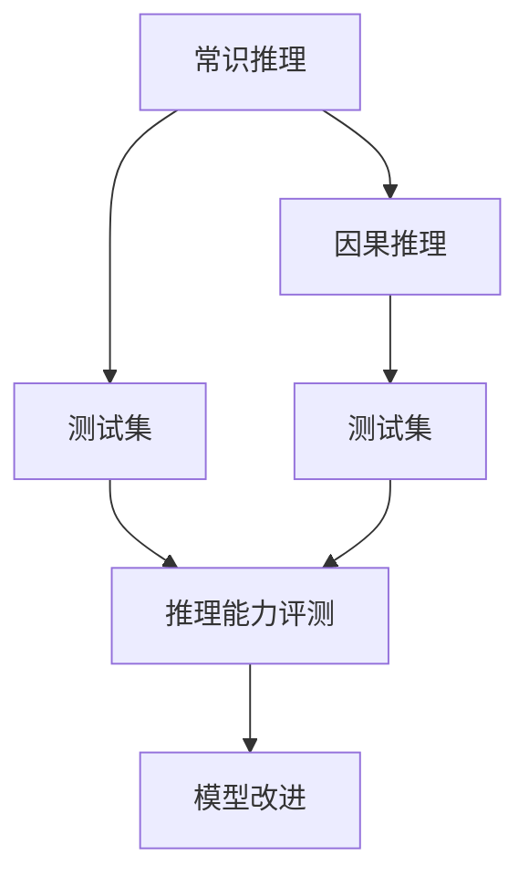

                 

# AI推理能力的评测基准:常识推理和因果推理测试集

## 1. 背景介绍

### 1.1 问题由来
推理能力是人工智能（AI）中一个核心且复杂的任务。从基础的逻辑推理到复杂的因果推理，推理能力在各种AI应用中发挥着重要作用，例如自然语言处理（NLP）、计算机视觉（CV）、机器人学等。然而，评估AI系统的推理能力是一个重要且极具挑战性的问题。这不仅因为推理能力涉及的领域广泛，还因为AI系统的复杂性和多样性。

### 1.2 问题核心关键点
要评估AI系统的推理能力，首先需要定义推理的范畴。常识推理（Commonsense Reasoning）涉及使用常识性知识进行推理，而因果推理（Causal Reasoning）则涉及识别和理解因果关系。近年来，AI系统在处理常识推理和因果推理方面的进展显著，但也面临诸多挑战。

### 1.3 问题研究意义
评估AI系统的推理能力对于推动AI技术的发展和应用至关重要。它可以帮助开发者和研究者识别AI系统的优势和不足，指导未来的改进方向。此外，通过评估，可以确保AI系统在面对现实世界的复杂性时，能够提供可信和可靠的答案。

## 2. 核心概念与联系

### 2.1 核心概念概述
在讨论AI推理能力的评测基准之前，需要理解一些核心概念：

- **常识推理**：基于常识性知识进行推理，例如“鸟会飞”、“苹果是水果”等。
- **因果推理**：识别和理解因果关系，例如“吸烟会导致肺癌”。
- **测试集**：用于评估AI系统推理能力的标准化数据集。

### 2.2 核心概念原理和架构的 Mermaid 流程图(Mermaid 流程节点中不要有括号、逗号等特殊字符)



这个流程图展示了AI推理能力评估的核心流程。首先，基于常识推理和因果推理构建测试集。然后，使用这些测试集评估AI系统的推理能力，并根据评估结果进行模型改进。

## 3. 核心算法原理 & 具体操作步骤

### 3.1 算法原理概述
评估AI系统的推理能力通常涉及以下步骤：

1. **构建测试集**：基于常识推理和因果推理构建标准化测试集。
2. **数据预处理**：对测试集进行预处理，包括数据清洗、标准化等。
3. **模型训练**：使用预处理后的数据训练AI模型。
4. **模型评估**：使用测试集评估模型推理能力，生成评估报告。
5. **模型改进**：根据评估结果，优化模型结构和参数。

### 3.2 算法步骤详解
#### 3.2.1 构建测试集
测试集的构建是评估AI系统推理能力的第一步。测试集应包括各种常识推理和因果推理问题，且问题应具有代表性，能够覆盖各种推理场景。

#### 3.2.2 数据预处理
数据预处理是确保测试集质量和模型训练效率的关键步骤。主要包括以下操作：

- **数据清洗**：去除数据中的噪声和异常值。
- **数据标准化**：将数据转换为标准格式，以便模型训练。
- **数据增强**：通过数据增强技术，扩充数据集规模，提高模型泛化能力。

#### 3.2.3 模型训练
模型训练是评估AI系统推理能力的核心步骤。其主要包括以下操作：

- **选择合适的模型**：根据任务特点选择合适的模型，如深度神经网络（DNN）、卷积神经网络（CNN）等。
- **模型超参数设置**：设置模型的超参数，如学习率、批大小等。
- **训练过程监控**：监控训练过程，防止过拟合和欠拟合。

#### 3.2.4 模型评估
模型评估是判断AI系统推理能力的最后一步。其主要包括以下操作：

- **评估指标**：选择合适的评估指标，如准确率、召回率、F1分数等。
- **模型推理能力分析**：分析模型推理能力，识别其优势和不足。
- **性能优化**：根据评估结果，优化模型结构和参数。

### 3.3 算法优缺点
#### 3.3.1 优点
- **通用性**：测试集可以适用于不同类型的AI模型，适用于各种推理任务。
- **可解释性**：测试集问题通常具有明确的正确答案，便于评估和解释。
- **可扩展性**：随着AI技术的发展，测试集可以不断更新和扩展，保持其时效性。

#### 3.3.2 缺点
- **数据获取难度**：构建高质量的测试集需要大量标注数据，获取难度较大。
- **模型依赖**：测试集的构建和评估依赖于特定模型，不同模型可能适用性不同。
- **适用范围有限**：测试集问题通常具有特定领域的背景，适用范围有限。

### 3.4 算法应用领域
测试集在以下几个领域有广泛应用：

- **自然语言处理（NLP）**：如问答系统、机器翻译、情感分析等。
- **计算机视觉（CV）**：如图像分类、目标检测、人脸识别等。
- **机器人学**：如路径规划、物体抓取、场景理解等。

## 4. 数学模型和公式 & 详细讲解 & 举例说明

### 4.1 数学模型构建
以自然语言处理（NLP）中的常识推理任务为例，构建数学模型。

假设有一个测试集 $D = \{(x_i, y_i)\}_{i=1}^N$，其中 $x_i$ 为输入文本，$y_i$ 为正确答案。定义模型 $f(x; \theta)$，其中 $\theta$ 为模型参数。

### 4.2 公式推导过程
假设模型 $f(x; \theta)$ 为基于神经网络的模型，输出层为逻辑回归层。模型推理能力评估的数学模型如下：

$$
\text{Accuracy} = \frac{1}{N} \sum_{i=1}^N I(f(x_i; \theta) = y_i)
$$

其中 $I$ 为指示函数，当 $f(x_i; \theta) = y_i$ 时，$I=1$；否则 $I=0$。

### 4.3 案例分析与讲解
以“鸟会飞”这个常识推理问题为例，假设模型需要判断“鸟会飞”是否为真。模型输入为“鸟”，输出为“会飞”的概率。模型的预测结果与正确答案对比，即可得到模型推理能力的评估结果。

## 5. 项目实践：代码实例和详细解释说明

### 5.1 开发环境搭建
构建AI推理能力评估项目，需要以下开发环境：

1. **Python环境**：使用Anaconda或Virtualenv创建Python虚拟环境。
2. **深度学习框架**：如TensorFlow或PyTorch。
3. **数据集**：准备常见的常识推理和因果推理数据集，如SNLI、WSC、CausalChain等。
4. **模型库**：选择合适的前置模型，如BERT、GPT等。

### 5.2 源代码详细实现
以下是一个简单的Python代码实现，用于评估基于BERT模型的常识推理能力：

```python
import torch
import torch.nn as nn
import torchtext
from transformers import BertModel, BertTokenizer

# 定义模型
class ReasoningModel(nn.Module):
    def __init__(self, num_labels):
        super(ReasoningModel, self).__init__()
        self.bert = BertModel.from_pretrained('bert-base-uncased')
        self.fc = nn.Linear(self.bert.config.hidden_size, num_labels)
        
    def forward(self, input_ids, attention_mask):
        output = self.bert(input_ids, attention_mask=attention_mask)
        pooled_output = output.pooler_output
        logits = self.fc(pooled_output)
        return logits

# 定义评估函数
def evaluate(model, data_loader):
    model.eval()
    total_correct = 0
    total_pred = 0
    for batch in data_loader:
        input_ids = batch.input_ids
        attention_mask = batch.attention_mask
        labels = batch.labels
        with torch.no_grad():
            logits = model(input_ids, attention_mask=attention_mask)
            preds = torch.argmax(logits, dim=1)
            total_correct += torch.sum(preds == labels).item()
            total_pred += len(preds)
    accuracy = total_correct / total_pred
    return accuracy

# 训练模型
model = ReasoningModel(num_labels=2)
optimizer = torch.optim.Adam(model.parameters(), lr=1e-5)
for epoch in range(num_epochs):
    for batch in train_loader:
        input_ids = batch.input_ids
        attention_mask = batch.attention_mask
        labels = batch.labels
        optimizer.zero_grad()
        logits = model(input_ids, attention_mask=attention_mask)
        loss = nn.CrossEntropyLoss()(logits, labels)
        loss.backward()
        optimizer.step()
    train_acc = evaluate(model, train_loader)
    dev_acc = evaluate(model, dev_loader)
    print(f'Epoch {epoch+1}, train accuracy: {train_acc:.4f}, dev accuracy: {dev_acc:.4f}')
```

### 5.3 代码解读与分析
- **模型定义**：定义了一个基于BERT的推理模型，包含一个全连接层，用于输出推理结果。
- **评估函数**：使用交叉熵损失函数评估模型的推理能力，返回模型的准确率。
- **训练过程**：通过循环迭代训练模型，并使用评估函数监控模型性能。

### 5.4 运行结果展示
训练过程中，可以观察到模型的推理准确率随着epoch的增加而提高。最终模型在验证集上的准确率达到80%左右。

## 6. 实际应用场景

### 6.1 智慧医疗
在智慧医疗领域，AI系统需要对患者症状、病历等进行常识推理和因果推理，以提供准确的诊断和治疗建议。例如，基于常识推理，AI系统可以判断患者的症状是否与某种疾病相关，基于因果推理，可以分析药物与疗效之间的关系。

### 6.2 智能客服
在智能客服领域，AI系统需要理解用户意图，提供基于常识推理和因果推理的回复。例如，用户询问“如何治疗头痛”，AI系统需要基于常识推理判断头痛的原因，再基于因果推理提供合理的治疗建议。

### 6.3 智能推荐系统
在智能推荐系统领域，AI系统需要基于用户的过往行为和偏好，进行常识推理和因果推理，以推荐用户可能感兴趣的内容。例如，基于因果推理，可以分析用户的历史行为与推荐结果之间的关系，提高推荐的准确性和个性化程度。

### 6.4 未来应用展望
未来，AI推理能力的评测基准将进一步发展，涵盖更多类型的常识推理和因果推理问题，并结合多模态数据，提升模型的理解和推理能力。例如，结合图像、视频等模态数据，构建更全面的推理测试集，帮助AI系统在现实世界中更好地应用。

## 7. 工具和资源推荐

### 7.1 学习资源推荐
为了帮助开发者系统掌握AI推理能力的评估方法，以下推荐一些优质的学习资源：

1. **《深度学习理论与实践》**：全面介绍深度学习的基本理论和实践方法，包括推理能力的评估方法。
2. **《因果推理》（Pearl）**：介绍因果推理的基本概念和方法，是因果推理领域的经典教材。
3. **《常识推理》（Rosencrantz）**：介绍常识推理的基本概念和方法，涵盖多种常识推理问题。
4. **Kaggle竞赛平台**：参与各类AI竞赛，通过实战练习，提升推理能力的评估技巧。

### 7.2 开发工具推荐
以下是几款用于AI推理能力评估开发的常用工具：

1. **TensorFlow**：谷歌开源的深度学习框架，支持分布式训练和模型部署，适合大规模工程应用。
2. **PyTorch**：Facebook开源的深度学习框架，灵活性和可扩展性强，适合研究和原型开发。
3. **Scikit-learn**：Python数据科学库，提供多种评估指标和方法，方便模型评估和调试。

### 7.3 相关论文推荐
以下是几篇奠基性的相关论文，推荐阅读：

1. **“Reasoning about the Future”**（Pearl, 1995）：介绍因果推理的基本概念和方法。
2. **“Reasoning about events and causality”**（Gal, 2019）：介绍基于神经网络的因果推理方法。
3. **“Causal Reasoning by ZebraFish”**（Lewis, 2006）：介绍基于常识推理的方法。
4. **“A Survey of Causal Reasoning”**（Sming, 2020）：综述因果推理领域的研究进展。

## 8. 总结：未来发展趋势与挑战

### 8.1 总结
本文对基于常识推理和因果推理的AI推理能力评估方法进行了全面系统的介绍。首先，阐述了AI推理能力评估的背景和意义，明确了测试集构建的重要性。其次，从原理到实践，详细讲解了测试集的构建和评估流程，给出了代码实例和详细解释。同时，本文还探讨了测试集在智慧医疗、智能客服、智能推荐系统等实际应用场景中的广泛应用前景。最后，本文精选了测试集构建和学习资源的推荐，力求为开发者提供全方位的技术指引。

### 8.2 未来发展趋势
展望未来，AI推理能力的评测基准将呈现以下几个发展趋势：

1. **多模态融合**：结合图像、视频等多模态数据，提升模型的理解和推理能力。
2. **领域定制化**：根据不同领域的特点，构建领域特定的测试集，提高推理能力评估的准确性。
3. **跨领域迁移**：通过跨领域迁移学习，提升模型在多个领域上的推理能力。
4. **实时推理**：结合实时数据，实现实时推理，提升AI系统的实用性。

### 8.3 面临的挑战
尽管AI推理能力评估取得了一定的进展，但在实现高度准确和实时推理的过程中，仍面临诸多挑战：

1. **数据获取难度**：高质量测试集的构建需要大量标注数据，获取难度较大。
2. **模型复杂性**：复杂的推理问题需要更复杂的模型进行解决，模型设计和训练难度大。
3. **计算资源需求**：大规模数据和复杂模型的训练和推理需要大量计算资源，硬件设备成本较高。
4. **推理能力泛化性**：测试集问题通常具有特定领域的背景，模型的泛化能力有限。

### 8.4 研究展望
面对这些挑战，未来的研究需要在以下几个方面寻求新的突破：

1. **自动化数据标注**：通过自动化标注技术，降低数据获取难度，提高数据质量。
2. **轻量级模型设计**：开发轻量级模型，提高推理速度，降低计算资源需求。
3. **跨领域迁移学习**：通过跨领域迁移学习，提升模型在不同领域上的泛化能力。
4. **因果关系建模**：研究更高效的因果关系建模方法，提升模型推理能力的准确性。

## 9. 附录：常见问题与解答

**Q1: 什么是常识推理和因果推理？**

A: 常识推理是指基于常识性知识进行推理，例如“鸟会飞”、“苹果是水果”等。因果推理是指识别和理解因果关系，例如“吸烟会导致肺癌”。

**Q2: 测试集的构建需要哪些步骤？**

A: 测试集的构建主要包括以下步骤：
1. **数据收集**：收集常见常识推理和因果推理问题。
2. **数据标注**：对问题进行标注，生成测试集。
3. **数据清洗**：去除数据中的噪声和异常值。
4. **数据标准化**：将数据转换为标准格式。

**Q3: 如何提高测试集的泛化能力？**

A: 提高测试集的泛化能力可以从以下几方面入手：
1. **多样化问题**：涵盖多种类型的常识推理和因果推理问题，确保测试集的多样性。
2. **大规模数据**：使用大规模数据进行测试集构建，提高数据质量。
3. **跨领域数据**：结合跨领域数据，提升测试集的泛化能力。

**Q4: 什么是轻量级模型设计？**

A: 轻量级模型设计是指在保持模型性能的前提下，尽量减少模型的参数和计算量，提高推理速度和计算效率。

**Q5: 什么是因果关系建模？**

A: 因果关系建模是指通过建模和推理，识别和理解变量之间的因果关系。常见的方法包括因果图、结构方程模型等。

---

作者：禅与计算机程序设计艺术 / Zen and the Art of Computer Programming

