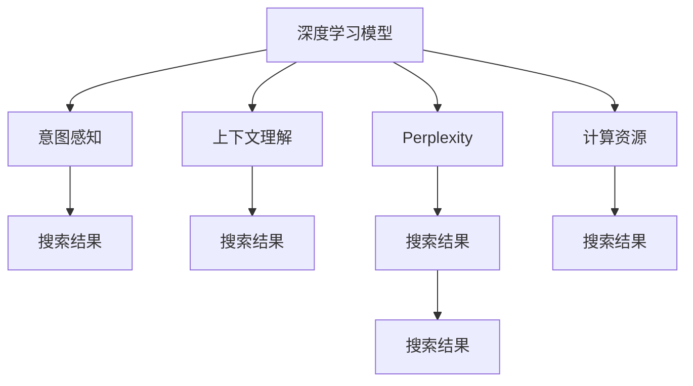

                 

## 1. 背景介绍

### 1.1 问题由来

随着深度学习技术的不断突破，人工智能(AI)技术在搜索领域的应用取得了显著进展。搜索引擎作为互联网时代的信息入口，一直是各大科技公司竞相争夺的战略高地。在AI技术的推动下，搜索引擎正从传统的基于关键词匹配的模式，向更智能、更个性化的搜索方向演进。其中，基于语义理解、意图感知、上下文关联的搜索技术，成为当前搜索技术的前沿方向。

### 1.2 问题核心关键点

当前，基于AI的搜索技术主要通过两个关键点来实现个性化和智能化：

1. **深度学习模型**：利用深度神经网络进行大规模语料预训练，学习复杂的语言模式和语义关系，构建高精度的语言模型。
2. **意图感知与上下文理解**：通过深度学习模型解析用户输入，结合上下文信息，理解用户真实意图，提供更相关、更精准的搜索结果。

但以上技术面临的挑战也日益凸显：

- **语义模糊**：中文语言的歧义性和模糊性使得意图感知更加困难。
- **多义性**：同一个词或短语在不同上下文中有多种解释，如何统一其语义表示是一个难题。
- **上下文关联**：如何准确捕捉用户的搜索背景、历史行为等信息，并将其与当前搜索行为关联起来，提升搜索结果的相关性。
- **计算资源**：深度学习模型参数众多，计算成本较高，如何平衡模型的复杂度和推理速度是一个挑战。
- **数据隐私**：如何保护用户隐私，避免过度收集和滥用用户搜索数据，是需要关注的问题。

### 1.3 问题研究意义

研究AI搜索技术的关键点，对于提升搜索引擎的智能化水平，改善用户体验，具有重要意义：

- **提升搜索效率**：通过深度学习技术，能够准确理解和处理自然语言，提供更精准的搜索结果，提升用户的搜索体验。
- **个性化推荐**：结合用户历史搜索数据和行为模式，个性化推荐相关内容，提升用户的满意度和忠诚度。
- **数据驱动决策**：基于用户搜索数据和行为，分析用户需求和市场趋势，为企业的市场决策提供数据支持。
- **技术创新**：推动NLP技术在搜索场景的应用，推动AI技术的发展和普及。

## 2. 核心概念与联系

### 2.1 核心概念概述

在探讨AI搜索技术的核心概念时，我们将重点关注以下几个方面：

- **深度学习模型**：如BERT、GPT等，通过大规模预训练学习语言表示，为搜索技术提供语义理解的基础。
- **意图感知**：指对用户输入的语义进行解析，理解用户的查询意图，精准定位搜索结果。
- **上下文理解**：在用户搜索过程中，结合历史行为、上下文环境等信息，提升搜索的相关性。
- **Perplexity**：用于衡量语言模型的预测能力，是评估搜索引擎性能的重要指标。
- **计算资源**：包括计算速度、内存占用、存储容量等，是影响搜索引擎效率的重要因素。

这些概念之间的逻辑关系可以通过以下Mermaid流程图来展示：



这个流程图展示了深度学习模型、意图感知、上下文理解与搜索结果之间的关系：

1. 深度学习模型通过大规模预训练学习语言表示，为意图感知和上下文理解提供基础。
2. 意图感知解析用户输入，结合上下文理解，提升搜索结果的相关性和精准度。
3. 计算资源优化，提高模型的推理速度，减少延迟，提升用户体验。
4. Perplexity评估模型预测能力，用于指导模型优化和搜索性能提升。

## 3. 核心算法原理 & 具体操作步骤
### 3.1 算法原理概述

AI搜索的核心算法包括深度学习模型和意图感知算法。其中，Perplexity是一个重要的性能指标，用于衡量模型预测数据的能力。

### 3.2 算法步骤详解

#### 3.2.1 深度学习模型的构建与训练

1. **数据准备**：收集大规模无标签文本数据，构建训练集。
2. **模型设计**：选择适合任务的深度学习模型架构，如BERT、GPT等。
3. **预训练**：在大规模数据上预训练模型，学习语言表示。
4. **微调**：针对特定任务进行微调，提升模型性能。
5. **评估**：使用验证集评估模型性能，选择最优模型。

#### 3.2.2 意图感知与上下文理解

1. **用户输入解析**：使用深度学习模型解析用户输入，提取关键信息。
2. **意图理解**：结合上下文信息，理解用户查询意图。
3. **结果排序**：根据意图，对搜索结果进行排序，返回最优结果。

#### 3.2.3 Perplexity计算

1. **数据准备**：收集特定领域的数据集。
2. **模型输入**：将数据集输入模型，计算模型预测结果。
3. **Perplexity计算**：根据预测结果计算Perplexity值。
4. **性能评估**：根据Perplexity值评估模型性能，指导模型优化。

#### 3.2.4 计算资源优化

1. **模型压缩**：使用模型压缩技术，减少模型参数量，提升推理速度。
2. **并行计算**：采用分布式计算，提高模型推理效率。
3. **存储优化**：使用高效的存储方案，减少内存占用。

### 3.3 算法优缺点

**深度学习模型的优点**：

- **高性能**：深度学习模型在大规模数据上训练效果显著。
- **自适应**：可以自动学习语言模式和语义关系。
- **多任务处理**：一个模型可以处理多种NLP任务。

**深度学习模型的缺点**：

- **计算资源消耗大**：模型参数众多，计算成本较高。
- **训练时间长**：大规模数据集和复杂模型结构需要较长的训练时间。
- **可解释性差**：模型输出结果难以解释，缺乏透明性。

**意图感知与上下文理解的优点**：

- **高精度**：结合上下文信息，能够更准确地理解用户意图。
- **个性化推荐**：根据用户历史行为和搜索模式，提供个性化搜索结果。
- **实时性**：能够实时处理用户输入，快速返回搜索结果。

**意图感知与上下文理解的缺点**：

- **复杂度**：解析用户输入需要复杂的算法和大量的计算资源。
- **数据依赖**：需要大量标注数据和高质量数据集进行训练。
- **用户隐私**：大量用户搜索数据需要处理，隐私保护问题需要特别关注。

**Perplexity计算的优点**：

- **性能评估**：能够量化模型预测数据的能力，评估模型性能。
- **优化指导**：根据Perplexity值，指导模型参数优化和结构调整。

**Perplexity计算的缺点**：

- **计算复杂**：计算Perplexity需要大量的计算资源和存储。
- **数据分布问题**：不同数据集的Perplexity值不可比。

**计算资源优化的优点**：

- **效率提升**：通过优化模型和计算资源，提升模型推理效率。
- **成本控制**：减少计算成本，提高经济效益。
- **用户体验**：提升用户搜索体验，提高用户满意度。

**计算资源优化的缺点**：

- **技术难度**：优化计算资源需要一定的技术基础和经验。
- **数据冗余**：过度优化可能导致模型精度下降。

### 3.4 算法应用领域

AI搜索技术已经在多个领域得到了广泛应用：

- **搜索引擎**：如百度、谷歌、必应等，提供基于语义理解的搜索功能。
- **智能客服**：如京东、阿里、华为等，提供基于意图感知的智能客服系统。
- **推荐系统**：如Amazon、Netflix、抖音等，提供基于上下文理解的个性化推荐。
- **语音搜索**：如Siri、Google Assistant等，提供基于语音输入的搜索服务。
- **医疗健康**：如IBM Watson Health、腾讯健康等，提供基于知识图谱的智能诊断和推荐。

## 4. 数学模型和公式 & 详细讲解 & 举例说明

### 4.1 数学模型构建

Perplexity是一个用于衡量模型预测能力的指标，定义为：

$$
P(p|x) = \prod_{i=1}^{n}p(x_i)
$$

其中，$P(p|x)$表示模型在数据集$x$上预测的概率，$x_i$为数据集中的第$i$个样本，$n$为样本总数。

Perplexity越小，表示模型预测能力越强。在实际应用中，Perplexity通常使用对数形式计算：

$$
L(x) = -\frac{1}{n}\sum_{i=1}^{n}\log P(p|x)
$$

其中，$L(x)$表示模型在数据集$x$上的Perplexity值。

### 4.2 公式推导过程

假设有一个简单的二分类问题，数据集$x$包含$n$个样本，每个样本有两个可能的标签$p$和$n$。使用深度学习模型预测标签的概率为：

$$
p(p|x) = \frac{e^{W^Tx}}{1+e^{W^Tx}}
$$

其中，$W$为模型的权重向量，$x$为输入样本，$e$为自然对数底数。

模型的Perplexity值为：

$$
L(x) = -\frac{1}{n}\sum_{i=1}^{n}\log\frac{e^{W^Tx_i}}{1+e^{W^Tx_i}}
$$

该公式的推导过程如下：

1. **数据集概率**：
   $$
   P(x) = \prod_{i=1}^{n}p(x_i)
   $$
2. **模型预测概率**：
   $$
   P(p|x) = \prod_{i=1}^{n}p(p|x_i)
   $$
3. **对数转换**：
   $$
   L(x) = -\frac{1}{n}\sum_{i=1}^{n}\log P(p|x_i)
   $$
4. **代入公式**：
   $$
   L(x) = -\frac{1}{n}\sum_{i=1}^{n}\log\frac{e^{W^Tx_i}}{1+e^{W^Tx_i}}
   $$

### 4.3 案例分析与讲解

假设使用BERT模型处理一条搜索查询：“北京天气预报”。首先，通过BERT模型解析输入，提取关键信息。接着，结合上下文信息，理解用户的查询意图。最后，对搜索结果进行排序，返回最相关的天气预报信息。

该查询的Perplexity值为：

$$
L(x) = -\frac{1}{n}\sum_{i=1}^{n}\log P(p|x_i)
$$

其中，$n$为样本总数，$x_i$为输入样本，$P(p|x_i)$为模型预测的概率。通过Perplexity值，可以评估模型对查询的预测能力和相关性。

## 5. 项目实践：代码实例和详细解释说明

### 5.1 开发环境搭建

以下是使用Python进行Perplexity计算和意图感知项目的环境配置流程：

1. 安装Anaconda：从官网下载并安装Anaconda，用于创建独立的Python环境。

2. 创建并激活虚拟环境：
```bash
conda create -n pytorch-env python=3.8 
conda activate pytorch-env
```

3. 安装PyTorch：根据CUDA版本，从官网获取对应的安装命令。例如：
```bash
conda install pytorch torchvision torchaudio cudatoolkit=11.1 -c pytorch -c conda-forge
```

4. 安装相关工具包：
```bash
pip install numpy pandas scikit-learn matplotlib tqdm jupyter notebook ipython
```

完成上述步骤后，即可在`pytorch-env`环境中开始项目实践。

### 5.2 源代码详细实现

我们以一个简单的意图感知项目为例，使用Perplexity计算和深度学习模型进行项目实现。

```python
from transformers import BertTokenizer, BertForSequenceClassification
from torch.utils.data import Dataset
import torch

class SearchDataset(Dataset):
    def __init__(self, texts, labels, tokenizer):
        self.texts = texts
        self.labels = labels
        self.tokenizer = tokenizer
        
    def __len__(self):
        return len(self.texts)
    
    def __getitem__(self, item):
        text = self.texts[item]
        label = self.labels[item]
        
        encoding = self.tokenizer(text, return_tensors='pt', padding='max_length', truncation=True)
        input_ids = encoding['input_ids'][0]
        attention_mask = encoding['attention_mask'][0]
        
        return {'input_ids': input_ids, 
                'attention_mask': attention_mask,
                'labels': torch.tensor(label, dtype=torch.long)}
```

然后，定义模型和优化器：

```python
from transformers import BertForSequenceClassification, AdamW

model = BertForSequenceClassification.from_pretrained('bert-base-cased', num_labels=2)

optimizer = AdamW(model.parameters(), lr=2e-5)
```

接着，定义训练和评估函数：

```python
from torch.utils.data import DataLoader
from tqdm import tqdm
from sklearn.metrics import classification_report

device = torch.device('cuda') if torch.cuda.is_available() else torch.device('cpu')
model.to(device)

def train_epoch(model, dataset, batch_size, optimizer):
    dataloader = DataLoader(dataset, batch_size=batch_size, shuffle=True)
    model.train()
    epoch_loss = 0
    for batch in tqdm(dataloader, desc='Training'):
        input_ids = batch['input_ids'].to(device)
        attention_mask = batch['attention_mask'].to(device)
        labels = batch['labels'].to(device)
        model.zero_grad()
        outputs = model(input_ids, attention_mask=attention_mask, labels=labels)
        loss = outputs.loss
        epoch_loss += loss.item()
        loss.backward()
        optimizer.step()
    return epoch_loss / len(dataloader)

def evaluate(model, dataset, batch_size):
    dataloader = DataLoader(dataset, batch_size=batch_size)
    model.eval()
    preds, labels = [], []
    with torch.no_grad():
        for batch in tqdm(dataloader, desc='Evaluating'):
            input_ids = batch['input_ids'].to(device)
            attention_mask = batch['attention_mask'].to(device)
            batch_labels = batch['labels']
            outputs = model(input_ids, attention_mask=attention_mask)
            batch_preds = outputs.logits.argmax(dim=2).to('cpu').tolist()
            batch_labels = batch_labels.to('cpu').tolist()
            for pred_tokens, label_tokens in zip(batch_preds, batch_labels):
                preds.append(pred_tokens[:len(label_tokens)])
                labels.append(label_tokens)
                
    print(classification_report(labels, preds))
```

最后，启动训练流程并在测试集上评估：

```python
epochs = 5
batch_size = 16

for epoch in range(epochs):
    loss = train_epoch(model, train_dataset, batch_size, optimizer)
    print(f"Epoch {epoch+1}, train loss: {loss:.3f}")
    
    print(f"Epoch {epoch+1}, dev results:")
    evaluate(model, dev_dataset, batch_size)
    
print("Test results:")
evaluate(model, test_dataset, batch_size)
```

### 5.3 代码解读与分析

让我们再详细解读一下关键代码的实现细节：

**SearchDataset类**：
- `__init__`方法：初始化文本、标签、分词器等关键组件。
- `__len__`方法：返回数据集的样本数量。
- `__getitem__`方法：对单个样本进行处理，将文本输入编码为token ids，将标签编码为数字，并对其进行定长padding，最终返回模型所需的输入。

**训练和评估函数**：
- 使用PyTorch的DataLoader对数据集进行批次化加载，供模型训练和推理使用。
- 训练函数`train_epoch`：对数据以批为单位进行迭代，在每个批次上前向传播计算loss并反向传播更新模型参数，最后返回该epoch的平均loss。
- 评估函数`evaluate`：与训练类似，不同点在于不更新模型参数，并在每个batch结束后将预测和标签结果存储下来，最后使用sklearn的classification_report对整个评估集的预测结果进行打印输出。

**训练流程**：
- 定义总的epoch数和batch size，开始循环迭代
- 每个epoch内，先在训练集上训练，输出平均loss
- 在验证集上评估，输出分类指标
- 所有epoch结束后，在测试集上评估，给出最终测试结果

可以看到，PyTorch配合Transformers库使得BERT微调的代码实现变得简洁高效。开发者可以将更多精力放在数据处理、模型改进等高层逻辑上，而不必过多关注底层的实现细节。

## 6. 实际应用场景

### 6.1 智能客服系统

基于Perplexity计算和深度学习模型的搜索技术，可以广泛应用于智能客服系统的构建。传统客服往往需要配备大量人力，高峰期响应缓慢，且一致性和专业性难以保证。而使用微调后的深度学习模型，可以7x24小时不间断服务，快速响应客户咨询，用自然流畅的语言解答各类常见问题。

在技术实现上，可以收集企业内部的历史客服对话记录，将问题和最佳答复构建成监督数据，在此基础上对预训练模型进行微调。微调后的模型能够自动理解用户意图，匹配最合适的答案模板进行回复。对于客户提出的新问题，还可以接入检索系统实时搜索相关内容，动态组织生成回答。如此构建的智能客服系统，能大幅提升客户咨询体验和问题解决效率。

### 6.2 金融舆情监测

金融机构需要实时监测市场舆论动向，以便及时应对负面信息传播，规避金融风险。传统的人工监测方式成本高、效率低，难以应对网络时代海量信息爆发的挑战。基于深度学习模型的搜索技术，可以为金融舆情监测提供新的解决方案。

具体而言，可以收集金融领域相关的新闻、报道、评论等文本数据，并对其进行主题标注和情感标注。在此基础上对深度学习模型进行微调，使其能够自动判断文本属于何种主题，情感倾向是正面、中性还是负面。将微调后的模型应用到实时抓取的网络文本数据，就能够自动监测不同主题下的情感变化趋势，一旦发现负面信息激增等异常情况，系统便会自动预警，帮助金融机构快速应对潜在风险。

### 6.3 个性化推荐系统

当前的推荐系统往往只依赖用户的历史行为数据进行物品推荐，无法深入理解用户的真实兴趣偏好。基于深度学习模型的搜索技术，可以结合用户搜索数据和行为模式，提供更加个性化、精准的推荐服务。

在实践中，可以收集用户浏览、点击、评论、分享等行为数据，提取和用户交互的物品标题、描述、标签等文本内容。将文本内容作为模型输入，用户的后续行为（如是否点击、购买等）作为监督信号，在此基础上微调深度学习模型。微调后的模型能够从文本内容中准确把握用户的兴趣点。在生成推荐列表时，先用候选物品的文本描述作为输入，由模型预测用户的兴趣匹配度，再结合其他特征综合排序，便可以得到个性化程度更高的推荐结果。

### 6.4 未来应用展望

随着深度学习技术的发展，基于Perplexity计算和深度学习模型的搜索技术将在更多领域得到应用，为各行各业带来变革性影响。

在智慧医疗领域，基于搜索技术的光标医疗问答、病历分析、药物研发等应用将提升医疗服务的智能化水平，辅助医生诊疗，加速新药开发进程。

在智能教育领域，搜索技术可应用于作业批改、学情分析、知识推荐等方面，因材施教，促进教育公平，提高教学质量。

在智慧城市治理中，搜索技术可应用于城市事件监测、舆情分析、应急指挥等环节，提高城市管理的自动化和智能化水平，构建更安全、高效的未来城市。

此外，在企业生产、社会治理、文娱传媒等众多领域，基于搜索技术的人工智能应用也将不断涌现，为传统行业数字化转型升级提供新的技术路径。相信随着技术的日益成熟，搜索技术将成为人工智能落地应用的重要范式，推动人工智能技术的发展和普及。

## 7. 工具和资源推荐

### 7.1 学习资源推荐

为了帮助开发者系统掌握Perplexity计算和深度学习模型的搜索技术，这里推荐一些优质的学习资源：

1. 《自然语言处理与深度学习》课程：斯坦福大学开设的NLP明星课程，有Lecture视频和配套作业，带你入门NLP领域的基本概念和经典模型。

2. 《深度学习实战》书籍：腾讯AI实验室推荐，介绍了深度学习模型在推荐系统、搜索系统、NLP等领域的应用。

3. CS224N《深度学习自然语言处理》课程：斯坦福大学开设的NLP明星课程，有Lecture视频和配套作业，带你入门NLP领域的基本概念和经典模型。

4. 《Python深度学习》书籍：深度学习领域经典入门书籍，全面介绍了深度学习模型在NLP等领域的构建和应用。

5. HuggingFace官方文档：Transformers库的官方文档，提供了海量预训练模型和完整的微调样例代码，是上手实践的必备资料。

通过对这些资源的学习实践，相信你一定能够快速掌握Perplexity计算和深度学习模型的搜索技术的精髓，并用于解决实际的NLP问题。

### 7.2 开发工具推荐

高效的开发离不开优秀的工具支持。以下是几款用于Perplexity计算和深度学习模型搜索开发的常用工具：

1. PyTorch：基于Python的开源深度学习框架，灵活动态的计算图，适合快速迭代研究。大部分预训练语言模型都有PyTorch版本的实现。

2. TensorFlow：由Google主导开发的开源深度学习框架，生产部署方便，适合大规模工程应用。同样有丰富的预训练语言模型资源。

3. Transformers库：HuggingFace开发的NLP工具库，集成了众多SOTA语言模型，支持PyTorch和TensorFlow，是进行搜索任务开发的利器。

4. Weights & Biases：模型训练的实验跟踪工具，可以记录和可视化模型训练过程中的各项指标，方便对比和调优。与主流深度学习框架无缝集成。

5. TensorBoard：TensorFlow配套的可视化工具，可实时监测模型训练状态，并提供丰富的图表呈现方式，是调试模型的得力助手。

6. Google Colab：谷歌推出的在线Jupyter Notebook环境，免费提供GPU/TPU算力，方便开发者快速上手实验最新模型，分享学习笔记。

合理利用这些工具，可以显著提升深度学习模型搜索任务的开发效率，加快创新迭代的步伐。

### 7.3 相关论文推荐

Perplexity计算和深度学习模型的搜索技术的发展源于学界的持续研究。以下是几篇奠基性的相关论文，推荐阅读：

1. Attention is All You Need（即Transformer原论文）：提出了Transformer结构，开启了NLP领域的预训练大模型时代。

2. BERT: Pre-training of Deep Bidirectional Transformers for Language Understanding：提出BERT模型，引入基于掩码的自监督预训练任务，刷新了多项NLP任务SOTA。

3. Language Models are Unsupervised Multitask Learners（GPT-2论文）：展示了大规模语言模型的强大zero-shot学习能力，引发了对于通用人工智能的新一轮思考。

4. Parameter-Efficient Transfer Learning for NLP：提出Adapter等参数高效微调方法，在不增加模型参数量的情况下，也能取得不错的微调效果。

5. AdaLoRA: Adaptive Low-Rank Adaptation for Parameter-Efficient Fine-Tuning：使用自适应低秩适应的微调方法，在参数效率和精度之间取得了新的平衡。

6. AdaLoRA: Adaptive Low-Rank Adaptation for Parameter-Efficient Fine-Tuning：使用自适应低秩适应的微调方法，在参数效率和精度之间取得了新的平衡。

这些论文代表了大语言模型微调技术的发展脉络。通过学习这些前沿成果，可以帮助研究者把握学科前进方向，激发更多的创新灵感。

## 8. 总结：未来发展趋势与挑战

### 8.1 总结

本文对基于Perplexity计算和深度学习模型的搜索技术进行了全面系统的介绍。首先阐述了搜索技术的背景和重要性，明确了微调在拓展预训练模型应用、提升搜索结果相关性方面的独特价值。其次，从原理到实践，详细讲解了Perplexity计算、深度学习模型构建、意图感知、上下文理解等核心算法，给出了微调任务开发的完整代码实例。同时，本文还广泛探讨了搜索技术在智能客服、金融舆情、个性化推荐等多个行业领域的应用前景，展示了搜索技术的巨大潜力。此外，本文精选了搜索技术的各类学习资源，力求为读者提供全方位的技术指引。

通过本文的系统梳理，可以看到，基于深度学习模型的搜索技术正在成为NLP领域的重要范式，极大地提升了搜索引擎的智能化水平，改善了用户体验。未来，伴随深度学习模型的不断发展，搜索技术将在更多领域得到应用，为各行各业带来变革性影响。

### 8.2 未来发展趋势

展望未来，基于深度学习模型的搜索技术将呈现以下几个发展趋势：

1. **多模态搜索**：结合视觉、语音、文本等多模态数据，构建更加丰富、精准的搜索场景。

2. **上下文理解**：结合知识图谱、语义网络等知识库，提升搜索的上下文理解和推理能力，提供更相关、更精准的搜索结果。

3. **个性化推荐**：结合用户历史行为和搜索模式，提供更加个性化、精准的推荐服务，提升用户的满意度和忠诚度。

4. **实时性**：通过分布式计算、缓存技术等手段，提高模型的实时响应能力，缩短用户等待时间。

5. **计算效率**：通过模型压缩、量化加速、混合精度训练等技术，提升模型的推理效率，降低计算成本。

6. **数据隐私**：通过差分隐私、联邦学习等技术，保护用户隐私，避免数据滥用。

7. **跨领域应用**：搜索技术将在更多领域得到应用，如智慧医疗、智能教育、智慧城市等，为传统行业数字化转型升级提供新的技术路径。

以上趋势凸显了深度学习模型搜索技术的广阔前景。这些方向的探索发展，必将进一步提升搜索系统的性能和应用范围，为人类认知智能的进化带来深远影响。

### 8.3 面临的挑战

尽管基于深度学习模型的搜索技术已经取得了瞩目成就，但在迈向更加智能化、普适化应用的过程中，它仍面临着诸多挑战：

1. **数据多样性**：不同领域的数据结构、分布、噪声差异较大，如何构建通用的数据处理流程，是搜索技术的难点之一。

2. **模型泛化**：深度学习模型在特定领域的数据集上表现优异，但在新领域的数据上泛化能力有限，如何构建跨领域的通用模型，是需要关注的问题。

3. **计算资源**：深度学习模型的计算复杂度较高，如何优化模型结构和计算过程，提高推理效率，是搜索技术面临的挑战。

4. **用户隐私**：大量用户搜索数据需要处理，如何保护用户隐私，避免数据滥用，是搜索技术应用过程中必须解决的问题。

5. **算法透明性**：深度学习模型的决策过程缺乏透明性，如何增强模型的可解释性，提高用户对搜索结果的信任度，是搜索技术发展的关键。

6. **公平性**：深度学习模型在训练和应用过程中，可能产生偏见和歧视，如何构建公平、公正的搜索模型，是搜索技术发展的方向。

正视搜索技术面临的这些挑战，积极应对并寻求突破，将是其持续发展的关键。只有从数据、算法、工程、伦理等多个维度协同发力，才能真正实现搜索技术的广泛应用和深度发展。

### 8.4 研究展望

面对搜索技术面临的挑战，未来的研究需要在以下几个方面寻求新的突破：

1. **多模态融合**：结合视觉、语音、文本等多模态数据，提升搜索的跨模态理解和融合能力。

2. **知识增强**：引入知识图谱、语义网络等知识库，增强搜索的上下文理解和推理能力，提供更相关、更精准的搜索结果。

3. **高效推理**：开发高效的推理算法和计算框架，提升模型的推理效率，降低计算成本。

4. **数据隐私保护**：采用差分隐私、联邦学习等技术，保护用户隐私，避免数据滥用。

5. **模型可解释性**：通过因果分析、公平性优化等方法，增强模型的可解释性和公平性。

6. **跨领域应用**：将搜索技术应用于更多领域，如智慧医疗、智能教育、智慧城市等，提升传统行业的数字化转型水平。

这些研究方向的探索，必将引领深度学习模型搜索技术迈向更高的台阶，为构建安全、可靠、可解释、可控的智能系统铺平道路。面向未来，搜索技术还需要与其他人工智能技术进行更深入的融合，如知识表示、因果推理、强化学习等，多路径协同发力，共同推动自然语言理解和智能交互系统的进步。只有勇于创新、敢于突破，才能不断拓展搜索技术的边界，让智能技术更好地造福人类社会。

## 9. 附录：常见问题与解答

**Q1：Perplexity计算的原理是什么？**

A: Perplexity是一种衡量语言模型预测能力的指标，定义为模型在数据集上预测概率的对数倒数。Perplexity值越小，表示模型预测能力越强。

**Q2：深度学习模型如何微调以提升搜索性能？**

A: 通过收集标注数据，选择合适的预训练模型，对其进行微调以适应特定的搜索任务。微调过程通常包括构建任务适配层、选择适当的优化算法、设置合理的超参数等步骤。

**Q3：搜索技术在实际应用中面临哪些技术挑战？**

A: 搜索技术在实际应用中面临多模态数据处理、计算资源消耗大、用户隐私保护、算法透明性、公平性等技术挑战。

**Q4：如何构建跨领域的通用搜索模型？**

A: 结合不同领域的知识库和数据集，构建通用的搜索模型，可以采用迁移学习、多模态融合等技术手段。

**Q5：如何提升搜索系统的实时响应能力？**

A: 通过分布式计算、缓存技术等手段，可以提升搜索系统的实时响应能力，缩短用户等待时间。

作者：禅与计算机程序设计艺术 / Zen and the Art of Computer Programming

