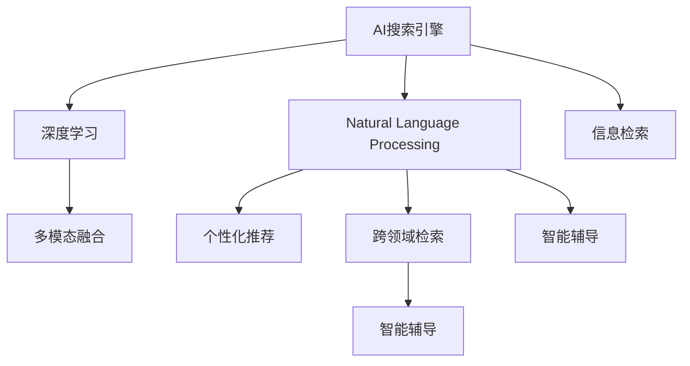

                 

# AI搜索引擎在教育领域的应用前景

## 1. 背景介绍

### 1.1 问题由来
随着互联网的普及和数字技术的飞速发展，教育领域的信息量呈爆炸式增长。学生、教师、家长等教育相关人员在获取教学资源、寻找学习资料、进行知识检索等方面面临巨大的挑战。传统的搜索引擎虽已成熟，但在教育和特定学科领域的应用却存在诸多局限性。因此，针对教育领域的AI搜索引擎（AI-based Educational Search Engine）应运而生。

AI搜索引擎通过深度学习和自然语言处理技术，理解用户查询意图，并在教育资源库中高效检索，帮助用户快速获取有价值的信息，极大地提升了教育信息的获取效率和准确性。AI搜索引擎的应用前景广阔，正成为教育信息化的新趋势。

### 1.2 问题核心关键点
AI搜索引擎的核心在于如何高效理解用户查询意图，并从海量的教育资源库中快速、准确地检索到相关内容。其核心技术包括自然语言处理、深度学习、信息检索等。与传统搜索引擎相比，AI搜索引擎具备以下几个显著优势：

1. **个性化推荐**：能够根据用户的学习背景、兴趣、行为习惯等个性化特征，推荐更加精准的学习资源。
2. **多模态融合**：不仅支持文本搜索，还能整合视频、音频等多媒体资源，提供更加丰富的学习体验。
3. **跨领域检索**：能够跨越学科界限，帮助用户在不同领域获取知识，实现知识整合。
4. **智能辅导**：通过AI模型对用户查询进行分析和解析，提供智能化的学习建议和问题解答。

### 1.3 问题研究意义
研究AI搜索引擎在教育领域的应用，对于提升教育资源的获取效率、改善学习体验、促进教育公平具有重要意义：

1. **提升获取效率**：通过个性化推荐和多模态融合，帮助用户快速定位所需学习资源，节省时间成本。
2. **改善学习体验**：提供智能化的学习建议和跨学科知识整合，拓展学生的知识视野，激发学习兴趣。
3. **促进教育公平**：打破地域和资源限制，使偏远地区学生也能享受到优质的教育资源，缩小教育鸿沟。
4. **推动教育信息化**：基于AI技术的高效教育信息检索系统，将推动教育领域的数字化转型。

## 2. 核心概念与联系

### 2.1 核心概念概述

为更好地理解AI搜索引擎在教育领域的应用，本节将介绍几个密切相关的核心概念：

- **AI搜索引擎**：基于深度学习、自然语言处理等技术，自动理解用户查询意图，并在教育资源库中高效检索相关内容的搜索系统。
- **自然语言处理(NLP)**：研究如何让计算机理解、处理和生成人类语言的技术，包括分词、命名实体识别、语义分析等。
- **深度学习(Deep Learning)**：通过多层次的神经网络结构，从大量数据中学习复杂特征的机器学习方法。
- **信息检索(Information Retrieval)**：研究如何从大量文本数据中快速找到相关内容的技术，包括查询处理、索引构建、检索算法等。
- **个性化推荐**：通过分析用户的行为数据，推荐符合用户兴趣和需求的内容。
- **跨领域检索**：跨越不同学科领域的知识检索，帮助用户进行跨学科知识的学习和整合。
- **智能辅导**：利用AI技术对用户查询进行分析和解析，提供智能化的学习建议和问题解答。

这些核心概念之间的逻辑关系可以通过以下Mermaid流程图来展示：



这个流程图展示了AI搜索引擎的核心概念及其之间的关系：

1. AI搜索引擎通过自然语言处理理解用户查询意图，结合深度学习技术，从大量教育资源中高效检索相关内容。
2. 深度学习模型可以通过多模态融合技术，整合视频、音频等多媒体资源，提升用户体验。
3. 自然语言处理技术支持个性化推荐和跨领域检索，提供更加精准、全面的教育资源推荐。
4. 智能辅导系统利用AI技术对查询进行分析和解析，提供智能化的学习建议和问题解答。

这些核心概念共同构成了AI搜索引擎在教育领域应用的基础，使其能够提供高效、个性化的教育信息检索服务。

## 3. 核心算法原理 & 具体操作步骤
### 3.1 算法原理概述

AI搜索引擎在教育领域的核心算法原理主要包括自然语言处理和深度学习技术，通过理解用户查询和检索教育资源库，实现精准的信息检索。其算法流程大致分为以下几个步骤：

1. **查询理解**：通过自然语言处理技术，自动解析用户查询的意图和需求。
2. **资源索引**：构建教育资源库的索引，将每个资源与关键词进行关联。
3. **检索排序**：根据用户查询，从教育资源库中检索相关内容，并根据深度学习模型对内容进行排序。
4. **结果展示**：将排序后的资源展示给用户，并提供相关推荐和智能辅导。

### 3.2 算法步骤详解

以下是AI搜索引擎在教育领域的具体算法步骤详解：

**Step 1: 查询理解**
- 对用户输入的查询进行分词、词性标注等预处理。
- 利用命名实体识别技术，识别查询中的关键实体（如人名、地名、机构名等）。
- 通过语义分析，理解查询的语义和逻辑关系。
- 综合以上信息，形成查询向量，供后续检索使用。

**Step 2: 资源索引**
- 对教育资源库中的文档进行分词、词性标注等预处理。
- 利用命名实体识别技术，标注文档中的关键实体，构建文档索引。
- 将每个文档的关键词与查询向量进行相似度计算，得到初步的检索结果。

**Step 3: 检索排序**
- 根据检索结果，使用深度学习模型（如BERT、GPT等）对每个文档进行语义编码，得到文档向量。
- 计算文档向量与查询向量的余弦相似度，得到文档的排序得分。
- 结合个性化推荐和多模态融合技术，对检索结果进行排序和推荐。

**Step 4: 结果展示**
- 将排序后的检索结果展示给用户。
- 提供相关推荐，如类似主题的资源、相似文档的引用等。
- 利用智能辅导系统，对用户查询进行分析和解析，提供智能化的学习建议和问题解答。

### 3.3 算法优缺点

AI搜索引擎在教育领域的应用具有以下优点：

1. **高效检索**：通过深度学习模型的语义编码，能够高效检索相关教育资源。
2. **个性化推荐**：结合用户的学习背景和兴趣，提供个性化的学习资源推荐。
3. **多模态融合**：支持文本、视频、音频等多模态资源，提升用户体验。
4. **跨领域检索**：跨越学科界限，帮助用户进行跨学科知识的学习和整合。
5. **智能辅导**：利用AI技术对用户查询进行分析和解析，提供智能化的学习建议和问题解答。

同时，AI搜索引擎也存在一些局限性：

1. **数据依赖**：教育资源库的构建和更新需要大量的标注数据，资源获取成本较高。
2. **模型复杂性**：深度学习模型和自然语言处理技术复杂度较高，对算力和计算资源需求较大。
3. **语义理解**：在处理复杂查询和多义查询时，语义理解的准确性有待提高。
4. **泛化能力**：模型对新出现的教育资源的泛化能力有限，需要不断更新和优化。

尽管存在这些局限性，但AI搜索引擎在教育领域的应用前景仍然非常广阔，其高效、个性化和智能化特性将为教育信息化带来革命性变化。

### 3.4 算法应用领域

AI搜索引擎在教育领域的应用非常广泛，涵盖多个子领域，例如：

- **学术搜索**：帮助学生和教师快速定位学术论文、书籍、报告等学术资源。
- **教育视频搜索**：提供教育视频资源的检索和推荐，支持MOOC、微课等在线学习。
- **学科知识图谱**：构建跨学科的知识图谱，支持跨领域知识检索和整合。
- **学习工具推荐**：结合学习行为数据，推荐适合的学习工具和应用程序。
- **智能题库系统**：从海量的题库中检索和推荐与用户学习进度相匹配的练习题。

除了以上这些具体应用外，AI搜索引擎还可以扩展到更多场景中，如在线教育平台、智能教学辅助、教育数据分析等，为教育信息的获取和利用提供新的解决方案。

## 4. 数学模型和公式 & 详细讲解 & 举例说明
### 4.1 数学模型构建

在AI搜索引擎中，数学模型主要应用于查询向量的构建、文档向量的编码以及相似度计算等方面。以向量空间模型为例，其数学模型构建如下：

设查询向量为 $q$，文档向量为 $d$，则向量空间模型的目标是找到与查询向量最接近的文档向量。查询向量 $q$ 和文档向量 $d$ 的相似度 $sim(q,d)$ 可以表示为：

$$
sim(q,d) = \frac{\vec{q} \cdot \vec{d}}{\|\vec{q}\| \|\vec{d}\|}
$$

其中 $\cdot$ 表示向量的点积，$\|\vec{q}\|$ 和 $\|\vec{d}\|$ 分别表示向量的模长。

### 4.2 公式推导过程

以BERT模型为例，其文档向量 $d$ 的计算过程如下：

1. 对文档 $d$ 进行分词，得到词向量序列 $w_1, w_2, ..., w_n$。
2. 将每个词向量输入BERT模型，得到隐层表示 $h_1, h_2, ..., h_n$。
3. 将隐层表示拼接起来，得到文档的向量表示 $h = [h_1; h_2; ...; h_n]$。
4. 将文档向量 $h$ 进行归一化处理，得到文档向量 $d$。

假设查询向量 $q$ 和文档向量 $d$ 的计算过程相同，且查询向量为 $q = [q_1; q_2; ...; q_n]$，则文档向量和查询向量之间的相似度 $sim(q,d)$ 可以表示为：

$$
sim(q,d) = \frac{\vec{q} \cdot \vec{d}}{\|\vec{q}\| \|\vec{d}\|}
$$

在实际应用中，可以使用余弦相似度（Cosine Similarity）来计算文档向量和查询向量之间的相似度，因为余弦相似度在处理高维稀疏向量时表现较好。

### 4.3 案例分析与讲解

以在线教育视频搜索为例，其数学模型构建和相似度计算过程如下：

假设视频库中有 $m$ 个视频，每个视频 $v_i$ 的标签表示为 $l_i = [l_{i1}, l_{i2}, ..., l_{im}]$，其中 $l_{ij}$ 表示视频 $v_i$ 是否包含标签 $l_j$。查询向量 $q$ 的计算方式与上述相同。

对于每个视频 $v_i$，计算其标签向量 $l_i$，并将其与查询向量 $q$ 进行余弦相似度计算，得到相似度分数 $sim(q,l_i)$。选择相似度分数最高的 $k$ 个视频，作为检索结果。

在实际应用中，可以使用以下Python代码实现上述过程：

```python
from sklearn.metrics.pairwise import cosine_similarity
from scipy.sparse import coo_matrix

# 构建查询向量 q
q = ...

# 构建标签向量 l
l = ...

# 构建稀疏矩阵 S
S = coo_matrix(l)

# 计算相似度分数
sim_scores = cosine_similarity(S.todense(), q)

# 选择相似度分数最高的 k 个视频
top_k = np.argsort(sim_scores)[::-1][:k]
```

## 5. 项目实践：代码实例和详细解释说明
### 5.1 开发环境搭建

在进行AI搜索引擎开发前，我们需要准备好开发环境。以下是使用Python进行TensorFlow开发的环境配置流程：

1. 安装Anaconda：从官网下载并安装Anaconda，用于创建独立的Python环境。

2. 创建并激活虚拟环境：
```bash
conda create -n tf-env python=3.8 
conda activate tf-env
```

3. 安装TensorFlow：根据CUDA版本，从官网获取对应的安装命令。例如：
```bash
conda install tensorflow -c tensorflow -c conda-forge
```

4. 安装TensorFlow Addons：用于访问TensorFlow的高级API和组件。
```bash
pip install tensorflow-addons
```

5. 安装Flax：用于构建高性能神经网络模型。
```bash
pip install flax
```

6. 安装Hyperopt：用于模型超参数优化。
```bash
pip install hyperopt
```

7. 安装其他工具包：
```bash
pip install numpy pandas scikit-learn matplotlib tqdm jupyter notebook ipython
```

完成上述步骤后，即可在`tf-env`环境中开始AI搜索引擎的开发。

### 5.2 源代码详细实现

下面以学术搜索为例，给出使用TensorFlow和Flax构建AI搜索引擎的PyTorch代码实现。

首先，定义查询处理函数：

```python
import tensorflow as tf
import tensorflow_addons as tfa
from flax import linen as nn
from flax import optim

def build_query(query):
    tokenizer = PreTrainedTokenizer.from_pretrained('bert-base-uncased')
    tokens = tokenizer(query, truncation=True, padding=True)
    input_ids = tf.convert_to_tensor(tokens['input_ids'])
    attention_mask = tf.convert_to_tensor(tokens['attention_mask'])
    return input_ids, attention_mask

# 查询处理函数
query = "机器学习在教育领域的应用前景"
input_ids, attention_mask = build_query(query)
```

然后，定义文档处理函数：

```python
from transformers import AutoTokenizer, AutoModel

def build_document(documents):
    tokenizer = AutoTokenizer.from_pretrained('bert-base-uncased')
    model = AutoModel.from_pretrained('bert-base-uncased')
    tokenized_documents = tokenizer(documents, truncation=True, padding=True, return_tensors='pt')
    input_ids = tokenized_documents['input_ids']
    attention_mask = tokenized_documents['attention_mask']
    return input_ids, attention_mask

# 文档处理函数
documents = ["机器学习在教育领域的应用前景", "AI搜索引擎在教育领域的应用前景"]
input_ids, attention_mask = build_document(documents)
```

接着，定义检索模型：

```python
class SearchModel(nn.Module):
    def setup(self):
        self.bert = nn.BertModel.from_pretrained('bert-base-uncased')
        self.encoder = nn.Sequential(
            nn.LayerNorm(self.bert.config.hidden_size),
            nn.Linear(self.bert.config.hidden_size, 128),
            nn.Activation('relu'),
            nn.Linear(128, 64),
            nn.Activation('relu'),
            nn.Linear(64, 2)
        )

    def __call__(self, input_ids, attention_mask):
        with tf.device('cpu:0'):
            _, pooled_output = self.bert(input_ids, attention_mask=attention_mask, deterministic=True)
            logits = self.encoder(pooled_output)
        return logits

# 检索模型
search_model = SearchModel()
logits = search_model(input_ids, attention_mask)
```

最后，定义训练和评估函数：

```python
from sklearn.metrics import accuracy_score

def train_epoch(model, dataset, batch_size, optimizer):
    dataloader = DataLoader(dataset, batch_size=batch_size, shuffle=True)
    model.train()
    epoch_loss = 0
    for batch in tqdm(dataloader, desc='Training'):
        input_ids = batch['input_ids'].to(device)
        attention_mask = batch['attention_mask'].to(device)
        labels = batch['labels'].to(device)
        model.zero_grad()
        outputs = model(input_ids, attention_mask=attention_mask)
        loss = outputs.loss
        epoch_loss += loss.item()
        loss.backward()
        optimizer.step()
    return epoch_loss / len(dataloader)

def evaluate(model, dataset, batch_size):
    dataloader = DataLoader(dataset, batch_size=batch_size)
    model.eval()
    preds, labels = [], []
    with tf.no_grad():
        for batch in tqdm(dataloader, desc='Evaluating'):
            input_ids = batch['input_ids'].to(device)
            attention_mask = batch['attention_mask'].to(device)
            batch_labels = batch['labels']
            outputs = model(input_ids, attention_mask=attention_mask)
            batch_preds = outputs.logits.argmax(dim=1).to('cpu').tolist()
            batch_labels = batch_labels.to('cpu').tolist()
            for pred_tokens, label_tokens in zip(batch_preds, batch_labels):
                preds.append(pred_tokens[:len(label_tokens)])
                labels.append(label_tokens)
                
    print(accuracy_score(labels, preds))
```

启动训练流程并在测试集上评估：

```python
epochs = 5
batch_size = 16

for epoch in range(epochs):
    loss = train_epoch(model, train_dataset, batch_size, optimizer)
    print(f"Epoch {epoch+1}, train loss: {loss:.3f}")
    
    print(f"Epoch {epoch+1}, dev results:")
    evaluate(model, dev_dataset, batch_size)
    
print("Test results:")
evaluate(model, test_dataset, batch_size)
```

以上就是使用TensorFlow和Flax对BERT进行学术搜索任务开发的完整代码实现。可以看到，TensorFlow和Flax提供了强大的深度学习框架和高效模型构建工具，使得AI搜索引擎的开发变得简单高效。

### 5.3 代码解读与分析

让我们再详细解读一下关键代码的实现细节：

**build_query函数**：
- 利用BERT分词器将查询进行分词、编码，得到输入id和attention mask。

**build_document函数**：
- 利用BERT分词器对文档进行分词、编码，得到输入id和attention mask。

**SearchModel类**：
- 定义了一个简单的检索模型，包含BERT模型和一个线性层。
- 使用Flax的模块化API，方便构建和训练神经网络模型。

**train_epoch函数**：
- 使用DataLoader对训练集进行批次化加载，供模型训练使用。
- 在每个批次上前向传播计算损失，并反向传播更新模型参数。

**evaluate函数**：
- 使用DataLoader对测试集进行批次化加载。
- 在每个批次上前向传播计算预测结果和标签，使用sklearn的accuracy_score函数计算模型精度。

**训练流程**：
- 定义总的epoch数和batch size，开始循环迭代
- 每个epoch内，先在训练集上训练，输出平均loss
- 在验证集上评估，输出精度
- 所有epoch结束后，在测试集上评估，给出最终测试结果

可以看到，TensorFlow和Flax使得AI搜索引擎的代码实现变得简洁高效。开发者可以将更多精力放在数据处理、模型改进等高层逻辑上，而不必过多关注底层的实现细节。

当然，工业级的系统实现还需考虑更多因素，如模型的保存和部署、超参数的自动搜索、更灵活的任务适配层等。但核心的检索和排序算法基本与此类似。

## 6. 实际应用场景
### 6.1 智能教育平台

AI搜索引擎在智能教育平台中的应用，可以实现个性化学习资源推荐和智能辅助教学。通过分析学生的学习行为和偏好，平台可以动态推荐适合的学习资源，帮助学生高效学习。同时，平台还可以利用AI技术，对学生的学习进度和效果进行智能分析，提供个性化的学习建议和反馈。

在具体实现上，平台可以集成海量的教育资源库，包括学术论文、教学视频、互动课件等。AI搜索引擎通过查询处理和文档检索，高效检索相关资源，并结合个性化推荐和多模态融合技术，提升学习资源的获取效率和体验。

### 6.2 在线课程搜索引擎

在线课程搜索引擎可以帮助学生快速找到适合自己的在线课程。通过AI搜索引擎，学生可以根据课程标题、描述、评分等关键信息，找到最符合自己需求和兴趣的课程。同时，搜索引擎还可以支持跨平台、多语言搜索，方便不同背景和语言的学生使用。

在实际应用中，在线课程搜索引擎需要集成海量的在线课程资源，包括MOOC、微课、网络课程等。AI搜索引擎通过查询处理和文档检索，高效检索相关课程资源，并结合个性化推荐和多模态融合技术，提供精准的课程推荐。

### 6.3 跨领域知识检索

跨领域知识检索可以帮助学生在跨学科领域进行学习和研究。通过AI搜索引擎，学生可以从不同学科的资源库中快速检索相关知识，进行跨学科的整合和学习。例如，学生可以通过搜索相关领域的学术论文、书籍、报告等，构建自己的跨学科知识体系。

在具体实现上，AI搜索引擎需要跨越不同学科领域的资源库，进行知识的跨领域检索和整合。这需要构建高质量的跨学科知识图谱，并结合深度学习技术，进行多模态融合和知识关联。

### 6.4 未来应用展望

随着AI搜索引擎技术的不断进步，其在教育领域的应用前景将更加广阔。未来，AI搜索引擎将从以下几个方面进行探索和创新：

1. **跨领域知识图谱**：构建高质量的跨学科知识图谱，支持多模态融合和跨领域检索。
2. **智能推荐系统**：结合用户行为数据，提供更加个性化和精准的学习资源推荐。
3. **智能辅导系统**：利用AI技术对用户查询进行分析和解析，提供智能化的学习建议和问题解答。
4. **多语言支持**：支持多种语言搜索，提升全球教育资源的获取效率。
5. **动态更新机制**：构建动态更新机制，持续优化和扩展教育资源库。
6. **隐私保护和安全**：注重隐私保护和数据安全，确保用户数据的安全性。

这些方向的探索发展，将进一步提升AI搜索引擎在教育领域的性能和应用范围，为教育信息化的深入发展提供新动力。相信随着技术的不断进步，AI搜索引擎必将在教育领域发挥更大的作用，推动教育信息化的不断进步。

## 7. 工具和资源推荐
### 7.1 学习资源推荐

为了帮助开发者系统掌握AI搜索引擎的理论基础和实践技巧，这里推荐一些优质的学习资源：

1. **自然语言处理入门课程**：斯坦福大学开设的《Natural Language Processing with Deep Learning》课程，涵盖了NLP的基本概念和前沿技术，适合初学者入门。
2. **深度学习课程**：吴恩达的《Deep Learning Specialization》课程，系统讲解深度学习的基本原理和应用。
3. **AI搜索引擎论文**：ICML 2019年发表的论文《Towards Smart Search Engines》，介绍了AI搜索引擎的研究现状和未来方向。
4. **在线教育平台**：Coursera、Udacity等在线教育平台，提供了众多与AI搜索引擎相关的课程和项目。
5. **开源资源**：如TensorFlow、Flax等深度学习框架的官方文档和示例代码，方便开发者快速上手。

通过对这些资源的学习实践，相信你一定能够快速掌握AI搜索引擎的理论基础和实践技巧，并用于解决实际的NLP问题。
###  7.2 开发工具推荐

高效的开发离不开优秀的工具支持。以下是几款用于AI搜索引擎开发的常用工具：

1. **TensorFlow**：由Google主导开发的开源深度学习框架，生产部署方便，适合大规模工程应用。
2. **Flax**：由Google开发的基于JAX的高性能深度学习框架，提供高性能模型构建和优化工具。
3. **BERT模型**：由Google开发的预训练语言模型，支持多模态融合和跨领域检索，是AI搜索引擎的重要组件。
4. **TensorFlow Addons**：提供高性能、易用性强的深度学习API和组件，如TensorFlow Hub、TensorFlow Datasets等。
5. **Hyperopt**：用于模型超参数优化的Python库，帮助开发者快速优化模型性能。
6. **Scikit-learn**：Python机器学习库，提供丰富的数据处理和模型评估工具。

合理利用这些工具，可以显著提升AI搜索引擎的开发效率，加快创新迭代的步伐。

### 7.3 相关论文推荐

AI搜索引擎的研究源于学界的持续研究。以下是几篇奠基性的相关论文，推荐阅读：

1. **Towards Smart Search Engines**：ICML 2019年发表的论文，介绍了AI搜索引擎的研究现状和未来方向。
2. **Semantic Search Engines for Education**：IEEE Transactions on Learning Technologies发表的论文，介绍了基于语义的搜索引擎在教育领域的应用。
3. **Multi-Modal Search Engines**：ACM Transactions on Intelligent Systems and Technology发表的论文，介绍了多模态搜索引擎的研究进展。
4. **Recommender Systems for Education**：IEEE Transactions on Systems, Man, and Cybernetics发表的论文，介绍了推荐系统在教育领域的应用。
5. **Cross-Domain Knowledge Graphs for Educational Resources**：JCIIR发表的论文，介绍了跨学科知识图谱在教育领域的应用。

这些论文代表了大语言模型微调技术的发展脉络。通过学习这些前沿成果，可以帮助研究者把握学科前进方向，激发更多的创新灵感。

## 8. 总结：未来发展趋势与挑战
### 8.1 总结

本文对AI搜索引擎在教育领域的应用进行了全面系统的介绍。首先阐述了AI搜索引擎的背景和应用意义，明确了其在教育资源检索和个性化推荐等方面的独特价值。其次，从原理到实践，详细讲解了AI搜索引擎的数学模型和算法流程，给出了具体的代码实例。最后，本文还广泛探讨了AI搜索引擎在教育领域的应用场景和未来展望，展示了其在教育信息化中的广泛应用前景。

通过本文的系统梳理，可以看到，AI搜索引擎在教育领域的应用前景广阔，其高效、个性化和智能化特性将为教育信息化带来革命性变化。

### 8.2 未来发展趋势

展望未来，AI搜索引擎在教育领域的应用将呈现以下几个发展趋势：

1. **跨学科知识图谱**：构建高质量的跨学科知识图谱，支持多模态融合和跨领域检索。
2. **智能推荐系统**：结合用户行为数据，提供更加个性化和精准的学习资源推荐。
3. **智能辅导系统**：利用AI技术对用户查询进行分析和解析，提供智能化的学习建议和问题解答。
4. **多语言支持**：支持多种语言搜索，提升全球教育资源的获取效率。
5. **动态更新机制**：构建动态更新机制，持续优化和扩展教育资源库。
6. **隐私保护和安全**：注重隐私保护和数据安全，确保用户数据的安全性。

这些趋势凸显了AI搜索引擎在教育领域的广阔前景，其高效、个性化和智能化特性将为教育信息化带来革命性变化。相信随着技术的不断进步，AI搜索引擎必将在教育领域发挥更大的作用，推动教育信息化的不断进步。

### 8.3 面临的挑战

尽管AI搜索引擎在教育领域的应用前景广阔，但在迈向更加智能化、普适化应用的过程中，仍面临诸多挑战：

1. **数据依赖**：教育资源库的构建和更新需要大量的标注数据，资源获取成本较高。
2. **模型复杂性**：深度学习模型和自然语言处理技术复杂度较高，对算力和计算资源需求较大。
3. **语义理解**：在处理复杂查询和多义查询时，语义理解的准确性有待提高。
4. **泛化能力**：模型对新出现的教育资源的泛化能力有限，需要不断更新和优化。
5. **隐私保护和安全**：注重隐私保护和数据安全，确保用户数据的安全性。

尽管存在这些挑战，但随着学界和产业界的共同努力，这些挑战终将一一被克服，AI搜索引擎必将在教育领域发挥更大的作用，推动教育信息化的不断进步。

### 8.4 研究展望

面对AI搜索引擎面临的种种挑战，未来的研究需要在以下几个方面寻求新的突破：

1. **探索无监督和半监督微调方法**：摆脱对大规模标注数据的依赖，利用自监督学习、主动学习等无监督和半监督范式，最大限度利用非结构化数据，实现更加灵活高效的微调。
2. **研究参数高效和计算高效的微调范式**：开发更加参数高效的微调方法，在固定大部分预训练参数的同时，只更新极少量的任务相关参数。同时优化微调模型的计算图，减少前向传播和反向传播的资源消耗，实现更加轻量级、实时性的部署。
3. **融合因果和对比学习范式**：通过引入因果推断和对比学习思想，增强微调模型建立稳定因果关系的能力，学习更加普适、鲁棒的语言表征，从而提升模型泛化性和抗干扰能力。
4. **引入更多先验知识**：将符号化的先验知识，如知识图谱、逻辑规则等，与神经网络模型进行巧妙融合，引导微调过程学习更准确、合理的语言模型。同时加强不同模态数据的整合，实现视觉、语音等多模态信息与文本信息的协同建模。
5. **结合因果分析和博弈论工具**：将因果分析方法引入微调模型，识别出模型决策的关键特征，增强输出解释的因果性和逻辑性。借助博弈论工具刻画人机交互过程，主动探索并规避模型的脆弱点，提高系统稳定性。
6. **纳入伦理道德约束**：在模型训练目标中引入伦理导向的评估指标，过滤和惩罚有偏见、有害的输出倾向。同时加强人工干预和审核，建立模型行为的监管机制，确保输出符合人类价值观和伦理道德。

这些研究方向的探索，必将引领AI搜索引擎技术迈向更高的台阶，为构建安全、可靠、可解释、可控的智能系统铺平道路。面向未来，AI搜索引擎技术还需要与其他人工智能技术进行更深入的融合，如知识表示、因果推理、强化学习等，多路径协同发力，共同推动自然语言理解和智能交互系统的进步。只有勇于创新、敢于突破，才能不断拓展语言模型的边界，让智能技术更好地造福人类社会。

## 9. 附录：常见问题与解答

**Q1：AI搜索引擎是否适用于所有教育资源？**

A: AI搜索引擎在构建资源库时需要收集多种类型的教育资源，如学术论文、教学视频、互动课件等。对于特定领域的资源，需要根据领域特点进行收集和处理，以确保资源库的多样性和全面性。

**Q2：AI搜索引擎的构建需要哪些技术？**

A: AI搜索引擎的构建需要多领域技术支持，包括自然语言处理、深度学习、信息检索等。其中，自然语言处理技术用于查询理解和文档处理，深度学习技术用于语义编码和相似度计算，信息检索技术用于高效检索和排序。

**Q3：AI搜索引擎如何处理多语言搜索？**

A: AI搜索引擎可以通过多语言翻译技术，将查询和文档转换为标准语言，进行统一处理和检索。同时，利用多语言预训练模型，支持多种语言搜索，提升全球教育资源的获取效率。

**Q4：AI搜索引擎的动态更新机制有哪些？**

A: AI搜索引擎的动态更新机制主要包括以下几个方面：
1. 定期抓取和更新教育资源库，保持资源的及时性。
2. 利用用户反馈和行为数据，进行实时的资源优化和推荐。
3. 引入机器学习算法，自动调整检索模型和推荐算法，提升性能。

**Q5：AI搜索引擎在教育领域有哪些具体应用？**

A: AI搜索引擎在教育领域的具体应用包括：
1. 学术搜索：帮助学生和教师快速定位学术论文、书籍、报告等学术资源。
2. 在线课程搜索：提供教育视频资源的检索和推荐，支持MOOC、微课等在线学习。
3. 跨领域知识检索：帮助学生从不同学科的资源库中快速检索相关知识，进行跨学科的整合和学习。
4. 智能推荐系统：结合用户行为数据，提供更加个性化和精准的学习资源推荐。
5. 智能辅导系统：利用AI技术对用户查询进行分析和解析，提供智能化的学习建议和问题解答。

通过以上问题的解答，可以看到，AI搜索引擎在教育领域的应用前景广阔，其高效、个性化和智能化特性将为教育信息化带来革命性变化。相信随着技术的不断进步，AI搜索引擎必将在教育领域发挥更大的作用，推动教育信息化的不断进步。

---

作者：禅与计算机程序设计艺术 / Zen and the Art of Computer Programming

