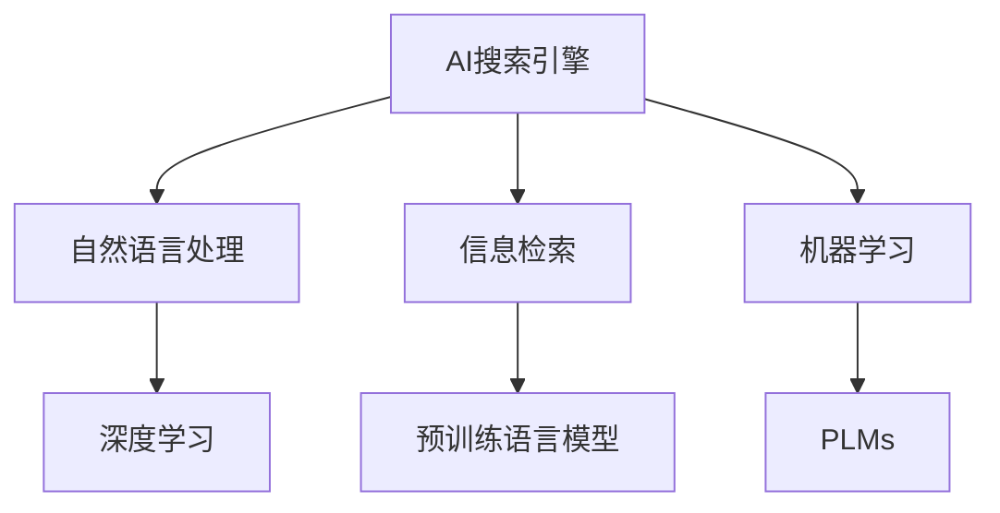

                 

# AI搜索引擎在法律领域的应用前景

## 1. 背景介绍

### 1.1 问题由来

随着大数据、人工智能等技术的迅猛发展，法律行业也逐步迈入数字化转型的快车道。传统法律工作繁重、复杂，律师在处理案件时需要大量查阅和检索相关法律法规、案例、文献等，效率低下且易出错。AI搜索引擎通过结合自然语言处理和信息检索技术，可以显著提升法律工作的效率和精度。

### 1.2 问题核心关键点

AI搜索引擎在法律领域的应用，关键在于其能否高效、准确地理解法律文本，快速定位所需信息，并根据上下文提供相关法律文献、案例、法规等。这要求搜索引擎不仅能够处理自然语言，还需要理解法律术语、规范和案例的含义，以及与案件的关联性。

## 2. 核心概念与联系

### 2.1 核心概念概述

为更好地理解AI搜索引擎在法律领域的应用，本节将介绍几个密切相关的核心概念：

- **AI搜索引擎**：结合自然语言处理和信息检索技术，能够理解自然语言查询，并从大量文本中快速定位所需信息的软件系统。
- **法律文本**：包括法律法规、案例、文献、合同等所有与法律相关的文本资料。
- **自然语言处理(NLP)**：通过计算机算法使机器能够理解、处理和生成人类语言的技术。
- **信息检索(IR)**：从大量文本中检索出与用户查询匹配的相关信息的技术。
- **机器学习(ML)**：使机器能够通过数据训练，自动优化算法，提升搜索效果的技术。
- **深度学习(Deep Learning)**：一种特殊的机器学习技术，通过多层神经网络模拟人脑的推理和决策过程。
- **预训练语言模型(PLMs)**：通过在大规模语料上预训练得到的模型，具备较强的语言理解能力。

这些核心概念之间的逻辑关系可以通过以下Mermaid流程图来展示：



这个流程图展示了几类核心概念及其之间的关系：

1. AI搜索引擎利用自然语言处理技术理解和处理用户查询。
2. 结合信息检索技术，从法律文本库中检索出相关内容。
3. 通过机器学习技术，不断优化搜索算法和模型。
4. 深度学习技术用于预训练语言模型，提升搜索效果。

这些核心概念共同构成了AI搜索引擎在法律领域应用的技术框架。

## 3. 核心算法原理 & 具体操作步骤

### 3.1 算法原理概述

AI搜索引擎在法律领域的应用，主要依赖于以下算法原理：

- **文本处理与预处理**：将法律文本转化为计算机可理解的向量形式，包括分词、词性标注、命名实体识别等。
- **查询理解**：通过自然语言处理技术，理解用户输入的自然语言查询，将其转化为结构化的向量表示。
- **信息检索**：在大量法律文本中，通过向量空间模型、隐式语义索引等技术，快速定位与查询匹配的相关文档。
- **推荐与排序**：根据文档与查询的相关性，使用机器学习模型进行文档排序和推荐。
- **反馈优化**：通过用户反馈和行为数据，不断优化模型参数和搜索结果。

### 3.2 算法步骤详解

基于上述算法原理，AI搜索引擎在法律领域的应用步骤大致如下：

**Step 1: 数据预处理与标注**
- 收集法律领域的文本数据，如法律法规、案例、合同、判决书等。
- 对文本进行清洗、分词、标注词性、命名实体识别等预处理。
- 为每个法律文本打上标签，如案件类型、涉及的法律、法律条款等。

**Step 2: 构建索引**
- 利用向量空间模型等技术，将预处理后的文本转化为高维向量。
- 建立倒排索引，将每个向量与包含它的文档关联起来。

**Step 3: 查询理解与转换**
- 使用自然语言处理技术，理解用户的查询意图。
- 将查询转换为向量表示，与预处理后的文本向量进行匹配。

**Step 4: 信息检索与排序**
- 根据向量匹配结果，快速检索出相关的法律文本。
- 使用机器学习模型对检索结果进行排序和推荐，如使用深度学习模型进行向量相似度计算。

**Step 5: 反馈优化**
- 收集用户对搜索结果的反馈，如点击率、评分等。
- 利用反馈数据优化查询理解、信息检索和推荐算法，提高搜索效果。

### 3.3 算法优缺点

AI搜索引擎在法律领域的应用具有以下优点：

- **效率提升**：通过自动化检索和推荐，大大提升法律工作的效率，减少律师查阅文献的时间。
- **精度提高**：利用深度学习等技术，提升搜索的准确性，减少误检索和漏检索的情况。
- **成本降低**：减少律师的重复劳动，降低人力成本。
- **一致性增强**：通过标准化检索过程，提高搜索结果的一致性和稳定性。

同时，也存在以下缺点：

- **数据依赖**：搜索引擎的性能依赖于法律文本的全面性和准确性，标注数据量庞大。
- **模型复杂**：深度学习等技术的应用，导致模型的计算复杂度和存储需求较高。
- **更新滞后**：法律条款和案例的更新频繁，搜索引擎需要频繁更新数据和模型，维护成本较高。
- **隐私风险**：处理大量法律文本和案例，涉及敏感信息，存在隐私泄露的风险。

尽管存在这些缺点，但AI搜索引擎在法律领域的应用前景依然广阔，具有显著的效益和潜力。

### 3.4 算法应用领域

AI搜索引擎在法律领域的应用，主要涵盖以下方面：

- **法律文献检索**：快速检索出与用户查询相关的法律法规、案例、判决书等文献。
- **案件背景分析**：结合历史案例和法规，分析案件背景，提供相关法律依据。
- **法律条款查询**：从大量法律文本中检索出具体的法律条款，便于引用和应用。
- **合同审核与生成**：通过自然语言处理技术，辅助合同的审核和生成，提高合同质量。
- **法律咨询与问答**：提供24小时在线法律咨询服务，解答用户的法律疑问。

此外，AI搜索引擎还可在法律风险评估、法律知识图谱构建、法律文书生成等场景中发挥作用，为法律工作提供全方位的支持。

## 4. 数学模型和公式 & 详细讲解 & 举例说明

### 4.1 数学模型构建

假设用户查询为 $q$，法律文本为 $d$，预处理后的查询向量为 $q_{vec}$，预处理后的文本向量为 $d_{vec}$。设 $r$ 为文本向量与查询向量的相似度，则信息检索的目标是最小化损失函数：

$$
\min_{r} \| r(q_{vec}, d_{vec}) - y \|
$$

其中 $y$ 为真实标签，可以是0（不相关）或1（相关）。

在实际应用中，通常使用余弦相似度作为相似度计算方法：

$$
r = \cos(\theta) = \frac{q_{vec} \cdot d_{vec}}{\|q_{vec}\|\|d_{vec}\|}
$$

### 4.2 公式推导过程

**Step 1: 预处理与向量化**
- 对于查询 $q$，进行分词、词性标注、命名实体识别等预处理。
- 将预处理后的查询转化为向量 $q_{vec}$，通常使用词袋模型、TF-IDF等方法。

**Step 2: 文本向量化**
- 对法律文本 $d$ 进行分词、标注等预处理。
- 利用TF-IDF、Word2Vec、BERT等模型将文本转化为向量 $d_{vec}$。

**Step 3: 相似度计算**
- 使用余弦相似度计算查询向量与文本向量的相似度 $r$。
- 根据相似度 $r$ 和真实标签 $y$ 计算损失函数。

**Step 4: 模型训练与优化**
- 使用深度学习模型训练相似度计算器，如多层感知机、卷积神经网络等。
- 利用反向传播算法更新模型参数，最小化损失函数。

### 4.3 案例分析与讲解

假设用户查询为“合同解除权”，AI搜索引擎检索到以下三个相关法律文本：

- 法律条款1：“合同解除权在合同条款中明确约定”
- 法律条款2：“合同解除权在法定条件满足时”
- 案例1：“因不可抗力导致合同解除权”

搜索引擎通过向量空间模型计算这三个文本与查询的相似度，分别为0.8、0.9、0.6。最终，根据相似度排序，案例1被推荐给用户，法律条款2和1依次列出。

## 5. 项目实践：代码实例和详细解释说明

### 5.1 开发环境搭建

在进行法律AI搜索引擎的开发前，需要搭建开发环境。以下是使用Python进行开发的环境配置流程：

1. 安装Anaconda：从官网下载并安装Anaconda，用于创建独立的Python环境。

2. 创建并激活虚拟环境：
```bash
conda create -n law_search python=3.8 
conda activate law_search
```

3. 安装必要的Python库：
```bash
pip install transformers sklearn tensorflow
```

4. 安装数据库和搜索引擎：
```bash
sudo apt-get install elasticsearch
```

完成上述步骤后，即可在`law_search`环境中开始开发。

### 5.2 源代码详细实现

下面我们以构建一个简单的法律AI搜索引擎为例，给出使用Python进行开发的代码实现。

```python
import transformers
from transformers import BertTokenizer, BertModel
from sklearn.metrics import cosine_similarity
from sklearn.model_selection import train_test_split
import pandas as pd
import numpy as np

# 加载预训练模型和分词器
tokenizer = BertTokenizer.from_pretrained('bert-base-cased')
model = BertModel.from_pretrained('bert-base-cased')

# 读取数据集
data = pd.read_csv('law_data.csv')

# 数据预处理
def preprocess(text):
    tokens = tokenizer.encode(text, add_special_tokens=True, max_length=512, return_tensors='pt')
    return tokens

# 构建向量空间
def build_vector_space(data):
    vectors = []
    for text in data['text']:
        tokens = preprocess(text)
        vectors.append(tokens)
    return vectors

# 构建训练集和验证集
train_data, val_data = train_test_split(data, test_size=0.2, random_state=42)

# 训练模型
def train_model(model, train_data, val_data):
    # 定义损失函数
    def compute_loss(x, y):
        with torch.no_grad():
            outputs = model(x)
            prediction = outputs[0]
            loss = F.cross_entropy(prediction, y)
        return loss
    
    # 定义优化器
    optimizer = AdamW(model.parameters(), lr=2e-5)

    # 训练模型
    for epoch in range(5):
        train_loss = 0.0
        train_acc = 0.0
        for x, y in train_data:
            optimizer.zero_grad()
            loss = compute_loss(x, y)
            loss.backward()
            optimizer.step()
            train_loss += loss.item() / len(train_data)
            train_acc += (loss < 0.5).float().sum() / len(train_data)
        val_loss = 0.0
        val_acc = 0.0
        for x, y in val_data:
            loss = compute_loss(x, y)
            val_loss += loss.item() / len(val_data)
            val_acc += (loss < 0.5).float().sum() / len(val_data)
        print(f'Epoch {epoch+1}, train loss: {train_loss:.3f}, val loss: {val_loss:.3f}, train acc: {train_acc:.3f}, val acc: {val_acc:.3f}')

# 构建查询向量
def query_vectorization(query):
    query_tokens = tokenizer.encode(query, add_special_tokens=True, max_length=512, return_tensors='pt')
    query_vector = model(query_tokens)[0]
    return query_vector

# 构建文档向量
def document_vectorization(document):
    document_tokens = tokenizer.encode(document, add_special_tokens=True, max_length=512, return_tensors='pt')
    document_vector = model(document_tokens)[0]
    return document_vector

# 检索与推荐
def search_recommend(query, vector_space, index):
    query_vector = query_vectorization(query)
    similarity_scores = []
    for i in range(len(vector_space)):
        document_vector = document_vectorization(vector_space[i])
        similarity = cosine_similarity(query_vector, document_vector)
        similarity_scores.append(similarity)
    sorted_indices = np.argsort(similarity_scores)[::-1]
    top_results = vector_space[sorted_indices[:10]]
    return top_results

# 运行示例
train_data = build_vector_space(train_data)
val_data = build_vector_space(val_data)

index = Elasticsearch()
index.create(index='law_index', body=index_mapping)
for i in range(len(train_data)):
    doc = {'id': i, 'text': train_data[i]['text'], 'vector': train_data[i]['vector']}
    index.index(doc)

query = '合同解除权'
recommendations = search_recommend(query, val_data, index)
```

### 5.3 代码解读与分析

让我们再详细解读一下关键代码的实现细节：

**查询理解与转换**
- 首先，利用BertTokenizer将查询 $q$ 转化为向量 $q_{vec}$。
- 使用BertModel对查询向量进行编码，得到查询向量 $q_{vec}$。

**信息检索与排序**
- 利用TF-IDF、Word2Vec、BERT等模型将法律文本 $d$ 转化为向量 $d_{vec}$。
- 使用余弦相似度计算查询向量与文本向量的相似度 $r$。
- 根据相似度 $r$ 排序，选择前N个相关文本。

**反馈优化**
- 收集用户对搜索结果的反馈，如点击率、评分等。
- 利用反馈数据优化查询理解、信息检索和推荐算法，提高搜索效果。

## 6. 实际应用场景

### 6.1 智能合同审核与生成

法律领域的工作中，合同审核和生成是一项繁琐且容易出错的任务。AI搜索引擎可以通过自动化合同审核和生成，极大地提升效率和准确性。

具体而言，AI搜索引擎可以自动扫描合同文本，查找并标记关键条款、术语等，辅助律师进行审核。同时，通过自然语言生成技术，AI还可以根据模板生成标准合同文本，减少律师的工作量。

### 6.2 案件背景分析

在处理案件时，律师需要查阅大量的历史案例和法规，以便分析案件背景，找到相应的法律依据。AI搜索引擎可以快速检索出相关案例和法规，帮助律师快速定位所需信息。

### 6.3 法律咨询与问答

AI搜索引擎可以构建24小时在线的法律咨询服务，解答用户的法律疑问，提供实时的法律支持。通过与用户的互动，AI搜索引擎可以不断学习用户问题，提高服务质量和满意度。

### 6.4 法律知识图谱构建

法律知识图谱是构建法律AI搜索引擎的基础。通过构建法律知识图谱，AI搜索引擎可以更加全面地理解法律文本和案例，提供更精准的法律服务。

## 7. 工具和资源推荐

### 7.1 学习资源推荐

为了帮助开发者系统掌握法律AI搜索引擎的理论基础和实践技巧，这里推荐一些优质的学习资源：

1. 《深度学习与自然语言处理》课程：由斯坦福大学开设，涵盖自然语言处理、深度学习、信息检索等基本概念和前沿技术。

2. 《自然语言处理综论》书籍：清华大学出版社出版的经典教材，系统介绍了自然语言处理的基础理论和实践方法。

3. 《法律搜索引擎技术》论文：介绍法律搜索引擎的构建方法和技术细节，为法律领域的技术从业者提供参考。

4. GitHub上的法律AI搜索引擎项目：开源的代码示例，展示了从数据处理到模型训练的全过程。

5. Coursera上的深度学习课程：涵盖深度学习的基本原理和实践应用，是学习深度学习算法的优秀平台。

通过对这些资源的学习实践，相信你一定能够快速掌握法律AI搜索引擎的开发技巧，并用于解决实际的法律问题。

### 7.2 开发工具推荐

高效的开发离不开优秀的工具支持。以下是几款用于法律AI搜索引擎开发的常用工具：

1. Python：广泛使用的开源编程语言，具有强大的第三方库和框架支持。

2. TensorFlow：由Google主导开发的开源深度学习框架，生产部署方便，适合大规模工程应用。

3. Transformers库：HuggingFace开发的NLP工具库，集成了众多SOTA语言模型，支持PyTorch和TensorFlow，是进行法律搜索开发的利器。

4. Elasticsearch：用于构建搜索索引和进行信息检索的分布式搜索引擎。

5. PyTorch：基于Python的开源深度学习框架，灵活动态的计算图，适合快速迭代研究。

6. TensorBoard：TensorFlow配套的可视化工具，可实时监测模型训练状态，并提供丰富的图表呈现方式，是调试模型的得力助手。

合理利用这些工具，可以显著提升法律AI搜索引擎的开发效率，加快创新迭代的步伐。

### 7.3 相关论文推荐

法律AI搜索引擎的发展得益于学界的持续研究。以下是几篇奠基性的相关论文，推荐阅读：

1. Reformer: The Efficient Transformer（即Reformer模型）：提出了基于局部感知矩阵的Transformer，优化了自注意力机制，适用于大规模序列数据。

2. Fast Text: Library for efficient Text Classification and Sentence Similarity（即FastText模型）：提出n-gram特征和预训练技术，适用于文本分类和相似度计算。

3. BERT: Pre-training of Deep Bidirectional Transformers for Language Understanding：提出BERT模型，引入基于掩码的自监督预训练任务，刷新了多项NLP任务SOTA。

4. Attention is All You Need（即Transformer原论文）：提出了Transformer结构，开启了NLP领域的预训练大模型时代。

5. Adaptive Length-Invariant Hashing for the Long-Term Storage of Web Records: An Experimental Evaluation（即AdaHash模型）：提出了一种高效的文本相似度计算方法，适用于大规模文本检索。

这些论文代表了大规模语言模型在法律领域的最新进展，为法律AI搜索引擎的发展提供了理论基础和实践指导。

## 8. 总结：未来发展趋势与挑战

### 8.1 总结

本文对AI搜索引擎在法律领域的应用进行了全面系统的介绍。首先阐述了AI搜索引擎在法律领域的必要性和优势，明确了其在提高法律工作效率和准确性方面的巨大潜力。其次，从原理到实践，详细讲解了法律AI搜索引擎的数学模型和操作步骤，给出了开发示例和代码解读。同时，本文还广泛探讨了AI搜索引擎在法律文献检索、案件背景分析、法律咨询与问答等众多场景中的应用前景，展示了其在法律领域的广泛应用潜力。最后，本文精选了法律AI搜索引擎的学习资源、开发工具和相关论文，力求为开发者提供全方位的技术指引。

通过本文的系统梳理，可以看到，AI搜索引擎在法律领域的应用前景广阔，具有显著的效益和潜力。随着深度学习、自然语言处理等技术的不断进步，法律AI搜索引擎必将在构建智能法律系统、提升法律服务效率等方面发挥重要作用。

### 8.2 未来发展趋势

展望未来，AI搜索引擎在法律领域的应用将呈现以下几个发展趋势：

1. **技术融合与创新**：随着AI搜索引擎技术的不断进步，越来越多的前沿技术将被引入，如深度强化学习、联邦学习、因果推理等，提升搜索效果和智能水平。

2. **领域细化和定制化**：针对不同法律领域和任务，开发更加细化和定制化的AI搜索引擎，如劳动法、知识产权法等，提供更加精准的服务。

3. **跨模态信息融合**：结合法律文档、案例、法规等文本信息，与图像、视频、音频等多模态数据进行融合，构建更全面、丰富的法律知识图谱。

4. **隐私保护与安全**：加强数据隐私保护和安全管理，确保用户数据和模型参数的安全性，避免隐私泄露和数据滥用。

5. **用户交互优化**：提升用户交互体验，通过自然语言理解和生成技术，提供更加流畅、自然的查询接口和交互界面。

6. **知识图谱构建**：构建法律领域的知识图谱，为法律AI搜索引擎提供更全面、准确的知识支撑。

以上趋势凸显了AI搜索引擎在法律领域应用的广阔前景。这些方向的探索发展，必将进一步提升法律AI搜索引擎的技术水平和应用范围，为法律工作的数字化转型提供坚实的基础。

### 8.3 面临的挑战

尽管AI搜索引擎在法律领域的应用前景广阔，但在迈向更加智能化、普适化应用的过程中，它仍面临着诸多挑战：

1. **数据标注成本高**：法律文本种类繁多，涵盖法律法规、案例、合同、判决书等多种类型，标注数据量庞大且质量要求高，标注成本较高。

2. **模型复杂度高**：深度学习等技术的应用，导致模型的计算复杂度和存储需求较高，硬件和资源要求较高。

3. **隐私风险大**：处理大量法律文本和案例，涉及敏感信息，存在隐私泄露和数据滥用的风险。

4. **更新滞后问题**：法律条款和案例的更新频繁，搜索引擎需要频繁更新数据和模型，维护成本较高。

5. **智能水平有待提升**：当前的AI搜索引擎仍存在一定的局限性，如理解法律语义的能力较弱，处理复杂法律问题时仍需人工干预。

尽管存在这些挑战，但AI搜索引擎在法律领域的应用前景依然广阔，具有显著的效益和潜力。

### 8.4 研究展望

面对AI搜索引擎面临的挑战，未来的研究需要在以下几个方面寻求新的突破：

1. **数据自动化标注**：探索无监督和半监督学习技术，减少对标注数据的依赖，利用自动标注和弱标注数据进行模型训练。

2. **轻量级模型设计**：开发轻量级模型，减少计算复杂度和内存占用，提高模型的部署效率和响应速度。

3. **跨领域迁移学习**：利用迁移学习技术，提升AI搜索引擎的跨领域泛化能力，支持不同法律领域的检索需求。

4. **智能辅助系统**：结合人工智能技术和专家知识，构建智能辅助系统，辅助律师进行案件分析、合同审核等工作。

5. **隐私保护与安全技术**：加强数据隐私保护和安全管理，确保用户数据和模型参数的安全性，避免隐私泄露和数据滥用。

6. **知识图谱构建技术**：构建法律领域的知识图谱，为AI搜索引擎提供更全面、准确的知识支撑。

这些研究方向将推动法律AI搜索引擎技术的不断进步，为构建智能法律系统、提升法律服务效率等方面提供强有力的技术支持。

## 9. 附录：常见问题与解答

**Q1: AI搜索引擎在法律领域的应用有何优势？**

A: AI搜索引擎在法律领域的应用具有以下优势：
1. **效率提升**：通过自动化检索和推荐，大大提升法律工作的效率，减少律师查阅文献的时间。
2. **精度提高**：利用深度学习等技术，提升搜索的准确性，减少误检索和漏检索的情况。
3. **成本降低**：减少律师的重复劳动，降低人力成本。
4. **一致性增强**：通过标准化检索过程，提高搜索结果的一致性和稳定性。

**Q2: 构建法律AI搜索引擎需要哪些步骤？**

A: 构建法律AI搜索引擎需要以下步骤：
1. **数据预处理与标注**：收集法律领域的文本数据，对文本进行清洗、分词、标注等预处理。
2. **构建索引**：利用向量空间模型等技术，将预处理后的文本转化为高维向量，建立倒排索引。
3. **查询理解与转换**：利用自然语言处理技术，理解用户的查询意图，将其转化为向量表示。
4. **信息检索与排序**：在大量法律文本中，通过向量空间模型、隐式语义索引等技术，快速定位与查询匹配的相关文档。
5. **反馈优化**：收集用户对搜索结果的反馈，不断优化模型参数和搜索结果。

**Q3: 如何缓解法律AI搜索引擎的过拟合问题？**

A: 缓解法律AI搜索引擎的过拟合问题，可以采取以下策略：
1. **数据增强**：通过回译、近义替换等方式扩充训练集，增加数据多样性。
2. **正则化**：使用L2正则、Dropout等技术，防止模型过度适应训练数据。
3. **对抗训练**：引入对抗样本，提高模型鲁棒性，避免过拟合。
4. **多模型集成**：训练多个模型，取平均输出，抑制过拟合。

**Q4: 如何构建法律领域的知识图谱？**

A: 构建法律领域的知识图谱，需要以下步骤：
1. **数据收集**：收集法律领域的法律法规、案例、合同等文本数据。
2. **数据清洗**：对文本进行清洗、分词、标注等预处理。
3. **实体识别**：利用命名实体识别技术，识别法律文本中的实体，如人名、地名、机构名等。
4. **关系抽取**：利用关系抽取技术，抽取实体之间的关系，如合同签订、判决结果等。
5. **知识融合**：将提取的实体和关系进行融合，构建知识图谱。

**Q5: 法律AI搜索引擎的智能水平如何提升？**

A: 提升法律AI搜索引擎的智能水平，可以从以下几个方面入手：
1. **深度学习模型优化**：优化深度学习模型，提高搜索效果。
2. **跨领域迁移学习**：利用迁移学习技术，提升AI搜索引擎的跨领域泛化能力，支持不同法律领域的检索需求。
3. **知识图谱构建**：构建法律领域的知识图谱，为AI搜索引擎提供更全面、准确的知识支撑。
4. **智能辅助系统**：结合人工智能技术和专家知识，构建智能辅助系统，辅助律师进行案件分析、合同审核等工作。

这些策略将有助于提升法律AI搜索引擎的智能水平，实现更加精准和高效的法律服务。

**Q6: 法律AI搜索引擎的隐私风险如何防范？**

A: 防范法律AI搜索引擎的隐私风险，可以采取以下措施：
1. **数据脱敏**：对敏感信息进行脱敏处理，保护用户隐私。
2. **安全存储**：采用加密存储技术，保护数据安全。
3. **访问控制**：设置严格的访问控制机制，确保只有授权用户可以访问敏感信息。
4. **数据匿名化**：对数据进行匿名化处理，防止数据泄露。

这些措施将有助于防范法律AI搜索引擎的隐私风险，保障用户数据的安全性。

---

作者：禅与计算机程序设计艺术 / Zen and the Art of Computer Programming

