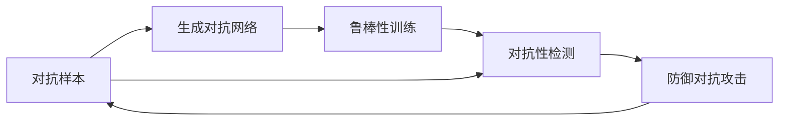

                 

# AI模型的安全性：防御对抗性攻击

## 1. 背景介绍

人工智能模型，尤其是深度学习模型，在自然语言处理、计算机视觉、语音识别等领域展现了卓越的性能。然而，近年来对抗性攻击的威胁日益凸显，攻击者通过微小但具有特定模式的变化来误导模型，使其输出错误结果，这不仅对模型的正确性构成严重威胁，还可能引发重大安全问题。对抗性攻击已经成为AI系统安全性的重要课题，本文将深入探讨对抗性攻击的原理、检测和防御技术，旨在提升AI模型的安全性。

## 2. 核心概念与联系

### 2.1 核心概念概述

对抗性攻击（Adversarial Attack）是指通过在输入数据中添加微小的扰动，来改变模型输出结果的一种攻击方式。这种攻击可以存在于视觉、语音、文本等多个领域，其核心思想是通过在原始数据上添加扰动，使得模型输出的结果与真实情况不符。

对抗性攻击的检测与防御涉及多个关键概念：
- **对抗样本**：对原始输入数据进行微小扰动后，能够误导模型输出的数据。
- **对抗训练**：在模型训练过程中，加入对抗性样本进行训练，以提高模型对对抗样本的鲁棒性。
- **鲁棒性**：模型在面临对抗性攻击时，仍能保持正确输出的能力。
- **生成对抗网络（GAN）**：一种生成模型，可以生成逼真但具有对抗性的样本。
- **对抗样本检测**：通过特定技术手段，检测输入数据是否为对抗样本，以避免其对模型的影响。

以下是一个 Mermaid 流程图，展示了这些核心概念之间的联系：



### 2.2 对抗性攻击的分类

对抗性攻击主要分为以下几类：
- **白盒攻击**：攻击者知道模型的架构和训练数据。
- **灰盒攻击**：攻击者知道模型的架构，但不知道训练数据。
- **黑盒攻击**：攻击者既不知道模型的架构，也不知道训练数据。

每一类攻击在攻击方式和防护措施上都有其特殊性。例如，黑盒攻击者通常只能利用公开的API接口进行攻击，因此防御措施通常包括数据预处理、模型结构和参数的保护等。

## 3. 核心算法原理 & 具体操作步骤

### 3.1 算法原理概述

对抗性攻击的原理基于模型的脆弱性，即模型在处理对抗样本时，无法保持稳定输出。常见的对抗性攻击方法包括：
- **梯度上升法（PGD）**：通过迭代计算模型梯度，逐步增加输入扰动，直到模型输出错误结果。
- **快速梯度上升法（FGSM）**：一种更加快速的攻击方式，基于梯度上升法，但每次仅更新一个像素。
- **深度神经网络中的对抗样本**：通过对输入数据进行微小扰动，改变其输出，甚至在未标记数据上也可以进行有效攻击。

### 3.2 算法步骤详解

对抗性攻击的防御通常包括以下几个关键步骤：
1. **数据预处理**：对输入数据进行预处理，如归一化、标准化等，以减少对抗样本的生成难度。
2. **模型鲁棒性训练**：在模型训练过程中，加入对抗性样本进行训练，以提升模型对对抗样本的鲁棒性。
3. **对抗样本检测**：使用特定的检测算法，如梯度对抗性检测（GAD）、自适应对抗样本检测（AOSD）等，来识别输入数据是否为对抗样本。
4. **对抗样本生成**：使用生成对抗网络（GAN）等技术，生成逼真但具有对抗性的样本，用于模型检测和防护。
5. **对抗性防御**：结合多种防御手段，如模型结构改进、参数优化等，以提升模型的整体鲁棒性。

### 3.3 算法优缺点

对抗性攻击防御的主要优点包括：
- **提升模型鲁棒性**：通过对抗训练等方法，增强模型对对抗样本的防御能力。
- **保护模型隐私**：防御措施可以有效避免模型被攻击者利用，保护模型隐私和数据安全。

然而，防御对抗性攻击也存在一些局限性：
- **计算资源消耗大**：对抗性攻击和防御通常需要消耗大量的计算资源，特别是在对抗性样本生成和对抗训练过程中。
- **模型泛化能力受限**：过于严格的防御措施可能限制模型的泛化能力，影响其在实际场景中的应用效果。
- **防御手段单一**：现有的防御方法大多聚焦于模型层面的防护，对于攻击手段的多样性和动态性，存在一定局限性。

### 3.4 算法应用领域

对抗性攻击防御技术在多个领域中都有广泛应用，例如：
- **安全监控**：在视频监控、网络安全等领域，通过对抗性检测和防御，确保系统的安全性。
- **医疗诊断**：在医学影像、医疗数据处理中，对抗性攻击可能影响诊断结果，通过对抗训练提升模型的鲁棒性。
- **金融交易**：在金融领域，对抗性攻击可能影响交易结果，通过对抗性检测和防御，保护交易安全。
- **智能推荐**：在推荐系统中，对抗性攻击可能误导用户推荐结果，通过对抗性训练提升推荐系统的公平性和鲁棒性。

## 4. 数学模型和公式 & 详细讲解 & 举例说明

### 4.1 数学模型构建

对抗性攻击的数学模型通常可以表示为：
$$
y = f(x + \delta)
$$
其中，$f$ 表示模型函数，$x$ 为原始输入，$\delta$ 为对抗样本扰动，$y$ 为攻击后的输出。对抗性攻击的目标是通过最小化扰动 $\delta$，使得 $y$ 与真实结果 $y_0$ 不同，即：
$$
\min_{\delta} \| \delta \|_\infty \text{ subject to } f(x+\delta) \neq f(x)
$$
其中，$\| \delta \|_\infty$ 表示扰动的最大范围，$f(x+\delta) \neq f(x)$ 表示攻击后的输出与原始输出不同。

### 4.2 公式推导过程

梯度上升法（PGD）攻击的推导过程如下：
$$
\min_{\delta} \| \delta \|_\infty \text{ subject to } f(x+\delta) \neq f(x)
$$
通过计算模型的梯度 $\nabla f(x)$，可以得到扰动 $\delta$ 的更新公式：
$$
\delta = \alpha \cdot \text{sign}(\nabla f(x))
$$
其中，$\alpha$ 为步长，$\text{sign}(\nabla f(x))$ 表示梯度的符号，确保扰动方向与梯度一致。

### 4.3 案例分析与讲解

以图像分类模型为例，假设模型将正常图像分类为狗，攻击者通过增加图像亮度，使得模型将其分类为猫。攻击过程如下：
1. **梯度计算**：计算模型在图像上输出的梯度。
2. **扰动生成**：根据梯度方向和步长，生成扰动图像。
3. **图像分类**：将扰动后的图像输入模型，获取新的输出结果。
4. **重复迭代**：不断迭代生成更强的对抗样本，直到模型输出错误结果。

## 5. 项目实践：代码实例和详细解释说明

### 5.1 开发环境搭建

为了实践对抗性攻击和防御技术，我们需要安装以下依赖：
```bash
pip install tensorflow numpy scipy matplotlib
```

### 5.2 源代码详细实现

以下是一个简单的对抗性攻击和防御的代码实现：

```python
import tensorflow as tf
import numpy as np
import matplotlib.pyplot as plt

# 加载MNIST数据集
mnist = tf.keras.datasets.mnist
(x_train, y_train), (x_test, y_test) = mnist.load_data()

# 归一化数据
x_train, x_test = x_train / 255.0, x_test / 255.0

# 定义模型
model = tf.keras.Sequential([
    tf.keras.layers.Flatten(input_shape=(28, 28)),
    tf.keras.layers.Dense(128, activation='relu'),
    tf.keras.layers.Dense(10)
])

# 编译模型
model.compile(optimizer='adam',
              loss=tf.keras.losses.SparseCategoricalCrossentropy(from_logits=True),
              metrics=['accuracy'])

# 训练模型
model.fit(x_train, y_train, epochs=5, batch_size=32)

# 对抗性攻击
def generate_pgd_attack(model, x, y, epsilon=0.01, alpha=0.01, num_iter=20):
    x_adv = x.copy()
    y_true = tf.convert_to_tensor(y)
    y_pred = tf.convert_to_tensor(y)
    for i in range(num_iter):
        grads = tf.gradients(model(x_adv, y_true, verbose=0)[0][0] - y_pred, x_adv)
        x_adv = x_adv + alpha * tf.sign(grads)
        x_adv = np.clip(x_adv, 0, 1)
    return x_adv

# 防御性训练
def train_defensive_model(model, x_train, y_train, num_iter=20, epsilon=0.01, alpha=0.01):
    model.compile(optimizer='adam',
                  loss=tf.keras.losses.SparseCategoricalCrossentropy(from_logits=True),
                  metrics=['accuracy'])
    for i in range(num_iter):
        for x, y in zip(x_train, y_train):
            x_adv = generate_pgd_attack(model, x, y)
            model.train_on_batch(x_adv, y)

# 测试防御效果
def test_defensive_model(model, x_test, y_test, epsilon=0.01, alpha=0.01):
    correct = 0
    for x, y in zip(x_test, y_test):
        x_adv = generate_pgd_attack(model, x, y)
        y_pred = model(x_adv)
        if y_pred.argmax() == y:
            correct += 1
    return correct / len(x_test)

train_defensive_model(model, x_train, y_train)
print("Accuracy after defensive training: {:.2f}%".format(test_defensive_model(model, x_test, y_test) * 100))
```

### 5.3 代码解读与分析

- **生成对抗样本**：`generate_pgd_attack` 函数实现了梯度上升法攻击，通过计算梯度并逐步增加扰动，生成对抗样本。
- **防御性训练**：`train_defensive_model` 函数实现了防御性训练，通过加入对抗性样本进行训练，提升模型鲁棒性。
- **测试防御效果**：`test_defensive_model` 函数测试模型的防御效果，评估模型在对抗样本上的准确率。

## 6. 实际应用场景

### 6.1 网络安全

在网络安全领域，对抗性攻击防御技术广泛应用于数据加密、网络流量分析等场景。通过对抗性检测和防御，可以有效防止恶意攻击对系统造成破坏。

### 6.2 医疗影像

在医疗影像领域，对抗性攻击可能导致误诊，通过对抗性训练，提升模型的鲁棒性，确保诊断结果的准确性。

### 6.3 自动驾驶

自动驾驶系统依赖于视觉感知和决策，对抗性攻击可能导致系统失控，通过对抗性检测和防御，确保系统安全。

### 6.4 金融交易

在金融交易领域，对抗性攻击可能导致交易结果错误，通过对抗性检测和防御，保护交易安全。

## 7. 工具和资源推荐

### 7.1 学习资源推荐

- **《对抗性机器学习》**：Ian J. Goodfellow等人著，详细介绍了对抗性机器学习的原理、技术和应用。
- **TensorFlow对抗性攻击与防御**：TensorFlow官方文档，提供了丰富的对抗性攻击和防御示例代码。
- **Kaggle对抗性攻击竞赛**：Kaggle举办的对抗性攻击竞赛，可以学习和借鉴优秀解决方案。

### 7.2 开发工具推荐

- **TensorFlow**：开源深度学习框架，支持高效的对抗性攻击和防御训练。
- **PyTorch**：开源深度学习框架，提供了丰富的对抗性攻击和防御工具。
- **Keras**：高层深度学习框架，支持快速构建和训练对抗性模型。

### 7.3 相关论文推荐

- **《Adversarial Examples in Deep Learning and Natural Language Processing》**：Ian J. Goodfellow等人著，介绍了对抗性攻击在深度学习和自然语言处理中的应用。
- **《Robustness of Neural Networks to Adversarial Examples》**：Christian Szegedy等人著，提出了著名的Adversarial Examples攻击。
- **《Training Deep Neural Networks with Data Augmentation》**：Ian J. Goodfellow等人著，介绍了数据增强技术对抗性攻击的重要性。

## 8. 总结：未来发展趋势与挑战

### 8.1 总结

本文全面介绍了对抗性攻击的原理、检测和防御技术，通过理论分析、代码实现和应用场景展示，深入探讨了AI模型的安全性。对抗性攻击已成为AI系统面临的重要威胁，本文提出的防御方法可以显著提升模型的鲁棒性和安全性。

### 8.2 未来发展趋势

未来的对抗性攻击和防御技术将呈现以下几个趋势：
- **自动化对抗性攻击检测**：通过机器学习技术，实现自动化的对抗性攻击检测，提高检测效率。
- **多模态对抗性攻击**：结合视觉、语音、文本等多种模态，构建更全面的对抗性攻击模型。
- **跨领域对抗性攻击**：通过迁移学习等方法，将对抗性攻击扩展到不同领域。
- **自适应对抗性防御**：通过在线学习，动态调整防御策略，提高模型的实时防护能力。

### 8.3 面临的挑战

尽管对抗性攻击防御技术取得了一定的进展，但在实际应用中仍面临诸多挑战：
- **计算资源消耗大**：对抗性攻击和防御通常需要消耗大量的计算资源，特别是在对抗性样本生成和对抗训练过程中。
- **模型泛化能力受限**：过于严格的防御措施可能限制模型的泛化能力，影响其在实际场景中的应用效果。
- **对抗攻击手段多样化**：现有的防御方法大多聚焦于模型层面的防护，对于攻击手段的多样性和动态性，存在一定局限性。

### 8.4 研究展望

未来对抗性攻击和防御的研究方向包括：
- **结合多种防御手段**：通过结合多种防御技术，提升模型的整体鲁棒性。
- **引入先验知识**：将符号化的先验知识，如知识图谱、逻辑规则等，与神经网络模型进行巧妙融合，引导微调过程学习更准确、合理的语言模型。
- **动态防御**：通过在线学习和自适应算法，动态调整防御策略，提高模型的实时防护能力。
- **跨模态对抗性攻击**：结合视觉、语音、文本等多种模态，构建更全面的对抗性攻击模型。

## 9. 附录：常见问题与解答

**Q1：对抗性攻击和防御的主要挑战是什么？**

A: 对抗性攻击和防御的主要挑战包括计算资源消耗大、模型泛化能力受限、对抗攻击手段多样化等。

**Q2：如何评估模型的对抗性鲁棒性？**

A: 评估模型的对抗性鲁棒性通常使用对抗性攻击测试集，如CIFAR-10、MNIST等，在攻击者攻击下，评估模型的分类准确率等指标。

**Q3：对抗性攻击和防御的最佳实践是什么？**

A: 最佳实践包括数据预处理、对抗性训练、对抗样本检测等。

**Q4：如何设计对抗性检测算法？**

A: 对抗性检测算法设计需要考虑攻击类型、模型架构等多种因素，常用的检测算法包括梯度对抗性检测（GAD）、自适应对抗样本检测（AOSD）等。

**Q5：对抗性攻击和防御的最新进展是什么？**

A: 最新进展包括自动化对抗性攻击检测、多模态对抗性攻击、自适应对抗性防御等。

---

作者：禅与计算机程序设计艺术 / Zen and the Art of Computer Programming

