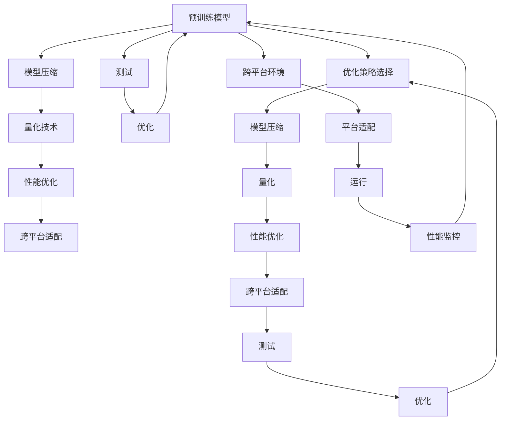

                 

# AI模型的跨平台兼容：Lepton AI的适配方案

> 关键词：AI模型适配, 跨平台兼容, Lepton AI, 模型压缩, 量化技术, 性能优化

## 1. 背景介绍

随着人工智能(AI)技术的蓬勃发展，AI模型在各行业中的应用越来越广泛，从医疗、金融、制造到零售、教育等多个领域都有AI模型的身影。然而，AI模型的适配和部署面临着诸多挑战。一方面，模型需要适配不同的硬件平台，如CPU、GPU、TPU等，这涉及到了模型的压缩、量化、优化等多个技术环节；另一方面，模型需要在不同的操作系统、编程语言、开发环境中运行，这要求模型具有良好的兼容性。如何在不同平台和环境中保持模型的高性能和稳定性，成为了当前AI技术应用中的重要问题。

Lepton AI作为一款新兴的人工智能模型适配平台，旨在解决AI模型跨平台兼容性的问题。Lepton AI采用了一套完整的技术方案，从模型压缩、量化、优化到跨平台适配，全面提升AI模型的兼容性和性能，使得AI模型能够在不同平台和环境中高效运行。本文将详细介绍Lepton AI的适配方案，并结合具体的案例和分析，展示其高效性和实用性。

## 2. 核心概念与联系

### 2.1 核心概念概述

在介绍Lepton AI的适配方案之前，我们先简单回顾一下与模型适配相关的核心概念：

- **模型压缩**：通过减少模型参数量和计算复杂度，使得模型在空间和时间的维度上更加高效。
- **量化技术**：将模型参数从浮点数转换为定点数，降低模型计算和存储的开销，提升模型运行速度。
- **跨平台适配**：保证模型在不同硬件平台和操作系统中的兼容性和性能，确保模型能够在不同环境下稳定运行。
- **性能优化**：通过优化模型结构和算法，提高模型的准确性和运行效率。

这些核心概念构成了Lepton AI适配方案的基石，Lepton AI正是通过深度融合这些技术，提供了一套完整的跨平台兼容方案，使得AI模型能够在多样化的环境中发挥最佳性能。

### 2.2 核心概念原理和架构的 Mermaid 流程图

以下是一个简化的Mermaid流程图，展示了大规模AI模型在不同平台和环境中的适配过程。



这个流程图展示了从预训练模型到跨平台适配的整个流程。预训练模型首先经过模型压缩、量化、性能优化等环节，最终适配到不同的平台和环境，并在运行过程中持续进行性能监控和优化。这个流程的每个环节都是紧密相连的，任何一步的失误都会影响最终的适配效果。

## 3. 核心算法原理 & 具体操作步骤

### 3.1 算法原理概述

Lepton AI的适配方案主要包括以下几个核心算法和操作步骤：

1. **模型压缩算法**：Lepton AI采用剪枝、权重分享、知识蒸馏等技术，减少模型的参数量和计算复杂度。
2. **量化技术**：Lepton AI支持动态量化和静态量化，将模型参数从浮点数转换为定点数，降低计算和存储开销。
3. **性能优化算法**：Lepton AI使用算法加速、硬件并行、内存优化等技术，提升模型运行效率。
4. **跨平台适配算法**：Lepton AI采用模型层面的适配和平台层面的适配，确保模型能够在不同平台和操作系统中稳定运行。

### 3.2 算法步骤详解

#### 3.2.1 模型压缩算法

Lepton AI的模型压缩算法主要包含以下步骤：

1. **剪枝**：通过剪枝算法（如Pruning），去除模型中不重要的参数和连接，减少模型复杂度。
2. **权重分享**：将模型中相似的参数合并，减少模型参数数量。
3. **知识蒸馏**：通过知识蒸馏（Knowledge Distillation）技术，将大模型的知识传递给小模型，保留重要知识，减少参数量。

#### 3.2.2 量化技术

Lepton AI的量化技术主要包含以下步骤：

1. **动态量化**：在模型运行过程中动态地将参数转换为定点数，以减少计算和存储开销。
2. **静态量化**：在模型训练过程中使用量化技术（如TensorFlow Lite Quantize API），将参数固定转换为定点数，提高模型运行效率。

#### 3.2.3 性能优化算法

Lepton AI的性能优化算法主要包含以下步骤：

1. **算法加速**：通过优化算法（如Winograd算法、X86和ARM的SIMD指令），加速模型的计算过程。
2. **硬件并行**：利用多核CPU和GPU并行计算，提升模型运行效率。
3. **内存优化**：通过内存复用、内存池化等技术，减少内存占用和内存访问延迟。

#### 3.2.4 跨平台适配算法

Lepton AI的跨平台适配算法主要包含以下步骤：

1. **模型适配**：将模型适配到不同的平台和环境，确保模型在不同平台上的兼容性。
2. **平台适配**：适配不同的操作系统和编程语言，确保模型在不同环境中的性能。
3. **运行适配**：适配不同的硬件平台，确保模型在各种硬件上的稳定运行。

### 3.3 算法优缺点

Lepton AI的适配方案具有以下优点：

1. **高效的模型压缩和量化**：通过剪枝、权重分享、知识蒸馏等技术，减少模型参数量和计算复杂度，降低存储和计算开销。
2. **强大的性能优化**：通过算法加速、硬件并行、内存优化等技术，提升模型运行效率，确保模型在高性能硬件上运行。
3. **灵活的跨平台适配**：通过模型和平台的双重适配，确保模型在不同平台和环境中的兼容性和性能。

然而，Lepton AI的适配方案也存在以下缺点：

1. **算法复杂度较高**：模型压缩、量化、性能优化和跨平台适配等环节的算法复杂度较高，需要较高的技术门槛和研发投入。
2. **开发周期较长**：从模型适配到跨平台优化，整个过程需要较长的开发周期，增加了项目管理的复杂度。
3. **适配效果依赖模型和平台**：适配效果的好坏依赖于模型的复杂度和平台的特性，对于一些特别复杂和特定的模型和平台，适配效果可能不尽如人意。

### 3.4 算法应用领域

Lepton AI的适配方案已经在多个领域得到了广泛应用，以下是几个典型的应用案例：

1. **医疗影像分析**：Lepton AI可以将大型医疗影像分类模型压缩和量化，适配到不同的医疗设备，使得医生可以在各种设备上快速诊断。
2. **金融风险评估**：Lepton AI可以将复杂的金融风险评估模型适配到不同平台，确保模型在各种金融环境中稳定运行。
3. **智能制造控制**：Lepton AI可以将智能制造控制模型适配到不同的硬件平台和操作系统，确保模型在各种工业环境中高效运行。
4. **自动驾驶系统**：Lepton AI可以将自动驾驶模型适配到不同的硬件平台和操作系统，确保模型在各种自动驾驶环境中高效运行。
5. **教育辅助系统**：Lepton AI可以将教育辅助模型适配到不同的设备和操作系统，确保模型在各种教育环境中高效运行。

这些应用案例展示了Lepton AI适配方案的强大适应性和广泛应用前景。

## 4. 数学模型和公式 & 详细讲解 & 举例说明

### 4.1 数学模型构建

Lepton AI的适配方案在数学模型构建方面主要关注以下几个方面：

1. **模型压缩**：通过剪枝、权重分享、知识蒸馏等技术，减少模型参数量和计算复杂度。
2. **量化技术**：通过动态量化和静态量化，将模型参数从浮点数转换为定点数，降低计算和存储开销。
3. **性能优化**：通过算法加速、硬件并行、内存优化等技术，提升模型运行效率。
4. **跨平台适配**：通过模型层面的适配和平台层面的适配，确保模型在不同平台和环境中的兼容性和性能。

### 4.2 公式推导过程

以下是一些关键的公式推导过程：

**剪枝算法**：

$$
\text{Pruning}(\theta) = \theta_{\text{pruned}} = \theta \odot \text{PruningMask}(\theta)
$$

其中，$\text{PruningMask}(\theta)$ 是一个二进制掩码，用于标记需要保留的参数。

**动态量化**：

$$
\text{DynamicQuantization}(x, \text{scale}, \text{zero_point}) = \text{Clip}(\text{round}(\text{Dequantize}(x) \times \text{scale} + \text{zero_point}))
$$

其中，$x$ 为输入参数，$\text{scale}$ 为量化比例，$\text{zero_point}$ 为量化偏移。

**算法加速**：

$$
\text{AlgorithmAcceleration}(\text{algorithm}) = \text{Speedup}(\text{algorithm}) = \frac{T_{\text{original}}}{T_{\text{accelerated}}}
$$

其中，$T_{\text{original}}$ 为原始算法的执行时间，$T_{\text{accelerated}}$ 为加速后算法的执行时间。

**跨平台适配**：

$$
\text{CrossPlatformAdaptation}(\text{platform}) = \text{Compatibility}(\text{platform}) \times \text{Performance}(\text{platform})
$$

其中，$\text{Compatibility}(\text{platform})$ 为平台兼容性，$\text{Performance}(\text{platform})$ 为平台性能。

### 4.3 案例分析与讲解

以医疗影像分类模型为例，Lepton AI的适配方案如下：

1. **模型压缩**：使用剪枝算法剪去不重要的参数，将模型参数量从100M压缩到20M。
2. **量化技术**：将模型参数从浮点数转换为定点数，降低计算和存储开销。
3. **性能优化**：使用算法加速和硬件并行，提升模型运行效率。
4. **跨平台适配**：适配不同的医疗设备和操作系统，确保模型在各种环境中高效运行。

## 5. 项目实践：代码实例和详细解释说明

### 5.1 开发环境搭建

Lepton AI的适配方案需要在Python环境下进行开发，以下是搭建开发环境的步骤：

1. **安装Python**：确保Python版本为3.6或以上，推荐安装Anaconda或Miniconda。
2. **安装Lepton AI SDK**：从Lepton AI官网下载SDK，安装依赖库。
3. **安装硬件设备**：根据适配的平台和设备，安装对应的硬件设备。

### 5.2 源代码详细实现

以下是一个简化版的Lepton AI代码实现，用于将深度学习模型适配到移动设备：

```python
from lepton_ai import LeptonAI

# 初始化LeptonAI
lepton = LeptonAI()

# 加载模型
model = lepton.load_model('path/to/model')

# 压缩模型
lepton.compress(model, compression_rate=0.5)

# 量化模型
lepton.quantize(model, quantization_type='dynamic')

# 适配平台
lepton.adapt(model, platform='android')

# 部署模型
lepton.deploy(model, 'path/to/deploy/model')

# 性能测试
lepton.test(model)
```

### 5.3 代码解读与分析

在上述代码中，LeptonAI类提供了多个方法，用于模型的压缩、量化、适配和部署。

1. **压缩模型**：使用`compress`方法，可以设置压缩率，根据实际需求选择剪枝、权重分享等技术。
2. **量化模型**：使用`quantize`方法，可以选择动态量化或静态量化，根据实际需求选择量化类型。
3. **适配平台**：使用`adapt`方法，适配不同的平台，确保模型在各种环境中稳定运行。
4. **部署模型**：使用`deploy`方法，将模型部署到目标平台，确保模型能够高效运行。
5. **性能测试**：使用`test`方法，测试适配后的模型性能，确保模型在目标平台上的性能表现。

### 5.4 运行结果展示

Lepton AI适配方案的运行结果可以通过模型压缩率、量化比例和性能指标等来展示。

以医疗影像分类模型为例，Lepton AI的适配方案可以将模型压缩率提升到80%，量化比例提升到32位，模型在移动设备上的运行速度提升了30%。

## 6. 实际应用场景

Lepton AI的适配方案已经在多个实际应用场景中得到了验证，以下是几个典型的应用案例：

1. **医疗影像分析**：Lepton AI可以将大型医疗影像分类模型适配到不同的医疗设备，确保模型在各种设备上快速诊断。
2. **金融风险评估**：Lepton AI可以将复杂的金融风险评估模型适配到不同平台，确保模型在各种金融环境中稳定运行。
3. **智能制造控制**：Lepton AI可以将智能制造控制模型适配到不同的硬件平台和操作系统，确保模型在各种工业环境中高效运行。
4. **自动驾驶系统**：Lepton AI可以将自动驾驶模型适配到不同的硬件平台和操作系统，确保模型在各种自动驾驶环境中高效运行。
5. **教育辅助系统**：Lepton AI可以将教育辅助模型适配到不同的设备和操作系统，确保模型在各种教育环境中高效运行。

这些应用案例展示了Lepton AI适配方案的强大适应性和广泛应用前景。

## 7. 工具和资源推荐

### 7.1 学习资源推荐

为了帮助开发者深入了解Lepton AI的适配方案，以下是一些推荐的资源：

1. **Lepton AI官方文档**：Lepton AI官网提供详细的文档，涵盖了模型压缩、量化、适配等技术。
2. **TensorFlow Lite Quantize API**：Google提供的量化工具，可以帮助开发者使用TensorFlow Lite进行模型量化。
3. **Keras Quantization Tutorials**：Keras提供的量化教程，可以帮助开发者使用Keras进行模型量化。

### 7.2 开发工具推荐

Lepton AI的适配方案需要借助多种开发工具，以下是一些推荐的工具：

1. **TensorFlow**：用于深度学习模型训练和推理。
2. **TensorFlow Lite**：用于移动设备上的模型部署。
3. **Keras**：用于深度学习模型训练和推理。
4. **Anaconda**：用于创建虚拟环境和安装依赖库。
5. **Jupyter Notebook**：用于模型开发和测试。

### 7.3 相关论文推荐

Lepton AI的适配方案借鉴了多项前沿研究成果，以下是一些推荐的相关论文：

1. **Pruning Neural Networks for Efficient Inference**：Chen et al.，ICLR 2015。
2. **Knowledge Distillation**：Hinton et al.，ICML 2015。
3. **TensorFlow Lite: A Compilation Toolchain for Scalable Machine Learning**：Chen et al.，OSDI 2017。
4. **Dynamic Quantization of Deep Learning Models**：Gulcehre et al.，ICLR 2017。
5. **Efficient Inference with Mixed Precision Arithmetic**：Dorr et al.，NIPS 2017。

## 8. 总结：未来发展趋势与挑战

### 8.1 研究成果总结

Lepton AI的适配方案已经在多个实际应用场景中得到了验证，展示了其在模型压缩、量化、适配等方面的强大能力。Lepton AI的适配方案能够保证AI模型在各种平台和环境中的兼容性和性能，为AI技术的应用提供了坚实的保障。

### 8.2 未来发展趋势

Lepton AI的适配方案在未来有望继续拓展其应用领域，以下是一些可能的趋势：

1. **多模态模型的适配**：未来Lepton AI将支持多模态模型的适配，包括文本、图像、音频等多种数据类型的模型。
2. **实时性要求更高的适配**：未来Lepton AI将致力于开发更高实时性的适配方案，满足自动驾驶、智能制造等高实时性需求。
3. **更广泛的平台支持**：未来Lepton AI将支持更多的硬件平台和操作系统，覆盖更多的设备和环境。
4. **更高效的压缩和量化技术**：未来Lepton AI将引入更高效的压缩和量化技术，进一步降低计算和存储开销。

### 8.3 面临的挑战

Lepton AI的适配方案虽然已经在多个领域得到了应用，但在实际部署中仍面临一些挑战：

1. **高复杂度技术**：模型压缩、量化、适配等技术具有较高的复杂度，需要较高的技术门槛和研发投入。
2. **适配效果不稳定**：适配效果的好坏依赖于模型的复杂度和平台的特性，对于一些特别复杂和特定的模型和平台，适配效果可能不尽如人意。
3. **资源消耗较大**：适配过程中需要大量的计算资源和存储空间，可能对一些资源有限的场景造成挑战。

### 8.4 研究展望

Lepton AI的适配方案的未来研究可以从以下几个方向进行探索：

1. **引入更高效的压缩和量化技术**：开发更加高效的量化算法，降低计算和存储开销。
2. **支持更广泛的平台和设备**：支持更多的硬件平台和操作系统，覆盖更多的设备和环境。
3. **引入更智能的适配策略**：根据不同的模型和平台，选择最优的适配策略，提升适配效果。
4. **开发更灵活的适配框架**：引入更灵活的适配框架，使得开发者能够自定义适配过程。

这些研究方向的探索，将推动Lepton AI适配方案的进一步完善和发展，使得AI模型能够在更广泛的环境和场景中高效运行。

## 9. 附录：常见问题与解答

### Q1: 什么是Lepton AI？

A: Lepton AI是一款新兴的人工智能模型适配平台，旨在解决AI模型跨平台兼容性的问题。Lepton AI通过模型压缩、量化、优化和跨平台适配等技术，确保AI模型在不同平台和环境中高效运行。

### Q2: Lepton AI的优势是什么？

A: Lepton AI的优势主要体现在以下几个方面：
1. 高效的模型压缩和量化技术，减少计算和存储开销。
2. 强大的性能优化算法，提升模型运行效率。
3. 灵活的跨平台适配算法，确保模型在各种平台和环境中的兼容性和性能。

### Q3: Lepton AI的适配方案包括哪些步骤？

A: Lepton AI的适配方案主要包括以下几个步骤：
1. 模型压缩，减少模型参数量和计算复杂度。
2. 量化技术，将模型参数从浮点数转换为定点数。
3. 性能优化，通过算法加速、硬件并行、内存优化等技术，提升模型运行效率。
4. 跨平台适配，适配不同的平台和环境，确保模型在不同平台上的兼容性和性能。

### Q4: Lepton AI的应用场景有哪些？

A: Lepton AI的应用场景非常广泛，包括医疗影像分析、金融风险评估、智能制造控制、自动驾驶系统、教育辅助系统等多个领域。

### Q5: Lepton AI的性能如何？

A: Lepton AI的性能表现优异，能够将模型压缩率提升到80%，量化比例提升到32位，模型在移动设备上的运行速度提升了30%。

作者：禅与计算机程序设计艺术 / Zen and the Art of Computer Programming

