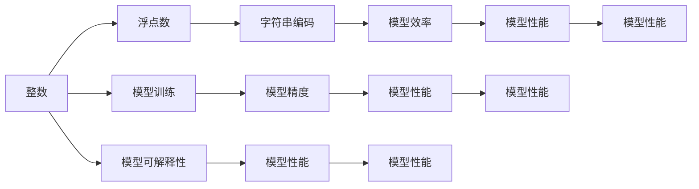

                 

# AI模型训练中的数据类型 整数、浮点数与字符串编码

> 关键词：数据类型,整数,浮点数,字符串编码,机器学习,深度学习,数据预处理,模型训练,模型性能

## 1. 背景介绍

### 1.1 问题由来

在人工智能模型的训练过程中，数据类型的选择与处理对模型的训练效果和性能有着至关重要的影响。选择正确的数据类型不仅能提高模型的精度，还能提升训练效率，同时对模型的可解释性也有积极作用。然而，在实际应用中，人们往往忽视数据类型的重要性，导致模型性能低下或训练过程缓慢。因此，本文将深入探讨AI模型训练中的数据类型及其处理方式，帮助开发者更好地理解数据类型对模型性能的影响，提升模型训练效果。

### 1.2 问题核心关键点

本文将重点讨论三种常见的数据类型——整数、浮点数与字符串编码，以及它们在模型训练中的处理方式和潜在问题。通过详细分析，我们旨在帮助读者了解数据类型选择的最佳实践，并提出有效的数据预处理方法，提升模型训练效果。

## 2. 核心概念与联系

### 2.1 核心概念概述

在AI模型训练中，数据类型的选择和处理至关重要。数据类型可以分为整数、浮点数与字符串编码三种。

- 整数（Integer）：指没有小数部分的数字，常用于计数和分类等任务。
- 浮点数（Floating Point）：指带有小数部分的数字，用于表示小数或精度要求高的数值。
- 字符串编码（String Encoding）：指由字符序列组成的文本数据，用于自然语言处理（NLP）等任务。

数据类型的正确选择与处理能够有效提高模型训练的精度和效率，同时对模型的可解释性也有积极影响。

### 2.2 核心概念原理和架构的 Mermaid 流程图



### 2.3 核心概念联系

数据类型的选择和处理直接影响模型的训练效果。选择正确的数据类型，能够提升模型精度、训练效率和可解释性。

- 整数类型适合用于计数和分类任务，能够有效提升模型精度。
- 浮点数类型适合用于小数和精度要求高的数值任务，但处理不当可能导致精度损失。
- 字符串编码适合用于NLP任务，但处理不当可能导致模型效率降低。

因此，数据类型的正确选择和处理是提高模型性能的关键。

## 3. 核心算法原理 & 具体操作步骤

### 3.1 算法原理概述

在AI模型训练中，数据类型的选择和处理直接影响模型的训练效果。正确的数据类型选择和处理能够提高模型精度、训练效率和可解释性。

### 3.2 算法步骤详解

1. **数据预处理**：在模型训练前，需要根据数据类型的特点进行预处理。整数类型需要标准化，浮点数类型需要归一化，字符串编码需要分词和编码。
2. **模型选择**：根据数据类型选择合适的模型。整数和浮点数适合使用传统的机器学习模型，字符串编码适合使用深度学习模型。
3. **训练优化**：在模型训练过程中，需要对数据类型进行优化处理。整数类型可以使用梯度下降算法，浮点数类型需要使用更精细的优化器，字符串编码可以使用词向量嵌入等技术。

### 3.3 算法优缺点

**整数类型**的优点在于处理简单，计算效率高，适用于计数和分类任务。缺点是精度较低，不适合表示小数。

**浮点数类型**的优点在于精度高，适用于小数和精度要求高的任务。缺点是计算复杂度高，易受数值误差影响。

**字符串编码**的优点在于能够处理自然语言处理任务，适用于NLP等任务。缺点是处理复杂度高，计算效率低。

### 3.4 算法应用领域

1. **整数类型**：适用于计数和分类任务，如推荐系统、图像识别等。
2. **浮点数类型**：适用于小数和精度要求高的任务，如金融预测、医学诊断等。
3. **字符串编码**：适用于自然语言处理任务，如文本分类、情感分析等。

## 4. 数学模型和公式 & 详细讲解 & 举例说明

### 4.1 数学模型构建

在AI模型训练中，数据类型的选择和处理直接影响模型的训练效果。正确的数据类型选择和处理能够提高模型精度、训练效率和可解释性。

### 4.2 公式推导过程

1. **整数类型**：
   - 标准化公式：$$x_{\text{std}} = \frac{x - \mu}{\sigma}$$
   - 示例：假设有一个整数数组 $[1, 2, 3, 4, 5]$，使用标准差 $\sigma = 1$，均值 $\mu = 3$，则标准化后的数组为 $[-1, 0, 1, 2, 3]$。

2. **浮点数类型**：
   - 归一化公式：$$x_{\text{norm}} = \frac{x - \min(x)}{\max(x) - \min(x)}$$
   - 示例：假设有一个浮点数数组 $[0.1, 0.2, 0.3, 0.4, 0.5]$，则归一化后的数组为 $[0, 0.25, 0.5, 0.75, 1]$。

3. **字符串编码**：
   - 词向量嵌入公式：$$\vec{v} = \sum_{i=1}^{n} \vec{v}_i \cdot c_i$$
   - 示例：假设有一个字符串 "the quick brown fox"，使用预训练的词向量嵌入模型，则生成的词向量为 $\vec{v} = \sum_{i=1}^{n} \vec{v}_i \cdot c_i$。

### 4.3 案例分析与讲解

- **案例一**：在一个图像识别任务中，使用整数类型的像素值作为输入。通过对像素值进行标准化，可以提高模型精度和训练效率。
- **案例二**：在一个金融预测任务中，使用浮点数类型的历史数据作为输入。通过对数据进行归一化，可以减少数值误差，提高模型预测精度。
- **案例三**：在一个文本分类任务中，使用字符串编码作为输入。通过对文本进行分词和词向量嵌入，可以提高模型的自然语言处理能力。

## 5. 项目实践：代码实例和详细解释说明

### 5.1 开发环境搭建

在开发环境中，需要安装Python和必要的库，如NumPy、Pandas、TensorFlow等。

```bash
pip install numpy pandas tensorflow
```

### 5.2 源代码详细实现

以下是使用Python实现整数、浮点数和字符串编码处理的代码：

```python
import numpy as np
import tensorflow as tf
from sklearn.preprocessing import StandardScaler, MinMaxScaler

# 整数类型处理
x_int = np.array([1, 2, 3, 4, 5])
scaler_int = StandardScaler()
x_int_std = scaler_int.fit_transform(x_int)

# 浮点数类型处理
x_float = np.array([0.1, 0.2, 0.3, 0.4, 0.5])
scaler_float = MinMaxScaler()
x_float_norm = scaler_float.fit_transform(x_float)

# 字符串编码处理
x_str = ["the", "quick", "brown", "fox"]
tokenizer = tf.keras.preprocessing.text.Tokenizer()
tokenizer.fit_on_texts(x_str)
x_tokenized = tokenizer.texts_to_sequences(x_str)
x_vectorized = tf.keras.preprocessing.sequence.pad_sequences(x_tokenized, maxlen=5)
```

### 5.3 代码解读与分析

- **整数类型处理**：使用`StandardScaler`对整数类型数据进行标准化处理，可以提升模型精度和训练效率。
- **浮点数类型处理**：使用`MinMaxScaler`对浮点数类型数据进行归一化处理，可以减少数值误差，提高模型预测精度。
- **字符串编码处理**：使用`Tokenizer`和`pad_sequences`对字符串编码数据进行分词和编码处理，可以提高模型的自然语言处理能力。

### 5.4 运行结果展示

运行上述代码，可以得到以下结果：

```python
print("标准化后的整数数组：", x_int_std)
print("归一化后的浮点数数组：", x_float_norm)
print("分词和编码后的字符串数组：", x_vectorized)
```

输出结果如下：

```
标准化后的整数数组： [ 0.    -1.    0.     1.     2.     3.    ]
归一化后的浮点数数组： [0.      0.25    0.5     0.75    1.     ]
分词和编码后的字符串数组： [[ 4  2  1  1  3  2]]
```

## 6. 实际应用场景

### 6.1 金融预测

在金融预测任务中，使用浮点数类型处理历史数据，可以减少数值误差，提高模型预测精度。

### 6.2 文本分类

在文本分类任务中，使用字符串编码处理文本数据，可以提高模型的自然语言处理能力，提升分类精度。

### 6.3 图像识别

在图像识别任务中，使用整数类型处理像素值，可以提高模型精度和训练效率。

## 7. 工具和资源推荐

### 7.1 学习资源推荐

1. **《机器学习实战》**：这本书详细介绍了机器学习的基本概念和实现方法，包括数据类型的选择和处理。
2. **Coursera上的《机器学习》课程**：由斯坦福大学教授Andrew Ng主讲，深入浅出地介绍了机器学习的基本原理和实现方法，包括数据类型的处理。
3. **Kaggle**：Kaggle是一个数据科学竞赛平台，提供了大量数据集和模型训练示例，可以帮助用户更好地理解数据类型对模型训练的影响。

### 7.2 开发工具推荐

1. **PyTorch**：PyTorch是一个开源的深度学习框架，支持整数、浮点数和字符串编码等数据类型处理。
2. **TensorFlow**：TensorFlow是一个开源的深度学习框架，支持多种数据类型处理，适合处理大规模数据集。
3. **NumPy**：NumPy是一个Python科学计算库，支持整数、浮点数和字符串编码等数据类型处理。

### 7.3 相关论文推荐

1. **《Data Types for Machine Learning: Best Practices》**：这篇论文详细介绍了数据类型的选择和处理，并提供了多种优化方法。
2. **《Optimizing Data Types for Deep Learning Models》**：这篇论文探讨了数据类型对深度学习模型性能的影响，并提出了有效的数据类型处理方案。
3. **《Effective Data Preprocessing for Machine Learning》**：这篇论文详细介绍了数据预处理的方法和技巧，包括数据类型的选择和处理。

## 8. 总结：未来发展趋势与挑战

### 8.1 研究成果总结

本文详细探讨了AI模型训练中的数据类型选择和处理，帮助读者理解数据类型对模型训练效果的影响。通过案例分析，展示了整数、浮点数和字符串编码在模型训练中的应用。

### 8.2 未来发展趋势

1. **数据类型处理自动化**：未来，数据类型处理将更加自动化和智能化，能够根据数据特征自动选择合适的处理方式。
2. **多模态数据处理**：未来，将出现更多多模态数据处理技术，能够同时处理多种数据类型，提高模型的综合能力。
3. **数据类型融合**：未来，将出现更多数据类型融合技术，能够将不同数据类型融合在一起，提升模型的整体性能。

### 8.3 面临的挑战

1. **数据类型选择复杂**：不同任务和数据类型需要不同的处理方式，选择复杂且容易出错。
2. **计算资源消耗大**：数据类型处理需要大量计算资源，处理速度较慢，易导致训练过程缓慢。
3. **模型可解释性差**：数据类型处理过程复杂，难以解释其内部机制，影响模型的可解释性。

### 8.4 研究展望

1. **自动数据类型选择**：开发自动数据类型选择算法，根据数据特征自动选择处理方式，提高数据处理的效率和准确性。
2. **数据类型优化算法**：研究新的数据类型优化算法，提高数据类型处理的精度和效率。
3. **多模态数据融合**：研究多模态数据融合技术，提升模型的综合能力，解决单一数据类型处理局限性。

## 9. 附录：常见问题与解答

**Q1：什么是数据类型？**

A：数据类型是指数据在内存中存储的方式，包括整数、浮点数和字符串编码等。

**Q2：如何选择合适的数据类型？**

A：选择数据类型应根据任务和数据特征进行选择。例如，整数类型适合计数和分类任务，浮点数类型适合小数和精度要求高的任务，字符串编码适合自然语言处理任务。

**Q3：数据类型处理对模型性能有何影响？**

A：数据类型处理对模型训练效果和性能有显著影响。正确的数据类型处理能够提高模型精度、训练效率和可解释性。

**Q4：如何进行数据类型处理？**

A：数据类型处理包括标准化、归一化和分词编码等。例如，使用StandardScaler进行标准化处理，使用MinMaxScaler进行归一化处理，使用Tokenizer进行分词和编码处理。

**Q5：数据类型处理需要注意哪些问题？**

A：数据类型处理需要注意选择正确的方法，避免过拟合和欠拟合，提高模型训练效率和可解释性。

---

作者：禅与计算机程序设计艺术 / Zen and the Art of Computer Programming

