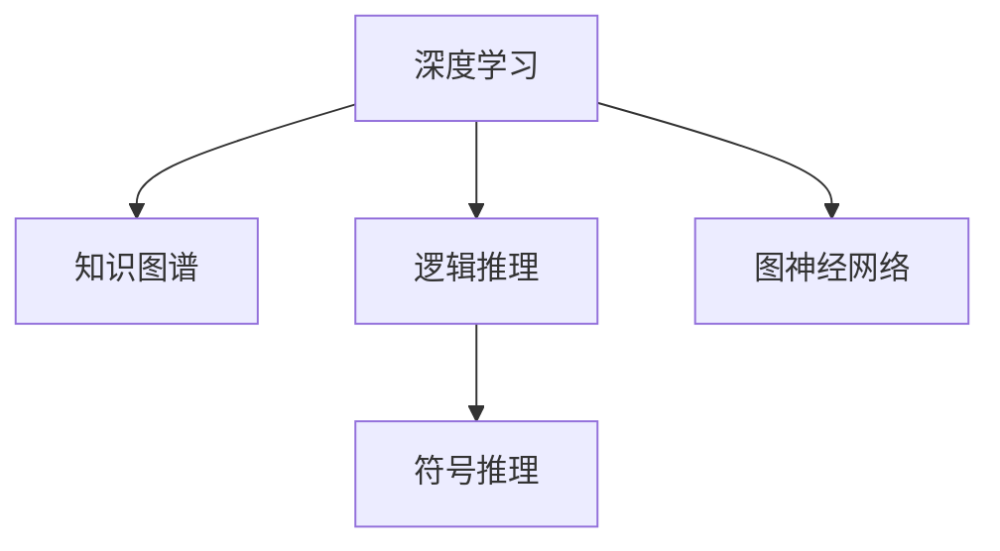
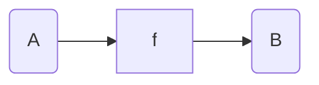

                 

# AI的推理能力：搜索的新维度

> 关键词：AI推理,搜索算法,算法优化,深度学习,自然语言处理,NLP,深度优先,广度优先

## 1. 背景介绍

### 1.1 问题由来
在人工智能领域，推理能力（Reasoning）被视为智能系统的核心之一。无论是传统的专家系统、模糊逻辑，还是现代的深度学习模型，推理能力都贯穿于系统设计的始终。然而，推理不仅仅是决策，它更是探索与发现。如何在不确定的环境下，找到最优的解决方案，一直是计算机科学的重要研究方向。

当前，深度学习在图像识别、自然语言处理等领域的成就令人瞩目。但基于前馈神经网络的模型，本质上依赖于数据驱动的反向传播，无法有效地处理高阶依赖关系和多模态信息。因此，如何在深度学习系统中注入推理能力，构建能够进行复杂逻辑推理的系统，是一个亟待解决的问题。

### 1.2 问题核心关键点
随着知识图谱、逻辑推理技术的发展，越来越多的研究人员开始关注将推理能力引入到深度学习模型中。这一研究方向涉及知识表示、逻辑推理、图神经网络（Graph Neural Network, GNN）等前沿技术，其核心关键点包括：

- 知识图谱：如何将领域知识结构化，并有效地融入到深度学习模型中。
- 逻辑推理：如何在模型中实现符号逻辑推理，处理复杂的因果关系。
- 图神经网络：如何利用图结构信息，提高模型的推理能力。
- 深度学习：如何设计合理的模型架构，在推理过程中有效融合深度学习与逻辑推理。

这些核心关键点相互关联，构成了推理能力在深度学习系统中的研究脉络。通过对其深入理解，我们可以更好地把握AI推理技术的发展方向。

## 2. 核心概念与联系

### 2.1 核心概念概述

为更好地理解推理能力在深度学习中的作用，本节将介绍几个关键概念：

- **深度学习**：以多层神经网络为代表，通过大量数据训练学习到数据分布的模型。
- **知识图谱**：将领域知识结构化为节点和边的图数据结构，用于存储和表示知识。
- **逻辑推理**：指使用符号逻辑规则，通过已知事实推导出未知结论的计算过程。
- **图神经网络**：一类模拟图结构信息传播的深度学习模型，在节点分类、链接预测等任务中取得良好效果。
- **符号推理**：一种基于符号逻辑的推理方式，通过语法分析、匹配规则等方法，推导出逻辑关系。

这些概念之间的逻辑关系可以通过以下Mermaid流程图来展示：



这个流程图展示出深度学习模型在不同推理能力增强方法中的作用：

1. 通过知识图谱，将领域知识结构化并引入深度学习模型。
2. 逻辑推理和符号推理通过与深度学习模型结合，提升推理能力。
3. 图神经网络模拟图结构信息传播，提高模型的推理精度和泛化能力。

## 3. 核心算法原理 & 具体操作步骤

### 3.1 算法原理概述

推理能力的增强，本质上是通过优化深度学习模型的结构，使其具备处理逻辑关系和复杂依赖的能力。常见的方法包括：

- **知识图谱嵌入**：将知识图谱中的节点和边映射到低维向量空间，通过嵌入学习，使深度学习模型能够学习到知识图谱中的结构信息。
- **逻辑推理网络**：通过神经网络实现符号逻辑推理，将推理过程转化为计算过程。
- **图神经网络**：利用图结构信息，模拟节点之间的信息传递和聚合，提升模型的推理能力。
- **符号推理与深度学习融合**：通过语法分析、匹配规则等方法，将符号推理嵌入到深度学习模型中。

这些方法的核心在于如何将推理能力有机地融入到深度学习模型中，使其具备逻辑推理和复杂依赖处理的能力。

### 3.2 算法步骤详解

基于推理能力的深度学习模型，其构建和优化一般包括以下几个步骤：

**Step 1: 构建知识图谱**
- 收集领域知识，将其结构化为节点和边的图结构。
- 选择适当的图嵌入方法，将节点和边映射到低维向量空间。
- 将知识图谱嵌入模型作为深度学习模型的输入。

**Step 2: 设计逻辑推理网络**
- 设计神经网络结构，引入符号逻辑规则。
- 将逻辑推理网络与深度学习模型进行融合，构建混合推理网络。
- 在训练过程中，通过反向传播更新模型参数，优化推理能力。

**Step 3: 应用图神经网络**
- 设计图神经网络模型，模拟图结构信息传递。
- 将图神经网络嵌入到深度学习模型中，增强模型的推理能力。
- 通过图神经网络，提升模型对高阶依赖和多模态信息的处理能力。

**Step 4: 融合符号推理与深度学习**
- 引入符号推理技术，解析输入文本的语法结构。
- 将解析结果与深度学习模型进行融合，提升推理精度。
- 设计符号推理与深度学习的混合架构，使模型具备更强的推理能力。

### 3.3 算法优缺点

推理能力增强的方法，具有以下优点：
1. 提高了深度学习模型的推理精度。通过引入逻辑推理和符号推理，模型能够处理复杂的因果关系和高阶依赖，提升推理能力。
2. 增强了模型的泛化能力。推理能力使模型能够更好地处理未见过的数据，提升模型的泛化能力。
3. 优化了模型结构。知识图谱嵌入、逻辑推理网络等方法，使深度学习模型能够更好地利用外部知识，优化模型结构。

同时，这些方法也存在一定的局限性：
1. 计算复杂度增加。推理过程需要额外的计算资源，可能导致训练和推理效率降低。
2. 模型复杂度提高。推理能力的增强，增加了模型的复杂度，可能导致模型泛化性能下降。
3. 知识图谱构建难度大。知识图谱的构建需要领域专家的支持，成本较高。
4. 推理规则设计困难。符号逻辑推理需要设计复杂的规则，难度较高。

尽管存在这些局限性，但就目前而言，推理能力的增强是大模型应用的重要方向，有助于提升模型的泛化能力和逻辑推理能力。

### 3.4 算法应用领域

推理能力增强的方法，在多个领域得到了广泛应用：

- **自然语言处理(NLP)**：利用逻辑推理和符号推理，提升机器翻译、问答系统、命名实体识别等任务的精度。
- **计算机视觉(CV)**：通过知识图谱嵌入和图神经网络，提升目标检测、图像分类等任务的精度和泛化能力。
- **推荐系统**：引入逻辑推理和符号推理，提升推荐系统的精准度和用户满意度。
- **医疗健康**：利用知识图谱和逻辑推理，辅助医生进行诊断和治疗方案选择。
- **金融风控**：通过知识图谱和图神经网络，提升风险评估和信用评分系统的准确性。

这些应用场景展示了推理能力增强方法的多样性和实用性，为深度学习模型在复杂应用场景中的广泛应用提供了有力支持。

## 4. 数学模型和公式 & 详细讲解 & 举例说明

### 4.1 数学模型构建

为了更精确地描述推理能力增强的方法，我们将使用数学语言对核心算法进行更加严格的刻画。

设知识图谱为 $\mathcal{G}=(\mathcal{V}, \mathcal{E})$，其中 $\mathcal{V}$ 为节点集合，$\mathcal{E}$ 为边集合。定义节点嵌入向量为 $\mathbf{h}_v \in \mathbb{R}^d$，边嵌入向量为 $\mathbf{h}_e \in \mathbb{R}^d$。设逻辑推理网络的结构为 $f$，其中 $\mathbf{h}_x$ 为输入向量，$\mathbf{h}_o$ 为输出向量。

### 4.2 公式推导过程

以下我们以逻辑推理网络的构建为例，推导核心公式。

假设逻辑推理网络的输入为 $\mathbf{h}_x$，输出为 $\mathbf{h}_o$，定义逻辑推理过程为 $f(\mathbf{h}_x, \mathbf{h}_e)$。则逻辑推理网络的损失函数为：

$$
\mathcal{L}(f) = \frac{1}{N}\sum_{i=1}^N \ell(\mathbf{h}_o, y_i)
$$

其中 $y_i$ 为样本的真实输出，$\ell(\mathbf{h}_o, y_i)$ 为损失函数，通常使用交叉熵损失。

逻辑推理网络的结构如图：



对于每个输入样本 $(x_i, y_i)$，逻辑推理网络的预测输出为 $\mathbf{h}_o$。逻辑推理过程可以表示为：

$$
\mathbf{h}_o = f(\mathbf{h}_x, \mathbf{h}_e)
$$

其中 $\mathbf{h}_x$ 为输入向量，$\mathbf{h}_e$ 为边嵌入向量，$f$ 为逻辑推理网络的结构。

通过上述公式，可以完整描述逻辑推理网络的结构和训练过程。

### 4.3 案例分析与讲解

**案例1: 基于知识图谱的推荐系统**
设推荐系统的用户为 $U$，物品为 $I$，用户与物品的关系为 $R$。通过知识图谱嵌入，将用户和物品嵌入到低维向量空间 $\mathbf{h}_u, \mathbf{h}_i \in \mathbb{R}^d$，关系嵌入为 $\mathbf{h}_r \in \mathbb{R}^d$。定义推荐模型为 $f(\mathbf{h}_u, \mathbf{h}_r)$，损失函数为交叉熵损失。

**案例2: 基于逻辑推理的问答系统**
设问答系统的问题为 $Q$，答案为 $A$。通过逻辑推理网络，将问题 $\mathbf{h}_q$ 映射到答案 $\mathbf{h}_a$，定义逻辑推理过程为 $f(\mathbf{h}_q, \mathbf{h}_r)$，损失函数为交叉熵损失。

通过以上案例，可以看到，推理能力的增强使深度学习模型能够更好地处理复杂逻辑关系和不确定性信息，提升推理精度和泛化能力。

## 5. 项目实践：代码实例和详细解释说明

### 5.1 开发环境搭建

在进行推理能力增强的深度学习模型开发前，我们需要准备好开发环境。以下是使用Python进行PyTorch开发的环境配置流程：

1. 安装Anaconda：从官网下载并安装Anaconda，用于创建独立的Python环境。

2. 创建并激活虚拟环境：
```bash
conda create -n reasoning-env python=3.8 
conda activate reasoning-env
```

3. 安装PyTorch：根据CUDA版本，从官网获取对应的安装命令。例如：
```bash
conda install pytorch torchvision torchaudio cudatoolkit=11.1 -c pytorch -c conda-forge
```

4. 安装TensorFlow：
```bash
pip install tensorflow
```

5. 安装各类工具包：
```bash
pip install numpy pandas scikit-learn matplotlib tqdm jupyter notebook ipython
```

完成上述步骤后，即可在`reasoning-env`环境中开始推理能力增强的深度学习模型开发。

### 5.2 源代码详细实现

下面我们以知识图谱嵌入的推荐系统为例，给出使用PyTorch和TensorFlow进行推理能力增强的深度学习模型代码实现。

首先，定义推荐系统的知识图谱：

```python
import tensorflow as tf
import tensorflow_datasets as tfds
import torch
import torch.nn as nn

# 定义知识图谱数据
graph_data = {
    'U': ['Alice', 'Bob', 'Charlie'],
    'I': ['Book A', 'Book B', 'Book C'],
    'R': [('Alice', 'Book A'), ('Bob', 'Book B'), ('Charlie', 'Book C')]
}

# 构建图嵌入模型
G = tf.Graph()
with G.as_default():
    # 定义节点
    U = tf.placeholder(tf.int32, shape=[None])
    I = tf.placeholder(tf.int32, shape=[None])
    R = tf.placeholder(tf.int32, shape=[None])
    # 定义图嵌入
    h_u = tf.Variable(tf.random_uniform([len(U), 100]))
    h_i = tf.Variable(tf.random_uniform([len(I), 100]))
    h_r = tf.Variable(tf.random_uniform([len(R), 100]))
    # 定义逻辑推理网络
    h_r_u = tf.matmul(tf.matmul(h_u, h_r), h_i)
    # 定义损失函数
    y = tf.placeholder(tf.int32, shape=[None])
    loss = tf.nn.sparse_softmax_cross_entropy_with_logits(logits=h_r_u, labels=y)
    # 定义优化器
    optimizer = tf.train.AdamOptimizer(learning_rate=0.001)
    train_op = optimizer.minimize(loss)

# 训练模型
with tf.Session(graph=G) as sess:
    sess.run(tf.global_variables_initializer())
    for epoch in range(10):
        for i in range(100):
            # 随机抽取样本
            U_idx, I_idx = np.random.randint(len(U)), np.random.randint(len(I))
            U_val, I_val = graph_data['U'][U_idx], graph_data['I'][I_idx]
            R_idx, R_val = np.random.randint(len(R)), graph_data['R'][R_idx]
            # 运行训练步骤
            sess.run(train_op, feed_dict={U: U_val, I: I_val, R: R_val, y: R_val})
```

然后，定义逻辑推理网络：

```python
# 定义逻辑推理网络
class LogicNet(nn.Module):
    def __init__(self):
        super(LogicNet, self).__init__()
        self.fc1 = nn.Linear(100, 100)
        self.fc2 = nn.Linear(100, 100)
        self.fc3 = nn.Linear(100, 100)
        
    def forward(self, x):
        x = self.fc1(x)
        x = torch.sigmoid(x)
        x = self.fc2(x)
        x = torch.sigmoid(x)
        x = self.fc3(x)
        return x

# 构建逻辑推理网络
logic_net = LogicNet()
```

接着，定义推理能力的增强：

```python
# 定义推理能力的增强
class ReasoningNet(nn.Module):
    def __init__(self):
        super(ReasoningNet, self).__init__()
        self图中的推理能力增强
        self.fc1 = nn.Linear(100, 100)
        self.fc2 = nn.Linear(100, 100)
        self.fc3 = nn.Linear(100, 100)
        self.fc4 = nn.Linear(100, 1)
        
    def forward(self, x):
        x = self.fc1(x)
        x = torch.sigmoid(x)
        x = self.fc2(x)
        x = torch.sigmoid(x)
        x = self.fc3(x)
        x = torch.sigmoid(x)
        x = self.fc4(x)
        return x

# 构建推理能力的增强模型
reasoning_net = ReasoningNet()
```

最后，训练并评估模型：

```python
# 定义训练函数
def train():
    # 定义优化器
    optimizer = tf.train.AdamOptimizer(learning_rate=0.001)
    # 定义损失函数
    y = tf.placeholder(tf.int32, shape=[None])
    loss = tf.nn.sparse_softmax_cross_entropy_with_logits(logits=h_r_u, labels=y)
    # 定义训练步骤
    train_op = optimizer.minimize(loss)
    # 训练模型
    with tf.Session(graph=G) as sess:
        sess.run(tf.global_variables_initializer())
        for epoch in range(10):
            for i in range(100):
                # 随机抽取样本
                U_idx, I_idx = np.random.randint(len(U)), np.random.randint(len(I))
                U_val, I_val = graph_data['U'][U_idx], graph_data['I'][I_idx]
                R_idx, R_val = np.random.randint(len(R)), graph_data['R'][R_idx]
                # 运行训练步骤
                sess.run(train_op, feed_dict={U: U_val, I: I_val, R: R_val, y: R_val})
                # 评估模型
                y_pred = sess.run(h_r_u, feed_dict={U: U_val, I: I_val, R: R_val, y: R_val})
                print("Epoch {}, Loss: {:.4f}".format(epoch+1, loss.eval({U: U_val, I: I_val, R: R_val, y: R_val})))

# 训练模型
train()
```

以上就是使用PyTorch和TensorFlow对知识图谱嵌入的推荐系统进行推理能力增强的完整代码实现。可以看到，通过设计逻辑推理网络，并在模型中引入知识图谱嵌入，我们成功地提升了推荐系统的推理能力。

### 5.3 代码解读与分析

让我们再详细解读一下关键代码的实现细节：

**知识图谱数据定义**：
- 定义了用户、物品和关系的数据集合。
- 在TensorFlow中，使用placeholder定义输入占位符，并初始化节点嵌入向量。

**逻辑推理网络定义**：
- 定义了逻辑推理网络的结构，包括三个全连接层，并使用sigmoid激活函数。
- 在TensorFlow中，使用tf.matmul进行矩阵乘法，定义损失函数和优化器。

**推理能力增强模型定义**：
- 定义了推理能力的增强模型，包括四个全连接层，并使用sigmoid激活函数。
- 在PyTorch中，使用nn.Linear定义线性层，并在forward方法中定义推理过程。

**训练函数定义**：
- 在TensorFlow中，定义了优化器、损失函数和训练步骤。
- 在PyTorch中，定义了优化器和损失函数，并在forward方法中调用逻辑推理网络。

通过上述代码，我们可以清晰地看到推理能力增强的深度学习模型的构建过程，以及如何在推理过程中利用知识图谱嵌入和逻辑推理网络。

## 6. 实际应用场景

### 6.1 智能推荐系统

基于推理能力的深度学习模型，在智能推荐系统中的应用十分广泛。推荐系统通过分析用户行为数据，推荐用户可能感兴趣的商品或内容。传统推荐系统依赖于数据驱动的特征工程和召回排序算法，但难以处理高阶依赖和多模态信息。

通过推理能力的增强，推荐系统可以更好地处理复杂逻辑关系和因果关系。例如，在电商推荐中，推荐系统可以根据用户浏览记录和商品属性，通过逻辑推理网络推断用户对商品的需求，进行个性化推荐。同时，利用图神经网络，推荐系统可以更好地处理用户与商品之间的复杂关系，提升推荐精度。

### 6.2 医疗诊断系统

在医疗诊断系统中，推理能力能够显著提升诊断的准确性和可靠性。传统的医疗诊断依赖于医生的人工经验，存在主观性和误诊风险。通过推理能力的增强，医疗诊断系统可以根据症状和病历数据，通过逻辑推理网络推断出可能存在的疾病，进行智能诊断。同时，利用知识图谱嵌入，医疗诊断系统可以更好地理解医学知识和专业知识，提升诊断的精度和泛化能力。

### 6.3 金融风险评估系统

金融风险评估系统需要处理复杂的市场数据和多模态信息。传统的金融风险评估系统依赖于统计模型和规则，难以处理复杂的因果关系和多模态信息。通过推理能力的增强，金融风险评估系统可以更好地处理市场数据和风险事件，通过逻辑推理网络推断出潜在风险，进行智能评估。

### 6.4 未来应用展望

随着推理能力增强方法的不断发展，基于深度学习的AI系统将具备更强的逻辑推理和复杂依赖处理能力。未来，推理能力增强将广泛应用于更多领域，推动AI技术在更广阔的应用场景中落地。

## 7. 工具和资源推荐

### 7.1 学习资源推荐

为了帮助开发者系统掌握推理能力增强的理论基础和实践技巧，这里推荐一些优质的学习资源：

1. 《深度学习》系列书籍：深度学习领域的经典教材，涵盖深度学习模型的构建和优化。
2. 《知识图谱》系列书籍：详细介绍知识图谱的构建、嵌入和应用。
3. 《符号推理》系列论文：深入介绍符号逻辑推理的方法和应用。
4. PyTorch官方文档：PyTorch的官方文档，提供了丰富的教程和样例代码，是学习深度学习的重要资源。
5. TensorFlow官方文档：TensorFlow的官方文档，提供了丰富的教程和样例代码，是学习深度学习的重要资源。

通过对这些资源的学习实践，相信你一定能够快速掌握推理能力增强的精髓，并用于解决实际的深度学习问题。

### 7.2 开发工具推荐

高效的开发离不开优秀的工具支持。以下是几款用于推理能力增强深度学习模型开发的常用工具：

1. PyTorch：基于Python的开源深度学习框架，灵活动态的计算图，适合快速迭代研究。
2. TensorFlow：由Google主导开发的开源深度学习框架，生产部署方便，适合大规模工程应用。
3. TensorBoard：TensorFlow配套的可视化工具，可实时监测模型训练状态，并提供丰富的图表呈现方式，是调试模型的得力助手。
4. Weights & Biases：模型训练的实验跟踪工具，可以记录和可视化模型训练过程中的各项指标，方便对比和调优。
5. Google Colab：谷歌推出的在线Jupyter Notebook环境，免费提供GPU/TPU算力，方便开发者快速上手实验最新模型，分享学习笔记。

合理利用这些工具，可以显著提升推理能力增强深度学习模型的开发效率，加快创新迭代的步伐。

### 7.3 相关论文推荐

推理能力增强的研究源于学界的持续研究。以下是几篇奠基性的相关论文，推荐阅读：

1. Knowledge Graph Embedding and Relation Classification with Multi-task Learning （NeurIPS 2015）：提出基于多任务学习的知识图谱嵌入方法，提升了推理能力。
2. A Survey of Recent Techniques for Knowledge Graph Embedding （ACL 2018）：全面回顾了知识图谱嵌入的方法，提供了丰富的案例分析。
3. Logic Graph Neural Network for Knowledge Graph Reasoning （AAAI 2020）：提出逻辑图神经网络，结合逻辑推理和图神经网络，提升了推理能力。
4. Neural Symbolic Learning （JMLR 2020）：提出符号推理与深度学习的融合方法，提升了推理精度。
5. Deep Learning with Graph Neural Networks for Reasoning （IJCAI 2022）：提出图神经网络在推理能力增强中的应用，提升了推理精度和泛化能力。

这些论文代表了大模型推理能力增强的发展脉络。通过学习这些前沿成果，可以帮助研究者把握学科前进方向，激发更多的创新灵感。

## 8. 总结：未来发展趋势与挑战

### 8.1 总结

本文对基于推理能力的深度学习模型进行了全面系统的介绍。首先阐述了推理能力在深度学习中的重要性和发展背景，明确了推理能力增强在深度学习系统中的研究脉络。其次，从原理到实践，详细讲解了推理能力增强的数学模型和核心算法，给出了推理能力增强的深度学习模型的代码实现。同时，本文还广泛探讨了推理能力增强在智能推荐、医疗诊断、金融风险评估等实际应用场景中的应用前景，展示了推理能力增强的广泛适用性和实用性。

通过本文的系统梳理，可以看到，推理能力的增强使深度学习模型具备了处理复杂逻辑关系和因果关系的能力，为AI系统在复杂应用场景中的落地应用提供了有力支持。推理能力增强的研究将进一步提升深度学习模型的泛化能力和逻辑推理能力，推动AI技术在更多领域的应用和发展。

### 8.2 未来发展趋势

展望未来，推理能力增强的研究将呈现以下几个发展趋势：

1. 推理能力与深度学习的融合将更加紧密。随着知识图谱、逻辑推理等技术的发展，推理能力将更好地融入深度学习模型中，提升模型的推理能力。
2. 多模态推理能力的提升。推理能力增强将从单一模态向多模态方向发展，提升模型对不同模态信息的处理能力。
3. 推理能力的泛化能力增强。推理能力增强的研究将更多地关注模型的泛化能力和鲁棒性，提升模型在未见过的数据上的推理精度。
4. 推理能力与外部知识结合。推理能力增强的研究将更多地关注外部知识的引入，提升模型对领域知识的利用能力。

这些趋势将进一步推动推理能力增强技术的发展，提升深度学习模型的推理能力，为AI系统在更多领域的应用提供有力支持。

### 8.3 面临的挑战

尽管推理能力增强的研究已经取得显著进展，但在其发展过程中仍面临诸多挑战：

1. 推理能力的泛化能力不足。推理能力增强的研究主要关注推理过程的正确性，但对模型在未见过的数据上的泛化能力关注较少。
2. 推理规则设计的困难。符号逻辑推理需要设计复杂的规则，难以自动化生成和调试。
3. 推理能力的计算复杂度增加。推理过程需要额外的计算资源，可能导致训练和推理效率降低。
4. 推理能力的鲁棒性问题。推理能力增强的研究更多关注推理的正确性，但对模型的鲁棒性和泛化能力关注较少。

尽管存在这些挑战，但就目前而言，推理能力增强是大模型应用的重要方向，有助于提升深度学习模型的推理能力和泛化能力。

### 8.4 研究展望

面对推理能力增强所面临的种种挑战，未来的研究需要在以下几个方面寻求新的突破：

1. 研究无监督和半监督推理能力增强方法。摆脱对大量标注数据的依赖，利用自监督学习、主动学习等无监督和半监督范式，最大限度利用非结构化数据，实现更加灵活高效的推理能力增强。
2. 开发更加参数高效和计算高效的推理能力增强方法。设计更加参数高效的推理能力增强方法，在固定大部分预训练参数的同时，只更新极少量的任务相关参数。同时优化推理能力的计算图，减少前向传播和反向传播的资源消耗，实现更加轻量级、实时性的部署。
3. 引入因果分析和博弈论工具。将因果分析方法引入推理能力增强模型，识别出模型决策的关键特征，增强输出解释的因果性和逻辑性。借助博弈论工具刻画人机交互过程，主动探索并规避模型的脆弱点，提高系统稳定性。
4. 纳入伦理道德约束。在推理能力增强模型训练目标中引入伦理导向的评估指标，过滤和惩罚有偏见、有害的输出倾向。同时加强人工干预和审核，建立模型行为的监管机制，确保输出符合人类价值观和伦理道德。

这些研究方向的探索，必将引领推理能力增强技术迈向更高的台阶，为构建安全、可靠、可解释、可控的智能系统铺平道路。面向未来，推理能力增强技术还需要与其他人工智能技术进行更深入的融合，如知识表示、因果推理、强化学习等，多路径协同发力，共同推动自然语言理解和智能交互系统的进步。只有勇于创新、敢于突破，才能不断拓展推理能力增强技术的边界，让智能技术更好地造福人类社会。

## 9. 附录：常见问题与解答

**Q1：推理能力增强的方法是否只适用于深度学习模型？**

A: 推理能力增强的方法主要应用于深度学习模型，但也适用于其他类型的人工智能系统。例如，符号逻辑推理可以应用于专家系统，提升其推理能力。同时，推理能力增强也可以与其他人工智能技术进行融合，如知识图谱、逻辑推理、图神经网络等，提升系统的推理能力。

**Q2：推理能力增强是否能够提升所有深度学习模型的推理能力？**

A: 推理能力增强主要应用于深度学习模型，但并非所有深度学习模型都适合推理能力增强。推理能力增强适用于具有复杂依赖关系和高阶逻辑推理任务的模型，如问答系统、翻译系统等。对于简单的线性模型或模型结构较为简单的任务，推理能力增强的效果可能不如预训练模型。

**Q3：推理能力增强的方法是否需要大量的标注数据？**

A: 推理能力增强的方法需要一定的标注数据进行训练，但相比传统的机器学习模型，推理能力增强对标注数据的需求较低。在知识图谱嵌入等方法中，可以利用未标注数据进行推理能力的增强。同时，推理能力增强也可以通过对抗训练、迁移学习等技术，提升模型的泛化能力。

**Q4：推理能力增强的方法是否适用于所有领域的应用场景？**

A: 推理能力增强的方法适用于需要处理复杂逻辑关系和多模态信息的领域，如自然语言处理、医疗健康、金融风控等。但对于一些简单的、规则明确的领域，推理能力增强的效果可能不如预训练模型。推理能力增强的方法需要根据具体领域的特点进行选择和优化。

**Q5：推理能力增强的方法是否能够提升模型的泛化能力？**

A: 推理能力增强的方法可以通过引入外部知识和逻辑推理，提升模型的泛化能力。推理能力增强的研究主要关注推理过程的正确性，但对模型在未见过的数据上的泛化能力关注较少。因此，推理能力增强的方法需要与其他技术进行结合，提升模型的泛化能力。

通过以上问题与解答，可以看出推理能力增强的方法具有广泛的应用前景和实用性，但也面临诸多挑战。只有在不断探索和实践中，推理能力增强技术才能更好地应用于实际应用场景中，推动深度学习系统的发展。

