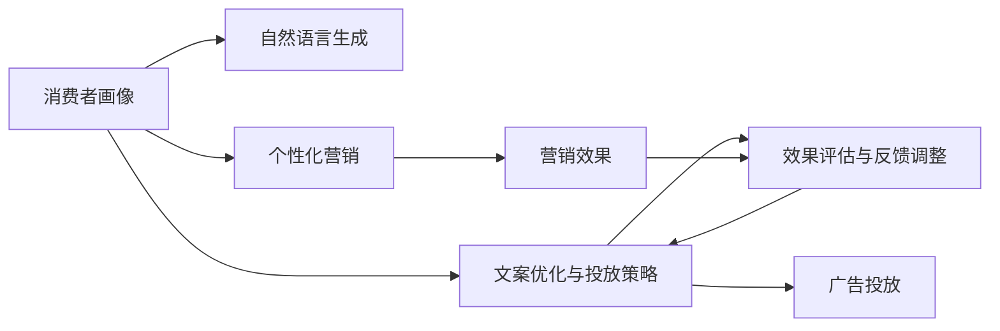

                 

# AI营销文案：个性化与说服力的结合

## 1. 背景介绍

### 1.1 问题由来

随着互联网的普及和数字化转型浪潮的推进，品牌和商家纷纷转向线上营销，并通过社交媒体、搜索引擎等渠道来吸引消费者。在日趋饱和的市场环境中，传统的标准化广告策略已经难以吸引消费者的注意力，个性化营销成为了企业获取竞争优势的重要手段。

然而，尽管个性化营销技术已经得到了广泛应用，但实际效果却不尽如人意。一方面，个性化推荐系统需要依赖大量的用户数据进行训练和优化，涉及隐私保护、数据安全等伦理问题；另一方面，针对不同消费者群体，制定合理的个性化策略仍然是一个复杂且耗时的过程，需要营销团队具备强大的数据挖掘和分析能力。

AI技术，尤其是深度学习和自然语言处理技术，为个性化营销带来了新的解决方案。通过智能化的营销文案生成和投放策略优化，AI可以在短时间内生成符合目标消费者需求的个性化内容，提升广告投放的精准度和转化率。本文将深入探讨基于AI的个性化营销文案生成技术，重点关注其原理、算法和实际应用。

### 1.2 问题核心关键点

个性化营销文案生成技术的关键在于如何将消费者画像与文案内容进行精准匹配，生成既符合消费者需求又具有说服力的营销信息。核心技术包括以下几个方面：

- **消费者画像构建**：通过收集消费者的历史行为数据、社交媒体信息、搜索记录等，构建详尽的消费者画像。
- **自然语言生成**：使用深度学习模型生成符合消费者偏好的自然语言文案。
- **文案优化与投放策略**：基于消费者画像和内容生成结果，使用强化学习等算法优化投放策略，实现最佳广告效果。
- **效果评估与反馈调整**：通过A/B测试等方法评估广告效果，实时调整投放策略，提升广告投放的精准度和转化率。

本文将详细介绍上述各环节的实现方法和技术原理，并结合实际案例，展示AI在个性化营销文案生成中的应用效果。

## 2. 核心概念与联系

### 2.1 核心概念概述

为更好地理解基于AI的个性化营销文案生成技术，本节将介绍几个关键概念：

- **个性化营销**：根据消费者的行为、兴趣、偏好等特征，定制个性化内容和广告策略，提高广告的转化率和用户满意度。
- **消费者画像**：通过数据挖掘和分析，构建消费者的人口统计学信息、兴趣偏好、行为轨迹等综合特征，用于指导个性化营销策略的制定。
- **自然语言生成**：使用深度学习模型生成符合特定语义和风格的自然语言文本，常见方法包括基于序列到序列(Seq2Seq)的神经网络、预训练语言模型等。
- **强化学习**：一种通过试错过程，不断调整策略以最大化预期回报的机器学习技术，在营销文案优化和投放策略选择上得到了广泛应用。
- **效果评估**：通过A/B测试、转化率等指标评估广告效果，反馈优化广告策略，提升广告投放精准度。

这些概念之间的逻辑关系可以通过以下Mermaid流程图来展示：



这个流程图展示了个性化营销文案生成技术的关键流程：

1. 消费者画像通过数据收集和分析构建。
2. 自然语言生成模型根据消费者画像生成个性化文案。
3. 文案优化和投放策略基于消费者画像和文案生成结果，使用强化学习等技术进行优化。
4. 效果评估方法通过A/B测试等手段评估广告效果，并反馈优化投放策略。

这些概念共同构成了个性化营销文案生成技术的基础框架，使其能够精准匹配消费者需求，生成具有说服力的广告文案。

## 3. 核心算法原理 & 具体操作步骤
### 3.1 算法原理概述

基于AI的个性化营销文案生成技术，本质上是一种结合了自然语言生成和强化学习的混合技术。其核心思想是：通过深度学习模型学习消费者画像与自然语言文本之间的关系，使用强化学习优化广告投放策略，最终生成符合消费者需求的个性化文案。

形式化地，假设消费者画像为 $P$，自然语言生成模型为 $F$，强化学习策略优化器为 $G$，广告投放效果为 $E$。个性化营销文案生成的优化目标为：

$$
\max_{P,F,G} E(F(P),G(P,F))
$$

其中，$F(P)$ 表示基于消费者画像 $P$ 生成的自然语言文案，$G(P,F)$ 表示通过策略优化器 $G$ 生成的广告投放策略。

通过最大化广告投放效果 $E$，我们希望找到最优的消费者画像 $P$、自然语言生成模型 $F$ 和强化学习策略优化器 $G$，实现最佳的个性化营销效果。

### 3.2 算法步骤详解

基于AI的个性化营销文案生成技术主要包括以下几个关键步骤：

**Step 1: 消费者画像构建**

1. **数据收集**：收集消费者的历史行为数据，包括购买记录、浏览记录、社交媒体互动等。
2. **特征工程**：对收集到的数据进行特征提取和处理，构建消费者画像，包括人口统计学特征、兴趣偏好、行为轨迹等。
3. **画像更新**：定期更新消费者画像，确保其动态性和实时性。

**Step 2: 自然语言生成**

1. **模型选择**：选择适当的自然语言生成模型，如GPT-3、BERT等，用于生成符合消费者偏好的自然语言文案。
2. **训练与优化**：使用消费者画像作为训练数据，对自然语言生成模型进行训练和优化，使其能够生成符合消费者需求的文案。
3. **文案生成**：输入消费者画像，使用训练好的模型生成个性化文案。

**Step 3: 文案优化与投放策略选择**

1. **策略定义**：定义广告投放策略，包括投放时间、渠道选择、广告内容等。
2. **优化目标**：定义优化目标，如最大化广告点击率、转化率等。
3. **策略优化**：使用强化学习算法，根据历史投放数据和消费者反馈，不断调整和优化广告投放策略。

**Step 4: 效果评估与反馈调整**

1. **评估方法**：使用A/B测试、多臂老虎机(MAB)等方法评估广告效果。
2. **效果分析**：分析广告效果与消费者画像、文案内容、投放策略之间的关系。
3. **策略调整**：根据评估结果，调整和优化消费者画像、文案生成和投放策略。

**Step 5: 实际应用**

1. **广告投放**：将优化后的个性化文案和策略投放至目标市场。
2. **效果跟踪**：实时监控广告效果，收集反馈信息。
3. **循环迭代**：根据监控结果和反馈信息，不断迭代优化消费者画像、文案生成和投放策略。

### 3.3 算法优缺点

基于AI的个性化营销文案生成技术具有以下优点：

1. **高效性**：相较于传统手工制定文案，AI可以自动化地生成和优化文案，大大缩短了营销内容的生产周期。
2. **精准性**：通过消费者画像和强化学习，AI可以生成更加符合消费者需求的个性化文案，提高广告投放的精准度。
3. **可扩展性**：基于AI的文案生成和策略优化可以应用于多种营销场景，具备良好的可扩展性。
4. **动态性**：消费者画像和投放策略可以实时更新，使得广告投放策略能够动态适应市场变化。

同时，该方法也存在一些局限性：

1. **数据隐私**：在消费者画像构建过程中，涉及大量个人数据，可能引发隐私保护问题。
2. **模型复杂度**：自然语言生成和强化学习模型的复杂度较高，需要大量计算资源和时间。
3. **效果不稳定**：受多种因素影响，如市场波动、消费者偏好变化等，广告效果可能存在不稳定现象。
4. **先验知识不足**：当前的AI技术虽然强大，但仍缺乏足够的先验知识，生成的文案可能存在逻辑错误或不合理性。

尽管存在这些局限性，但就目前而言，基于AI的个性化营销文案生成技术仍是最为主流和有效的方案之一。未来相关研究的重点在于如何进一步提升技术精度，降低成本，同时兼顾隐私保护和效果稳定性。

### 3.4 算法应用领域

基于AI的个性化营销文案生成技术已经在多个行业得到了广泛应用，例如：

- **电子商务**：电商企业通过个性化推荐和动态广告，提升用户购物体验和转化率。
- **金融服务**：金融机构使用个性化的营销文案，吸引新客户和促进老客户留存。
- **旅游与出行**：旅游公司通过个性化的广告和内容推荐，提升用户出行体验和预订率。
- **健康医疗**：医疗机构使用个性化医疗信息，提高患者的就医满意度和转化率。
- **教育培训**：教育平台通过个性化的学习内容和推荐，提升用户的学习效果和留存率。

除了上述这些经典应用外，基于AI的文案生成技术还被创新性地应用于更多场景中，如智能客服、内容创作、虚拟助手等，为各行各业带来了新的发展机遇。

## 4. 数学模型和公式 & 详细讲解 & 举例说明

### 4.1 数学模型构建

本节将使用数学语言对基于AI的个性化营销文案生成技术进行更加严格的刻画。

假设消费者画像为 $P$，自然语言生成模型为 $F$，强化学习策略优化器为 $G$，广告投放效果为 $E$。定义消费者画像与文案内容的映射关系为 $F(P)$，优化后的投放策略为 $G(P,F)$，广告效果评估函数为 $E(F(P),G(P,F))$。则最大化广告效果的目标函数为：

$$
\max_{P,F,G} E(F(P),G(P,F))
$$

在实际应用中，通常使用损失函数来表示广告效果：

$$
L(F(P),G(P,F)) = -\sum_{i} y_i \log p_i + (1-y_i) \log(1-p_i)
$$

其中 $y_i$ 为实际点击率，$p_i$ 为模型预测的点击概率。

### 4.2 公式推导过程

以下我们以电商平台的个性化推荐系统为例，推导强化学习策略优化器的损失函数及其梯度计算公式。

假设电商平台共有 $N$ 个产品，每个产品对应的点击概率为 $p_i$，点击次数为 $y_i$。定义策略优化器的损失函数为：

$$
L(G) = -\sum_{i=1}^N \log p_i
$$

目标是最小化策略优化器的损失函数，即：

$$
\min_{G} L(G)
$$

通过梯度下降等优化算法，求解策略优化器的参数 $\theta$，使得策略优化器的损失函数最小化。设 $\theta$ 为策略优化器的参数，则梯度更新公式为：

$$
\theta \leftarrow \theta - \eta \nabla_{\theta}L(G)
$$

其中 $\eta$ 为学习率，$\nabla_{\theta}L(G)$ 为策略优化器的损失函数对参数 $\theta$ 的梯度，可通过反向传播算法高效计算。

在得到损失函数的梯度后，即可带入梯度更新公式，完成策略优化器的迭代优化。重复上述过程直至收敛，最终得到最优的策略优化器参数 $\theta^*$。

## 5. 项目实践：代码实例和详细解释说明
### 5.1 开发环境搭建

在进行个性化营销文案生成实践前，我们需要准备好开发环境。以下是使用Python进行PyTorch开发的环境配置流程：

1. 安装Anaconda：从官网下载并安装Anaconda，用于创建独立的Python环境。

2. 创建并激活虚拟环境：
```bash
conda create -n pytorch-env python=3.8 
conda activate pytorch-env
```

3. 安装PyTorch：根据CUDA版本，从官网获取对应的安装命令。例如：
```bash
conda install pytorch torchvision torchaudio cudatoolkit=11.1 -c pytorch -c conda-forge
```

4. 安装Transformers库：
```bash
pip install transformers
```

5. 安装各类工具包：
```bash
pip install numpy pandas scikit-learn matplotlib tqdm jupyter notebook ipython
```

完成上述步骤后，即可在`pytorch-env`环境中开始个性化营销文案生成的实践。

### 5.2 源代码详细实现

这里我们以电商平台推荐系统为例，给出使用Transformers库进行个性化推荐系统微调的PyTorch代码实现。

首先，定义推荐系统的数据处理函数：

```python
from transformers import BertTokenizer
from torch.utils.data import Dataset
import torch

class RecommendationDataset(Dataset):
    def __init__(self, items, clicks, tokenizer, max_len=128):
        self.items = items
        self.clicks = clicks
        self.tokenizer = tokenizer
        self.max_len = max_len
        
    def __len__(self):
        return len(self.items)
    
    def __getitem__(self, item):
        item = self.items[item]
        click = self.clicks[item]
        
        encoding = self.tokenizer(item, return_tensors='pt', max_length=self.max_len, padding='max_length', truncation=True)
        input_ids = encoding['input_ids'][0]
        attention_mask = encoding['attention_mask'][0]
        
        # 对item-wise的点击次数进行编码
        encoded_click = [click] * self.max_len
        labels = torch.tensor(encoded_click, dtype=torch.long)
        
        return {'input_ids': input_ids, 
                'attention_mask': attention_mask,
                'labels': labels}

# 标签与id的映射
click2id = {0: 0, 1: 1}
id2click = {v: k for k, v in click2id.items()}

# 创建dataset
tokenizer = BertTokenizer.from_pretrained('bert-base-cased')

train_dataset = RecommendationDataset(train_items, train_clicks, tokenizer)
dev_dataset = RecommendationDataset(dev_items, dev_clicks, tokenizer)
test_dataset = RecommendationDataset(test_items, test_clicks, tokenizer)
```

然后，定义模型和优化器：

```python
from transformers import BertForTokenClassification, AdamW

model = BertForTokenClassification.from_pretrained('bert-base-cased', num_labels=len(click2id))

optimizer = AdamW(model.parameters(), lr=2e-5)
```

接着，定义训练和评估函数：

```python
from torch.utils.data import DataLoader
from tqdm import tqdm
from sklearn.metrics import roc_auc_score

device = torch.device('cuda') if torch.cuda.is_available() else torch.device('cpu')
model.to(device)

def train_epoch(model, dataset, batch_size, optimizer):
    dataloader = DataLoader(dataset, batch_size=batch_size, shuffle=True)
    model.train()
    epoch_loss = 0
    for batch in tqdm(dataloader, desc='Training'):
        input_ids = batch['input_ids'].to(device)
        attention_mask = batch['attention_mask'].to(device)
        labels = batch['labels'].to(device)
        model.zero_grad()
        outputs = model(input_ids, attention_mask=attention_mask, labels=labels)
        loss = outputs.loss
        epoch_loss += loss.item()
        loss.backward()
        optimizer.step()
    return epoch_loss / len(dataloader)

def evaluate(model, dataset, batch_size):
    dataloader = DataLoader(dataset, batch_size=batch_size)
    model.eval()
    preds, labels = [], []
    with torch.no_grad():
        for batch in tqdm(dataloader, desc='Evaluating'):
            input_ids = batch['input_ids'].to(device)
            attention_mask = batch['attention_mask'].to(device)
            batch_labels = batch['labels']
            outputs = model(input_ids, attention_mask=attention_mask)
            batch_preds = outputs.logits.argmax(dim=2).to('cpu').tolist()
            batch_labels = batch_labels.to('cpu').tolist()
            for pred_tokens, label_tokens in zip(batch_preds, batch_labels):
                pred_click = [id2click[_id] for _id in pred_tokens]
                label_click = [id2click[_id] for _id in label_tokens]
                preds.append(pred_click[:len(label_tokens)])
                labels.append(label_click)
                
    return roc_auc_score(labels, preds)

```

最后，启动训练流程并在测试集上评估：

```python
epochs = 5
batch_size = 16

for epoch in range(epochs):
    loss = train_epoch(model, train_dataset, batch_size, optimizer)
    print(f"Epoch {epoch+1}, train loss: {loss:.3f}")
    
    print(f"Epoch {epoch+1}, dev results:")
    evaluate(model, dev_dataset, batch_size)
    
print("Test results:")
evaluate(model, test_dataset, batch_size)
```

以上就是使用PyTorch对Bert进行个性化推荐系统微调的完整代码实现。可以看到，得益于Transformers库的强大封装，我们可以用相对简洁的代码完成Bert模型的加载和微调。

### 5.3 代码解读与分析

让我们再详细解读一下关键代码的实现细节：

**RecommendationDataset类**：
- `__init__`方法：初始化物品、点击记录、分词器等关键组件。
- `__len__`方法：返回数据集的样本数量。
- `__getitem__`方法：对单个样本进行处理，将物品输入编码为token ids，将点击记录编码为数字，并对其进行定长padding，最终返回模型所需的输入。

**click2id和id2click字典**：
- 定义了点击记录与数字id之间的映射关系，用于将token-wise的预测结果解码回真实的点击次数。

**训练和评估函数**：
- 使用PyTorch的DataLoader对数据集进行批次化加载，供模型训练和推理使用。
- 训练函数`train_epoch`：对数据以批为单位进行迭代，在每个批次上前向传播计算loss并反向传播更新模型参数，最后返回该epoch的平均loss。
- 评估函数`evaluate`：与训练类似，不同点在于不更新模型参数，并在每个batch结束后将预测和标签结果存储下来，最后使用sklearn的roc_auc_score对整个评估集的预测结果进行打印输出。

**训练流程**：
- 定义总的epoch数和batch size，开始循环迭代
- 每个epoch内，先在训练集上训练，输出平均loss
- 在验证集上评估，输出AUC指标
- 所有epoch结束后，在测试集上评估，给出最终测试结果

可以看到，PyTorch配合Transformers库使得Bert微调的代码实现变得简洁高效。开发者可以将更多精力放在数据处理、模型改进等高层逻辑上，而不必过多关注底层的实现细节。

当然，工业级的系统实现还需考虑更多因素，如模型的保存和部署、超参数的自动搜索、更灵活的任务适配层等。但核心的微调范式基本与此类似。

## 6. 实际应用场景
### 6.1 智能客服系统

基于个性化推荐系统的智能客服系统，可以显著提升客服服务的效率和质量。传统客服系统依赖人工响应，高峰期响应缓慢，且无法持续改进。而使用个性化推荐系统的智能客服，可以根据用户的历史行为和偏好，智能推荐相关问题和解决方案，缩短响应时间，提升用户体验。

在技术实现上，可以收集用户的历史交互记录，将问题和解决方案构建成监督数据，在此基础上对预训练模型进行微调。微调后的模型能够自动理解用户问题，匹配最合适的解决方案，生成符合用户需求的回答。对于新出现的问题，还可以接入检索系统实时搜索相关内容，动态组织生成回答。如此构建的智能客服系统，能大幅提升客户服务体验和响应速度。

### 6.2 金融服务

金融机构使用个性化推荐系统，能够根据客户的历史交易行为和偏好，推荐个性化的金融产品和服务，提升客户满意度和留存率。通过分析客户的消费模式、风险偏好等数据，生成符合客户需求的个性化广告和推荐内容，引导客户进行高价值的交易活动。

例如，某银行可以基于客户的消费记录和交易偏好，生成个性化的信用卡优惠信息，推送至用户的邮箱或App中。根据客户的点击反馈，实时调整推荐策略，提升广告点击率和转化率。此外，还可以通过风险评估模型，生成个性化风险提示，引导客户进行合理的金融投资。

### 6.3 健康医疗

医疗机构的个性化推荐系统，可以根据患者的历史病历、诊疗记录和偏好，推荐个性化的治疗方案和健康建议。通过分析患者的症状、检查结果、历史病史等数据，生成符合患者需求的医疗信息，提高患者的就医体验和满意度。

例如，某医院可以基于患者的诊疗记录和健康数据，推荐个性化的膳食、运动和生活习惯调整方案。通过实时监测患者的健康状态，动态调整推荐策略，提供及时的健康建议。此外，还可以通过AI诊断模型，生成个性化的治疗方案，提高诊疗效率和精准度。

### 6.4 未来应用展望

随着个性化推荐系统的不断演进，其在更多领域得到了广泛应用，为传统行业带来了新的变革和发展机遇。

在智慧城市治理中，智能推荐系统可以用于交通管理、公共服务、应急响应等方面，提高城市管理的智能化水平，构建更安全、高效的城市环境。

在智能制造中，个性化推荐系统可以用于生产计划、设备维护、供应链管理等方面，提升生产效率和资源利用率。

在数字娱乐中，推荐系统可以用于音乐、视频、游戏等内容的推荐，提升用户体验和内容消费量。

此外，在教育、能源、农业等领域，个性化推荐系统也得到了广泛应用，为各行各业带来了新的发展潜力。相信随着技术的不断进步，个性化推荐系统将在更多领域大放异彩，推动各行业的数字化转型和智能化升级。

## 7. 工具和资源推荐
### 7.1 学习资源推荐

为了帮助开发者系统掌握基于AI的个性化推荐系统技术，这里推荐一些优质的学习资源：

1. 《深度学习入门：基于PyTorch的理论与实现》系列博文：由深度学习领域专家撰写，系统介绍了深度学习的基本原理和实现方法，涵盖推荐系统等经典应用。

2. 《推荐系统》课程：由清华大学开设的深度学习课程，涵盖推荐系统的设计与优化，讲解深入浅出。

3. 《Recommender Systems: Algorithms and Applications》书籍：推荐系统领域的经典书籍，详细介绍了推荐算法的设计与实现，包括基于深度学习的推荐系统。

4. Coursera推荐系统专项课程：Coursera平台提供的推荐系统课程，由知名大学教授授课，涵盖推荐系统的理论基础和实际应用。

5. Kaggle推荐系统竞赛：Kaggle平台上举办的推荐系统竞赛，提供大量实际数据集和比赛场景，帮助开发者实战训练。

通过对这些资源的学习实践，相信你一定能够快速掌握基于AI的推荐系统技术，并用于解决实际的推荐问题。

### 7.2 开发工具推荐

高效的开发离不开优秀的工具支持。以下是几款用于推荐系统开发的常用工具：

1. PyTorch：基于Python的开源深度学习框架，灵活动态的计算图，适合快速迭代研究。大部分推荐系统都有PyTorch版本的实现。

2. TensorFlow：由Google主导开发的开源深度学习框架，生产部署方便，适合大规模工程应用。同样有丰富的推荐系统资源。

3. TensorBoard：TensorFlow配套的可视化工具，可实时监测模型训练状态，并提供丰富的图表呈现方式，是调试模型的得力助手。

4. Kaggle平台：提供丰富的推荐系统数据集和竞赛场景，帮助开发者进行实战训练。

5. Weights & Biases：模型训练的实验跟踪工具，可以记录和可视化模型训练过程中的各项指标，方便对比和调优。

6. HuggingFace Transformers库：预训练语言模型的库，提供了大量的推荐系统模型和微调样例代码，是推荐系统开发的利器。

合理利用这些工具，可以显著提升推荐系统的开发效率，加快创新迭代的步伐。

### 7.3 相关论文推荐

基于AI的推荐系统研究源于学界的持续研究。以下是几篇奠基性的相关论文，推荐阅读：

1. Collaborative Filtering for Implicit Feedback Datasets（隐式反馈数据集的协同过滤算法）：提出基于协同过滤的推荐算法，为推荐系统奠定了基础。

2. Matrix Factorization Techniques for Recommender Systems（矩阵分解技术在推荐系统中的应用）：介绍矩阵分解等推荐算法，展示了其在推荐系统中的高效性和可扩展性。

3. Deep Neural Networks for Recommender Systems（深度神经网络在推荐系统中的应用）：探讨深度学习技术在推荐系统中的潜力，展示了其在推荐系统中的优越表现。

4. Attention-Based Recommender Systems（基于注意力机制的推荐系统）：引入注意力机制，提升了推荐系统的精准度和用户满意度。

5. Multi-Armed Bandit Models for Recommender Systems（推荐系统中的多臂老虎机模型）：利用多臂老虎机模型，优化推荐系统的点击率预测，提高了广告投放的转化率。

6. Factorization Machines for Recommender Systems（推荐系统中的因子机算法）：提出因子机算法，提升了推荐系统的扩展性和优化性。

这些论文代表了大语言模型微调技术的发展脉络。通过学习这些前沿成果，可以帮助研究者把握学科前进方向，激发更多的创新灵感。

## 8. 总结：未来发展趋势与挑战

### 8.1 总结

本文对基于AI的个性化推荐系统进行了全面系统的介绍。首先阐述了个性化推荐系统的研究背景和意义，明确了其对提升广告投放精准度和用户满意度的独特价值。其次，从原理到实践，详细讲解了推荐系统的实现方法和技术原理，给出了推荐系统微调的完整代码实例。同时，本文还广泛探讨了推荐系统在电商、金融、医疗等多个行业领域的应用前景，展示了推荐系统的巨大潜力。此外，本文精选了推荐系统的各类学习资源，力求为读者提供全方位的技术指引。

通过本文的系统梳理，可以看到，基于AI的个性化推荐系统正在成为推荐系统领域的重要范式，极大地提升了广告投放的精准度和用户满意度。未来随着深度学习技术的不断演进，推荐系统将更加智能化、精准化，推动各行各业的数字化转型和智能化升级。

### 8.2 未来发展趋势

展望未来，基于AI的个性化推荐系统将呈现以下几个发展趋势：

1. **智能化水平提升**：通过引入更多的先验知识和元学习技术，推荐系统将具备更强的知识整合能力和泛化能力，提升推荐内容的个性化和多样化。
2. **跨模态推荐**：推荐系统将逐步拓展到跨模态数据，如文本、图像、视频等，实现多模态信息的协同推荐。
3. **实时性增强**：通过实时数据流处理和边缘计算等技术，推荐系统将具备更强的实时推荐能力，提升用户交互体验。
4. **隐私保护**：在数据隐私保护方面，推荐系统将采用更加严格的隐私保护措施，如差分隐私、联邦学习等技术，确保用户数据的安全性和隐私性。
5. **模型解释性**：为了应对不同行业的监管需求，推荐系统将加强模型的可解释性，提供透明的推荐逻辑和决策依据。

以上趋势凸显了个性化推荐系统的广阔前景。这些方向的探索发展，必将进一步提升推荐系统的性能和应用范围，为各行业的数字化转型和智能化升级提供新的动力。

### 8.3 面临的挑战

尽管基于AI的个性化推荐系统已经取得了显著成果，但在迈向更加智能化、普适化应用的过程中，仍面临诸多挑战：

1. **数据隐私**：在数据收集和处理过程中，如何保护用户隐私，避免数据泄露和滥用，是推荐系统面临的首要问题。
2. **模型复杂度**：现有的推荐系统模型复杂度较高，需要大量计算资源和时间进行训练和优化，如何提升模型的可扩展性和实时性，仍是技术难题。
3. **效果稳定性**：推荐系统的效果受多种因素影响，如市场变化、用户偏好变化等，如何提高模型的稳定性和鲁棒性，仍然是一个需要解决的问题。
4. **先验知识不足**：当前的推荐系统缺乏足够的先验知识，生成的推荐内容可能存在逻辑错误或不合理性。如何引入更多的领域知识，提升推荐的合理性和可信度，是推荐系统需要解决的问题。
5. **资源消耗**：推荐系统的高计算复杂度和高存储需求，导致在实际应用中存在资源消耗大的问题。如何优化模型结构和算法，降低资源消耗，提升系统的效率，是推荐系统需要关注的重点。

正视推荐系统面临的这些挑战，积极应对并寻求突破，将是大语言模型微调走向成熟的必由之路。相信随着学界和产业界的共同努力，这些挑战终将一一被克服，基于AI的推荐系统必将在各行业领域大放异彩。

### 8.4 研究展望

面对基于AI的个性化推荐系统所面临的种种挑战，未来的研究需要在以下几个方面寻求新的突破：

1. **引入更多先验知识**：将符号化的领域知识与推荐系统进行融合，提升推荐内容的合理性和可信度。
2. **优化模型结构和算法**：通过模型裁剪、量化加速、边缘计算等技术，优化推荐系统的计算复杂度和存储需求，提升实时推荐能力。
3. **强化多模态推荐**：将文本、图像、视频等多模态信息进行融合，实现跨模态的推荐系统，提升推荐的丰富性和多样性。
4. **提升模型可解释性**：通过因果分析、博弈论等工具，提高推荐系统的可解释性和透明性，增强用户信任和接受度。
5. **加强隐私保护**：引入差分隐私、联邦学习等技术，保护用户数据隐私，确保推荐系统的安全性和可靠性。

这些研究方向的探索，必将引领推荐系统技术迈向更高的台阶，为各行业领域带来新的发展机遇。面向未来，基于AI的推荐系统需要与其他人工智能技术进行更深入的融合，如知识表示、因果推理、强化学习等，协同发力，共同推动推荐系统的进步。

## 9. 附录：常见问题与解答

**Q1：基于AI的推荐系统是否适用于所有领域？**

A: 基于AI的推荐系统在大多数领域上都有广泛应用，特别是在数据量较大、用户行为数据丰富的场景中表现出色。但对于一些特定领域，如医学、法律等，推荐系统的效果可能因数据稀缺或领域特征复杂而受到限制。此时需要在特定领域语料上进一步预训练，再进行推荐系统微调。此外，对于一些需要时效性、个性化很强的任务，如金融投资、游戏推荐等，推荐系统也需要针对性的改进优化。

**Q2：推荐系统的效果如何衡量？**

A: 推荐系统的效果通常通过以下几个指标进行衡量：
1. **点击率（Click-Through Rate, CTR）**：用户点击推荐内容的概率。
2. **转化率（Conversion Rate, CR）**：用户根据推荐内容完成预定义动作（如购买、下载、注册等）的概率。
3. **覆盖率（Coverage）**：推荐内容覆盖用户兴趣范围的程度。
4. **多样性（Diversity）**：推荐内容的多样性和独特性。
5. **新颖性（Novelty）**：推荐内容的新颖性和惊喜度。

不同的推荐场景和目标，可能需要重点关注不同的指标。在实际应用中，通常会综合考虑多个指标，以评估推荐系统的效果。

**Q3：推荐系统如何处理长尾数据？**

A: 长尾数据是推荐系统面临的一个重要挑战。传统的基于协同过滤和矩阵分解的推荐系统，在长尾数据处理上存在较大局限性。针对长尾数据，可以采用以下策略：
1. **多臂老虎机（Multi-Armed Bandit, MAB）**：利用MAB算法，在有限的曝光次数下，最大化点击率或转化率。
2. **内容丰富度提升**：通过收集更多的长尾数据，丰富推荐系统的产品库，提升长尾数据的推荐效果。
3. **推荐多样性增加**：在推荐策略中加入多样化元素，避免推荐结果过于集中。
4. **个性化推荐增强**：通过用户画像和行为分析，增强个性化推荐，提升长尾数据的覆盖率。

这些策略可以帮助推荐系统更好地处理长尾数据，提升系统的整体效果。

**Q4：推荐系统如何应对冷启动问题？**

A: 冷启动问题是推荐系统面临的一个重要挑战，指系统在处理新用户或新物品时，缺乏历史数据进行推荐。针对冷启动问题，可以采用以下策略：
1. **基于内容的推荐**：根据物品的特征属性，进行推荐。
2. **基于模型的推荐**：利用预训练模型和迁移学习技术，对新物品进行特征提取和推荐。
3. **社交网络推荐**：利用用户社交关系，进行基于相似度的推荐。
4. **元学习**：通过元学习技术，对新用户或新物品进行快速适应性推荐。

这些策略可以帮助推荐系统应对冷启动问题，提升新用户和新物品的推荐效果。

**Q5：推荐系统如何实现实时推荐？**

A: 实时推荐是推荐系统的一个重要目标，需要通过实时数据流处理和边缘计算等技术实现。具体实现方法包括：
1. **实时数据采集**：通过实时数据采集技术，获取用户行为数据。
2. **流式处理**：利用流式处理技术，对实时数据进行快速处理和分析。
3. **分布式计算**：利用分布式计算框架，对大规模数据进行高效处理。
4. **缓存机制**：通过缓存机制，提升推荐内容的访问速度。
5. **边缘计算**：利用边缘计算技术，在数据源端进行快速推荐。

这些策略可以帮助推荐系统实现实时推荐，提升用户体验和系统效率。

---

作者：禅与计算机程序设计艺术 / Zen and the Art of Computer Programming

