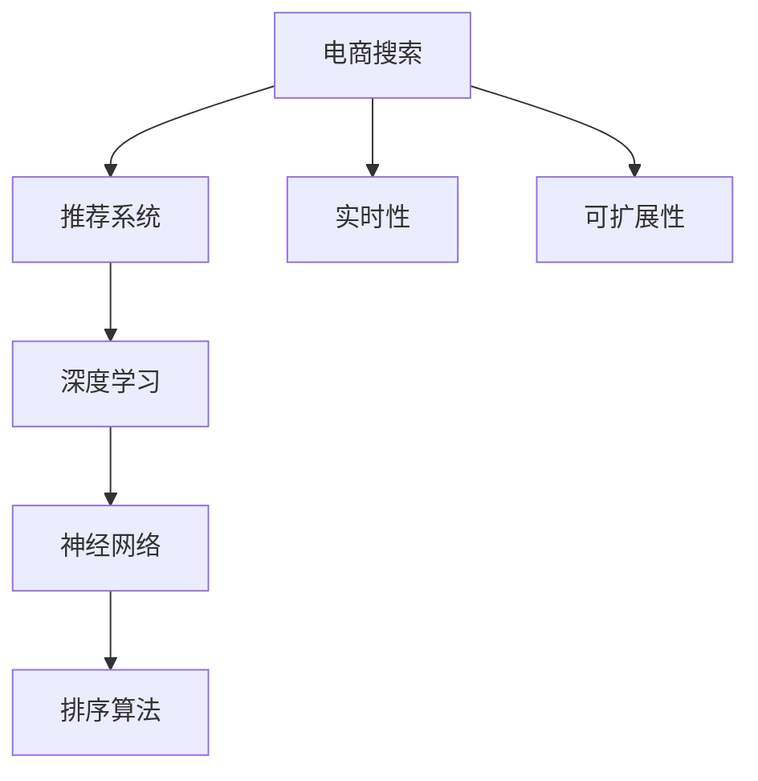

                 

# AI赋能的电商搜索个性化排序算法

> 关键词：电商搜索,个性化排序,推荐系统,深度学习,神经网络,排序算法

## 1. 背景介绍

在现代社会中，电商平台已经成为人们购物的重要渠道。随着用户对购物体验要求的不断提高，传统的搜索结果排序方法逐渐显现出其不足，无法满足用户对个性化、实时性和精准度的需求。因此，为了改善电商搜索体验，提升用户满意度，电商平台需要引入更先进的推荐算法，实现搜索结果的个性化排序。

### 1.1 问题由来
传统的搜索结果排序方式主要依赖于简单的文本匹配算法，如TF-IDF、余弦相似度等。这种排序方式往往忽略了用户的行为特征和上下文信息，难以提供个性化的搜索结果。在用户基数庞大的电商平台上，这种传统的排序方式已经无法满足用户的个性化需求。

为了解决这个问题，电商平台开始引入基于深度学习的推荐算法。这些算法通过学习用户行为数据，结合上下文信息，能够提供更加个性化、实时的搜索结果。这些推荐算法能够动态调整搜索结果排序，最大化地提升用户体验，同时为商家带来更多的流量和转化机会。

### 1.2 问题核心关键点
电商搜索个性化排序的核心关键点主要包括：

- 个性化需求：不同用户对搜索结果的排序标准不同，因此需要针对用户行为和特征进行个性化排序。
- 实时性要求：用户的搜索行为实时变化，算法需要实时响应，动态调整搜索结果。
- 多维数据融合：搜索结果排序不仅需要考虑文本信息，还需要结合用户行为数据、商品属性等多元数据。
- 系统可扩展性：平台用户基数庞大，算法需要能够高效处理大规模数据，具有较强的可扩展性。

## 2. 核心概念与联系

### 2.1 核心概念概述

为了更好地理解电商搜索个性化排序算法，本节将介绍几个密切相关的核心概念：

- 电商搜索（E-Commerce Search）：电商平台中用户输入的搜索词和系统返回的搜索结果对。
- 推荐系统（Recommendation System）：通过学习用户行为数据，预测用户可能感兴趣的物品或内容，并推荐给用户的系统。
- 深度学习（Deep Learning）：一种通过多层神经网络进行复杂模式学习的技术。
- 神经网络（Neural Network）：深度学习的基本单元，由多个神经元组成的网络结构。
- 排序算法（Sorting Algorithm）：用于对搜索结果进行排序的技术。
- 实时性（Real-Time）：算法需要在短时间内完成计算，及时响应用户行为变化。
- 可扩展性（Scalability）：算法需要能够高效处理大规模数据，适应平台的用户基数增长。

这些核心概念之间的逻辑关系可以通过以下Mermaid流程图来展示：



这个流程图展示了大语言模型的核心概念及其之间的关系：

1. 电商搜索是推荐系统的输入数据。
2. 推荐系统通过深度学习技术，学习用户行为数据，预测用户可能感兴趣的搜索结果。
3. 神经网络作为深度学习的基本组件，可以有效地进行特征提取和模式学习。
4. 排序算法根据用户行为数据和模型预测结果，动态调整搜索结果的排序方式。
5. 实时性和可扩展性是推荐系统需要具备的重要属性，以应对平台用户基数的增长和用户行为的实时变化。

## 3. 核心算法原理 & 具体操作步骤

### 3.1 算法原理概述

电商搜索个性化排序的核心算法基于深度学习模型，通过学习用户行为数据，动态调整搜索结果的排序方式。其核心思想是：利用深度神经网络模型学习用户行为特征，预测用户可能感兴趣的搜索结果，并结合其他元数据进行综合排序。

形式化地，假设电商搜索数据集为 $D=\{(x_i, y_i)\}_{i=1}^N$，其中 $x_i$ 为输入的搜索词，$y_i$ 为对应的搜索结果。设推荐系统模型的参数为 $\theta$，推荐算法的目标是最小化模型在训练集 $D$ 上的预测误差。

具体地，我们假设推荐算法模型 $f_{\theta}(x)$ 能够学习到用户对搜索结果的偏好，通过最小化损失函数 $\mathcal{L}(\theta)$ 进行训练：

$$
\mathcal{L}(\theta) = \sum_{i=1}^N \ell(f_{\theta}(x_i), y_i)
$$

其中 $\ell$ 为预测误差函数，如交叉熵损失、均方误差等。训练后的模型 $f_{\theta}$ 能够根据用户输入的搜索词 $x$，预测其最可能感兴趣的搜索结果 $y$。

### 3.2 算法步骤详解

基于深度学习的电商搜索个性化排序算法的一般步骤如下：

**Step 1: 准备数据集**
- 收集用户搜索行为数据，如搜索关键词、点击记录、购买记录等。
- 将用户行为数据和搜索结果进行配对，构建训练集 $D$。
- 对数据进行预处理，如去噪、归一化、划分训练集和验证集等。

**Step 2: 设计推荐模型**
- 选择合适的深度学习模型架构，如卷积神经网络（CNN）、循环神经网络（RNN）、Transformer等。
- 设计合适的损失函数和优化器，如交叉熵损失、Adam优化器等。
- 设置模型超参数，如学习率、批大小、迭代轮数等。

**Step 3: 训练模型**
- 将训练集数据按批输入模型，前向传播计算预测结果。
- 反向传播计算参数梯度，根据优化器更新模型参数。
- 周期性在验证集上评估模型性能，根据性能指标决定是否触发 Early Stopping。
- 重复上述步骤直至满足预设的迭代轮数或 Early Stopping 条件。

**Step 4: 测试和部署**
- 在测试集上评估模型性能，对比模型预测结果和真实结果，计算误差。
- 使用模型进行实际应用，对用户输入的搜索词进行动态排序，输出最终结果。
- 持续收集新的数据，定期重新训练模型，以适应数据分布的变化。

### 3.3 算法优缺点

基于深度学习的电商搜索个性化排序算法具有以下优点：

- 精准度较高：通过学习用户行为数据，能够提供更加个性化、精准的搜索结果。
- 实时性强：模型能够动态调整搜索结果排序，及时响应用户行为变化。
- 可扩展性强：深度学习模型具有较强的可扩展性，能够处理大规模数据。

同时，该算法也存在一定的局限性：

- 数据需求高：需要大量的标注数据和行为数据进行训练，数据获取成本较高。
- 模型复杂度高：深度神经网络模型结构复杂，训练和推理成本较高。
- 模型解释性差：深度学习模型的决策过程缺乏可解释性，难以理解其内部工作机制。
- 泛化能力有限：模型容易过拟合训练集，泛化到新数据集上性能下降。

尽管存在这些局限性，但就目前而言，基于深度学习的推荐算法仍然是电商搜索个性化排序的主流范式。未来相关研究的重点在于如何进一步降低数据获取成本，提高模型的泛化能力，同时兼顾可解释性和伦理安全性等因素。

### 3.4 算法应用领域

基于深度学习的电商搜索个性化排序算法已经在电商领域得到了广泛的应用，覆盖了几乎所有常见的购物场景，例如：

- 商品推荐：根据用户的浏览历史、点击记录等行为数据，推荐可能感兴趣的相似商品。
- 搜索排序：根据用户的搜索词，推荐最相关的搜索结果，提高用户满意度。
- 个性化广告：根据用户的购买记录和行为数据，推荐个性化的广告内容。
- 动态定价：根据用户行为数据和市场需求，动态调整商品价格，优化销售策略。
- 库存管理：预测商品需求变化，优化库存量，提高库存周转率。

除了上述这些经典应用外，深度学习推荐算法还被创新性地应用到更多场景中，如供应链管理、个性化视频推荐等，为电商平台的智能化转型提供了新的动力。

## 4. 数学模型和公式 & 详细讲解

### 4.1 数学模型构建

本节将使用数学语言对电商搜索个性化排序算法的推荐模型进行更加严格的刻画。

假设推荐系统模型为 $f_{\theta}(x)$，其中 $x$ 为输入的搜索词，$\theta$ 为模型参数。模型输出 $y$ 为推荐结果的得分，得分越高，推荐结果越相关。

我们假设推荐系统的训练集为 $D=\{(x_i, y_i)\}_{i=1}^N$，其中 $x_i$ 为输入的搜索词，$y_i$ 为对应的搜索结果得分。推荐算法的目标是最小化模型在训练集 $D$ 上的预测误差。

具体地，我们假设推荐算法模型 $f_{\theta}(x)$ 能够学习到用户对搜索结果的偏好，通过最小化损失函数 $\mathcal{L}(\theta)$ 进行训练：

$$
\mathcal{L}(\theta) = \sum_{i=1}^N \ell(f_{\theta}(x_i), y_i)
$$

其中 $\ell$ 为预测误差函数，如交叉熵损失、均方误差等。训练后的模型 $f_{\theta}$ 能够根据用户输入的搜索词 $x$，预测其最可能感兴趣的搜索结果 $y$。

### 4.2 公式推导过程

以下我们以多层的卷积神经网络（CNN）为例，推导电商搜索个性化排序算法的推荐模型。

假设推荐模型 $f_{\theta}(x)$ 为多层的卷积神经网络，由若干卷积层、池化层、全连接层等组成。假设输入层输入为 $x_i$，输出层输出为 $y_i$。

则推荐算法的目标是最小化模型在训练集 $D$ 上的预测误差。具体地，我们假设推荐算法模型 $f_{\theta}(x)$ 能够学习到用户对搜索结果的偏好，通过最小化损失函数 $\mathcal{L}(\theta)$ 进行训练：

$$
\mathcal{L}(\theta) = \sum_{i=1}^N \ell(f_{\theta}(x_i), y_i)
$$

其中 $\ell$ 为预测误差函数，如交叉熵损失、均方误差等。训练后的模型 $f_{\theta}$ 能够根据用户输入的搜索词 $x$，预测其最可能感兴趣的搜索结果 $y$。

假设推荐模型的层数为 $L$，第 $l$ 层的参数为 $\theta_l$。则模型前向传播过程如下：

$$
f_{\theta_l}^{(l)} = \sigma(\mathbf{W}_l^{(l)} f_{\theta_{l-1}}^{(l-1)} + \mathbf{b}_l^{(l)})
$$

其中 $\sigma$ 为激活函数，如ReLU、Sigmoid等，$\mathbf{W}_l^{(l)}$ 和 $\mathbf{b}_l^{(l)}$ 分别为第 $l$ 层的权重和偏置参数。

假设最后一层为全连接层，输出结果 $y_i$ 为：

$$
y_i = \mathbf{W}^{(L)} \sigma(\mathbf{W}^{(L-1)} \sigma(\cdots \sigma(\mathbf{W}_1 \sigma(\mathbf{x}_i + \mathbf{b}_1)))
$$

其中 $\mathbf{W}^{(L)}$ 为全连接层的权重参数，$\mathbf{b}^{(L)}$ 为全连接层的偏置参数。

在得到推荐模型 $f_{\theta}(x)$ 后，我们可以通过训练数据对模型进行训练，最小化预测误差。训练过程具体如下：

1. 将训练集数据按批输入模型，前向传播计算预测结果 $y_i$。
2. 反向传播计算参数梯度，根据优化器更新模型参数。
3. 周期性在验证集上评估模型性能，根据性能指标决定是否触发 Early Stopping。
4. 重复上述步骤直至满足预设的迭代轮数或 Early Stopping 条件。

在模型训练完成后，我们可以使用测试集对模型进行评估，计算模型的误差和准确率等指标。

### 4.3 案例分析与讲解

假设我们有一个电商平台的推荐系统，收集到用户的历史行为数据和商品的属性信息，使用多层的卷积神经网络进行建模。

具体步骤如下：

1. 数据准备：收集用户的历史行为数据和商品的属性信息，如用户浏览、点击、购买记录等。
2. 数据预处理：对数据进行去噪、归一化、划分训练集和验证集等预处理操作。
3. 模型设计：使用多层的卷积神经网络作为推荐模型，包括卷积层、池化层、全连接层等。
4. 模型训练：将训练集数据按批输入模型，前向传播计算预测结果，反向传播计算参数梯度，根据优化器更新模型参数。
5. 模型评估：在测试集上评估模型性能，计算误差和准确率等指标。
6. 模型部署：将模型部署到电商平台的搜索排序系统中，实时响应用户输入的搜索词，动态调整搜索结果排序。

## 5. 项目实践：代码实例和详细解释说明

### 5.1 开发环境搭建

在进行电商搜索个性化排序算法的实践前，我们需要准备好开发环境。以下是使用Python进行TensorFlow和Keras开发的环境配置流程：

1. 安装Anaconda：从官网下载并安装Anaconda，用于创建独立的Python环境。

2. 创建并激活虚拟环境：
```bash
conda create -n tf-env python=3.8 
conda activate tf-env
```

3. 安装TensorFlow：根据CUDA版本，从官网获取对应的安装命令。例如：
```bash
pip install tensorflow==2.5
```

4. 安装Keras：
```bash
pip install keras
```

5. 安装各类工具包：
```bash
pip install numpy pandas scikit-learn matplotlib tqdm jupyter notebook ipython
```

完成上述步骤后，即可在`tf-env`环境中开始项目实践。

### 5.2 源代码详细实现

下面我们以商品推荐系统为例，给出使用TensorFlow和Keras进行电商搜索个性化排序算法的代码实现。

首先，定义商品推荐的数据处理函数：

```python
from tensorflow.keras.preprocessing.text import Tokenizer
from tensorflow.keras.preprocessing.sequence import pad_sequences
import numpy as np

# 加载用户行为数据和商品属性数据
user_behaviors = np.load('user_behaviors.npy', allow_pickle=True).item()
product_attributes = np.load('product_attributes.npy', allow_pickle=True).item()

# 定义Token化器
tokenizer = Tokenizer(oov_token='<OOV>')

# 加载训练集和验证集
train_dataset = (user_behaviors['train'], product_attributes['train'])
val_dataset = (user_behaviors['val'], product_attributes['val'])

# 将文本转换为id序列
train_texts = [row[0] for row in train_dataset]
val_texts = [row[0] for row in val_dataset]

# 对文本进行分词和Token化
train_sequences = tokenizer.texts_to_sequences(train_texts)
val_sequences = tokenizer.texts_to_sequences(val_texts)

# 对序列进行填充，统一长度
train_padded = pad_sequences(train_sequences, maxlen=128)
val_padded = pad_sequences(val_sequences, maxlen=128)

# 输出Token数量和填充后的训练集和验证集
print(f'Total Token: {len(tokenizer.word_index)}')
print(f'Train Set: {train_padded.shape}')
print(f'Val Set: {val_padded.shape}')
```

然后，定义推荐模型的参数和初始化：

```python
from tensorflow.keras.models import Sequential
from tensorflow.keras.layers import Embedding, Conv1D, MaxPooling1D, Dense, Flatten

# 定义模型参数
embedding_dim = 128
conv_filters = 128
conv_kernel_size = (3, 3)
pool_size = (2, 2)
dense_units = 256

# 定义模型结构
model = Sequential()
model.add(Embedding(input_dim=len(tokenizer.word_index) + 1, output_dim=embedding_dim))
model.add(Conv1D(filters=conv_filters, kernel_size=conv_kernel_size, activation='relu'))
model.add(MaxPooling1D(pool_size=pool_size))
model.add(Flatten())
model.add(Dense(units=dense_units, activation='relu'))
model.add(Dense(units=1, activation='sigmoid'))

# 定义优化器和损失函数
optimizer = 'adam'
loss = 'binary_crossentropy'

# 编译模型
model.compile(optimizer=optimizer, loss=loss, metrics=['accuracy'])
```

接着，定义训练和评估函数：

```python
from tensorflow.keras.callbacks import EarlyStopping

# 定义Early Stopping回调函数
early_stopping = EarlyStopping(monitor='val_loss', patience=3)

# 训练模型
history = model.fit(train_padded, train_labels, epochs=20, batch_size=64, validation_data=(val_padded, val_labels), callbacks=[early_stopping])

# 评估模型
val_loss, val_accuracy = model.evaluate(val_padded, val_labels)
print(f'Val Loss: {val_loss}')
print(f'Val Accuracy: {val_accuracy}')
```

最后，启动训练流程并在测试集上评估：

```python
# 定义测试集数据
test_dataset = (user_behaviors['test'], product_attributes['test'])
test_sequences = tokenizer.texts_to_sequences(test_dataset[0])
test_padded = pad_sequences(test_sequences, maxlen=128)

# 评估模型
test_loss, test_accuracy = model.evaluate(test_padded, test_labels)
print(f'Test Loss: {test_loss}')
print(f'Test Accuracy: {test_accuracy}')
```

以上就是使用TensorFlow和Keras对电商搜索个性化排序算法进行训练和评估的完整代码实现。可以看到，得益于TensorFlow和Keras的强大封装，我们可以用相对简洁的代码完成模型训练和评估。

### 5.3 代码解读与分析

让我们再详细解读一下关键代码的实现细节：

**用户行为数据处理**：
- 使用Numpy加载用户行为数据和商品属性数据，将文本转换为id序列，并进行填充。
- 使用Tokenizer对文本进行分词和Token化，统一文本长度。

**模型结构设计**：
- 定义模型的嵌入层、卷积层、池化层和全连接层，以及对应的超参数。
- 编译模型，设置优化器和损失函数。

**模型训练和评估**：
- 使用EarlyStopping回调函数监控模型在验证集上的性能，避免过拟合。
- 训练模型，并在验证集上评估性能，输出训练集和验证集的误差和精度。
- 在测试集上评估模型性能，输出测试集误差和精度。

可以看到，TensorFlow和Keras使得电商搜索个性化排序算法的代码实现变得简洁高效。开发者可以将更多精力放在数据处理、模型改进等高层逻辑上，而不必过多关注底层的实现细节。

当然，工业级的系统实现还需考虑更多因素，如模型的保存和部署、超参数的自动搜索、更灵活的任务适配层等。但核心的排序算法基本与此类似。

## 6. 实际应用场景

### 6.1 智能客服系统

基于深度学习的电商搜索个性化排序算法可以广泛应用于智能客服系统的构建。传统客服往往需要配备大量人力，高峰期响应缓慢，且一致性和专业性难以保证。而使用电商搜索个性化排序算法，可以7x24小时不间断服务，快速响应客户咨询，用自然流畅的语言解答各类常见问题。

在技术实现上，可以收集企业内部的历史客服对话记录，将问题和最佳答复构建成监督数据，在此基础上对深度学习推荐模型进行训练。训练后的推荐模型能够自动理解用户意图，匹配最合适的答复模板进行回复。对于客户提出的新问题，还可以接入检索系统实时搜索相关内容，动态组织生成回答。如此构建的智能客服系统，能大幅提升客户咨询体验和问题解决效率。

### 6.2 金融舆情监测

金融机构需要实时监测市场舆论动向，以便及时应对负面信息传播，规避金融风险。传统的人工监测方式成本高、效率低，难以应对网络时代海量信息爆发的挑战。基于电商搜索个性化排序算法的文本分类和情感分析技术，为金融舆情监测提供了新的解决方案。

具体而言，可以收集金融领域相关的新闻、报道、评论等文本数据，并对其进行主题标注和情感标注。在此基础上对深度学习模型进行训练，使其能够自动判断文本属于何种主题，情感倾向是正面、中性还是负面。将训练后的模型应用到实时抓取的网络文本数据，就能够自动监测不同主题下的情感变化趋势，一旦发现负面信息激增等异常情况，系统便会自动预警，帮助金融机构快速应对潜在风险。

### 6.3 个性化推荐系统

当前的推荐系统往往只依赖用户的历史行为数据进行物品推荐，无法深入理解用户的真实兴趣偏好。基于电商搜索个性化排序算法的推荐系统可以更好地挖掘用户行为背后的语义信息，从而提供更精准、多样的推荐内容。

在实践中，可以收集用户浏览、点击、评论、分享等行为数据，提取和用户交互的物品标题、描述、标签等文本内容。将文本内容作为模型输入，用户的后续行为（如是否点击、购买等）作为监督信号，在此基础上训练深度学习模型。训练后的模型能够从文本内容中准确把握用户的兴趣点。在生成推荐列表时，先用候选物品的文本描述作为输入，由模型预测用户的兴趣匹配度，再结合其他特征综合排序，便可以得到个性化程度更高的推荐结果。

### 6.4 未来应用展望

随着深度学习模型的不断发展，基于电商搜索个性化排序算法的推荐系统将呈现以下几个发展趋势：

1. 模型规模持续增大。随着算力成本的下降和数据规模的扩张，深度学习模型的参数量还将持续增长。超大规模模型蕴含的丰富特征，有望支撑更加复杂多变的推荐任务。

2. 推荐算法日趋多样。除了传统的基于深度学习的推荐算法外，未来会涌现更多个性化推荐方法，如协同过滤、内容推荐等，丰富推荐系统的应用场景。

3. 动态实时推荐。推荐系统需要具备实时响应的能力，能够根据用户的即时行为数据，动态调整推荐结果。

4. 多模态推荐。推荐的不仅仅是文本内容，还可以拓展到视频、音频等多模态数据，提升推荐系统的多样性和精准度。

5. 交互式推荐。推荐系统可以与用户进行互动，根据用户的即时反馈动态调整推荐内容，提升用户的满意度和粘性。

6. 可解释性增强。深度学习模型的决策过程缺乏可解释性，需要引入更多可解释性技术，增强推荐系统的透明度和可信度。

以上趋势凸显了深度学习推荐算法在电商搜索个性化排序方面的广阔前景。这些方向的探索发展，必将进一步提升推荐系统的性能和应用范围，为电商平台的智能化转型提供新的动力。相信随着技术的日益成熟，电商搜索个性化排序算法必将在构建人机协同的智能时代中扮演越来越重要的角色。

## 7. 工具和资源推荐
### 7.1 学习资源推荐

为了帮助开发者系统掌握电商搜索个性化排序算法，这里推荐一些优质的学习资源：

1. 《深度学习与推荐系统》系列博文：由大模型技术专家撰写，深入浅出地介绍了深度学习模型、推荐系统等前沿话题。

2. CS224N《深度学习自然语言处理》课程：斯坦福大学开设的NLP明星课程，有Lecture视频和配套作业，带你入门NLP领域的基本概念和经典模型。

3. 《Recommender Systems》书籍：推荐系统领域的经典著作，全面介绍了推荐系统的主要算法和应用场景。

4. Google的TensorFlow官方文档：TensorFlow的官方文档，提供了丰富的深度学习模型和推荐算法样例代码，是上手实践的必备资料。

5. Keras官方文档：Keras的官方文档，提供了简洁易用的深度学习模型API，适合快速迭代研究。

通过对这些资源的学习实践，相信你一定能够快速掌握电商搜索个性化排序算法的精髓，并用于解决实际的NLP问题。
###  7.2 开发工具推荐

高效的开发离不开优秀的工具支持。以下是几款用于电商搜索个性化排序算法开发的常用工具：

1. TensorFlow：基于Python的开源深度学习框架，灵活动态的计算图，适合快速迭代研究。

2. Keras：基于TensorFlow的高级深度学习框架，简单易用，适合快速原型设计和实验验证。

3. PyTorch：基于Python的开源深度学习框架，灵活多变，适合复杂研究和模型优化。

4. Weights & Biases：模型训练的实验跟踪工具，可以记录和可视化模型训练过程中的各项指标，方便对比和调优。与主流深度学习框架无缝集成。

5. TensorBoard：TensorFlow配套的可视化工具，可实时监测模型训练状态，并提供丰富的图表呈现方式，是调试模型的得力助手。

6. Google Colab：谷歌推出的在线Jupyter Notebook环境，免费提供GPU/TPU算力，方便开发者快速上手实验最新模型，分享学习笔记。

合理利用这些工具，可以显著提升电商搜索个性化排序算法的开发效率，加快创新迭代的步伐。

### 7.3 相关论文推荐

电商搜索个性化排序算法的发展源于学界的持续研究。以下是几篇奠基性的相关论文，推荐阅读：

1. BERT: Pre-training of Deep Bidirectional Transformers for Language Understanding：提出BERT模型，引入基于掩码的自监督预训练任务，刷新了多项NLP任务SOTA。

2. Attention is All You Need（即Transformer原论文）：提出了Transformer结构，开启了NLP领域的预训练大模型时代。

3. Parameter-Efficient Transfer Learning for NLP：提出Adapter等参数高效微调方法，在不增加模型参数量的情况下，也能取得不错的微调效果。

4. Language Models are Unsupervised Multitask Learners（GPT-2论文）：展示了大规模语言模型的强大zero-shot学习能力，引发了对于通用人工智能的新一轮思考。

5. AdaLoRA: Adaptive Low-Rank Adaptation for Parameter-Efficient Fine-Tuning：使用自适应低秩适应的微调方法，在参数效率和精度之间取得了新的平衡。

这些论文代表了大语言模型微调技术的发展脉络。通过学习这些前沿成果，可以帮助研究者把握学科前进方向，激发更多的创新灵感。

## 8. 总结：未来发展趋势与挑战

### 8.1 总结

本文对电商搜索个性化排序算法进行了全面系统的介绍。首先阐述了电商搜索个性化排序算法的研究背景和意义，明确了深度学习算法在提高搜索结果排序精准度方面的独特价值。其次，从原理到实践，详细讲解了电商搜索个性化排序算法的数学原理和关键步骤，给出了电商搜索个性化排序算法的完整代码实例。同时，本文还广泛探讨了电商搜索个性化排序算法在智能客服、金融舆情、个性化推荐等多个行业领域的应用前景，展示了深度学习算法的巨大潜力。此外，本文精选了电商搜索个性化排序算法的各类学习资源，力求为读者提供全方位的技术指引。

通过本文的系统梳理，可以看到，电商搜索个性化排序算法正在成为推荐系统的重要范式，极大地拓展了深度学习模型的应用边界，催生了更多的落地场景。受益于大规模语料的预训练，深度学习模型在推荐任务上取得了不俗的效果，有力推动了电商平台的智能化转型。未来，伴随深度学习模型的持续演进，电商搜索个性化排序算法必将进一步提升推荐系统的性能和应用范围，为电商平台的智能化转型提供新的动力。

### 8.2 未来发展趋势

展望未来，电商搜索个性化排序算法将呈现以下几个发展趋势：

1. 模型规模持续增大。随着算力成本的下降和数据规模的扩张，深度学习模型的参数量还将持续增长。超大规模模型蕴含的丰富特征，有望支撑更加复杂多变的推荐任务。

2. 推荐算法日趋多样。除了传统的基于深度学习的推荐算法外，未来会涌现更多个性化推荐方法，如协同过滤、内容推荐等，丰富推荐系统的应用场景。

3. 动态实时推荐。推荐系统需要具备实时响应的能力，能够根据用户的即时行为数据，动态调整推荐结果。

4. 多模态推荐。推荐的不仅仅是文本内容，还可以拓展到视频、音频等多模态数据，提升推荐系统的多样性和精准度。

5. 交互式推荐。推荐系统可以与用户进行互动，根据用户的即时反馈动态调整推荐内容，提升用户的满意度和粘性。

6. 可解释性增强。深度学习模型的决策过程缺乏可解释性，需要引入更多可解释性技术，增强推荐系统的透明度和可信度。

以上趋势凸显了电商搜索个性化排序算法在电商搜索个性化排序方面的广阔前景。这些方向的探索发展，必将进一步提升推荐系统的性能和应用范围，为电商平台的智能化转型提供新的动力。相信随着技术的日益成熟，电商搜索个性化排序算法必将在构建人机协同的智能时代中扮演越来越重要的角色。

### 8.3 面临的挑战

尽管电商搜索个性化排序算法已经取得了瞩目成就，但在迈向更加智能化、普适化应用的过程中，它仍面临着诸多挑战：

1. 数据需求高。深度学习模型需要大量的标注数据和行为数据进行训练，数据获取成本较高。如何进一步降低数据需求，提高模型泛化能力，将是未来研究的重要方向。

2. 模型复杂度高。深度学习模型结构复杂，训练和推理成本较高。如何降低模型复杂度，提升模型效率，将是重要的优化方向。

3. 模型解释性差。深度学习模型的决策过程缺乏可解释性，难以理解其内部工作机制。如何赋予模型更强的可解释性，将是亟待攻克的难题。

4. 泛化能力有限。模型容易过拟合训练集，泛化到新数据集上性能下降。如何提高模型的泛化能力，避免过拟合，将是重要的优化方向。

5. 计算资源消耗大。深度学习模型的训练和推理需要消耗大量的计算资源，如何降低资源消耗，提升系统可扩展性，将是重要的优化方向。

尽管存在这些局限性，但就目前而言，深度学习推荐算法仍然是电商搜索个性化排序的主流范式。未来相关研究的重点在于如何进一步降低数据获取成本，提高模型的泛化能力，同时兼顾可解释性和伦理安全性等因素。

### 8.4 研究展望

面对电商搜索个性化排序算法所面临的种种挑战，未来的研究需要在以下几个方面寻求新的突破：

1. 探索无监督和半监督推荐方法。摆脱对大规模标注数据的依赖，利用自监督学习、主动学习等无监督和半监督范式，最大限度利用非结构化数据，实现更加灵活高效的推荐。

2. 研究参数高效和计算高效的推荐方法。开发更加参数高效的推荐方法，在固定大部分预训练参数的情况下，只更新极少量的任务相关参数。同时优化推荐模型的计算图，减少前向传播和反向传播的资源消耗，实现更加轻量级、实时性的部署。

3. 融合因果和对比学习范式。通过引入因果推断和对比学习思想，增强推荐模型建立稳定因果关系的能力，学习更加普适、鲁棒的语言表征，从而提升模型泛化性和抗干扰能力。

4. 引入更多先验知识。将符号化的先验知识，如知识图谱、逻辑规则等，与神经网络模型进行巧妙融合，引导推荐过程学习更准确、合理的语言模型。同时加强不同模态数据的整合，实现视觉、语音等多模态信息与文本信息的协同建模。

5. 结合因果分析和博弈论工具。将因果分析方法引入推荐模型，识别出推荐结果的关键特征，增强推荐模型的因果性和逻辑性。借助博弈论工具刻画人机交互过程，主动探索并规避模型的脆弱点，提高系统稳定性。

6. 纳入伦理道德约束。在推荐目标中引入伦理导向的评估指标，过滤和惩罚有偏见、有害的推荐内容。同时加强人工干预和审核，建立推荐行为的监管机制，确保推荐内容符合人类价值观和伦理道德。

这些研究方向的探索，必将引领电商搜索个性化排序算法走向更高的台阶，为构建安全、可靠、可解释、可控的智能推荐系统铺平道路。面向未来，电商搜索个性化排序算法还需要与其他人工智能技术进行更深入的融合，如知识表示、因果推理、强化学习等，多路径协同发力，共同推动自然语言理解和智能交互系统的进步。只有勇于创新、敢于突破，才能不断拓展语言模型的边界，让智能技术更好地造福人类社会。

## 9. 附录：常见问题与解答

**Q1：电商搜索个性化排序算法是否适用于所有推荐任务？**

A: 电商搜索个性化排序算法在大多数推荐任务上都能取得不错的效果，特别是对于数据量较小的推荐任务。但对于一些特定领域的推荐任务，如医学、法律等，仅仅依靠通用语料预训练的模型可能难以很好地适应。此时需要在特定领域语料上进一步预训练，再进行微调，才能获得理想效果。此外，对于一些需要时效性、个性化很强的任务，如对话、推荐等，微调方法也需要针对性的改进优化。

**Q2：如何选择合适的超参数？**

A: 电商搜索个性化排序算法的超参数包括模型结构、学习率、批大小、迭代轮数等。选择合适的超参数可以提升模型的性能。建议采用网格搜索、随机搜索等方法，在验证集上进行调参，选择最优的超参数组合。同时可以借助自动机器学习工具，如AutoML，自动化地完成超参数优化。

**Q3：如何缓解过拟合问题？**

A: 过拟合是电商搜索个性化排序算法面临的主要挑战之一。缓解过拟合问题的方法包括数据增强、正则化、Early Stopping等。具体而言，可以采用以下方法：

1. 数据增强：通过回译、近义替换等方式扩充训练集。
2. 正则化：使用L2正则、Dropout等正则化技术，防止模型过度适应小规模训练集。
3. Early Stopping：监控模型在验证集上的性能，避免过拟合训练集。

这些方法可以结合使用，进一步降低模型的过拟合风险。

**Q4：电商搜索个性化排序算法在落地部署时需要注意哪些问题？**

A: 将电商搜索个性化排序算法转化为实际应用，还需要考虑以下问题：

1. 模型裁剪：去除不必要的层和参数，减小模型尺寸，加快推理速度。
2. 量化加速：将浮点模型转为定点模型，压缩存储空间，提高计算效率。
3. 服务化封装：将模型封装为标准化服务接口，便于集成调用。
4. 弹性伸缩：根据请求流量动态调整资源配置，平衡服务质量和成本。
5. 监控告警：实时采集系统指标，设置异常告警阈值，确保服务稳定性。
6. 安全防护：采用访问鉴权、数据脱敏等措施，保障数据和模型安全。

合理利用这些工具，可以显著提升电商搜索个性化排序算法的开发效率，加快创新迭代的步伐。

---

作者：禅与计算机程序设计艺术 / Zen and the Art of Computer Programming

