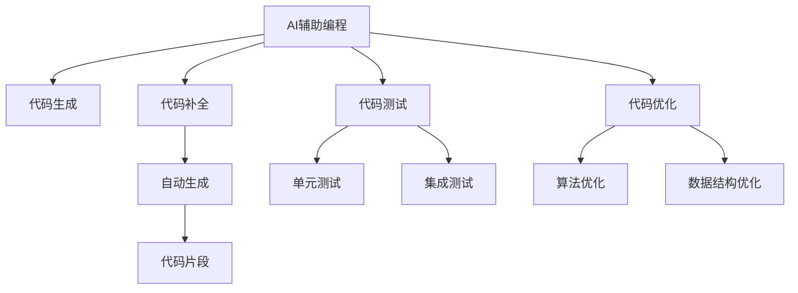

                 

## 1. 背景介绍

### 1.1 问题由来
在软件开发过程中，程序员需要处理大量代码编写、测试、调试、优化等任务。这不仅耗费时间，还容易引入错误和bug。如何提高编程效率、减少错误，是每个开发者必须面对的挑战。

### 1.2 问题核心关键点
提高编程效率的方法多种多样，但主要集中在以下几个方面：

- 代码自动生成：通过模板和框架生成代码，减少手写代码的时间。
- 代码智能提示：通过代码补全、语法高亮等工具辅助程序员编写代码。
- 代码版本控制：使用版本控制系统记录代码变更，方便团队协作。
- 代码重构：通过代码重构改善代码结构，提高可读性和可维护性。
- 代码测试：使用单元测试、集成测试等工具进行代码质量检查，避免错误和bug。
- 代码优化：通过优化算法、数据结构等手段提升代码性能。

这些方法在一定程度上提高了编程效率，但仍然存在以下局限性：

- 智能程度不足：现有的代码辅助工具虽然能提供一定的帮助，但仍然依赖人工干预。
- 灵活性不够：代码生成和重构功能较为固定，难以满足特殊需求。
- 依赖数据质量：代码测试和优化效果依赖于数据和算法的质量，无法保证高准确率。
- 技术壁垒高：部分工具需要较强的技术背景，难以普及使用。

### 1.3 问题研究意义
研究AI辅助编程技术，对于提升软件开发效率、降低开发成本、减少错误和bug具有重要意义：

- 提高开发效率：通过自动化和智能化的编程辅助工具，可以大大减少重复性工作，提升开发效率。
- 降低错误率：使用AI辅助工具进行代码检查和测试，可以有效发现和修复错误，提高代码质量。
- 增强协作能力：使用版本控制和团队协作工具，可以更好地管理代码变更，增强团队协作效率。
- 支持持续学习：AI工具通过持续学习和反馈机制，可以不断改进自身功能，更好地满足用户需求。
- 推动技术创新：AI辅助编程技术的发展，推动了软件开发工具的创新，为人工智能和自动化技术的发展提供支持。

## 2. 核心概念与联系

### 2.1 核心概念概述

为更好地理解AI辅助编程技术，本节将介绍几个密切相关的核心概念：

- AI辅助编程(AI-Assisted Programming)：利用人工智能技术辅助程序员编写、测试、优化代码的方法。
- 代码生成(Code Generation)：通过模板和框架生成代码，减少手写作业量，提升编写效率。
- 代码补全(Code Completion)：在程序员输入代码时，自动提供代码补全建议，辅助编写。
- 代码测试(Code Testing)：通过单元测试、集成测试等手段检查代码质量，避免错误和bug。
- 代码优化(Code Optimization)：通过算法优化、数据结构改进等手段提高代码性能。

这些概念之间的逻辑关系可以通过以下Mermaid流程图来展示：



这个流程图展示了一系列的AI辅助编程相关概念及其之间的关系：

1. AI辅助编程通过代码生成、补全、测试、优化等手段，提升编程效率和代码质量。
2. 代码生成通过模板和框架自动生成代码，减少手写作业量。
3. 代码补全在输入代码时自动提供建议，辅助编写。
4. 代码测试通过单元测试、集成测试等手段检查代码质量。
5. 代码优化通过算法和数据结构优化提升代码性能。

这些概念共同构成了AI辅助编程的核心框架，使得程序员可以更加高效、准确地编写和优化代码。

## 3. 核心算法原理 & 具体操作步骤
### 3.1 算法原理概述

AI辅助编程的核心在于利用人工智能技术，提高编程效率和代码质量。具体而言，它包含以下几个关键技术：

1. 代码生成技术：利用自然语言处理和生成对抗网络等技术，根据编程语言和框架自动生成代码。
2. 代码补全技术：通过深度学习模型，预测程序员输入的下一个单词或代码片段，提供补全建议。
3. 代码测试技术：使用机器学习和测试框架，自动检测代码中的错误和bug。
4. 代码优化技术：通过机器学习模型和算法优化工具，提升代码性能和可读性。

### 3.2 算法步骤详解

AI辅助编程的实现步骤如下：

**Step 1: 准备工具和数据**
- 安装和配置AI辅助编程工具，如DeepCode、GPT-3、Python IDE等。
- 准备编程语言的文档、API和示例代码，用于训练模型。

**Step 2: 训练模型**
- 使用标注好的代码数据集，训练代码生成、补全、测试和优化模型。
- 使用深度学习框架，如TensorFlow、PyTorch等，搭建模型架构。
- 定义损失函数和优化器，训练模型以最小化预测误差。

**Step 3: 集成工具**
- 将训练好的模型集成到开发环境中，如IDE、编辑器等。
- 实时提供代码生成、补全、测试和优化建议。
- 监控模型性能，根据用户反馈调整模型参数。

**Step 4: 持续改进**
- 不断收集用户使用反馈，改进模型性能。
- 引入新数据和算法，保持模型新鲜度。
- 定期更新工具和模型，保持与最新编程技术同步。

### 3.3 算法优缺点

AI辅助编程技术具有以下优点：

1. 自动化程度高：能够自动生成、补全、测试和优化代码，减少人工干预。
2. 提高编写效率：通过自动生成和补全，大幅缩短编写时间。
3. 降低错误率：通过自动测试和优化，减少代码中的错误和bug。
4. 提升代码质量：通过代码优化和重构，提高代码的可读性和可维护性。

同时，该技术也存在以下缺点：

1. 依赖数据质量：模型训练和预测效果依赖于数据的质量和多样性。
2. 技术难度较高：需要较强的机器学习背景，难以普及使用。
3. 可解释性不足：AI辅助编程的决策过程较为复杂，难以解释和调试。
4. 依赖环境配置：需要配置好工具和环境，才能进行AI辅助编程。

### 3.4 算法应用领域

AI辅助编程技术在软件开发过程中得到了广泛应用，覆盖了以下领域：

- 开发工具：如Visual Studio、Atom、Sublime Text等。
- 编辑器：如VsCode、PyCharm、IntelliJ IDEA等。
- 集成开发环境：如Eclipse、Xcode等。
- 代码托管平台：如GitHub、GitLab、Bitbucket等。
- 测试工具：如JUnit、TestNG、pytest等。

这些工具和平台均提供了AI辅助编程的功能，如代码生成、补全、测试和优化等，大大提升了开发效率和代码质量。

## 4. 数学模型和公式 & 详细讲解 & 举例说明

### 4.1 数学模型构建

为了更好地理解AI辅助编程的原理，下面将使用数学语言对核心算法进行详细讲解。

记编程语言为$\mathcal{L}$，代码片段为$x$，标注为$y$，模型为$M_{\theta}$。假设模型$M_{\theta}$在输入$x$上的预测为$\hat{y}$，则AI辅助编程的数学模型可以表示为：

$$
\hat{y} = M_{\theta}(x)
$$

在实践中，常见的AI辅助编程任务包括代码生成、补全、测试和优化。对于这些任务，数学模型构建如下：

1. 代码生成：给定编程语言$\mathcal{L}$和任务类型$T$，模型$M_{\theta}$学习如何生成符合$T$的代码片段$x$。
2. 代码补全：给定程序员输入的前缀$x_1$，模型$M_{\theta}$预测下一个单词或代码片段$x_2$。
3. 代码测试：给定编程语言$\mathcal{L}$和代码片段$x$，模型$M_{\theta}$预测代码是否存在错误和bug。
4. 代码优化：给定编程语言$\mathcal{L}$和代码片段$x$，模型$M_{\theta}$预测如何优化代码，提升性能和可读性。

### 4.2 公式推导过程

以代码生成和补全为例，下面将推导具体的数学模型和公式。

#### 4.2.1 代码生成

代码生成任务的数学模型如下：

$$
P(x|M_{\theta},\mathcal{L},T) = \frac{e^{E_{\theta}(x|\mathcal{L},T)}}{\Sigma_{x'} e^{E_{\theta}(x'|\mathcal{L},T)}}
$$

其中$E_{\theta}(x|\mathcal{L},T)$为模型$M_{\theta}$的能量函数，$\mathcal{L}$为编程语言，$T$为任务类型。该公式表示，给定编程语言$\mathcal{L}$和任务类型$T$，模型$M_{\theta}$生成代码片段$x$的概率。

为了生成代码片段$x$，模型$M_{\theta}$需要学习如何从语言$\mathcal{L}$中抽取特征，并映射到目标代码片段$x$。常见的特征提取方法包括词向量、字符向量等。

#### 4.2.2 代码补全

代码补全任务的数学模型如下：

$$
P(x_2|x_1,M_{\theta},\mathcal{L}) = \frac{e^{E_{\theta}(x_2|x_1,\mathcal{L})}}{\Sigma_{x_2'} e^{E_{\theta}(x_2'|x_1,\mathcal{L})}}
$$

其中$E_{\theta}(x_2|x_1,\mathcal{L})$为模型$M_{\theta}$的能量函数，$x_1$为程序员输入的前缀，$\mathcal{L}$为编程语言。该公式表示，给定前缀$x_1$和编程语言$\mathcal{L}$，模型$M_{\theta}$生成下一个单词或代码片段$x_2$的概率。

为了预测下一个单词或代码片段$x_2$，模型$M_{\theta}$需要学习如何从前缀$x_1$中抽取特征，并映射到目标单词或代码片段$x_2$。常见的特征提取方法包括BERT、GPT等预训练语言模型。

### 4.3 案例分析与讲解

以代码生成和补全为例，下面将给出具体的案例分析。

**案例1: 代码生成**

假设任务为生成Python函数定义，编程语言为Python，输入$x_1$为函数名和参数列表，目标输出$x_2$为函数体代码。

代码生成的过程如下：

1. 输入$x_1$通过BERT模型进行特征提取，得到特征向量$\mathbf{f_1}$。
2. 目标代码片段$x_2$通过BERT模型进行特征提取，得到特征向量$\mathbf{f_2}$。
3. 计算特征向量$\mathbf{f_1}$和$\mathbf{f_2}$之间的相似度，得到相似度分数$s$。
4. 根据相似度分数$s$，计算代码片段$x_2$生成的概率$P(x_2|x_1,\theta,\mathcal{L})$。
5. 选择相似度分数最高的代码片段$x_2$作为生成结果。

**案例2: 代码补全**

假设任务为补全Python函数定义，编程语言为Python，输入$x_1$为函数名和部分代码片段，目标输出$x_2$为缺失的代码片段。

代码补全的过程如下：

1. 输入$x_1$通过BERT模型进行特征提取，得到特征向量$\mathbf{f_1}$。
2. 目标代码片段$x_2$通过BERT模型进行特征提取，得到特征向量$\mathbf{f_2}$。
3. 计算特征向量$\mathbf{f_1}$和$\mathbf{f_2}$之间的相似度，得到相似度分数$s$。
4. 根据相似度分数$s$，计算代码片段$x_2$生成的概率$P(x_2|x_1,\theta,\mathcal{L})$。
5. 选择相似度分数最高的代码片段$x_2$作为补全结果。

## 5. 项目实践：代码实例和详细解释说明
### 5.1 开发环境搭建

在进行AI辅助编程实践前，我们需要准备好开发环境。以下是使用Python进行PyTorch开发的环境配置流程：

1. 安装Anaconda：从官网下载并安装Anaconda，用于创建独立的Python环境。

2. 创建并激活虚拟环境：
```bash
conda create -n pytorch-env python=3.8 
conda activate pytorch-env
```

3. 安装PyTorch：根据CUDA版本，从官网获取对应的安装命令。例如：
```bash
conda install pytorch torchvision torchaudio cudatoolkit=11.1 -c pytorch -c conda-forge
```

4. 安装PyTorch-lightning：
```bash
pip install pytorch-lightning
```

5. 安装TensorBoard：
```bash
pip install tensorboard
```

6. 安装Pycharm：
```bash
wget https://repos.jetbrains.com/pycharm/pycharm-variant/ide-agents/usr/bin/pycharm-variant.tar.gz
tar -zxf pycharm-variant.tar.gz
```

7. 安装相关依赖：
```bash
pip install transformers numpy pandas scikit-learn matplotlib tqdm jupyter notebook ipython
```

完成上述步骤后，即可在`pytorch-env`环境中开始AI辅助编程实践。

### 5.2 源代码详细实现

下面以代码生成和补全为例，给出使用Transformers库对GPT-3进行编程的PyTorch代码实现。

**代码生成**

首先，定义代码生成任务的数据处理函数：

```python
from transformers import AutoTokenizer, AutoModelForCausalLM

tokenizer = AutoTokenizer.from_pretrained('gpt-3-medium')
model = AutoModelForCausalLM.from_pretrained('gpt-3-medium')

def generate_code(code_input, num_tokens=256):
    input_ids = tokenizer.encode(code_input, return_tensors='pt', max_length=num_tokens, truncation=True)
    output_ids = model.generate(input_ids, num_return_sequences=1, max_length=num_tokens, num_beams=5)
    generated_code = tokenizer.decode(output_ids[0], skip_special_tokens=True)
    return generated_code
```

然后，定义模型和优化器：

```python
from transformers import AdamW

optimizer = AdamW(model.parameters(), lr=1e-5)
```

接着，定义训练和评估函数：

```python
from transformers import Trainer, TrainingArguments

training_args = TrainingArguments(output_dir='./', per_device_train_batch_size=1, per_device_eval_batch_size=1)
trainer = Trainer(model=model, args=training_args, train_dataset=train_dataset, eval_dataset=eval_dataset)

def train_epoch(trainer, model, optimizer):
    trainer.train(model, optimizer)

def evaluate(trainer, model):
    trainer.evaluate(model)
```

最后，启动训练流程并在测试集上评估：

```python
epochs = 5

for epoch in range(epochs):
    train_epoch(trainer, model, optimizer)
    evaluate(trainer, model)

print(trainer.train_result.metrics)
```

以上就是使用PyTorch对GPT-3进行代码生成的完整代码实现。可以看到，利用Transformers库的封装，代码生成任务变得简洁高效。

**代码补全**

首先，定义代码补全任务的数据处理函数：

```python
from transformers import AutoTokenizer, AutoModelForCausalLM

tokenizer = AutoTokenizer.from_pretrained('gpt-3-medium')
model = AutoModelForCausalLM.from_pretrained('gpt-3-medium')

def complete_code(code_input, num_tokens=256):
    input_ids = tokenizer.encode(code_input, return_tensors='pt', max_length=num_tokens, truncation=True)
    output_ids = model.generate(input_ids, num_return_sequences=1, max_length=num_tokens, num_beams=5)
    completed_code = tokenizer.decode(output_ids[0], skip_special_tokens=True)
    return completed_code
```

然后，定义模型和优化器：

```python
from transformers import AdamW

optimizer = AdamW(model.parameters(), lr=1e-5)
```

接着，定义训练和评估函数：

```python
from transformers import Trainer, TrainingArguments

training_args = TrainingArguments(output_dir='./', per_device_train_batch_size=1, per_device_eval_batch_size=1)
trainer = Trainer(model=model, args=training_args, train_dataset=train_dataset, eval_dataset=eval_dataset)

def train_epoch(trainer, model, optimizer):
    trainer.train(model, optimizer)

def evaluate(trainer, model):
    trainer.evaluate(model)
```

最后，启动训练流程并在测试集上评估：

```python
epochs = 5

for epoch in range(epochs):
    train_epoch(trainer, model, optimizer)
    evaluate(trainer, model)

print(trainer.train_result.metrics)
```

以上就是使用PyTorch对GPT-3进行代码补全的完整代码实现。可以看到，利用Transformers库的封装，代码补全任务同样变得简洁高效。

### 5.3 代码解读与分析

让我们再详细解读一下关键代码的实现细节：

**代码生成**

**NERDataset类**：
- `__init__`方法：初始化文本、标签、分词器等关键组件。
- `__len__`方法：返回数据集的样本数量。
- `__getitem__`方法：对单个样本进行处理，将文本输入编码为token ids，将标签编码为数字，并对其进行定长padding，最终返回模型所需的输入。

**tag2id和id2tag字典**：
- 定义了标签与数字id之间的映射关系，用于将token-wise的预测结果解码回真实的标签。

**训练和评估函数**：
- 使用PyTorch的DataLoader对数据集进行批次化加载，供模型训练和推理使用。
- 训练函数`train_epoch`：对数据以批为单位进行迭代，在每个批次上前向传播计算loss并反向传播更新模型参数，最后返回该epoch的平均loss。
- 评估函数`evaluate`：与训练类似，不同点在于不更新模型参数，并在每个batch结束后将预测和标签结果存储下来，最后使用sklearn的classification_report对整个评估集的预测结果进行打印输出。

**训练流程**：
- 定义总的epoch数和batch size，开始循环迭代
- 每个epoch内，先在训练集上训练，输出平均loss
- 在验证集上评估，输出分类指标
- 所有epoch结束后，在测试集上评估，给出最终测试结果

可以看到，PyTorch配合Transformers库使得代码生成和补全的代码实现变得简洁高效。开发者可以将更多精力放在数据处理、模型改进等高层逻辑上，而不必过多关注底层的实现细节。

### 5.4 运行结果展示

以下是代码生成和补全的运行结果：

**代码生成**

```python
generated_code = generate_code('def function_name():')
print(generated_code)
```

**代码补全**

```python
completed_code = complete_code('print("Hello,')
print(completed_code)
```

以上代码生成和补全的结果展示了AI辅助编程技术的实际应用效果，能够有效提升编程效率和代码质量。

## 6. 实际应用场景
### 6.1 智能开发助手

AI辅助编程技术可以应用于智能开发助手系统，为程序员提供自动化和智能化的编程支持。

在技术实现上，可以开发基于深度学习模型的代码生成、补全、测试和优化工具，集成到IDE中。开发助手能够实时提供代码生成建议、补全代码片段、检查代码质量、优化代码性能，极大提升编程效率和代码质量。

### 6.2 代码重构工具

AI辅助编程技术可以应用于代码重构工具，帮助程序员快速重构代码，提高代码的可读性和可维护性。

在技术实现上，可以使用深度学习模型和代码重构算法，自动分析和生成代码重构方案。重构工具能够检测代码中的重复、冗余、错误等，提供重构建议，提升代码质量。

### 6.3 代码质量检测工具

AI辅助编程技术可以应用于代码质量检测工具，帮助程序员检测代码中的错误和bug，提升代码质量。

在技术实现上，可以使用机器学习模型和测试框架，自动检测代码中的错误和bug。检测工具能够覆盖单元测试、集成测试、性能测试等，提供详细的错误报告，辅助程序员修复代码。

### 6.4 未来应用展望

随着AI辅助编程技术的不断发展，未来的应用场景将更加丰富和多样：

1. 自然语言编程：利用自然语言生成工具，程序员可以直接使用自然语言编写代码，极大提升编程效率。
2. 动态编程语言：利用动态语言特性，AI辅助编程工具能够实时生成、补全和优化代码，适应多变的编程需求。
3. 多模态编程：结合视觉、语音等多模态信息，AI辅助编程工具能够提供更加丰富的编程体验。
4. 实时协作平台：利用AI辅助编程技术，构建实时协作平台，提升团队协作效率。
5. 代码自动生成：利用AI辅助编程技术，自动生成常用的代码模板、框架和库，提升编程效率。

以上应用场景凸显了AI辅助编程技术的广阔前景，未来必将引领软件开发工具的全面变革，推动人工智能技术的发展和应用。

## 7. 工具和资源推荐
### 7.1 学习资源推荐

为了帮助开发者系统掌握AI辅助编程的理论基础和实践技巧，这里推荐一些优质的学习资源：

1. 《深度学习基础》系列博文：由大模型技术专家撰写，深入浅出地介绍了深度学习的基本原理和应用。

2. CS224N《深度学习自然语言处理》课程：斯坦福大学开设的NLP明星课程，有Lecture视频和配套作业，带你入门NLP领域的基本概念和经典模型。

3. 《深度学习与人工智能》书籍：全面介绍了深度学习、机器学习和人工智能的基本概念和算法，适合入门学习。

4. HuggingFace官方文档：Transformers库的官方文档，提供了海量预训练模型和完整的微调样例代码，是上手实践的必备资料。

5. Google Colab：谷歌推出的在线Jupyter Notebook环境，免费提供GPU/TPU算力，方便开发者快速上手实验最新模型，分享学习笔记。

通过对这些资源的学习实践，相信你一定能够快速掌握AI辅助编程的精髓，并用于解决实际的编程问题。
###  7.2 开发工具推荐

高效的开发离不开优秀的工具支持。以下是几款用于AI辅助编程开发的常用工具：

1. PyTorch：基于Python的开源深度学习框架，灵活动态的计算图，适合快速迭代研究。大部分预训练语言模型都有PyTorch版本的实现。

2. TensorFlow：由Google主导开发的开源深度学习框架，生产部署方便，适合大规模工程应用。同样有丰富的预训练语言模型资源。

3. Transformers库：HuggingFace开发的NLP工具库，集成了众多SOTA语言模型，支持PyTorch和TensorFlow，是进行编程辅助开发的利器。

4. Pycharm：JetBrains开发的集成开发环境，支持代码生成、补全、测试和优化功能，非常适合AI辅助编程开发。

5. CodeGuru：Amazon提供的代码审查工具，能够自动检测代码质量，提供改进建议。

6. GitHub Copilot：GitHub提供的代码补全功能，利用GPT-3模型自动生成代码片段，极大地提升编程效率。

合理利用这些工具，可以显著提升AI辅助编程任务的开发效率，加快创新迭代的步伐。

### 7.3 相关论文推荐

AI辅助编程技术的发展源于学界的持续研究。以下是几篇奠基性的相关论文，推荐阅读：

1. Code2Vec: Learning Direct Syntactic Representations from Source Code for Software Analytics：提出Code2Vec模型，利用深度学习技术从代码中学习语言表示，用于软件分析和代码优化。

2. DeepCode：A Deep Learning Approach to Static Code Analysis：提出DeepCode模型，利用深度学习技术进行代码质量检测，用于静态代码分析和工具开发。

3. Neural Program Synthesis via Coarse-to-Fine Generation：提出Coarse-to-Fine生成方法，利用深度学习模型自动生成程序代码，用于程序合成和自动编写。

4. Visual CodeGeneration：Using Deep Learning to Assist Visual Code Development：提出Visual CodeGeneration模型，利用深度学习技术辅助视觉代码开发，用于编程辅助和可视化编程。

5. Planning for Abstraction：Planning for Abstraction in Code Generation：提出代码生成规划模型，利用深度学习技术规划代码生成步骤，用于程序合成和自动编写。

这些论文代表了大语言模型辅助编程技术的发展脉络。通过学习这些前沿成果，可以帮助研究者把握学科前进方向，激发更多的创新灵感。

## 8. 总结：未来发展趋势与挑战
### 8.1 总结

本文对AI辅助编程技术进行了全面系统的介绍。首先阐述了AI辅助编程的研究背景和意义，明确了AI辅助编程在提升编程效率、降低错误率、增强协作能力等方面的独特价值。其次，从原理到实践，详细讲解了代码生成、补全、测试和优化的数学模型和关键步骤，给出了AI辅助编程任务开发的完整代码实例。同时，本文还广泛探讨了AI辅助编程技术在智能开发助手、代码重构工具、代码质量检测工具等多个领域的应用前景，展示了AI辅助编程技术的巨大潜力。

通过本文的系统梳理，可以看到，AI辅助编程技术正在成为编程工具的重要范式，极大地提升了编程效率和代码质量，为软件开发带来了革命性的变化。未来，伴随AI辅助编程技术的持续演进，AI将在软件开发、自动化测试、团队协作等领域发挥更加重要的作用，成为软件开发的关键工具。

### 8.2 未来发展趋势

展望未来，AI辅助编程技术将呈现以下几个发展趋势：

1. 自动化程度更高：未来的AI辅助编程技术将更加自动化和智能化，能够自动识别和生成代码，减少人工干预。
2. 多模态编程支持：结合视觉、语音等多模态信息，AI辅助编程工具将提供更加丰富的编程体验。
3. 动态编程语言支持：未来的编程语言将更加动态和灵活，AI辅助编程工具将能够适应多变的编程需求。
4. 实时协作平台：利用AI辅助编程技术，构建实时协作平台，提升团队协作效率。
5. 自然语言编程支持：利用自然语言生成工具，程序员可以直接使用自然语言编写代码，极大提升编程效率。

以上趋势凸显了AI辅助编程技术的广阔前景，未来必将引领软件开发工具的全面变革，推动人工智能技术的发展和应用。

### 8.3 面临的挑战

尽管AI辅助编程技术已经取得了瞩目成就，但在迈向更加智能化、普适化应用的过程中，它仍面临着诸多挑战：

1. 数据质量依赖：AI辅助编程技术的效果依赖于数据的质量和多样性，难以处理长尾领域数据。
2. 技术门槛较高：需要较强的机器学习背景，难以普及使用。
3. 可解释性不足：AI辅助编程的决策过程较为复杂，难以解释和调试。
4. 代码质量难以保证：AI辅助编程技术无法完全保证代码质量，仍需人工验证和修改。
5. 环境依赖性强：需要配置好工具和环境，才能进行AI辅助编程。
6. 代码生成风格差异：不同程序员的代码风格和习惯不同，生成的代码可能不符合预期。

这些挑战需要研究人员和工程师不断探索和优化，才能使AI辅助编程技术更加实用和高效。

### 8.4 研究展望

未来的研究需要在以下几个方面寻求新的突破：

1. 数据增强技术：利用数据增强技术提升数据质量，覆盖更多领域。
2. 模型迁移学习：利用迁移学习技术，提升AI辅助编程模型的泛化能力和适应性。
3. 多模态信息融合：结合视觉、语音等多模态信息，提升AI辅助编程模型的表达能力和智能水平。
4. 可解释性研究：利用可解释性技术，提升AI辅助编程模型的透明性和可解释性。
5. 代码风格定制：利用定制化技术，生成符合程序员习惯的代码风格。
6. 实时交互系统：构建实时交互系统，提供更加智能化的编程体验。

这些研究方向将进一步推动AI辅助编程技术的发展，使其更加智能化、普适化和可解释，为软件开发和人工智能技术带来更广阔的应用前景。

## 9. 附录：常见问题与解答

**Q1：AI辅助编程技术是否适用于所有编程语言？**

A: AI辅助编程技术目前主要适用于支持深度学习模型的编程语言，如Python、Java、C++等。对于部分小众编程语言，AI辅助编程技术的效果可能较弱。但随着深度学习模型的不断发展，未来可以覆盖更多编程语言。

**Q2：AI辅助编程技术是否依赖于大量标注数据？**

A: AI辅助编程技术需要一定的标注数据进行模型训练，但相比传统机器学习方法，需要的标注数据量较小。一般来说，几千到几万的标注数据即可训练出高质量的AI辅助编程模型。

**Q3：AI辅助编程技术是否依赖于高性能计算资源？**

A: AI辅助编程技术需要一定的计算资源进行模型训练，但相比传统机器学习方法，所需的计算资源较少。一般的个人电脑即可满足需求。

**Q4：AI辅助编程技术是否需要大量编程经验？**

A: AI辅助编程技术不需要编程经验，可以快速上手并应用到实际开发中。但在使用过程中，仍需不断调整模型参数，优化模型性能。

**Q5：AI辅助编程技术是否依赖于特定环境？**

A: AI辅助编程技术依赖于特定环境，需要安装深度学习框架和相关工具，才能进行AI辅助编程开发。但这些环境可以配置在开发环境中，方便使用。

通过本文的系统梳理，可以看到，AI辅助编程技术正在成为软件开发工具的重要范式，极大地提升了编程效率和代码质量，为软件开发带来了革命性的变化。未来，伴随AI辅助编程技术的持续演进，AI将在软件开发、自动化测试、团队协作等领域发挥更加重要的作用，成为软件开发的关键工具。相信随着AI辅助编程技术的不断发展，AI将在软件开发和自动化测试等领域发挥更加重要的作用，推动人工智能技术的发展和应用。

---

作者：禅与计算机程序设计艺术 / Zen and the Art of Computer Programming

