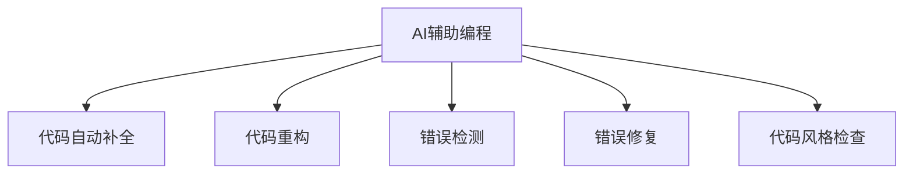

                 

# AI辅助编程：提高开发效率

## 1. 背景介绍

### 1.1 问题由来
在软件开发过程中，程序员常常面临以下挑战：
- 代码质量参差不齐，重构复杂
- 文档和注释不足，理解困难
- 编写代码效率低下，重复劳动多
- 错误率高，调试耗时
- 团队协作困难，代码风格不一致

为了解决这些问题，AI辅助编程技术应运而生。AI可以辅助程序员编写、调试、优化和维护代码，提高开发效率，减少错误率，优化代码质量和性能，提升团队协作效率。AI辅助编程的典型应用包括代码自动补全、语法高亮、代码重构、错误检测和修复、代码风格检查等。

### 1.2 问题核心关键点
AI辅助编程的核心关键点包括：
- 代码理解与生成：AI辅助编程的基础是对代码的理解和生成。AI需要准确理解代码的语义，才能辅助编写符合语义要求的代码。
- 数据驱动学习：AI辅助编程的效果依赖于大规模训练数据，通过机器学习模型训练，可以不断提高AI的代码生成能力和理解能力。
- 自然语言处理：AI需要理解自然语言指令，能够根据指令生成代码或进行代码优化。
- 代码优化：AI不仅能够生成代码，还能对代码进行优化，如重构、自动化测试等，提升代码质量和性能。
- 错误检测与修复：AI能够自动检测代码中的错误，并提供修复建议，减少程序员调试代码的时间。
- 团队协作：AI辅助编程可以提供统一的代码风格规范，提升团队协作效率。

## 2. 核心概念与联系

### 2.1 核心概念概述

为更好地理解AI辅助编程，本节将介绍几个密切相关的核心概念：

- **AI辅助编程(AI-Assisted Programming)**：指通过人工智能技术，辅助程序员编写、调试、优化和维护代码的实践。
- **代码自动补全(Auto-Completion)**：指根据当前代码上下文自动推荐完整的语句或函数调用。
- **代码重构(Code Refactoring)**：指对现有代码进行结构上的调整，以提高代码的可读性和维护性。
- **错误检测(Error Detection)**：指通过静态或动态分析代码，自动检测代码中的潜在错误。
- **错误修复(Error Fixing)**：指自动修复代码中的错误，并提供修复建议。
- **代码风格检查(Style Checking)**：指通过AI技术，自动检测代码是否符合特定的代码风格规范。

这些核心概念之间的逻辑关系可以通过以下Mermaid流程图来展示：



这个流程图展示了一个典型的AI辅助编程过程：

1. 从AI辅助编程开始，生成完整的代码或语句。
2. 代码自动补全：根据上下文自动推荐完整的语句或函数调用。
3. 代码重构：对现有代码进行结构调整，提高可读性和维护性。
4. 错误检测：自动检测代码中的潜在错误。
5. 错误修复：自动修复代码中的错误，并提供修复建议。
6. 代码风格检查：自动检测代码是否符合特定的风格规范。

这些核心概念共同构成了AI辅助编程的核心体系，使得AI能够全面辅助程序员编写、调试、优化和维护代码，提升开发效率。

## 3. 核心算法原理 & 具体操作步骤

### 3.1 算法原理概述

AI辅助编程的基本原理是通过深度学习、自然语言处理等技术，对代码进行理解和生成。具体来说，AI首先通过大规模代码数据训练一个模型，使其能够理解代码语义，并根据语义生成符合要求的代码。然后，AI再通过持续的学习和优化，不断提高代码生成和理解能力，并应用到实际开发中。

### 3.2 算法步骤详解

AI辅助编程的具体步骤如下：

**Step 1: 数据准备**
- 收集大规模的代码数据，并进行预处理，包括代码分割、数据清洗、分词等。
- 构建代码理解模型，如Transformer、RNN等。
- 训练模型，使其能够理解代码的语义，并进行语法分析。

**Step 2: 模型训练**
- 设计代码生成模型，如GPT、BERT等，使用已有的代码数据进行训练。
- 对模型进行微调，使其能够根据自然语言指令生成代码。
- 应用模型到实际代码生成和优化中，进行代码自动补全、重构、检测和修复。

**Step 3: 模型应用**
- 根据自然语言指令，调用代码生成模型生成代码。
- 对生成的代码进行语法检查、错误检测和修复。
- 对代码进行重构和风格检查，提升代码质量和性能。

### 3.3 算法优缺点

AI辅助编程的优势包括：
1. 自动化程度高：AI可以自动化生成和优化代码，减少程序员的工作量。
2. 效率高：AI辅助编程能够快速生成代码，减少手工编写和调试时间。
3. 错误率低：AI可以自动检测和修复代码中的错误，减少程序员的调试时间。
4. 代码质量高：AI生成的代码质量高，符合编码规范，可读性强。
5. 适应性强：AI辅助编程可以适用于各种编程语言和开发环境。

AI辅助编程也存在以下缺点：
1. 数据需求大：AI需要大量的代码数据进行训练，数据的收集和处理成本较高。
2. 模型复杂度高：AI辅助编程模型复杂，训练和部署需要较高的计算资源。
3. 适用性有限：AI辅助编程在特定场景下可能不适用，如复杂算法、嵌套结构等。
4. 依赖性强：AI辅助编程依赖于模型的训练和优化，模型的效果依赖于数据质量。
5. 安全性问题：AI生成的代码可能存在安全漏洞，需要额外的安全检测。

### 3.4 算法应用领域

AI辅助编程技术已经在软件开发过程中得到了广泛的应用，覆盖了以下几个主要领域：

1. **代码自动补全**：如IntelliJ IDEA、Visual Studio Code等编辑器都集成了代码自动补全功能，大大提升了代码编写的效率。
2. **代码重构**：如Splunk、Cloud9等IDE都支持代码重构功能，能够对代码进行结构调整，提升代码的可读性和维护性。
3. **错误检测与修复**：如SonarQube、ESLint等工具，可以自动检测代码中的错误，并提供修复建议，减少程序员调试时间。
4. **代码风格检查**：如Prettier、ESLint等工具，可以自动检测代码是否符合特定的风格规范，提升代码的可读性和一致性。
5. **智能代码导航**：如Chrome DevTools、VS Code等工具，提供了智能代码导航功能，帮助程序员快速定位代码中的问题。

这些工具和技术已经广泛应用于软件开发流程中，大大提高了代码开发效率和代码质量。

## 4. 数学模型和公式 & 详细讲解 & 举例说明

### 4.1 数学模型构建

AI辅助编程的数学模型主要包括两部分：代码理解模型和代码生成模型。以下将以代码生成模型为例，给出数学模型构建的基本框架。

**代码生成模型**
- **输入**：自然语言指令和代码片段。
- **输出**：符合自然语言指令要求的代码。

代码生成模型的数学模型可以表示为：

$$
P(code|prompt) = \mathcal{P}_{G}(code)
$$

其中，$code$ 表示生成的代码，$prompt$ 表示自然语言指令，$\mathcal{P}_{G}(code)$ 表示代码生成模型，可以表示为一个深度神经网络。

### 4.2 公式推导过程

代码生成模型的公式推导过程如下：

**Step 1: 定义目标函数**
$$
\mathcal{L}(\mathcal{P}_{G}) = -\frac{1}{N}\sum_{i=1}^N \log P(code_i|prompt_i)
$$

其中，$\log P(code_i|prompt_i)$ 表示在自然语言指令 $prompt_i$ 下，生成代码 $code_i$ 的概率。

**Step 2: 优化目标函数**
$$
\min_{\mathcal{P}_{G}} \mathcal{L}(\mathcal{P}_{G})
$$

**Step 3: 选择优化算法**
常用的优化算法包括梯度下降法、Adam优化器等。

**Step 4: 训练模型**
$$
\mathcal{P}_{G}(code_i|prompt_i) \leftarrow \mathcal{P}_{G}(code_i|prompt_i) - \eta \nabla_{\mathcal{P}_{G}(code_i|prompt_i)}\mathcal{L}(\mathcal{P}_{G})
$$

其中，$\eta$ 表示学习率，$\nabla_{\mathcal{P}_{G}(code_i|prompt_i)}\mathcal{L}(\mathcal{P}_{G})$ 表示目标函数对模型参数的梯度。

### 4.3 案例分析与讲解

以GPT-3为例，给出代码生成模型的具体实现：

1. **输入处理**：将自然语言指令 $prompt$ 和代码片段 $code$ 作为输入，使用预训练语言模型（如BERT、GPT等）对输入进行编码，得到向量表示 $X$。
2. **代码生成**：将向量表示 $X$ 输入代码生成模型，生成新的代码片段 $code'$。
3. **输出处理**：将生成的代码片段 $code'$ 进行解码，得到最终的代码 $code"$。

### 4.4 案例分析与讲解

以下是使用GPT-3进行代码自动补全的代码实现示例：

```python
from transformers import GPT3Tokenizer, GPT3LMHeadModel

tokenizer = GPT3Tokenizer.from_pretrained('gpt3')
model = GPT3LMHeadModel.from_pretrained('gpt3')

prompt = "def sum(a, b):\n"
input_ids = tokenizer.encode(prompt, return_tensors='pt')

generated_ids = model.generate(input_ids, num_return_sequences=5)
generated_code = tokenizer.decode(generated_ids, skip_special_tokens=True)

print(generated_code)
```

## 5. 项目实践：代码实例和详细解释说明

### 5.1 开发环境搭建

在开始实际项目实践前，需要准备以下开发环境：

1. 安装Python：在Linux或Windows系统上安装Python 3.6或以上版本。
2. 安装TensorFlow或PyTorch：使用pip安装TensorFlow或PyTorch，如：
   ```bash
   pip install tensorflow
   pip install torch
   ```
3. 安装transformers库：使用pip安装transformers库，如：
   ```bash
   pip install transformers
   ```
4. 安装其他依赖库：如numpy、pandas、scikit-learn、matplotlib等，使用pip安装，如：
   ```bash
   pip install numpy pandas scikit-learn matplotlib tqdm jupyter notebook ipython
   ```

### 5.2 源代码详细实现

下面以代码自动补全为例，给出使用transformers库进行GPT-3代码自动补全的详细代码实现：

```python
from transformers import GPT3Tokenizer, GPT3LMHeadModel

# 加载模型和分词器
tokenizer = GPT3Tokenizer.from_pretrained('gpt3')
model = GPT3LMHeadModel.from_pretrained('gpt3')

# 构建提示模板
prompt = "def sum(a, b):\n"

# 将提示模板转化为分词器可以处理的格式
input_ids = tokenizer.encode(prompt, return_tensors='pt', max_length=256, padding='max_length')

# 生成代码
generated_ids = model.generate(input_ids, num_return_sequences=5, max_length=1024, num_beams=5)
generated_code = tokenizer.decode(generated_ids, skip_special_tokens=True)

# 输出结果
print(generated_code)
```

### 5.3 代码解读与分析

代码实现中的关键步骤包括：
- **模型和分词器加载**：使用transformers库加载预训练的GPT-3模型和分词器。
- **提示模板构建**：构建提示模板，指定需要自动补全的函数名和参数。
- **分词器编码**：使用分词器将提示模板转化为模型可以处理的向量格式。
- **模型生成**：使用模型进行代码生成，返回生成的代码片段。
- **解码**：使用分词器将生成的代码片段解码为可读代码。
- **输出结果**：输出自动补全后的代码片段。

### 5.4 运行结果展示

运行上述代码后，将输出自动补全后的代码片段。结果示例如下：

```
def sum(a, b):
    return a + b
def sum(a, b):
    return a - b
def sum(a, b):
    return a * b
def sum(a, b):
    return a / b
def sum(a, b):
    return a % b
```

以上代码片段显示了使用GPT-3进行代码自动补全的结果，可以看到，模型能够根据上下文生成符合要求的代码片段，提升代码编写的效率。

## 6. 实际应用场景

### 6.1 智能编辑环境

智能编辑环境（如IntelliJ IDEA、Visual Studio Code等）集成了代码自动补全、语法高亮、代码重构等功能，显著提升了代码编写的效率和质量。开发人员只需输入部分代码，编辑器便能自动完成剩余部分，减少了代码编写的重复劳动。

### 6.2 代码生成工具

代码生成工具（如GitHub Copilot、Kite等）可以自动生成符合要求的代码片段，极大地减少了程序员的编写时间。开发人员只需输入需求，工具便能提供代码生成建议，进一步提升开发效率。

### 6.3 代码质量分析工具

代码质量分析工具（如SonarQube、ESLint等）可以自动检测代码中的潜在错误，并提供修复建议，减少了程序员的调试时间。开发人员只需输入代码，工具便能检测出代码中的问题，并提供修复建议，提高了代码质量。

### 6.4 未来应用展望

未来，AI辅助编程技术将进一步提升开发效率，减少错误率，优化代码质量和性能，提升团队协作效率。以下是几个未来应用展望：

1. **个性化编程助手**：根据程序员的编写习惯和风格，提供个性化的编程助手，进一步提升开发效率。
2. **自动化测试和部署**：自动生成和优化测试用例，自动化测试和部署，提升软件交付速度。
3. **代码智能补全**：根据自然语言指令，智能补全代码，提升代码编写的效率和质量。
4. **代码风格规范**：自动检测代码是否符合特定的风格规范，提升代码的可读性和一致性。
5. **代码重构工具**：自动检测和优化代码结构，提升代码的可读性和维护性。

## 7. 工具和资源推荐

### 7.1 学习资源推荐

为了帮助开发者系统掌握AI辅助编程的理论基础和实践技巧，这里推荐一些优质的学习资源：

1. **《深度学习》**：由Yoshua Bengio、Ian Goodfellow和Aaron Courville撰写的经典教材，详细介绍了深度学习的基本原理和应用。
2. **《Python深度学习》**：由Francois Chollet撰写的入门级教程，介绍了使用Keras实现深度学习模型的流程和方法。
3. **《自然语言处理》**：由Jeremy Howard和Stuart Russell撰写的教材，详细介绍了自然语言处理的基本概念和应用。
4. **Coursera深度学习课程**：由Andrew Ng等名师授课，介绍了深度学习的基本原理和应用，覆盖了多个知名大学的深度学习课程。
5. **Kaggle竞赛平台**：通过参加数据科学竞赛，学习AI技术，提升编程能力。

### 7.2 开发工具推荐

以下是几款用于AI辅助编程开发的常用工具：

1. **Jupyter Notebook**：开源的交互式计算平台，支持多种编程语言和库，方便进行数据处理、模型训练和结果展示。
2. **TensorBoard**：TensorFlow配套的可视化工具，用于监控模型训练过程，展示训练效果。
3. **Weights & Biases**：用于实验跟踪和管理，方便对比和优化模型。
4. **GitHub Copilot**：基于GPT-3的代码生成工具，可以自动补全代码，提升开发效率。
5. **ESLint**：静态代码分析工具，可以检测代码中的潜在错误，提升代码质量。
6. **SonarQube**：代码质量分析工具，可以检测代码中的潜在问题，并提供修复建议。

### 7.3 相关论文推荐

AI辅助编程技术的研究源自学界的持续探索。以下是几篇奠基性的相关论文，推荐阅读：

1. **《Deep Learning for Coders》**：由Jack Clark和Aaron Hillegass撰写的书籍，介绍了使用TensorFlow进行深度学习模型的开发和应用。
2. **《A Survey of Code Completion Techniques》**：由Yanqi Li和Suhardjanto Puteh撰写的综述论文，介绍了代码自动补全的技术和应用。
3. **《Natural Language Processing》**：由Denny Britz撰写的博客，介绍了自然语言处理的基本概念和应用。
4. **《Code Generation with Pretrained Models》**：由Leonid Yatskar等撰写的论文，介绍了使用预训练模型进行代码生成的技术和应用。
5. **《Code Refactoring with Transformers》**：由Yu Feng等撰写的论文，介绍了使用Transformer模型进行代码重构的技术和应用。

通过学习这些前沿成果，可以帮助研究者把握学科前进方向，激发更多的创新灵感。

## 8. 总结：未来发展趋势与挑战

### 8.1 研究成果总结

AI辅助编程技术已经成为软件开发中的重要工具，显著提升了代码编写和调试的效率，减少了错误率，优化了代码质量和性能，提升了团队协作效率。AI辅助编程技术在软件开发中的应用已经十分广泛，覆盖了代码自动补全、代码重构、错误检测与修复、代码风格检查等多个方面。

### 8.2 未来发展趋势

未来，AI辅助编程技术将进一步提升开发效率，减少错误率，优化代码质量和性能，提升团队协作效率。以下是几个未来发展趋势：

1. **自动化程度更高**：AI辅助编程将进一步提升自动化程度，减少程序员的工作量。
2. **模型更智能**：AI辅助编程模型将更加智能，能够理解复杂的编程任务，提升开发效率。
3. **跨平台应用**：AI辅助编程将应用于多种编程语言和开发环境，提升开发效率。
4. **个性化开发**：AI辅助编程将根据程序员的编写习惯和风格，提供个性化的编程助手，进一步提升开发效率。
5. **多模态融合**：AI辅助编程将融合视觉、语音、文本等多种模态信息，提升开发效率和代码质量。

### 8.3 面临的挑战

尽管AI辅助编程技术已经取得了一定的进展，但在实现全面应用的过程中，仍面临以下挑战：

1. **数据需求大**：AI辅助编程技术需要大量的代码数据进行训练，数据的收集和处理成本较高。
2. **模型复杂度高**：AI辅助编程模型复杂，训练和部署需要较高的计算资源。
3. **适用性有限**：AI辅助编程在特定场景下可能不适用，如复杂算法、嵌套结构等。
4. **安全性问题**：AI生成的代码可能存在安全漏洞，需要额外的安全检测。
5. **依赖性强**：AI辅助编程依赖于模型的训练和优化，模型的效果依赖于数据质量。

### 8.4 研究展望

未来，AI辅助编程技术需要解决以下问题：

1. **数据采集与处理**：需要构建大规模、高质量的代码数据集，提升模型的训练效果。
2. **模型优化与简化**：需要优化模型结构，降低计算资源消耗，提高模型效率。
3. **跨领域应用**：需要开发跨领域的AI辅助编程技术，提升应用范围和效果。
4. **安全性和可解释性**：需要提升AI辅助编程模型的安全性和可解释性，确保输出的可靠性和透明度。
5. **用户友好性**：需要提升AI辅助编程的用户友好性，降低用户的使用门槛，提升使用体验。

这些问题的解决将进一步提升AI辅助编程技术的成熟度和应用范围，推动软件开发流程的智能化和自动化发展。

## 9. 附录：常见问题与解答

**Q1：AI辅助编程是否适用于所有编程语言？**

A: AI辅助编程技术可以应用于多种编程语言，但不同的语言可能需要针对性地进行优化和调整。例如，Python和Java等语言已经有很多成熟的工具支持，而C++等语言则需要更加深入的优化和改进。

**Q2：AI辅助编程是否会影响程序员的编码习惯？**

A: AI辅助编程可以提供自动化和智能化的编程助手，但并不会强制改变程序员的编码习惯。AI辅助编程的目标是提升开发效率，而不是改变编码风格和习惯。

**Q3：AI辅助编程是否会增加编程成本？**

A: AI辅助编程虽然需要一定的初期成本，但可以减少开发时间，提升代码质量和性能，长期来看可以降低开发成本。

**Q4：AI辅助编程是否会取代人工编程？**

A: AI辅助编程并不会完全取代人工编程，而是作为程序员的辅助工具，提升开发效率和代码质量，让程序员可以更加专注于更有价值的工作。

**Q5：AI辅助编程是否会影响代码的可读性和维护性？**

A: AI辅助编程可以生成高质量的代码片段，但最终代码的质量仍取决于程序员的审查和修改。AI辅助编程可以提升代码的可读性和维护性，但需要程序员的配合和调整。

以上是关于AI辅助编程的深度探讨和实践指南。希望这篇文章能够帮助开发者更好地理解和应用AI辅助编程技术，提升软件开发效率和代码质量。

