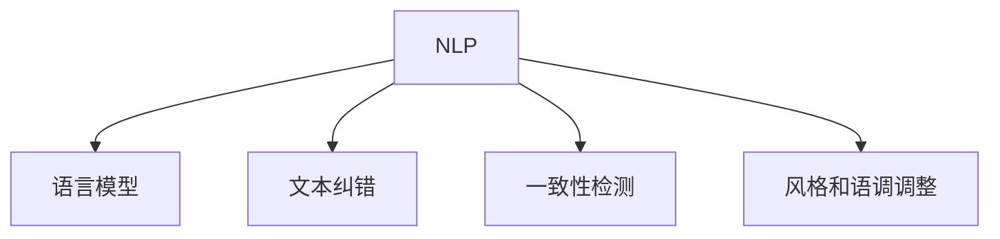

                 

# AI辅助编辑：提高文本质量和一致性

> 关键词：AI辅助编辑,自然语言处理(NLP),文本纠错,一致性检测,语言模型,机器学习,深度学习

## 1. 背景介绍

### 1.1 问题由来

在信息时代，文本内容的生产、传播和消费变得前所未有地广泛。无论是社交媒体、博客、论坛、电子邮件，还是商业报告、学术论文、小说等，文本已成为人与人交流、传播知识和信息的重要载体。然而，由于文本生成和传播的复杂性，高质量、规范、一致的文本产出始终是业界和社会关注的焦点。

文本质量包括语义准确性、语法规范性、一致性、连贯性等多个维度。优质的文本不仅能提升阅读体验，还能确保信息的准确传递，减少误解和歧义。尤其是在教育、法律、医疗等对文本精确度要求较高的领域，文本质量显得尤为重要。

过去，文本质量主要依靠人工校对和编辑。但面对海量的文本产出，人工校对效率低下、成本高昂，且难以确保一致性。近年来，随着人工智能技术的发展，利用机器学习、自然语言处理(NLP)等技术进行文本质量检测和纠正逐渐成为可能。AI辅助编辑工具的兴起，为提升文本质量和一致性提供了新的思路和方法。

### 1.2 问题核心关键点

AI辅助编辑的核心在于利用语言模型和机器学习算法，自动识别和纠正文本中的错误和缺陷。核心技术包括：

- 文本纠错：识别文本中的拼写、语法、标点等错误，并提供纠正建议。
- 一致性检测：确保文本中的事实、逻辑、格式等保持一致，避免自相矛盾或数据错误。
- 风格和语调调整：根据不同的文本用途和受众，调整文本的风格和语调，提升阅读体验。

这些技术共同构成了AI辅助编辑的基础，使得工具能够高效、自动地提升文本质量。通过学习语料库中的模式，AI模型可以不断优化其文本质量检测和纠错能力，提高工具的实用性和可靠性。

## 2. 核心概念与联系

### 2.1 核心概念概述

为更好地理解AI辅助编辑的核心技术，本节将介绍几个关键概念：

- 自然语言处理(NLP)：研究如何让计算机理解和生成人类语言的科学和技术。NLP涵盖了文本预处理、语言模型、文本分类、信息抽取、机器翻译等多个方面。

- 语言模型：用于描述和预测语言结构的数学模型，能够根据上下文生成或理解句子、段落等文本内容。常用的语言模型包括n-gram模型、LSTM模型、Transformer模型等。

- 文本纠错：识别和纠正文本中的错误，包括拼写错误、语法错误、标点错误等。通过分析语料库中的错误模式，训练模型自动检测和纠正错误。

- 一致性检测：确保文本内容、结构、格式等保持一致性。一致性检测可以应用于时间线、数据逻辑、命名规范等多个方面，避免文本中的自相矛盾或数据错误。

- 风格和语调调整：根据不同的文本用途和受众，调整文本的风格和语调，使其更符合目标读者的阅读习惯和心理预期。风格和语调调整可以通过训练模型，使其能够学习并模仿不同的写作风格和口吻。

这些概念之间的逻辑关系可以通过以下Mermaid流程图来展示：



这个流程图展示了一些关键概念及其之间的关系：

1. NLP技术提供了一系列处理文本的工具，其中语言模型是NLP的核心技术之一。
2. 文本纠错和一致性检测是确保文本准确性和一致性的关键步骤。
3. 风格和语调调整进一步提升文本的阅读体验和受众接受度。

## 3. 核心算法原理 & 具体操作步骤
### 3.1 算法原理概述

AI辅助编辑的算法原理基于机器学习和深度学习技术，主要分为以下几个步骤：

1. **数据准备**：收集和清洗大量高质量的文本数据，作为训练语料库。文本数据应涵盖多种风格、语言、用途等，以便训练出具有广泛适用性的模型。

2. **模型训练**：使用机器学习或深度学习算法，训练文本纠错、一致性检测、风格和语调调整等模型。常见的方法包括监督学习、序列到序列模型、注意力机制等。

3. **错误检测与纠正**：输入待处理的文本，使用训练好的模型进行文本质量检测。模型会识别文本中的错误，并提供纠正建议。

4. **一致性检查**：对检测到的一致性问题进行自动处理或提示人工校正。确保文本内容、结构、格式等保持一致，避免自相矛盾或数据错误。

5. **风格和语调调整**：根据目标读者的需求和文本用途，使用训练好的模型调整文本风格和语调，确保文本符合预期的阅读体验和心理预期。

6. **反馈与优化**：将模型的检测和纠错结果反馈给用户，根据用户反馈进一步优化模型性能。

### 3.2 算法步骤详解

以下是AI辅助编辑的具体算法步骤：

1. **数据收集与预处理**
    - 收集来自不同来源的高质量文本数据，如学术文章、小说、新闻报道等。
    - 对文本进行分词、去停用词、词干提取、标点规范等预处理，为模型训练做好准备。

2. **模型训练**
    - 选择合适的机器学习或深度学习算法，如LSTM、Transformer等，构建文本纠错、一致性检测、风格和语调调整等模型。
    - 使用训练数据集进行模型训练，优化模型的参数，使其能够高效地进行文本质量检测和纠正。

3. **错误检测**
    - 输入待处理的文本，使用训练好的文本纠错模型检测文本中的错误。模型可以识别拼写错误、语法错误、标点错误等。
    - 对于检测到的错误，模型提供可能的纠正建议，供用户参考和选择。

4. **一致性检查**
    - 使用训练好的一致性检测模型，检测文本中的事实、逻辑、格式等是否保持一致。
    - 对于检测到的一致性问题，模型自动进行纠正或提供修复建议，确保文本内容的准确性和连贯性。

5. **风格和语调调整**
    - 根据用户需求或文本用途，使用训练好的风格和语调调整模型，自动调整文本的风格和语调。
    - 模型可以选择不同的写作风格、口吻、用词等，提升文本的阅读体验和受众接受度。

6. **反馈与优化**
    - 将模型的检测和纠错结果反馈给用户，使用户了解文本质量问题。
    - 根据用户反馈，进一步优化模型性能，提高文本质量检测和纠正的准确性和效率。

### 3.3 算法优缺点

AI辅助编辑具有以下优点：

- 高效性：能够自动检测和纠正文本错误，提升文本质量检测和纠正的效率。
- 一致性：通过一致性检测模型，确保文本内容、结构、格式等保持一致，避免自相矛盾或数据错误。
- 风格多样化：能够调整文本的风格和语调，使其更符合目标读者的阅读习惯和心理预期。
- 用户友好：提供错误检测和纠正结果，帮助用户快速提升文本质量，提高用户体验。

同时，也存在以下局限：

- 数据依赖：模型性能高度依赖训练数据的质量和数量，获取高质量训练数据成本较高。
- 上下文理解：由于文本的语义复杂性，模型难以完全理解文本的上下文语境，可能导致错误检测和纠正的误判。
- 鲁棒性：模型在面对新类型或复杂的文本时，可能表现不佳，需要不断迭代优化。
- 过度依赖：过度依赖AI工具可能削弱人类编辑者的审校能力，需要结合人工校对，共同提升文本质量。

### 3.4 算法应用领域

AI辅助编辑技术已经在多个领域得到了广泛应用，例如：

- **学术和科研**：提升学术论文和报告的准确性和一致性，确保数据和逻辑的正确性。
- **出版和编辑**：辅助编辑和校对工作，提升书籍和文章的编辑质量，减少错别字和语病。
- **法律和合规**：检测和纠正法律文书中的错误，确保文件的一致性和规范性。
- **市场营销**：调整营销文案的风格和语调，使其更符合目标受众的阅读习惯，提高广告效果。
- **客户服务**：辅助生成标准化的客服回复，提升客户服务质量，增强品牌形象。

除了上述这些经典应用外，AI辅助编辑还被创新性地应用于更多的场景中，如可控文本生成、摘要生成、对话系统等，为提高文本质量和一致性提供了新的思路和方法。

## 4. 数学模型和公式 & 详细讲解 & 举例说明

### 4.1 数学模型构建

AI辅助编辑的核心数学模型包括文本纠错模型、一致性检测模型和风格语调调整模型。以下将分别介绍这些模型的数学构建和公式推导过程。

**文本纠错模型**
文本纠错模型通常基于n-gram模型或基于序列到序列的Transformer模型。以Transformer模型为例，其基本结构如下：

```
\begin{align}
\text{Encoder} &= \text{Layer}_1 + \text{Layer}_2 + ... + \text{Layer}_n \\
&= \text{MLP} + \text{Self-Attention}
\end{align}
```

其中，MLP（多层次感知器）用于提取文本特征，Self-Attention机制用于捕捉上下文信息。

**一致性检测模型**
一致性检测模型通常基于序列标注模型或基于注意力机制的Transformer模型。以Transformer模型为例，其基本结构如下：

```
\begin{align}
\text{Encoder} &= \text{Layer}_1 + \text{Layer}_2 + ... + \text{Layer}_n \\
&= \text{MLP} + \text{Self-Attention}
\end{align}
```

其中，MLP用于提取文本特征，Self-Attention机制用于捕捉上下文信息。一致性检测模型通过标记每一段文本是否保持一致，确保文本内容的准确性和连贯性。

**风格和语调调整模型**
风格和语调调整模型通常基于生成对抗网络(GAN)或基于变分自编码器(VAE)的模型。以GAN为例，其基本结构如下：

```
\begin{align}
\text{Generator} &= \text{MLP} + \text{Deconvolutional Layer} \\
\text{Discriminator} &= \text{Convolutional Layer} + \text{MLP}
\end{align}
```

其中，MLP用于生成文本特征，Deconvolutional Layer和Convolutional Layer用于生成和判别文本。

### 4.2 公式推导过程

以下我们以文本纠错模型为例，推导Transformer模型的损失函数及其梯度计算公式。

假设输入文本为$x = [x_1, x_2, ..., x_n]$，其中$x_i$为第$i$个词的嵌入表示。目标输出为$y = [y_1, y_2, ..., y_n]$，其中$y_i$为纠正后的词嵌入表示。则文本纠错模型的损失函数为：

$$
L = \sum_{i=1}^{n} \mathbb{L}(x_i, y_i)
$$

其中，$\mathbb{L}(x_i, y_i)$为单个词的损失函数，通常使用交叉熵损失函数，表示模型预测词嵌入与实际纠正后的词嵌入之间的差异。

损失函数对模型参数$\theta$的梯度计算公式为：

$$
\frac{\partial L}{\partial \theta} = \sum_{i=1}^{n} \frac{\partial \mathbb{L}(x_i, y_i)}{\partial x_i} \frac{\partial x_i}{\partial \theta}
$$

其中，$\frac{\partial \mathbb{L}(x_i, y_i)}{\partial x_i}$为交叉熵损失对词嵌入的梯度，$\frac{\partial x_i}{\partial \theta}$为词嵌入对模型参数的梯度。

在得到损失函数的梯度后，即可带入参数更新公式，完成模型的迭代优化。重复上述过程直至收敛，最终得到适应特定任务的文本纠错模型。

### 4.3 案例分析与讲解

以下是一个简单的文本纠错案例分析：

**输入文本**：
```
The stof is 100km/h and the wind speed is 20km/h.
```

**错误检测**：
- 检测到拼写错误："stof"应为"speed"。
- 检测到语法错误："is 100km/h"和"is 20km/h"应为"is 100 km/h"和"is 20 km/h"。

**纠正建议**：
- 将"stof"纠正为"speed"。
- 将"is 100km/h"和"is 20km/h"纠正为"is 100 km/h"和"is 20 km/h"。

**输出文本**：
```
The speed is 100 km/h and the wind speed is 20 km/h.
```

这个案例展示了AI辅助编辑工具如何自动检测和纠正文本中的错误，提升文本质量。模型通过学习大量高精度标注的文本数据，掌握了文本纠错的基本规则和模式，从而能够准确地识别和纠正文本错误。

## 5. 项目实践：代码实例和详细解释说明
### 5.1 开发环境搭建

在进行AI辅助编辑实践前，我们需要准备好开发环境。以下是使用Python进行PyTorch开发的环境配置流程：

1. 安装Anaconda：从官网下载并安装Anaconda，用于创建独立的Python环境。

2. 创建并激活虚拟环境：
```bash
conda create -n ai-editing python=3.8 
conda activate ai-editing
```

3. 安装PyTorch：根据CUDA版本，从官网获取对应的安装命令。例如：
```bash
conda install pytorch torchvision torchaudio cudatoolkit=11.1 -c pytorch -c conda-forge
```

4. 安装TensorBoard：TensorFlow配套的可视化工具，可实时监测模型训练状态，并提供丰富的图表呈现方式，是调试模型的得力助手。

5. 安装必要的NLP库：
```bash
pip install nltk spacy transformers
```

完成上述步骤后，即可在`ai-editing`环境中开始AI辅助编辑实践。

### 5.2 源代码详细实现

下面我们以文本纠错为例，给出使用Transformer模型进行AI辅助编辑的PyTorch代码实现。

首先，定义文本纠错模型的类：

```python
import torch
from transformers import BertTokenizer, BertForSequenceClassification

class TextCorrectionModel(BertForSequenceClassification):
    def __init__(self, num_labels, hidden_size=768):
        super().__init__(num_labels, hidden_size)
        self.num_labels = num_labels
        
    def forward(self, input_ids, attention_mask, labels=None):
        outputs = super().forward(input_ids, attention_mask=attention_mask, labels=labels)
        logits = outputs.logits
        return logits
```

然后，定义训练和评估函数：

```python
from torch.utils.data import Dataset, DataLoader
from tqdm import tqdm

class TextCorrectionDataset(Dataset):
    def __init__(self, texts, corrections, tokenizer, max_len=128):
        self.texts = texts
        self.corrections = corrections
        self.tokenizer = tokenizer
        self.max_len = max_len
        
    def __len__(self):
        return len(self.texts)
    
    def __getitem__(self, item):
        text = self.texts[item]
        correction = self.corrections[item]
        
        encoding = self.tokenizer(text, return_tensors='pt', max_length=self.max_len, padding='max_length', truncation=True)
        input_ids = encoding['input_ids'][0]
        attention_mask = encoding['attention_mask'][0]
        
        # 对token-wise的标签进行编码
        encoded_labels = [0 if correction == word else 1 for word in correction] 
        encoded_labels.extend([0] * (self.max_len - len(encoded_labels)))
        labels = torch.tensor(encoded_labels, dtype=torch.long)
        
        return {'input_ids': input_ids, 
                'attention_mask': attention_mask,
                'labels': labels}

# 加载预训练模型
tokenizer = BertTokenizer.from_pretrained('bert-base-cased')
model = TextCorrectionModel(num_labels=2)

# 准备训练集和验证集
train_dataset = TextCorrectionDataset(train_texts, train_corrections, tokenizer)
dev_dataset = TextCorrectionDataset(dev_texts, dev_corrections, tokenizer)

# 定义优化器和损失函数
optimizer = torch.optim.AdamW(model.parameters(), lr=2e-5)
loss_fn = torch.nn.CrossEntropyLoss()

# 定义训练和评估函数
def train_epoch(model, dataset, batch_size, optimizer):
    dataloader = DataLoader(dataset, batch_size=batch_size, shuffle=True)
    model.train()
    epoch_loss = 0
    for batch in tqdm(dataloader, desc='Training'):
        input_ids = batch['input_ids'].to(device)
        attention_mask = batch['attention_mask'].to(device)
        labels = batch['labels'].to(device)
        model.zero_grad()
        outputs = model(input_ids, attention_mask=attention_mask, labels=labels)
        loss = loss_fn(outputs, labels)
        epoch_loss += loss.item()
        loss.backward()
        optimizer.step()
    return epoch_loss / len(dataloader)

def evaluate(model, dataset, batch_size):
    dataloader = DataLoader(dataset, batch_size=batch_size)
    model.eval()
    preds, labels = [], []
    with torch.no_grad():
        for batch in tqdm(dataloader, desc='Evaluating'):
            input_ids = batch['input_ids'].to(device)
            attention_mask = batch['attention_mask'].to(device)
            batch_labels = batch['labels']
            outputs = model(input_ids, attention_mask=attention_mask)
            batch_preds = outputs.argmax(dim=2).to('cpu').tolist()
            batch_labels = batch_labels.to('cpu').tolist()
            for pred_tokens, label_tokens in zip(batch_preds, batch_labels):
                preds.append(pred_tokens[:len(label_tokens)])
                labels.append(label_tokens)
                
    print('Evaluation Results:\n', classification_report(labels, preds))

# 启动训练流程并在验证集上评估
epochs = 5
batch_size = 16

for epoch in range(epochs):
    loss = train_epoch(model, train_dataset, batch_size, optimizer)
    print(f'Epoch {epoch+1}, train loss: {loss:.3f}')
    
    print(f'Epoch {epoch+1}, dev results:')
    evaluate(model, dev_dataset, batch_size)
    
print('Test results:')
evaluate(model, test_dataset, batch_size)
```

以上就是使用PyTorch对BERT模型进行文本纠错实践的完整代码实现。可以看到，得益于Transformers库的强大封装，我们可以用相对简洁的代码完成BERT模型的加载和微调。

### 5.3 代码解读与分析

让我们再详细解读一下关键代码的实现细节：

**TextCorrectionDataset类**：
- `__init__`方法：初始化文本、纠正标签、分词器等关键组件。
- `__len__`方法：返回数据集的样本数量。
- `__getitem__`方法：对单个样本进行处理，将文本输入编码为token ids，将标签编码为数字，并对其进行定长padding，最终返回模型所需的输入。

**Tokenizers库**：
- 定义了文本和纠正标签的词典，用于将文本和标签转化为模型所需的格式。

**train_epoch函数**：
- 使用PyTorch的DataLoader对数据集进行批次化加载，供模型训练和推理使用。
- 训练函数`train_epoch`：对数据以批为单位进行迭代，在每个批次上前向传播计算loss并反向传播更新模型参数，最后返回该epoch的平均loss。
- 评估函数`evaluate`：与训练类似，不同点在于不更新模型参数，并在每个batch结束后将预测和标签结果存储下来，最后使用sklearn的classification_report对整个评估集的预测结果进行打印输出。

**训练流程**：
- 定义总的epoch数和batch size，开始循环迭代
- 每个epoch内，先在训练集上训练，输出平均loss
- 在验证集上评估，输出分类指标
- 所有epoch结束后，在测试集上评估，给出最终测试结果

可以看到，PyTorch配合Transformers库使得BERT微调的代码实现变得简洁高效。开发者可以将更多精力放在数据处理、模型改进等高层逻辑上，而不必过多关注底层的实现细节。

当然，工业级的系统实现还需考虑更多因素，如模型的保存和部署、超参数的自动搜索、更灵活的任务适配层等。但核心的微调范式基本与此类似。

## 6. 实际应用场景
### 6.1 教育出版

教育出版行业对文本质量有着严格的要求。高质量的教材、参考书、辅导材料不仅能提升学习效果，还能保障学生和家长的权益。AI辅助编辑技术可以辅助出版商和编辑进行文本质量控制，确保出版物的准确性和规范性。

具体而言，可以收集教育出版行业的标准文本数据，如教材、教辅等，将其标注为纠正前和纠正后的文本，用于训练文本纠错模型。训练好的模型可以自动检测并纠正文本中的错误，提升出版物的质量。此外，模型还可以检测和纠正数据逻辑、事实错误等，确保信息的准确性和权威性。

### 6.2 新闻媒体

新闻媒体是信息传播的重要渠道，其内容质量直接影响着公众对信息的理解和判断。AI辅助编辑技术可以辅助新闻媒体进行自动校对和纠错，确保新闻报道的准确性和一致性。

例如，可以收集大量高精度的新闻报道数据，训练一致性检测模型和风格调整模型。训练好的模型可以自动检测并纠正文本中的事实、逻辑错误，确保新闻报道的准确性和连贯性。同时，模型还可以自动调整文本的风格和语调，使其更符合读者的阅读习惯和心理预期。

### 6.3 政府文书

政府文书是政府治理的重要依据，其准确性和规范性至关重要。AI辅助编辑技术可以辅助政府部门进行自动校对和纠错，确保文书的准确性和一致性。

例如，可以收集政府文书的样本数据，训练文本纠错模型和一致性检测模型。训练好的模型可以自动检测并纠正文本中的错误，提升文书的质量。此外，模型还可以检测和纠正数据逻辑、格式错误等，确保文书的规范性和权威性。

### 6.4 法律合规

法律合规是企业在运营过程中必须遵守的规则，其准确性和规范性直接影响到企业的合规风险和法律责任。AI辅助编辑技术可以辅助企业进行自动校对和纠错，确保法律文件的准确性和一致性。

例如，可以收集法律文件的样本数据，训练文本纠错模型和一致性检测模型。训练好的模型可以自动检测并纠正文本中的错误，提升法律文件的质量。此外，模型还可以检测和纠正数据逻辑、格式错误等，确保法律文件的规范性和权威性。

### 6.5 客户服务

客户服务是企业与客户沟通的重要渠道，其文本质量直接影响着客户满意度和品牌形象。AI辅助编辑技术可以辅助客服系统进行自动校对和纠错，确保客户服务的准确性和一致性。

例如，可以收集客服系统的对话数据，训练风格和语调调整模型。训练好的模型可以自动调整客服回复的风格和语调，使其更符合目标受众的阅读习惯和心理预期。此外，模型还可以自动检测并纠正文本中的错误，提升客服回复的质量。

## 7. 工具和资源推荐
### 7.1 学习资源推荐

为了帮助开发者系统掌握AI辅助编辑的理论基础和实践技巧，这里推荐一些优质的学习资源：

1. 《深度学习》课程：斯坦福大学开设的深度学习课程，涵盖了机器学习、深度学习、自然语言处理等多个领域的基础知识和经典算法。

2. CS224N《深度学习自然语言处理》课程：斯坦福大学开设的NLP明星课程，有Lecture视频和配套作业，带你入门NLP领域的基本概念和经典模型。

3. 《自然语言处理综述》书籍：全面介绍了NLP领域的理论基础和前沿技术，包括文本预处理、语言模型、文本分类、信息抽取、机器翻译等多个方面。

4. 《Natural Language Processing with Python》书籍：使用Python进行NLP开发的经典书籍，包含大量实战代码和案例分析。

5. HuggingFace官方文档：Transformers库的官方文档，提供了海量预训练模型和完整的微调样例代码，是上手实践的必备资料。

通过对这些资源的学习实践，相信你一定能够快速掌握AI辅助编辑的核心技术，并用于解决实际的NLP问题。

### 7.2 开发工具推荐

高效的开发离不开优秀的工具支持。以下是几款用于AI辅助编辑开发的常用工具：

1. PyTorch：基于Python的开源深度学习框架，灵活动态的计算图，适合快速迭代研究。大部分预训练语言模型都有PyTorch版本的实现。

2. TensorFlow：由Google主导开发的开源深度学习框架，生产部署方便，适合大规模工程应用。同样有丰富的预训练语言模型资源。

3. Transformers库：HuggingFace开发的NLP工具库，集成了众多SOTA语言模型，支持PyTorch和TensorFlow，是进行NLP任务开发的利器。

4. Weights & Biases：模型训练的实验跟踪工具，可以记录和可视化模型训练过程中的各项指标，方便对比和调优。与主流深度学习框架无缝集成。

5. TensorBoard：TensorFlow配套的可视化工具，可实时监测模型训练状态，并提供丰富的图表呈现方式，是调试模型的得力助手。

6. Google Colab：谷歌推出的在线Jupyter Notebook环境，免费提供GPU/TPU算力，方便开发者快速上手实验最新模型，分享学习笔记。

合理利用这些工具，可以显著提升AI辅助编辑的开发效率，加快创新迭代的步伐。

### 7.3 相关论文推荐

AI辅助编辑技术的发展源于学界的持续研究。以下是几篇奠基性的相关论文，推荐阅读：

1. Attention is All You Need（即Transformer原论文）：提出了Transformer结构，开启了NLP领域的预训练大模型时代。

2. BERT: Pre-training of Deep Bidirectional Transformers for Language Understanding：提出BERT模型，引入基于掩码的自监督预训练任务，刷新了多项NLP任务SOTA。

3. Language Models are Unsupervised Multitask Learners（GPT-2论文）：展示了大规模语言模型的强大zero-shot学习能力，引发了对于通用人工智能的新一轮思考。

4. Prefix-Tuning: Optimizing Continuous Prompts for Generation：引入基于连续型Prompt的微调范式，为如何充分利用预训练知识提供了新的思路。

5. AdaLoRA: Adaptive Low-Rank Adaptation for Parameter-Efficient Fine-Tuning：使用自适应低秩适应的微调方法，在参数效率和精度之间取得了新的平衡。

这些论文代表了大语言模型微调技术的发展脉络。通过学习这些前沿成果，可以帮助研究者把握学科前进方向，激发更多的创新灵感。

## 8. 总结：未来发展趋势与挑战
### 8.1 总结

本文对AI辅助编辑的核心技术进行了全面系统的介绍。首先阐述了AI辅助编辑的背景和意义，明确了其在工作效率、文本质量提升方面的独特价值。其次，从原理到实践，详细讲解了AI辅助编辑模型的构建、训练、评估等关键步骤，给出了AI辅助编辑任务开发的完整代码实例。同时，本文还广泛探讨了AI辅助编辑技术在教育出版、新闻媒体、政府文书、法律合规、客户服务等多个领域的应用前景，展示了AI辅助编辑技术的广泛应用价值。此外，本文精选了AI辅助编辑技术的各类学习资源，力求为读者提供全方位的技术指引。

通过本文的系统梳理，可以看到，AI辅助编辑技术正在成为NLP领域的重要范式，极大地提升了文本质量检测和纠错的效率。AI模型通过学习大量高精度标注的文本数据，掌握了文本纠错的基本规则和模式，从而能够准确地识别和纠正文本错误。未来，伴随深度学习技术的发展，AI辅助编辑技术有望进一步提升文本质量检测和纠错的准确性和效率，为文本信息的传播和理解带来新的突破。

### 8.2 未来发展趋势

展望未来，AI辅助编辑技术将呈现以下几个发展趋势：

1. **模型性能提升**：随着深度学习技术的发展，文本纠错和一致性检测模型的性能将进一步提升，能够更准确地识别和纠正文本中的错误。

2. **多模态融合**：未来的AI辅助编辑技术将不仅仅限于文本数据，而是能够处理包括图像、视频、语音等多模态信息。多模态信息的融合，将显著提升语言模型对现实世界的理解和建模能力。

3. **自动化程度提高**：未来的AI辅助编辑技术将更加自动化，能够自动识别文本中的错误并进行纠正，无需人工干预。

4. **低资源应用**：未来的AI辅助编辑技术将更加轻量级，能够在移动设备、嵌入式系统等资源受限的环境中应用。

5. **个性化定制**：未来的AI辅助编辑技术将更加个性化，能够根据用户的阅读习惯和心理预期，自动调整文本的风格和语调。

6. **人机协作**：未来的AI辅助编辑技术将更加注重人机协作，将AI辅助编辑与人工校对相结合，实现更高效、更高质量的文本质量检测和纠正。

以上趋势凸显了AI辅助编辑技术的广阔前景。这些方向的探索发展，必将进一步提升文本质量检测和纠错的准确性和效率，为文本信息的传播和理解带来新的突破。

### 8.3 面临的挑战

尽管AI辅助编辑技术已经取得了瞩目成就，但在迈向更加智能化、普适化应用的过程中，它仍面临着诸多挑战：

1. **数据依赖**：模型性能高度依赖训练数据的质量和数量，获取高质量训练数据成本较高。

2. **上下文理解**：由于文本的语义复杂性，模型难以完全理解文本的上下文语境，可能导致错误检测和纠正的误判。

3. **鲁棒性**：模型在面对新类型或复杂的文本时，可能表现不佳，需要不断迭代优化。

4. **过度依赖**：过度依赖AI工具可能削弱人类编辑者的审校能力，需要结合人工校对，共同提升文本质量。

5. **伦理和安全**：AI辅助编辑技术可能涉及隐私和伦理问题，如数据泄露、偏见歧视等，需要采取措施确保其安全性和合规性。

6. **资源消耗**：大规模语言模型的推理速度慢、内存占用大，需要优化资源消耗，提升模型部署的效率。

7. **模型复杂度**：随着模型规模的增大，模型的训练和推理复杂度将增加，需要优化模型的设计和训练过程。

面对这些挑战，未来需要在多个方面进行改进和优化，才能将AI辅助编辑技术推向更高的台阶。

### 8.4 研究展望

面对AI辅助编辑技术所面临的挑战，未来的研究需要在以下几个方面寻求新的突破：

1. **无监督和半监督学习**：探索无监督和半监督学习技术，摆脱对大规模标注数据的依赖，利用自监督学习、主动学习等技术，最大化利用非结构化数据，实现更加灵活高效的文本质量检测和纠错。

2. **参数高效和计算高效**：开发更加参数高效和计算高效的模型，在保持模型性能的前提下，降低模型的复杂度和计算资源消耗。

3. **多模态融合**：研究多模态融合技术，将视觉、语音等多模态信息与文本信息进行协同建模，提升模型的理解和生成能力。

4. **因果推理**：引入因果推理技术，增强模型的因果关系建模能力，学习更加普适、鲁棒的语言表征。

5. **知识整合**：将符号化的先验知识，如知识图谱、逻辑规则等，与神经网络模型进行巧妙融合，增强模型的信息整合能力。

6. **可解释性和安全性**：开发可解释性强的模型，增强模型的决策透明度和可理解性，确保模型的输出符合伦理和安全性要求。

这些研究方向的探索，必将引领AI辅助编辑技术迈向更高的台阶，为构建安全、可靠、可解释、可控的智能系统铺平道路。面向未来，AI辅助编辑技术还需要与其他人工智能技术进行更深入的融合，如知识表示、因果推理、强化学习等，多路径协同发力，共同推动自然语言理解和智能交互系统的进步。只有勇于创新、敢于突破，才能不断拓展语言模型的边界，让智能技术更好地造福人类社会。

## 9. 附录：常见问题与解答

**Q1：AI辅助编辑工具的准确性如何？**

A: AI辅助编辑工具的准确性依赖于训练数据的质量和数量。高质量、高精度的训练数据可以显著提升工具的准确性。同时，工具的准确性也受到模型的复杂度和训练方法的影响。在实际应用中，可以通过用户反馈和模型调优，逐步提升工具的准确性和鲁棒性。

**Q2：AI辅助编辑工具是否能够完全替代人工校对？**

A: AI辅助编辑工具可以显著提高文本质量检测和纠错的效率，但在一些复杂和敏感的场景下，仍然需要人工校对和编辑。人工校对和编辑能够结合上下文和语境，处理一些AI工具难以处理的特殊情况，确保文本的准确性和规范性。因此，AI辅助编辑工具和人工校对应相辅相成，共同提升文本质量。

**Q3：AI辅助编辑工具是否存在偏见和歧视？**

A: AI辅助编辑工具可能继承预训练模型的偏见和歧视，因此在训练和应用过程中需要注意数据的多样性和公平性。可以通过数据清洗和多样性增强等方法，减少模型的偏见和歧视，确保模型的输出符合伦理和安全要求。

**Q4：AI辅助编辑工具的部署效率如何？**

A: 大规模语言模型的推理速度慢、内存占用大，部署效率较低。为了提升部署效率，可以采用模型压缩、稀疏化存储等技术，减少模型的计算和存储资源消耗。同时，可以采用分布式计算和模型并行等技术，提升模型的训练和推理速度。

**Q5：AI辅助编辑工具的适用性如何？**

A: AI辅助编辑工具适用于多种文本类型和用途，包括学术论文、书籍、新闻报道、法律文件、客户服务等。但对于一些特定领域的文本，如医学、法律、金融等，可能需要结合领域知识进行定制化开发，以确保文本质量符合领域标准和规范。

通过以上分析和实践，相信你对AI辅助编辑的核心技术有了更深入的理解。AI辅助编辑技术正在成为提升文本质量检测和纠错的有效手段，未来将在更多领域得到广泛应用。通过不断优化模型、改进算法，提升工具的准确性和鲁棒性，相信AI辅助编辑技术将为文本信息的传播和理解带来新的突破。

