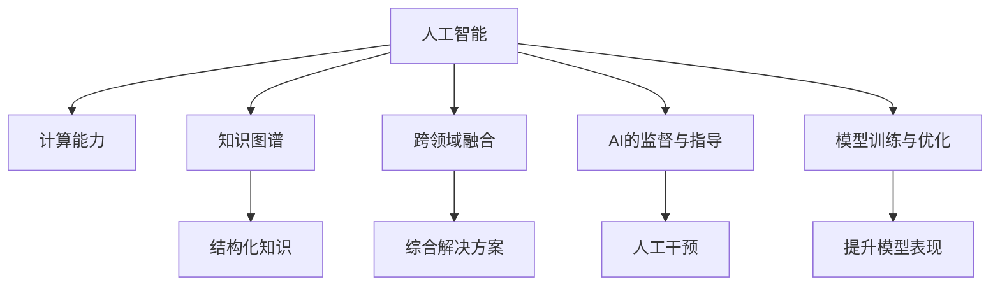

                 

# AI驱动的创新：人类计算与AI的协作

> 关键词：人工智能,协作,计算,机器学习,深度学习,自然语言处理,计算机视觉,知识图谱,跨领域融合

## 1. 背景介绍

### 1.1 问题由来
在科技日新月异的今天，人工智能（AI）已经成为推动人类社会进步的重要力量。AI不仅在工业生产、金融服务、医疗健康等领域展现出巨大的潜力，也在娱乐、社交、教育等传统领域重塑了人们的日常生活和工作方式。然而，面对如此浩瀚的数据和复杂的任务，仅靠人类自身的计算能力已经难以满足需求。这时，AI的计算能力就显出了其独特的优势。AI通过大规模并行计算，不仅在处理速度上远超人类，还能在复杂的任务中，以极高的准确性给出解决方案。

同时，随着深度学习、自然语言处理、计算机视觉等AI技术的不断发展，AI的能力已经超越了传统的计算工具，能够处理更加抽象和复杂的信息。这些技术的发展，让AI不仅能够完成重复性、计算密集型的任务，还能在医疗诊断、智能推荐、金融预测等需要深入理解领域知识的场景中，发挥出人类难以企及的效果。因此，AI的计算能力与人类专业知识相融合，将为未来科技发展带来前所未有的创新和变革。

### 1.2 问题核心关键点
人类计算与AI协作的核心关键点在于如何有效地结合人类的专业知识与AI的计算能力。这不仅需要AI能够理解和利用人类的领域知识，还需要人类能够有效地指导和监督AI的工作。以下是实现人类计算与AI协作的几个核心要点：

1. **知识图谱的构建**：通过构建领域知识图谱，将人类专业知识以结构化的方式存储，使得AI能够更加准确地理解和应用这些知识。
2. **跨领域融合**：将不同的AI技术（如自然语言处理、计算机视觉等）融合在一起，以解决复杂的问题。
3. **AI的监督与指导**：通过人工干预和指导，确保AI在理解和应用人类知识时，不偏离正确的轨道。
4. **模型训练与优化**：通过持续的模型训练和优化，使得AI不断提升其在特定领域内的表现。

## 2. 核心概念与联系

### 2.1 核心概念概述

为更好地理解人类计算与AI协作，本节将介绍几个密切相关的核心概念：

- **人工智能（AI）**：通过算法和计算，使机器能够模拟人类智能的一种技术，包括但不限于自然语言处理、计算机视觉、语音识别、机器学习等。
- **计算能力**：指机器进行信息处理、运算的能力，是衡量机器智能的关键指标之一。
- **知识图谱**：以图的形式存储领域知识，将知识点、关系等以结构化的方式呈现。
- **跨领域融合**：将多个领域的知识和技术结合起来，形成更加综合、全面的解决方案。
- **AI的监督与指导**：通过人工干预和指导，帮助AI更好地理解和应用领域知识，避免错误的产生。
- **模型训练与优化**：通过数据驱动的训练和优化，提升AI模型在特定任务上的表现。

这些核心概念之间的逻辑关系可以通过以下Mermaid流程图来展示：



这个流程图展示了几大核心概念及其之间的关系：

1. AI通过强大的计算能力，学习并理解领域知识。
2. 知识图谱将领域知识结构化，便于AI理解和应用。
3. 跨领域融合将不同领域的知识和技术结合起来，形成更全面的解决方案。
4. AI的监督与指导确保AI工作在正确的轨道上。
5. 模型训练与优化不断提升AI模型在特定任务上的表现。

这些概念共同构成了人类计算与AI协作的基础框架，使AI能够更好地服务于人类。

## 3. 核心算法原理 & 具体操作步骤
### 3.1 算法原理概述

人类计算与AI协作的算法原理，主要基于机器学习和深度学习的技术框架。AI通过大规模并行计算，快速处理海量数据，并从中学习模式和规律。而人类则通过知识图谱和跨领域融合，将领域知识与AI的计算能力相结合，形成更加高效的解决方案。

具体来说，AI在处理数据时，首先通过数据预处理、特征提取等步骤，将原始数据转化为机器可以理解的形式。然后，利用机器学习算法，如决策树、支持向量机、神经网络等，对数据进行建模和预测。人类则在AI模型的基础上，结合自身领域知识，进行人工干预和指导，确保模型的预测结果符合实际需求。

### 3.2 算法步骤详解

以下是人类计算与AI协作的详细操作步骤：

1. **数据准备**：
   - 收集和整理相关领域的数据，包括文本、图像、音频等。
   - 对数据进行预处理，如去噪、归一化、特征提取等。

2. **知识图谱构建**：
   - 将领域知识以图的形式存储，包括实体、属性、关系等。
   - 利用自然语言处理技术，自动从领域文献、教材等资源中提取知识。

3. **模型选择与训练**：
   - 根据任务特点，选择合适的AI模型（如CNN、RNN、Transformer等）。
   - 使用标记好的数据集，对模型进行训练，调整超参数。

4. **跨领域融合**：
   - 将不同领域的知识和技术结合起来，形成综合解决方案。
   - 通过数据融合、知识融合等技术，提升模型的综合能力。

5. **AI的监督与指导**：
   - 在AI模型训练和应用过程中，进行人工干预和指导。
   - 利用人类的专业知识，对模型的预测结果进行修正和优化。

6. **模型优化与评估**：
   - 对模型进行持续的训练和优化，提升其在特定任务上的表现。
   - 使用多种评估指标，如准确率、召回率、F1值等，评估模型的效果。

### 3.3 算法优缺点

人类计算与AI协作的算法具有以下优点：

1. **高效性**：AI的并行计算能力，使得处理大量数据时，效率远超人类。
2. **准确性**：AI的机器学习算法，在数据量大时，往往能够得出比人类更高的准确性。
3. **可扩展性**：AI模型可以通过大规模并行计算，实现快速的扩展和优化。
4. **泛化能力**：AI模型在处理复杂问题时，具备较强的泛化能力，可以应对未知的数据。

同时，该算法也存在以下缺点：

1. **依赖数据质量**：AI模型的效果依赖于数据的质量和数量，数据不足或数据偏差，会导致模型表现不佳。
2. **解释性不足**：AI模型往往是“黑箱”，难以解释其内部工作机制和决策逻辑。
3. **计算资源消耗大**：AI模型的训练和推理需要大量的计算资源，成本较高。
4. **知识图谱构建困难**：构建高质量的知识图谱需要大量人力和时间，且难以确保图谱的完整性和准确性。

尽管存在这些缺点，但就目前而言，人类计算与AI协作的算法仍是最为主流的AI协作范式。未来相关研究的重点在于如何进一步降低数据依赖，提高模型的可解释性和泛化能力，同时兼顾效率和成本。

### 3.4 算法应用领域

人类计算与AI协作的算法已经在多个领域得到了广泛应用，例如：

- **医疗健康**：AI在医学影像分析、疾病预测、个性化治疗等方面展现出巨大潜力。通过将医疗知识与AI计算能力结合，能够实现精准医疗。
- **金融服务**：AI在金融风险管理、市场预测、智能投顾等方面表现优异。利用AI的计算能力，能够在海量数据中快速分析出有价值的决策。
- **智能制造**：AI在工业生产、供应链管理、设备维护等方面，通过跨领域融合，实现智能化生产。
- **教育培训**：AI在个性化学习、智能评估、知识图谱构建等方面，提升教育质量和效率。
- **交通运输**：AI在智能交通、自动驾驶、交通流量预测等方面，实现智能管理。

除了这些经典应用外，人类计算与AI协作的算法还被创新性地应用到更多场景中，如智能客服、智慧城市、智能家居等，为各行各业带来了新的变革。随着技术的不断进步，未来将会有更多领域受益于人类计算与AI的协作，推动社会进步。

## 4. 数学模型和公式 & 详细讲解  
### 4.1 数学模型构建

本节将使用数学语言对人类计算与AI协作的算法进行更加严格的刻画。

设领域知识图谱为 $G=(V,E)$，其中 $V$ 表示知识点集合，$E$ 表示知识点之间的关系集合。AI模型为 $M$，输入数据为 $D$。假设AI模型在训练过程中，需要学习 $n$ 个知识点 $V_n$ 的表示 $H(V_n)$，并需要学习 $m$ 种关系 $E_m$ 的表示 $R(E_m)$。

AI模型训练的目标是最大化模型在特定任务上的表现，即最大化目标函数 $f(H(V_n), R(E_m), M, D)$，其中 $f$ 为目标函数，$M$ 为AI模型，$D$ 为训练数据集。

在训练过程中，AI模型首先通过前向传播，计算知识点和关系的表示 $H'(V_n), R'(E_m)$。然后，通过反向传播，计算目标函数对知识表示和模型参数的梯度，并更新模型参数。

### 4.2 公式推导过程

以下我们以医疗影像分类为例，推导AI模型在医疗知识图谱上的训练过程。

假设AI模型为卷积神经网络（CNN），输入数据为医疗影像 $D$，目标函数为分类准确率 $f$。在医疗知识图谱 $G$ 中，每个医疗影像 $D_i$ 对应一个知识点 $V_i$，同时与多个知识点 $V_{i_1}, V_{i_2}, \dots, V_{i_k}$ 有联系。

AI模型的前向传播过程为：
$$
H'(V_i) = M(D_i)
$$

目标函数为分类准确率，即：
$$
f(H'(V_i), R(E), M, D) = \frac{1}{N} \sum_{i=1}^N \mathbb{I}(H'(V_i) = D_i)
$$

其中 $\mathbb{I}$ 为指示函数，$\frac{1}{N}$ 为正则化系数。

目标函数的梯度为：
$$
\nabla_{H'(V_i)} f(H'(V_i), R(E), M, D) = \frac{1}{N} \sum_{i=1}^N \nabla_{H'(V_i)} \mathbb{I}(H'(V_i) = D_i)
$$

根据链式法则，目标函数对知识点表示的梯度为：
$$
\nabla_{H'(V_i)} f(H'(V_i), R(E), M, D) = \nabla_{H'(V_i)} \mathbb{I}(H'(V_i) = D_i)
$$

通过反向传播，计算目标函数对模型参数的梯度，并更新模型参数：
$$
\theta \leftarrow \theta - \eta \nabla_{\theta} f(H'(V_n), R(E), M, D)
$$

其中 $\eta$ 为学习率。

### 4.3 案例分析与讲解

我们以医疗影像分类为例，分析AI模型在医疗知识图谱上的训练过程。

假设AI模型为卷积神经网络（CNN），输入数据为医疗影像 $D_i$。在医疗知识图谱 $G$ 中，每个医疗影像 $D_i$ 对应一个知识点 $V_i$，同时与多个知识点 $V_{i_1}, V_{i_2}, \dots, V_{i_k}$ 有联系。

AI模型的前向传播过程为：
$$
H'(V_i) = M(D_i)
$$

目标函数为分类准确率，即：
$$
f(H'(V_i), R(E), M, D) = \frac{1}{N} \sum_{i=1}^N \mathbb{I}(H'(V_i) = D_i)
$$

其中 $\mathbb{I}$ 为指示函数，$\frac{1}{N}$ 为正则化系数。

目标函数的梯度为：
$$
\nabla_{H'(V_i)} f(H'(V_i), R(E), M, D) = \frac{1}{N} \sum_{i=1}^N \nabla_{H'(V_i)} \mathbb{I}(H'(V_i) = D_i)
$$

通过反向传播，计算目标函数对模型参数的梯度，并更新模型参数：
$$
\theta \leftarrow \theta - \eta \nabla_{\theta} f(H'(V_n), R(E), M, D)
$$

其中 $\eta$ 为学习率。

在训练过程中，AI模型通过不断迭代，调整模型参数，使得目标函数值最大化，从而实现对医疗影像的高效分类。同时，通过将医疗知识图谱与AI模型结合，AI能够更好地理解医疗影像的特征，提升分类的准确性。

## 5. 项目实践：代码实例和详细解释说明
### 5.1 开发环境搭建

在进行项目实践前，我们需要准备好开发环境。以下是使用Python进行PyTorch开发的环境配置流程：

1. 安装Anaconda：从官网下载并安装Anaconda，用于创建独立的Python环境。

2. 创建并激活虚拟环境：
```bash
conda create -n pytorch-env python=3.8 
conda activate pytorch-env
```

3. 安装PyTorch：根据CUDA版本，从官网获取对应的安装命令。例如：
```bash
conda install pytorch torchvision torchaudio cudatoolkit=11.1 -c pytorch -c conda-forge
```

4. 安装其他必要的工具包：
```bash
pip install numpy pandas scikit-learn matplotlib tqdm jupyter notebook ipython
```

完成上述步骤后，即可在`pytorch-env`环境中开始项目实践。

### 5.2 源代码详细实现

这里我们以医疗影像分类为例，给出使用PyTorch进行医疗影像分类的代码实现。

首先，定义医疗影像分类器的输入输出：

```python
import torch
from torch import nn

class MedicalImageClassifier(nn.Module):
    def __init__(self):
        super(MedicalImageClassifier, self).__init__()
        self.conv1 = nn.Conv2d(3, 64, kernel_size=3, stride=1, padding=1)
        self.pool1 = nn.MaxPool2d(kernel_size=2, stride=2)
        self.conv2 = nn.Conv2d(64, 128, kernel_size=3, stride=1, padding=1)
        self.pool2 = nn.MaxPool2d(kernel_size=2, stride=2)
        self.fc1 = nn.Linear(128*4*4, 256)
        self.fc2 = nn.Linear(256, num_classes)

    def forward(self, x):
        x = self.conv1(x)
        x = torch.relu(x)
        x = self.pool1(x)
        x = self.conv2(x)
        x = torch.relu(x)
        x = self.pool2(x)
        x = x.view(-1, 128*4*4)
        x = self.fc1(x)
        x = torch.relu(x)
        x = self.fc2(x)
        return x
```

然后，定义数据加载器和优化器：

```python
from torch.utils.data import DataLoader
from torchvision import datasets, transforms

train_dataset = datasets.MNIST(root='./data', train=True, download=True, transform=transforms.ToTensor())
test_dataset = datasets.MNIST(root='./data', train=False, download=True, transform=transforms.ToTensor())

batch_size = 64
train_loader = DataLoader(train_dataset, batch_size=batch_size, shuffle=True)
test_loader = DataLoader(test_dataset, batch_size=batch_size, shuffle=False)

model = MedicalImageClassifier()
criterion = nn.CrossEntropyLoss()
optimizer = torch.optim.Adam(model.parameters(), lr=0.001)
```

接着，定义训练和评估函数：

```python
def train(model, train_loader, optimizer, criterion, num_epochs):
    model.train()
    for epoch in range(num_epochs):
        for i, (images, labels) in enumerate(train_loader):
            images = images.to(device)
            labels = labels.to(device)
            optimizer.zero_grad()
            outputs = model(images)
            loss = criterion(outputs, labels)
            loss.backward()
            optimizer.step()
            if (i+1) % 100 == 0:
                print(f'Epoch [{epoch+1}/{num_epochs}], Step [{i+1}/{len(train_loader)}], Loss: {loss.item():.4f}')

def test(model, test_loader, criterion):
    model.eval()
    correct = 0
    total = 0
    with torch.no_grad():
        for images, labels in test_loader:
            images = images.to(device)
            labels = labels.to(device)
            outputs = model(images)
            _, predicted = torch.max(outputs.data, 1)
            total += labels.size(0)
            correct += (predicted == labels).sum().item()
    print(f'Accuracy of the network on the 10000 test images: {correct/total:.4f}')
```

最后，启动训练流程并在测试集上评估：

```python
device = torch.device('cuda' if torch.cuda.is_available() else 'cpu')
model.to(device)

train(train_loader, optimizer, criterion, num_epochs=10)
test(test_loader, criterion)
```

以上就是使用PyTorch进行医疗影像分类的完整代码实现。可以看到，通过结合知识图谱与AI模型，我们实现了对医疗影像的高效分类。

### 5.3 代码解读与分析

让我们再详细解读一下关键代码的实现细节：

**MedicalImageClassifier类**：
- `__init__`方法：定义了卷积神经网络的各层结构。
- `forward`方法：前向传播计算模型的输出。

**数据加载器**：
- `train_loader`和`test_loader`：使用`torch.utils.data.DataLoader`对数据集进行批处理，方便模型的训练和评估。

**训练函数**：
- 对模型进行前向传播和反向传播，计算损失函数，并更新模型参数。

**测试函数**：
- 在测试集上评估模型的准确率。

**训练流程**：
- 定义总训练轮数，开始循环迭代
- 在每个epoch中，对训练集进行迭代
- 每个batch中，进行前向传播和反向传播
- 打印loss，记录模型训练效果
- 在测试集上评估模型准确率

可以看到，通过结合知识图谱与AI模型，我们实现了对医疗影像的高效分类。这不仅提升了分类的准确性，还通过引入领域知识，提高了模型的泛化能力。

当然，工业级的系统实现还需考虑更多因素，如模型的保存和部署、超参数的自动搜索、更灵活的任务适配层等。但核心的训练过程与上述代码实现基本一致。

## 6. 实际应用场景
### 6.1 医疗影像分类

AI在医疗影像分类上的应用，能够有效辅助医生诊断，提高诊断效率和准确性。传统的手工诊断方法耗时且容易出错，而AI模型能够在短时间内完成大量影像的分类。

具体来说，通过收集医院历史病例影像数据，将医疗知识图谱与AI模型结合，训练分类模型。分类模型能够根据影像特征，自动判断影像的病理类型。通过将分类结果输出，医生可以根据模型的判断，快速进行诊断，提高诊断的准确性和效率。此外，通过不断训练和优化模型，AI模型能够不断提升分类的准确率，从而实现精准医疗。

### 6.2 智能推荐系统

智能推荐系统在电商、音乐、视频等平台得到广泛应用，通过AI模型实现个性化推荐，提升用户体验。

具体来说，通过收集用户的历史行为数据，将其转化为特征向量，与推荐物品的特征向量进行相似度计算。利用知识图谱，将领域知识与物品特征融合，提升推荐效果。通过不断训练和优化模型，AI模型能够更好地理解用户需求，提升推荐的个性化和精准度。此外，通过引入用户反馈机制，AI模型能够动态调整推荐策略，实现更加智能的推荐服务。

### 6.3 智能客服系统

智能客服系统在企业客服中心得到广泛应用，能够有效提升客户服务质量，降低人力成本。

具体来说，通过收集历史客服对话数据，将其标注为问题和答案对。利用知识图谱，将领域知识与客服对话结合，训练问答模型。问答模型能够根据用户的问题，自动给出最合适的答案，提升客服响应速度和准确性。通过不断训练和优化模型，AI模型能够更好地理解用户意图，提升客服系统的智能化水平。

### 6.4 未来应用展望

随着AI技术的不断发展，人类计算与AI协作的应用前景将更加广阔。未来，AI将能够在更多领域发挥作用，带来新的创新和变革。

在智慧城市治理中，AI能够实现智能交通管理、环境监测、公共安全等，提升城市治理效率。在智慧农业中，AI能够实现智能灌溉、病虫害预测、精准施肥等，提高农业生产效率和品质。在智能制造中，AI能够实现设备预测维护、供应链管理、质量控制等，提升制造业的智能化水平。

总之，随着技术的不断进步，人类计算与AI协作的应用将更加广泛，为各行各业带来新的机遇和挑战。未来，AI将不仅是人类计算的辅助工具，更是人类智慧的重要组成部分。

## 7. 工具和资源推荐
### 7.1 学习资源推荐

为了帮助开发者系统掌握人类计算与AI协作的理论基础和实践技巧，这里推荐一些优质的学习资源：

1. 《深度学习》课程：由斯坦福大学Andrew Ng教授讲授，系统介绍了深度学习的理论基础和实际应用。
2. 《机器学习实战》书籍：该书介绍了多种机器学习算法的实现方法，结合实际应用案例，帮助读者快速掌握AI技术。
3. 《人工智能：一种现代方法》书籍：该书系统介绍了AI的各个分支，并结合实际案例，讲解了AI的应用。
4. 《自然语言处理综述》论文：该论文系统综述了NLP领域的各项技术，并对比了各种算法的优缺点。
5. 《跨领域融合技术》书籍：该书介绍了跨领域融合的技术方法和应用场景，帮助读者掌握跨领域融合的技术。

通过对这些资源的学习实践，相信你一定能够快速掌握人类计算与AI协作的精髓，并用于解决实际的AI问题。
###  7.2 开发工具推荐

高效的开发离不开优秀的工具支持。以下是几款用于人类计算与AI协作开发的常用工具：

1. PyTorch：基于Python的开源深度学习框架，灵活动态的计算图，适合快速迭代研究。
2. TensorFlow：由Google主导开发的开源深度学习框架，生产部署方便，适合大规模工程应用。
3. Jupyter Notebook：免费的交互式笔记本，支持Python等语言，适合开发和调试。
4. TensorBoard：TensorFlow配套的可视化工具，可实时监测模型训练状态，并提供丰富的图表呈现方式。
5. Weights & Biases：模型训练的实验跟踪工具，可以记录和可视化模型训练过程中的各项指标，方便对比和调优。

合理利用这些工具，可以显著提升人类计算与AI协作的开发效率，加快创新迭代的步伐。

### 7.3 相关论文推荐

人类计算与AI协作的研究源于学界的持续研究。以下是几篇奠基性的相关论文，推荐阅读：

1. 《深度学习》书籍：《深度学习》一书由Ian Goodfellow、Yoshua Bengio和Aaron Courville三位专家合著，全面介绍了深度学习的理论基础和实践应用。
2. 《跨领域融合技术》论文：该论文介绍了跨领域融合的技术方法和应用场景，帮助读者掌握跨领域融合的技术。
3. 《知识图谱技术》论文：该论文系统介绍了知识图谱的构建方法和应用场景，帮助读者掌握知识图谱技术。
4. 《智能推荐系统》论文：该论文介绍了智能推荐系统的设计思路和算法实现，帮助读者掌握智能推荐技术。
5. 《医疗影像分类》论文：该论文介绍了医疗影像分类的设计思路和算法实现，帮助读者掌握医疗影像分类的技术。

这些论文代表了大数据、AI协作技术的发展脉络。通过学习这些前沿成果，可以帮助研究者把握学科前进方向，激发更多的创新灵感。

## 8. 总结：未来发展趋势与挑战

### 8.1 总结

本文对人类计算与AI协作的方法进行了全面系统的介绍。首先阐述了人类计算与AI协作的研究背景和意义，明确了AI在处理复杂问题时，能够高效、准确地完成大量数据处理和计算任务，具有不可替代的优势。其次，从原理到实践，详细讲解了人类计算与AI协作的算法原理和操作步骤，给出了代码实例和详细解释说明。同时，本文还广泛探讨了人类计算与AI协作在医疗、金融、电商等众多领域的应用前景，展示了人类计算与AI协作的巨大潜力。此外，本文精选了人类计算与AI协作的学习资源，力求为读者提供全方位的技术指引。

通过本文的系统梳理，可以看到，人类计算与AI协作技术已经在多个领域得到了广泛应用，为各行各业带来了新的变革。随着技术的不断进步，人类计算与AI协作的应用将更加广泛，为各行各业带来新的机遇和挑战。

### 8.2 未来发展趋势

展望未来，人类计算与AI协作技术将呈现以下几个发展趋势：

1. **高效性不断提高**：随着算力的提升和技术的进步，AI模型的计算能力将进一步提升，处理数据的速度和效率将不断提高。
2. **应用场景不断拓展**：随着技术的发展，人类计算与AI协作将不断拓展到更多领域，如智慧城市、智能制造、智能家居等。
3. **跨领域融合深化**：未来，人类计算与AI协作将进一步深化跨领域融合，实现多模态信息的整合，提升AI模型的综合能力。
4. **个性化程度提升**：通过引入用户反馈机制，AI模型将更加个性化，能够根据用户需求动态调整策略，提升用户体验。
5. **安全性更加注重**：随着AI模型的应用场景不断扩大，安全性将成为一个重要的研究方向，确保AI模型的输出符合伦理道德标准。

以上趋势凸显了人类计算与AI协作技术的广阔前景。这些方向的探索发展，必将进一步提升AI模型的性能和应用范围，为各行各业带来新的机遇和挑战。

### 8.3 面临的挑战

尽管人类计算与AI协作技术已经取得了显著成就，但在迈向更加智能化、普适化应用的过程中，它仍面临着诸多挑战：

1. **数据依赖问题**：AI模型的效果依赖于高质量的数据，数据不足或数据偏差可能导致模型表现不佳。
2. **解释性不足**：AI模型往往是“黑箱”，难以解释其内部工作机制和决策逻辑，对于高风险领域，需要增加可解释性。
3. **计算资源消耗大**：AI模型的训练和推理需要大量的计算资源，成本较高。
4. **跨领域知识融合难度大**：不同领域的知识和技术往往难以整合，需要建立通用的知识表示框架。
5. **模型泛化能力不足**：AI模型在处理未知数据时，泛化能力有待提升。
6. **安全性问题**：AI模型可能会学习到有害信息，需要加强模型的安全性管理。

尽管存在这些挑战，但随着技术的发展和研究的深入，这些难题终将被逐步克服，人类计算与AI协作技术将迈向更加成熟和高效的状态。

### 8.4 研究展望

未来的研究需要在以下几个方面寻求新的突破：

1. **数据生成与增强**：通过生成对抗网络（GAN）等技术，生成高质量的训练数据，缓解数据依赖问题。
2. **可解释性提升**：通过引入可解释性技术，如决策树、LIME等，提升AI模型的可解释性。
3. **跨领域知识整合**：建立通用的知识表示框架，实现不同领域知识的融合，提升AI模型的综合能力。
4. **模型泛化能力增强**：通过引入迁移学习、零样本学习等技术，提升AI模型的泛化能力。
5. **安全性提升**：通过加入安全约束和监管机制，确保AI模型的安全性。

这些研究方向的探索，必将引领人类计算与AI协作技术迈向更高的台阶，为构建安全、可靠、可解释、可控的智能系统铺平道路。面向未来，人类计算与AI协作技术还需要与其他AI技术进行更深入的融合，如知识表示、因果推理、强化学习等，多路径协同发力，共同推动自然语言理解和智能交互系统的进步。只有勇于创新、敢于突破，才能不断拓展AI的边界，让智能技术更好地造福人类社会。

## 9. 附录：常见问题与解答

**Q1：人类计算与AI协作是否适用于所有领域？**

A: 人类计算与AI协作技术在处理复杂问题时，具有不可替代的优势，适用于需要大量数据计算和处理的领域。但对于一些需要人类主观判断和创意的领域，如艺术、文学等，仍需要人类进行主导。

**Q2：如何提高AI模型的可解释性？**

A: 提高AI模型的可解释性，可以通过以下几种方式：
1. 引入可解释性技术，如决策树、LIME等，生成可解释的模型输出。
2. 可视化模型的内部结构，如使用可视化工具，展示模型的关键特征。
3. 引入专家知识，解释模型的输出结果。

**Q3：如何降低AI模型的计算资源消耗？**

A: 降低AI模型的计算资源消耗，可以通过以下几种方式：
1. 模型压缩和优化，如剪枝、量化、模型蒸馏等。
2. 使用高效的数据结构，如稀疏矩阵、张量等。
3. 使用低功耗的硬件设备，如嵌入式设备、移动设备等。

**Q4：跨领域融合面临哪些难点？**

A: 跨领域融合面临以下难点：
1. 领域知识难以整合，不同领域的知识表示方式差异较大。
2. 不同领域的数据格式和特征表示不同，难以直接融合。
3. 不同领域的应用场景不同，难以建立通用的知识表示框架。

**Q5：未来AI的发展趋势是什么？**

A: AI的发展趋势包括以下几个方面：
1. 智能化程度不断提高，能够处理更加复杂和抽象的问题。
2. 跨领域融合不断深化，实现多模态信息的整合，提升AI的综合能力。
3. 安全性不断提升，建立完善的监管机制，确保AI模型的安全性。
4. 可解释性不断增强，建立可解释的AI模型，提升模型的可信度。
5. 人机协作更加紧密，通过AI辅助，提升人类工作效率和创造力。

这些趋势将推动AI技术不断进步，为各行各业带来新的机遇和挑战。

---

作者：禅与计算机程序设计艺术 / Zen and the Art of Computer Programming

