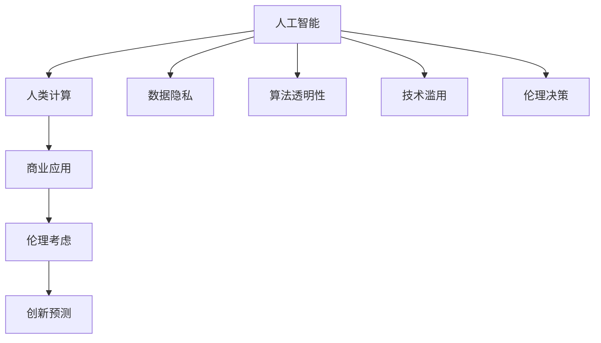

                 

# AI驱动的创新：人类计算在商业中的道德考虑因素与应用前景趋势预测分析

> 关键词：人工智能,道德考虑,人类计算,商业应用,创新预测

## 1. 背景介绍

### 1.1 问题由来
在21世纪，随着人工智能(AI)技术的迅猛发展，特别是深度学习、计算机视觉、自然语言处理等领域的突破，AI已经成为推动商业创新的重要驱动力。AI技术通过自动化和优化，帮助企业提高效率，降低成本，创造新的业务模式，释放巨大的商业价值。

然而，AI的广泛应用也带来了诸多道德问题，如数据隐私、算法透明性、就业影响、技术滥用等，这些问题不仅关系到企业的社会责任，也影响到公众对AI技术的信任和接受度。因此，在商业应用中，如何在利用AI技术的同时，兼顾道德伦理，成为亟待解决的关键问题。

### 1.2 问题核心关键点
1. **数据隐私与合规**：AI技术依赖大量数据进行训练和优化，数据隐私成为关键考量。如何保护用户隐私，遵守数据保护法规，成为AI应用的重要原则。
2. **算法透明性与可解释性**：AI算法的黑盒特性使得用户难以理解其决策过程，缺乏可解释性。如何增强算法的透明度，让用户信服，成为推动AI普及的重要路径。
3. **技术对就业的影响**：AI技术自动化取代部分职位，可能对劳动力市场产生冲击。如何在AI应用中平衡技术进步和就业保障，是商业应用中需要深入思考的问题。
4. **技术滥用与安全性**：AI技术容易被恶意利用，如深度伪造、欺诈检测等。如何保障技术的安全性和合理使用，避免伦理风险，是AI应用必须面对的挑战。
5. **伦理决策与责任分配**：AI技术决策过程中可能产生伦理冲突，如自动驾驶中的道德决策、医疗诊断中的错误判断等。如何在AI决策中明确责任归属，保障伦理决策的公正性，是AI应用需要解决的核心问题。

这些关键点共同构成了AI在商业应用中需要考虑的道德和伦理维度，对企业和社会的长远发展具有重要意义。

### 1.3 问题研究意义
研究AI在商业中的道德考虑因素，对于推动AI技术的健康发展，构建透明、公正、安全的AI应用体系，具有重要意义：

1. **提升公众信任**：通过加强AI应用的道德监管，增强用户对AI技术的信任，促进AI技术的普及和应用。
2. **优化商业决策**：合理利用AI技术，平衡技术创新和伦理道德，有助于企业做出更为明智的商业决策。
3. **促进就业平衡**：通过政策引导和技术培训，实现AI技术进步与劳动力市场动态平衡。
4. **保障技术安全**：建立完善的AI技术使用规范，防止技术滥用，保障社会安全和稳定。
5. **强化伦理决策**：在AI决策过程中引入伦理考量，确保技术应用符合社会价值观和法律规范。

## 2. 核心概念与联系

### 2.1 核心概念概述

为更好地理解AI在商业中的道德考虑因素和应用前景，本节将介绍几个核心概念：

- **人工智能(AI)**：指通过计算机算法和模型，使机器能够执行智能任务的技术。包括机器学习、深度学习、自然语言处理等多种技术。
- **人类计算(Computational Humanities)**：利用计算机技术处理和分析人类文化数据的领域，如文本挖掘、情感分析、图像识别等。
- **商业应用(Business Application)**：指AI技术在商业领域的应用，如客户服务、供应链管理、市场分析等，旨在提升商业效率和竞争力。
- **伦理考虑(Ethical Consideration)**：指在AI应用中，对数据隐私、算法透明性、技术滥用等问题进行深入思考和处理的道德原则。
- **创新预测(Innovation Prediction)**：指通过数据分析和模型预测，对AI技术的未来发展趋势进行分析和预测，指导企业决策。

这些概念之间的逻辑关系可以通过以下Mermaid流程图来展示：



这个流程图展示了大语言模型在商业应用中的核心概念及其之间的关系：

1. 人工智能通过处理人类文化数据，实现各种智能任务。
2. 人类计算将人工智能应用于商业领域，提升商业效率。
3. 商业应用中需考虑伦理问题，如数据隐私、算法透明性等。
4. 创新预测通过分析商业应用中的数据，预测未来趋势，指导企业决策。

## 3. 核心算法原理 & 具体操作步骤

### 3.1 算法原理概述

AI在商业应用中的核心算法包括深度学习、自然语言处理、计算机视觉等。其中，深度学习通过多层神经网络进行特征提取和模式识别，自然语言处理通过语言模型进行文本分析和生成，计算机视觉通过图像处理模型进行图像识别和分类。这些算法的核心原理是基于大规模数据训练模型，使其能够学习和优化特定任务。

### 3.2 算法步骤详解

AI在商业应用中的算法步骤一般包括以下几个关键环节：

**Step 1: 数据收集与预处理**
- 收集与商业应用相关的数据，如客户交易记录、市场分析报告、客户反馈等。
- 对数据进行清洗和预处理，去除噪声，填补缺失值。

**Step 2: 模型选择与训练**
- 根据具体任务选择适合的深度学习模型，如卷积神经网络(CNN)、循环神经网络(RNN)、变换器(Transformer)等。
- 使用预处理后的数据训练模型，调整模型参数以优化预测性能。

**Step 3: 模型评估与优化**
- 使用测试集对训练好的模型进行评估，如计算准确率、召回率、F1分数等指标。
- 根据评估结果，对模型进行参数调整或重新训练，优化模型性能。

**Step 4: 模型部署与应用**
- 将训练好的模型部署到实际商业环境中，如客户服务系统、市场分析平台等。
- 监测模型性能，收集用户反馈，持续优化模型。

**Step 5: 道德考量与合规检查**
- 在模型部署后，定期进行道德和合规检查，确保AI应用的合法合规。
- 对用户隐私、算法透明性、技术滥用等问题进行监控和处理。

### 3.3 算法优缺点

AI在商业应用中的算法具有以下优点：

1. **提升效率**：通过自动化和优化，显著提升商业运营效率，降低成本。
2. **创新业务模式**：基于数据驱动的决策，创新出传统业务模式无法实现的新模式。
3. **预测分析能力**：通过模型预测和数据分析，帮助企业提前掌握市场趋势和客户需求。

同时，这些算法也存在一定的局限性：

1. **数据依赖性高**：算法依赖大量高质量数据进行训练，数据质量和数量对算法效果有直接影响。
2. **模型复杂度高**：深度学习等算法的模型结构复杂，计算资源消耗大。
3. **透明性和可解释性不足**：AI模型的黑盒特性使得用户难以理解其决策过程，缺乏可解释性。
4. **道德风险**：算法可能被滥用，造成数据隐私泄露、算法歧视等道德风险。
5. **技术门槛高**：开发和维护高质量AI应用需要较高的技术门槛，需要专业人才支持。

### 3.4 算法应用领域

AI在商业中的应用领域非常广泛，包括但不限于以下几个方面：

- **客户服务**：通过自然语言处理和机器学习，实现自动化客服、智能推荐、情感分析等功能，提升客户满意度。
- **供应链管理**：利用数据分析和预测模型，优化供应链管理流程，提高物流效率。
- **市场分析**：通过文本挖掘和情感分析，分析市场趋势和消费者情绪，指导市场策略。
- **金融分析**：通过深度学习模型，进行股票预测、风险评估、信用评分等，提升金融决策准确性。
- **医疗诊断**：利用计算机视觉和自然语言处理，辅助医生进行疾病诊断、药物研发等，提升医疗服务质量。
- **零售推荐**：通过用户行为分析，实现个性化推荐，提升销售转化率。

## 4. 数学模型和公式 & 详细讲解 & 举例说明

### 4.1 数学模型构建

AI在商业应用中的数学模型构建主要基于统计学和机器学习的理论。以深度学习模型为例，其核心思想是通过大量训练数据，最小化损失函数，使得模型能够对未知数据进行准确预测。常用的深度学习模型包括卷积神经网络(CNN)、循环神经网络(RNN)、变换器(Transformer)等。

### 4.2 公式推导过程

以下以卷积神经网络(CNN)为例，推导其基本结构和计算公式。

假设输入数据为 $x$，输出数据为 $y$，卷积神经网络的参数为 $\theta$。则CNN的输出 $y$ 可以通过以下公式计算：

$$
y = \sigma(Wx + b)
$$

其中，$\sigma$ 为激活函数，$W$ 和 $b$ 为可学习参数，$\theta$ 表示整个模型的参数集合。

具体计算过程中，CNN通过卷积层、池化层、全连接层等结构，提取输入数据的特征。卷积层通过滑动窗口进行卷积操作，提取局部特征；池化层通过降采样，缩小特征图的尺寸；全连接层将特征图展开成一维向量，通过线性变换和激活函数，生成最终的输出。

### 4.3 案例分析与讲解

以零售推荐系统为例，分析其算法构建和应用过程：

1. **数据收集**：收集用户的历史购买记录、浏览记录、评价数据等，构建用户行为数据集。
2. **特征工程**：对用户行为数据进行特征提取，如用户ID、商品ID、购买时间等，生成特征向量。
3. **模型选择**：选择适合深度学习的推荐模型，如协同过滤、基于深度学习的推荐模型等。
4. **模型训练**：使用用户行为数据集训练推荐模型，调整模型参数以优化推荐性能。
5. **模型评估**：使用测试集对训练好的推荐模型进行评估，如计算推荐准确率、召回率等指标。
6. **模型部署**：将训练好的推荐模型部署到实际商业环境中，如电商平台、社交网络等。
7. **道德考量**：定期进行数据隐私、算法透明性等道德合规检查，确保推荐系统的公正性和安全性。

## 5. 项目实践：代码实例和详细解释说明

### 5.1 开发环境搭建

在进行AI项目实践前，我们需要准备好开发环境。以下是使用Python进行TensorFlow开发的环境配置流程：

1. 安装Anaconda：从官网下载并安装Anaconda，用于创建独立的Python环境。

2. 创建并激活虚拟环境：
```bash
conda create -n tf-env python=3.8 
conda activate tf-env
```

3. 安装TensorFlow：根据CUDA版本，从官网获取对应的安装命令。例如：
```bash
conda install tensorflow
```

4. 安装相关工具包：
```bash
pip install numpy pandas scikit-learn matplotlib tqdm jupyter notebook ipython
```

完成上述步骤后，即可在`tf-env`环境中开始AI项目实践。

### 5.2 源代码详细实现

这里我们以情感分析任务为例，给出使用TensorFlow对卷积神经网络进行情感分析的代码实现。

首先，定义情感分析任务的数据处理函数：

```python
import tensorflow as tf
from tensorflow.keras.preprocessing.text import Tokenizer
from tensorflow.keras.preprocessing.sequence import pad_sequences
import pandas as pd

def preprocess_text(texts, max_len=512):
    tokenizer = Tokenizer(oov_token='<OOV>')
    tokenizer.fit_on_texts(texts)
    sequences = tokenizer.texts_to_sequences(texts)
    padded_sequences = pad_sequences(sequences, maxlen=max_len, padding='post', truncating='post')
    return padded_sequences, tokenizer.word_index
```

然后，定义模型和优化器：

```python
from tensorflow.keras.models import Sequential
from tensorflow.keras.layers import Embedding, Conv1D, GlobalMaxPooling1D, Dense

model = Sequential()
model.add(Embedding(input_dim=word_index.shape[0]+1, output_dim=128, input_length=max_len))
model.add(Conv1D(32, 3, activation='relu'))
model.add(GlobalMaxPooling1D())
model.add(Dense(1, activation='sigmoid'))

optimizer = tf.keras.optimizers.Adam(learning_rate=0.001)
```

接着，定义训练和评估函数：

```python
from tensorflow.keras.utils import to_categorical
from sklearn.metrics import accuracy_score

def train_model(model, train_X, train_y, val_X, val_y, epochs=10, batch_size=64):
    model.compile(optimizer=optimizer, loss='binary_crossentropy', metrics=['accuracy'])
    model.fit(train_X, train_y, batch_size=batch_size, epochs=epochs, validation_data=(val_X, val_y))
    val_loss, val_acc = model.evaluate(val_X, val_y)
    return model, val_acc

def evaluate_model(model, test_X, test_y):
    predictions = model.predict(test_X)
    y_pred = (predictions > 0.5).astype('int32')
    y_true = to_categorical(test_y, num_classes=2)
    accuracy = accuracy_score(y_true, y_pred)
    return accuracy
```

最后，启动训练流程并在测试集上评估：

```python
train_dataset = pd.read_csv('train.csv')
val_dataset = pd.read_csv('val.csv')
test_dataset = pd.read_csv('test.csv')

max_len, word_index = preprocess_text(train_dataset['text'])
train_X, train_y = train_dataset['text'].values, train_dataset['label'].values
val_X, val_y = val_dataset['text'].values, val_dataset['label'].values
test_X, test_y = test_dataset['text'].values, test_dataset['label'].values

model, val_acc = train_model(model, train_X, train_y, val_X, val_y)
print(f"Validation accuracy: {val_acc}")

test_X, test_y = preprocess_text(test_dataset['text'], max_len)
test_X = pad_sequences(test_X, maxlen=max_len, padding='post', truncating='post')
test_y = to_categorical(test_y, num_classes=2)
test_acc = evaluate_model(model, test_X, test_y)
print(f"Test accuracy: {test_acc}")
```

以上就是使用TensorFlow对卷积神经网络进行情感分析的完整代码实现。可以看到，TensorFlow提供了强大的工具链和丰富的API，使模型开发过程更为便捷。

### 5.3 代码解读与分析

让我们再详细解读一下关键代码的实现细节：

**preprocess_text函数**：
- 将文本数据转换为数字序列，并进行定长padding。
- 使用Tokenizer将单词转换为数字id，处理特殊符号"<OOV>"。

**model构建**：
- 使用Embedding层将文本转换为向量表示。
- 通过卷积层提取局部特征，使用GlobalMaxPooling1D层进行特征池化。
- 使用全连接层输出情感分类结果，使用sigmoid激活函数。

**train_model函数**：
- 使用binary_crossentropy作为损失函数，训练模型并输出验证集上的准确率。

**evaluate_model函数**：
- 使用测试集进行模型评估，计算准确率。

**训练流程**：
- 加载训练集、验证集和测试集。
- 对文本进行预处理和padding。
- 训练模型并输出验证集上的准确率。
- 对测试集进行预处理，并计算准确率。

这些代码展示了TensorFlow在深度学习模型构建和训练过程中的便捷性和强大功能，是实际应用中的重要工具。

## 6. 实际应用场景

### 6.1 客户服务

基于深度学习和自然语言处理技术，AI驱动的客户服务系统可以自动解答用户问题，提升服务效率和用户满意度。例如，可以使用文本分类模型对用户查询进行自动分类，并调用预定义的回答模板进行回复。

### 6.2 供应链管理

AI技术可以帮助企业优化供应链管理，通过预测分析和自动化操作，减少库存成本，提升物流效率。例如，可以使用时间序列预测模型对订单量和库存进行预测，自动生成采购计划和库存调整策略。

### 6.3 市场分析

AI技术可以分析海量市场数据，挖掘潜在趋势和机会，帮助企业制定更为科学的市场策略。例如，可以使用情感分析模型对社交媒体数据进行情感分析，了解消费者对产品的评价和需求变化。

### 6.4 金融分析

AI技术可以应用于金融领域，通过深度学习和数据分析，进行股票预测、风险评估、信用评分等，提升金融决策的准确性。例如，可以使用预测模型对股票价格进行预测，使用信用评分模型评估个人信用风险。

### 6.5 医疗诊断

AI技术可以辅助医生进行疾病诊断和治疗方案制定，提升医疗服务的效率和质量。例如，可以使用计算机视觉模型对医学影像进行自动诊断，使用自然语言处理模型对病历进行情感分析。

## 7. 工具和资源推荐

### 7.1 学习资源推荐

为了帮助开发者系统掌握AI技术在商业应用中的实践，这里推荐一些优质的学习资源：

1. **TensorFlow官方文档**：官方文档提供了详尽的API文档和示例代码，是学习和实践AI技术的重要资源。

2. **PyTorch官方文档**：PyTorch是另一个常用的深度学习框架，其官方文档也提供了丰富的学习资源和示例代码。

3. **Coursera《深度学习》课程**：由深度学习领域的知名专家Andrew Ng教授，涵盖了深度学习的基础理论和实践应用，是入门深度学习的良好选择。

4. **Kaggle竞赛平台**：通过参与Kaggle的机器学习竞赛，可以锻炼数据分析和模型构建能力，积累实战经验。

5. **Fast.ai课程**：Fast.ai提供了一系列深度学习的课程和实践项目，旨在让初学者快速上手深度学习。

通过这些学习资源，相信你一定能够快速掌握AI技术在商业应用中的实践方法，并应用于解决实际问题。

### 7.2 开发工具推荐

高效的开发离不开优秀的工具支持。以下是几款用于AI项目开发的常用工具：

1. **Jupyter Notebook**：免费的交互式编程环境，支持Python、R等语言，便于协作和共享代码。

2. **Git和GitHub**：版本控制和代码托管平台，便于团队协作和版本管理。

3. **Keras和TensorFlow**：深度学习框架，提供了便捷的模型构建和训练工具。

4. **PyTorch**：另一个常用的深度学习框架，提供了灵活的API和高效的计算图。

5. **H2O.ai**：开源的数据分析平台，提供了简单易用的API，支持多种机器学习模型。

这些工具为AI项目开发提供了强大的支持和便利，有助于加快开发进程和提高代码质量。

### 7.3 相关论文推荐

AI在商业应用中的研究源于学界的持续探索。以下是几篇奠基性的相关论文，推荐阅读：

1. **《深度学习》(Deep Learning)**：Ian Goodfellow等著，涵盖了深度学习的基础理论和应用实例。

2. **《计算机视觉：模式和代表》(Computer Vision: Models, Learning, and Inference)**：Simon J.D.Bradley著，介绍了计算机视觉的原理和应用。

3. **《自然语言处理综论》(Speech and Language Processing)**：Daniel Jurafsky和James H.Lees著，涵盖了自然语言处理的全面知识。

4. **《人工智能：一种现代方法》(Artificial Intelligence: A Modern Approach)**：Stuart Russell和Peter Norvig著，介绍了AI技术的理论基础和应用实例。

这些论文代表了AI技术在商业应用中的研究脉络，深入理解这些论文可以更好地把握学科的前沿方向。

## 8. 总结：未来发展趋势与挑战

### 8.1 总结

本文对AI在商业应用中的道德考虑因素进行了全面系统的介绍。首先阐述了AI在商业应用中的背景和意义，明确了AI在提升商业效率和创新业务模式方面的独特价值。其次，从原理到实践，详细讲解了AI技术的核心算法和具体操作步骤，给出了实际应用中的完整代码实例。同时，本文还探讨了AI技术在客户服务、供应链管理、市场分析等多个行业领域的应用前景，展示了AI技术的广阔前景。最后，本文精选了AI技术的各类学习资源，力求为读者提供全方位的技术指引。

通过本文的系统梳理，可以看到，AI技术在商业应用中具有巨大的潜力和价值，但在推广应用的过程中，仍需注意数据隐私、算法透明性、技术滥用等道德问题。未来，伴随技术的持续进步，AI在商业应用中必将继续发挥重要作用，推动社会和经济的发展。

### 8.2 未来发展趋势

展望未来，AI在商业应用中的发展趋势将呈现以下几个方向：

1. **更加智能的自动化**：通过深度学习和强化学习等技术，AI系统将具备更高的自主决策能力，能够在复杂环境中进行更优的资源分配和任务调度。
2. **更加普适的技术**：AI技术将进一步普适化，覆盖更多的行业和应用场景，提供更加通用的解决方案。
3. **更加人性化的交互**：AI技术将通过自然语言处理和情感分析等技术，实现更为流畅和智能的人机交互，提升用户体验。
4. **更加透明和可解释**：AI技术将增强算法的透明性和可解释性，通过可视化工具和解释模型，使用户更加信任和接受AI系统。
5. **更加可持续的能源**：AI技术将推动能源系统的智能化和优化，减少能源消耗，实现更加可持续的发展。

以上趋势展示了AI在商业应用中的广阔前景和巨大潜力，必将引领商业和技术领域的新一轮变革。

### 8.3 面临的挑战

尽管AI在商业应用中取得了显著成就，但在推广应用的过程中，仍需面对以下挑战：

1. **数据隐私和安全**：AI系统依赖大量数据进行训练和优化，如何保护用户隐私，防止数据泄露，是AI应用中的重要问题。
2. **算法透明性和可解释性**：AI系统的决策过程缺乏透明性和可解释性，用户难以理解其决策逻辑，导致信任度降低。
3. **技术滥用和伦理风险**：AI技术容易被滥用，造成数据隐私泄露、算法歧视等问题，带来伦理风险。
4. **资源消耗和环境影响**：AI系统的高计算资源消耗，可能对环境造成影响，如何实现可持续发展，是AI应用中的重要课题。
5. **技术普及和人才培养**：AI技术的高门槛和复杂性，使得其普及和应用受到限制，需要加强人才培养和培训。

这些挑战需要各方共同努力，通过技术创新、政策引导和社会监督，才能克服AI应用中的道德和伦理问题，推动技术的健康发展。

### 8.4 研究展望

未来的研究需要在以下几个方面寻求新的突破：

1. **增强算法的透明性和可解释性**：开发更加透明和可解释的AI算法，使用户能够理解和信任AI系统的决策过程。
2. **推动技术普适化和可持续性**：推广AI技术在更多行业和应用场景中的应用，实现可持续发展。
3. **加强伦理和安全研究**：建立AI技术的伦理和安全规范，避免技术滥用和伦理风险。
4. **优化资源使用和环境影响**：优化AI系统的资源使用，减少环境影响，实现绿色发展。
5. **推动技术普及和人才培养**：加强AI技术普及和人才培养，提升技术应用的广度和深度。

这些研究方向将引领AI技术在商业应用中的健康发展，实现技术创新和社会进步的协同进步。

## 9. 附录：常见问题与解答

**Q1：AI在商业应用中如何确保数据隐私？**

A: AI在商业应用中，可以通过以下方法确保数据隐私：

1. **数据匿名化**：使用数据匿名化技术，如脱敏、加密等，防止数据泄露。
2. **隐私保护算法**：使用隐私保护算法，如差分隐私、联邦学习等，保护数据隐私。
3. **数据访问控制**：限制数据访问权限，确保只有授权人员可以访问敏感数据。
4. **数据最小化**：仅收集必要的数据，减少数据泄露的风险。

这些方法可以有效保护数据隐私，确保AI应用在商业环境中的合规性和安全性。

**Q2：AI系统如何增强算法的透明性和可解释性？**

A: 增强AI算法的透明性和可解释性，可以通过以下方法实现：

1. **模型可视化**：使用可视化工具，如TensorBoard等，展示模型的计算过程和参数变化。
2. **可解释性模型**：使用可解释性模型，如LIME、SHAP等，生成模型决策的解释结果。
3. **透明性报告**：在模型输出中增加透明性报告，描述模型的决策逻辑和依据。
4. **用户反馈机制**：建立用户反馈机制，收集用户对AI系统决策的反馈，改进模型性能和透明性。

这些方法可以有效增强AI系统的透明性和可解释性，提高用户信任度。

**Q3：AI在商业应用中如何避免技术滥用？**

A: 避免AI在商业应用中的技术滥用，可以通过以下方法实现：

1. **伦理指导**：建立AI技术的伦理指导原则，明确技术应用的目标和边界。
2. **监管机制**：建立AI技术的监管机制，如数据隐私保护法、算法透明性法等，规范AI技术应用。
3. **用户教育**：加强对用户的教育，提高用户对AI技术的理解和认知。
4. **技术透明性**：增强AI算法的透明性和可解释性，使用户能够理解和信任AI系统的决策过程。

这些方法可以有效避免AI技术滥用，保障技术应用的合规性和安全性。

**Q4：AI在商业应用中如何优化资源使用和环境影响？**

A: 优化AI在商业应用中的资源使用和环境影响，可以通过以下方法实现：

1. **模型压缩和稀疏化**：使用模型压缩和稀疏化技术，减少模型参数和计算资源消耗。
2. **高效计算架构**：使用高效的计算架构，如GPU、TPU等，提升计算效率。
3. **绿色能源技术**：采用绿色能源技术，如可再生能源、节能设备等，减少能源消耗。
4. **资源共享和协作**：建立资源共享和协作机制，优化资源使用，减少重复建设和浪费。

这些方法可以有效优化AI系统的资源使用和环境影响，实现可持续发展。

**Q5：AI在商业应用中如何推动技术普及和人才培养？**

A: 推动AI在商业应用中的技术普及和人才培养，可以通过以下方法实现：

1. **开放平台和资源**：建立开放平台和资源，如Kaggle、GitHub等，提供丰富的学习资源和实践机会。
2. **在线教育和培训**：通过在线教育和培训，提供便捷的学习途径，降低技术门槛。
3. **跨学科合作**：加强跨学科合作，推动AI技术与商业、医疗、教育等领域的融合发展。
4. **政策支持和激励**：政府和企业应提供政策支持和激励，鼓励AI技术的应用和推广。

这些方法可以有效推动AI技术的普及和人才培养，提升技术的社会应用价值。

---

作者：禅与计算机程序设计艺术 / Zen and the Art of Computer Programming

