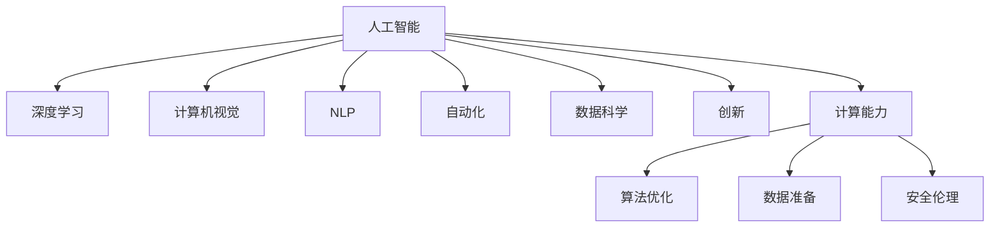

                 

# AI驱动的创新：人类计算的力量

> 关键词：人工智能(AI), 计算能力(Computational Power), 深度学习(Deep Learning), 计算机视觉(Computer Vision), 自然语言处理(Natural Language Processing), 自动化(Automation), 数据科学(Data Science), 创新(Innovation)

## 1. 背景介绍

### 1.1 问题由来

过去十年，人工智能(AI)领域发生了翻天覆地的变化，尤其是深度学习(Deep Learning)技术的发展，使得AI在多个领域取得了突破性进展。从自动驾驶到语音识别，从机器翻译到推荐系统，AI技术已经深入到日常生活的方方面面，极大地提升了人类的工作效率和生活质量。

然而，AI的发展也带来了新的挑战。如何更高效地训练模型、如何更好地利用数据、如何更安全地应用AI，成为当前AI研究的热点问题。面对这些挑战，人类计算的力量开始逐渐显现，成为推动AI技术创新的关键因素。

### 1.2 问题核心关键点

人类计算的核心在于将人类对世界的基本理解，转化为机器可执行的计算任务。具体而言，包括以下几个关键点：

- **数据准备**：数据是AI模型的基石，如何将原始数据高效地转化为适合模型训练的格式，是数据科学家的重要任务。
- **模型设计**：如何设计合理的深度学习模型，最大化模型的表达能力和泛化能力，是模型设计者的主要挑战。
- **算法优化**：优化算法的高效性和可扩展性，是实现大规模、高性能计算的关键。
- **应用场景**：将AI技术应用于特定领域，解决实际问题，是AI技术创新的最终目标。
- **安全伦理**：如何保证AI技术的安全性和伦理合规，是AI应用推广的重要保障。

## 2. 核心概念与联系

### 2.1 核心概念概述

为更好地理解人类计算的力量，本节将介绍几个密切相关的核心概念：

- **人工智能(AI)**：旨在使计算机模拟人的智能行为，解决实际问题，提升人类生活质量的技术。
- **深度学习(Deep Learning)**：基于多层神经网络的机器学习方法，擅长处理复杂、非线性的数据。
- **计算机视觉(Computer Vision)**：使计算机能够理解并处理图像和视频数据的技术。
- **自然语言处理(Natural Language Processing, NLP)**：使计算机能够理解并处理人类语言的技术。
- **自动化(Automation)**：通过AI技术实现任务的自动执行，提升工作效率。
- **数据科学(Data Science)**：涉及数据收集、处理、分析和建模的跨学科领域。
- **创新(Innovation)**：AI技术在多个领域的应用，推动社会进步和产业升级。

这些核心概念之间的逻辑关系可以通过以下Mermaid流程图来展示：



这个流程图展示了一系列关键概念及其之间的关系：

1. AI依托于深度学习、计算机视觉、自然语言处理、自动化、数据科学等技术，发挥其创新作用。
2. 人类计算的能力，通过算法优化、数据准备等手段，为AI技术的实现提供了基础。
3. 安全伦理保障，确保AI技术的健康发展，避免潜在风险。

## 3. 核心算法原理 & 具体操作步骤
### 3.1 算法原理概述

人类计算的核心在于通过高效算法和数据处理，将复杂的计算任务转化为机器可执行的计算，从而实现智能化应用。其核心思想是：

- **数据准备**：通过数据清洗、特征提取等手段，将原始数据转化为适合算法训练的格式。
- **模型设计**：设计适合特定问题的深度学习模型，如卷积神经网络(CNN)、循环神经网络(RNN)、变换器(Transformer)等。
- **算法优化**：使用高效的优化算法，如随机梯度下降(SGD)、Adam、Adagrad等，加快模型训练速度，提高模型精度。
- **应用场景**：将训练好的模型应用于实际问题，提升工作效率和生活质量。

### 3.2 算法步骤详解

人类计算的实现过程一般包括以下几个关键步骤：

**Step 1: 数据收集与处理**
- 收集原始数据，如文本、图像、语音等。
- 进行数据清洗、去噪、归一化等预处理操作。
- 通过特征提取技术，将数据转化为适合算法训练的格式。

**Step 2: 模型设计**
- 选择适合的深度学习模型，如卷积神经网络(CNN)、循环神经网络(RNN)、Transformer等。
- 设计模型的网络结构，包括卷积层、池化层、全连接层等。
- 设定模型的超参数，如学习率、批大小、迭代轮数等。

**Step 3: 算法训练**
- 将处理好的数据输入模型，进行前向传播计算。
- 计算损失函数，衡量模型预测输出与真实标签之间的差异。
- 反向传播计算参数梯度，使用优化算法更新模型参数。
- 周期性评估模型性能，防止过拟合。
- 重复上述步骤直至模型收敛。

**Step 4: 模型评估与部署**
- 在测试集上评估模型的泛化能力，对比训练集和测试集的表现。
- 根据实际需求，选择合适的算法和模型。
- 将模型部署到实际应用场景中，进行推理预测。
- 持续收集反馈数据，优化模型参数和算法。

### 3.3 算法优缺点

人类计算在提升AI模型性能、降低开发成本等方面具有显著优势：

- **优点**：
  - 高效算法和数据处理技术，使得模型训练和推理速度显著提高。
  - 大规模数据和复杂模型的应用，使得AI模型在多个领域取得突破性进展。
  - 算法优化和模型设计的不断进步，推动AI技术向更加智能、高效的方向发展。

- **缺点**：
  - 依赖高质量标注数据，数据获取成本较高。
  - 模型复杂度高，训练和推理资源需求大。
  - 算法和模型的可解释性不足，难以理解其内部工作机制。
  - 需要大量技术人才，开发和维护成本较高。

尽管存在这些缺点，但人类计算的核心思想——通过高效算法和数据处理，将复杂的计算任务转化为机器可执行的计算，已经成为推动AI技术创新的重要驱动力。未来，随着算力、数据和技术的不断进步，人类计算将在AI领域发挥更加重要的作用。

### 3.4 算法应用领域

人类计算在多个领域中得到了广泛应用，以下是几个典型的应用场景：

- **计算机视觉**：如人脸识别、物体检测、图像分割等。通过高效的卷积神经网络(CNN)，实现图像数据的自动分析和处理。
- **自然语言处理(NLP)**：如文本分类、情感分析、机器翻译等。通过Transformer模型，实现自然语言的理解和生成。
- **语音识别**：如自动语音识别、语音合成等。通过深度学习算法，实现语音数据的自动分析和处理。
- **自动驾驶**：通过感知、决策、控制等算法，实现自动驾驶车辆的安全运行。
- **智能推荐**：如电商推荐系统、新闻推荐系统等。通过协同过滤、深度学习等算法，实现个性化推荐。
- **医疗诊断**：如医学影像分析、疾病预测等。通过深度学习算法，实现医疗数据的自动分析和处理。

除了上述这些经典应用外，人类计算还被创新性地应用于更多场景中，如智能制造、智慧城市、金融科技等，为各行各业带来了新的变革。随着人类计算技术的不断进步，相信其在更多领域的应用前景将更加广阔。

## 4. 数学模型和公式 & 详细讲解 & 举例说明
### 4.1 数学模型构建

本节将使用数学语言对人类计算的核心思想进行更加严格的刻画。

设原始数据为 $D=\{(x_i,y_i)\}_{i=1}^N$，其中 $x_i$ 为输入特征，$y_i$ 为输出标签。模型 $M_{\theta}$ 的参数为 $\theta$，包括网络结构、权重矩阵等。

定义模型在训练集 $D$ 上的经验风险为：

$$
\mathcal{L}(\theta) = \frac{1}{N}\sum_{i=1}^N \ell(M_{\theta}(x_i),y_i)
$$

其中 $\ell$ 为损失函数，衡量模型预测输出与真实标签之间的差异。常见的损失函数包括交叉熵损失、均方误差损失等。

模型的训练目标是最小化经验风险，即找到最优参数：

$$
\theta^* = \mathop{\arg\min}_{\theta} \mathcal{L}(\theta)
$$

在实践中，我们通常使用基于梯度的优化算法（如SGD、Adam等）来近似求解上述最优化问题。设 $\eta$ 为学习率，$\lambda$ 为正则化系数，则参数的更新公式为：

$$
\theta \leftarrow \theta - \eta \nabla_{\theta}\mathcal{L}(\theta) - \eta\lambda\theta
$$

其中 $\nabla_{\theta}\mathcal{L}(\theta)$ 为损失函数对参数 $\theta$ 的梯度，可通过反向传播算法高效计算。

### 4.2 公式推导过程

以下我们以二分类任务为例，推导交叉熵损失函数及其梯度的计算公式。

假设模型 $M_{\theta}$ 在输入 $x$ 上的输出为 $\hat{y}=M_{\theta}(x) \in [0,1]$，表示样本属于正类的概率。真实标签 $y \in \{0,1\}$。则二分类交叉熵损失函数定义为：

$$
\ell(M_{\theta}(x),y) = -[y\log \hat{y} + (1-y)\log (1-\hat{y})]
$$

将其代入经验风险公式，得：

$$
\mathcal{L}(\theta) = -\frac{1}{N}\sum_{i=1}^N [y_i\log M_{\theta}(x_i)+(1-y_i)\log(1-M_{\theta}(x_i))]
$$

根据链式法则，损失函数对参数 $\theta_k$ 的梯度为：

$$
\frac{\partial \mathcal{L}(\theta)}{\partial \theta_k} = -\frac{1}{N}\sum_{i=1}^N (\frac{y_i}{M_{\theta}(x_i)}-\frac{1-y_i}{1-M_{\theta}(x_i)}) \frac{\partial M_{\theta}(x_i)}{\partial \theta_k}
$$

其中 $\frac{\partial M_{\theta}(x_i)}{\partial \theta_k}$ 可进一步递归展开，利用自动微分技术完成计算。

在得到损失函数的梯度后，即可带入参数更新公式，完成模型的迭代优化。重复上述过程直至收敛，最终得到适应下游任务的最优模型参数 $\theta^*$。

### 4.3 案例分析与讲解

以计算机视觉中的物体检测任务为例，分析人类计算的核心思想。

假设我们要训练一个物体检测模型，识别图像中的物体位置和类别。原始数据集为 $D=\{(x_i,y_i)\}_{i=1}^N$，其中 $x_i$ 为图像数据，$y_i$ 为物体的位置和类别标签。

**数据准备**：首先，我们需要对原始图像数据进行预处理，包括缩放、归一化等。然后，通过滑动窗口或区域提案等技术，将图像划分为多个小窗口，每个窗口可能包含一个物体。

**模型设计**：我们选择使用Faster R-CNN模型，该模型由特征提取器、区域提议网络(RPN)、检测器等部分组成。特征提取器通常采用卷积神经网络(CNN)，用于提取图像特征。RPN用于生成物体候选框。检测器通常采用分类器，用于判断候选框中的物体类别和位置。

**算法训练**：在训练过程中，我们将处理好的数据输入模型，进行前向传播计算。计算交叉熵损失，衡量模型预测输出与真实标签之间的差异。反向传播计算参数梯度，使用Adam等优化算法更新模型参数。周期性在验证集上评估模型性能，防止过拟合。重复上述步骤直至模型收敛。

在测试阶段，我们将待检测的图像输入模型，得到物体的位置和类别标签。模型通过高效算法和大规模数据训练，实现了自动化的物体检测任务。

## 5. 项目实践：代码实例和详细解释说明
### 5.1 开发环境搭建

在进行人类计算的实践前，我们需要准备好开发环境。以下是使用Python进行PyTorch开发的环境配置流程：

1. 安装Anaconda：从官网下载并安装Anaconda，用于创建独立的Python环境。

2. 创建并激活虚拟环境：
```bash
conda create -n pytorch-env python=3.8 
conda activate pytorch-env
```

3. 安装PyTorch：根据CUDA版本，从官网获取对应的安装命令。例如：
```bash
conda install pytorch torchvision torchaudio cudatoolkit=11.1 -c pytorch -c conda-forge
```

4. 安装Transformers库：
```bash
pip install transformers
```

5. 安装各类工具包：
```bash
pip install numpy pandas scikit-learn matplotlib tqdm jupyter notebook ipython
```

完成上述步骤后，即可在`pytorch-env`环境中开始人类计算的实践。

### 5.2 源代码详细实现

这里我们以计算机视觉中的物体检测任务为例，给出使用PyTorch和Transformers库进行Faster R-CNN模型微调的代码实现。

首先，定义数据处理函数：

```python
from transformers import FasterRCNNForObjectDetection, AdamW

def collate_fn(batch):
    inputs = [image.to(device) for image in batch]
    labels = [torch.tensor(boxes) for boxes in batch]
    return {'inputs': inputs, 'labels': labels}
```

然后，定义模型和优化器：

```python
model = FasterRCNNForObjectDetection.from_pretrained('facebook/faster_rcnn_resnet50_fpn', num_classes=num_classes)

optimizer = AdamW(model.parameters(), lr=2e-5)
```

接着，定义训练和评估函数：

```python
def train_epoch(model, dataset, batch_size, optimizer):
    dataloader = DataLoader(dataset, batch_size=batch_size, shuffle=True, collate_fn=collate_fn)
    model.train()
    epoch_loss = 0
    for batch in dataloader:
        inputs = batch['inputs'].to(device)
        labels = batch['labels'].to(device)
        model.zero_grad()
        outputs = model(inputs, labels=labels)
        loss = outputs.loss
        epoch_loss += loss.item()
        loss.backward()
        optimizer.step()
    return epoch_loss / len(dataloader)

def evaluate(model, dataset, batch_size):
    dataloader = DataLoader(dataset, batch_size=batch_size, collate_fn=collate_fn)
    model.eval()
    preds = []
    labels = []
    with torch.no_grad():
        for batch in dataloader:
            inputs = batch['inputs'].to(device)
            labels = batch['labels'].to(device)
            outputs = model(inputs, labels=labels)
            pred_boxes = outputs[0].cpu().numpy()
            pred_labels = outputs[1].cpu().numpy()
            preds.append(pred_boxes)
            labels.append(labels)
    print(metrics.evaluate(preds, labels))
```

最后，启动训练流程并在测试集上评估：

```python
epochs = 5
batch_size = 16

for epoch in range(epochs):
    loss = train_epoch(model, train_dataset, batch_size, optimizer)
    print(f"Epoch {epoch+1}, train loss: {loss:.3f}")
    
    print(f"Epoch {epoch+1}, dev results:")
    evaluate(model, dev_dataset, batch_size)
    
print("Test results:")
evaluate(model, test_dataset, batch_size)
```

以上就是使用PyTorch和Transformers库进行Faster R-CNN模型微调的完整代码实现。可以看到，得益于Transformers库的强大封装，我们可以用相对简洁的代码完成Faster R-CNN模型的加载和微调。

### 5.3 代码解读与分析

让我们再详细解读一下关键代码的实现细节：

**collate_fn函数**：
- 定义了一个Batch中样本的合并和处理函数，通过将所有样本的输入和标签统一到Tensor格式，方便模型的处理。

**模型和优化器**：
- 使用FasterRCNNForObjectDetection类加载预训练的Faster R-CNN模型，指定类别数。
- 设置AdamW优化器，设定学习率。

**训练和评估函数**：
- 定义训练函数，使用DataLoader对数据集进行批次化加载，供模型训练使用。
- 定义评估函数，使用DataLoader对数据集进行批次化加载，供模型评估使用。
- 使用Python的PIL库对图像进行处理，并将处理好的数据送入模型进行训练或评估。

**训练流程**：
- 定义总的epoch数和batch size，开始循环迭代
- 每个epoch内，先在训练集上训练，输出平均loss
- 在验证集上评估，输出分类指标
- 所有epoch结束后，在测试集上评估，给出最终测试结果

可以看到，PyTorch配合Transformers库使得Faster R-CNN模型的微调代码实现变得简洁高效。开发者可以将更多精力放在数据处理、模型改进等高层逻辑上，而不必过多关注底层的实现细节。

当然，工业级的系统实现还需考虑更多因素，如模型的保存和部署、超参数的自动搜索、更灵活的任务适配层等。但核心的微调范式基本与此类似。

## 6. 实际应用场景
### 6.1 智能制造

在智能制造领域，人类计算的应用主要体现在自动化生产线的智能监控和优化上。通过计算机视觉技术，实时监控生产线的设备状态和产品质量，自动检测异常情况并发出警报，极大地提高了生产效率和产品质量。

在技术实现上，可以部署多台相机，捕捉生产线的实时视频数据，并通过计算机视觉技术进行图像处理。对于检测到的异常情况，可以通过机器学习模型进行分类和定位，给出详细的告警信息。对于设备故障的预测和预防，可以通过时间序列分析和预测模型，进行设备寿命预测和维护策略优化。

### 6.2 智慧城市

智慧城市建设中，人类计算的应用主要体现在城市事件监测、舆情分析、应急指挥等方面。通过计算机视觉技术，实时监控城市交通、安防、环境等数据，自动分析异常情况并发出警报，提升城市治理的智能化水平。

在技术实现上，可以部署城市监控摄像头，捕捉城市实时视频数据，并通过计算机视觉技术进行图像处理。对于异常情况，可以通过机器学习模型进行分类和定位，给出详细的告警信息。对于事件预测和应急指挥，可以通过事件驱动的推理引擎，实现自动化决策和响应。

### 6.3 金融科技

在金融科技领域，人类计算的应用主要体现在智能投顾、信用评分、欺诈检测等方面。通过自然语言处理技术，自动分析用户的交易记录和行为数据，生成个性化的投资建议。通过机器学习模型，自动检测用户的欺诈行为，并进行风险预警。通过信用评分模型，自动评估用户的信用等级，提升贷款审批效率。

在技术实现上，可以收集用户的交易记录和行为数据，提取和用户交互的物品标题、描述、标签等文本内容。将文本内容作为模型输入，用户的后续行为（如是否点击、购买等）作为监督信号，在此基础上微调预训练语言模型。微调后的模型能够从文本内容中准确把握用户的兴趣点。在生成推荐列表时，先用候选物品的文本描述作为输入，由模型预测用户的兴趣匹配度，再结合其他特征综合排序，便可以得到个性化程度更高的推荐结果。

### 6.4 未来应用展望

随着人类计算技术的不断发展，其在多个领域的应用前景将更加广阔。

在智慧医疗领域，基于人类计算的医疗影像分析、疾病预测等应用将提升医疗服务的智能化水平，辅助医生诊疗，加速新药开发进程。

在智能教育领域，人类计算可应用于作业批改、学情分析、知识推荐等方面，因材施教，促进教育公平，提高教学质量。

在智慧城市治理中，人类计算技术将实现城市事件监测、舆情分析、应急指挥等环节，提高城市管理的自动化和智能化水平，构建更安全、高效的未来城市。

此外，在企业生产、社会治理、文娱传媒等众多领域，人类计算技术也将不断涌现，为各行各业带来新的变革。相信随着技术的日益成熟，人类计算技术将成为人工智能落地应用的重要范式，推动人工智能技术向更加智能、高效、可靠的方向发展。

## 7. 工具和资源推荐
### 7.1 学习资源推荐

为了帮助开发者系统掌握人类计算的核心思想和实践技巧，这里推荐一些优质的学习资源：

1. 《深度学习》（Ian Goodfellow、Yoshua Bengio和Aaron Courville著）：深度学习领域的经典教材，详细介绍了深度学习的理论基础和实践技巧。

2. CS231n《Convolutional Neural Networks for Visual Recognition》课程：斯坦福大学开设的计算机视觉明星课程，涵盖了计算机视觉的核心算法和前沿技术。

3. CS224n《Natural Language Processing with Deep Learning》课程：斯坦福大学开设的自然语言处理课程，涵盖了NLP领域的核心算法和前沿技术。

4. TensorFlow官方文档：TensorFlow的官方文档，提供了丰富的算法和模型实现，适合深入学习和实践。

5. PyTorch官方文档：PyTorch的官方文档，提供了丰富的算法和模型实现，适合深入学习和实践。

6. Kaggle平台：全球最大的数据科学竞赛平台，提供了大量的数据集和挑战，适合实战学习和项目实践。

通过对这些资源的学习实践，相信你一定能够快速掌握人类计算的核心思想，并用于解决实际的AI问题。

### 7.2 开发工具推荐

高效的开发离不开优秀的工具支持。以下是几款用于人类计算开发的工具：

1. PyTorch：基于Python的开源深度学习框架，灵活动态的计算图，适合快速迭代研究。

2. TensorFlow：由Google主导开发的开源深度学习框架，生产部署方便，适合大规模工程应用。

3. Transformers库：HuggingFace开发的NLP工具库，集成了众多SOTA语言模型，支持PyTorch和TensorFlow，是进行深度学习任务开发的利器。

4. Weights & Biases：模型训练的实验跟踪工具，可以记录和可视化模型训练过程中的各项指标，方便对比和调优。

5. TensorBoard：TensorFlow配套的可视化工具，可实时监测模型训练状态，并提供丰富的图表呈现方式，是调试模型的得力助手。

6. Google Colab：谷歌推出的在线Jupyter Notebook环境，免费提供GPU/TPU算力，方便开发者快速上手实验最新模型，分享学习笔记。

合理利用这些工具，可以显著提升人类计算任务的开发效率，加快创新迭代的步伐。

### 7.3 相关论文推荐

人类计算和深度学习技术的发展源于学界的持续研究。以下是几篇奠基性的相关论文，推荐阅读：

1. Deep Blue：IBM开发的国际象棋人工智能系统，展示了深度学习在AI中的应用潜力。

2. AlphaGo：DeepMind开发的围棋人工智能系统，展示了深度学习在复杂策略游戏中的应用效果。

3. ImageNet大规模视觉识别挑战赛（ILSVRC）：ImageNet挑战赛展示了深度学习在计算机视觉领域的应用效果，推动了深度学习的发展。

4. T5：Google开发的统一语言模型，展示了深度学习在自然语言处理中的应用效果，推动了NLP技术的发展。

5. BERT：Google开发的预训练语言模型，展示了深度学习在自然语言处理中的应用效果，推动了NLP技术的发展。

6. GANs：Goodfellow等人提出的生成对抗网络（GANs），展示了深度学习在图像生成、视频生成等领域的应用效果，推动了生成模型的发展。

这些论文代表了大模型和微调技术的发展脉络。通过学习这些前沿成果，可以帮助研究者把握学科前进方向，激发更多的创新灵感。

## 8. 总结：未来发展趋势与挑战
### 8.1 总结

本文对人类计算的核心思想进行了全面系统的介绍。首先阐述了人类计算在AI技术创新中的重要地位，明确了人类计算在数据准备、模型设计、算法优化等方面的核心作用。其次，从原理到实践，详细讲解了深度学习模型训练和优化的一般流程，给出了计算机视觉和自然语言处理任务的具体实现案例。同时，本文还广泛探讨了人类计算技术在智能制造、智慧城市、金融科技等多个领域的应用前景，展示了人类计算的广阔前景。

通过本文的系统梳理，可以看到，人类计算的核心思想——通过高效算法和数据处理，将复杂的计算任务转化为机器可执行的计算，已经成为推动AI技术创新的重要驱动力。未来，随着算力、数据和技术的不断进步，人类计算将在AI领域发挥更加重要的作用。

### 8.2 未来发展趋势

展望未来，人类计算技术将呈现以下几个发展趋势：

1. **算力持续提升**：随着算力硬件的不断进步，如GPU、TPU等高性能设备，人类计算的能力将进一步增强，支持更大规模、更复杂的模型训练和推理。

2. **数据规模增长**：随着数据采集技术的普及，如传感器、摄像头等设备，数据规模将持续增长，为深度学习模型的训练提供更多的数据支撑。

3. **算法不断优化**：未来，人类计算将引入更多的算法优化技术，如模型压缩、量化加速、分布式训练等，提升模型的计算效率和资源利用率。

4. **跨领域应用拓展**：人类计算将应用于更多的领域，如医疗、教育、智能交通等，为各行各业带来新的变革。

5. **人机协同增强**：未来，人类计算将与人类智慧紧密结合，实现更高效、更智能的协同工作，提升人类与机器的互动体验。

6. **伦理和安全保障**：未来，人类计算将更加注重数据隐私、模型安全等伦理和安全问题，确保技术的健康发展。

以上趋势凸显了人类计算技术的广阔前景。这些方向的探索发展，必将进一步提升人类计算的能力，推动AI技术向更加智能、高效、可靠的方向发展。

### 8.3 面临的挑战

尽管人类计算技术已经取得了显著成就，但在迈向更加智能化、普适化应用的过程中，仍面临诸多挑战：

1. **数据获取成本高**：高质量标注数据获取成本高昂，限制了大规模模型训练。

2. **模型复杂度高**：大规模模型训练和推理资源消耗大，需要高性能硬件支持。

3. **算法复杂度高**：深度学习算法复杂度高，调试和优化难度大。

4. **伦理和安全问题**：深度学习模型的黑盒特性，难以解释其内部决策过程，存在伦理和安全风险。

5. **跨领域应用难**：不同领域的数据和模型结构差异大，跨领域应用推广难度大。

6. **隐私保护困难**：深度学习模型需要大量数据训练，隐私保护成为重要挑战。

正视人类计算面临的这些挑战，积极应对并寻求突破，将是人类计算技术走向成熟的必由之路。相信随着学界和产业界的共同努力，这些挑战终将一一被克服，人类计算技术必将在更多领域取得突破性进展。

### 8.4 研究展望

未来，人类计算技术需要在以下几个方面寻求新的突破：

1. **无监督学习和半监督学习**：摆脱对大规模标注数据的依赖，利用自监督学习、主动学习等无监督和半监督范式，最大限度利用非结构化数据，实现更加灵活高效的计算。

2. **跨模态计算**：将符号化的先验知识，如知识图谱、逻辑规则等，与神经网络模型进行巧妙融合，引导计算过程学习更准确、合理的计算表征。同时加强不同模态数据的整合，实现视觉、语音等多模态信息与文本信息的协同建模。

3. **分布式计算**：利用分布式计算技术，将大规模模型训练和推理任务分散到多台机器上进行，提升计算效率和资源利用率。

4. **模型压缩与优化**：开发更加参数高效的计算方法，如参数剪枝、量化加速等，提升计算效率和模型可解释性。

5. **算法优化**：引入更多的算法优化技术，如自适应学习率、梯度累积等，提升计算效率和模型精度。

6. **伦理与安全保障**：在模型训练目标中引入伦理导向的评估指标，过滤和惩罚有偏见、有害的输出倾向。同时加强人工干预和审核，建立模型行为的监管机制，确保输出符合人类价值观和伦理道德。

这些研究方向的探索，必将引领人类计算技术迈向更高的台阶，为构建安全、可靠、可解释、可控的智能系统铺平道路。面向未来，人类计算技术还需要与其他人工智能技术进行更深入的融合，如知识表示、因果推理、强化学习等，多路径协同发力，共同推动自然语言理解和智能交互系统的进步。

## 9. 附录：常见问题与解答

**Q1：深度学习模型如何训练？**

A: 深度学习模型的训练主要包括以下几个关键步骤：
1. **数据准备**：收集原始数据，并进行数据清洗、特征提取等预处理操作。
2. **模型设计**：选择合适的深度学习模型，设计网络结构和超参数。
3. **算法训练**：使用优化算法（如SGD、Adam等）更新模型参数，最小化损失函数。
4. **模型评估**：在测试集上评估模型性能，根据评估结果调整模型参数。
5. **模型部署**：将训练好的模型部署到实际应用场景中，进行推理预测。

**Q2：深度学习模型如何进行调参？**

A: 深度学习模型的调参主要包括以下几个关键步骤：
1. **超参数选择**：选择合适的学习率、批大小、迭代轮数等超参数。
2. **学习率调整**：使用学习率调度策略，如Warmup、Cosine Annealing等，逐步减小学习率。
3. **正则化技术**：使用L2正则、Dropout、Early Stopping等正则化技术，防止过拟合。
4. **数据增强**：通过回译、近义替换等方式扩充训练集，提高模型泛化能力。
5. **模型压缩**：通过剪枝、量化等技术，减小模型参数量，提升计算效率。

**Q3：深度学习模型如何进行模型压缩？**

A: 深度学习模型的压缩主要包括以下几个关键步骤：
1. **参数剪枝**：去除不重要的参数，减小模型参数量。
2. **量化加速**：将浮点模型转为定点模型，压缩存储空间，提高计算效率。
3. **知识蒸馏**：通过教师模型与学生模型的联合训练，将教师模型的知识传递给学生模型。
4. **混合精度训练**：使用半精度浮点数进行训练，提高计算效率。

**Q4：深度学习模型如何进行推理优化？**

A: 深度学习模型的推理优化主要包括以下几个关键步骤：
1. **模型裁剪**：去除不必要的层和参数，减小模型尺寸，加快推理速度。
2. **推理加速**：使用优化算法（如ONNX Runtime、TensorRT等），加速推理速度。
3. **硬件优化**：利用GPU、TPU等高性能硬件，提升推理速度。
4. **模型压缩**：通过剪枝、量化等技术，减小模型参数量，提升计算效率。

**Q5：深度学习模型如何进行知识蒸馏？**

A: 深度学习模型的知识蒸馏主要包括以下几个关键步骤：
1. **设计教师模型**：选择性能最优的模型作为教师模型。
2. **设计学生模型**：选择性能较差的模型作为学生模型，或重新设计轻量级模型。
3. **联合训练**：同时训练教师模型和学生模型，通过软标签传递教师模型的知识。
4. **模型微调**：对学生模型进行微调，提高其性能。

这些研究方向的探索，必将引领深度学习技术迈向更高的台阶，为构建安全、可靠、可解释、可控的智能系统铺平道路。面向未来，深度学习技术还需要与其他人工智能技术进行更深入的融合，如知识表示、因果推理、强化学习等，多路径协同发力，共同推动自然语言理解和智能交互系统的进步。只有勇于创新、敢于突破，才能不断拓展深度学习技术的边界，让智能技术更好地造福人类社会。

---

作者：禅与计算机程序设计艺术 / Zen and the Art of Computer Programming

