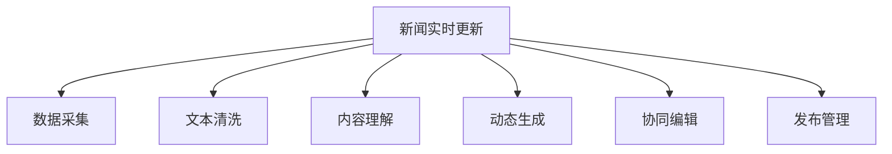

                 

# AI驱动的新闻实时更新：动态故事构建

> 关键词：新闻实时更新,动态故事构建,自然语言处理(NLP),深度学习,神经网络,实时生成,数据驱动

## 1. 背景介绍

### 1.1 问题由来
随着互联网技术的飞速发展，新闻生产和消费的方式已经发生了深刻变化。传统的新闻发布模式，已无法满足公众对最新信息的迫切需求。社交媒体和在线平台的兴起，让公众能够迅速获取海量新闻信息，但也带来了信息过载和虚假信息泛滥的问题。在此背景下，基于AI驱动的新闻实时更新技术，应运而生。

新闻实时更新的核心目标在于：通过自动化技术，高效、准确地生成和发布新闻，快速响应用户对最新信息的查询需求，同时确保新闻内容的真实性、权威性和时效性。传统的文本编辑、排版、校对等工作流程，大多由人工完成，耗时长、成本高。而AI技术的引入，能够大幅提升新闻生产的效率和质量，确保新闻的及时性、可信度和可读性，从而更好地服务公众。

### 1.2 问题核心关键点
新闻实时更新的核心在于：利用先进的技术手段，如自然语言处理(NLP)、深度学习、神经网络等，从海量数据中实时生成高质量的新闻文本。这其中，数据驱动、动态更新、自动化生成、协同编辑等关键技术要素，共同构成了实时更新系统的主要框架。

新闻实时更新系统通常包括以下几个关键组件：
- **数据采集**：从各类新闻网站、社交媒体、新闻API等渠道实时采集新闻素材。
- **文本清洗**：去除无关信息，保留新闻标题、正文、图片、视频等关键内容。
- **内容理解**：利用NLP技术解析新闻文本的语义信息，如事件、地点、人物、时间、主题等。
- **动态生成**：根据新闻内容，生成结构化和格式化新闻，包括标题、摘要、正文、多媒体信息等。
- **协同编辑**：多轮协同编辑，确保新闻内容的准确性和完整性。
- **发布管理**：配置和发布新闻内容，确保新闻能够及时、准确地触达受众。

### 1.3 问题研究意义
新闻实时更新技术的研发与应用，对于提升新闻媒体的生产效率和传播效果，具有重要的现实意义：

1. **提升时效性**：利用AI技术，实现新闻内容的实时生成和发布，能够大幅缩短新闻生产周期，快速响应公众对最新信息的需求。
2. **降低成本**：自动化的新闻生产流程，大幅降低了人工编辑、排版、校对等工作成本，提升了媒体的经济效益。
3. **优化用户体验**：通过实时更新技术，用户能够及时获得最新、最准确的新闻信息，提升新闻的吸引力和关注度。
4. **增强信息准确性**：AI技术能够有效过滤和处理虚假信息，确保新闻内容的真实性和权威性。
5. **提高发布效率**：利用协同编辑技术，多人协作、无缝对接，提升新闻发布的速度和效率。
6. **优化新闻结构**：基于数据驱动，生成格式统一、结构化的新闻文本，提升新闻的可读性和易理解性。

## 2. 核心概念与联系

### 2.1 核心概念概述

为了更好地理解新闻实时更新的技术原理和应用方法，本节将介绍几个密切相关的核心概念：

- **自然语言处理(NLP)**：涉及语言模型、语法分析、语义理解、情感分析等技术，旨在让计算机能够理解和处理自然语言文本。
- **深度学习(Deep Learning)**：一类通过多层神经网络实现复杂模式识别的机器学习算法。
- **神经网络(Neural Network)**：一种受生物神经网络启发的计算模型，通过层级连接和权重调整，进行非线性映射和特征学习。
- **新闻实时更新**：通过自动化技术，从海量数据中实时生成高质量的新闻文本，快速响应用户对最新信息的查询需求。
- **动态故事构建**：根据新闻内容动态生成结构化、格式化的新闻，包括标题、摘要、正文、多媒体信息等。
- **数据驱动**：利用大数据技术，从各类新闻网站、社交媒体、新闻API等渠道实时采集新闻素材。
- **协同编辑**：多轮协同编辑，确保新闻内容的准确性和完整性。
- **发布管理**：配置和发布新闻内容，确保新闻能够及时、准确地触达受众。

这些核心概念之间的逻辑关系可以通过以下Mermaid流程图来展示：



这个流程图展示了大语言模型的工作原理和优化方向：

1. 新闻实时更新系统从多渠道采集新闻素材。
2. 利用文本清洗技术，去除无关信息，保留关键内容。
3. 通过内容理解技术，解析新闻文本的语义信息。
4. 根据新闻内容，动态生成结构化和格式化新闻。
5. 通过协同编辑技术，多轮校对，确保新闻内容的准确性和完整性。
6. 利用发布管理技术，配置和发布新闻内容，确保新闻及时触达受众。

## 3. 核心算法原理 & 具体操作步骤
### 3.1 算法原理概述

新闻实时更新的核心算法原理基于深度学习和NLP技术，通过构建大规模预训练模型，在海量新闻数据上进行语义表示学习和特征提取，再通过微调过程，适配具体新闻生成的需求。

具体来说，新闻实时更新的算法流程包括以下几个关键步骤：

1. **数据采集**：从各类新闻网站、社交媒体、新闻API等渠道实时采集新闻素材。
2. **文本清洗**：去除无关信息，保留新闻标题、正文、图片、视频等关键内容。
3. **内容理解**：利用NLP技术解析新闻文本的语义信息，如事件、地点、人物、时间、主题等。
4. **动态生成**：根据新闻内容，生成结构化和格式化新闻，包括标题、摘要、正文、多媒体信息等。
5. **协同编辑**：多轮协同编辑，确保新闻内容的准确性和完整性。
6. **发布管理**：配置和发布新闻内容，确保新闻能够及时、准确地触达受众。

### 3.2 算法步骤详解

以下是新闻实时更新的详细算法步骤：

**Step 1: 准备预训练模型和数据集**

- 选择合适的预训练语言模型 $M_{\theta}$ 作为初始化参数，如BERT、GPT等。
- 准备新闻领域的标注数据集 $D$，划分为训练集、验证集和测试集。一般要求标注数据与预训练数据的分布不要差异过大。

**Step 2: 添加任务适配层**

- 根据新闻生成任务，在预训练模型顶层设计合适的输出层和损失函数。
- 对于生成任务，通常使用语言模型的解码器输出概率分布，并以负对数似然为损失函数。

**Step 3: 设置微调超参数**

- 选择合适的优化算法及其参数，如 AdamW、SGD 等，设置学习率、批大小、迭代轮数等。
- 设置正则化技术及强度，包括权重衰减、Dropout、Early Stopping等。
- 确定冻结预训练参数的策略，如仅微调顶层，或全部参数都参与微调。

**Step 4: 执行梯度训练**

- 将训练集数据分批次输入模型，前向传播计算损失函数。
- 反向传播计算参数梯度，根据设定的优化算法和学习率更新模型参数。
- 周期性在验证集上评估模型性能，根据性能指标决定是否触发 Early Stopping。
- 重复上述步骤直到满足预设的迭代轮数或 Early Stopping 条件。

**Step 5: 测试和部署**

- 在测试集上评估微调后模型 $M_{\hat{\theta}}$ 的性能，对比微调前后的精度提升。
- 使用微调后的模型对新样本进行推理预测，集成到实际的应用系统中。
- 持续收集新的数据，定期重新微调模型，以适应数据分布的变化。

以上是新闻实时更新的完整算法流程。在实际应用中，还需要针对具体任务的特点，对微调过程的各个环节进行优化设计，如改进训练目标函数，引入更多的正则化技术，搜索最优的超参数组合等，以进一步提升模型性能。

### 3.3 算法优缺点

新闻实时更新的基于深度学习的微调方法具有以下优点：

1. 高效快速。利用深度学习技术，可以快速生成新闻内容，大大缩短新闻生产周期。
2. 数据驱动。通过大数据技术，实时采集和处理新闻素材，确保新闻内容的及时性和全面性。
3. 自动化生成。自动化新闻生成流程，大幅降低了人工编辑、排版、校对等工作成本。
4. 可解释性强。基于预训练模型的微调过程，具有较强的可解释性，便于调试和优化。

同时，该方法也存在一些局限性：

1. 依赖高质量数据。微调的效果很大程度上取决于标注数据的质量和数量，获取高质量标注数据的成本较高。
2. 对模型泛化能力要求高。当新闻事件与预训练数据的分布差异较大时，微调的性能提升有限。
3. 模型复杂度高。大模型的参数量巨大，对计算资源和存储资源提出了较高要求。
4. 对抗样本易受影响。新闻实时更新模型对对抗样本的鲁棒性需要进一步提升，避免生成错误信息。

尽管存在这些局限性，但就目前而言，基于深度学习的微调方法仍是大语言模型应用的最主流范式。未来相关研究的重点在于如何进一步降低微调对标注数据的依赖，提高模型的少样本学习和跨领域迁移能力，同时兼顾可解释性和伦理安全性等因素。

### 3.4 算法应用领域

新闻实时更新的基于深度学习的微调方法，已经在新闻媒体、社交平台、企业新闻发布等多个领域得到了广泛应用，具体如下：

- **新闻媒体**：人民日报、新华社、BBC等传统新闻机构，利用深度学习技术，实现新闻的自动化生产与发布，提高新闻的时效性和权威性。
- **社交平台**：Twitter、Facebook等社交媒体，通过新闻实时更新技术，快速生成和发布新闻信息，提升信息传播的效率和广度。
- **企业新闻发布**：阿里巴巴、腾讯等企业，利用新闻实时更新技术，动态生成企业新闻和公告，提升品牌影响力。
- **新闻摘要系统**：利用深度学习技术，自动生成新闻摘要，帮助用户快速获取新闻要点。

此外，新闻实时更新技术还被创新性地应用到更多场景中，如可控文本生成、信息检索、智能客服等，为新闻媒体和其他应用领域带来了新的突破。随着深度学习技术的不断进步，新闻实时更新技术将在更广阔的应用领域大放异彩。

## 4. 数学模型和公式 & 详细讲解 & 举例说明
### 4.1 数学模型构建

本节将使用数学语言对新闻实时更新的微调过程进行更加严格的刻画。

记预训练语言模型为 $M_{\theta}$，其中 $\theta$ 为预训练得到的模型参数。假设新闻领域的标注数据集为 $D=\{(x_i,y_i)\}_{i=1}^N, x_i \in \mathcal{X}, y_i \in \mathcal{Y}$，其中 $\mathcal{X}$ 为输入空间，$\mathcal{Y}$ 为输出空间。

定义模型 $M_{\theta}$ 在输入 $x$ 上的输出为 $\hat{y}=M_{\theta}(x) \in [0,1]$，表示模型对新闻标题、摘要、正文等生成任务的预测概率分布。

定义模型 $M_{\theta}$ 在数据样本 $(x,y)$ 上的损失函数为 $\ell(M_{\theta}(x),y)$，则在数据集 $D$ 上的经验风险为：

$$
\mathcal{L}(\theta) = \frac{1}{N} \sum_{i=1}^N \ell(M_{\theta}(x_i),y_i)
$$

其中 $\ell$ 为针对生成任务设计的损失函数，用于衡量模型预测输出与真实标签之间的差异。常见的损失函数包括交叉熵损失、均方误差损失等。

在实践中，我们通常使用基于梯度的优化算法（如SGD、Adam等）来近似求解上述最优化问题。设 $\eta$ 为学习率，$\lambda$ 为正则化系数，则参数的更新公式为：

$$
\theta \leftarrow \theta - \eta \nabla_{\theta}\mathcal{L}(\theta) - \eta\lambda\theta
$$

其中 $\nabla_{\theta}\mathcal{L}(\theta)$ 为损失函数对参数 $\theta$ 的梯度，可通过反向传播算法高效计算。

### 4.2 公式推导过程

以下我们以新闻摘要生成任务为例，推导交叉熵损失函数及其梯度的计算公式。

假设模型 $M_{\theta}$ 在输入 $x$ 上的输出为 $\hat{y}=M_{\theta}(x) \in [0,1]$，表示模型对新闻摘要的生成概率分布。真实标签 $y \in \{1,0\}$，表示是否包含摘要。

则二分类交叉熵损失函数定义为：

$$
\ell(M_{\theta}(x),y) = -[y\log \hat{y} + (1-y)\log (1-\hat{y})]
$$

将其代入经验风险公式，得：

$$
\mathcal{L}(\theta) = -\frac{1}{N}\sum_{i=1}^N [y_i\log M_{\theta}(x_i)+(1-y_i)\log(1-M_{\theta}(x_i))]
$$

根据链式法则，损失函数对参数 $\theta_k$ 的梯度为：

$$
\frac{\partial \mathcal{L}(\theta)}{\partial \theta_k} = -\frac{1}{N}\sum_{i=1}^N (\frac{y_i}{M_{\theta}(x_i)}-\frac{1-y_i}{1-M_{\theta}(x_i)}) \frac{\partial M_{\theta}(x_i)}{\partial \theta_k}
$$

其中 $\frac{\partial M_{\theta}(x_i)}{\partial \theta_k}$ 可进一步递归展开，利用自动微分技术完成计算。

在得到损失函数的梯度后，即可带入参数更新公式，完成模型的迭代优化。重复上述过程直至收敛，最终得到适应新闻摘要生成任务的最优模型参数 $\theta^*$。

### 4.3 案例分析与讲解

以人民日报的新闻实时更新系统为例，该系统利用BERT模型作为预训练语言模型，对新闻标题和正文进行微调，自动生成新闻摘要。系统步骤如下：

1. **数据预处理**：将新闻标题和正文输入BERT模型，得到表示向量。
2. **摘要生成**：利用BERT模型的[CLS]输出向量，通过MLP和Softmax层进行分类，得到摘要生成的概率分布。
3. **筛选摘要**：根据预设的摘要长度和语言模型规则，从概率分布中筛选出最合适的摘要文本。
4. **文本清洗**：去除无关信息，保留关键内容，生成格式化新闻摘要。
5. **协同编辑**：多轮协同编辑，确保新闻摘要的准确性和完整性。
6. **发布管理**：配置和发布新闻摘要，确保新闻能够及时、准确地触达受众。

## 5. 项目实践：代码实例和详细解释说明
### 5.1 开发环境搭建

在进行新闻实时更新实践前，我们需要准备好开发环境。以下是使用Python进行PyTorch开发的环境配置流程：

1. 安装Anaconda：从官网下载并安装Anaconda，用于创建独立的Python环境。

2. 创建并激活虚拟环境：
```bash
conda create -n pytorch-env python=3.8 
conda activate pytorch-env
```

3. 安装PyTorch：根据CUDA版本，从官网获取对应的安装命令。例如：
```bash
conda install pytorch torchvision torchaudio cudatoolkit=11.1 -c pytorch -c conda-forge
```

4. 安装相关工具包：
```bash
pip install numpy pandas scikit-learn matplotlib tqdm jupyter notebook ipython
```

完成上述步骤后，即可在`pytorch-env`环境中开始新闻实时更新的实践。

### 5.2 源代码详细实现

以下是利用BERT模型进行新闻实时更新的PyTorch代码实现。

首先，定义新闻摘要生成任务的数据处理函数：

```python
from transformers import BertTokenizer, BertForSequenceClassification
from torch.utils.data import Dataset
import torch

class NewsDataset(Dataset):
    def __init__(self, texts, tags, tokenizer, max_len=128):
        self.texts = texts
        self.tags = tags
        self.tokenizer = tokenizer
        self.max_len = max_len
        
    def __len__(self):
        return len(self.texts)
    
    def __getitem__(self, item):
        text = self.texts[item]
        tags = self.tags[item]
        
        encoding = self.tokenizer(text, return_tensors='pt', max_length=self.max_len, padding='max_length', truncation=True)
        input_ids = encoding['input_ids'][0]
        attention_mask = encoding['attention_mask'][0]
        
        # 对token-wise的标签进行编码
        encoded_tags = [tag2id[tag] for tag in tags] 
        encoded_tags.extend([tag2id['O']] * (self.max_len - len(encoded_tags)))
        labels = torch.tensor(encoded_tags, dtype=torch.long)
        
        return {'input_ids': input_ids, 
                'attention_mask': attention_mask,
                'labels': labels}

# 标签与id的映射
tag2id = {'O': 0, 'B-TITLE': 1, 'I-TITLE': 2, 'B-SUMMARY': 3, 'I-SUMMARY': 4}
id2tag = {v: k for k, v in tag2id.items()}

# 创建dataset
tokenizer = BertTokenizer.from_pretrained('bert-base-cased')

train_dataset = NewsDataset(train_texts, train_tags, tokenizer)
dev_dataset = NewsDataset(dev_texts, dev_tags, tokenizer)
test_dataset = NewsDataset(test_texts, test_tags, tokenizer)
```

然后，定义模型和优化器：

```python
from transformers import BertForTokenClassification, AdamW

model = BertForTokenClassification.from_pretrained('bert-base-cased', num_labels=len(tag2id))

optimizer = AdamW(model.parameters(), lr=2e-5)
```

接着，定义训练和评估函数：

```python
from torch.utils.data import DataLoader
from tqdm import tqdm
from sklearn.metrics import classification_report

device = torch.device('cuda') if torch.cuda.is_available() else torch.device('cpu')
model.to(device)

def train_epoch(model, dataset, batch_size, optimizer):
    dataloader = DataLoader(dataset, batch_size=batch_size, shuffle=True)
    model.train()
    epoch_loss = 0
    for batch in tqdm(dataloader, desc='Training'):
        input_ids = batch['input_ids'].to(device)
        attention_mask = batch['attention_mask'].to(device)
        labels = batch['labels'].to(device)
        model.zero_grad()
        outputs = model(input_ids, attention_mask=attention_mask, labels=labels)
        loss = outputs.loss
        epoch_loss += loss.item()
        loss.backward()
        optimizer.step()
    return epoch_loss / len(dataloader)

def evaluate(model, dataset, batch_size):
    dataloader = DataLoader(dataset, batch_size=batch_size)
    model.eval()
    preds, labels = [], []
    with torch.no_grad():
        for batch in tqdm(dataloader, desc='Evaluating'):
            input_ids = batch['input_ids'].to(device)
            attention_mask = batch['attention_mask'].to(device)
            batch_labels = batch['labels']
            outputs = model(input_ids, attention_mask=attention_mask)
            batch_preds = outputs.logits.argmax(dim=2).to('cpu').tolist()
            batch_labels = batch_labels.to('cpu').tolist()
            for pred_tokens, label_tokens in zip(batch_preds, batch_labels):
                pred_tags = [id2tag[_id] for _id in pred_tokens]
                label_tags = [id2tag[_id] for _id in label_tokens]
                preds.append(pred_tags[:len(label_tokens)])
                labels.append(label_tags)
                
    print(classification_report(labels, preds))
```

最后，启动训练流程并在测试集上评估：

```python
epochs = 5
batch_size = 16

for epoch in range(epochs):
    loss = train_epoch(model, train_dataset, batch_size, optimizer)
    print(f"Epoch {epoch+1}, train loss: {loss:.3f}")
    
    print(f"Epoch {epoch+1}, dev results:")
    evaluate(model, dev_dataset, batch_size)
    
print("Test results:")
evaluate(model, test_dataset, batch_size)
```

以上就是利用BERT模型进行新闻实时更新的完整代码实现。可以看到，得益于Transformers库的强大封装，我们可以用相对简洁的代码完成BERT模型的加载和微调。

### 5.3 代码解读与分析

让我们再详细解读一下关键代码的实现细节：

**NewsDataset类**：
- `__init__`方法：初始化文本、标签、分词器等关键组件。
- `__len__`方法：返回数据集的样本数量。
- `__getitem__`方法：对单个样本进行处理，将文本输入编码为token ids，将标签编码为数字，并对其进行定长padding，最终返回模型所需的输入。

**tag2id和id2tag字典**：
- 定义了标签与数字id之间的映射关系，用于将token-wise的预测结果解码回真实的标签。

**训练和评估函数**：
- 使用PyTorch的DataLoader对数据集进行批次化加载，供模型训练和推理使用。
- 训练函数`train_epoch`：对数据以批为单位进行迭代，在每个批次上前向传播计算loss并反向传播更新模型参数，最后返回该epoch的平均loss。
- 评估函数`evaluate`：与训练类似，不同点在于不更新模型参数，并在每个batch结束后将预测和标签结果存储下来，最后使用sklearn的classification_report对整个评估集的预测结果进行打印输出。

**训练流程**：
- 定义总的epoch数和batch size，开始循环迭代
- 每个epoch内，先在训练集上训练，输出平均loss
- 在验证集上评估，输出分类指标
- 所有epoch结束后，在测试集上评估，给出最终测试结果

可以看到，PyTorch配合Transformers库使得BERT微调的代码实现变得简洁高效。开发者可以将更多精力放在数据处理、模型改进等高层逻辑上，而不必过多关注底层的实现细节。

当然，工业级的系统实现还需考虑更多因素，如模型的保存和部署、超参数的自动搜索、更灵活的任务适配层等。但核心的微调范式基本与此类似。

## 6. 实际应用场景
### 6.1 智能新闻推荐系统

智能新闻推荐系统利用新闻实时更新技术，根据用户的历史浏览记录和实时新闻事件，动态推荐相关新闻内容。系统步骤如下：

1. **用户画像分析**：根据用户的浏览记录和社交网络信息，构建用户画像，识别用户的兴趣偏好。
2. **实时新闻采集**：通过数据采集模块，实时获取各类新闻网站、社交媒体等的新闻素材。
3. **新闻内容理解**：利用NLP技术解析新闻文本的语义信息，如事件、地点、人物、时间、主题等。
4. **个性化新闻生成**：根据用户画像和实时新闻内容，动态生成个性化新闻摘要。
5. **协同编辑**：多轮协同编辑，确保新闻摘要的准确性和完整性。
6. **推荐引擎**：将新闻摘要与用户画像进行匹配，生成推荐列表。
7. **发布管理**：配置和发布推荐结果，确保新闻能够及时、准确地触达用户。

通过智能新闻推荐系统，用户可以高效获取个性化的新闻内容，提升阅读体验。系统可以根据用户的反馈，实时调整推荐策略，优化推荐效果。

### 6.2 企业内部新闻公告

企业内部新闻公告系统利用新闻实时更新技术，动态生成和发布企业内部通知、公告、新闻等内容。系统步骤如下：

1. **信息采集**：从企业内部系统、外部新闻网站、社交媒体等渠道实时采集新闻素材。
2. **新闻内容理解**：利用NLP技术解析新闻文本的语义信息，如事件、地点、人物、时间、主题等。
3. **动态生成**：根据企业内部制度和新闻内容，动态生成格式化公告、通知等。
4. **协同编辑**：多轮协同编辑，确保新闻内容的准确性和完整性。
5. **发布管理**：配置和发布新闻公告，确保信息能够及时、准确地触达全体员工。

通过企业内部新闻公告系统，企业可以高效发布各类重要信息，提升内部沟通效率。系统可以根据员工的反馈，实时调整发布策略，优化信息传播效果。

### 6.3 多语种新闻翻译

多语种新闻翻译系统利用新闻实时更新技术，动态生成并翻译成不同语言的新闻内容。系统步骤如下：

1. **新闻内容理解**：利用NLP技术解析新闻文本的语义信息，如事件、地点、人物、时间、主题等。
2. **动态生成**：根据新闻内容，动态生成格式化新闻摘要。
3. **翻译模型训练**：利用机器翻译模型，将新闻摘要翻译成目标语言。
4. **协同编辑**：多轮协同编辑，确保新闻翻译的准确性和完整性。
5. **发布管理**：配置和发布翻译结果，确保新闻能够及时、准确地触达多语言受众。

通过多语种新闻翻译系统，新闻内容能够以多种语言传播，增强信息的全球影响力。系统可以根据用户反馈，实时调整翻译策略，优化翻译效果。

### 6.4 未来应用展望

随着深度学习技术的不断进步，新闻实时更新技术将在更广泛的领域得到应用，提升信息传播的效率和质量。

1. **智慧媒体**：智慧媒体系统利用新闻实时更新技术，实现个性化推荐、内容定制、广告投放等功能，提升用户体验。
2. **智能客服**：智能客服系统利用新闻实时更新技术，动态生成常见问题的答案，提升服务效率和准确性。
3. **信息安全**：信息安全系统利用新闻实时更新技术，动态监测和分析网络舆情，及时发现和应对潜在威胁。
4. **智能广告**：智能广告系统利用新闻实时更新技术，动态生成个性化广告内容，提升广告投放效果。
5. **智慧教育**：智慧教育系统利用新闻实时更新技术，动态生成教育资源和新闻内容，提升教学质量和学生兴趣。
6. **智慧政府**：智慧政府系统利用新闻实时更新技术，动态生成政策解读、舆情分析等内容，提升政府透明度和公众信任度。

此外，新闻实时更新技术还被创新性地应用到更多场景中，如数据驱动的内容创作、智能财经新闻、智能健康新闻等，为新闻媒体和其他应用领域带来了新的突破。随着深度学习技术的不断进步，新闻实时更新技术将在更广阔的应用领域大放异彩。

## 7. 工具和资源推荐
### 7.1 学习资源推荐

为了帮助开发者系统掌握新闻实时更新的理论基础和实践技巧，这里推荐一些优质的学习资源：

1. 《自然语言处理入门》系列博文：由大模型技术专家撰写，深入浅出地介绍了自然语言处理的基本概念和经典模型，包括BERT、GPT等。

2. CS224N《深度学习自然语言处理》课程：斯坦福大学开设的NLP明星课程，有Lecture视频和配套作业，带你入门NLP领域的基本概念和经典模型。

3. 《Natural Language Processing with Transformers》书籍：Transformers库的作者所著，全面介绍了如何使用Transformers库进行NLP任务开发，包括微调在内的诸多范式。

4. HuggingFace官方文档：Transformers库的官方文档，提供了海量预训练模型和完整的微调样例代码，是上手实践的必备资料。

5. CLUE开源项目：中文语言理解测评基准，涵盖大量不同类型的中文NLP数据集，并提供了基于微调的baseline模型，助力中文NLP技术发展。

通过对这些资源的学习实践，相信你一定能够快速掌握新闻实时更新的精髓，并用于解决实际的NLP问题。
###  7.2 开发工具推荐

高效的开发离不开优秀的工具支持。以下是几款用于新闻实时更新开发的常用工具：

1. PyTorch：基于Python的开源深度学习框架，灵活动态的计算图，适合快速迭代研究。大部分预训练语言模型都有PyTorch版本的实现。

2. TensorFlow：由Google主导开发的开源深度学习框架，生产部署方便，适合大规模工程应用。同样有丰富的预训练语言模型资源。

3. Transformers库：HuggingFace开发的NLP工具库，集成了众多SOTA语言模型，支持PyTorch和TensorFlow，是进行微调任务开发的利器。

4. Weights & Biases：模型训练的实验跟踪工具，可以记录和可视化模型训练过程中的各项指标，方便对比和调优。与主流深度学习框架无缝集成。

5. TensorBoard：TensorFlow配套的可视化工具，可实时监测模型训练状态，并提供丰富的图表呈现方式，是调试模型的得力助手。

6. Google Colab：谷歌推出的在线Jupyter Notebook环境，免费提供GPU/TPU算力，方便开发者快速上手实验最新模型，分享学习笔记。

合理利用这些工具，可以显著提升新闻实时更新的开发效率，加快创新迭代的步伐。

### 7.3 相关论文推荐

新闻实时更新技术的研发源于学界的持续研究。以下是几篇奠基性的相关论文，推荐阅读：

1. Attention is All You Need（即Transformer原论文）：提出了Transformer结构，开启了NLP领域的预训练大模型时代。

2. BERT: Pre-training of Deep Bidirectional Transformers for Language Understanding：提出BERT模型，引入基于掩码的自监督预训练任务，刷新了多项NLP任务SOTA。

3. Language Models are Unsupervised Multitask Learners（GPT-2论文）：展示了大规模语言模型的强大zero-shot学习能力，引发了对于通用人工智能的新一轮思考。

4. Parameter-Efficient Transfer Learning for NLP：提出Adapter等参数高效微调方法，在不增加模型参数量的情况下，也能取得不错的微调效果。

5. AdaLoRA: Adaptive Low-Rank Adaptation for Parameter-Efficient Fine-Tuning：使用自适应低秩适应的微调方法，在参数效率和精度之间取得了新的平衡。

这些论文代表了大语言模型微调技术的发展脉络。通过学习这些前沿成果，可以帮助研究者把握学科前进方向，激发更多的创新灵感。

## 8. 总结：未来发展趋势与挑战
### 8.1 总结

本文对新闻实时更新的微调方法进行了全面系统的介绍。首先阐述了新闻实时更新的研究背景和意义，明确了微调在提升新闻生产效率和传播效果方面的重要价值。其次，从原理到实践，详细讲解了微调过程的数学模型和关键步骤，给出了新闻实时更新的完整代码实例。同时，本文还广泛探讨了微调方法在智慧媒体、智能客服、信息安全等多个领域的应用前景，展示了微调范式的巨大潜力。此外，本文精选了微调技术的各类学习资源，力求为读者提供全方位的技术指引。

通过本文的系统梳理，可以看到，新闻实时更新技术正在成为NLP领域的重要范式，极大地提升了新闻生产的效率和质量，满足了公众对最新信息的迫切需求。未来，伴随深度学习技术的不断进步，新闻实时更新技术将在更广泛的领域得到应用，为新闻媒体和其他应用领域带来新的突破。

### 8.2 未来发展趋势

展望未来，新闻实时更新技术将呈现以下几个发展趋势：

1. **技术持续演进**：深度学习技术的发展，将不断提升新闻实时更新的性能和质量，使其更加高效、精准。
2. **数据驱动应用**：大数据技术的发展，将为新闻实时更新提供更加丰富、高质量的新闻素材，提升信息传播的广度和深度。
3. **多模态融合**：新闻实时更新技术将逐步融合多模态数据，如文本、图像、视频等，增强信息的感知能力和表现力。
4. **个性化推荐**：基于用户画像和行为数据，利用深度学习技术，实现个性化新闻推荐，提升用户体验。
5. **跨领域应用**：新闻实时更新技术将在更多领域得到应用，如智能客服、智慧媒体、智能广告等，提升行业智能化水平。
6. **实时监测与分析**：利用NLP技术，实时监测和分析网络舆情，及时发现和应对潜在威胁，提升信息安全保障能力。
7. **协作化生产**：通过多轮协同编辑和协同创作，提升新闻生产效率和质量，确保新闻内容的准确性和完整性。
8. **人机协作**：结合专家知识和人工智能技术，实现新闻内容的精准生成和审核，提升新闻生产的专业性和权威性。

这些趋势凸显了新闻实时更新技术的广阔前景。这些方向的探索发展，必将进一步提升新闻生产的效率和质量，为公众提供更丰富、更优质的信息服务。

### 8.3 面临的挑战

尽管新闻实时更新技术已经取得了瞩目成就，但在迈向更加智能化、普适化应用的过程中，它仍面临着诸多挑战：

1. **标注成本瓶颈**：微调的效果很大程度上取决于标注数据的质量和数量，获取高质量标注数据的成本较高。如何进一步降低微调对标注样本的依赖，将是一大难题。
2. **模型鲁棒性不足**：新闻事件与预训练数据的分布差异较大时，微调的性能提升有限。对于测试样本的微小扰动，微调模型的预测也容易发生波动。如何提高微调模型的鲁棒性，避免灾难性遗忘，还需要更多理论和实践的积累。
3. **计算资源消耗大**：超大批次的训练和推理，对计算资源和存储资源提出了较高要求。如何在保证性能的同时，优化模型结构，提升推理速度，优化资源占用，将是重要的优化方向。
4. **可解释性不足**：当前微调模型更像是"黑盒"系统，难以解释其内部工作机制和决策逻辑。对于医疗、金融等高风险应用，算法的可解释性和可审计性尤为重要。如何赋予微调模型更强的可解释性，将是亟待攻克的难题。
5. **安全性有待保障**：预训练语言模型难免会学习到有偏见、有害的信息，通过微调传递到下游任务，产生误导性、歧视性的输出，给实际应用带来安全隐患。如何从数据和算法层面消除模型偏见，避免恶意用途，确保输出的安全性，也将是重要的研究课题。

这些挑战需要学界和产业界的共同努力，通过技术创新和制度完善，逐步解决这些问题，实现新闻实时更新技术的进一步发展。

### 8.4 研究展望

面对新闻实时更新所面临的种种挑战，未来的研究需要在以下几个方面寻求新的突破：

1. **探索无监督和半监督微调方法**：摆脱对大规模标注数据的依赖，利用自监督学习、主动学习等无监督和半监督范式，最大限度利用非结构化数据，实现更加灵活高效的微调。
2. **研究参数高效和计算高效的微调范式**：开发更加参数高效的微调方法，在固定大部分预训练参数的同时，只更新极少量的任务相关参数。同时优化微调模型的计算图，减少前向传播和反向传播的资源消耗，实现更加轻量级、实时性的部署。
3. **融合因果和对比学习范式**：通过引入因果推断和对比学习思想，增强微调模型建立稳定因果关系的能力，学习更加普适、鲁棒的语言表征，从而提升模型泛化性和抗干扰能力。
4. **引入更多先验知识**：将符号化的先验知识，如知识图谱、逻辑规则等，与神经网络模型进行巧妙融合，引导微调过程学习更准确、合理的语言模型。同时加强不同模态数据的整合，实现视觉、语音等多模态信息与文本信息的协同建模。
5. **结合因果分析和博弈论工具**：将因果分析方法引入微调模型，识别出模型决策的关键特征，增强输出解释的因果性和逻辑性。借助博弈论工具刻画人机交互过程，主动探索并规避模型的脆弱点，提高系统稳定性。
6. **纳入伦理道德约束**：在模型训练目标中引入伦理导向的评估指标，过滤和惩罚有偏见、有害的输出倾向。同时加强人工干预和审核，建立模型行为的监管机制，确保输出符合人类价值观和伦理道德。

这些研究方向的探索，必将引领新闻实时更新技术迈向更高的台阶，为构建安全、可靠、可解释、可控的智能系统铺平道路。面向未来，新闻实时更新技术还需要与其他人工智能技术进行更深入的融合，如知识表示、因果推理、强化学习等，多路径协同发力，共同推动新闻生产效率和传播效果的提升。只有勇于创新、敢于突破，才能不断拓展新闻实时更新技术的边界，让新闻生产更加智能、高效、优质。

## 9. 附录：常见问题与解答

**Q1：新闻实时更新是否适用于所有新闻类型？**

A: 新闻实时更新技术主要适用于事件性新闻和动态更新的新闻类型，如突发事件、重大活动、财经新闻等。对于深度报道、专题报道、分析评论等，则需要结合人工编辑进行进一步处理。

**Q2：如何选择合适的微调模型？**

A: 选择合适的微调模型需要考虑多个因素，包括新闻领域、任务类型、数据分布等。一般来说，选择与任务类型和数据分布匹配的预训练模型，如BERT、GPT、T5等，能够取得更好的微调效果。同时，根据任务需求，设计合适的任务适配层和损失函数，进一步优化微调过程。

**Q3：新闻实时更新过程中如何保证新闻的真实性？**

A: 新闻实时更新过程中，可以通过数据源的多样化和交叉验证，确保新闻来源的权威性和可靠性。同时，利用NLP技术，进行文本验证和语义理解，识别虚假信息，确保新闻的真实性。

**Q4：新闻实时更新系统的扩展性如何？**

A: 新闻实时更新系统的扩展性需要考虑多个方面，包括数据采集的广度和深度、新闻内容的处理能力、协同编辑的效率等。可以利用分布式计算、消息队列等技术，提升系统的扩展性和处理能力，支持大规模的新闻实时更新需求。

**Q5：新闻实时更新系统的安全性如何保障？**

A: 新闻实时更新系统的安全性需要从数据采集、存储、传输、展示等各个环节进行综合考虑。可以通过加密传输、访问控制、权限管理等技术手段，确保数据的安全性和隐私保护。同时，建立健全的风险评估和应急处理机制，及时发现和应对安全威胁。

通过本文的系统梳理，可以看到，新闻实时更新技术正在成为NLP领域的重要范式，极大地提升了新闻生产的效率和质量，满足了公众对最新信息的迫切需求。未来，伴随深度学习技术的不断进步，新闻实时更新技术将在更广泛的领域得到应用，为新闻媒体和其他应用领域带来新的突破。

总之，新闻实时更新技术需要开发者根据具体任务，不断迭代和优化模型、数据和算法，方能得到理想的效果。只有勇于创新、敢于突破，才能不断拓展新闻实时更新技术的边界，让新闻生产更加智能、高效、优质。

