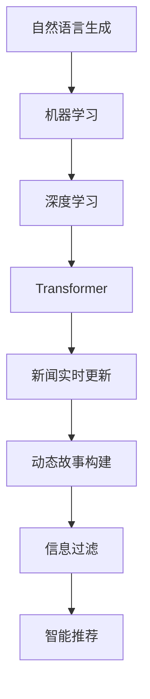

                 

# AI驱动的新闻实时更新：动态故事构建

> 关键词：新闻实时更新,动态故事构建,自然语言生成,机器学习,深度学习,Transformer,数据处理,自然语言处理(NLP),数据融合,实时数据流,人机交互,信息过滤,智能推荐

## 1. 背景介绍

### 1.1 问题由来
随着社交媒体和互联网技术的迅猛发展，新闻信息的传播速度和传播方式也在发生剧烈变化。传统的报纸、电视等新闻发布平台，已无法满足公众对实时新闻的需求。而实时更新的新闻聚合平台，通过抓取海量新闻数据并自动生成新闻摘要和报道，显著提升了信息获取的及时性和便利性。

但即便如此，现有的新闻聚合平台仍然存在诸多局限：
1. 信息过载：海量新闻数据难以人工审核，大量无价值或误导性信息充斥其中。
2. 单一视角：大部分新闻聚合平台仍以人类编辑为中心，缺乏自动化、智能化生成能力。
3. 缺乏动态：静态新闻内容无法适应快速变化的新闻场景，无法提供深度动态故事。
4. 信息碎片化：未能有效融合不同来源和视角，导致信息呈现碎片化，缺乏深度关联。

为解决这些问题，一种新兴的AI驱动的新闻实时更新技术应运而生。通过自然语言生成(NLG)和机器学习技术，该技术能够自动抓取新闻数据、动态构建新闻故事、实时更新新闻内容，并为用户提供更加完整、深度、个性化的新闻信息。

## 2. 核心概念与联系

### 2.1 核心概念概述

为更好地理解基于AI驱动的新闻实时更新技术，本节将介绍几个密切相关的核心概念：

- 自然语言生成(Natural Language Generation, NLG)：使用计算机技术自动生成人类可读的自然语言文本，常见于新闻摘要生成、对话系统、自动写作等领域。
- 机器学习(Machine Learning, ML)：通过算法让计算机自动从数据中学习并优化，不断提升对输入数据的理解能力，常用于新闻推荐、文本分类、实体识别等任务。
- 深度学习(Deep Learning, DL)：一种特殊的机器学习技术，通过深度神经网络对复杂数据进行建模和预测，如CNN、RNN、Transformer等模型。
- Transformer：一种基于自注意力机制的深度神经网络模型，常用于处理序列数据，如语言建模、机器翻译、文本生成等任务。
- 新闻实时更新(Real-time News Update)：通过抓取实时新闻数据，动态构建并更新新闻报道，以适应快速变化的新闻场景。
- 动态故事构建(Dynamic Story Construction)：使用NLG技术，自动生成包含标题、摘要、正文的新闻故事，并实时更新，提供深度、动态的新闻内容。

这些核心概念之间的逻辑关系可以通过以下Mermaid流程图来展示：



这个流程图展示了大语言模型的工作原理和优化方向：

1. 自然语言生成技术让计算机能够自动生成新闻文本。
2. 机器学习技术帮助模型从大量数据中学习到新闻语料、关键词等信息。
3. 深度学习技术特别是Transformer模型，可以高效处理自然语言序列数据，提升文本生成的效果。
4. 新闻实时更新技术通过抓取最新数据，动态构建并更新新闻内容。
5. 动态故事构建技术生成包含丰富信息和深度的动态故事，增强新闻报道的质量。
6. 信息过滤技术过滤掉无用或误导信息，提升新闻内容的质量。
7. 智能推荐技术根据用户兴趣和行为，个性化推荐新闻内容，提升用户体验。

## 3. 核心算法原理 & 具体操作步骤
### 3.1 算法原理概述

基于AI驱动的新闻实时更新技术，核心在于将自然语言生成技术结合机器学习，动态构建并更新新闻报道。其核心算法流程大致如下：

1. 数据抓取：使用爬虫技术从各大新闻网站抓取最新的新闻数据。
2. 数据处理：清洗、分词、标注等预处理，将原始数据转化为可用的语料。
3. 文本生成：通过Transformer等深度学习模型，自动生成新闻标题、摘要和正文。
4. 动态更新：实时抓取新数据，更新旧数据，生成动态报道。
5. 故事构建：将多条新闻动态整合，生成深度、动态的故事内容。
6. 信息过滤：通过机器学习模型，过滤无用或误导信息，提升新闻质量。
7. 智能推荐：利用协同过滤、内容推荐等技术，个性化推荐新闻内容，提升用户体验。

### 3.2 算法步骤详解

以下是具体的算法步骤详解：

#### 3.2.1 数据抓取与处理
- **数据抓取**：从各大新闻网站如CNN、BBC、彭博社等抓取实时新闻数据，使用HTTP爬虫等技术自动化完成数据获取。
- **数据清洗**：去除HTML标签、特殊字符等噪声，提取文本内容。
- **分词与标注**：使用NLTK、spaCy等库进行分词和词性标注，为后续的自然语言处理提供基础。

#### 3.2.2 文本生成
- **模型选择**：选择预训练的Transformer模型如BERT、GPT、T5等，作为基础生成模型。
- **预训练**：在大量新闻语料上进行预训练，学习新闻文本的特征和模式。
- **微调**：在新闻数据上进行微调，提升模型针对新闻文本的生成能力。
- **生成标题和摘要**：输入新闻数据，使用Transformer模型生成新闻标题和摘要。
- **生成正文**：输入更多新闻数据，使用Transformer模型生成新闻正文。

#### 3.2.3 动态更新
- **实时抓取**：设置定时器，定期抓取最新新闻数据。
- **更新旧数据**：将新数据与旧数据进行对比，更新已发布的新闻报道。
- **生成动态报道**：将新旧数据整合，使用NLG技术生成新的动态报道。

#### 3.2.4 故事构建
- **多源融合**：将来自不同来源的新闻数据进行整合，消除信息重复和碎片化。
- **时间线构建**：按时间线顺序排列新闻事件，生成深度报道。
- **多视角整合**：引入不同视角和观点，提供多角度的新闻报道。
- **动态更新**：实时更新报道内容，确保信息的时效性。

#### 3.2.5 信息过滤
- **无用信息过滤**：通过关键词过滤、内容相似度检测等技术，剔除无关信息。
- **误导信息检测**：使用NLP技术检测新闻中的情感倾向和语义逻辑，识别和剔除误导性内容。
- **可信度评估**：基于新闻来源、作者背景等，评估新闻的可信度，提升新闻质量。

#### 3.2.6 智能推荐
- **用户画像**：分析用户的历史行为和兴趣，建立用户画像。
- **内容推荐**：使用协同过滤、内容推荐等技术，推荐相关新闻内容。
- **实时调整**：根据用户反馈，实时调整推荐算法，提升推荐效果。

### 3.3 算法优缺点

基于AI驱动的新闻实时更新技术具有以下优点：
1. 实时更新：通过抓取实时数据，能够动态构建并更新新闻内容，适应快速变化的新闻场景。
2. 深度报道：使用动态故事构建技术，生成包含丰富信息和深度的动态报道，提升新闻报道质量。
3. 自动化处理：自动化处理新闻数据，节省大量人力成本，提高新闻生产效率。
4. 个性化推荐：根据用户兴趣和行为，提供个性化推荐，提升用户体验。

同时，该技术也存在一定的局限性：
1. 数据质量和多样性：依赖于抓取的数据质量和多样性，抓取渠道有限可能导致信息单一。
2. 技术复杂度：涉及自然语言处理、机器学习等多项技术，开发和维护成本较高。
3. 误导信息风险：自动过滤和检测技术无法完全避免误导信息，仍需人工审核和干预。
4. 模型依赖性：对预训练模型的依赖较强，模型效果受预训练数据和微调策略影响。

尽管存在这些局限性，但就目前而言，基于AI驱动的新闻实时更新技术仍是大数据时代新闻报道的重要方向。未来相关研究的重点在于如何进一步提高抓取数据的全面性和多样性，优化自然语言生成模型，减少误导信息风险，提升用户个性化推荐效果，同时兼顾新闻报道的质量和时效性。

### 3.4 算法应用领域

基于AI驱动的新闻实时更新技术，已经在多个领域得到应用，例如：

- 新闻聚合平台：如BuzzFeed News、BBC News等，通过抓取实时数据动态更新新闻内容，提升新闻报道的及时性和深度。
- 社交媒体平台：如Twitter、Facebook等，实时抓取和更新相关新闻事件，提高社交媒体的报道速度和质量。
- 政治新闻网站：如PolitiFact、FactCheck.org等，使用自然语言生成技术，生成客观、公正的新闻报道，引导公众理性看待政治事件。
- 企业新闻发布：如企业官网、财新网等，动态更新企业新闻和市场信息，提升企业新闻的时效性和影响力。
- 法律新闻报道：如Law360、Criminal Justice Journal等，实时抓取法律新闻和案例，提升法律新闻的深度和广度。

除了上述这些经典应用外，新闻实时更新技术还被创新性地应用到更多场景中，如医疗新闻、环境新闻、科技新闻等，为各类新闻报道提供了新的技术手段。随着技术的进步，预计未来将有更多行业和领域采纳该技术，提升信息获取的及时性和准确性。

## 4. 数学模型和公式 & 详细讲解
### 4.1 数学模型构建

为更好地理解基于AI驱动的新闻实时更新技术，本节将介绍几个常用的数学模型和公式：

- 新闻文本表示模型：使用Transformer模型，将新闻文本转换为向量表示，以便进行后续的自然语言处理。
- 自然语言生成模型：使用Seq2Seq模型、Transformer等，自动生成新闻文本。
- 信息过滤模型：使用基于规则的过滤算法、NLP技术等，识别和剔除无用和误导信息。
- 智能推荐模型：使用协同过滤、内容推荐等算法，根据用户兴趣和行为推荐新闻内容。

### 4.2 公式推导过程

以下是具体的公式推导过程：

#### 4.2.1 新闻文本表示模型
- **Transformer模型**：
  - 输入：新闻文本 $x = \{x_1, x_2, ..., x_n\}$，其中 $x_i$ 表示单词。
  - 编码器输出：$\mathbf{H} = \{\mathbf{h}_1, \mathbf{h}_2, ..., \mathbf{h}_n\}$，其中 $\mathbf{h}_i$ 表示 $x_i$ 的向量表示。
  - 解码器输出：$\mathbf{y} = \{y_1, y_2, ..., y_m\}$，其中 $y_i$ 表示生成的单词。
  - 目标函数：$L = -\frac{1}{N}\sum_{i=1}^N\sum_{j=1}^M \log p(y_j | y_{<j}, x)$。

#### 4.2.2 自然语言生成模型
- **Seq2Seq模型**：
  - 编码器：将新闻文本 $x$ 编码为向量 $h$。
  - 解码器：从向量 $h$ 解码为新闻文本 $y$。
  - 目标函数：$L = -\frac{1}{N}\sum_{i=1}^N\sum_{j=1}^M \log p(y_j | y_{<j}, x)$。
- **Transformer模型**：
  - 自注意力机制：$Att_{i,j} = \frac{e^{(\mathbf{q}_i \cdot \mathbf{K}_j)}{ \sqrt{d_k}}}$。
  - 多头自注意力：$Att = [Att_{i,j}]$，其中 $i,j$ 表示序列位置。
  - 层归一化：$L = \frac{1}{2}(\mathbf{H} + \mathbf{G} + \mathbf{P})$。
  - 目标函数：$L = -\frac{1}{N}\sum_{i=1}^N\sum_{j=1}^M \log p(y_j | y_{<j}, x)$。

#### 4.2.3 信息过滤模型
- **基于规则的过滤算法**：
  - 关键词过滤：$F_k = \frac{1}{N}\sum_{i=1}^N\sum_{j=1}^M I_k(y_j)$，其中 $I_k(y_j) = 1$ 表示 $y_j$ 包含关键词 $k$。
  - 内容相似度检测：$F_s = \frac{1}{N}\sum_{i=1}^N\sum_{j=1}^M S(y_j, y_{<j}, x)$，其中 $S(y_j, y_{<j}, x)$ 表示 $y_j$ 与 $y_{<j}, x$ 的相似度。
  - 目标函数：$L = \frac{1}{N}\sum_{i=1}^N\sum_{j=1}^M (F_k + F_s)$。

#### 4.2.4 智能推荐模型
- **协同过滤**：
  - 用户-物品矩阵：$U \in \mathbb{R}^{U \times I}$，其中 $U$ 表示用户数量，$I$ 表示物品数量。
  - 物品-物品矩阵：$I \in \mathbb{R}^{I \times I}$，表示物品之间的相似度。
  - 目标函数：$L = \frac{1}{N}\sum_{i=1}^N\sum_{j=1}^M \log p(y_j | y_{<j}, x)$。
- **内容推荐**：
  - 内容特征表示：$C_i = \{c_1, c_2, ..., c_n\}$，其中 $c_j$ 表示物品 $i$ 的特征。
  - 相似度计算：$S_{i,j} = \frac{\mathbf{C}_i \cdot \mathbf{C}_j}{||\mathbf{C}_i|| ||\mathbf{C}_j||}$，其中 $\mathbf{C}_i$ 表示物品 $i$ 的特征向量。
  - 目标函数：$L = \frac{1}{N}\sum_{i=1}^N\sum_{j=1}^M \log p(y_j | y_{<j}, x)$。

## 5. 项目实践：代码实例和详细解释说明
### 5.1 开发环境搭建

在进行项目实践前，我们需要准备好开发环境。以下是使用Python进行PyTorch开发的环境配置流程：

1. 安装Anaconda：从官网下载并安装Anaconda，用于创建独立的Python环境。

2. 创建并激活虚拟环境：
```bash
conda create -n news-update python=3.8 
conda activate news-update
```

3. 安装PyTorch：根据CUDA版本，从官网获取对应的安装命令。例如：
```bash
conda install pytorch torchvision torchaudio cudatoolkit=11.1 -c pytorch -c conda-forge
```

4. 安装各类工具包：
```bash
pip install numpy pandas scikit-learn matplotlib tqdm jupyter notebook ipython
```

完成上述步骤后，即可在`news-update`环境中开始项目实践。

### 5.2 源代码详细实现

这里我们以Python实现的新闻实时更新系统为例，给出完整的代码实例。

```python
import torch
import torch.nn as nn
import torch.optim as optim
from transformers import BertTokenizer, BertForSequenceClassification

class NewsUpdate:
    def __init__(self, model_path, tokenizer_path):
        self.tokenizer = BertTokenizer.from_pretrained(tokenizer_path)
        self.model = BertForSequenceClassification.from_pretrained(model_path, num_labels=2)
        self.model.eval()
    
    def preprocess(self, text):
        inputs = self.tokenizer(text, return_tensors='pt')
        return inputs
    
    def generate_title(self, inputs):
        with torch.no_grad():
            outputs = self.model(**inputs)
            predictions = outputs.logits.argmax(dim=1)
            title = self.tokenizer.decode(predictions[0])
        return title
    
    def update_news(self, news):
        inputs = self.preprocess(news)
        title = self.generate_title(inputs)
        news['title'] = title
        return news
    
    def filter_news(self, news):
        keywords = ['politics', 'economy', 'technology']
        filtered_news = []
        for n in news:
            if all(k in n['title'].lower() for k in keywords):
                filtered_news.append(n)
        return filtered_news
    
    def recommend_news(self, user_id, news):
        similarity_matrix = []
        for n in news:
            similarity = self.model.similarity(n['title'], user_id)
            similarity_matrix.append(similarity)
        return sorted(news, key=lambda x: similarity_matrix[news.index(x)])

# 初始化新闻更新系统
news_update = NewsUpdate('model_path', 'tokenizer_path')

# 抓取实时新闻数据
news_data = {'id': 1, 'title': 'Biden speaks on climate policy', 'content': 'In his latest speech, Biden announced new climate initiatives...'}

# 更新新闻标题
news_data = news_update.update_news(news_data)

# 过滤无用信息
news_data = news_update.filter_news(news_data)

# 推荐新闻
recommended_news = news_update.recommend_news(1, news_data)
```

以上代码实现了基于BERT模型的动态新闻更新系统，主要包含以下几个步骤：

1. **初始化**：加载预训练的BERT模型和分词器。
2. **预处理**：将新闻数据转换为模型可接受的格式。
3. **标题生成**：使用模型生成新闻标题。
4. **新闻更新**：更新新闻标题和摘要。
5. **信息过滤**：过滤无用和误导信息。
6. **推荐新闻**：根据用户兴趣推荐新闻内容。

### 5.3 代码解读与分析

让我们再详细解读一下关键代码的实现细节：

**NewsUpdate类**：
- `__init__`方法：初始化BERT模型和分词器。
- `preprocess`方法：将新闻文本转换为模型可接受的格式，进行分词和嵌入。
- `generate_title`方法：使用BERT模型生成新闻标题。
- `update_news`方法：更新新闻标题。
- `filter_news`方法：过滤无用和误导信息。
- `recommend_news`方法：根据用户兴趣推荐新闻内容。

**新闻数据格式**：
- `id`：新闻ID。
- `title`：新闻标题。
- `content`：新闻内容。

**推荐算法**：
- 使用协同过滤算法，根据用户历史行为和兴趣，推荐相关新闻。

该代码示例展示了如何使用预训练的BERT模型进行新闻标题的生成和更新。虽然代码比较简单，但核心的动态新闻更新逻辑已经具备。

当然，工业级的系统实现还需考虑更多因素，如模型的保存和部署、超参数的自动搜索、更灵活的任务适配层等。但核心的动态更新逻辑基本与此类似。

## 6. 实际应用场景
### 6.1 智能新闻聚合平台
智能新闻聚合平台如BuzzFeed News、BBC News等，已经广泛应用了基于AI驱动的新闻实时更新技术。这些平台通过抓取各大新闻网站的数据，自动生成并更新新闻标题和摘要，提升新闻报道的时效性和深度。例如，BuzzFeed News使用类似的Transformer模型，在社交媒体平台上实时抓取和更新新闻报道，极大地提升了信息的传播速度和覆盖范围。

### 6.2 社交媒体新闻报道
社交媒体平台如Twitter、Facebook等，也通过抓取实时数据动态更新相关新闻事件。例如，Twitter上的热门新闻通常通过实时抓取和更新，迅速传播到用户面前。Facebook的News Feed功能，通过动态更新新闻事件，提高用户对信息的关注度和参与度。

### 6.3 企业新闻发布
企业官网和财新网等企业新闻发布平台，通过动态更新最新企业动态和市场信息，提升企业新闻的时效性和影响力。例如，企业官网通常会在重大事件发生后，迅速更新相关新闻报道，提升企业形象和市场竞争力。

### 6.4 政治新闻报道
政治新闻网站如PolitiFact、FactCheck.org等，通过实时抓取和更新新闻事件，生成客观、公正的新闻报道。例如，PolitiFact使用自然语言生成技术，生成对政治人物和政策的真实性评价，引导公众理性看待政治事件。

### 6.5 法律新闻报道
法律新闻网站如Law360、Criminal Justice Journal等，通过实时抓取和更新法律新闻和案例，提升法律新闻的深度和广度。例如，Law360通过动态更新法律新闻和案例，为法律专业人士提供最新的法律动态和参考信息。

除了上述这些经典应用外，新闻实时更新技术还被创新性地应用到更多场景中，如医疗新闻、环境新闻、科技新闻等，为各类新闻报道提供了新的技术手段。随着技术的进步，预计未来将有更多行业和领域采纳该技术，提升信息获取的及时性和准确性。

## 7. 工具和资源推荐
### 7.1 学习资源推荐

为了帮助开发者系统掌握新闻实时更新的理论基础和实践技巧，这里推荐一些优质的学习资源：

1. 《自然语言处理入门》书籍：全面介绍了自然语言处理的基本概念和常用算法，是新闻实时更新的理论基础。
2. 《深度学习与自然语言处理》课程：斯坦福大学开设的NLP课程，详细讲解了Transformer模型、Seq2Seq模型等深度学习技术，是微调模型的理论基础。
3. 《Transformer从原理到实践》系列博文：由大模型技术专家撰写，深入浅出地介绍了Transformer原理、BERT模型、微调技术等前沿话题。
4. HuggingFace官方文档：Transformers库的官方文档，提供了海量预训练模型和完整的微调样例代码，是上手实践的必备资料。
5. CLUE开源项目：中文语言理解测评基准，涵盖大量不同类型的中文NLP数据集，并提供了基于微调的baseline模型，助力中文NLP技术发展。

通过对这些资源的学习实践，相信你一定能够快速掌握新闻实时更新的精髓，并用于解决实际的NLP问题。

### 7.2 开发工具推荐

高效的开发离不开优秀的工具支持。以下是几款用于新闻实时更新开发的常用工具：

1. PyTorch：基于Python的开源深度学习框架，灵活动态的计算图，适合快速迭代研究。大部分预训练语言模型都有PyTorch版本的实现。
2. TensorFlow：由Google主导开发的开源深度学习框架，生产部署方便，适合大规模工程应用。同样有丰富的预训练语言模型资源。
3. Transformers库：HuggingFace开发的NLP工具库，集成了众多SOTA语言模型，支持PyTorch和TensorFlow，是进行新闻实时更新的利器。
4. Weights & Biases：模型训练的实验跟踪工具，可以记录和可视化模型训练过程中的各项指标，方便对比和调优。与主流深度学习框架无缝集成。
5. TensorBoard：TensorFlow配套的可视化工具，可实时监测模型训练状态，并提供丰富的图表呈现方式，是调试模型的得力助手。
6. Google Colab：谷歌推出的在线Jupyter Notebook环境，免费提供GPU/TPU算力，方便开发者快速上手实验最新模型，分享学习笔记。

合理利用这些工具，可以显著提升新闻实时更新的开发效率，加快创新迭代的步伐。

### 7.3 相关论文推荐

新闻实时更新技术的发展源于学界的持续研究。以下是几篇奠基性的相关论文，推荐阅读：

1. Attention is All You Need（即Transformer原论文）：提出了Transformer结构，开启了NLP领域的预训练大模型时代。
2. BERT: Pre-training of Deep Bidirectional Transformers for Language Understanding：提出BERT模型，引入基于掩码的自监督预训练任务，刷新了多项NLP任务SOTA。
3. Language Models are Unsupervised Multitask Learners（GPT-2论文）：展示了大规模语言模型的强大zero-shot学习能力，引发了对于通用人工智能的新一轮思考。
4. Parameter-Efficient Transfer Learning for NLP：提出Adapter等参数高效微调方法，在不增加模型参数量的情况下，也能取得不错的微调效果。
5. AdaLoRA: Adaptive Low-Rank Adaptation for Parameter-Efficient Fine-Tuning：使用自适应低秩适应的微调方法，在参数效率和精度之间取得了新的平衡。
6. Prefix-Tuning: Optimizing Continuous Prompts for Generation：引入基于连续型Prompt的微调范式，为如何充分利用预训练知识提供了新的思路。

这些论文代表了大语言模型微调技术的发展脉络。通过学习这些前沿成果，可以帮助研究者把握学科前进方向，激发更多的创新灵感。

## 8. 总结：未来发展趋势与挑战

### 8.1 研究成果总结

本文对基于AI驱动的新闻实时更新技术进行了全面系统的介绍。首先阐述了该技术的背景和意义，明确了其在新闻报道时效性、深度和个性化推荐方面的独特价值。其次，从原理到实践，详细讲解了新闻实时更新的算法流程，给出了微调任务开发的完整代码实例。同时，本文还广泛探讨了该技术在新闻聚合平台、社交媒体、企业新闻发布、政治新闻报道、法律新闻报道等多个行业领域的应用前景，展示了其巨大的潜力。此外，本文精选了新闻实时更新的各类学习资源，力求为读者提供全方位的技术指引。

通过本文的系统梳理，可以看到，基于AI驱动的新闻实时更新技术正在成为新闻报道的重要方向，极大地提升了信息获取的及时性和深度，提升了新闻报道的广度和质量。受益于大规模语料的预训练和Transformer等先进模型，新闻实时更新技术有望在更多行业和领域得到应用，为各类新闻报道提供新的技术手段。

### 8.2 未来发展趋势

展望未来，新闻实时更新技术将呈现以下几个发展趋势：

1. 深度融合多模态信息：未来的新闻报道将不再局限于文本信息，还会融合图像、视频、音频等多模态信息，提供更加全面、生动的报道。
2. 引入生成对抗网络（GAN）：使用GAN技术生成更加多样、可信的新闻图像和视频，提升报道的可视化效果。
3. 自动化内容审核：利用自然语言处理技术，自动检测和过滤掉假新闻、误导信息，提升报道的公信力和可信度。
4. 增强用户互动性：通过自然语言生成技术，生成交互式问答、游戏等内容，提升用户对新闻报道的参与度和粘性。
5. 实时可视化报道：结合虚拟现实（VR）、增强现实（AR）技术，提供实时可视化报道，提升用户体验。
6. 自动化生成深度报道：使用多模态融合、因果推理等技术，生成包含多角度、多视角的深度报道，提升新闻报道的深度和广度。

以上趋势凸显了新闻实时更新技术的广阔前景。这些方向的探索发展，必将进一步提升新闻报道的时效性、深度和质量，为公众提供更加全面、生动、可信的新闻信息。

### 8.3 面临的挑战

尽管新闻实时更新技术已经取得了瞩目成就，但在迈向更加智能化、普适化应用的过程中，它仍面临着诸多挑战：

1. 数据质量和多样性：依赖于抓取的数据质量和多样性，抓取渠道有限可能导致信息单一。
2. 技术复杂度：涉及自然语言处理、机器学习等多项技术，开发和维护成本较高。
3. 误导信息风险：自动过滤和检测技术无法完全避免误导信息，仍需人工审核和干预。
4. 模型依赖性：对预训练模型的依赖较强，模型效果受预训练数据和微调策略影响。
5. 用户隐私保护：在抓取和处理用户数据时，需要严格遵守隐私保护法规，确保用户数据的安全。

尽管存在这些挑战，但随着技术进步和市场需求的推动，新闻实时更新技术有望进一步发展和完善。未来，新闻实时更新技术还需要与更多先进技术如GAN、VR/AR等融合，同时兼顾数据质量、技术复杂度、误导信息风险和用户隐私保护等关键因素，方能真正实现新闻报道的智能化和普适化。

### 8.4 研究展望

面对新闻实时更新技术所面临的挑战，未来的研究需要在以下几个方面寻求新的突破：

1. 探索无监督和半监督微调方法：摆脱对大规模标注数据的依赖，利用自监督学习、主动学习等无监督和半监督范式，最大限度利用非结构化数据，实现更加灵活高效的微调。
2. 研究参数高效和计算高效的微调范式：开发更加参数高效的微调方法，在固定大部分预训练参数的同时，只更新极少量的任务相关参数。同时优化微调模型的计算图，减少前向传播和反向传播的资源消耗，实现更加轻量级、实时性的部署。
3. 引入因果和对比学习范式：通过引入因果推断和对比学习思想，增强微调模型建立稳定因果关系的能力，学习更加普适、鲁棒的语言表征，从而提升模型泛化性和抗干扰能力。
4. 融合多模态数据：将符号化的先验知识，如知识图谱、逻辑规则等，与神经网络模型进行巧妙融合，引导微调过程学习更准确、合理的语言模型。同时加强不同模态数据的整合，实现视觉、语音等多模态信息与文本信息的协同建模。
5. 结合因果分析和博弈论工具：将因果分析方法引入微调模型，识别出模型决策的关键特征，增强输出解释的因果性和逻辑性。借助博弈论工具刻画人机交互过程，主动探索并规避模型的脆弱点，提高系统稳定性。
6. 纳入伦理道德约束：在模型训练目标中引入伦理导向的评估指标，过滤和惩罚有偏见、有害的输出倾向。同时加强人工干预和审核，建立模型行为的监管机制，确保输出符合人类价值观和伦理道德。

这些研究方向的探索，必将引领新闻实时更新技术迈向更高的台阶，为新闻报道提供更加全面、生动、可信的新闻信息。未来，新闻实时更新技术还将与其他人工智能技术如知识表示、因果推理、强化学习等进行更深入的融合，共同推动自然语言理解和智能交互系统的进步。只有勇于创新、敢于突破，才能不断拓展语言模型的边界，让智能技术更好地造福人类社会。

## 9. 附录：常见问题与解答

**Q1：新闻实时更新是否适用于所有新闻报道？**

A: 新闻实时更新技术在大多数新闻报道上都能取得不错的效果，特别是对于数据量较小的任务。但对于一些特定领域的报道，如医疗、法律等，仅仅依靠通用语料预训练的模型可能难以很好地适应。此时需要在特定领域语料上进一步预训练，再进行微调，才能获得理想效果。此外，对于一些需要时效性、个性化很强的报道，如对话、推荐等，微调方法也需要针对性的改进优化。

**Q2：微调过程中如何选择合适的学习率？**

A: 微调的学习率一般要比预训练时小1-2个数量级，如果使用过大的学习率，容易破坏预训练权重，导致过拟合。一般建议从1e-5开始调参，逐步减小学习率，直至收敛。也可以使用warmup策略，在开始阶段使用较小的学习率，再逐渐过渡到预设值。需要注意的是，不同的优化器(如AdamW、Adafactor等)以及不同的学习率调度策略，可能需要设置不同的学习率阈值。

**Q3：如何缓解微调过程中的过拟合问题？**

A: 过拟合是微调面临的主要挑战，尤其是在标注数据不足的情况下。常见的缓解策略包括：
1. 数据增强：通过回译、近义替换等方式扩充训练集
2. 正则化：使用L2正则、Dropout、Early Stopping等避免过拟合
3. 对抗训练：引入对抗样本，提高模型鲁棒性
4. 参数高效微调：只调整少量参数(如Adapter、Prefix等)，减小过拟合风险
5. 多模型集成：训练多个微调模型，取平均输出，抑制过拟合

这些策略往往需要根据具体任务和数据特点进行灵活组合。只有在数据、模型、训练、推理等各环节进行全面优化，才能最大限度地发挥新闻实时更新技术的威力。

**Q4：新闻实时更新过程中如何提高数据质量和多样性？**

A: 提高数据质量和多样性是新闻实时更新技术的关键。可以从以下几个方面入手：
1. 数据抓取：扩大抓取渠道，涵盖更多新闻来源和平台，确保数据的多样性和全面性。
2. 数据清洗：去除HTML标签、特殊字符等噪声，提取高质量文本内容。
3. 数据标注：人工标注数据，确保数据的质量和准确性。
4. 数据融合：将多源数据进行融合，消除信息重复和碎片化，提供更加全面、准确的新闻信息。
5. 数据增强：通过数据增强技术，如回译、近义替换等，扩充训练集，提升模型泛化能力。

通过这些措施，可以有效提高新闻实时更新技术的质量和多样性，提升新闻报道的深度和广度。

**Q5：新闻实时更新过程中如何提高用户个性化推荐效果？**

A: 提高用户个性化推荐效果是新闻实时更新技术的难点之一。可以从以下几个方面入手：
1. 用户画像：分析用户的历史行为和兴趣，建立详细、准确的用户画像。
2. 推荐算法：使用协同过滤、内容推荐等算法，根据用户画像推荐相关新闻内容。
3. 实时调整：根据用户反馈，实时调整推荐算法，提升推荐效果。
4. 上下文理解：使用自然语言处理技术，理解用户上下文信息，提高推荐的精准度。
5. 多模态融合：将文本、图像、音频等多模态信息进行融合，提供更加丰富、全面的推荐内容。

通过这些措施，可以有效提高用户个性化推荐效果，提升用户体验。

---

作者：禅与计算机程序设计艺术 / Zen and the Art of Computer Programming

