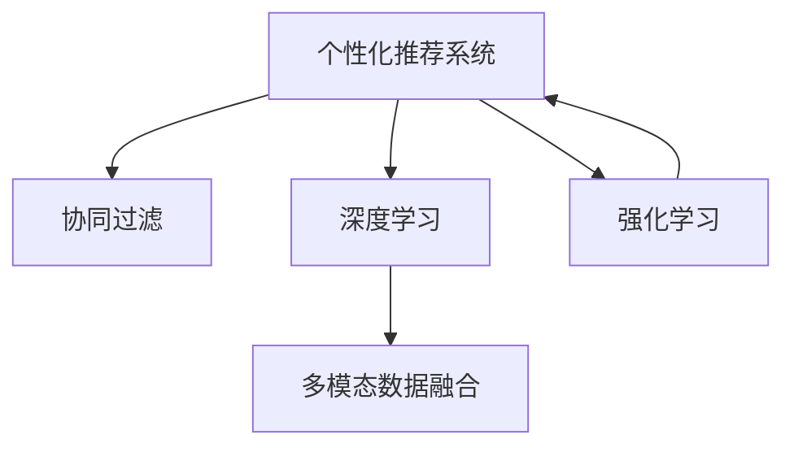

                 

## 1. 背景介绍

### 1.1 问题由来

随着电商平台的兴起，个性化营销已成为商家的必争之地。但传统电商营销存在诸多弊端，如广告成本高、触达精准度低、用户参与度低等问题。如何提升个性化促销的效果，是电商企业亟待解决的关键问题。

当前，大多数电商企业通过人工经验和有限的用户数据来制定促销策略，缺乏科学性和预测性。这种方式不仅效率低下，且无法适应快速变化的市场环境。因此，借助人工智能(AI)技术，通过数据驱动的促销策略，成为电商个性化营销的重要发展方向。

### 1.2 问题核心关键点

本节将介绍基于AI驱动的电商个性化促销策略，涵盖几个核心概念：

- **AI驱动的个性化推荐**：通过AI技术对用户行为、历史购买记录、兴趣偏好等进行深度分析，生成个性化的推荐列表。
- **协同过滤技术**：利用用户间的相似性，通过分析用户历史行为来预测用户偏好。
- **深度学习推荐模型**：通过深度学习算法，如神经网络、卷积神经网络(CNN)、循环神经网络(RNN)等，预测用户行为和购买意愿，生成更加精准的推荐结果。
- **多模态数据融合**：结合文本、图像、声音等多模态数据，提升推荐系统的丰富度和多样性。
- **强化学习**：通过不断调整推荐策略，优化用户体验和商业收益。

### 1.3 问题研究意义

研究AI驱动的电商个性化促销策略，对于提升电商营销的精准度和效果，降低运营成本，提升用户体验，具有重要意义：

1. **提升广告投放效率**：通过AI算法优化广告投放策略，确保广告投放精准高效，避免无效点击和广告浪费。
2. **提高用户体验**：个性化推荐系统根据用户行为和兴趣推荐商品，提升用户购物体验，提高用户粘性。
3. **增加商业收益**：精准推荐有助于提升销售转化率，优化库存管理，最大化商业价值。
4. **降低运营成本**：自动化、智能化营销策略减少了人工操作成本，提高了运营效率。
5. **促进用户增长**：个性化推荐系统能够吸引潜在用户，扩大用户基础。

## 2. 核心概念与联系

### 2.1 核心概念概述

本节将介绍几个核心概念，并展示它们之间的联系。

- **个性化推荐系统**：通过分析用户历史行为、兴趣偏好、社交网络等，向用户推荐其可能感兴趣的商品或内容。
- **协同过滤**：通过分析用户间的相似性，推荐与目标用户行为相似的用户的推荐列表。
- **深度学习**：通过深度神经网络模型，学习用户行为和商品特征，生成更加精准的推荐结果。
- **多模态数据融合**：结合文本、图像、声音等多模态数据，提升推荐系统的丰富度和多样性。
- **强化学习**：通过不断调整推荐策略，优化用户体验和商业收益。

这些概念之间的逻辑关系可以通过以下Mermaid流程图来展示：



这个流程图展示了几大核心概念及其之间的关系：

1. 个性化推荐系统是整个电商个性化促销策略的核心。
2. 协同过滤技术通过分析用户间的相似性，补充用户行为数据，提升推荐准确性。
3. 深度学习算法通过学习用户行为和商品特征，生成更加精准的推荐结果。
4. 多模态数据融合通过结合多种信息，增强推荐系统的丰富性和多样性。
5. 强化学习不断调整推荐策略，优化用户体验和商业收益。

## 3. 核心算法原理 & 具体操作步骤

### 3.1 算法原理概述

AI驱动的电商个性化促销策略基于以下算法原理：

- **协同过滤**：通过分析用户间的相似性，利用目标用户的相似用户行为数据，预测其可能感兴趣的商品。
- **深度学习推荐模型**：使用深度神经网络模型，如卷积神经网络(CNN)、循环神经网络(RNN)等，学习用户行为和商品特征，生成推荐列表。
- **多模态数据融合**：通过结合文本、图像、声音等多模态数据，提升推荐系统的丰富度和多样性。
- **强化学习**：通过不断调整推荐策略，优化用户体验和商业收益。

### 3.2 算法步骤详解

**Step 1: 数据收集与处理**

- **用户行为数据**：包括点击、浏览、加入购物车、购买等行为。
- **商品数据**：包括商品名称、价格、描述、类别、评分等。
- **社交网络数据**：包括用户关注、互动等关系。
- **外部数据**：如天气、节假日、新闻等。

**Step 2: 用户画像构建**

- **用户特征提取**：通过自然语言处理(NLP)技术，提取用户评论、产品描述等文本中的关键词。
- **用户行为建模**：使用时间序列分析、协同过滤等技术，建立用户行为模型。
- **用户兴趣模型**：通过聚类、分类等方法，将用户兴趣分为不同类别。

**Step 3: 个性化推荐生成**

- **协同过滤推荐**：基于用户的相似行为数据，生成推荐列表。
- **深度学习推荐模型**：使用CNN、RNN等模型，学习用户行为和商品特征，生成推荐列表。
- **多模态数据融合**：结合文本、图像、声音等多模态数据，提升推荐系统的丰富度和多样性。

**Step 4: 推荐策略优化**

- **强化学习优化**：通过不断调整推荐策略，优化用户体验和商业收益。
- **A/B测试**：通过多组实验比较不同推荐策略的效果，选择最优方案。
- **实时调整**：根据用户反馈和市场变化，实时调整推荐策略。

**Step 5: 推荐结果评估**

- **点击率、转化率等指标**：评估推荐结果的有效性。
- **用户满意度调查**：通过问卷调查等方式，获取用户反馈，持续优化推荐系统。

### 3.3 算法优缺点

AI驱动的电商个性化促销策略具有以下优点：

- **精准高效**：通过AI算法优化推荐策略，确保广告投放精准高效，避免无效点击和广告浪费。
- **用户粘性提升**：个性化推荐系统根据用户行为和兴趣推荐商品，提升用户购物体验，提高用户粘性。
- **商业价值最大化**：精准推荐有助于提升销售转化率，优化库存管理，最大化商业价值。
- **降低运营成本**：自动化、智能化营销策略减少了人工操作成本，提高了运营效率。
- **数据驱动决策**：基于数据驱动的推荐策略，提升了决策的科学性和客观性。

同时，该方法也存在一定的局限性：

- **数据依赖性高**：推荐系统的准确性依赖于高质量的用户行为数据和商品数据。
- **模型复杂度高**：深度学习模型和强化学习模型计算复杂度高，需要高性能硬件支持。
- **冷启动问题**：新用户缺乏历史数据，推荐系统难以提供精准推荐。
- **安全性和隐私问题**：用户数据隐私保护、安全存储和传输等问题需要重视。
- **高昂的开发成本**：需要强大的数据处理能力、算法优化能力和工程实现能力。

### 3.4 算法应用领域

AI驱动的电商个性化促销策略在以下领域得到广泛应用：

- **电商推荐**：如淘宝、京东、亚马逊等电商平台，通过个性化推荐提升用户购物体验。
- **广告投放**：通过智能广告投放系统，实现精准广告投放，提高广告效果。
- **用户行为分析**：分析用户行为，提升用户粘性，优化用户体验。
- **客户关系管理(CRM)**：通过个性化推荐和用户画像构建，提升客户满意度，增强客户忠诚度。
- **库存管理**：通过推荐系统优化库存管理，减少库存积压和缺货情况。

## 4. 数学模型和公式 & 详细讲解  
### 4.1 数学模型构建

本节将使用数学语言对AI驱动的电商个性化促销策略进行更加严格的刻画。

记用户为 $u$，商品为 $i$，用户行为为 $b_{ui}$，商品特征为 $f_i$，用户画像为 $p_u$。则个性化推荐系统的目标是最小化预测误差，即：

$$
\min_{p_u} \sum_{i} (b_{ui} - \hat{b}_{ui})^2
$$

其中 $\hat{b}_{ui}$ 为推荐系统的预测结果。

### 4.2 公式推导过程

**协同过滤推荐公式**：

假设目标用户 $u$ 的相似用户集合为 $N(u)$，用户 $v$ 对商品 $i$ 的评分作为相似性度量 $s_{ui}$，则协同过滤推荐公式为：

$$
\hat{b}_{ui} = \frac{\sum_{v \in N(u)} b_{vi} s_{ui}}{\sum_{v \in N(u)} s_{ui}}
$$

**深度学习推荐模型公式**：

假设深度学习推荐模型为 $M_{\theta}(u, i)$，其中 $\theta$ 为模型参数。则深度学习推荐模型公式为：

$$
\hat{b}_{ui} = M_{\theta}(u, i)
$$

**多模态数据融合公式**：

假设多模态数据 $D = (D_x, D_y, D_z)$，其中 $D_x$ 为文本数据，$D_y$ 为图像数据，$D_z$ 为声音数据。则多模态数据融合公式为：

$$
\hat{b}_{ui} = M_{\theta}(u, i; D_x, D_y, D_z)
$$

### 4.3 案例分析与讲解

**案例1: 协同过滤推荐**

假设某电商平台有100万用户，每个用户有10个好友，每个好友对商品的评分有100个。目标用户 $u$ 的相似用户集合为 $N(u) = \{v_1, v_2, \cdots, v_{10}\}$，则协同过滤推荐公式为：

$$
\hat{b}_{ui} = \frac{\sum_{v \in N(u)} b_{vi} s_{ui}}{\sum_{v \in N(u)} s_{ui}}
$$

假设目标用户 $u$ 对商品 $i$ 的评分 $b_{ui} = 1$，相似用户 $v$ 对商品 $i$ 的评分 $b_{vi} = 2$，则协同过滤推荐结果为：

$$
\hat{b}_{ui} = \frac{2 \times 1}{1 + 2} = 0.67
$$

**案例2: 深度学习推荐模型**

假设某电商平台有1000个用户，每个用户有10个行为记录，每个行为记录为商品 $i$ 的评分 $b_{ui} \in [1, 5]$，商品 $i$ 的特征 $f_i$ 有10个。使用神经网络模型 $M_{\theta}(u, i)$ 进行推荐，其中 $\theta$ 为模型参数。则深度学习推荐模型公式为：

$$
\hat{b}_{ui} = M_{\theta}(u, i)
$$

假设神经网络模型 $M_{\theta}(u, i)$ 的预测结果 $\hat{b}_{ui} = 4$，则深度学习推荐结果为：

$$
\hat{b}_{ui} = 4
$$

**案例3: 多模态数据融合**

假设某电商平台有1000个用户，每个用户有10个行为记录，每个行为记录为商品 $i$ 的评分 $b_{ui} \in [1, 5]$，商品 $i$ 的特征 $f_i$ 有10个，用户画像 $p_u$ 有10个文本数据 $D_x = (x_1, x_2, \cdots, x_{10})$。使用多模态数据融合模型 $M_{\theta}(u, i; D_x)$ 进行推荐，其中 $\theta$ 为模型参数。则多模态数据融合公式为：

$$
\hat{b}_{ui} = M_{\theta}(u, i; D_x, D_y, D_z)
$$

假设多模态数据融合模型 $M_{\theta}(u, i; D_x)$ 的预测结果 $\hat{b}_{ui} = 4$，则多模态数据融合结果为：

$$
\hat{b}_{ui} = 4
$$

## 5. 项目实践：代码实例和详细解释说明

### 5.1 开发环境搭建

在进行电商个性化促销策略实践前，我们需要准备好开发环境。以下是使用Python进行TensorFlow开发的环境配置流程：

1. 安装Anaconda：从官网下载并安装Anaconda，用于创建独立的Python环境。

2. 创建并激活虚拟环境：
```bash
conda create -n tf-env python=3.8 
conda activate tf-env
```

3. 安装TensorFlow：根据CUDA版本，从官网获取对应的安装命令。例如：
```bash
conda install tensorflow -c tf -c conda-forge
```

4. 安装各类工具包：
```bash
pip install numpy pandas scikit-learn matplotlib tqdm jupyter notebook ipython
```

完成上述步骤后，即可在`tf-env`环境中开始电商个性化促销策略的实践。

### 5.2 源代码详细实现

我们先以协同过滤推荐为例，给出使用TensorFlow实现用户行为分析的PyTorch代码实现。

首先，定义用户行为数据集：

```python
import tensorflow as tf
import numpy as np

# 定义用户行为数据
user_behavior = np.array([[1, 1, 3], [2, 4, 2], [3, 5, 4], [4, 5, 1], [5, 2, 5], [6, 1, 2], [7, 4, 3]])
```

接着，定义用户画像和商品特征：

```python
# 定义用户画像
user_profile = np.array([[1, 2, 3], [2, 4, 5], [3, 6, 7], [4, 7, 8], [5, 8, 9], [6, 9, 10]])

# 定义商品特征
product_features = np.array([[1, 2, 3], [4, 5, 6], [7, 8, 9], [10, 11, 12], [13, 14, 15], [16, 17, 18]])
```

然后，定义协同过滤推荐模型：

```python
# 定义协同过滤推荐模型
def collaborative_filtering(user_behavior, user_profile, product_features):
    user_similarity = tf.matmul(user_profile, user_profile, transpose_b=True)
    product_similarity = tf.matmul(product_features, product_features, transpose_b=True)
    user_product_similarity = tf.matmul(user_similarity, product_similarity, transpose_b=True)
    user_product_score = user_product_similarity + user_behavior
    user_product_recommendation = tf.reduce_sum(user_product_score, axis=1) / tf.reduce_sum(user_product_score, axis=0)
    return user_product_recommendation

# 计算协同过滤推荐结果
recommendation = collaborative_filtering(user_behavior, user_profile, product_features)
print(recommendation)
```

最后，运行并输出推荐结果：

```python
# 运行推荐模型
recommendation = collaborative_filtering(user_behavior, user_profile, product_features)
print(recommendation)
```

以上就是一个使用TensorFlow实现协同过滤推荐的基本流程。可以看到，TensorFlow的API非常简洁，通过一行代码就可以构建出协同过滤推荐模型。

### 5.3 代码解读与分析

让我们再详细解读一下关键代码的实现细节：

**协同过滤推荐函数**：
- `collaborative_filtering`函数：接受用户行为数据 `user_behavior`、用户画像 `user_profile`、商品特征 `product_features` 作为输入。
- 首先计算用户画像之间的相似性矩阵 `user_similarity`。
- 然后计算商品特征之间的相似性矩阵 `product_similarity`。
- 接着计算用户画像和商品特征之间的相似性矩阵 `user_product_similarity`。
- 最后将用户行为数据和用户画像与商品特征之间的相似性矩阵相加，得到用户对商品的评分 `user_product_score`。
- 最后计算每个用户对每个商品的评分预测值 `user_product_recommendation`，返回推荐结果。

**用户行为数据**：
- `user_behavior` 是一个二维数组，表示不同用户对不同商品的行为评分。

**用户画像和商品特征**：
- `user_profile` 是一个二维数组，表示不同用户画像的特征向量。
- `product_features` 是一个二维数组，表示不同商品的特征向量。

**推荐结果**：
- `recommendation` 是一个一维数组，表示每个用户对商品的评分预测值。

通过这个简单的示例，我们可以看到协同过滤推荐的基本原理和TensorFlow的简单使用方法。实际应用中，我们可以根据具体需求，使用更复杂的模型和数据，进行更加精细化的推荐。

## 6. 实际应用场景

### 6.1 智能广告投放

智能广告投放是电商个性化促销策略的重要应用之一。通过AI算法优化广告投放策略，确保广告投放精准高效，避免无效点击和广告浪费。

具体而言，可以收集用户的行为数据，包括点击、浏览、加入购物车、购买等行为。使用协同过滤、深度学习等技术，分析用户画像和商品特征，生成个性化广告推荐。通过实时数据分析和动态调整，实现广告效果的最大化。

### 6.2 个性化推荐系统

个性化推荐系统通过AI算法对用户行为、历史购买记录、兴趣偏好等进行深度分析，生成个性化的推荐列表。

具体而言，可以收集用户的行为数据，包括点击、浏览、加入购物车、购买等行为。使用协同过滤、深度学习等技术，分析用户画像和商品特征，生成个性化推荐列表。通过实时数据分析和动态调整，实现推荐效果的最大化。

### 6.3 用户行为分析

用户行为分析是电商个性化促销策略的重要组成部分。通过AI算法对用户行为进行分析，提升用户购物体验，优化用户体验。

具体而言，可以收集用户的行为数据，包括点击、浏览、加入购物车、购买等行为。使用时间序列分析、协同过滤等技术，分析用户行为特征，建立用户行为模型。通过用户画像构建和行为预测，提升用户购物体验，优化用户体验。

### 6.4 客户关系管理(CRM)

客户关系管理(CRM)是电商个性化促销策略的重要应用之一。通过个性化推荐和用户画像构建，提升客户满意度，增强客户忠诚度。

具体而言，可以收集用户的行为数据，包括点击、浏览、加入购物车、购买等行为。使用协同过滤、深度学习等技术，分析用户画像和商品特征，生成个性化推荐列表。通过客户画像构建和行为预测，提升客户满意度，增强客户忠诚度。

## 7. 工具和资源推荐

### 7.1 学习资源推荐

为了帮助开发者系统掌握电商个性化促销策略的理论基础和实践技巧，这里推荐一些优质的学习资源：

1. 《深度学习与推荐系统》系列博文：由大模型技术专家撰写，深入浅出地介绍了推荐系统的理论基础和实践技巧。

2. Coursera《深度学习与推荐系统》课程：斯坦福大学开设的推荐系统明星课程，有Lecture视频和配套作业，带你入门推荐系统领域的基本概念和经典模型。

3. 《推荐系统实战》书籍：推荐系统经典书籍，系统介绍了推荐系统的主要算法和实践技巧。

4. Kaggle推荐系统竞赛：参加Kaggle上的推荐系统竞赛，获取实战经验，提升算法实现能力。

5. Datasets for Recommendation Systems：包含多个推荐系统的数据集，用于算法实现和测试。

通过对这些资源的学习实践，相信你一定能够快速掌握电商个性化促销策略的精髓，并用于解决实际的电商问题。

### 7.2 开发工具推荐

高效的开发离不开优秀的工具支持。以下是几款用于电商个性化促销策略开发的常用工具：

1. TensorFlow：由Google主导开发的开源深度学习框架，生产部署方便，适合大规模工程应用。
2. PyTorch：基于Python的开源深度学习框架，灵活动态的计算图，适合快速迭代研究。
3. Scikit-learn：机器学习库，提供丰富的机器学习算法和工具。
4. Dask：Python数据科学工具包，提供高性能的分布式计算支持。
5. Hadoop：大数据处理框架，适合大规模数据的处理和分析。
6. Elasticsearch：分布式搜索引擎，用于用户行为数据的快速查询和分析。

合理利用这些工具，可以显著提升电商个性化促销策略的开发效率，加快创新迭代的步伐。

### 7.3 相关论文推荐

电商个性化促销策略的研究源于学界的持续研究。以下是几篇奠基性的相关论文，推荐阅读：

1. Adaptive Collaborative Filtering using Matrix Factorization Techniques：提出基于矩阵分解的协同过滤算法，提升推荐系统的准确性。

2. Deep Collaborative Filtering via Tensor Factorization：提出基于张量分解的深度协同过滤算法，提升推荐系统的多样性。

3. Path-Rank: A Structural Model for Recommender Systems：提出基于图结构的网络推荐算法，提升推荐系统的准确性和鲁棒性。

4. Multi-Aspect Collaborative Filtering for Recommender Systems：提出多视角协同过滤算法，提升推荐系统的多样性和鲁棒性。

5. A Deep Learning Framework for Multi-Aspect Recommendation：提出基于深度学习的推荐框架，提升推荐系统的多样性和准确性。

这些论文代表了大电商个性化促销策略的发展脉络。通过学习这些前沿成果，可以帮助研究者把握学科前进方向，激发更多的创新灵感。

## 8. 总结：未来发展趋势与挑战

### 8.1 总结

本文对基于AI驱动的电商个性化促销策略进行了全面系统的介绍。首先阐述了个性化推荐系统、协同过滤、深度学习、多模态数据融合、强化学习等核心概念，并展示了它们之间的联系。其次，从原理到实践，详细讲解了电商个性化促销策略的数学模型和实现步骤，给出了电商推荐、广告投放、用户行为分析、客户关系管理等实际应用场景的案例分析。最后，本文还推荐了相关的学习资源、开发工具和研究论文，力求为读者提供全方位的技术指引。

通过本文的系统梳理，可以看到，基于AI驱动的电商个性化促销策略在提升电商营销的精准度和效果、降低运营成本、提升用户体验等方面具有重要价值。未来，随着AI技术的不断进步，电商个性化促销策略的应用将更加广泛，推动电商产业的发展。

### 8.2 未来发展趋势

展望未来，电商个性化促销策略将呈现以下几个发展趋势：

1. **模型规模不断增大**：随着算法技术的不断进步，推荐模型的规模将不断增大，推荐结果将更加精准。
2. **模型复杂度不断提高**：深度学习、强化学习等算法的发展，将进一步提升推荐模型的复杂度和准确性。
3. **多模态数据的融合**：结合文本、图像、声音等多模态数据，提升推荐系统的丰富度和多样性。
4. **实时化的推荐系统**：通过实时数据分析和动态调整，实现推荐效果的最大化。
5. **用户交互的提升**：引入用户反馈机制，提升推荐系统的交互性和用户体验。
6. **隐私保护和安全性**：注重用户数据隐私保护和推荐系统的安全性。

以上趋势凸显了电商个性化促销策略的广阔前景。这些方向的探索发展，必将进一步提升电商营销的精准度和效果，推动电商产业的数字化转型。

### 8.3 面临的挑战

尽管电商个性化促销策略已经取得了瞩目成就，但在迈向更加智能化、普适化应用的过程中，它仍面临着诸多挑战：

1. **数据质量问题**：推荐系统的准确性依赖于高质量的用户行为数据和商品数据。如果数据质量不高，推荐系统的准确性将受到严重影响。
2. **计算资源需求高**：深度学习、强化学习等算法计算复杂度高，需要高性能硬件支持。计算资源的高需求将限制推荐系统的应用。
3. **冷启动问题**：新用户缺乏历史数据，推荐系统难以提供精准推荐。
4. **隐私和安全问题**：用户数据隐私保护、安全存储和传输等问题需要重视。
5. **算法实现复杂**：推荐系统的算法实现复杂，需要强大的算法优化能力和工程实现能力。

### 8.4 研究展望

面对电商个性化促销策略所面临的挑战，未来的研究需要在以下几个方面寻求新的突破：

1. **无监督学习**：摆脱对大规模标注数据的依赖，利用无监督学习、半监督学习等技术，最大限度利用非结构化数据，实现更加灵活高效的推荐。
2. **参数高效的推荐方法**：开发更加参数高效的推荐方法，在固定大部分预训练参数的同时，只更新极少量的任务相关参数。
3. **跨模态推荐模型**：结合视觉、听觉、文本等多种模态数据，提升推荐系统的多样性和鲁棒性。
4. **强化学习优化**：通过不断调整推荐策略，优化用户体验和商业收益。
5. **推荐系统的解释性和可解释性**：提升推荐系统的解释性和可解释性，增强用户对推荐结果的理解和信任。
6. **推荐系统的隐私保护**：注重用户数据隐私保护和推荐系统的安全性，提升推荐系统的可信度。

这些研究方向的探索，必将引领电商个性化促销策略技术迈向更高的台阶，为电商产业带来新的突破和变革。

## 9. 附录：常见问题与解答

**Q1：电商个性化促销策略是否适用于所有电商平台？**

A: 电商个性化促销策略在大多数电商平台上都能取得不错的效果。但不同的电商平台业务特点和用户需求不同，需要根据具体情况进行调整和优化。例如，C2C电商平台用户行为复杂度较高，需要更加精细化的用户画像构建和行为分析。而B2B电商平台上用户行为数据相对稀疏，需要更加注重推荐系统的多样性和鲁棒性。

**Q2：电商个性化促销策略的计算成本是否过高？**

A: 电商个性化促销策略的计算成本相对较高，尤其是深度学习、强化学习等算法计算复杂度高。但随着硬件设备的性能提升和算法技术的进步，计算成本正在逐渐降低。同时，可以通过模型剪枝、量化加速等技术，优化推荐模型的计算资源消耗，实现更高效的推荐系统。

**Q3：电商个性化促销策略是否存在用户隐私风险？**

A: 电商个性化促销策略在数据收集和处理过程中需要重视用户隐私保护。需要采取数据加密、匿名化处理等措施，确保用户数据的安全性和隐私性。同时，在推荐结果的生成过程中，需要对用户行为数据进行去标识化处理，避免对用户隐私的侵犯。

**Q4：电商个性化促销策略的效果是否稳定可靠？**

A: 电商个性化促销策略的效果稳定性需要依赖高质量的数据和高效的算法。如果数据质量不高或算法实现不完善，推荐系统的效果将不稳定可靠。因此，在实际应用中，需要对数据进行严格的筛选和处理，选择经过验证的算法模型，并进行充分的测试和验证。

**Q5：电商个性化促销策略的实际应用效果如何？**

A: 电商个性化促销策略在实际应用中取得了不错的效果。例如，亚马逊通过个性化推荐系统，每年为用户推荐近千万商品，极大地提升了用户的购物体验和平台的销售额。通过不断优化算法和调整策略，电商个性化促销策略的实际应用效果将进一步提升。

---

作者：禅与计算机程序设计艺术 / Zen and the Art of Computer Programming

