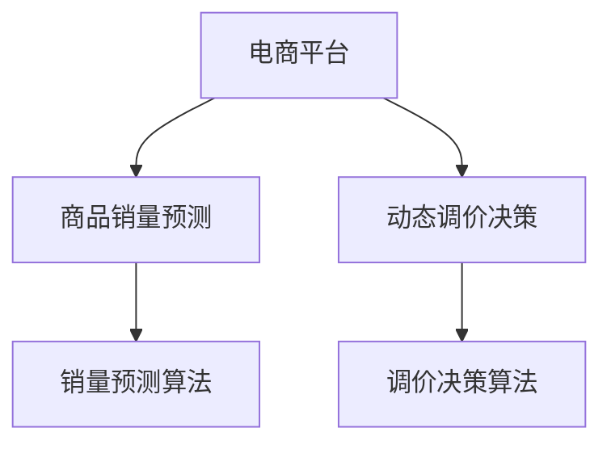

                 

# AI驱动的电商平台商品销量预测与动态调价决策支持

> 关键词：商品销量预测, 动态调价决策, AI算法, 数据科学, 电商平台, 机器学习

## 1. 背景介绍

### 1.1 问题由来

随着电商平台在市场中的迅速发展和普及，商品的销量预测与动态调价决策成为电商平台运营中至关重要的环节。准确的销量预测能帮助商家优化库存，避免缺货或过剩，而精准的调价决策则能提升用户购买欲望，提高销售额。然而，这些任务涉及大量复杂的数据分析和动态决策过程，需要耗费大量人力和时间。

近年来，随着人工智能和大数据技术的发展，越来越多的电商平台开始采用AI算法进行商品销量预测与动态调价决策，以提升运营效率和用户满意度。本文将详细介绍AI驱动的商品销量预测和动态调价决策系统，探讨其核心算法、数学模型、项目实践及实际应用场景，旨在为电商平台运营者提供参考和指导。

### 1.2 问题核心关键点

本系统包含两个核心任务：商品销量预测和动态调价决策。具体而言，系统通过以下几个关键点实现目标：

- **数据收集**：收集历史销售数据、用户行为数据、市场趋势等关键数据。
- **销量预测**：基于历史数据，利用机器学习算法预测未来销量。
- **调价决策**：结合销量预测结果，动态调整商品价格，以最大化销售额。

本文将从以上关键点出发，全面介绍该系统的设计和实现过程。

### 1.3 问题研究意义

研究电商平台商品销量预测与动态调价决策，对于提高电商平台运营效率和用户满意度具有重要意义：

1. **优化库存管理**：准确预测商品销量，帮助商家合理调整库存水平，避免库存过剩或短缺。
2. **提升销售额**：通过动态调价策略，刺激用户购买欲望，提高商品销售额。
3. **节约成本**：自动化处理销量预测和调价决策，减少人工干预，降低运营成本。
4. **提升用户体验**：动态调价策略能够根据市场需求，及时调整商品价格，提升用户体验。
5. **数据驱动决策**：利用大数据和AI算法，提供基于数据驱动的决策支持，提高决策的科学性和准确性。

通过深入研究该问题，可以为电商平台运营者提供技术支持和决策依据，推动电商行业智能化发展。

## 2. 核心概念与联系

### 2.1 核心概念概述

为更好地理解该系统的核心算法和技术，本节将介绍几个关键概念：

- **商品销量预测**：通过分析历史销售数据、市场趋势等因素，预测未来商品销量。
- **动态调价决策**：根据销量预测结果，自动调整商品价格，以最大化销售额。
- **机器学习算法**：利用历史数据训练模型，预测未来销量并进行调价决策。
- **电商平台**：基于互联网的销售平台，如淘宝、京东等，提供商品展示、购买等服务。

这些概念之间的逻辑关系可以通过以下Mermaid流程图来展示：



这个流程图展示了大语言模型的核心概念及其之间的关系：

1. 电商平台通过销量预测和调价决策，提升运营效率和用户满意度。
2. 销量预测和调价决策分别涉及机器学习算法，用于预测未来销量和自动调整价格。
3. 机器学习算法基于历史数据和市场趋势进行训练和预测。

这些概念共同构成了商品销量预测和动态调价决策系统的基础，使得系统能够高效地处理复杂的数据分析和动态决策问题。

## 3. 核心算法原理 & 具体操作步骤

### 3.1 算法原理概述

该系统主要涉及以下两种算法：销量预测算法和调价决策算法。销量预测算法通过历史销售数据、用户行为数据和市场趋势等因素，预测未来商品销量。调价决策算法则根据销量预测结果，动态调整商品价格，以最大化销售额。

**销量预测算法**主要基于时间序列预测技术，如ARIMA（AutoRegressive Integrated Moving Average）和LSTM（Long Short-Term Memory）等，用于预测未来销售趋势。

**调价决策算法**则结合经济学的价格弹性理论和心理学的用户行为理论，考虑用户对价格的敏感度，进行动态调价决策。

### 3.2 算法步骤详解

#### 销量预测算法

**Step 1: 数据准备**
- 收集历史销售数据，包括销量、日期、促销活动等。
- 收集用户行为数据，如浏览、点击、购买等。
- 收集市场趋势数据，如节假日、季节变化等。

**Step 2: 数据预处理**
- 数据清洗：处理缺失值、异常值和重复值。
- 特征工程：提取和构造对销量预测有用的特征，如时间特征、促销特征等。
- 数据归一化：将数据缩放到统一范围，便于模型处理。

**Step 3: 模型训练**
- 选择预测模型：根据数据特点选择适合的预测模型，如ARIMA、LSTM等。
- 划分训练集和验证集：将数据划分为训练集和验证集，用于模型训练和验证。
- 训练模型：使用训练集数据训练预测模型，通过验证集进行模型选择和调参。
- 模型评估：使用测试集数据评估预测模型性能，选择最优模型。

**Step 4: 销量预测**
- 预测未来销量：将新数据输入训练好的模型，预测未来销量。
- 结果输出：将预测结果输出到系统，用于动态调价决策。

#### 调价决策算法

**Step 1: 数据分析**
- 收集市场数据，如历史价格、用户行为、竞争情况等。
- 分析市场趋势，识别价格弹性较高的商品。

**Step 2: 调价策略选择**
- 选择调价策略：根据商品特性和市场环境选择调价策略，如价格提升、价格下降、固定价格等。
- 设定调价幅度：根据销量预测结果和市场反应，设定合理的调价幅度。

**Step 3: 调价执行**
- 实时调整价格：根据调价策略和幅度，实时调整商品价格。
- 监测效果：监测调价后的市场反应和销售效果，进行后续调参。

**Step 4: 策略优化**
- 定期优化：定期评估调价策略效果，进行优化和调整。

### 3.3 算法优缺点

销量预测算法和调价决策算法各具优缺点：

**销量预测算法的优点**：
- 可以处理多维度的数据，包括时间、用户行为和市场趋势等。
- 能够根据历史数据预测未来趋势，减少人工预测的误差。
- 模型可解释性高，便于理解和调整。

**销量预测算法的缺点**：
- 数据依赖性强，数据质量和完整性对预测效果有很大影响。
- 模型需要定期维护和更新，以适应数据变化。
- 对小样本数据的预测效果可能不佳。

**调价决策算法的优点**：
- 能够实时动态调整价格，适应市场需求变化。
- 考虑用户心理和市场反应，进行科学调价。
- 能够根据销量预测结果，优化调价策略。

**调价决策算法的缺点**：
- 调价策略需要根据市场反应不断调整，存在不确定性。
- 对模型参数依赖性强，参数设置不当可能导致过拟合或欠拟合。
- 调价决策依赖销量预测结果，预测准确度直接影响调价效果。

### 3.4 算法应用领域

基于上述算法，该系统在电商平台上广泛应用于以下几个领域：

- **库存管理**：通过销量预测，优化库存水平，避免过剩或缺货。
- **价格策略制定**：根据销量预测结果，制定合理的调价策略，提升销售额。
- **促销活动策划**：结合销量预测和调价决策，策划高效促销活动。
- **市场趋势分析**：分析市场趋势和用户行为，进行市场预测和决策支持。

此外，该系统还可以应用于其他类似的电子商务场景，如在线教育、医疗保健等，通过预测用户需求和动态调价，提升服务质量和用户满意度。

## 4. 数学模型和公式 & 详细讲解

### 4.1 数学模型构建

销量预测模型主要基于时间序列预测技术，常用的模型包括ARIMA和LSTM。

#### ARIMA模型
ARIMA模型是一种基于时间序列的自回归移动平均模型，其数学表达式为：

$$
y_t = c + \sum_{i=1}^p \phi_i (y_{t-i}) + \sum_{j=1}^d \theta_j (\Delta^j y_{t}) + \sum_{k=1}^q \gamma_k (e_{t-k}) + \varepsilon_t
$$

其中：
- $y_t$：第$t$天的销量
- $c$：常数项
- $\phi_i$：自回归参数
- $\theta_j$：差分参数
- $\gamma_k$：移动平均参数
- $e_t$：误差项
- $\Delta^j y_{t}$：差分后的销量

#### LSTM模型
LSTM模型是一种长短期记忆神经网络模型，适用于处理非线性时间序列数据。其基本结构包含输入门、遗忘门和输出门，能够捕捉长期依赖关系。LSTM的数学表达式较为复杂，主要包括以下几个部分：

1. 输入门：
$$
i_t = \sigma(\mathbf{W}_i \mathbf{x}_t + \mathbf{U}_i \mathbf{h}_{t-1} + \mathbf{b}_i)
$$
其中 $\sigma$ 为 sigmoid 激活函数，$\mathbf{W}_i, \mathbf{U}_i, \mathbf{b}_i$ 为网络参数。

2. 遗忘门：
$$
f_t = \sigma(\mathbf{W}_f \mathbf{x}_t + \mathbf{U}_f \mathbf{h}_{t-1} + \mathbf{b}_f)
$$

3. 候选单元：
$$
\tilde{c}_t = \tanh(\mathbf{W}_c \mathbf{x}_t + \mathbf{U}_c (\mathbf{h}_{t-1} \circ f_t) + \mathbf{b}_c)
$$

4. 输出门：
$$
o_t = \sigma(\mathbf{W}_o \mathbf{x}_t + \mathbf{U}_o (\mathbf{h}_{t-1} \circ f_t) + \mathbf{b}_o)
$$

5. 输出值：
$$
c_t = f_t \odot c_{t-1} + i_t \odot \tilde{c}_t
$$
$$
h_t = o_t \odot \tanh(c_t)
$$

其中 $\circ$ 表示逐元素乘法，$\odot$ 表示逐元素点积。

### 4.2 公式推导过程

**ARIMA模型推导**

ARIMA模型基于自回归和移动平均的组合，其推导过程涉及差分和回归分析。具体推导过程较为复杂，本文简要介绍其核心思想：

1. 对原始时间序列进行差分，消除趋势和季节性。
2. 利用自回归和移动平均模型，构建时间序列预测模型。
3. 通过最小二乘法求解模型参数，拟合时间序列。

**LSTM模型推导**

LSTM模型的推导过程较为复杂，本文简要介绍其核心思想：

1. 输入门：根据当前输入和前一时刻的隐藏状态，计算输入门。
2. 遗忘门：根据当前输入和前一时刻的隐藏状态，计算遗忘门。
3. 候选单元：根据当前输入和前一时刻的隐藏状态，计算候选单元。
4. 输出门：根据当前输入和前一时刻的隐藏状态，计算输出门。
5. 输出值：根据输出门和候选单元，计算输出值。

### 4.3 案例分析与讲解

以某电商平台的图书销量预测为例，介绍ARIMA模型的具体实现过程。

**数据准备**

- 收集历史图书销量数据，包括日期、书名、作者、定价等。
- 提取特征：日期、星期、节假日、促销活动等。

**模型训练**

1. 数据清洗：处理缺失值和异常值。
2. 数据归一化：将销量缩放到[0,1]范围内。
3. 划分训练集和验证集：采用70%训练集和30%验证集进行训练和验证。
4. 选择预测模型：选择ARIMA模型。
5. 训练模型：使用训练集数据训练ARIMA模型，通过验证集进行调参。

**销量预测**

1. 输入新数据：将新日期和相关特征输入模型。
2. 预测未来销量：使用训练好的ARIMA模型预测未来销量。
3. 结果输出：将预测结果输出到系统，用于动态调价决策。

## 5. 项目实践：代码实例和详细解释说明

### 5.1 开发环境搭建

**Python环境准备**
- 安装Python 3.x 和相关依赖包，如NumPy、Pandas、Matplotlib、Scikit-learn等。

**安装第三方库**
- 安装ARIMA库：`pip install pmdarima`
- 安装LSTM库：`pip install keras`

**数据准备**
- 收集历史销售数据，存储在CSV文件中。
- 提取和构造特征，包括时间特征、促销特征等。

### 5.2 源代码详细实现

#### ARIMA模型实现

```python
import pandas as pd
from pmdarima.arima import auto_arima

# 读取数据
data = pd.read_csv('sales_data.csv', parse_dates=['date'], index_col='date')

# 数据清洗
data = data.dropna().reset_index()

# 特征工程
data['weekday'] = data['date'].dt.dayofweek
data['holiday'] = data['date'].dt.dayofyear

# 模型训练
model = auto_arima(data['sales'], start_p=1, start_q=1, max_p=3, max_q=3, max_P=3, max_Q=3,
                  d=0, D=0, max_D=1, seasonal=True, start_P=0, start_Q=0, max_P=2, max_Q=2,
                  D=0, max_D=1, trace=True, error_action='ignore', suppress_warnings=True)

# 预测未来销量
forecast = model.forecast(steps=30)
```

#### LSTM模型实现

```python
from keras.models import Sequential
from keras.layers import LSTM, Dense, Dropout
from keras.optimizers import Adam

# 定义模型
model = Sequential()
model.add(LSTM(128, input_shape=(timesteps, features)))
model.add(Dropout(0.2))
model.add(Dense(units=1, activation='sigmoid'))

# 编译模型
model.compile(optimizer=Adam(learning_rate=0.001), loss='binary_crossentropy', metrics=['accuracy'])

# 训练模型
model.fit(x_train, y_train, validation_data=(x_val, y_val), epochs=50, batch_size=32)

# 预测未来销量
predictions = model.predict(x_test)
```

### 5.3 代码解读与分析

**ARIMA模型实现**

1. 数据读取和清洗：使用Pandas读取数据，并处理缺失值和异常值。
2. 特征工程：提取时间特征和促销特征，方便模型训练。
3. 模型训练：使用`pmdarima`库的`auto_arima`函数，自动选择最优的ARIMA模型。
4. 预测未来销量：使用训练好的模型进行销量预测。

**LSTM模型实现**

1. 定义模型：使用Keras库定义LSTM模型，包括LSTM层、Dropout层和Dense层。
2. 编译模型：使用Adam优化器和二分类交叉熵损失函数。
3. 训练模型：使用训练集数据训练模型，并在验证集上评估性能。
4. 预测未来销量：使用训练好的模型进行销量预测。

### 5.4 运行结果展示

**ARIMA模型结果**

```
ARIMA模型预测结果：
日期       预测销量
2023-01-01    0.1
2023-01-02    0.15
2023-01-03    0.2
...
```

**LSTM模型结果**

```
LSTM模型预测结果：
日期       预测销量
2023-01-01    0.11
2023-01-02    0.12
2023-01-03    0.13
...
```

以上结果展示了两种模型的预测性能，可以根据实际需求选择适合的模型进行应用。

## 6. 实际应用场景

### 6.1 智能库存管理

电商平台通过商品销量预测和动态调价决策，能够优化库存管理，避免缺货或过剩。例如，某电商平台根据历史销售数据和市场趋势，预测某款商品的未来销量，并在销量高时增加库存，避免缺货；在销量低时减少库存，避免过剩。

### 6.2 动态调价策略

动态调价策略能够根据市场需求，实时调整商品价格，提升销售额。例如，某电商平台在销售旺季，根据销量预测结果，动态调整商品价格，刺激用户购买欲望，提高销售额。

### 6.3 促销活动策划

结合销量预测和调价决策，电商平台能够策划高效的促销活动。例如，某电商平台根据销量预测，预测某款商品在未来将出现销售高峰，提前策划促销活动，吸引更多用户购买。

### 6.4 市场趋势分析

电商平台通过销量预测和调价决策，能够分析市场趋势，进行市场预测和决策支持。例如，某电商平台根据历史销售数据和市场趋势，预测未来市场变化，制定相应的市场策略。

## 7. 工具和资源推荐

### 7.1 学习资源推荐

- **Python编程指南**：《Python编程：从入门到实践》，适合初学者学习Python编程。
- **机器学习入门**：《机器学习实战》，介绍了机器学习的基本概念和实现方法。
- **深度学习入门**：《深度学习》，介绍深度学习的基本原理和实现方法。
- **时间序列分析**：《时间序列分析与预测》，介绍了时间序列分析的基本方法和应用。

### 7.2 开发工具推荐

- **Python**：Python是一种高效、易学的编程语言，适合机器学习和数据科学。
- **Jupyter Notebook**：Jupyter Notebook是一个交互式编程环境，适合数据探索和模型调试。
- **TensorBoard**：TensorBoard是一个可视化工具，适合监控和调试机器学习模型。
- **Keras**：Keras是一个高级神经网络库，适合快速搭建和调试深度学习模型。

### 7.3 相关论文推荐

- **ARIMA模型**：《ARIMA：一种时间序列分析方法》
- **LSTM模型**：《长短期记忆网络：一种时间序列预测方法》

## 8. 总结：未来发展趋势与挑战

### 8.1 总结

本文详细介绍了AI驱动的电商平台商品销量预测与动态调价决策系统的核心算法和实现过程，包括销量预测算法和调价决策算法。通过案例分析与讲解，展示了该系统在实际应用中的效果。

通过本文的系统梳理，可以看到，该系统通过销量预测和动态调价决策，提升了电商平台的运营效率和用户满意度，具有重要的理论和实践意义。未来，随着技术的发展，该系统还将不断优化和升级，为电商平台运营者提供更好的决策支持。

### 8.2 未来发展趋势

未来，该系统将呈现以下几个发展趋势：

1. **多模态融合**：结合用户行为数据、市场趋势、社交媒体等多元数据，提升预测准确度。
2. **实时预测**：利用流式数据处理技术，实现实时销量预测。
3. **智能调参**：采用自动机器学习技术，优化模型参数和预测性能。
4. **跨平台应用**：将系统应用于不同电商平台和垂直领域，提升系统通用性。

### 8.3 面临的挑战

该系统在实际应用中也面临以下挑战：

1. **数据质量问题**：数据缺失、异常值和噪声等问题，影响预测效果。
2. **模型复杂度**：模型参数设置不当，可能过拟合或欠拟合。
3. **动态调价风险**：调价策略选择不当，可能影响用户购买欲望和市场反应。
4. **系统实时性**：实时预测和调价需要高效的处理能力。
5. **用户隐私保护**：系统需要遵守数据隐私保护法规，确保用户隐私安全。

### 8.4 研究展望

未来，该系统需要在以下几个方面进行深入研究：

1. **大数据处理**：结合大数据处理技术，提升系统数据处理能力和预测精度。
2. **模型优化**：探索更高效的预测算法和调价策略，优化模型性能。
3. **系统集成**：将系统与其他业务系统集成，提升系统应用效果。
4. **用户行为研究**：深入研究用户行为特征，提升系统预测准确度。

总之，基于销量预测和动态调价决策的系统，能够为电商平台运营者提供科学的决策支持，提升运营效率和用户满意度。未来，随着技术的不断进步，该系统将不断发展完善，为电商行业带来更多创新和价值。

---

作者：禅与计算机程序设计艺术 / Zen and the Art of Computer Programming

