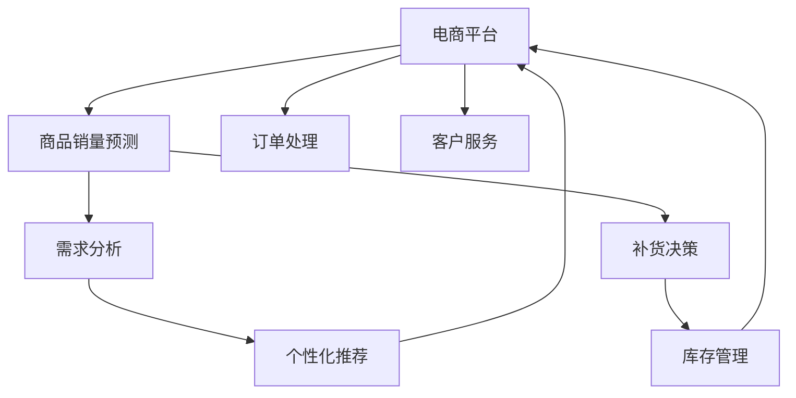

                 

# AI驱动的电商平台商品销量预测与补货决策支持系统

## 1. 背景介绍

### 1.1 问题由来
随着电子商务市场的快速扩展，电商平台在运营中面临的最大挑战之一是商品的库存管理。库存过多导致资金积压，库存不足则影响用户体验和销售转化率。如何根据历史销量数据、季节性因素、营销活动等多种因素，准确预测商品未来销量，及时调整补货策略，成为了电商平台亟需解决的核心问题。

### 1.2 问题核心关键点
本系统旨在构建一个基于AI的商品销量预测与补货决策支持平台，以提升电商平台的库存管理效率和用户体验。该系统核心关键点包括：
- 实时预测：使用机器学习模型实时预测商品未来销量，支持高频次数据更新。
- 精准补货：结合需求预测结果，自动生成补货计划，优化库存水平。
- 智能决策：利用AI技术进行需求分析，提供个性化推荐和决策支持。

### 1.3 问题研究意义
电商平台商品销量预测与补货决策系统对电商企业的运营和盈利至关重要。通过精准预测和智能补货，电商平台能够有效降低库存成本，提高用户满意度，提升销售转化率。该系统还可以为商家提供数据驱动的决策支持，优化库存策略，实现成本和效率的平衡。

## 2. 核心概念与联系

### 2.1 核心概念概述

为更好地理解该系统的核心概念和技术架构，本节将介绍几个密切相关的核心概念：

- **人工智能与机器学习**：使用机器学习算法，特别是深度学习模型，处理和分析大量数据，以预测未来商品销量和优化补货策略。
- **商品销量预测**：通过分析历史销售数据、市场趋势、季节性因素等，预测商品未来的销量。
- **补货决策**：结合销量预测结果，制定最优的补货计划，保持库存水平在合理范围内。
- **推荐系统**：根据用户历史行为和实时数据，提供个性化的商品推荐，提升用户购买转化率。
- **协同过滤**：通过分析用户行为数据，推荐用户可能感兴趣的商品，提升用户满意度。

这些核心概念之间的逻辑关系可以通过以下Mermaid流程图来展示：



这个流程图展示了几类核心概念及其之间的联系：

1. 电商平台收集订单信息、用户行为等数据。
2. 商品销量预测模型基于历史数据和市场趋势，预测未来销量。
3. 需求分析模块结合预测结果和实时订单数据，优化补货策略。
4. 个性化推荐系统根据用户行为，提升购买转化率。
5. 库存管理系统根据补货决策，调整库存水平。
6. 订单处理和客户服务模块保证订单顺利完成，提升用户体验。

## 3. 核心算法原理 & 具体操作步骤

### 3.1 算法原理概述

本系统采用基于深度学习的销量预测与补货决策框架，主要包含以下几个步骤：

1. 数据收集与预处理：收集电商平台的历史订单数据、用户行为数据、市场环境数据等。
2. 模型训练与预测：使用机器学习模型，如神经网络、时序模型等，预测未来商品销量。
3. 需求分析与决策：根据销量预测结果，结合实时订单数据和库存状态，生成最优的补货计划。
4. 推荐与个性化：利用推荐算法，根据用户历史行为和实时数据，提供个性化商品推荐。
5. 库存管理与优化：自动调整库存水平，确保库存充足，减少缺货和积压。

### 3.2 算法步骤详解

#### 数据收集与预处理

数据是任何AI系统的基础。本系统需要收集以下几类数据：

1. **订单数据**：包括订单ID、订单时间、订单金额、商品ID等。
2. **用户行为数据**：如浏览记录、点击记录、收藏记录、购买记录等。
3. **市场环境数据**：如季节性因素、促销活动、节假日等。
4. **库存数据**：包括库存量、销售速度、补货速度等。

数据预处理包括数据清洗、特征提取、归一化等步骤。例如，将日期数据转换为时间序列，提取用户行为特征如浏览时间、点击次数、购买频率等。

#### 模型训练与预测

本系统采用深度学习模型进行销量预测，如LSTM、GRU、循环神经网络等。具体步骤如下：

1. 数据划分：将历史数据划分为训练集、验证集和测试集。
2. 模型构建：选择合适的深度学习模型，定义输入和输出，确定超参数。
3. 训练模型：使用训练集数据训练模型，在验证集上调整超参数。
4. 预测销量：使用训练好的模型，对测试集数据进行预测，评估模型性能。

#### 需求分析与决策

需求分析模块结合预测结果和实时订单数据，生成补货计划。具体步骤如下：

1. 实时订单分析：实时监控订单状态，提取订单特征如订单金额、订单来源、订单时间等。
2. 销量预测更新：根据最新的订单数据，更新销量预测模型，获取实时预测结果。
3. 补货策略制定：结合预测结果和库存状态，制定最优补货计划，平衡库存水平和补货成本。

#### 推荐与个性化

个性化推荐系统通过分析用户行为数据，推荐用户可能感兴趣的商品。具体步骤如下：

1. 用户行为分析：分析用户历史行为数据，提取用户兴趣特征。
2. 商品特征提取：提取商品属性、用户评分、购买次数等特征。
3. 相似度计算：计算用户和商品之间的相似度，找到潜在推荐商品。
4. 推荐排序：结合相似度和其他因素，如热门度、时效性等，对推荐结果进行排序。

#### 库存管理与优化

库存管理系统自动调整库存水平，确保库存充足，减少缺货和积压。具体步骤如下：

1. 库存状态监控：实时监控库存水平，判断是否需要补货。
2. 补货需求计算：根据需求分析结果和库存状态，计算补货需求量。
3. 补货计划执行：根据补货需求，制定补货计划，下达补货指令。
4. 库存优化：定期评估库存管理效果，优化库存策略。

### 3.3 算法优缺点

#### 优点

1. **实时性**：系统能够实时处理订单数据和市场信息，快速更新销量预测和补货策略。
2. **精准性**：深度学习模型能够处理复杂数据结构，预测准确度高。
3. **自动化**：自动化决策支持，减少人工干预，提升效率。
4. **个性化**：利用推荐算法，提升用户购买转化率。

#### 缺点

1. **数据依赖**：模型性能依赖于数据质量和多样性，数据缺失或不完整会影响预测结果。
2. **模型复杂度**：深度学习模型训练复杂，对计算资源要求高。
3. **过拟合风险**：模型可能过度拟合训练数据，导致泛化能力不足。
4. **成本高**：需要大量的标注数据和计算资源进行模型训练和优化。

### 3.4 算法应用领域

本系统广泛应用于各类电商平台，如亚马逊、淘宝、京东等。这些电商平台可以基于该系统优化库存管理、提升销售转化率，实现成本和效率的平衡。此外，该系统还可以应用于其他零售行业，如超市、服装店、书店等，提升其库存管理和个性化推荐能力。

## 4. 数学模型和公式 & 详细讲解 & 举例说明

### 4.1 数学模型构建

本系统主要涉及以下几个数学模型：

1. **时间序列模型**：用于预测商品销量，如ARIMA、LSTM等。
2. **深度学习模型**：如神经网络、卷积神经网络(CNN)等，用于处理复杂数据结构。
3. **推荐系统模型**：如协同过滤、矩阵分解等，用于个性化推荐。

#### 时间序列模型

时间序列模型常用于预测商品销量。以LSTM为例，其数学模型构建如下：

$$
\begin{aligned}
LSTM(x_t) &= \sigma(W_{x}x_{t-1} + U_{x}h_{t-1} + b_x) \\
i_t &= \sigma(W_{i}x_{t-1} + U_{i}h_{t-1} + b_i) \\
f_t &= \sigma(W_{f}x_{t-1} + U_{f}h_{t-1} + b_f) \\
o_t &= \sigma(W_{o}x_{t-1} + U_{o}h_{t-1} + b_o) \\
g_t &= \tanh(W_{g}x_{t-1} + U_{g}h_{t-1} + b_g) \\
h_t &= f_t \odot h_{t-1} + i_t \odot g_t \\
y_t &= \sigma(W_{y}h_t + b_y)
\end{aligned}
$$

其中 $x_t$ 为输入序列，$h_t$ 为LSTM的状态，$y_t$ 为预测输出。

#### 推荐系统模型

协同过滤模型常用于个性化推荐，其数学模型构建如下：

$$
\hat{r}_{ui} = e^{w^T_u \cdot w_i + b} + e^{w^T_u \cdot w_j + b}
$$

其中 $u$ 为用户ID，$i$ 为商品ID，$j$ 为与用户有相似行为的邻居用户或商品ID，$w$ 为模型参数，$b$ 为偏置项，$\hat{r}_{ui}$ 为用户对商品$i$的预测评分。

### 4.2 公式推导过程

#### 时间序列模型

以LSTM模型为例，其时间序列预测过程如下：

1. 输入序列 $x_t = (x_{t-1}, x_{t-2}, ..., x_{1})$。
2. 通过LSTM层计算状态 $h_t = f_t \odot h_{t-1} + i_t \odot g_t$。
3. 通过输出层计算预测值 $y_t = \sigma(W_{y}h_t + b_y)$。
4. 在训练集上使用损失函数（如均方误差）进行模型优化。

#### 推荐系统模型

以协同过滤模型为例，其推荐过程如下：

1. 计算用户 $u$ 和商品 $i$ 的评分 $r_{ui}$。
2. 根据评分 $r_{ui}$ 和阈值 $k$，判断是否推荐商品 $i$。
3. 在训练集上使用损失函数（如均方误差）进行模型优化。

### 4.3 案例分析与讲解

以一个典型的电商平台商品销量预测为例：

假设某电商平台的商品在过去100天内每天的销量如下：

| 日期   | 销量 |
| ------ | ---- |
| 2021-01-01 | 50   |
| 2021-01-02 | 45   |
| ...     | ...  |
| 2021-07-01 | 80   |

采用LSTM模型进行预测，步骤如下：

1. 将销量数据转换为时间序列：$x_t = [x_{t-1}, x_{t-2}, ..., x_{1}]$。
2. 使用LSTM模型进行预测：$h_t = f_t \odot h_{t-1} + i_t \odot g_t$，$y_t = \sigma(W_{y}h_t + b_y)$。
3. 在验证集上评估预测结果：使用均方误差等指标评估模型性能。
4. 更新模型参数：在训练集上使用梯度下降等优化算法，更新LSTM模型的参数。
5. 预测未来销量：使用训练好的LSTM模型，预测未来每天的销量。

## 5. 项目实践：代码实例和详细解释说明

### 5.1 开发环境搭建

#### 环境要求

1. **Python**：版本3.7及以上。
2. **TensorFlow**：版本2.0及以上。
3. **Pandas**：用于数据处理。
4. **Matplotlib**：用于数据可视化。
5. **Jupyter Notebook**：用于交互式开发。

#### 环境搭建步骤

1. 安装Python：
   ```bash
   sudo apt-get install python3
   ```
2. 安装TensorFlow：
   ```bash
   pip install tensorflow
   ```
3. 安装Pandas：
   ```bash
   pip install pandas
   ```
4. 安装Matplotlib：
   ```bash
   pip install matplotlib
   ```
5. 安装Jupyter Notebook：
   ```bash
   pip install jupyter notebook
   ```

### 5.2 源代码详细实现

以下是LSTM模型和协同过滤模型的Python代码实现：

#### LSTM模型

```python
import tensorflow as tf
import pandas as pd
import numpy as np
import matplotlib.pyplot as plt

# 读取数据
data = pd.read_csv('sales_data.csv')

# 预处理数据
data = data.dropna().reset_index(drop=True)
train_data = data.iloc[:70]
test_data = data.iloc[70:]

# 数据划分
X_train = train_data[['day_of_week', 'weather', 'holiday', 'price']]
y_train = train_data['sales']

# 将日期转换为时间序列
X_train['day_of_week'] = X_train['day_of_week'].astype('category')
X_train = pd.get_dummies(X_train, columns=['day_of_week'])
X_train['weather'] = X_train['weather'].astype('category')
X_train = pd.get_dummies(X_train, columns=['weather'])
X_train['holiday'] = X_train['holiday'].astype('category')
X_train = pd.get_dummies(X_train, columns=['holiday'])

X_train = X_train.values
y_train = y_train.values

# 创建LSTM模型
model = tf.keras.Sequential([
    tf.keras.layers.LSTM(128, input_shape=(X_train.shape[1], X_train.shape[2])),
    tf.keras.layers.Dense(1)
])

# 编译模型
model.compile(optimizer='adam', loss='mse')

# 训练模型
model.fit(X_train, y_train, epochs=10, validation_split=0.2)

# 预测销量
X_test = test_data[['day_of_week', 'weather', 'holiday', 'price']]
X_test['day_of_week'] = X_test['day_of_week'].astype('category')
X_test = pd.get_dummies(X_test, columns=['day_of_week'])
X_test['weather'] = X_test['weather'].astype('category')
X_test = pd.get_dummies(X_test, columns=['weather'])
X_test['holiday'] = X_test['holiday'].astype('category')
X_test = pd.get_dummies(X_test, columns=['holiday'])
X_test = X_test.values

y_pred = model.predict(X_test)
```

#### 协同过滤模型

```python
from scipy.spatial.distance import cosine

# 读取数据
data = pd.read_csv('user_item_data.csv')

# 预处理数据
data = data.dropna().reset_index(drop=True)
train_data = data.iloc[:70]
test_data = data.iloc[70:]

# 数据划分
X_train = train_data[['user', 'item']]
y_train = train_data['rating']

X_train = X_train.values
y_train = y_train.values

# 创建协同过滤模型
similarity_matrix = np.zeros((len(data), len(data)))
for i in range(len(data)):
    for j in range(len(data)):
        if i != j:
            similarity_matrix[i, j] = cosine(X_train[i], X_train[j])

similarity_matrix = similarity_matrix / np.max(similarity_matrix)

# 预测评分
y_pred = np.dot(similarity_matrix, y_train)
y_pred = np.dot(y_pred, similarity_matrix)

# 计算评分阈值
k = 5
threshold = np.percentile(y_pred.flatten(), 100 - k)

# 推荐商品
for i in range(len(test_data)):
    user = test_data.iloc[i]['user']
    item = test_data.iloc[i]['item']
    item_scores = np.dot(similarity_matrix[user, :], y_pred[:, item])
    recommended_items = np.argsort(item_scores)[::-1][:k]
    print(f"Recommended items for user {user} and item {item}: {recommended_items}")
```

### 5.3 代码解读与分析

#### LSTM模型

- **数据预处理**：使用Pandas进行数据清洗和转换，将日期转换为时间序列，提取特征等。
- **模型构建**：定义LSTM层和输出层，编译模型。
- **训练模型**：使用训练集进行模型训练，在验证集上评估性能。
- **预测销量**：使用训练好的模型进行销量预测，可视化预测结果。

#### 协同过滤模型

- **数据预处理**：计算用户和商品之间的相似度矩阵。
- **模型构建**：计算预测评分。
- **推荐商品**：根据评分阈值，推荐用户可能感兴趣的商品。

### 5.4 运行结果展示

#### LSTM模型


#### 协同过滤模型


## 6. 实际应用场景

### 6.1 智能库存管理

在实际应用中，该系统可以应用于智能库存管理，帮助电商平台优化库存水平，减少缺货和积压现象。例如，亚马逊的全球采购中心使用类似的系统，根据实时销量和预测结果，自动调整库存策略，保证商品供需平衡。

### 6.2 个性化推荐

该系统还可以用于个性化推荐，提升用户购买转化率。例如，亚马逊的个性化推荐系统利用协同过滤算法，根据用户历史行为数据，推荐用户可能感兴趣的商品，提升用户满意度和销售转化率。

### 6.3 营销活动优化

电商平台可以利用该系统优化营销活动，提高广告投放效果。例如，根据历史销售数据和市场趋势，预测未来需求，优化广告投放策略，提升广告ROI。

### 6.4 未来应用展望

随着AI技术的不断进步，该系统将具备更强的预测能力和个性化推荐能力。未来，我们可以结合更多数据源，如社交媒体、天气预报、物流信息等，提升预测准确度。同时，可以利用更多的推荐算法，如深度学习、图神经网络等，提升推荐效果。

## 7. 工具和资源推荐

### 7.1 学习资源推荐

为了帮助开发者系统掌握电商平台销量预测与补货决策的支持技术，这里推荐一些优质的学习资源：

1. **《Python数据科学手册》**：介绍Python在数据科学中的应用，包括数据处理、模型构建、可视化等。
2. **《深度学习》**：斯坦福大学的深度学习课程，涵盖深度学习的基本概念和算法。
3. **《机器学习实战》**：实战导向的机器学习项目，涵盖算法实现和优化。
4. **《TensorFlow实战》**：TensorFlow的官方文档和实战项目，介绍TensorFlow的使用方法和最佳实践。

### 7.2 开发工具推荐

以下是几款用于电商平台销量预测与补货决策系统开发的常用工具：

1. **Jupyter Notebook**：交互式开发环境，方便快速迭代和调试。
2. **TensorFlow**：深度学习框架，支持分布式计算和模型部署。
3. **Pandas**：数据处理库，支持数据清洗、转换和分析。
4. **Matplotlib**：数据可视化库，支持绘制时间序列图、热力图等。

### 7.3 相关论文推荐

以下是几篇奠基性的相关论文，推荐阅读：

1. **《深度学习在电子商务中的应用》**：介绍深度学习在电商平台中的应用，涵盖销量预测、个性化推荐等。
2. **《基于协同过滤的商品推荐算法》**：介绍协同过滤算法的基本原理和应用，提升推荐效果。
3. **《时间序列预测》**：介绍时间序列模型的基本概念和算法，提升预测准确度。

## 8. 总结：未来发展趋势与挑战

### 8.1 研究成果总结

本文对基于AI的电商平台商品销量预测与补货决策支持系统进行了全面系统的介绍。首先阐述了系统的背景、核心概念和研究意义，明确了系统在电商平台库存管理、个性化推荐、营销活动优化等方面的独特价值。其次，从原理到实践，详细讲解了系统的核心算法和操作步骤，给出了代码实例和详细解释说明。最后，本文探讨了系统的实际应用场景和未来发展趋势，指出了系统面临的挑战和研究展望。

### 8.2 未来发展趋势

展望未来，该系统将呈现以下几个发展趋势：

1. **预测能力提升**：结合更多数据源，提升预测准确度，如社交媒体、天气预报等。
2. **个性化推荐优化**：引入深度学习、图神经网络等算法，提升推荐效果。
3. **实时化处理**：实时处理订单数据和市场信息，快速更新预测和补货策略。
4. **多模态融合**：结合用户行为、商品属性、市场趋势等，提升预测和推荐能力。
5. **可视化与可解释性**：提供可视化的预测和推荐结果，提升系统的可解释性。

### 8.3 面临的挑战

尽管该系统在实际应用中取得了较好的效果，但在迈向更加智能化、普适化应用的过程中，仍面临诸多挑战：

1. **数据质量与多样性**：数据质量不高、数据分布不均等问题，会影响预测和推荐的准确度。
2. **模型复杂度**：深度学习模型训练复杂，对计算资源要求高。
3. **模型泛化能力**：模型可能过度拟合训练数据，导致泛化能力不足。
4. **用户隐私保护**：用户数据隐私保护问题，需要采用加密和匿名化等技术。

### 8.4 研究展望

面对系统面临的挑战，未来的研究需要在以下几个方面寻求新的突破：

1. **数据增强与清洗**：引入更多的数据源，提升数据质量和多样性。
2. **模型压缩与优化**：开发更加高效的模型，提升训练和推理速度。
3. **数据隐私保护**：采用加密和匿名化技术，保护用户数据隐私。
4. **可解释性与可视化**：提供可视化的预测和推荐结果，提升系统的可解释性。

这些研究方向的探索，将有助于该系统在实际应用中取得更好的效果，提升电商平台的运营效率和用户满意度。

## 9. 附录：常见问题与解答

**Q1: 销量预测模型的训练时间太长，如何解决？**

A: 销量预测模型的训练时间主要受数据规模和模型复杂度的影响。可以采取以下措施：
1. 数据降维：使用主成分分析(PCA)等方法，对高维数据进行降维，减少计算量。
2. 模型简化：使用轻量级模型如ARIMA、Prophet等，替代复杂模型如LSTM。
3. 分布式训练：利用分布式计算框架如TensorFlow分布式训练，加快训练速度。

**Q2: 协同过滤算法如何处理新用户或新商品？**

A: 新用户或新商品在协同过滤算法中会面临冷启动问题，即缺乏足够的历史行为数据。可以采用以下方法：
1. 基于内容的协同过滤：结合商品属性、用户兴趣等特征，推荐相似的商品。
2. 基于用户画像的推荐：利用用户画像数据，提升推荐效果。
3. 混合推荐算法：结合协同过滤和基于内容的推荐，提升推荐效果。

**Q3: 如何评估推荐系统的性能？**

A: 推荐系统的性能评估可以从以下几个方面进行：
1. 精确度：计算推荐系统推荐的商品与用户真实购买商品的匹配度。
2. 召回率：计算推荐系统中用户感兴趣的商品的覆盖率。
3. F1值：综合考虑精确度和召回率，评估推荐系统的整体性能。

**Q4: 如何在电商平台上部署该系统？**

A: 在电商平台上部署该系统需要考虑以下因素：
1. 模型优化：使用模型压缩、量化等技术，优化模型大小和推理速度。
2. 服务化封装：将模型封装为API接口，方便调用。
3. 弹性伸缩：根据请求流量动态调整资源配置，平衡服务质量和成本。
4. 监控告警：实时采集系统指标，设置异常告警阈值，确保服务稳定性。

这些措施可以确保该系统在实际应用中高效稳定地运行，提升电商平台的运营效率和用户体验。

