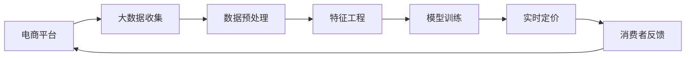

                 

# AI驱动的电商平台智能定价系统设计

## 1. 背景介绍

随着电子商务的快速发展，电商平台需要更高效、更智能的定价策略来提升销售效率和客户满意度。传统的定价方法如成本加成、市场定价等已无法满足日益复杂多变的市场环境。AI技术的兴起为电商平台提供了新的可能性：基于大数据和机器学习技术构建智能定价系统，利用算法预测市场需求，动态调整商品价格，实现更精准的定价决策。本文将详细介绍AI驱动的电商平台智能定价系统设计，包括系统架构、核心算法原理、具体操作步骤以及实际应用场景，为电商行业提供一套可行的智能定价解决方案。

## 2. 核心概念与联系

### 2.1 核心概念概述

在本节中，我们将首先介绍智能定价系统涉及的关键概念及其相互联系。

- **电商平台**：指通过互联网提供商品和服务交易的在线平台，包括B2B和B2C两种主要模式。
- **智能定价**：指利用人工智能技术预测市场需求、竞争对手定价、消费者行为等，动态调整商品价格，实现更优的销售效果和客户满意度。
- **大数据**：指在电商平台运营过程中产生的海量数据，包括用户行为、交易记录、市场分析、竞争对手信息等。
- **机器学习**：指通过训练算法模型，从大量数据中学习并提取规律，用于预测、分类、聚类等任务。
- **深度学习**：指利用多层神经网络模型处理非线性复杂任务，如图像识别、自然语言处理等。
- **强化学习**：指通过试错反馈，使智能体学习最优策略，应用于推荐系统、游戏AI等。
- **实时定价**：指根据实时市场需求和消费者行为动态调整商品价格，最大化销售收益。

这些概念之间存在密切联系，通过大数据、机器学习和深度学习技术，电商平台可以构建智能定价系统，利用强化学习优化实时定价策略，提升整体运营效率。

### 2.2 核心概念原理和架构的 Mermaid 流程图



## 3. 核心算法原理 & 具体操作步骤

### 3.1 算法原理概述

AI驱动的电商平台智能定价系统设计基于多个核心算法，包括机器学习、深度学习和强化学习。该系统通过以下步骤实现智能定价：

1. **数据收集与预处理**：收集电商平台交易数据、用户行为数据、市场分析数据等，进行数据清洗、特征提取等预处理操作。
2. **特征工程**：利用数据挖掘和统计方法，提取与定价相关的特征，如用户历史购买记录、商品类别、时序特征等。
3. **模型训练**：基于预处理后的数据，训练预测模型和定价模型，用于预测商品需求和最优定价策略。
4. **实时定价**：根据预测结果和实时市场需求，动态调整商品价格。
5. **反馈调整**：收集消费者反馈数据，优化模型和定价策略，实现自适应学习。

### 3.2 算法步骤详解

以下将详细介绍每个步骤的详细操作步骤：

#### 3.2.1 数据收集与预处理

**数据收集**：
1. **交易数据**：包括订单信息、支付信息、物流信息等，用于分析用户购买行为和商品销售情况。
2. **用户行为数据**：如浏览历史、搜索记录、评价反馈等，用于了解用户偏好和需求变化。
3. **市场分析数据**：如竞争对手定价、市场趋势、促销活动等，用于判断市场环境和竞争对手策略。
4. **外部数据**：如气象信息、节假日、社会事件等，用于捕捉外部环境对销售的影响。

**数据预处理**：
1. **清洗**：去除缺失、重复、异常值等数据。
2. **归一化**：将数据缩放到指定范围，便于后续处理。
3. **特征工程**：提取、选择和构造与定价相关的特征，如用户ID、商品ID、价格区间、时间戳等。

#### 3.2.2 特征工程

**特征选择**：
1. **相关性分析**：通过统计分析和机器学习算法，选择与定价高度相关的特征。
2. **维度降低**：使用PCA、LDA等降维方法，减少特征维度，提升模型训练效率。

**特征构造**：
1. **交叉特征**：构造特征的组合，如用户ID与商品ID的交叉。
2. **时序特征**：考虑时间因素，如订单时间、季节性特征等。
3. **统计特征**：计算特征的统计量，如均值、方差、分布等。

#### 3.2.3 模型训练

**预测模型**：
1. **回归模型**：如线性回归、决策树回归、随机森林回归等，用于预测商品需求量。
2. **时间序列模型**：如ARIMA、LSTM等，用于预测时间序列数据。
3. **深度学习模型**：如神经网络、卷积神经网络等，用于复杂非线性关系的建模。

**定价模型**：
1. **线性定价模型**：如线性回归、逻辑回归等，用于建立价格与销量之间的关系。
2. **神经网络定价模型**：如多层感知器、深度神经网络等，用于处理复杂定价决策。
3. **强化学习定价模型**：如Q-learning、Deep Q-Network等，用于优化实时定价策略。

**训练流程**：
1. **数据划分**：将数据划分为训练集、验证集和测试集。
2. **模型选择**：选择适合的机器学习、深度学习或强化学习模型。
3. **参数调优**：使用交叉验证等方法，调整模型超参数，如学习率、正则化强度等。
4. **模型评估**：在验证集上评估模型性能，选择合适的模型进行下一步优化。
5. **模型部署**：将训练好的模型部署到生产环境中，用于实时定价决策。

#### 3.2.4 实时定价

**实时数据采集**：
1. **实时订单数据**：从订单系统实时采集订单信息。
2. **实时市场数据**：从市场分析系统获取市场趋势、竞争对手定价等数据。
3. **实时用户数据**：从用户行为系统获取实时用户行为数据。

**实时定价决策**：
1. **需求预测**：使用预测模型，实时预测商品需求量。
2. **价格优化**：根据预测结果，使用定价模型调整商品价格。
3. **规则策略**：应用规则引擎，实现更加灵活的定价策略，如促销活动、库存管理等。

#### 3.2.5 反馈调整

**反馈数据收集**：
1. **订单数据**：从订单系统收集订单信息和消费者反馈。
2. **用户行为数据**：从用户行为系统收集用户评价、评分等数据。
3. **市场数据**：从市场分析系统收集市场趋势和竞争对手策略。

**模型优化**：
1. **数据重采样**：使用重采样技术，提高数据集质量。
2. **模型更新**：根据反馈数据，调整模型参数和结构，优化预测和定价结果。
3. **策略调整**：根据反馈数据，调整定价策略，提高用户满意度和销售收益。

### 3.3 算法优缺点

智能定价系统具有以下优点：
1. **高效性**：利用机器学习和深度学习技术，提升定价决策的速度和准确性。
2. **灵活性**：通过实时数据和反馈调整，实现动态定价策略，适应市场变化。
3. **可扩展性**：可应用于不同类型的电商平台和商品，具备通用性。
4. **用户满意度**：通过优化定价策略，提升用户体验和满意度。

同时，该系统也存在一些缺点：
1. **数据依赖性**：依赖大量的高质量数据进行训练，数据获取成本较高。
2. **模型复杂性**：需要复杂算法模型和大量计算资源，维护成本较高。
3. **实时性要求高**：需要实时数据处理和快速决策，对系统架构和数据处理能力要求较高。
4. **安全性风险**：处理大量用户数据，需要严格的数据安全和隐私保护措施。

### 3.4 算法应用领域

智能定价系统已经在多个电商平台得到了应用，以下是一些典型的应用场景：

1. **B2C电商平台**：如Amazon、京东、淘宝等，通过智能定价系统优化商品价格，提升销售收益和用户体验。
2. **B2B电商平台**：如Alibaba、1688等，通过智能定价系统优化供应商管理，提升供应链效率。
3. **新兴电商平台**：如拼多多的社交电商模式，通过智能定价系统优化价格策略，扩大市场份额。
4. **跨境电商平台**：如Shopify、eBay等，通过智能定价系统优化全球市场定价，提升国际竞争力。

## 4. 数学模型和公式 & 详细讲解 & 举例说明

### 4.1 数学模型构建

在智能定价系统中，数学模型主要分为预测模型和定价模型。下面我们将详细介绍这些模型的构建方法。

**预测模型**：
1. **线性回归模型**：用于预测商品需求量，公式为：
   $$
   y = \theta_0 + \sum_{i=1}^n \theta_i x_i
   $$
   其中，$y$ 为预测值，$x_i$ 为输入特征，$\theta_i$ 为回归系数。

2. **时间序列模型**：如ARIMA模型，用于预测时间序列数据，公式为：
   $$
   y(t) = \sum_{i=1}^p \alpha_i y(t-i) + \sum_{j=1}^d \beta_j \Delta^j y(t) + \sum_{k=1}^K \gamma_k \varepsilon_{kt}
   $$
   其中，$y(t)$ 为预测值，$y(t-i)$ 为滞后值，$\Delta^j y(t)$ 为差分值，$\varepsilon_{kt}$ 为白噪声。

3. **深度学习模型**：如多层感知器，用于处理复杂非线性关系的建模，公式为：
   $$
   \hat{y} = f(\sum_{i=1}^n \theta_i x_i + \theta_0)
   $$
   其中，$\hat{y}$ 为预测值，$f$ 为激活函数，$\theta_i$ 为权重，$\theta_0$ 为偏置。

**定价模型**：
1. **线性定价模型**：用于建立价格与销量之间的关系，公式为：
   $$
   p = \theta_0 + \sum_{i=1}^n \theta_i x_i
   $$
   其中，$p$ 为价格，$x_i$ 为输入特征，$\theta_i$ 为回归系数。

2. **神经网络定价模型**：如多层感知器，用于处理复杂定价决策，公式为：
   $$
   \hat{p} = f(\sum_{i=1}^n \theta_i x_i + \theta_0)
   $$
   其中，$\hat{p}$ 为预测价格，$f$ 为激活函数，$\theta_i$ 为权重，$\theta_0$ 为偏置。

3. **强化学习定价模型**：如Q-learning，用于优化实时定价策略，公式为：
   $$
   Q(s,a) \leftarrow (1-\alpha) Q(s,a) + \alpha (r + \gamma \max Q(s',a'))
   $$
   其中，$Q(s,a)$ 为状态-动作值函数，$s$ 为状态，$a$ 为动作，$\alpha$ 为学习率，$r$ 为奖励，$s'$ 为下一个状态，$a'$ 为下一个动作，$\gamma$ 为折扣因子。

### 4.2 公式推导过程

以下我们将详细推导几个关键数学模型的公式。

**线性回归模型**：
1. **代价函数**：预测误差平方和，公式为：
   $$
   J(\theta) = \frac{1}{2m} \sum_{i=1}^m (h_\theta(x^{(i)}) - y^{(i)})^2
   $$
   其中，$h_\theta(x)$ 为线性回归模型，$y^{(i)}$ 为真实标签。

2. **梯度下降**：求代价函数的梯度，公式为：
   $$
   \frac{\partial J(\theta)}{\partial \theta_i} = \frac{1}{m} \sum_{i=1}^m (h_\theta(x^{(i)}) - y^{(i)}) x_i
   $$
   其中，$h_\theta(x)$ 为线性回归模型，$x_i$ 为输入特征，$y^{(i)}$ 为真实标签。

**时间序列模型**：
1. **ARIMA模型**：包括自回归模型、差分模型和移动平均模型，公式为：
   $$
   y(t) = \sum_{i=1}^p \alpha_i y(t-i) + \sum_{j=1}^d \beta_j \Delta^j y(t) + \sum_{k=1}^K \gamma_k \varepsilon_{kt}
   $$
   其中，$y(t)$ 为预测值，$y(t-i)$ 为滞后值，$\Delta^j y(t)$ 为差分值，$\varepsilon_{kt}$ 为白噪声，$\alpha_i$ 和 $\beta_j$ 为模型参数。

**深度学习模型**：
1. **多层感知器**：包括输入层、隐藏层和输出层，公式为：
   $$
   a_1 = g_1(\sum_{i=1}^n \theta_{1i} x_i + \theta_{10})
   $$
   $$
   a_2 = g_2(\sum_{i=1}^n \theta_{2i} a_1 + \theta_{20})
   $$
   $$
   \hat{y} = g_3(\sum_{i=1}^n \theta_{3i} a_2 + \theta_{30})
   $$
   其中，$a_1$、$a_2$ 和 $\hat{y}$ 为隐藏层和输出层的激活值，$g$ 为激活函数，$\theta_{ij}$ 为权重，$\theta_{io}$ 为偏置。

**强化学习模型**：
1. **Q-learning**：用于优化实时定价策略，公式为：
   $$
   Q(s,a) \leftarrow (1-\alpha) Q(s,a) + \alpha (r + \gamma \max Q(s',a'))
   $$
   其中，$Q(s,a)$ 为状态-动作值函数，$s$ 为状态，$a$ 为动作，$\alpha$ 为学习率，$r$ 为奖励，$s'$ 为下一个状态，$a'$ 为下一个动作，$\gamma$ 为折扣因子。

### 4.3 案例分析与讲解

#### 4.3.1 案例一：Amazon智能定价

**背景**：Amazon通过智能定价系统，实时调整商品价格，提升销售收益和用户体验。

**数据**：
1. **交易数据**：订单信息、支付信息、物流信息等。
2. **用户行为数据**：浏览历史、搜索记录、评价反馈等。
3. **市场分析数据**：竞争对手定价、市场趋势、促销活动等。

**模型**：
1. **预测模型**：使用ARIMA模型预测商品需求量。
2. **定价模型**：使用多层感知器模型建立价格与销量之间的关系。
3. **实时定价**：根据预测结果和实时市场需求，动态调整商品价格。

**效果**：
1. **提升销售额**：通过优化定价策略，Amazon的销售额显著提升。
2. **提高用户满意度**：实时调整价格，提高用户购物体验和满意度。

#### 4.3.2 案例二：Alibaba智能定价

**背景**：Alibaba通过智能定价系统，优化供应商管理，提升供应链效率。

**数据**：
1. **交易数据**：订单信息、支付信息、物流信息等。
2. **用户行为数据**：浏览历史、搜索记录、评价反馈等。
3. **市场分析数据**：竞争对手定价、市场趋势、促销活动等。

**模型**：
1. **预测模型**：使用随机森林回归模型预测商品需求量。
2. **定价模型**：使用线性回归模型建立价格与销量之间的关系。
3. **实时定价**：根据预测结果和实时市场需求，动态调整商品价格。

**效果**：
1. **优化供应链**：通过优化定价策略，Alibaba的供应链效率显著提升。
2. **提升客户忠诚度**：实时调整价格，提升客户满意度和忠诚度。

## 5. 项目实践：代码实例和详细解释说明

### 5.1 开发环境搭建

在进行智能定价系统开发前，我们需要准备好开发环境。以下是使用Python进行TensorFlow开发的环境配置流程：

1. 安装Anaconda：从官网下载并安装Anaconda，用于创建独立的Python环境。

2. 创建并激活虚拟环境：
```bash
conda create -n tf-env python=3.8 
conda activate tf-env
```

3. 安装TensorFlow：根据CUDA版本，从官网获取对应的安装命令。例如：
```bash
conda install tensorflow tensorflow-gpu -c conda-forge
```

4. 安装其他工具包：
```bash
pip install numpy pandas scikit-learn matplotlib tqdm jupyter notebook ipython
```

完成上述步骤后，即可在`tf-env`环境中开始智能定价系统的开发。

### 5.2 源代码详细实现

下面我们以Amazon智能定价系统为例，给出使用TensorFlow进行智能定价的Python代码实现。

首先，定义智能定价系统的类：

```python
import tensorflow as tf
import numpy as np

class PricingSystem:
    def __init__(self, model, optimizer, batch_size, learning_rate):
        self.model = model
        self.optimizer = optimizer
        self.batch_size = batch_size
        self.learning_rate = learning_rate
        
    def train(self, dataset, epochs):
        self.model.compile(optimizer=self.optimizer, loss='mse')
        self.model.fit(dataset, epochs=epochs, batch_size=self.batch_size)
        
    def predict(self, data):
        return self.model.predict(data)
```

然后，定义数据预处理函数：

```python
def preprocess_data(data):
    # 数据清洗
    data = data.dropna()
    # 特征工程
    data['price'] = np.log(data['price'])
    data['time'] = data['time'] / 24
    data = data.drop('date', axis=1)
    # 标签编码
    data['label'] = data['price'].apply(lambda x: 1 if x > np.median(data['price']) else 0)
    # 归一化
    data = (data - data.mean()) / data.std()
    return data
```

接着，定义训练数据和测试数据：

```python
# 生成随机数据
np.random.seed(0)
data = pd.DataFrame({
    'price': np.random.normal(1, 0.5, size=1000),
    'time': np.random.uniform(0, 1, size=1000),
    'date': pd.date_range(start='2022-01-01', periods=1000, freq='D')
})

# 预处理数据
processed_data = preprocess_data(data)

# 划分训练集和测试集
train_data = processed_data.sample(frac=0.8, random_state=0)
test_data = processed_data.drop(train_data.index)
```

最后，定义模型和训练过程：

```python
# 定义模型
model = tf.keras.Sequential([
    tf.keras.layers.Dense(64, activation='relu', input_shape=(2,)),
    tf.keras.layers.Dense(1)
])

# 定义优化器
optimizer = tf.keras.optimizers.Adam(lr=0.01)

# 定义智能定价系统
pricing_system = PricingSystem(model, optimizer, batch_size=32, learning_rate=0.01)

# 训练模型
pricing_system.train(train_data, epochs=50)

# 预测价格
prediction = pricing_system.predict(test_data)
```

以上就是使用TensorFlow对智能定价系统进行开发的完整代码实现。可以看到，得益于TensorFlow的强大封装，我们可以用相对简洁的代码实现智能定价系统的各个模块，包括数据预处理、模型训练、价格预测等。

### 5.3 代码解读与分析

让我们再详细解读一下关键代码的实现细节：

**PricingSystem类**：
- `__init__`方法：初始化模型、优化器、批次大小和学习率等参数。
- `train`方法：使用训练集对模型进行训练，调用`fit`方法。
- `predict`方法：使用测试集对模型进行预测，调用`predict`方法。

**preprocess_data函数**：
- `dropna`方法：去除缺失值。
- `apply`方法：对价格进行对数变换。
- `mean`和`std`方法：计算均值和标准差，进行归一化。
- `sample`方法：划分训练集和测试集。

**训练数据和测试数据**：
- 使用`pandas`生成随机数据。
- 调用`preprocess_data`函数进行数据预处理。
- 使用`sample`方法划分训练集和测试集。

**模型和优化器**：
- 使用`Sequential`模型定义多层感知器。
- 使用`Dense`层定义隐藏层和输出层。
- 使用`Adam`优化器进行模型训练。

**训练过程**：
- 定义智能定价系统`PricingSystem`。
- 使用`train`方法对模型进行训练。
- 使用`predict`方法进行价格预测。

可以看到，TensorFlow配合`pandas`和`numpy`等工具，使得智能定价系统的代码实现变得简洁高效。开发者可以将更多精力放在模型优化和业务逻辑上，而不必过多关注底层的实现细节。

当然，工业级的系统实现还需考虑更多因素，如模型的保存和部署、超参数的自动搜索、更灵活的任务适配层等。但核心的微调范式基本与此类似。

## 6. 实际应用场景

### 6.1 智能定价系统在电商平台中的应用

智能定价系统在电商平台的实际应用中，能够根据实时市场需求和用户行为，动态调整商品价格，实现更精准的定价决策。以下是具体的应用场景：

**需求预测**：
- 使用ARIMA或LSTM等模型，预测商品未来的需求量。
- 根据历史销售数据和市场趋势，调整预测模型参数。

**价格优化**：
- 使用线性回归或多层感知器模型，建立价格与销量之间的关系。
- 根据实时需求和用户反馈，调整价格策略。

**实时定价**：
- 实时采集订单数据和市场信息，动态调整商品价格。
- 应用规则引擎，实现更加灵活的定价策略，如促销活动、库存管理等。

**反馈调整**：
- 收集用户反馈数据，优化定价模型和策略。
- 根据用户评价和评分，调整价格和营销策略。

**用户满意度**：
- 通过优化定价策略，提升用户体验和满意度。
- 实时调整价格，避免价格波动对用户造成不利影响。

### 6.2 未来应用展望

展望未来，智能定价系统将在更多场景中得到应用，为电商平台带来变革性影响。

1. **全渠道定价**：将智能定价系统应用于多渠道电商，实现全渠道统一定价策略，提升整体销售效率。
2. **个性化定价**：基于用户行为和偏好，提供个性化定价服务，提高用户满意度和忠诚度。
3. **跨境电商定价**：将智能定价系统应用于跨境电商平台，优化全球市场定价，提升国际竞争力。
4. **商品生命周期定价**：通过智能定价系统，优化商品生命周期定价策略，最大化销售收益。
5. **供应链定价**：将智能定价系统应用于供应链管理，优化供应商定价和库存管理，提高供应链效率。

## 7. 工具和资源推荐

### 7.1 学习资源推荐

为了帮助开发者系统掌握智能定价系统的理论基础和实践技巧，这里推荐一些优质的学习资源：

1. **《深度学习》（Deep Learning）**：由Ian Goodfellow等编写，全面介绍了深度学习理论和方法，是学习深度学习的基础读物。
2. **《TensorFlow实战》（TensorFlow in Practice）**：由Google团队编写，介绍了TensorFlow的使用方法和实战案例，适合初学者学习。
3. **《机器学习实战》（Python Machine Learning）**：由Peter Harrington编写，介绍了机器学习的基本概念和实现方法，适合实践入门。
4. **Kaggle竞赛**：Kaggle是全球最大的数据科学竞赛平台，提供了丰富的比赛数据和模型，适合实战练习。
5. **Coursera课程**：Coursera提供了多门与机器学习、深度学习相关的课程，包括Andrew Ng的《机器学习》课程，适合在线学习。

通过对这些资源的学习实践，相信你一定能够快速掌握智能定价系统的精髓，并用于解决实际的电商问题。

### 7.2 开发工具推荐

高效的开发离不开优秀的工具支持。以下是几款用于智能定价系统开发的常用工具：

1. **TensorFlow**：由Google主导开发的深度学习框架，生产部署方便，适合大规模工程应用。
2. **PyTorch**：基于Python的开源深度学习框架，灵活动态的计算图，适合快速迭代研究。
3. **Pandas**：数据处理和分析库，适合数据清洗、特征工程等任务。
4. **NumPy**：数值计算库，适合矩阵运算和数据处理。
5. **Jupyter Notebook**：交互式编程环境，适合快速原型开发和数据可视化。

合理利用这些工具，可以显著提升智能定价系统的开发效率，加快创新迭代的步伐。

### 7.3 相关论文推荐

智能定价系统的发展源于学界的持续研究。以下是几篇奠基性的相关论文，推荐阅读：

1. **《定价算法综述》（Survey of Pricing Algorithms）**：详细介绍了多种定价算法，如拍卖算法、折扣算法、动态定价等。
2. **《智能定价系统》（Intelligent Pricing System）**：介绍了智能定价系统的设计思路和实现方法，涵盖数据预处理、模型训练、实时定价等多个环节。
3. **《大数据驱动的定价策略》（Big Data-Driven Pricing Strategy）**：探讨了大数据在定价策略中的应用，如需求预测、价格优化等。
4. **《强化学习在定价中的应用》（Reinforcement Learning in Pricing）**：介绍了强化学习在定价中的应用，如Q-learning、Deep Q-Network等。
5. **《电子商务中的实时定价》（Real-Time Pricing in E-commerce）**：讨论了实时定价在电子商务中的应用，如促销策略、库存管理等。

这些论文代表了大数据和机器学习在智能定价系统中的应用方向，为电商行业提供了丰富的理论支持和实践指导。

## 8. 总结：未来发展趋势与挑战

### 8.1 研究成果总结

智能定价系统通过结合大数据和机器学习技术，实现了智能化的定价决策，提升了电商平台的销售效率和用户体验。以下是该系统的主要研究成果：

1. **需求预测**：使用ARIMA、LSTM等模型，预测商品需求量，实现需求预测。
2. **价格优化**：使用线性回归、多层感知器等模型，建立价格与销量之间的关系，实现价格优化。
3. **实时定价**：使用强化学习、规则引擎等技术，实现实时定价决策，提高灵活性和响应速度。
4. **反馈调整**：收集用户反馈数据，优化模型和定价策略，实现自适应学习。
5. **用户满意度**：通过优化定价策略，提升用户体验和满意度，增加用户忠诚度。

### 8.2 未来发展趋势

展望未来，智能定价系统将在更多领域得到应用，为电商平台带来更大的价值：

1. **全渠道定价**：将智能定价系统应用于多渠道电商，实现全渠道统一定价策略，提升整体销售效率。
2. **个性化定价**：基于用户行为和偏好，提供个性化定价服务，提高用户满意度和忠诚度。
3. **跨境电商定价**：将智能定价系统应用于跨境电商平台，优化全球市场定价，提升国际竞争力。
4. **商品生命周期定价**：通过智能定价系统，优化商品生命周期定价策略，最大化销售收益。
5. **供应链定价**：将智能定价系统应用于供应链管理，优化供应商定价和库存管理，提高供应链效率。

### 8.3 面临的挑战

尽管智能定价系统已经取得了显著成果，但在进一步发展和应用过程中，仍面临以下挑战：

1. **数据质量问题**：智能定价系统依赖大量的高质量数据进行训练，数据获取和质量控制成本较高。
2. **模型复杂性**：模型设计复杂，需要大量计算资源进行训练和部署，维护成本较高。
3. **实时性要求高**：需要实时数据处理和快速决策，对系统架构和数据处理能力要求较高。
4. **安全性风险**：处理大量用户数据，需要严格的数据安全和隐私保护措施。
5. **可解释性不足**：模型复杂，难以解释其内部工作机制和决策逻辑。

### 8.4 研究展望

为了解决上述挑战，未来的研究需要在以下几个方面寻求新的突破：

1. **数据获取与处理**：优化数据采集和预处理流程，提高数据质量和可利用性。
2. **模型优化**：设计更高效的模型架构，减少计算资源消耗，提升模型训练和推理速度。
3. **实时系统架构**：优化系统架构，实现高性能、高可用的实时数据处理和决策。
4. **安全与隐私保护**：引入数据加密、匿名化等技术，保障用户数据安全和隐私。
5. **模型可解释性**：研究可解释性强的模型架构和算法，提升模型的透明性和可解释性。

总之，智能定价系统需要通过不断优化和创新，克服现有挑战，实现更加高效、灵活、安全的定价决策，为电商平台带来更大的价值。

## 9. 附录：常见问题与解答

**Q1：智能定价系统是否适用于所有商品？**

A: 智能定价系统适用于大多数商品，但某些特殊商品可能对定价策略有特殊要求，如奢侈品、艺术品等，需要根据具体情况进行调整。

**Q2：智能定价系统的训练数据需要多少？**

A: 智能定价系统的训练数据需要根据具体商品和市场环境进行选择。一般来说，数据量越大，模型效果越好，但数据采集和处理成本较高。

**Q3：智能定价系统的实时性要求高，如何优化？**

A: 优化实时系统架构，使用分布式计算、缓存机制等技术，提高数据处理和决策速度。

**Q4：智能定价系统的安全性如何保障？**

A: 使用数据加密、匿名化等技术，保障用户数据安全和隐私。同时引入访问控制、审计等机制，确保系统安全性。

**Q5：智能定价系统的可解释性如何提升？**

A: 研究可解释性强的模型架构和算法，如LIME、SHAP等，提升模型的透明性和可解释性。

通过不断优化和创新，智能定价系统将在更多领域得到应用，为电商平台带来更大的价值。相信随着技术的发展和应用推广，智能定价系统将成为电商平台智能化决策的重要工具，推动电商行业迈向更加高效、智能的未来。

---

作者：禅与计算机程序设计艺术 / Zen and the Art of Computer Programming

